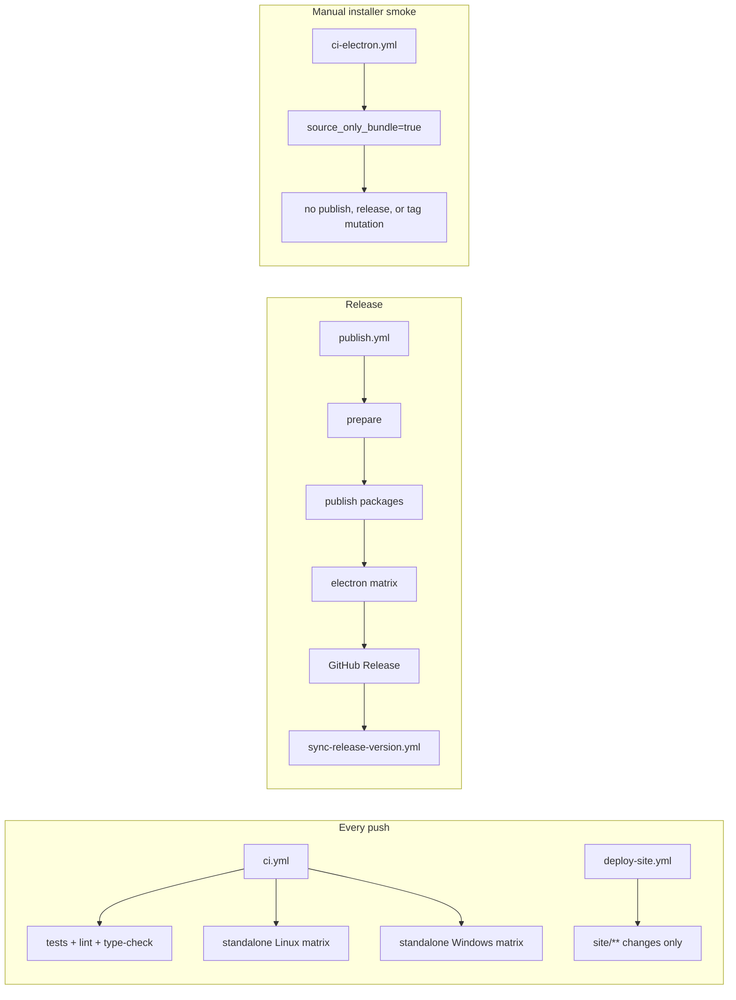
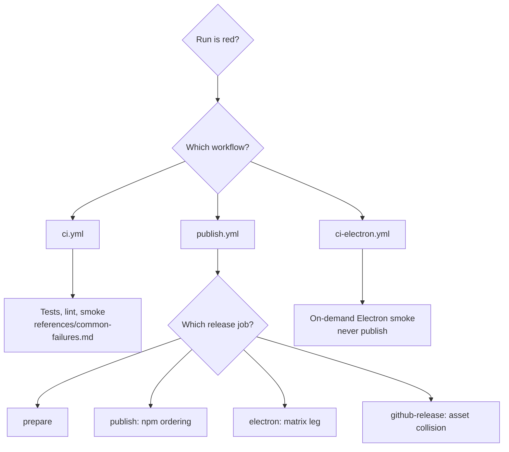
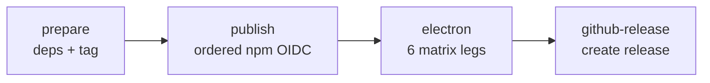

# CI Troubleshoot

Diagnose CI failures for pi-agent-dashboard. The repo has 6 workflows arranged in two flows:



Full per-workflow detail: [`references/workflow-taxonomy.md`](references/workflow-taxonomy.md).

## First moves — always run these

```bash
npx tsx .pi/skills/ci-troubleshoot/scripts/list-recent-runs.ts                  # last 10 runs across all workflows
npx tsx .pi/skills/ci-troubleshoot/scripts/list-recent-runs.ts --failed         # only failed
npx tsx .pi/skills/ci-troubleshoot/scripts/show-failed-run.ts <run-id>          # failed steps + log tails
npx tsx .pi/skills/ci-troubleshoot/scripts/show-failed-run.ts                   # most recent failed run
```

These wrap `gh run list`, `gh run view --log-failed`, and similar. You need `gh auth status` to be authenticated.

> Scripts are TypeScript (cross-platform). All invocations use `npx tsx` so they work on Linux, macOS, and Windows. `tsx` is already a project dep; `gh` CLI is cross-platform.

## Triage decision tree



## Release pipeline — `publish.yml`

The release flow runs 4 jobs strictly in this order:



`needs:` chains lock this order. **Do not remove `needs: [prepare, publish]` from `electron`** — the electron build's bundled server runs `npm install` for `@blackbelt-technology/*`, which must already exist on npm. Locked by `packages/shared/src/__tests__/publish-workflow-contract.test.ts`.

Full walkthrough with per-job failure modes: [`references/release-pipeline.md`](references/release-pipeline.md).

## Known failure modes

Maintained in [`references/common-failures.md`](references/common-failures.md). Headline catalog:

| Failure | Where | Diagnosis | Fix |
|---------|-------|-----------|-----|
| `verify-lockfile-versions.mjs` fails | `prepare` | Cross-ref specifier in lockfile doesn't match bumped version | Regenerate lockfile + commit; or fix `scripts/sync-versions.js` |
| CHANGELOG already has `## [X.Y.Z]` | `prepare` | You're re-dispatching with a version that was already promoted | Bump to a new version, or revert the CHANGELOG section |
| `npm publish` 403 | `publish` | OIDC trusted publisher not configured for that package | Configure in npm web UI; or temporarily use NPM_TOKEN |
| Electron matrix leg fails | `electron` | Missing prebuild for node-pty/better-sqlite3 on that OS/arch | Check `bundle-server.mjs` GO/NO-GO guard; rebuild prebuilds |
| `shell: bash` on Windows runner | any | Lint test `no-bash-on-windows.test.ts` flags it | Remove `shell: bash` or guard with `if: runner.os != 'Windows'` |
| Electron job missing `needs:` | repo-lint | `publish-workflow-contract.test.ts` failed | Restore `needs: [prepare, publish]` |
| `Cannot find module @blackbelt-technology/...` in electron | `electron` | `publish` job didn't run or failed; bundled server can't resolve from npm | Check `publish` job — re-run only if it failed; never bypass |
| Fastify crashes in bundled server smoke | any using node | Bad Node version pinned in workflow | Bump `node-version:` to ≥ 22.18.0 |
| Loud-but-harmless `EADDRINUSE` in smoke | smoke job | Concurrent server spawns | Usually self-recovering; check next log lines |
| `electron` + `github-release` SKIPPED despite green `publish` | `electron` | Tag-push path skips `tag-and-push`; a skipped needs-ancestor poisons electron's DEFAULT `if: success()` | Give `electron` explicit `if: ${{ !cancelled() && needs.publish.result == 'success' }}` (mirrors `publish`'s guard). First hit v0.6.1 |
| `✗ koffi prebuild GO/NO-GO failed at ...koffi\build\koffi\win32_x64\koffi.node` | `electron` (both win32 legs) | koffi@3.x ships the prebuild at `@koromix/koffi-win32-x64/win32_x64/koffi.node`; the 2.x `koffi/build/...` path is never created | Update `bundle-server.mjs` guard to check the 3.x @koromix path first, 2.x fallback. First hit v0.6.1 |
| arm64 NSIS smoke: `pi-dashboard.exe not found ... after 150s` | `electron` (win32-arm64) | x64 runner can't execute an arm64 `Setup.exe`/app, so silent install extracts nothing | Guard the NSIS install-smoke step `if: matrix.platform == 'win32' && matrix.arch == 'x64'`. arm64 installer still builds+ships. First hit v0.6.1 |

## Reading gh logs efficiently

```bash
# Last 10 runs (all workflows, this branch)
gh run list -L 10

# Last 5 failed runs across all workflows
gh run list -L 50 | grep -E 'failure|cancelled' | head -5

# Get a specific run, only the failed steps
gh run view <run-id> --log-failed

# Watch a running workflow (live tail)
gh run watch <run-id>

# Re-run only the failed jobs (preserves successful ones, saves CI time)
gh run rerun <run-id> --failed

# Re-run from scratch (rare; usually for flakes)
gh run rerun <run-id>
```

`gh run view --log-failed` is the highest-leverage one — it pulls only failed-step output, which is what you want 95% of the time.

**Rerun gotcha (tag-push releases):** `gh run rerun <id> --failed` does NOT re-dispatch skipped downstream reusable-workflow jobs (e.g. `electron`) even after `publish` flips green — they stay `skipped`. After a smoke-**gate** flake on a tag-push release, re-push the tag for a clean single-pass run instead: `git push --delete origin vX.Y.Z && git push origin vX.Y.Z`. `publish` is idempotent (skips already-published packages), so re-pushing the tag is safe.

## When the failure is repo-lint

Repo-lint tests fail the `ci` job specifically. They're listed in `debug-dashboard/references/test-failure-triage.md` → "Repo-lint tests". Fix the file that violated the rule. **Don't loosen the lint** — each one exists because of a real regression.

## Related skills

- `release-cut` — trigger a release (cuts the tag that fires `publish.yml`)
- `release-revoke` — rollback / yank a release
- `debug-dashboard` — when the bug only reproduces locally
- `implement` — back to writing the fix
- `code-review` — review the fix before re-pushing
