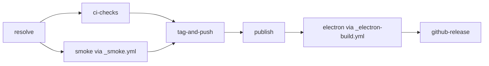

# Release Pipeline: `publish.yml`

`publish.yml` gates public release mutation behind tests and standalone installation smoke.

## Entry paths

- **Tag push:** `resolve` reads the `v*` tag. `tag-and-push` is skipped. `publish.if` accepts the skip only when `ci-checks` and `smoke` pass.
- **Manual dispatch:** `resolve` validates the version input. After both gates pass, `tag-and-push` updates workspace versions and cross-package ranges, regenerates and verifies the lockfile, promotes the changelog, commits, tags, and pushes.

## Jobs

### `resolve`

Computes `version`, `tag`, prerelease state, and the exact ref. It has no release side effects.

### `ci-checks`

Runs install, lint, full tests, and build on Node 22. A failure prevents tagging and publishing.

### `smoke`

Calls `_smoke.yml` against the resolved ref. The reusable workflow runs the standalone installation matrix without public release mutation.

### `tag-and-push`

Runs only for manual dispatch after both gates pass. It creates the release commit and tag. Tag-push entry skips this job.

### `publish`

Needs `resolve`, `ci-checks`, `smoke`, and `tag-and-push`. It accepts `tag-and-push` as `success` for dispatch or `skipped` for tag push. Packages publish in dependency order; already-published versions are skipped.

### `electron`

Needs `[resolve, publish]` and calls `_electron-build.yml`. Do not remove the publish dependency: the bundled server installs the just-published `@blackbelt-technology/*` packages.

### `github-release`

Needs the completed publish and Electron artifacts, then creates the GitHub Release.

## Common failures

| Failure | Likely cause | Action |
|---|---|---|
| `ci-checks` fails | Lint, test, type, or build regression | Inspect the failed step; fix before release |
| `smoke` fails | Published-install shape or platform regression | Inspect the failing `_smoke.yml` matrix leg |
| Lockfile verification fails | Workspace versions and cross-package ranges differ | Re-run version sync and lockfile generation |
| npm publish returns 403 | Trusted publisher or OIDC configuration is missing | Repair npm trusted-publisher configuration |
| Electron cannot resolve a Dashboard package | `publish` failed or dependency ordering changed | Restore `electron.needs: [resolve, publish]`; never bypass publish |
| Native prebuild gate fails | Required platform artifact is absent | Fix the package or bundle guard before release |
| GitHub Release step fails on existing assets | Tag or release already exists | Inspect the existing release; do not overwrite blindly |

Current job details and invariants live in `.github/workflows/AGENTS.md` and `packages/shared/src/__tests__/publish-workflow-contract.test.ts`.
