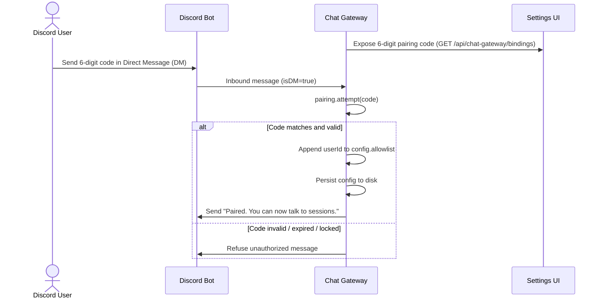

# Chat Gateway Setup Guide

Inbound chat control plane plugin (`@blackbelt-technology/pi-dashboard-chat-gateway-plugin`). Fronts dashboard as headless browser-protocol client. Bridges chat platforms (Discord shipped) to dashboard pi sessions.

## Architecture & Operation

- Plugin runs in dashboard server process (`packages/chat-gateway`).
- Acts as headless browser-protocol client. Subscribes to frames via `ctx.subscribeSession`.
- Drives sessions via raw-control lane: `send_prompt`, `prompt_response`, `abortSession`, `spawnSession`.
- Requires zero bridge protocol changes; requires zero server wire changes.
- Streaming deltas render as throttled in-place Discord message edits (`editThrottleMs`, default 1000 ms).
- Long assistant responses chunk past 2000-character Discord limit into sequential messages.
- Interactive prompts (`ask_user`, `confirm`, `select`) render native Discord buttons and select menus.
- Complex prompt types (`multiselect`, `batch`) sequence sub-prompts, collect answers, submit single `prompt_response`.
- Web UI prompt response dismisses pending Discord controls automatically (`prompt_dismiss` / `prompt_cancel`).
- Plugin stays inert when `token` omitted; defers importing `discord.js`.

## Discord Bot Setup

1. Open Discord Developer Portal: `https://discord.com/developers/applications`.
2. Click **New Application**. Enter bot name. Confirm dialog.
3. Select **Bot** in left sidebar.
4. Click **Reset Token**. Copy token string immediately. Store token securely.
5. Scroll to **Privileged Gateway Intents**.
6. Enable **Message Content Intent**. (Required: bot reads inbound chat message text).
7. Select **OAuth2** → **URL Generator** in left sidebar.
8. Check scopes:
   - `bot`
   - `applications.commands`
9. Check bot permissions:
   - **Send Messages**
   - **Read Message History**
   - **Embed Links**
10. Copy generated authorization URL at page bottom.
11. Open URL in browser. Select target Discord server. Authorize bot join.

## Dashboard Configuration

1. Open dashboard web client.
2. Navigate to **Settings** → **General** → **Chat Gateway**.
3. Paste bot token into **Discord Bot Token** field.
4. Save configuration.
5. Server treats `token` as `writeOnly` schema property. Server redacts token from client payloads; server never logs token.

## Mandatory Spawn Boundary (`allowedRoots`)

- Whitelist array `allowedRoots` governs all session spawn and attach targets.
- Empty `allowedRoots` refuses every session spawn. Empty `allowedRoots` refuses interactive attach.
- Fail-closed boundary: missing directory, empty whitelist, or traversal candidate returns explicit refusal.
- Containment check resolves symlinks via `fs.realpathSync.native`.
- Non-existent child paths resolve nearest existing ancestor before checking prefix containment.
- Path traversal (`../`) and symlink escapes outside `allowedRoots` fail check.

## Channel-to-Session Binding Resolution

Session binding resolves per channel or thread identity `(platform, channelId, threadId)`.
Canonical key format: `platform:channelId:threadId` (threads key independently from parent channel).

Precedence ladder:
1. **Persisted binding**: Reads active binding from `~/.pi/dashboard/chat-gateway/bindings.json`.
   - Active connected session receives prompt.
   - Ended session resumes automatically from transcript via `resume(continue)`.
   - Disconnected live session emits unreachable error into channel (`no bridge connection`).
2. **Fixed mapping (`fixedMap`)**: Resolves `fixedMap[channelKey]`. If configured and within `allowedRoots`, spawns new session in mapped directory.
3. **Default directory (`defaultCwd`)**: Falls back to `defaultCwd`. If configured and within `allowedRoots`, spawns new session.
4. **Interactive attach**: Attaches to running session when exactly one open session exists within `allowedRoots`.
   - Zero open sessions in range: refuses attach; prompts operator to configure `fixedMap` or `defaultCwd`.
   - Multiple open sessions in range: refuses attach; prevents ambiguous session hijack.
5. **Refusal**: Returns explicit reason if candidate directory fails `allowedRoots` or resolution finds no target.

## L1 Pairing Flow

Initial contact requires pairing handshake before user interacts with sessions:

- Gateway mints 6-digit numeric pairing code at startup.
- Operator views pairing code in **Settings** → **General** → **Chat Gateway** or via API.
- Code validity window: 15 minutes TTL (`DEFAULT_TTL_MS = 900_000`).
- Lockout threshold: 10 failed attempts locks state machine (`DEFAULT_MAX_ATTEMPTS = 10`).
- Pairing accepts Direct Messages only (`isDM: true`).
- Guild channel pairing attempts ignored; prevents pairing code exposure in shared channels.
- Successful redemption consumes code. Appends sender Discord `userId` to `allowlist`. Persists updated `allowlist` to dashboard config.

## Authorization Semantics

Every inbound action fails closed. Refusals emit distinct diagnostic reasons:

| Level | Scope | Config Key | Description | Refusal Reason |
|---|---|---|---|---|
| L1 | User Identity | `allowlist` | Array of Discord user IDs allowed to interact with sessions. | `not_allowlisted` |
| L2 | Bind Authority | `admins` | Array of Discord user IDs allowed to bind channels to directories. Must also exist in `allowlist`. | `not_admin` |
| L4 | Channel Isolation | `groupChannels` | Guild channel IDs explicitly enabled. DMs bypass check (`isDM: true`). Non-listed guild channels ignored. | `group_channel_not_opted_in` |
| - | Identity Validation | - | Empty or malformed user ID string. | `ambiguous_identity` |

Mid-turn steering prefix:
- Messages starting with `steerPrefix` (default `!`) dispatch with delivery mode `steer`.
- Regular messages dispatch with delivery mode `followUp`.

## L3 Tool Guard (`toolPolicy` + `guardExtension`)

Optional in-session execution boundary. Protects host from unreviewed tool execution.

- Scoped strictly to gateway-SPAWNED sessions.
- Attached sessions treat local owner as trusted; attached sessions remain ungated.
- Requires companion extension specified in `guardExtension` (installed package name or absolute path).
- Gateway passes policy into session spawn arguments; gateway never fabricates extension name.
- Pure decision engine (`packages/chat-gateway/src/guard/policy.ts`):
  - `allow`: tool runs without prompt.
  - `approval`: tool requires interactive operator approval.
  - `defaultAction`: disposition for unlisted tools. Values: `"deny"` (default) or `"approve"`.
- Decision precedence: explicit `allow` > explicit `approval` > `defaultAction`.
- Hard enforcement: guard returns `{ block: true }` on pi `tool_call` event; prevents model bypassing prompt checks.

## Inspection Endpoint

Read-only inspection API for monitoring and settings integration:

`GET /api/chat-gateway/bindings`

- Endpoint active only when gateway configured (`token` set) and running. Unconfigured gateway returns 404.
- Returns JSON payload:
  - `bindings`: array of active binding objects:
    - `platform`: chat platform identifier (`"discord"`).
    - `channelId`: Discord channel snowflake string.
    - `threadId`: Discord thread snowflake string (optional).
    - `sessionId`: Bound dashboard session ID.
    - `cwd`: Working directory bound to channel.
    - `boundBy`: Discord user ID of binding creator.
    - `source`: Resolution source (`"persisted"`, `"fixed-map"`, `"default"`, `"attach"`, `"spawn"`).
    - `createdAt`: Timestamp in epoch milliseconds.
  - `status`: gateway status object:
    - `running`: boolean execution status.
    - `boundChannels`: integer count of active channel bindings.
    - `pendingSpawns`: integer count of in-flight spawn requests.
    - `pairingCode`: active 6-digit pairing code string (returns empty string when consumed, expired, or locked).

## Configuration Reference

Derived from `packages/chat-gateway/src/configSchema.json`:

| Key | Type | Default | Description |
|---|---|---|---|
| `enabled` | `boolean` | `true` | Master toggle. Gateway remains inert without valid `token`. |
| `token` | `string` | - | Discord bot token. `writeOnly` schema property; redacted from client responses, never logged. |
| `allowedRoots` | `string[]` | `[]` | Mandatory directory whitelist for session spawns. Empty array blocks all spawns. Resolved with realpath. |
| `fixedMap` | `object` | `{}` | Map of `channelKey` (`platform:channelId:threadId`) to target `cwd`. Gated by `allowedRoots`. |
| `defaultCwd` | `string` | - | Fallback working directory for unbound channels. Gated by `allowedRoots`. |
| `allowlist` | `string[]` | `[]` | L1 identity allowlist: Discord user IDs authorized to talk to sessions. |
| `admins` | `string[]` | `[]` | L2 binding authority: Discord user IDs authorized to bind channels to directories. |
| `groupChannels` | `string[]` | `[]` | L4 channel allowlist: guild channel IDs opted into gateway interaction. Unlisted guild channels ignored. |
| `steerPrefix` | `string` | `"!"` | Inbound message prefix forcing delivery mode `steer` instead of `followUp`. |
| `editThrottleMs` | `number` | `1000` | Minimum milliseconds between Discord message edit API calls per channel. Minimum `0`. |
| `toolPolicy` | `object` | - | L3 tool execution policy for gateway-spawned sessions. Contains `allow`, `approval`, `defaultAction`. |
| `toolPolicy.allow` | `string[]` | - | Tool names permitted to execute without confirmation. |
| `toolPolicy.approval` | `string[]` | - | Tool names requiring interactive confirmation before execution. |
| `toolPolicy.defaultAction` | `string` | `"deny"` | Disposition for unlisted tool names. Enum: `"deny"`, `"approve"`. |
| `guardExtension` | `string` | - | Package name or absolute file path of companion L3 tool guard extension. Required for guard loading. |

See change: add-chat-gateway.
