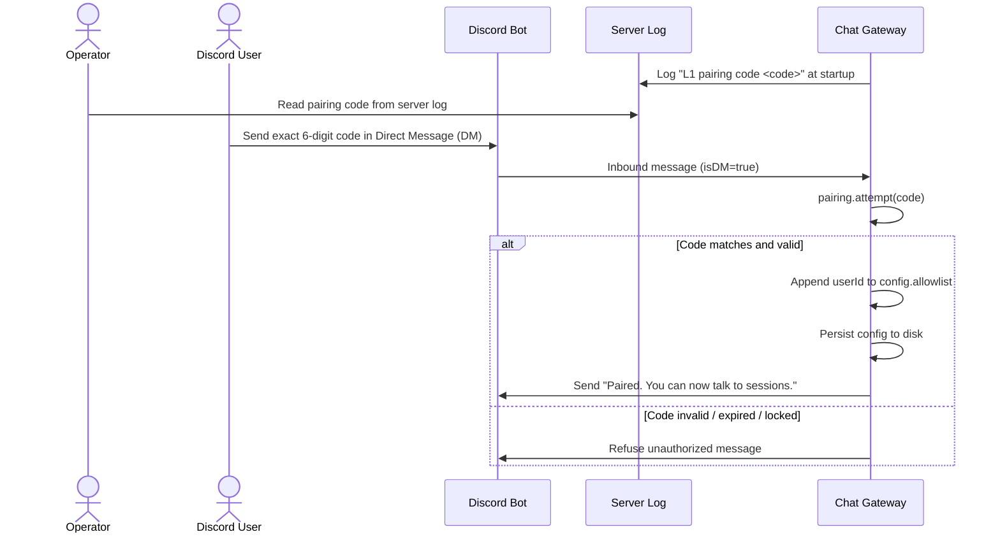
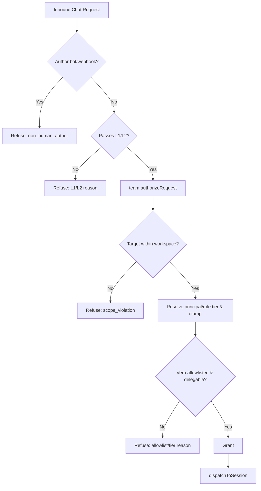

# Chat Gateway Setup Guide

Inbound chat control plane plugin (`@blackbelt-technology/pi-dashboard-chat-gateway-plugin`). Fronts dashboard as headless browser-protocol client. Bridges chat platforms (Discord shipped) to dashboard pi sessions.

## Architecture & Operation

- Plugin runs in dashboard server process (`packages/chat-gateway`).
- Acts as headless browser-protocol client. Subscribes to frames via `ctx.subscribeSession`.
- Drives sessions via raw-control lane: `send_prompt`, `prompt_response`, `abortSession`, `spawnSession`.
- Requires zero bridge protocol changes; requires zero server wire changes.
- Streaming deltas render as throttled in-place Discord message edits (`editThrottleMs`, default 1000 ms).
- Long assistant responses chunk past 2000-character Discord limit into sequential messages.
- Interactive prompts (`ask_user`, `confirm`, `select`) render native Discord buttons and select menus.
- Complex prompt types (`multiselect`, `batch`) sequence sub-prompts, collect answers, submit single `prompt_response`.
- Web UI prompt response dismisses pending Discord controls automatically (`prompt_dismiss` / `prompt_cancel`).
- Plugin stays inert when `token` omitted; defers importing `discord.js`.

## Discord Bot Setup

1. Open Discord Developer Portal: `https://discord.com/developers/applications`.
2. Click **New Application**. Enter bot name. Confirm dialog.
3. Select **Bot** in left sidebar.
4. Click **Reset Token**. Copy token string immediately. Store token securely.
5. Scroll to **Privileged Gateway Intents**.
6. Enable **Message Content Intent**. (Required: bot reads inbound chat message text).
7. Select **OAuth2** → **URL Generator** in left sidebar.
8. Check scopes:
   - `bot`
   - `applications.commands`
9. Check bot permissions:
   - **Send Messages**
   - **Read Message History**
   - **Embed Links**
10. Copy generated authorization URL at page bottom.
11. Open URL in browser. Select target Discord server. Authorize bot join.

## Dashboard Configuration

1. Open dashboard web client.
2. Navigate to **Settings** → **General** → **Chat Gateway**.
3. Paste bot token into **Discord Bot Token** field.
4. Save configuration.
5. Server treats `token` as `writeOnly` schema property. Server redacts token from client payloads; server never logs token.

## Mandatory Spawn Boundary (`allowedRoots`)

- Whitelist array `allowedRoots` governs all session spawn and attach targets.
- Empty `allowedRoots` refuses every session spawn. Empty `allowedRoots` refuses interactive attach.
- Fail-closed boundary: missing directory, empty whitelist, or traversal candidate returns explicit refusal.
- Containment check resolves symlinks via `fs.realpathSync.native`.
- Non-existent child paths resolve nearest existing ancestor before checking prefix containment.
- Path traversal (`../`) and symlink escapes outside `allowedRoots` fail check.

## Channel-to-Session Binding Resolution

Session binding resolves per channel or thread identity `(platform, channelId, threadId)`.
Canonical key format: `platform:channelId:threadId` (threads key independently from parent channel).

Precedence ladder:
1. **Persisted binding**: Reads active binding from `~/.pi/dashboard/chat-gateway/bindings.json`.
   - Active connected session receives prompt.
   - Ended session resumes automatically from transcript via `resume(continue)`.
   - Disconnected live session emits unreachable error into channel (`no bridge connection`).
2. **Fixed mapping (`fixedMap`)**: Resolves `fixedMap[channelKey]`. If configured and within `allowedRoots`, spawns new session in mapped directory.
3. **Default directory (`defaultCwd`)**: Falls back to `defaultCwd`. If configured and within `allowedRoots`, spawns new session.
4. **Interactive attach**: Attaches to running session when exactly one open session exists within `allowedRoots`.
   - Zero open sessions in range: refuses attach; prompts operator to configure `fixedMap` or `defaultCwd`.
   - Multiple open sessions in range: refuses attach; prevents ambiguous session hijack.
5. **Refusal**: Returns explicit reason if candidate directory fails `allowedRoots` or resolution finds no target.

## L1 Pairing Flow

Initial contact requires pairing handshake before user interacts with sessions:

- Gateway mints 6-digit numeric pairing code at startup.
- Server logs pairing code once at startup: `"L1 pairing code <code>"`.
- HTTP API returns no pairing code; prevents unauthenticated pairing bypass.
- Settings panel renders guidance text only; never displays code.
- Operator reads pairing code from server log.
- Inbound DM from unknown user containing exact matching 6-digit code pairs user.
- Successful pairing consumes code; appends sender Discord `userId` to `allowlist`; persists updated `allowlist` to disk config.
- Code expires after 15 minutes TTL (`DEFAULT_TTL_MS = 900_000`).
- State machine locks after 10 failed attempts (`DEFAULT_MAX_ATTEMPTS = 10`).
- Pairing accepts Direct Messages only (`isDM: true`).
- Guild channel pairing attempts ignored; prevents pairing code exposure in shared channels.

## Authorization Semantics

Every inbound action fails closed. Refusals emit distinct diagnostic reasons:

| Level | Scope | Config Key | Description | Refusal Reason |
|---|---|---|---|---|
| L1 | User Identity | `allowlist` | Array of Discord user IDs allowed to interact with sessions. | `not_allowlisted` |
| L2 | Bind Authority | `admins` | Array of Discord user IDs allowed to bind channels to directories. Must also exist in `allowlist`. | `not_admin` |
| L4 | Channel Isolation | `groupChannels` | Guild channel IDs explicitly enabled. DMs bypass check (`isDM: true`). Non-listed guild channels ignored. | `group_channel_not_opted_in` |
| - | Identity Validation | - | Empty or malformed user ID string. | `ambiguous_identity` |

Mid-turn steering prefix:
- Messages starting with `steerPrefix` (default `!`) dispatch with delivery mode `steer`.
- Regular messages dispatch with delivery mode `followUp`.

## L3 Tool Guard (`toolPolicy` + `guardExtension`)

Optional in-session execution boundary. Protects host from unreviewed tool execution.

- Scoped strictly to gateway-SPAWNED sessions.
- Attached sessions treat local owner as trusted; attached sessions remain ungated.
- Requires companion extension specified in `guardExtension`: package subpath (`@blackbelt-technology/pi-dashboard-chat-gateway-plugin/guard`) or absolute path to guard entry.
- Gateway passes policy into session spawn arguments; gateway never fabricates extension name.
- Pure decision engine (`packages/chat-gateway/src/guard/policy.ts`):
  - `allow`: tool runs without prompt.
  - `approval`: tool requires interactive operator approval.
  - `defaultAction`: disposition for unlisted tools. Values: `"deny"` (default) or `"approve"`.
- Decision precedence: explicit `allow` > explicit `approval` > `defaultAction`.
- Hard enforcement: guard returns `{ block: true }` on pi `tool_call` event; prevents model bypassing prompt checks.

## Inspection Endpoint

Read-only inspection API for monitoring and settings integration:

`GET /api/chat-gateway/bindings`

- Endpoint active only when gateway configured (`token` set) and running. Unconfigured gateway returns 404.
- Carries `networkGuard` `preHandler` matching core `/api` routes.
- HTTP API omits live L1 pairing code; prevents pairing bypass over HTTP.
- Returns JSON payload:
  - `bindings`: array of active binding objects:
    - `platform`: chat platform identifier (`"discord"`).
    - `channelId`: Discord channel snowflake string.
    - `threadId`: Discord thread snowflake string (optional).
    - `sessionId`: Bound dashboard session ID.
    - `cwd`: Working directory bound to channel.
    - `boundBy`: Discord user ID of binding creator.
    - `source`: Resolution source (`"persisted"`, `"fixed-map"`, `"default"`, `"attach"`, `"spawn"`).
    - `createdAt`: Timestamp in epoch milliseconds.
  - `status`: gateway status object:
    - `running`: boolean execution status.
    - `boundChannels`: integer count of active channel bindings.
    - `pendingSpawns`: integer count of in-flight spawn requests.

## Team Controls

> **Status.** Implemented: tier model + authorization chokepoint, workspace scoping and `allowedRoots` narrowing, outbound filter + pacing, append-only command log, disarm, question gating, trust-failure detection, channel provisioning with create-time overwrites, access reconciliation, and the workspace↔channel binding store. Not yet wired: the dashboard configuration surface (tasks 8.x) and its Playwright specs — so reconciliation currently runs at activation and on every workspace change, and the config-write path will call it once that surface lands.

Layered multi-user governance under L1 allowlist and L2 admins. Enforces role-based tiering, workspace scoping, outbound payload filtering, and rate pacing.

### Tier Model & Authorization Chokepoint

- Tiers: `observe` < `control` < `operate` (`tiers.js`).
- Shared verb tiers read directly from `GENERATED_TOOLS` (`@blackbelt-technology/pi-dashboard-mcp-server-plugin/manifest`); prevents web/chat/MCP drift.
- Allowed chat verbs restricted to curated `CHAT_COMMAND_ALLOWLIST` (`list_sessions`, `send_prompt`, `abort`, `spawn_session`, `resume_session`, `prompt_response`, `get_session_diff`, `get_session_file`, `get_transcript`, `get_tool_result`). Unlisted verbs refused.
- `NON_DELEGABLE` verbs (`mint_device_token`, `set_providers`, `install_package`, `tunnel_connect`) refused across all tiers/ceilings; non-configurable.
- Global ceiling defaults to `observe`. Acts as HARD maximum; caps resolved principal tier. Per-binding ceiling may only LOWER global ceiling; effective ceiling evaluates as `min(binding, global)`. Prevents global `observe` defeat by stale binding `operate`. `clampTier` caps, never raises. Unconfigured layer grants nothing.
- Tier resolution: explicit identifier mapping outranks platform role; highest wins. Missing mapping refuses (`no_principal_mapping`); fails closed without fallback.
- Platform roles map at most `control`. `operate` requires explicit identifier mapping; role mapped to `operate` rejected with `role_cannot_map_to_operate_requires_explicit_identifier`.
- Nine distinct refusal reasons: `non_human_author`, `unbound_channel`, `no_principal_mapping`, `scope_violation`, `disarmed`, `non_delegable_verb`, `verb_not_allowlisted`, `verb_unknown_tier`, `insufficient_tier`. Refusal emits exact cause.
- Bot and webhook authors refused first before tier checks.
- Sits under L1/L2: only refuses, never bypasses L1/L2.
- Single chokepoint: action requests pass `team.authorizeRequest(...)` returning `Grant | Refusal`. `dispatchToSession` requires and runtime-guards `Grant`.
- Interactive prompts: answering requires `>= control`. Invoker-only when specific principal initiated turn; unprompted questions answerable by any `control` principal.
- Config mutations and audit log inspection refused from chat; dashboard only.

### Workspace Scope & `allowedRoots` Narrowing

- Precedence: persisted binding > bound workspace folders > `fixedMap` > default cwd.
- Narrowing invariant: workspace binding only narrows `allowedRoots`, never widens. Workspace folders outside `allowedRoots` remain inert and skipped during spawn/attach.
- Real-path (`fs.realpathSync.native`) containment checked on every transition and resume.
- Scope containment evaluated inside chokepoint: target session cwd must reside inside bound workspace folders, else `scope_violation`. Free-text cwd in chat never resolves targets.
- Channel→workspace bindings in the separate provisioning store `channels.json`; session↔thread routing stays in `bindings.json`. One channel per workspace; records retained after a binding goes inactive. Channel and history never deleted.
- Trust failure: host trust-gated verb returning no-op (e.g. `assignSessionRef` returning `false`) marks layer unhealthy and refuses command. Requires plugin manifest `priority: 100` (`<= 100`). Sticky; first cause wins.

### Output Filtering & Pacing

- Mirror levels: `names-only` (default), `names-and-diffs`, `full-transcript`.
- `names-only`: mirrors assistant prose + tool names + target basename only; suppresses tool arguments, results, diffs, and terminal output.
- Stated filter boundary: filter governs structured payloads only. Assistant prose mirrors verbatim at all levels and may quote files or diffs. Layer does not redact assistant prose (`FILTER_BOUNDARY_NOTE`).
- Raising mirror level forward-only; past messages never retroactively rewritten.
- Explicit pulls (`get_session_diff`, `get_session_file`, `get_tool_result`) gated by principal tier, not mirror level.
- Truncation appends explicit elision marker (`… [elided N characters]`).
- Outbound pacing: 5 messages per 5 seconds per channel (`RATE_WINDOW_MS = 5000`, `RATE_MAX_POSTS = 5`). Max one post in flight per thread. Exhausted budget coalesces queued messages without drops.
- Mirroring independent of action authorization; continues while disarmed; ignores principal tiers.

### Rollback & Lifecycle Safety

- Disarm switch: any principal at `>= observe` can disarm via chat; re-arm allowed from dashboard only. Chat re-arm refused.
- Disarm blocks action requests; passive mirroring continues.
- Workspace deletion marks binding inactive; leaves channel and message history intact. Channel deletion drops binding; leaves running sessions active.
- Channel provisioning executes atomic create-with-overwrites (`@everyone` view denied); missing overwrite permissions aborts channel creation and flags plugin health.
- Missing bot token leaves plugin inert (no adapter, socket, or timers).
- Team layer optional to `createChatGateway`; omitting `teamControls` restores baseline L1/L2 operation.
- Command log: append-only ring buffer bounded by `auditRetention` (default 10000, max 1000000); no edit or delete operations.

## Configuration Reference

Derived from `packages/chat-gateway/src/configSchema.json`:

| Key | Type | Default | Description |
|---|---|---|---|
| `enabled` | `boolean` | `true` | Master toggle. Gateway remains inert without valid `token`. |
| `token` | `string` | - | Discord bot token. `writeOnly` schema property; redacted from client responses, never logged. |
| `allowedRoots` | `string[]` | `[]` | Mandatory directory whitelist for session spawns. Empty array blocks all spawns. Resolved with realpath. |
| `fixedMap` | `object` | `{}` | Map of `channelKey` (`platform:channelId:threadId`) to target `cwd`. Gated by `allowedRoots`. |
| `defaultCwd` | `string` | - | Fallback working directory for unbound channels. Gated by `allowedRoots`. |
| `allowlist` | `string[]` | `[]` | L1 identity allowlist: Discord user IDs authorized to talk to sessions. |
| `admins` | `string[]` | `[]` | L2 binding authority: Discord user IDs authorized to bind channels to directories. |
| `groupChannels` | `string[]` | `[]` | L4 channel allowlist: guild channel IDs opted into gateway interaction. Unlisted guild channels ignored. |
| `steerPrefix` | `string` | `"!"` | Inbound message prefix forcing delivery mode `steer` instead of `followUp`. |
| `editThrottleMs` | `number` | `1000` | Minimum milliseconds between Discord message edit API calls per channel. Minimum `0`. |
| `toolPolicy` | `object` | - | L3 tool execution policy for gateway-spawned sessions. Contains `allow`, `approval`, `defaultAction`. |
| `toolPolicy.allow` | `string[]` | - | Tool names permitted to execute without confirmation. |
| `toolPolicy.approval` | `string[]` | - | Tool names requiring interactive confirmation before execution. |
| `toolPolicy.defaultAction` | `string` | `"deny"` | Disposition for unlisted tool names. Enum: `"deny"`, `"approve"`. |
| `guardExtension` | `string` | - | Package subpath (`@blackbelt-technology/pi-dashboard-chat-gateway-plugin/guard`) or absolute file path to guard entry. Required for guard loading. |
| `teamControls` | `object` | - | Team-controls governance layer. Absent config defaults to fail-closed (`ceiling: observe`, no bindings). |
| `teamControls.guildId` | `string` | - | Discord guild a workspace channel is provisioned in. Required for provisioning (`@everyone` is this guild's id); a binding without it is reported as a failure, not silently skipped. |
| `teamControls.ceiling` | `string` | `"observe"` | HARD maximum tier any principal may resolve to. A per-binding ceiling may only LOWER this, never raise it. |
| `teamControls.disarmed` | `boolean` | `false` | Emergency kill switch. Refuses action requests while continuing passive mirroring. Re-armed from dashboard only. |
| `teamControls.auditRetention` | `integer` | `10000` | In-memory command-log ring-buffer capacity. Range `1` to `1000000`. |
| `teamControls.bindings` | `object` | `{}` | Per-workspace team policies keyed by workspace ID. |
| `teamControls.bindings.<id>.principals` | `object` | `{}` | Map of Discord user ID (snowflake) to tier (`observe`, `control`, `operate`). |
| `teamControls.bindings.<id>.roles` | `object` | `{}` | Map of Discord role ID to tier (`observe`, `control`). Roles cannot grant `operate`. |
| `teamControls.bindings.<id>.mirrorLevel` | `string` | `"names-only"` | Outbound mirror filter: `names-only`, `names-and-diffs`, `full-transcript`. |
| `teamControls.bindings.<id>.ceiling` | `string` | - | Per-binding tier ceiling. May only LOWER global ceiling; effective ceiling is `min(binding, global)`. |

See change: add-chat-gateway, add-chat-gateway-team-controls.
