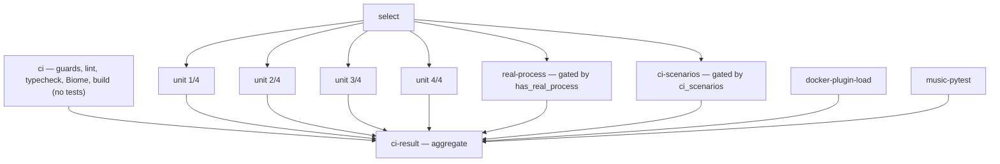
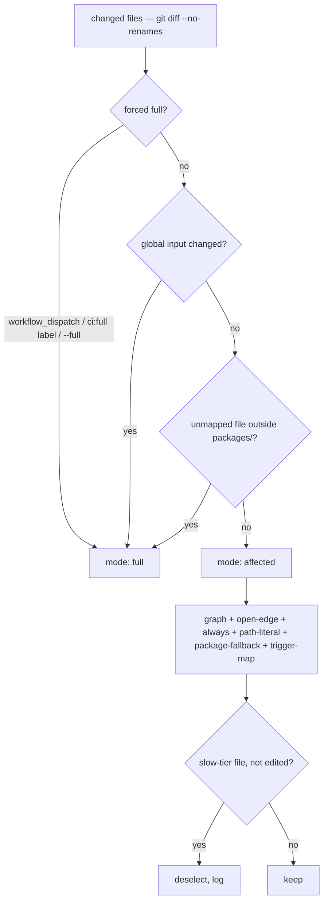

# ci.md — CI test selection

Affected-test selection in CI. Change: speed-up-ci-affected-tests.

## Overview

`.github/workflows/ci.yml`. Triggers: `push` develop, `pull_request` develop, `workflow_dispatch`. Jobs run parallel. Wall time = slowest job, not sum. Superseded PR runs cancelled (`concurrency` group per PR number).



Jobs:

- `select` — runs `scripts/select-affected-tests.mjs`. Writes `selection.json`. Outputs `mode`, `has_real_process`, `ci_scenarios`. Uploads artifact `test-selection`.
- `ci` — guards, lint, typecheck, Biome, build. No tests.
- `unit` — vitest, 4 shards. Matrix `[1, 2, 3, 4]`. `SHARD_COUNT = 4` exported from `scripts/test-selection/decide.mjs`. Matrix length must equal `SHARD_COUNT`.
- `real-process` — phase `packages/server/vitest.real-process.config.ts`. Own runner — never concurrent with unit shards. `maxWorkers` 2 + one CI retry from config.
- `ci-scenarios` — packaging scenarios, `RUN_CI_SCENARIOS=1`. Gated files only, never whole `scripts` project. `npm pack` / `npm publish --dry-run` CPU spike starves 5s-timeout tests → held out. Runs `pnpm run test:ci-scenarios <files>`.
- `docker-plugin-load` — boots image, asserts browser plugin loads (`scripts/verify-docker-plugin-load.mjs`). Required check, every PR + develop push.
- `music-pytest` — quick-tier pytest: `packages/music-production/tests` + `packages/video-production/tests/redaction`. Deep tier (essentia, beat_this, demucs, torch) self-skips.
- `ci-result` — aggregate. `needs` all above. Runs `scripts/test-selection/check-result.mjs`.

Baseline before change (runs 36753089286, 36474511507): 44–50 min wall. Serial `pnpm test` 28–33 min. `test:ci-scenarios` 11–12 min. Full suite 32.3 file-min.

## Selection layers

Decision function: `scripts/test-selection/decide.mjs`, `decide()`. Pure, no I/O. Layer order = precedence. First layer selecting a file gets recorded (`selected[file] = layer`).



### full

Full mode selects every test. Triggers:

- Forced: `workflow_dispatch` (always full). PR label `ci:full` — takes effect next push. `--full` flag.
- Global input changed:
  - `pnpm-lock.yaml`, root `package.json`
  - any `vitest.*` config — incl. `vitest.workers.ts`, `packages/server/vitest.real-process-files.ts`
  - any `tsconfig*.json`
  - every project `setupFiles` / `globalSetup` entry (collected from resolved vitest projects)
  - `scripts/select-affected-tests.mjs`
  - `scripts/test-selection/**` except `timings.json`
- Unmapped file outside `packages/` — no trigger match, not covered-elsewhere.

### affected

`affected = graph ∪ open-edge ∪ always ∪ path-literal ∪ package-fallback ∪ trigger-map − slow-tier`

- `graph` — test file changed, or reached local module changed. Graph = vitest SSR transform graph. Built over root config AND `packages/server/vitest.real-process.config.ts`. Aliases, workspace `exports → src/`, per-project plugins resolve exactly as at run time. Per-module transform tolerance: module fails transform → recorded leaf (`leafErrors`), importer keeps other edges. Example leaf: `monaco-setup.ts` (`monaco-editor` entry unresolvable). Stock `vitest --changed` aborts whole walk on first error.
- `open-edge` — test or reached module holds computed (non-literal) `import()` → any change in that module's location selects the test.
- `always` — zero local deps → runs on every diff. ~183 files.
- `path-literal` — test source holds string literal naming a top-level entry or `packages/<p>`. Leading `./` / `../` stripped. Template literal counts up to first `${`. Heuristic only ever adds.
- `package-fallback` — unreached changed file under `packages/<p>/` → selects tests under `packages/<p>/` + tests whose graph enters it. `packages/<p>/package.json` change scoped same — package fallback, not full.
- `trigger-map` — `scripts/test-selection/triggers.json`. Glob → test globs. Covers inputs read via dynamic path.
- `slow-tier` — `scripts/test-selection/slow-tier.json`. Currently only `scripts/__tests__/async-semantics-mutation.test.mjs`. Applied LAST, over every layer. Re-included when edited. Deselection logged.

### covered-elsewhere

`scripts/test-selection/covered-elsewhere.json`. Top-level locations only (`docs`, `openspec`, `tests`, …). Changed file there → adds nothing beyond always-run + literal readers.

### Phase routing

- Packaging scenarios: test source reads `process.env.RUN_CI_SCENARIOS` → runs only in `ci-scenarios`. Flag false only for OpenSpec-only diff (`changed.every(f => f.startsWith("openspec/"))`).
- Real-process phase files → `real-process` only.
- Rest → unit shards. Greedy longest-processing-time assignment over `scripts/test-selection/timings.json`. Unknown file weighs median of known timings.

## Fail-safe rules

Selector must never let CI run fewer tests. Every failure path → `mode: full`, exit 0.

- Selector error → full.
- Push base all-zero SHA (new branch) → full.
- Base not ancestor of head (force-push) → full.
- Missing base → full.
- Enumeration failure → `enumerated: false`. Unit shards fall back to `vitest --shard=n/4`. `ci-scenarios` keeps gated-file scan (no vitest needed).
- Diff = `git diff --no-renames`. Rename reports both sides. Deletions listed — test reading old path still selected.
- Each job runs `scripts/test-selection/verify-executed.mjs`. Assigned file absent from vitest JSON report → red. Filter matching nothing never reads green.
- Empty shard skips steps. Job succeeds.
- `ci-result` red when: `select` failed, any job failed/cancelled, expected job skipped. `skipped` counts success only for conditional job the selection did not expect (empty unit matrix, no real-process files, scenarios flag off).
- No `labeled` PR trigger. Label could otherwise publish fake-green `ci-result` — no new selection computed.

## Audit

Evidence of what a run skipped:

- `select` job summary (`GITHUB_STEP_SUMMARY`): mode, reason, per-layer counts, unmapped list, leaf errors, open edges, slow-tier deselections, no-timing share.
- Artifact `test-selection`: `selection.json` — file→layer map, shard assignment, `realProcess`, `ciScenariosFiles`. 14-day retention.
- Per-job vitest JSON reports: `vitest-report-unit-<n>`, `vitest-report-real-process`, `vitest-report-ci-scenarios`. Uploaded `if: always()` — red run keeps its report.

## Nightly safety net

`.github/workflows/nightly-tests.yml`. Cron `0 3 * * *` + `workflow_dispatch`. Full sharded suite incl. slow tier.

`report` job — `scripts/test-selection/nightly-report.mjs`:

- failing files per job
- expected jobs with no report (cancelled/infra — never counted passing)
- bisect range since last green SCHEDULED develop run. Dispatch run never anchors.

Scheduled red → open/update single `nightly-tests` issue. Green → comment + close.

Emits `test-timings` artifact. Refresh `scripts/test-selection/timings.json` by hand from it — not committed automatically.

Trade-off: regression missed by selection surfaces in next nightly, not on the merge.

## Local reproduction

```sh
node scripts/select-affected-tests.mjs --base origin/develop --merge-base --out /tmp/selection.json
```

~7 s.

## Maintaining selection data

- Outside-packages input read via dynamic path → add `triggers.json` entry.
- `scripts/__tests__/test-selection-data.test.mjs` rejects stale entries: trigger glob matching no tracked file, trigger test glob matching no test, covered-elsewhere entry non-top-level or nonexistent, slow-tier entry not an existing test file.
- Slow-tier addition needs measured duration in PR.

## Collection completeness

`packages/shared/src/__tests__/test-collection-completeness.test.ts`.

- Every test-bearing `packages/*` dir → collected by root `vitest.config.ts` `test.projects`, or listed in its `EXCLUDED` map with reason.
- `EXCLUDED`: `electron` (only `vitest.build-contract.config.ts` runs under root runner; rest depend on ambient PATH/mocks never wired up), `pi-forms-bpmn` (no package-root vitest config; tests belong to nested non-workspace project).
- Five packages (36 files) sat outside root `projects` before the change. Selector inherits blind spot — selects from projects vitest resolves.
- No per-file quarantine. Collected package red → fix files, or exclude whole package.
