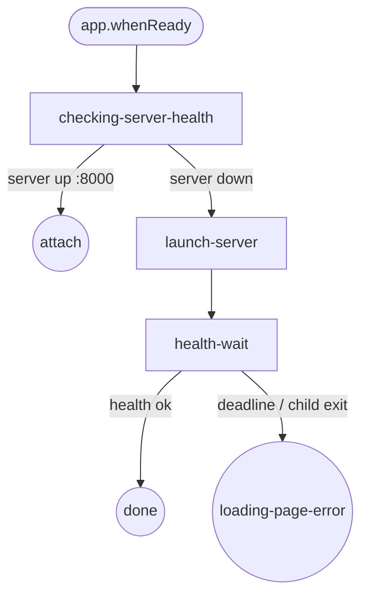
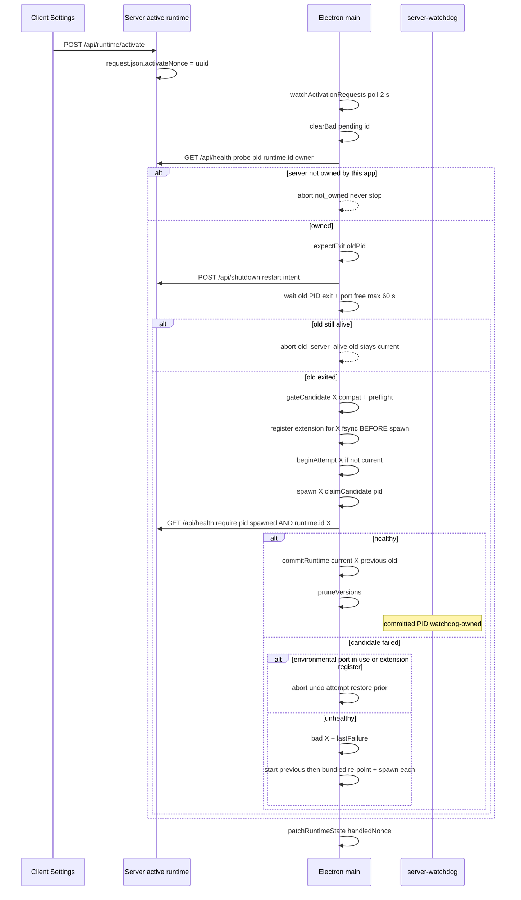
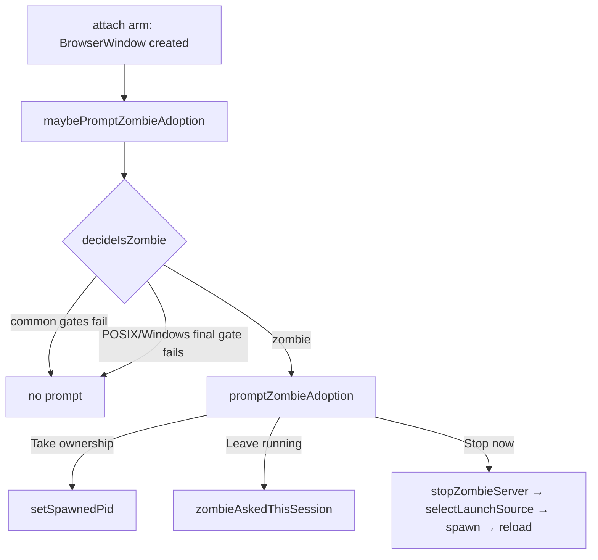

# Electron Bootstrap Flow

Doc covers Electron startup state machine from `app.whenReady()` to dashboard window.

Architecture: Electron is launcher only. Runtime install eliminated. Server resources read-only at `<resourcesPath>/server/node_modules/`. Updates ship via electron-updater whole-app replacement. See [electron-immutable-bundle.md](./electron-immutable-bundle.md).

## State machine (5 states, 3 triggers, 3 end states)

## States

| State | Purpose |
|---|---|
| `checking-server-health` | Probe `GET /api/health` on configured port. 3 s deadline. |
| `launch-server` | `resolveAndSpawnRuntime()` → `selectLaunchSource()` fallback loop → `spawnFromSource()`. Stamps `DASHBOARD_STARTER=Electron` + runtime identity env. `setSpawnedPid(pid)`. |
| `health-wait` | Poll `/api/health` until 200. Deadline `getServerReadyDeadlineMs(kind)` — 15 s installed tree, 60 s TS checkout. |
| `attach` (end) | Server already running. Open main window, no spawn. |
| `done` (end) | Server up, owned by this Electron. Open main window. |
| `loading-page-error` (end) | Spawn failed or deadline elapsed. Open `loading.html` with `[Start server]` + `[Open Doctor]` + server-log tail. |

## Triggers

| Trigger | Source |
|---|---|
| `boot` | `app.whenReady` |
| `health-check-result` | `isDashboardRunning(port)` result |
| `server-spawn-result` | `spawnFromSource` resolve / reject |

## launchSource resolution (5 strategies)

`selectLaunchSource()` in `packages/electron/src/lib/launch-source.ts`. Precedence:

`attach → devMonorepo → localLink → overlay → bundled`.

| # | Kind | Condition |
|---|---|---|
| 1 | `attach` | `isDashboardRunning(port)` returns running. Skipped with `skipAttach` — activation never attaches. |
| 2 | `devMonorepo` | `!app.isPackaged` AND `cwd/packages/server/src/cli.ts` + `cwd/packages/extension/src/bridge.ts` exist. Unchanged. |
| 3 | `localLink` | Effective source `local` AND `state.localPath` set AND binding matches (`deriveEffectiveSource()`). Runs checkout in place. |
| 4 | `overlay` | Effective source `npm`/`github`. Candidates in order pending → current → previous. |
| 5 | `bundled` | Fallback. `<resourcesPath>/server/node_modules/@blackbelt-technology/pi-dashboard-server/src/cli.ts`. `BundledServerMissingError` when missing. |

`localLink` / `overlay` candidate failing its gate (compat + preflight) falls through to the next kind. Failure recorded via `onFallThrough` → `state.lastFailure`.

Override: `DASHBOARD_PREFER_SOURCE=attach|devMonorepo|localLink|overlay|bundled`. `PinnedSourceUnavailableError` when a pinned kind cannot resolve. Pre-R3 kinds (`piExtension`, `npmGlobal`, `extracted`) rejected with warning.

## Server readiness deadlines

`getServerReadyDeadlineMs(kind)`:

| Kind | Deadline | Why |
|---|---|---|
| `devMonorepo`, `localLink` | `SERVER_READY_DEADLINE_DEV_MS = 60_000` | jiti compiles TS checkout on cold boot |
| `bundled`, `overlay`, `attach` | `SERVER_READY_DEADLINE_MS = 15_000` | installed tree, pre-compiled |

## Cold launch: fallback + retry-once

`resolveAndSpawnRuntime()` loops `selectLaunchSource`. Each failing overlay/local candidate is recorded (`recordColdFailure`), added to an exclude set, then re-resolved (`skipAttach`). Bundle is the last fallback; bundle/dev failure throws.

- Overlay pending tried ≤ `MAX_ATTEMPTS = 2`. `state.bad[id]` set after. App died mid-activation (`pending` with `attempts == 2`, not current) → `bad` reason `crashed_before_commit`.
- Local → `bad` on first cold failure.
- Port conflict = environmental. Attempt undone (`undoAttempt`), error rethrown, nothing marked bad.
- `bad[id]` + `attempts[id]` cleared only by explicit user action: Update/Activate nonce (`pendingNonce`), or re-picking the local folder (`pickLocalFolder`). Automatic paths never clear it.

## switchRuntime

Primitive in `packages/electron/src/lib/runtime-overlay.ts`. NOT `requestServerLaunch`. PID-scoped watchdog ownership (`expectExit`, `claimCandidate`, `releaseRuntimeSwitchOwnership`) instead of the global graceful flag. Old server must exit within `SWITCH_OLD_EXIT_DEADLINE_MS = 60_000`; poll `STOP_POLL_MS = 250`.

No false commits: the health gate accepts only a server whose `pid` equals the spawned child, is not the old pid, and whose `runtime.id` equals the candidate. Rollback marks the candidate `bad`, then starts `previous` → `bundled`, re-pointing the extension before each spawn.

## Activation watcher (2 s)

`watchActivationRequests()` polls `request.json#activateNonce` every 2 s (`setInterval`, `ACTIVATION_POLL_MS = 2_000`). One switch per new nonce, serialized by `createSwitchQueue`. `state.handledNonce` recorded after the switch resolves. Source/channel edits alone do nothing until activation.

App-menu local actions call `switchRuntime()` directly, no nonce: `Runtime → Use Local Folder…` (`pickLocalFolder` binds `{epoch,seq}`, refuses `request_unreadable`, clears bad), `Runtime → Stop Using Local Folder` (`stopUsingLocalFolder` clears `localPath`).

## Bridge extension + convergent reload (D8)

Before spawning any runtime (candidate, rollback target, bundle), Electron registers that runtime's extension path, durable (fsync). `extensionPathFor(id, dir, resourcesPath)`:

| Runtime id | Extension path |
|---|---|
| `bundled` | `<resourcesPath>/server/packages/extension` |
| `local:<realpath>` | `<realpath>/packages/extension` |
| overlay `X` | `versions/<X>/node_modules/@blackbelt-technology/pi-dashboard-extension` |

Electron stamps `PI_DASHBOARD_EXTENSION_DIR` at spawn (except `devMonorepo`). Server `activeExtensionFromEnv()` validates it: Electron owner token set, dir is a real dir, `package.json#name` is the dashboard extension. Anything else → null (fail closed).

On every bridge (re-)register, `createExtensionReloadGuard()` compares the bridge's reported identity (realpath dir + version) with the active one. Mismatch → one `/reload` per session per active runtime id (`reloadedFor` map → no loop). Persistent mismatch after the reload → `extension_mismatch` diagnostic for the Doctor row. Late-reconnecting bridges converge when they register.

Runtime identity env (`runtimeIdentityEnv()`): `PI_DASHBOARD_RUNTIME_ID`, `PI_DASHBOARD_RUNTIME_ORIGIN`, `PI_DASHBOARD_ELECTRON_INSTANCE` (per-app token surviving `/api/restart`). `/api/health.runtime` echoes these; `owner` gates the switch.

## Node binary resolution (2 strategies)

`pickNodeForServer()` in `packages/electron/src/lib/pick-node.ts`:

1. `bundled` — `<resourcesPath>/node/bin/node` (POSIX) / `<resourcesPath>/node/node.exe` (Win).
2. `execpath-fallback` — `process.execPath` + `ELECTRON_RUN_AS_NODE=1`. Corrupted-install signal, not normal mode.

## DASHBOARD_STARTER ownership

| Setter | Value |
|---|---|
| `packages/extension/src/server-launcher.ts` | `Bridge` |
| `packages/server/src/cli.ts` direct invocation | `Standalone` |
| `packages/electron/src/lib/launch-source.ts` (non-attach) | `Electron` |

`/api/health` returns `launchSource: "electron" | "standalone" | "bridge"`. `decideShutdownOnQuit` stops server only when `health.launchSource === "electron" AND health.pid === storedSpawnedPid`.

`/api/health` also returns derived `launchSourceEffective: "electron" | "standalone" | "bridge" | "bridge-orphaned"`. Computed per request by `computeEffectiveLaunchSource({raw, activeBridgeCount, uptimeMs})` in `packages/server/src/launch-source-effective.ts`. Rule: `raw === "bridge"` AND `activeBridgeCount === 0` AND `uptimeMs > 30_000` → `"bridge-orphaned"`; else `raw`. 30 s grace window absorbs restart→bridge-reconnect race (server up before bridge reconnects after `server_restarting`). Static `launchSource` unchanged (back-compat with `decideShutdownOnQuit`); only `launchSourceEffective` promotes bridge-orphan. Tray ownership probe + Doctor version-skew row read `launchSourceEffective`.

| launchSource | activeBridgeCount | uptime | launchSourceEffective |
|---|---|---|---|
| bridge | 0 | >30s | bridge-orphaned |
| bridge | 0 | <30s | bridge |
| bridge | ≥1 | any | bridge |
| electron | any | any | electron |
| standalone | any | any | standalone |

## Invariants

| Invariant | Source |
|---|---|
| App bundle read-only at runtime | electron-updater replaces whole `.app` |
| No `npm install` runs after build | `bundle-server.mjs` Phase 1 GO/NO-GO guard |
| Legacy `~/.pi-dashboard/` untouched | `detectLegacyManagedDir()` surfaces Doctor advisory only |
| Electron stops server only when it owns it | `decideShutdownOnQuit` pure helper |
| first-run-done marker written on first `done` | `~/.pi/dashboard/first-run-done` |
| Bundled-server missing → `BundledServerMissingError` | corrupted-install signal |
| Bundle is final runtime fallback | `resolveAndSpawnRuntime` falls through to `bundled` |
| One writer per runtime state file | server → `request.json`, Electron → `state.json` |

## Zombie adoption

Electron `attach` arm runs `maybePromptZombieAdoption()` (in `packages/electron/src/main.ts`) after BrowserWindow created. Detects leftover server from prior Electron lifetime via `decideIsZombie(...)` in `packages/electron/src/lib/server-lifecycle.ts`.

Common gates (all platforms): `health.launchSourceEffective === "electron"` AND `storedSpawnedPid === null`.

| Platform | Final gate |
|---|---|
| POSIX (macOS/Linux) | `health.ppid !== health.bootParentPid` AND `health.bootParentAlive === false` (reparented away AND boot parent gone). NOT `ppid === 1` (unreliable under Linux subreapers/containers). |
| Windows | `health.bootParentAlive === false` alone (Windows never reparents). Job Object (`JOB_OBJECT_LIMIT_KILL_ON_JOB_CLOSE`) kills server on common crash path; detection covers bypass cases (`CREATE_BREAKAWAY_FROM_JOB`, nested-job assignment failure, self-respawn). |

`bootParentAlive` computed server-side, two tiers (in `packages/server/src/boot-parent-liveness.ts`):
- Tier 1: `isProcessAlive(bootParentPid)` all platforms, PID-reuse-vulnerable.
- Tier 2: win32-only optional `koffi` FFI holds `SYNCHRONIZE` `OpenProcess` handle + `WaitForSingleObject(h,0)`, PID-reuse-safe, falls back to Tier 1.

Modal: `promptZombieAdoption({pid})` (`packages/electron/src/lib/zombie-adoption-dialog.ts`), 3 buttons, default "Leave running".

| Button | Action |
|---|---|
| Take ownership | `setSpawnedPid(health.pid)`; subsequent quit stops server. |
| Leave running | In-memory `zombieAskedThisSession` flag; no re-prompt this process lifetime; re-evaluated next launch. |
| Stop now | `stopZombieServer` (SIGTERM → poll ≤5 s → SIGKILL), re-enter `selectLaunchSource()`, spawn fresh server, reload BrowserWindow after positive health probe. |

`--no-zombie-prompt` switch suppresses modal (detection still runs for logging). Used by QA.

