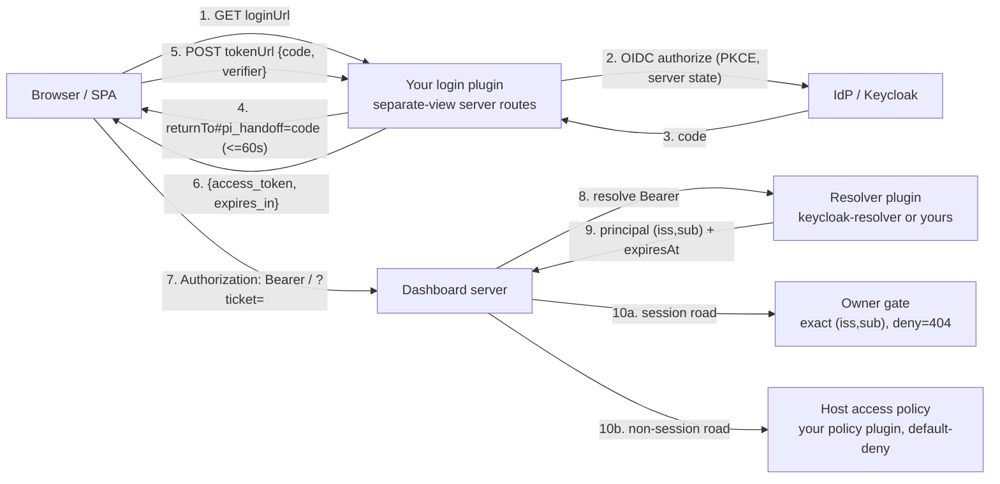

# Identity Auth Plugin Guide

Build a dashboard AUTH plugin on the identity plane.
Two jobs: browser LOGIN UI (separate-view kind) and/or AUTHORIZATION policy.
Ground truth: OpenSpec change `add-multi-user-identity-plane`.
Specs: `openspec/changes/add-multi-user-identity-plane/specs/*`.
Design refs: D9, D11, D14, D18–D25.

Read also [`identity-plane.md`](identity-plane.md) (runtime ref) and
[`plugin-seams.md`](plugin-seams.md) (plugin authoring seams).

## 1. Three-way split (D18)

Responsibilities split three ways. No single plugin owns the whole plane.

| Part | Owns | Never owns |
|------|------|-----------|
| Core | Seam only. `login-provider` slot, `/login` + `/logout` routes, `GET /api/identity/login-config`, trust-bound provider selection, return-to validation, owner gate, optional policy dispatch. | Any login UI. Any provider-specific code. |
| `keycloak-resolver` | Token VALIDATION only (RFC 9068 + conditional DPoP). Resolves bearer → `(iss, sub)`. | Login UI. `login-provider` claim. Browser-login descriptor. |
| YOUR plugin | Login UI (separate-view), and/or the authorization policy. | — |

Current deployment (D20): browser frontend = user's own app. Dashboard = backend
resource server. Login plugin serves own pages, publishes only redirect targets.



## 2. Trust and activation

Trust is operator config, never `manifest.priority`. Priority only orders resolvers.

Config lives at `~/.pi/dashboard/config.json` (`CONFIG_DIR = ~/.pi/dashboard`).
Plugin config at `config.json#plugins.<id>.*` (`ctx.getPluginConfig()`).

- `identity.trustedResolverPlugins: string[]` — plugin ids allowed to register a
  resolver AND publish a login descriptor. Bundled `keycloak-resolver` always trusted.
- `identity.trustedPolicyPlugin?: string` — the ONE plugin allowed to register the
  host access policy. Unset ⇒ no policy ⇒ non-session roads ungated.
- `identity.resolverTimeoutMs` — default 2000, clamp [100, 5000].
- `identity.policyTimeoutMs` — default 500, clamp [50, 2000].

ENFORCEMENT (D21) — no mode flag. Identity ENFORCED ⇔ a trusted resolver is active
AND a trusted plugin registered a login descriptor. Decided once before `listen()`,
then LATCHED. A runtime unregister/toggle is a logged no-op; takes effect next restart.

Disarm instead of fail (`isIdentityEnforced`, `identity/activation.ts`):
- named-but-absent `trustedPolicyPlugin` ⇒ inert + warn, boot succeeds.
- duplicate policy registration ⇒ inert + warn, boot succeeds.
- active `auth.providers` connectors that mount ⇒ inert (D8), boot succeeds.
- resolver active + NO login provider ⇒ inert (self-lockout guard).
Server logs the exact reason before listening. A plugin that registers then throws
has its registrations released (`IdentityRegistrationTracker`).

Config example:

```json
{
  "identity": {
    "trustedResolverPlugins": ["my-auth-plugin", "my-resolver-plugin"],
    "trustedPolicyPlugin": "my-policy-plugin",
    "resolverTimeoutMs": 2000,
    "policyTimeoutMs": 500
  },
  "plugins": {
    "keycloak-resolver": {
      "issuer": "https://kc.example.com/realms/app",
      "audience": "pi-dashboard"
    },
    "my-auth-plugin": {
      "issuer": "https://kc.example.com/realms/app",
      "clientId": "pi-dashboard-spa"
    },
    "my-policy-plugin": {
      "allow": [{ "sub": "<sub>", "actions": ["*"] }]
    }
  }
}
```

## 3. Login plugin (separate-view kind, D19/D20/D22/D25)

Separate-view = plugin serves own pages, ships nothing into the client bundle,
claims no slot. Drop-in needs NO dashboard rebuild.

Manifest — `package.json#pi-dashboard-plugin` (or adjacent `dashboard-plugin.json`).
Drop directory at `~/.pi/dashboard/plugins/my-auth-plugin/` (loader
`findInstalledPluginsDir()`, `loader.ts`). Server entry loaded at runtime.

```json
{
  "name": "my-auth-plugin",
  "type": "module",
  "pi-dashboard-plugin": {
    "id": "my-auth-plugin",
    "displayName": "My Auth",
    "claims": [],
    "priority": 400,
    "server": "./server.mjs",
    "configSchema": "./configSchema.json"
  }
}
```

`claims: []` — separate-view ships no client contribution.
`priority` selects nothing here (trust does).

Serve pages on `ctx.fastify`. Keep paths OUTSIDE the guard jurisdiction
(`/api/` `/v1/` `/editor/` `/live/`) so they are reachable pre-auth.

```js
// server.mjs
export default async function registerPlugin(ctx) {
  const cfg = ctx.getPluginConfig?.() ?? {};
  if (!cfg.issuer || !cfg.clientId) return;   // unconfigured ⇒ offer NOTHING

  ctx.fastify.get("/my-auth/login", loginPage);      // 302 → IdP authorize
  ctx.fastify.get("/my-auth/callback", callback);    // code → token, server-side
  ctx.fastify.post("/my-auth/token", tokenExchange); // {code, verifier} → bearer
  ctx.fastify.get("/my-auth/logout", logoutPage);

  if (typeof ctx.registerBrowserLoginConfig !== "function") return; // feature-detect
  ctx.registerBrowserLoginConfig({
    loginUrl: "/my-auth/start",          // 302 straight to IdP (not a page)
    logoutUrl: "/my-auth/signout",
    tokenUrl: "/my-auth/token",
    postLogoutUrl: "/login?pi_signed_out=1",
    label: "Keycloak",
    endsProviderSession: true,
    silentSignIn: true,
  });
}
```

### Descriptor contract

`ctx.registerBrowserLoginConfig(config)` — host stamps `pluginId`, applies trust.
Returns unregister handle. Fields:

| Field | Meaning |
|-------|---------|
| `loginUrl` | Same-origin path. Core links/redirects here to sign in. |
| `logoutUrl` | Same-origin path. Core redirects `/logout` here. NEVER falls back to `loginUrl`. |
| `tokenUrl?` | Same-origin path. SPA POSTs `{code, verifier}` → `{access_token, expires_in, id_token?}`. |
| `postLogoutUrl?` | Same-origin path. Plugin lands browser here after sign-out. |
| `label?` | Short provider name. Trimmed, capped 40. |
| `endsProviderSession?` | Boolean. Sign-out also ends provider session (OIDC `end_session`). |
| `silentSignIn?` | Boolean. Provider honours `prompt=none` at `loginUrl`. |

### Sanitization (`sanitizeBrowserLoginConfig`, host trust boundary)

- `loginUrl`/`logoutUrl`/`tokenUrl`/`postLogoutUrl` → same-origin PATH only.
  Reject absolute (`https://…`), scheme-relative (`//host`), origin-less (`sso/login`).
  Refuse core gate routes `/callback`, `/logout` (loop).
- Needs EITHER `issuer`+`clientId` (component kind) OR `loginUrl` (separate-view). Else `null`.
- Unknown fields dropped. `label` capped 40. Booleans strict.
- `pluginId` stamped by host; a passed value is dropped.

### D22 handoff flow — no cookies

- SPA makes PKCE `verifier` + `challenge`, keeps `verifier` in `sessionStorage`
  (not a credential), navigates `loginUrl?returnTo=<safe>&challenge=<challenge>`.
- Plugin runs IdP flow. OAuth `state`, PKCE, `returnTo` live in plugin SERVER state.
- Plugin redirects to `returnTo#pi_handoff=<code>`. Code single-use, ≤60 s, bound to `challenge`.
- SPA strips fragment at once, `POST tokenUrl {code, verifier}`, receives
  `{access_token, expires_in, id_token?}` (`dashboard-login.ts:148`).
- Bearer lives in MEMORY only — never `localStorage`, never a URL, never a cookie.
- Sent as `Authorization: Bearer` on REST and on `POST /api/ws-ticket`.
- Reload/expiry = re-run flow (IdP SSO bounces). No refresh token.
- Logout: SPA drops bearer, navigates `logoutUrl?returnTo=`; plugin ends IdP session
  where one exists, then `postLogoutUrl`.
- `returnTo` must be same-origin, non-`/callback`, non-`/auth/login`. Else `/`.

### Silent sign-in

`silentSignIn: true` ⇒ `loginUrl` honours `prompt=none`. Live IdP session ⇒ no click.
No session ⇒ IdP returns `#pi_login_error=login_required`. Page tries once per load,
never after explicit sign-out / error / miss (no loop).

### Several providers (D25)

Core keeps ALL trusted descriptors (`BrowserLoginConfigRegistry.list()`, load order).
`GET /api/identity/login-config` returns `{active:true, providers:[...]}` (top-level
mirrors first). Core `/login` page lists one button per provider. Handoff redeemed at
the STARTING provider's `tokenUrl`; sign-out uses ITS `logoutUrl`.

### Inert / unconfigured

No usable descriptor ⇒ `GET /api/identity/login-config` → `{active:false}`, discloses
nothing. Resolver active + no descriptor ⇒ inert (D21).

## 4. Optional custom resolver (if not Keycloak)

Register only when the resolver plugin is in `identity.trustedResolverPlugins`.
Feature-detect the capability (`typeof ctx.registerPrincipalResolver !== "function"`).

Contract — `PrincipalResolverFn`:

```ts
type PrincipalResolverFn = (ctx: AuthContext) => Promise<ResolverOutcome>;
```

Three-valued outcome (D5):
- `{principal:{iss,sub,email?}, expiresAt}` — CLAIM. Stop, authenticate.
- `null` — NOT my credential. Fall through to next resolver.
- `{reject:true, reason?}` — MINE but INVALID. Stop chain, 401.

`AuthContext` = curated allowlist `{method, url, authorization?, cookie?, dpop?,
isAuthenticated, ip}`. Never the raw request. `url` = externally-visible, query/fragment
stripped.

Rules:
- Claim only YOUR issuer's tokens. Peek unverified `iss`; foreign issuer ⇒ `null`.
- Owned-invalid ⇒ `reject` — never `null`, never throw.
- Catch your own validation faults ⇒ `reject` (core coerces a throw to `null`, passing through).
- Validate output: non-empty `iss`/`sub`, future finite `expiresAt`, bounded lengths.
- Fail closed on timeout (core bounds each call by `identity.resolverTimeoutMs`).

```ts
import type { AuthContext, ResolverOutcome } from "@blackbelt-technology/pi-dashboard-shared/identity.js";

const MY_ISSUER = "https://idp.example.com";

export async function registerPlugin(ctx) {
  if (typeof ctx.registerPrincipalResolver !== "function") return;
  ctx.registerPrincipalResolver(async (auth: AuthContext): Promise<ResolverOutcome> => {
    const bearer = auth.authorization?.replace(/^Bearer\s+/i, "");
    if (!bearer) return null;                       // not my credential
    if (peekIssUnverified(bearer) !== MY_ISSUER) return null; // foreign issuer
    try {
      const { sub, exp } = await verify(bearer);    // your validation
      if (!sub || !Number.isFinite(exp)) return { reject: true, reason: "malformed" };
      return { principal: { iss: MY_ISSUER, sub }, expiresAt: exp * 1000 };
    } catch {
      return { reject: true, reason: "invalid" };   // owned but invalid → 401
    }
  });
}
```

Order = `(manifest.priority asc, pluginId asc)`, deterministic across boots.
Registration order irrelevant.

## 5. Writing authorization

Two separate layers. Pick by road.

### (a) Session roads — core-enforced, NOT policy-controllable

Session owner persisted as `principalOwner: {iss, sub}`. Exact equality only —
`a.iss === b.iss && a.sub === b.sub` (`principalEquals`). No email fallback, no
normalization. Deny = **404** (no owned-vs-not-found oracle).

Enforced on EVERY session road, HTTP + WS: detail/transcript/mutation, bootstrap
snapshot, list/pagination (per item), subscribe, replay/backfill, inbound commands.
Ownerless sessions hidden from humans. A principal-less socket refused every owned session.

Ownership assigned ONLY via trusted roads: browser `spawn_session` (stamps
`ws.principal`), host HTTP spawn (stamps `request.principal`), trusted policy plugin
owned-spawn API. Untrusted plugins cannot set an owner. `cwd` never an ownership signal.

A policy plugin cannot widen or narrow session access. Owner equality stands regardless.

### (b) Host access policy — non-session roads only

`HostAccessPolicyFn` (`packages/shared/src/identity.ts`):

```ts
type HostAccessPolicyFn = (input: {
  principal: Principal;
  action: HostAction;
  resource: HostResource;
}) => Promise<boolean>;
```

One policy per host, registered by the plugin in `identity.trustedPolicyPlugin`.
Register via `ctx.registerHostAccessPolicy(authorize)` (feature-detect).

Real action constants (`packages/server/src/identity/host-resources.ts` `HostActions`):

```text
workspace.read  workspace.write
openspec.read   openspec.write
branch.read     branch.write
terminal.read   terminal.create  terminal.write
system.read     system.write
domain.event
```

Resource kinds (`hostResource`): `workspace`, `openspec`, `branch`, `terminal`,
`system`, `domain`. Bounded plain data, no secrets (no tokens, no file contents).

Bounded, fail-closed: `false` / throw / timeout / non-boolean ⇒ DENY + structured
audit event (principal, action, resource, reason). Timeout = `identity.policyTimeoutMs`
(default 500, range 50–2000). No policy registered ⇒ non-session roads ungated (pre-change).

Policy must be PURE and FAST: no I/O, no secrets, no side effects. The host owns the
send; the policy only supplies the boolean decision. Also gates bootstrap disclosure of
non-session state and domain-event fan-out per candidate socket.

Default-deny example, adapted from `packages/fixture-policy-plugin/` (`policy.ts`):

```ts
import type { HostAccessPolicyFn } from "@blackbelt-technology/pi-dashboard-shared/identity.js";

type Allow = { iss?: string; sub: string; actions?: string[] };

export function createPolicy(allow: Allow[]): HostAccessPolicyFn {
  return async ({ principal, action }) => {
    for (const e of allow) {
      if (e.sub !== principal.sub) continue;
      if (e.iss && e.iss !== principal.iss) continue;
      if (!e.actions || e.actions.includes("*") || e.actions.includes(action)) return true;
    }
    return false; // default-deny
  };
}

export async function registerPlugin(ctx) {
  if (typeof ctx.registerHostAccessPolicy !== "function") return;
  ctx.registerHostAccessPolicy(createPolicy(ctx.getPluginConfig()?.allow ?? []));
}
```

See `packages/fixture-policy-plugin/src/server/{index.ts,policy.ts,config.ts}`
and `src/server/__tests__/policy.test.ts`.

### (c) Product authorization (roles/RBAC) — YOUR plugin, your routes

Product authz (roles, approver routing, atomic authorize+mutate) lives in YOUR product
plugin, NOT the host access policy (D9/D24). Evaluate LIVE against the resolved principal.

Today: read the principal core stamped on the Fastify request. Core's global resolver
hook (`identity/resolver-hook.ts`) sets `request.principal` (and
`request.principalExpiresAt`, `request.isAuthenticated`) on every request, including
plugin `ctx.fastify` routes. Not typed — read it untyped:

```ts
ctx.fastify.get("/my-product/report", async (request, reply) => {
  const principal = (request as { principal?: { iss: string; sub: string } }).principal ?? null;
  if (!principal) return reply.code(401).send({ error: "sign_in_required" });
  if (!roleOf(principal).includes("report:read")) return reply.code(403).send({ error: "forbidden" });
  return buildReport(principal);
});
```

NO policy plugin ⇒ `true` for any principal is the D24 default floor. Add your own check.

#### NOT YET IMPLEMENTED — plan around it

Open tasks (`openspec/changes/add-multi-user-identity-plane/tasks.md`):

- task 18.27 — `ctx.identity` consumer seam: `{isEnforced, principalOf, authorize,
  userDataDir}`; `authorize` action namespaced `plugin:<pluginId>:<action>`; per-user
  storage `~/.pi/dashboard/plugins/<id>/users/<sha256(iss,sub)>/`; WS routes receive the
  socket principal. Absent today — `ctx.identity` does not exist.
- task 18.28 — `GET /api/identity/me` → `{principal, can}`; classify EVERY core
  non-session road `{action, resource}` through `gateHttpNonSession`.
- task 18.14 — host-policy road wiring. `identity/host-access.ts` `gateHttpNonSession`
  and `identity/domain-fanout.ts` `deliverDomainEvent` have NO production call site yet.
  Session owner-gating IS live. Non-session policy DISPATCH is not.

Meanwhile: write your own role checks against `request.principal` (above). Do not rely
on `ctx.identity`, `GET /api/identity/me`, or cross-plugin action namespacing until
those tasks land.

## 6. Break-glass / lockout (D23)

Network position is NOT identity. Loopback is NOT exempt while enforced.

- Break-glass principal = `local-operator` (`urn:pi-dashboard:local-operator` /
  `local-operator`). Sees everything, as the pre-identity single-user dashboard did.
  Bearer short-lived, `warn`-logged on issue and use.
- IMPLEMENTED: host-only `local-token` path. A verified local-token request with no
  principal becomes the frozen `LOCAL_OPERATOR` on session roads
  (`identity/session-access.ts`; `server.ts` logs the warn line).
- PLANNED (task 18.23/18.24): `pi-dashboard login --local` CLI. Reads
  `~/.pi/dashboard/local/token` (dir 0700, file 0600, same OS user), asks running server
  for one-time code, prints `http://localhost:<port>/?pi_local=<code>`. Code single-use,
  ≤60 s, instance-bound; client exchanges like `#pi_handoff`. CLI subcommands today are
  only `start stop restart status runtime` (`packages/server/src/cli.ts` `SUBCOMMANDS`).

NEVER add a localhost bypass. Same-host sidecar / L4 LB / `ssh -L` / `kubectl
port-forward` all arrive as `127.0.0.1`. A localhost bypass trusts a forged network path.
Recovery = config edit or break-glass, not a network exemption.

## 7. Testing your plugin

Reusable harnesses:

- Policy unit tests: `packages/fixture-policy-plugin/src/server/__tests__/policy.test.ts`.
- Setup + browser E2E: `tests/e2e/identity-matrix/` (`npm run test:e2e:identity-matrix`,
  opt-in, no docker). `scenarios.ts` (A–K), `setup-matrix.spec.ts`, `browser-login.spec.ts`,
  `multi-user.spec.ts`, `security.spec.ts`.
- Spike login plane (separate-view + D22): `spike/identity-login-plane/` server routes
  tests (`test/identity-routes.test.mjs`, `test/handoff-mode.test.mjs`,
  `test/security.test.mjs`); LAN/two-user e2e: `spike/identity-login-plane/lan-e2e.mjs`,
  `two-user-e2e.mjs`.
- Resolver: `packages/keycloak-resolver-plugin/src/__tests__/`.

Security must-have checklist:

- Issuer exact string match — pin scheme/host/port. Drift silently orphans stored `(iss, sub)`.
- No tokens in URLs, storage, or logs. Bearer in memory only. No cookies in the plane.
- Redirect targets same-origin paths. No logout→login fallback. Validate `returnTo` server + client.
- Fail closed: reject owned-invalid; default-deny policy; bounded timeouts; never a 500 on resolver throw.
- Output-validate every principal before exposure. Treat `email` as a label, never a key.

## 8. References

Specs (`openspec/changes/add-multi-user-identity-plane/specs/`):
`principal-resolution`, `keycloak-principal-resolver`, `host-access-policy`,
`browser-principal-client`, `dashboard-shell-slots`, `session-ownership-scoping`,
`websocket-principal-binding`, `permissioned-event-fanout`.

Design (`openspec/changes/add-multi-user-identity-plane/design.md`):
D9 (one optional policy contract), D11 (owner persisted, trusted roads), D14
(authorization covers bootstrap/commands/replay/fan-out), D18 (three-way split),
D19 (two provider kinds), D20 (independent frontend, resource server),
D21 (self-lockout guard, latch), D22 (handoff code, in-memory bearer, NO cookies),
D23 (break-glass, localhost NOT exempt), D24 (scoping + consumer seam),
D25 (core login page, several providers, silent sign-in).

Code anchors: `packages/shared/src/identity.ts`, `packages/shared/src/config.ts`
(`IdentityConfig`), `packages/server/src/identity/{activation,host-access,host-resources,
browser-login-config-registry,resolver-hook,session-access,domain-fanout}.ts`,
`packages/dashboard-plugin-runtime/src/server/server-context.ts`.

Docs: [`identity-plane.md`](identity-plane.md), [`plugin-seams.md`](plugin-seams.md).

See change: `add-multi-user-identity-plane`.
