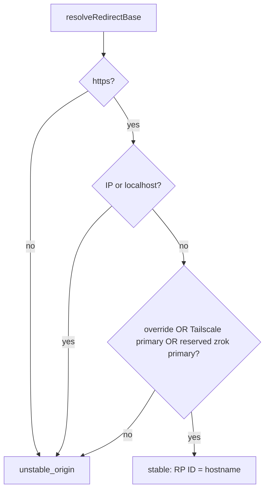

# Passkey users + user management

Native WebAuthn passkeys + local user directory. Backend `@simplewebauthn/server` (design D1 result B; Pocket ID sidecar rejected). See change: add-passkey-user-auth.

## Enable

Config `~/.pi/dashboard/config.json`:

```json
{ "auth": { "passkeys": { "enabled": true } } }
```

- Works with or without OAuth providers.
- No providers configured → restart required after enabling.
- Optional `auth.groupTiers`: `{ "<oidc-group>": "observe|control|operate" }`.
  - Configured → highest matching group tier wins.
  - Configured, no match → login refused (fail closed).
  - Unconfigured → legacy: `allowedUsers`, tier `operate`.
- Groups read from OIDC userinfo `groups` claim.
- OIDC tier fixed until JWT expiry (7 d).

## Tiers

- Order: `observe` < `control` < `operate`.
- JWT `pi_dash_token` carries `tier`. Claim-less legacy JWT = `operate`.
- REST: `packages/server/src/auth/route-tier-gate.ts` refuses session below route tier (`ROUTE_TIERS`).
  - Refusal: `403 insufficient_scope`.
- WS: cookie-admitted browser socket gated per message.
  - Map: `packages/shared/src/ws-message-tiers.ts` (`WS_MESSAGE_TIERS`). Unlisted → `operate`.
  - Dropped message → logged once per socket+type: `auth.tier_refused {"via":"ws",...}`.
  - Terminal WS needs `operate`. Live-preview WS needs `control`.
- Exempt (same as REST): loopback / genuine-local, trusted-network, ticket sockets.

## User directory

File `~/.pi/dashboard/users.json` (0600, locked atomic writes). Source: `packages/server/src/auth/passkey/user-directory.ts`.

- User: `name`, `tier`, `status` (`invited|active|revoked`).
- Credentials: passkeys. Each bound to RP ID it was created under.
- Invites: stored as sha256 of token. Never plaintext.
- Passkey session tier re-read from directory every request.
  - Re-tier / revoke → effective next request.
  - Revoked user open WS → closed on next frame, close code `4401`.

## First operator bootstrap

- Empty directory → only genuine-local caller may create first user:
  - loopback, no forwarding headers, or `X-Pi-Local-Token`.
- First user always `operate`.
- Remote caller → `403 bootstrap_local_only`.
- Then mint invite for that user (Settings ▸ Security ▸ Users).

## Settings ▸ Security ▸ Users

Source: `packages/client/src/components/connectivity/UsersSection.tsx`.

- Add user + tier.
- Re-tier.
- Revoke (two-click confirm).
- "Invite QR" → QR + copy link `https://<primary>/auth/invite#<token>`.
  - Token in URL fragment (never sent to server on GET).
  - Default TTL 24 h, single use.
  - API: `ttlHours` 1..168, `maxUses` 1..10.
- Orphaned credentials badge: credential bound to other RP ID.

## Sign-in on `/auth/login`

- "Sign in with passkey": same device or OS hybrid. Discoverable credential. User verification required.
- "Sign in with phone":
  1. Desktop shows QR + short code `XXXX-XXXX`. TTL 5 min.
  2. Phone opens `/auth/phone#<token>` or types code at `/auth/phone`.
  3. Phone sees requester browser / OS / host / IP (sanitised).
  4. Phone approves with its passkey, or denies.
  5. Desktop poll receives cookie. Single use.
- Limits:
  - Code guessing: 5 fails/min per client, 50/min global.
  - Max 100 pending requests.

## RP ID + stable origin

- RP ID = hostname of resolved auth base.
- Resolution = `resolveRedirectBase` (same as OAuth redirect):
  1. `auth.redirectBaseUrl` override.
  2. else PRIMARY tunnel URL.
- Stable origin rule. All must hold:
  - `https`.
  - Not IP, not `localhost`.
  - Source is one of: override, Tailscale primary, zrok primary with reserved name (`tunnel.zrok.reservedName` + `persistent: true`, actually served).
- Unstable (ngrok, zerotier, ephemeral zrok):
  - Ceremony routes + invite mint → `409 unstable_origin`.
  - Login page + Settings show options DISABLED with reason. Not hidden.

Source: `packages/server/src/auth/passkey/rp-context.ts`, `passkey-service.ts`.



## Primary switch impact

- "Make primary" confirmation and `auth.redirectBaseUrl` field show:
  `N passkey(s) for M user(s) will stop working`.
- Source: `GET /api/users/credentials/impact?url=`.
- Nothing deleted. Switching back revives credentials.
- Recovery:
  - Re-invite user, or
  - Sign in with phone using a passkey under current RP ID.

## Routes

| Route | Auth | Notes |
|---|---|---|
| `GET /auth/passkey/status` | public | feature + stability state |
| `GET /auth/passkey/webauthn.js` | public | client WebAuthn helper |
| `POST /auth/passkey/register/options` | invite token | |
| `POST /auth/passkey/register/verify` | invite token | sets `pi_dash_token` |
| `POST /auth/passkey/login/options` | public | |
| `POST /auth/passkey/login/verify` | WebAuthn assertion | sets `pi_dash_token` |
| `POST /auth/passkey/phone/start` | public | returns code + QR |
| `GET /auth/passkey/phone/poll/:requestId` | request id | sets cookie on approval |
| `POST /auth/passkey/phone/lookup` | short code | returns approval token |
| `POST /auth/passkey/phone/view` | approval token | requester info |
| `POST /auth/passkey/phone/approve` | approval token + passkey | |
| `POST /auth/passkey/phone/deny` | approval token | |
| `GET /auth/invite` | page | |
| `GET /auth/phone` | page | |
| `GET /api/users` | `operate` | |
| `POST /api/users` | `operate` | |
| `PATCH /api/users/:id` | `operate` | re-tier |
| `POST /api/users/:id/revoke` | `operate` | |
| `POST /api/users/:id/invites` | `operate` | mint invite |
| `DELETE /api/users/invites/:inviteId` | `operate` | |
| `GET /api/users/credentials/impact` | `operate` | `?url=` |

- `/api/users*`: `operate` in `ROUTE_TIERS`, `operatorGuard` (device bearer refused), MCP-denylisted.
- Source: `packages/server/src/routes/user-routes.ts`, `packages/server/src/auth/passkey/passkey-routes.ts`.
- Cross-site POST with foreign `Origin` to `/auth/passkey/*` → `403 origin_mismatch`.

## Logging

- Format: `[passkey] <event> id=<8 hex>`.
- Events: `invite_created|enrolled|login|phone_pending|phone_approved|phone_denied|phone_expired|revoked|orphaned`.
- Never logged: codes, challenges, credential ids, UA, IP.
- Source: `packages/server/src/auth/passkey/passkey-log.ts`.

## Backend notes

- Native `@simplewebauthn/server`. No sidecar.
- pnpm override pins single `@peculiar/asn1-schema`.
  - Two copies → ES256 verify fails: `Cannot get schema for 'ECDSASigValue'`.
  - Do not remove override.

## Rollback

1. Revert code.
2. Passkey users lose access.
3. OAuth, loopback, bearer unaffected.
4. Purge data: delete `~/.pi/dashboard/users.json`.

## Known limits

- WS sub-tier messages silently dropped. UI may not yet hide controls.
- E2E with virtual authenticator needs HTTPS domain origin. Not available in docker harness.

## Cross-refs

- `docs/architecture.md` §Passkey users
- `docs/faq.md` (passkey FAQ entries)
- `packages/server/src/auth/auth-plugin.ts`
- `packages/shared/src/route-tiers.ts`
- `packages/shared/src/ws-message-tiers.ts`
- `packages/server/src/pairing/ws-tier-gate.ts`
- `openspec/changes/add-passkey-user-auth/`
