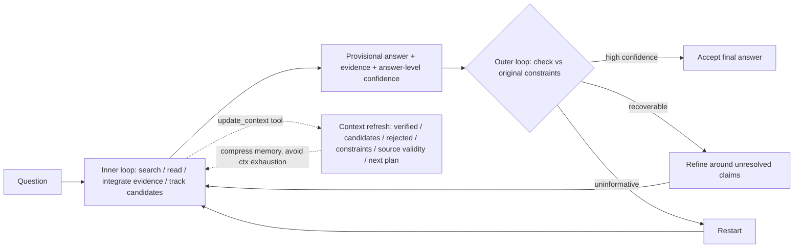
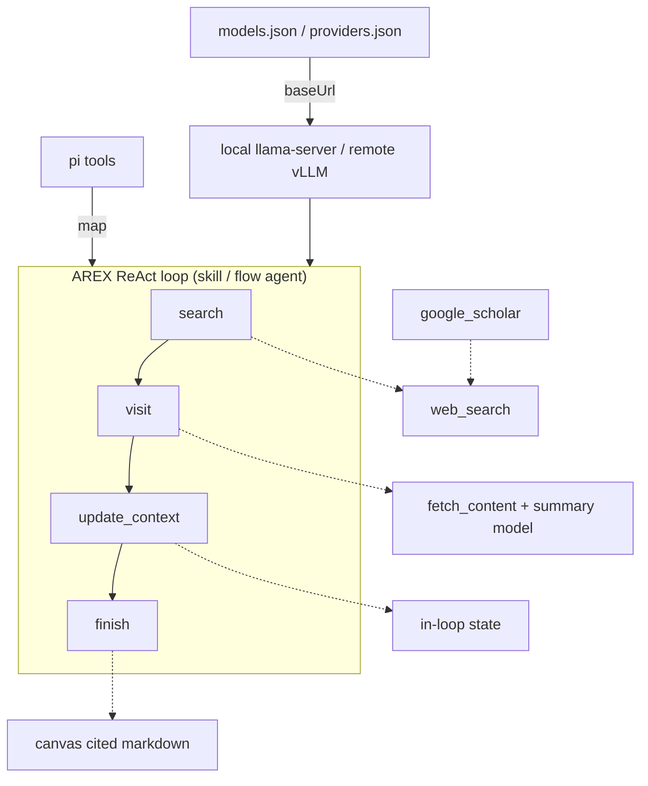

# AREX (BAAI) Deep-Research Agent Models → pi-dashboard — Research Dossier

> Status: research / explore-mode (no change, no impl).
> Goal: what AREX is; run locally on user Mac + remote; use from pi-dashboard.
> Date: 2026-10-04 (research). Confidence tags: [V] verified from source/model card, [E] estimate, [U] unverified/open.
> Sources: HF collection `huggingface.co/collections/BAAI/arex`; HF model cards `BAAI/AREX-Turbo`, `BAAI/AREX-Base`, `BAAI/AREX-2`; `github.com/VectorSpaceLab/arex-model` + `github.com/VectorSpaceLab/AREX-2` + `github.com/VectorSpaceLab/AREX-Skill`; arXiv 2607.21461, arXiv 2609.38288; HF API search (quant repos + sizes); `friendli.ai/models/BAAI/AREX-2`; `slm.expert/models/arex-2`; bartowski + mlx-community quant cards.
> Prior repo state: no AREX mention in docs/ or openspec/.

---

## 1. Question

- What is AREX; family shape, contract, who makes it.
- Can it run locally on user Mac (M5 Pro, 48 GB)? Which quant?
- How to expose remote (CUDA) and hosted.
- How to use from pi / pi-dashboard; does it fit a session model, a skill, or nothing.

---

## 2. Verdict

- AREX = family of deep-research agent models, BAAI / VectorSpaceLab. Trained for long-horizon search/verify/research loops, NOT generic chat. [V]
- Three public models: `AREX-Turbo` dense 4B, `AREX-Base` MoE 122B/10B-active, `AREX-2` dense 27B multimodal. All Apache-2.0. [V]
- Strong benchmarks (BrowseComp 84.0 for AREX-2) but vendor-reported, not independently reproduced. [V reported / U independent]
- KEY FINDING: AREX-2's own repo evaluates MLE-bench Lite + Frontier-CS USING THE PI CODING AGENT as harness (`evaluation/mle/agents/pi/`). AREX-2 is designed/evaluated to run as a pi session model. [V]
- Local Mac: `AREX-Turbo` any quant trivial (Q4_K_M 2.9 GB → Q8_0 4.5 GB); `AREX-2` Q4_K_M/Q5_K_M/Q6_K fit 48 GB; `AREX-Base` does NOT (smallest ~66 GB). [V sizes, E fit]
- 262,144 ctx not feasible locally → cap 32K–64K, lean on `update_context` compression. [E]
- Tool calls = Qwen3.5-style XML in message CONTENT, not OpenAI `tool_calls` → needs parser (`qwen3_coder`/`--jinja`) or thin adapter. [V]
- Fit: run own ReAct loop (skill / flow agent / eval) = best. As plain general pi session model = off-distribution for v1; AREX-2 plausible. [E]
- Sibling `astabrief-local-report-generation.md`: AstaBrief = one-pass cited writer, no tools. AREX = agentic multi-round tool-using researcher. Complementary — AREX gathers, AstaBrief writes. [E]

---

## 3. What AREX Is

- AREX = family of deep-research agent models. Beijing Academy of Artificial Intelligence (BAAI), team VectorSpaceLab. [V]
- HF collection `huggingface.co/collections/BAAI/arex`; project page `vectorspacelab.github.io/arex-model/`. [V]
- Live demo app `https://arex-research.com/` — JS-rendered, not inspected; pricing/login unknown. [U]
- Paper AREX: arXiv 2607.21461 "AREX: Towards a Recursively Self-Improving Agent for Deep Research" (Jul 2026). [V]
- Paper AREX-2: arXiv 2609.38288 "AREX-2: Advancing Self-Improving Agents through Long-Horizon Reflective Tasks". [V]
- Related `github.com/VectorSpaceLab/AREX-Skill` — 5,000+ skills distilled from 1,000+ repos; claims integration with Codex, Claude Code, Pi. [V README blurb, not inspected]

| Model | Arch | Backbone | Ctx | BF16 repo | License | Created |
|---|---|---|---|---|---|---|
| `BAAI/AREX-Turbo` | dense 4B, `Qwen3_5ForConditionalGeneration` `qwen3_5` | Qwen3.5-4B | 262,144 | 9.1 GB | Apache-2.0 | 2026-07-23 |
| `BAAI/AREX-Base` | MoE 122B total / 10B active, `qwen3_5_moe` | Qwen3.5-122B-A10B | 256K | 245.1 GB | Apache-2.0 | 2026-07-23 |
| `BAAI/AREX-2` | dense 27B, "Qwen3.8-compatible multimodal", image-text-to-text | Qwen3.8 | 262,144 | 54.7 GB | Apache-2.0 (+ Qwen base notices) | 2026-09-29 |

- [V, HF API 2026-10-04] all table cells.
- `AREX-Turbo` = low-cost/low-latency option. `AREX-Base` = strongest v1. `AREX-2` = newest, multimodal, long-horizon reflective training. [V]
- AREX-2 code `github.com/VectorSpaceLab/AREX-2`. Inference via Transformers `AutoModelForMultimodalLM` + `AutoProcessor`, bf16, `device_map="auto"`. [V]
- AREX-2 trained on ML-engineering + algorithmic-programming tasks with verifiable feedback + existing AREX deep-research data; propose→measure→reflect→revise over multiple test-time rounds. [V]
- Both v1 models ship `inference/`: `inference.py`, `prompts.py` (exports `BROWSECOMP_SYSTEM_PROMPT`, `BROWSECOMP_USER_PROMPT`, `build_messages(question)`). [V]

---

## 4. Method (v1)

- Inner research loop: search, read, integrate evidence, track candidates, emit provisional answer + evidence + answer-level confidence. [V]
- Outer self-improvement loop: check provisional answer against original constraints. High confidence → accept; recoverable → refine around unresolved claims; uninformative → restart. [V]
- Autonomous context update via `update_context` tool: refreshes state (verified findings, current + rejected candidates, unresolved constraints, source validity, next plan). [V]
- `update_context` = memory compression → avoids context exhaustion on long runs. [V]
- Core idea: discovery–verification asymmetry — verifying a candidate decomposes into cheap constraint-wise checks. [V]



---

## 5. Benchmarks

[V model cards] text-only tools unless marked. BrowseComp / GAIA / xbench-2510 / DeepSearchQA / WideSearch-en / HLE w/ tools:

| Model | BrowseComp | GAIA | xbench-2510 | DeepSearchQA | WideSearch-en | HLE (tools) |
|---|---|---|---|---|---|---|
| AREX-Turbo 4B | 70.7 | 81.6 | 57.0 | 78.5 | 68.5 | 40.6 |
| AREX-Base 122B (10B active) | 82.5 | 85.4 | 71.0 | 89.9 | 82.0 | 52.4 |
| AREX-2 27B | 84.0 | 92.2 | — | 93.8 | — | 52.6 |

- AREX-2 extra: Frontier-CS 70.7; MLE-Lite 81.8 (Any Medal). [V]
- Reference points [V vendor-reported]: Gemini-3.1-Pro BrowseComp 85.9; Opus-4.6 83.7; GPT-5.4 82.7; Tongyi-DeepResearch-30B 43.4; Qwen3.5-35B 61.0; MiroThinker-1.7 74.0.
- All vendor-reported, not reproduced → treat as [V reported / U independent]. [V/U]

---

## 6. Wire Contract

- Serve as OpenAI-compatible chat endpoint. Official vLLM cmd from model repo root [V]:
  `vllm serve . --served-model-name AREX-Turbo --tensor-parallel-size 1 --max-model-len 262144 --reasoning-parser qwen3 --language-model-only`
- SGLang / any OpenAI-compatible server with Qwen3.5 support also OK. [V]
- Sampling [V]: `temperature=1.0`, `top_p=0.95`, `presence_penalty=1.5`, `extra_body={"top_k": 20}`; `max_tokens` 8192 (`inference.py`) / 4096 default (quickstart `AREX_RESPONSE_MAX_TOKENS`).
- Tool calls emitted as XML IN MESSAGE CONTENT (Qwen3.5 / Qwen3-Coder style), NOT OpenAI `tool_calls` [V]:
  `<tool_call><function=NAME><parameter=P>value</parameter></function></tool_call>`
- Caller executes tool, appends assistant msg, then user msg `<tool_response>\n...\n</tool_response>`. Loop until `finish` (eval) or plain-text answer (quickstart). [V]
- Tool descriptions embedded in system prompt as `<tools>` JSON. [V]
- Tools [V]: `search(query: string[])`, `google_scholar(query: string[])`, `visit(url: string|string[], goal)`, `update_context(context)`, `finish`. HLE eval adds python tool.
- Chat template ends assistant prefix with `<think>` (reasoning model); strip thinking from final. [V]
- Official quickstart repo `github.com/VectorSpaceLab/arex-model` [V]: pip pkg `arex-public` 0.1.0, deps `httpx`, `openai`, Python ≥3.10; script `arex-quickstart` = `python src/arex_react.py`; SDK class `AREXReActClient(...).run(q).answer`.
- Quickstart env [V]: `AREX_BASE_URL`, `AREX_API_KEY`, `AREX_MODEL`, `AREX_SEARCH_URL`/`_API_KEY`, `AREX_SCHOLAR_URL`/`_API_KEY`, `AREX_VISIT_URL`/`_API_KEY`, `AREX_PROMPT`; optional `AREX_SUMMARY_BASE_URL`/`_API_KEY`/`_MODEL` (separate LLM summarizes visited pages via `EXTRACTOR_PROMPT` → JSON `{evidence, summary}`), `AREX_MAX_ROUNDS=600`, `AREX_RESPONSE_MAX_TOKENS=4096`, `AREX_VISIT_PAGE_MAX_CHARS=180000`, `AREX_VERBOSE`, `AREX_MODEL_EXTRA_BODY_JSON`.
- No default endpoints shipped → user must provide own SERP search/scholar/visit HTTP services. [V]
- Search POST `{"query","page","use_cache":true,"search_type":"search"|"scholar"}`; visit POST `{"urls":[...]}`. [V]
- Quickstart tools = search / google_scholar / visit only (no `update_context`). [V]
- On max rounds forces final answer without tools. Retries 10× exp backoff ≤30 s. [V]

---

## 7. Run Locally on User Mac (M5 Pro, 48 GB)

Host state (checked 2026-10-04): Apple M5 Pro, 48 GB unified (51539607552 B); NO `llama-server` / `ollama` / `vllm` / `mlx_lm` installed; pi 1.0.0. [V]

Available weights:

| Repo | Quants (size) | Note |
|---|---|---|
| `bartowski/BAAI_AREX-Turbo-GGUF` | Q4_K_M 2.9 GB, Q6_K 3.7, Q8_0 4.5, bf16 8.4 (+ mmproj 0.7) | 70,834 downloads [V] |
| `bartowski/BAAI_AREX-2-GGUF` | Q4_K_M 17.2 GB, Q5_K_M 20.7, Q6_K 23.6, Q8_0 28.7, bf16 53.8 | [V] |
| `bartowski/BAAI_AREX-Base-GGUF` | IQ4_XS 65.8 GB, Q4_K_M 74.9, Q8_0 ~130 | too big for Mac [V sizes, E fit] |
| `mradermacher/AREX-2-GGUF`, `-i1-GGUF`, `Arx12/AREX-Base-GGUF` | alt quants | [V] |
| `mlx-community/AREX-Turbo-4bit` | 3.1 GB | 6bit card: converted mlx-vlm 0.6.8, `pip install mlx-vlm`, `from mlx_vlm import load, generate` [V] |
| `mlx-community/AREX-Turbo-6bit` / `-8bit` | `-8bit` 5.2 GB | [V] |
| `mlx-community/AREX-Base-mixed-mxfp4-bf16` | 74.8 GB | too big for Mac [V/E] |
| `nightmedia/Qwen3.8-27B-MindMeld-AREX-mxfp8` / `mxfp4-mlx` | AREX-2 merges | exists; quality [U] |

- No official `mlx-community` AREX-2 found; only merges. [V]
- Fit on 48 GB: AREX-Turbo any quant = trivial [E]; AREX-2 Q4_K_M/Q5_K_M/Q6_K fits, Q8_0 28.7 GB tight with long ctx [E]; AREX-Base does NOT fit (smallest ~66 GB) [E].
- 256K ctx KV cache unrealistic locally → cap ctx 32K–64K (e.g. `llama-server -c 65536`) + rely on `update_context` compression. [E]
- llama.cpp Qwen3.5 arch support implied by bartowski GGUFs; exact llama.cpp build needed. [E/U]

Recommended local commands [E]:

```bash
brew install llama.cpp
llama-server -hf bartowski/BAAI_AREX-Turbo-GGUF:Q8_0 --jinja -c 65536 --port 8080
# OpenAI endpoint: http://127.0.0.1:8080/v1
```

```bash
# Ollama alternative
ollama run hf.co/bartowski/BAAI_AREX-Turbo-GGUF:Q8_0
```

- LM Studio lists bartowski quants. [V card mentions LM Studio]
- Speed on M5 Pro unmeasured. [U]

---

## 8. Run Remote

- Self-host vLLM/SGLang on CUDA [V unless marked]:
  - AREX-Turbo BF16 9.1 GB → single 24 GB GPU [E].
  - AREX-2 BF16 ~55 GB → 1× 80 GB H100/A100 [E]. Compressed-tensors: `numsu/AREX-2-27B-INT4-W4A16` 18.6 GB (vllm), `numsu/AREX-2-27B-INT8-W8A16(-MTP)`, `prithivMLmods/AREX-2-FP8` → 24–48 GB GPU [E].
  - AREX-Base BF16 245 GB → TP 4×80 GB min, 8× comfortable [E]; `Dampish/AREX-Base-exl3-4.1bpw` exllamav3.
- Third-party page slm.expert shows `docker run --gpus all -p 8000:8000 vllm/vllm-openai --model BAAI/AREX-2`. [V third-party]
- Expose to Mac: `ssh -L 8000:127.0.0.1:8000 gpu-host` loopback tunnel (same pattern as sibling dossiers). [E]
- Hosted [V unless marked]: HF says "not deployed by any Inference Provider" for AREX-Turbo/Base/GGUF. FriendliAI lists AREX-2 as Dedicated Endpoint (single-tenant GPU, paid); serverless pricing [U]. OpenRouter: not found [U]. `arex-research.com` = BAAI-hosted research app, no public API found [U].

---

## 9. How To Use

### A. Raw OpenAI client

- Point any OpenAI client at `{baseUrl}/v1`, model id `AREX-Turbo`/`AREX-2`, sampling per §6. [V]
- Must PARSE XML `<tool_call>` from content yourself; append assistant + `<tool_response>` user msg. [V]

### B. Official quickstart runner

- `pip install arex-public`; set `AREX_BASE_URL` + search/scholar/visit URLs + keys; run `arex-quickstart` (`python src/arex_react.py`). [V]
- Add optional summary model via `AREX_SUMMARY_BASE_URL`/`_API_KEY`/`_MODEL` to compress visited pages. [V]
- Requires own SERP/visit HTTP backends — no defaults. [V]

### C. As a pi session model via `~/.pi/agent/models.json`

- Signal that AREX-2 is meant to run under pi [V]: `evaluation/mle/agents/pi/Dockerfile` installs `@earendil-works/pi-coding-agent` (Node 22); `harness/run_pi.py` runs `pi --provider … --model … --thinking …` in `-p` mode; profiles `evaluation/frontier/profiles/harbor_pi_qwen38_tuned_template/{models.json,settings.json,SYSTEM.md}` + `evaluation/mle/agents/pi/models.json.template`.
- Their models.json shape [V]: provider with `baseUrl` (vLLM/SGLang `/v1`), `"api": "openai-completions"`, `apiKey: "$VAR"`, provider `compat {supportsStrictMode:false, supportsReasoningEffort:false}`, model `{id, reasoning:true, input:["text","image"], contextWindow:256000|262144, maxTokens:128000|32768, compat:{supportsDeveloperRole:false, supportsStrictMode:false, maxTokensField:"max_tokens", thinkingFormat:"qwen-chat-template"}}`.
- Their settings [V]: `defaultThinkingLevel:"max"`, `httpIdleTimeoutMs:600000`, compaction enabled, retry maxRetries 5.
- Local pi 1.0.0 `dist/core/model-config.d.ts` contains `qwen-chat-template` → supported. [V]
- Register AREX-2 in `~/.pi/agent/models.json` (or dashboard custom-provider registry `providers.json` with Test button `GET {baseUrl}/models`, see astabrief dossier) pointing at local llama-server or remote vLLM. [E design]
- pi native tool calls: server must translate Qwen XML tool calls into OpenAI `tool_calls` — vLLM `--enable-auto-tool-choice --tool-call-parser qwen3_coder` / llama-server `--jinja` [E — verify].
- AREX-Turbo/Base v1 trained with their own BrowseComp tool set (search/google_scholar/visit/update_context/finish) → as general pi agent model off-distribution [E]; best via own ReAct loop.

### D. Official eval harness

- `github.com/VectorSpaceLab/AREX-2` ships `evaluation/` (MLE-bench Lite + Frontier-CS) driving pi as the agent harness; eval profile `refine-equal` = 300-call per-round budget / 1,500 total. [V]
- Reuse harness to reproduce vendor numbers; heavy + GPU-hungry. [E]

---

## 10. Where It Fits in pi-dashboard

[E design unless noted]

- Option A — docs-only, manual use (llama-server + quickstart). No repo code.
- Option B — `deep-research` skill / pi-flows agent: runs AREX ReAct loop, maps AREX tools onto existing pi tools — `search`→`web_search`, `google_scholar`→web_search domain filter `scholar.google.com` / Semantic Scholar, `visit`→`fetch_content` + summary model, `update_context` handled in-loop, `finish`→render cited markdown to canvas. Needs thin adapter because quickstart expects SERP HTTP services with fixed payload.
- Option C — register AREX-2 as a role/model (e.g. `@research` role via `update_roles`) for long-horizon sessions; local Q4_K_M/Q6_K or remote vLLM.
- Contrast sibling `docs/research/astabrief-local-report-generation.md`: AstaBrief = one-pass cited report generator, no tools; AREX = agentic multi-round tool-using researcher. Complementary: AREX gathers, AstaBrief writes.



---

## 11. Risks

- Benchmarks vendor-reported; not reproduced. [V/U]
- 256K ctx not feasible locally. [E]
- Tool-call format mismatch with OpenAI `tool_calls`. [V]
- Quickstart needs own search/visit backends + second summary model. [V]
- Sampling `presence_penalty=1.5` + temp 1.0 required; llama-server supports presence_penalty. [V/E]
- Long runs (600 rounds; 300-call per-round / 1,500 total in eval `refine-equal`) → cost/time. [V]
- AREX-Base too big for Mac. [E]
- AREX-2 multimodal arch new ("Qwen3.8") → runtime support lag. [U]
- License Apache-2.0 all three + Qwen base notices. [V]

---

## 12. Options

- A (cheap spike): install llama.cpp → serve AREX-Turbo Q8_0 ctx 64K → run `inference/inference.py` one-turn. No repo code.
- B (adapter): tiny local adapter exposing search/visit backed by existing pi web tools → run quickstart. Then register AREX-2 Q4_K_M in `models.json`, run one pi `-p` research prompt, record tok/s + answer quality. [E]
- C (skill): `deep-research` skill wrapping the ReAct loop + tool mapping (Option B §10). Needs OpenSpec change.
- D (defer): use hosted/demo app for research; no local model.
- Recommend A → B → C if spike quality acceptable.

---

## 13. Open Questions

- Tokens/s of AREX-Turbo Q8 and AREX-2 Q4_K_M on M5 Pro?
- Does llama-server `--jinja` parse AREX XML tool calls into `tool_calls`?
- AREX-2 quality as a general pi coding/session model vs current models?
- `arex-research.com` API/terms?
- FriendliAI pricing?
- Does AREX-Skill integrate with this pi setup?

---

## Sources

- https://huggingface.co/collections/BAAI/arex
- https://huggingface.co/BAAI/AREX-Turbo (card, `inference/README.md`, `inference.py`, `prompts.py`, `config.json`)
- https://huggingface.co/BAAI/AREX-Base
- https://huggingface.co/BAAI/AREX-2
- https://github.com/VectorSpaceLab/arex-model (`src/arex_client.py`, `arex_http_tools.py`, `arex_tool_schema.py`, `pyproject.toml`)
- https://github.com/VectorSpaceLab/AREX-2 (README, `evaluation/mle/agents/pi/*`, `evaluation/frontier/profiles/*`)
- https://github.com/VectorSpaceLab/AREX-Skill
- https://arxiv.org/abs/2607.21461
- https://arxiv.org/abs/2609.38288
- https://huggingface.co/bartowski/BAAI_AREX-Turbo-GGUF
- https://huggingface.co/bartowski/BAAI_AREX-2-GGUF
- https://huggingface.co/bartowski/BAAI_AREX-Base-GGUF
- https://huggingface.co/mlx-community/AREX-Turbo-6bit
- https://friendli.ai/models/BAAI/AREX-2
- https://slm.expert/models/arex-2
- https://arex-research.com/
