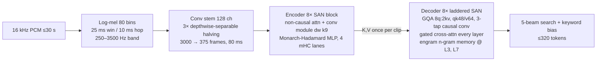

# Research Dossier — Cactus Whistle (on-device STT) & Hungarian adaptation

Research dossier. Explore-mode — no OpenSpec change, no implementation.
Date: 2026-10-04.
Goal: research Cactus Whistle small CPU STT model (HF + GitHub); assess how to train it for Hungarian.
Sources: Hugging Face `Cactus-Compute/whistle`, `Cactus-Compute/needle3`; GitHub `cactus-compute/needle` (commit `9571a58`, 2026-10-02), `cactus-compute/cactus`; blog `cactuscompute.com/whistle` (2026-10-02).
Raw evidence: `~/Documents/research/cactus-whistle/evidence/` (outside repo, like sub1b artifacts in `~/moss-bench/`).
Related: `docs/research/sub1b-stt-diarization-benchmark.md` — Parakeet-v3 Hungarian measured there.

Legend: **[V]** = verified first-hand (file/byte-level), **[D]** = vendor-documented claim, **[H]** = hypothesis / inference to test.

---

## 1. Identity

| Field | Value |
|---|---|
| Name | Whistle ("Speech Recognition for Tiny Devices") |
| Vendor | Cactus Compute, Inc. (YC); authors Mroz, Ndubuaku, Mosoyan, Cylich, Kumar, Sandhu, Shemet, Lee |
| Released | HF repo created 2026-09-30, blog 2026-10-02 — **days old** |
| License | Apache-2.0 (weights + `needle` Python package) [V] |
| HF repo | `Cactus-Compute/whistle` — `whistle.cact` (16.9 MB), `checkpoints/whistle.safetensors` (220 MB, fp32), `config.json` [V] |
| Engine | Shared with Needle 3: `Cactus-Compute/needle3` — prebuilt `needle` binary, `libneedle.a`, `needle.h` for 16 platforms (macOS/iOS/watchOS/tvOS/Android/Linux x86/arm/riscv/mipsel/Windows/WASM) [V] |
| Python | `pip install cactus-needle` → `needle.transcribe("clip.wav")` [D] |
| Languages | en, de, fr, es, it, nl, pl — **no Hungarian** [V] |
| GitHub search "cactus whistle" | Unrelated repo only. Whistle lives inside `cactus-compute/needle` [V] |

## 2. Capabilities [D]

- Transcribes 16 kHz mono, ≤ 30 s per pass. Auto language-ID, emitted as token.
- Word timestamps from decoder cross-attention (start/end/probability).
- Speech embeddings: encoder output, 1 row / 80 ms frame (`needle_embed`).
- Keyword biasing: Aho-Corasick automaton lifts log-prob of supplied phrases during 5-beam search.
- Silence/steady-noise gate: loudness-range check → empty transcript (anti-hallucination).
- Ladder: decoder depth selectable at load (`--audio-depth N`, N ≥ 2). Encoder always 8 layers.
- Fuses with Needle 3 (tool-calling LM): audio in → tool-call JSON out in one engine call.

Benchmarks (vendor, Apple M4 Pro, 10 s clip): TTFT 11.1 ms (vs Whisper base 73.2), decode
1,319 tok/s, 16.9 MB vs Whisper-base 145.3 MB. WER ahead of Whisper base on LibriSpeech,
SPGISpeech, Earnings-22, FLEURS-avg(7 langs); behind on TED-LIUM, AMI, MLS-avg. Not independently verified.

## 3. Architecture (from checkpoint header) [V]

`whistle.safetensors` metadata — **55.15 M params**, checkpoint stage `qapt`
(quantization-aware post-training), step 25 000, base `avg230-250.pkl` (checkpoint averaging),
weight bits `embedding=4, stack/mhc=4, encoder/mhc=4, default=2`, KV 8-bit, activations 8-bit.



Key config: `dim 512, enc_layers 8, dec_layers 8, text vocab 8192 (+7 lang tokens = 8199 rows),
engram orders [2,3], 18 432 slots, 2 hashes, rope 1e5, max_tokens 320, bf16 training`.
Training augmentation recorded in config: SpecAugment (2 freq masks w17, 10 time masks w0.05),
speed perturb 0.9–1.1, dither 1e-5, `per_augment_prob 0.1` [V].

Parameter mass: encoder ≈ 19 M, decoder ≈ 16 M, engrams ≈ 19.9 M (hashed n-gram tables), embedding 4.2 M.

## 4. Tokenizer findings [V]

- SentencePiece BPE, identical to Needle 3's tokenizer for ids 0–8191; ids 8192–8198 =
  `<|en|> <|de|> <|fr|> <|es|> <|it|> <|nl|> <|pl|>`.
- Almost entirely ASCII: only ~42 non-ASCII pieces; **no** `á í ö ü ő ű` pieces at all.
  Byte-fallback (256 `<0xNN>` pieces) covers every other UTF-8 char, so Hungarian is
  *representable* without changing the vocabulary.
- Token cost (probe in `~/Documents/research/cactus-whistle/evidence/tokenizer-hu-probe.out.txt`):

| Lang | tokens / word |
|---|---|
| en | 1.38 |
| de | 2.52 |
| pl (supported) | 3.90 |
| hu | 3.95 – 5.00 |

  Hungarian sits in same band as Polish, which ships — tokenizer *workable*.
- **Risk:** 30 s Hungarian speech ≈ 65–75 words ≈ 260–375 tokens vs. hard cap 320 →
  truncation on long, dense clips. Mitigation: VAD-chunk to ≤ 20 s.

## 5. Openness audit — what you can / cannot touch

| Piece | Public? | Notes |
|---|---|---|
| fp32 training checkpoint | **Yes** [V] | `checkpoints/whistle.safetensors` — full weights, fine-tunable |
| Whistle model code (JAX/Flax forward) | **No** [V] | `needle/model/architecture.py` has only the Needle text LM (shares SAN, engram, mHC, Hadamard MLP, taps blocks). No stem/encoder/cross-attn/mel code. |
| Whistle training / data recipe | **No** [V] | No dataset list or hours disclosed. |
| Fine-tuning tooling | Needle only [V] | `needle finetune` = LoRA on text LM; `needle platform finetune` hard-codes `BASE_MODEL="needle-3"`. |
| `.cact` exporter | Needle only [V] | `export.py` documents container format (header, **nameless** tensor directory, CQ 2/3/4-bit + ternary/binary packing, RAW tokenizer blob). No Whistle tensor ordering. |
| Quantizer (Cactus Quants) | **Yes** [V] | `quantize.py`: Lloyd-Max codebooks + Hadamard rotation, `cq_ste` for QAT. |
| C++ engine source | **No** [V] | Binary-only (`libneedle.a`, `needle.h`); not in `cactus-compute/cactus`. |
| Language list in engine | Likely vocab-driven [H] | Binary contains no hard-coded `en/de/…` table, only `"unknown language "` error ⇒ probably resolves `<|xx|>` in the embedded tokenizer. **Must test** with a patched `.cact`. Python `needle.transcribe` passes language through; only the playground validates `LANGUAGES`. |

**Bottom line:** fine-tuning Whistle for Hungarian is *possible* (weights + quantizer + container spec + vocab-driven language tokens), but requires **re-implementing the forward pass** and **reverse-engineering the Whistle tensor order** for export. Nothing turnkey.

## 6. Hungarian data inventory

| Corpus | Type | License | Notes |
|---|---|---|---|
| Mozilla Common Voice (hu) | read speech | CC0 | tens of hours validated; mirrors `fsicoli/common_voice_17_0…22_0` |
| Google FLEURS (hu_hu) | read | CC-BY-4.0 | small (~10 h); use as **test set** for comparability with vendor FLEURS numbers |
| VoxPopuli (hu) | EP parliament | CC0 | transcribed subset + large unlabeled pool |
| NVIDIA Granary / `espnet/yodas-granary` | pseudo-labelled YouTube/YODAS | CC-BY (check per subset) | large-scale hu, the data family behind Parakeet-v3 |
| `jimregan/hungarian-youtube-speech` | YouTube | check | community |
| BEA (HUN-REN NYTI) | spontaneous | research licence | high value for conversational WER; needs agreement |
| Pseudo-labels | any hu audio | own | distil from `Trendency/whisper-large-v3-hu` or `parakeet-tdt-0.6b-v3` |

Target: ≥ 300–1 000 h (incl. pseudo-labels) for a model this small to reach usable WER on a new language; ~50–100 h only adapts a model that already knows the language.

## 7. How to train Whistle for Hungarian — plan

### Path A — Ask the vendor (lowest effort)
Platform fine-tuning exists for Needle only. Email `founders@cactuscompute.com` requesting
Hungarian Whistle / Whistle fine-tuning on the platform. They hold the training code, data
pipeline, ladder training and 2-bit QAT recipe.

### Path B — DIY fine-tune of the released checkpoint

```mermaid
flowchart TD
  P0[0. Baseline: run whistle on FLEURS-hu with language=pl/de → WER floor] --> P1
  P1[1. Re-implement forward in JAX/Flax<br/>reuse needle architecture.py blocks<br/>+ mel front-end, stem, encoder conv module, cross-attn] --> P2
  P2[2. Parity test vs engine<br/>needle_embed → encoder parity<br/>forced decode / logits → decoder parity] --> P3
  P3[3. Vocab extension<br/>append &lt;|hu|&gt; as id 8199<br/>init from mean of lang rows] --> P4
  P4[4. Fine-tune bf16<br/>hu 60–70% + 7-lang replay 30–40%<br/>SpecAug + speed perturb per config<br/>random ladder depth per step] --> P5
  P5[5. QAT continuation<br/>cq_ste, 2-bit default / 4-bit emb+mhc<br/>KV/act 8-bit] --> P6
  P6[6. Export .cact<br/>recover tensor order by re-quantising original<br/>safetensors and byte-matching whistle.cact<br/>append tokenizer blob with &lt;|hu|&gt;] --> P7
  P7[7. Validate in engine<br/>needle_transcribe language=hu<br/>FLEURS-hu, CV-hu WER; regression on 7 langs]
```

Step notes:
1. **Forward re-implementation** — biggest task. Shapes in `~/Documents/research/cactus-whistle/evidence/whistle-safetensors-inventory.txt`
   pin every module: stem (`w`,`dw_1`,`dw_2` 3×3 depthwise, `pw_*` 128×128, `out` 1280→512 = 128 ch × 10 mel-bands),
   encoder conv module (`pw1` 512→1024 ⇒ GLU, `dw` k9, `pw2`), two Hadamard MLPs per encoder block
   (Macaron/Conformer-like), decoder `cross_attn` with `cross_gate` (σ-gated, per blog formula
   `x ← x + σ(g)·softmax(q̂K̂ᵀ/√d)V`). Norm placement and mel normalisation must be inferred → parity tests mandatory.
2. **Parity** — `needle.Whistle().embed(audio)` gives quantized encoder output: free oracle.
   Expect small diffs (2-bit weights vs fp32); compare cosine similarity, not equality.
3. **Language token** — 1 new embedding row (embedding tied/shared for output). Alternative with
   zero engine risk: *reuse* `<|pl|>` slot (retrain it to mean hu) — loses Polish; only if engine rejects new tokens.
4. **Training** — 55 M params: one 24–48 GB GPU plenty (or TPU/JAX). Freeze nothing initially;
   if data < 100 h, freeze stem + lower encoder layers. Replay prevents catastrophic forgetting.
   Engram n-gram tables hashed from token n-grams → Hungarian n-grams collide with
   existing entries; must stay trainable (unfrozen).
5. **QAT** — shipped model is 2-bit; fp32 fine-tune then naive PTQ to 2-bit badly degrades.
   Use `quantize.cq_ste_params` style straight-through QAT for final steps (vendor did 25 k QAPT steps).
6. **Export** — container format documented in `export.py` header; tensor directory nameless,
   so derive order by quantising each original tensor with `cq_quantize` at its recorded bit width
   and locating identical packed bytes inside `whistle.cact`.
7. **Engine acceptance** of `hu` is the go/no-go gate [H] — test it **first**, cheaply, by patching
   only the tokenizer blob of stock `whistle.cact` (rename `<|pl|>` piece → `<|hu|>`, call with `language="hu"`).

Effort estimate: forward+parity 1–2 weeks, data pipeline 1 week, training/QAT 1–2 weeks of GPU
time iterations, export 3–5 days. High risk of hidden engine assumptions (closed binary).

### Path C — Pragmatic alternatives for Hungarian on-device today

| Model | Size | hu | Runtime |
|---|---|---|---|
| `nvidia/parakeet-tdt-0.6b-v3` | 600 M (CQ4 in Cactus) | **Yes** (25 EU langs) | Cactus engine default STT model |
| `sarpba/whisper-base-hungarian_v4` / `-soup` | ~74 M | fine-tuned | Whisper → Cactus / whisper.cpp |
| `sarpba/whisper-hu-small-finetuned` | ~244 M | fine-tuned | Whisper → Cactus (Apple NPU) |
| `Trendency/whisper-large-v3-hu` | 1.5 B | fine-tuned | teacher for pseudo-labels |
| `jonatasgrosman/wav2vec2-large-xlsr-53-hungarian` | 300 M | CTC | baseline |

Recommendation: **benchmark Parakeet-v3 (Cactus) and whisper-base-hu on FLEURS-hu first.** If the
16.9 MB footprint is a hard requirement (MCU/wearable), go Path A, then Path B; use Parakeet-v3 /
whisper-large-v3-hu as pseudo-label teachers for Path B data.

## 8. Risks & open questions

- Model is days old; APIs/format may change (`weights_version 2.0.0`).
- Closed engine: any hard-coded assumption (vocab size 8199, language count) blocks Path B.
- Training data undisclosed → can't reproduce mixture for replay; approximate with MLS/CV/FLEURS of 7 langs.
- 250–3500 Hz band limit (telephone-like) may hurt Hungarian fricatives/sibilants (sz/s/zs/cs) — measure.
- Token cap 320 vs Hungarian agglutination; consider ≤ 20 s chunks.
- Vendor WER numbers not independently verified.

## 9. Evidence files (`~/Documents/research/cactus-whistle/evidence/`)

| File | Content |
|---|---|
| `hf-whistle-README.md` | model card snapshot |
| `hf-whistle-config.json` | HF config |
| `whistle-safetensors-inventory.txt` | checkpoint metadata + all 116 tensor shapes |
| `whistle-tokenizer-pieces.txt` | 8199 pieces extracted from `whistle.cact` |
| `tokenizer-hu-probe.py/.out.txt` | tokens/word measurement en/de/pl/hu |
| `needle.h` | C API (`needle_transcribe`, `needle_embed`, `needle_set_audio`) |

## 10. Links

- https://huggingface.co/Cactus-Compute/whistle
- https://huggingface.co/Cactus-Compute/needle3
- https://github.com/cactus-compute/needle
- https://github.com/cactus-compute/cactus
- https://cactuscompute.com/whistle · https://cactuscompute.com/blog/finetuning-needle · https://cactuscompute.com/llms.txt
- https://huggingface.co/nvidia/parakeet-tdt-0.6b-v3
