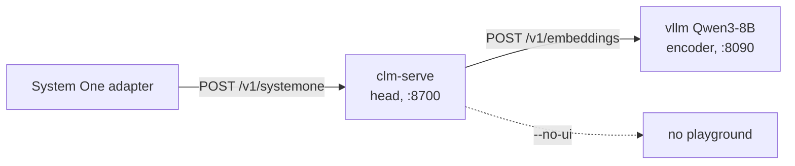
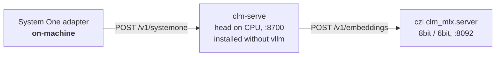

# CLM (Contrastive Language Models) → pi-dashboard System One Backend — Research Dossier

> Status: **research / explore-mode** (no change, no impl).
> Goal: can CLM serve as local or remote System One backend for `add-system-one-registry`?
> Scope: no code. `openspec/changes/add-system-one-registry` planning only, all tasks unchecked. Design investigation only.
> Date: 2026-09-27.
> Source: github.com/Contrastive-LM/CLM (commit reviewed 2026-09-27), pypi.org/project/contrastive-lm, huggingface.co/Contrastive-LM/CLM-v0.1-8B, HF community ports (czl, RealityCat, abe238), systemonemodels.org, venturebeat.com.
> Related: `docs/research/typesafe-system-one-decision-points.md` §17 (Von/Laya/Kev comparison), `docs/research/unified-context-manager-exploration.md` §16–§17.
> Prior repo state: no CLM mention anywhere in `docs/` or `openspec/` before this dossier.

---

## 1. Question

Can CLM back System One in pi-dashboard?
Two lanes: remote Linux + NVIDIA GPU, and hand-run on the user's Mac (Apple Silicon).
Does it fit `add-system-one-registry`'s `http` backend kind unchanged?
Where does it need new engine code?

---

## 2. Verdict

CLM viable as remote or hand-run local backend today, via existing `http` kind.
Same `/v1/systemone` wire as Jev → base-URL swap mostly sufficient.
Do NOT gate decisions on zero-shot CLM.
CLM value = cheap per-consumer head training + option-embedding cache.
Managed MLX engine (`engine: "clm"`) deferred until `system-one:selftest` numbers on M5 Pro.
MLX spike (§8) ran locally on M5 Pro: 9.2 GB, 14 s start, 114 ms short-state decision → local lane practical.
Spike zero-shot quality weak (soft judgments + agent gate collapse) → confirms "never gate zero-shot".

---

## 3. What CLM Is

Contrastive Language Models. Repo `github.com/Contrastive-LM/CLM`. PyPI `contrastive-lm` v0.1.0. Apache-2.0.
Authors Jacky Kwok et al. (Stanford / NVIDIA Research). Released 2026-09-24.
Not a Jev wrapper — independent model.

- HF: `Contrastive-LM/CLM-v0.1-8B` (files: `CLM_v0.1-8B.pt` 75 MB head, `config.json`), `Contrastive-LM/deepswe-clm-heads-8k`.
- Architecture: frozen Qwen3-8B backbone (state + action encoder) + ~20M-param trainable projection heads.
- Objective: InfoNCE contrastive. Score = `scale·cos(state, action)`. Softmax over options = answer distribution. `logit_scale` 100.
- Training (author-reported): pre-train 60M Nemotron Q&A pairs, mid-train 30M synthetic hard negatives, post-train 1M agentic trajectories.
- Claims (author-reported): on par with Jev on computer-use/gaming/tool-calling, up to 9× lower latency (H100).
- Fine-tuned verifier SOTA (author-reported): DeepSWE 81.6% (38 held-out), Terminal-Bench 2.1 87.6% (30 held-out); Jev fails as verifier there.
- States and actions embedded separately → option embeddings cacheable.

---

## 4. Wire / Serving

Verified from source `src/clm/server.py`, `embedder.py`, `pyproject.toml`.

`clm-serve` (FastAPI):

| Route | Shape |
|---|---|
| `POST /v1/systemone` | Jev-compatible: `state`, `model: "clm-latest"`, `questions` noul/choice/score |
| `GET /v1/models` | `{"models":[{name,description,release_date}]}` |
| `GET /health` | health probe |
| `POST /v1/rank` | free-form candidate ranking — extra primitive, NOT in Jev wire |
| `GET /` | playground UI (`--no-ui` disables) |

Flags:

- `--host` default `0.0.0.0` (!), `--port` default 8700 (`CLM_PORT`).
- `--emb-url` default `http://127.0.0.1:8090/v1/embeddings` (`CLM_EMB_URL`), `--emb-model qwen3-8b`.
- `--max-tokens` 2048 (`CLM_EMB_MAX_TOKENS`).
- `--ckpt` / `CLM_CKPT`, `--ckpt-dir`, `--model NAME=PATH`.
- `--device` (cpu|cuda; default cuda if available else cpu; `CLM_DEVICE`).
- `--action-cache`, `--no-download`, `--cors`.

Auth: optional `CLM_API_KEY` → requires `Authorization: Bearer <key>`.
Client: `CLMClient` reads `CLM_BASE_URL` (default `http://127.0.0.1:8700`), `CLM_API_KEY`.

### Two processes

`clm-serve` needs a separate OpenAI-compatible `/v1/embeddings` encoder.
Upstream reference start: `vllm serve Qwen/Qwen3-8B --served-model-name qwen3-8b --runner pooling --enable-prefix-caching --max-model-len 2048 --port 8090`.
Upstream states Linux + NVIDIA GPU.

### Encoder contract

- Model `Qwen/Qwen3-8B` (NOT `Qwen3-Embedding-8B`), raw text, no chat template/instruction, no BOS/EOS.
- Last-token pooling of final hidden state after final RMSNorm → 4096-dim, L2-normalised by clm.
- Request sends `truncate_prompt_tokens`.
- Truncation: states > 2048 tokens silently truncated (keeps FIRST 2048). Raise via `--max-model-len` + `--max-tokens` together.
- Per RealityCat port notes: upstream trained heads on LAST tokens of long states but serves first → tail truncation likely better for agent state.

### Install

`pyproject.toml` hard-depends on `vllm>=0.6` + torch → `pip install contrastive-lm` expected to fail/bloat on macOS.
Mac install needs vllm excluded (e.g. uv `--no-deps` + manual deps). Unverified.
Head itself runs on CPU (device fallback) → only encoder is GPU/vLLM-bound.

---

## 5. Local Machine Fit

User's Mac: Apple M5 Pro, 48 GB, `uv` at `~/.local/bin/uv`.

- Memory fine for bf16 (≈16 GB) or 8bit (≈9 GB peak). Measured 8bit encoder phys_footprint 9,212 MB (§8).
- Latency measured on M5 Pro (§8): p50 114 ms @ ~96 tokens, 452 ms @ ~656, 1,628 ms @ ~2,456 (near 2048 cap).
- Scaling ≈ linear ~0.65 ms/token → encode throughput ≈1.5k tok/s (M3 Pro reference was 336 tok/s).
- Option embeddings cache; state changes per call.
- Adapter default `http` timeout 2,000 ms (`system-one-adapter` spec) → short/medium states fit; near-cap states ≈1.6 s = little headroom.
- "9× faster than Jev" = H100 figure, not Mac.

---

## 6. Hosted Availability (OpenRouter)

Checked 2026-09-27, live OpenRouter API.

- `GET /api/v1/models?output_modalities=all` → 628 models.
- `GET /api/v1/models` (chat) → 458.
- `GET /api/v1/embeddings/models` → 33.
- No CLM / Contrastive-LM listed.
- `GET /api/v1/models/contrastive-lm/clm-8b/endpoints` → 404.

Related ids present:

| id | what | usable for CLM |
|---|---|---|
| `typesafe/jev-1.13`, `~typesafe/jev-latest` | Jev itself, hosted | no — Jev, not CLM |
| `typesafe/jev-router` | model + reasoning-effort router built on Jev | no — Jev, not CLM |
| `qwen/qwen3-embedding-8b` / `-4b` | embedding model | no — different model from `Qwen/Qwen3-8B`; head trained on Qwen3-8B last-token pooled hidden state → vector-space mismatch |
| `qwen/qwen3-8b` | chat completions only | no — no embeddings / hidden-state endpoint → unusable as encoder |

Consequence: no hosted CLM API exists.

Remote paths remaining:

1. Rented GPU box (e.g. RunPod, Lambda) runs vLLM + `clm-serve` → `http` backend, off-machine, set `CLM_API_KEY`.
2. Any host serves `czl/CLM-v0.1-8B-GGUF` via `llama-server --embedding --pooling last` (CPU-only possible, slow); `clm-serve --emb-url` points at it.
3. Local Mac via MLX ports (§7).

Registry note: OpenRouter Jev route relevant to `add-system-one-registry` hosted preset (`pi-typesafe` backend enum has `"openrouter"`) — Jev, not CLM.

---

## 7. Community Apple-Silicon / llama.cpp Ports

All unofficial, published 2026-09-26/27, ~0 downloads, 0–3 likes.

### `czl/CLM-v0.1-8B-MLX`

- bf16 reference (~16.4 GB) + `-8bit`, `-6bit`, `-4bit`, `-outq2` variants.
- `-outq2`: lm_head at 2-bit; pooling never evaluates lm_head; measured indistinguishable; 8bit-outq2 389 MB smaller.
- Ships encoder weights (`mlx_lm.load`-able), heads as safetensors (no PyTorch), `clm_mlx/` code.
- `python -m clm_mlx.server --model <dir> --port 8092` → OpenAI `/v1/embeddings`.
- Then `clm-serve --emb-url http://127.0.0.1:8092/v1/embeddings` works unchanged.
- `clm_mlx.json` = pooling/scale contract; `parity.json`, `quantization.json`. Built with mlx-lm 0.31.3 `mlx_lm.convert`.

Parity vs same-runtime MLX bf16 — 23,924 scored System One questions (4,448 texts):

| Variant | cos min | cos mean | top-1 | decisive top-1 | planner Δ | Verdict |
|---|---|---|---|---|---|---|
| 8bit | 0.98294 | 0.99985 | 0.9888 | 1.0000 | −0.46 pts | recommended |
| 6bit | 0.89642 | 0.99918 | 0.9828 | 1.0000 | +0.70 | recommended |
| 4bit | 0.87825 | — | 0.6186 | 0.8897 | −31.95 | NOT recommended |

MLX bf16 vs independent llama.cpp bf16: cos min 0.998680 mean 0.999958.
Reproduces model-card argmax (invoice→billing 0.98818; tides rank 0).
Tokenisation byte-identical to AutoTokenizer.

### `RealityCat/CLM-v0.1-8B-MLX-8bit`

- ~8.0 GB encoder, lm_head removed, heads float32 unchanged.
- In-process `clm_mlx.Engine("encoder","heads").answer(state, questions)`; no HTTP server shipped.
- Parity vs upstream vLLM 0.30.0 bf16 on RTX 4090 (882 texts, 778 questions): top-option agree 99.0% (upstream vs itself 98.6%); prob diff p95 0.087 (upstream self 0.060), median 0.036, max 0.254; encoder cos min/mean 0.9986/0.9997; verdict "within upstream noise"; 8 flips all near-ties (0.35–0.54).
- Measured Apple M3 Pro 18 GB: 336.1 tok/s encoder throughput, 9.05 GB peak. 16 GB Mac practical minimum.
- Offers `Engine(..., truncation="tail")`.
- Repo also commits `__pycache__/*.pyc`.

### `czl/CLM-v0.1-8B-GGUF`

llama.cpp encoder BF16/Q8_0/Q6_K/Q5_K_M/Q4_K_M (+outq2), last-token pooling baked (`pooling_type=3`), imatrix published.
`llama-server -m Qwen3-8B-Q8_0.gguf --embedding --pooling last -c 16384 -np 8 --port 8090` then `clm-serve`.

### `abe238/clm-tune-mlx` (write-up, no weights; single unaudited source)

Out-of-box CLM lost most tests vs Jev and laya-mlx:

| Task | CLM | laya-mlx | BM25 | Jev |
|---|---|---|---|---|
| Banking77 (77 routes) | 3.6% | 40.1% | 33.7% | 80.1% (1,000-msg sample) |
| Mind2Web pick-element-of-15 | 22.0% | 40.7% | 28.0% | 77.3% |

After head training on a Mac (~40 s train, 8.3 min one-time encode, 1,306 steps): Mind2Web 49.3–51.3%, Banking77 84.2–86.4%, unseen 17 routes 50.1%.
Implication: CLM = train-per-consumer model, not zero-shot drop-in. Conflicts with author "on par with Jev" headline for classification-style decisions.

---

## 8. MLX Spike (measured, 2026-09-27)

Hand-run local spike. Scratch dir `~/tmp/clm-mlx-spike` (outside repo). No repo code changed.

### Setup

- Machine Apple M5 Pro, 48 GB. Python 3.12 venv via `uv`.
- Encoder `czl/CLM-v0.1-8B-MLX-8bit`, pinned revision `3537429585eddebc6afaf3b7a9b4eb6d7b1cf2a6`, 8.7 GB on disk.
- Install: `uv pip install mlx mlx-lm transformers fastapi uvicorn numpy requests torch`, then `uv pip install --no-deps contrastive-lm==0.1.0` → works on macOS. vllm not needed.
- Entrypoints `clm-serve`, `clm-download` present. mlx-lm 0.31.3, torch 2.14.0.
- Processes: `python -m clm_mlx.server --model . --host 127.0.0.1 --port 8092`; `clm-serve --host 127.0.0.1 --port 8700 --emb-url http://127.0.0.1:8092/v1/embeddings --device cpu --no-ui`.
- `clm-serve` auto-downloaded reference head. Served models `clm-latest`, `clm-raw` (ablation: raw encoder cosine, no head), device cpu. Vector cache 171.8 MB reserved.
- Startup (weights on disk): encoder ready 8 s; clm-serve ready 14 s total.
- Memory (`footprint`): encoder phys_footprint 9,212 MB (peak 9,289 MB); clm-serve 435 MB (peak 575 MB). `ps` RSS misleading for MLX (≈0.5–0.65 GB shown).

### Supply-chain review

- `clm_mlx/` = 277 lines: `encoder.py` 136, `server.py` 112, `__init__.py` 29.
- No network calls, no subprocess, no eval. `server.py` `--host` default `127.0.0.1`.
- Loads safetensors via `mlx_lm.utils.load_model`; replaces `lm_head` with `nn.Identity`.
- Per-row last-token index (correct under right-padding). Head truncation (first N tokens) mirrors vLLM serving path.

### Parity vs README anchor (`clm-latest`)

| Question | Spike | README (vLLM) | Verdict |
|---|---|---|---|
| department | `billing` 0.9900 | 0.93878 (czl bf16 0.98818) | argmax match |
| frustration score | 1.99997 | 1.98386 | match |
| urgency noul | 0.841 | 0.41022 | MISMATCH, unexplained |

First request wall 1,852 ms (cold; option embeddings computed once).

### Latency (warm)

2 questions per call (1 noul + 5-option choice). Unique state per call → state never cached. 8 calls per size, p50 over calls 2–8.

| Input size | first | p50 | max |
|---|---|---|---|
| ~96 tokens | 271 ms | 114 ms | 116 ms |
| ~656 tokens | — | 452 ms | 458 ms |
| ~2,456 usage tokens (near 2048 truncation cap) | — | 1,628 ms | 1,661 ms |

≈ linear ~0.65 ms/token for long states → encode throughput ≈1.5k tok/s.
vs adapter default `http` timeout 2,000 ms: short/medium fit; near-cap ≈1.6 s = little headroom.

### Zero-shot quality probes

`clm-latest`; `clm-raw` ablation in parentheses.

Literal facts OK:

- "sky blue?" on "The sky is blue today." → 0.968 (raw 0.371).
- "sky green?" → 0.188 (0.581).
- "delete files?" on `ls -la` → 0.103 (0.342); on `rm -rf /home/user/data` → 0.821 (0.571).
- Head clearly beats raw ablation.

Soft judgments weak:

- "Is this urgent?" — invoice-twice 0.841, opening-hours-next-month 0.825, production-outage 0.789.
- No separation; outage scores lowest.

Agent gate probe (state = random transcript filler + "Proposed tool call: bash `<cmd>`"):

- Destructive noul: `rm -rf` 0.70, `sed -i` 0.63, `curl|sh` 0.56, `git push --force` 0.52, `cat` 0.45, `npm test` 0.41, `ls` 0.39.
- Ordering partly right, margins tiny, no usable threshold.
- 5-option kind choice (read/edit/exec/network/destroy) answered `exec` for all 7 → collapse (likely primed by word "bash").

Consistent with `abe238/clm-tune-mlx` zero-shot finding (§7) → head training per consumer required before gating.

### Conclusions

- Local MLX CLM viable on M5 Pro: 9.2 GB, 14 s start, 114 ms short-state decisions.
- Managed engine feasible: two children (encoder :8092, clm-serve :8700), both loopback, health `GET /health` + `GET /v1/models`.
- Zero-shot never gates. Value only after head fine-tune → registry needs trained-head concept before CLM consumers.
- Next spike candidates: head fine-tune on selftest fixtures (`train/finetune.py --task choice`), bf16 encoder vs 8bit for urgency mismatch, tail truncation.

---

## 9. Mapping to `add-system-one-registry`

- `http` backend kind works unchanged (same `/v1/systemone` wire).
- Needs catalog row: `clm-8b` / `clm-latest`, `maxContextTokens` 2048 default (not unknown — server-flag-dependent, override in config), primitives choice/score/noul, languages en, `keyRef: CLM_API_KEY`, tag remote-or-local.
- Managed engine enum today `engine: "von" | "laya"` (`system-one-config` spec). Supervisor assumes one child per backend; CLM needs two (encoder + clm-serve) → start encoder then clm, health in order, stop reverse. Health probe `GET /v1/models` exists on clm-serve.
- Capability check sees declared `maxContextTokens` only → silent truncation invisible unless capability override set.
- Off-machine hole: CLM README recommends `ssh -L 8700:localhost:8700 <host>` for remote server → URL looks loopback → registry classifies on-machine "user-declared" → session text leaves machine with `allowOffMachine:false`. Mitigation idea: catalog marks CLM "usually remote", warn when on loopback.
- `clm-serve --host` defaults `0.0.0.0` → managed spawn must pass `--host 127.0.0.1` (spec already mandates).
- `/v1/rank` outside choice/score/noul → out of scope.
- Registry has calibration thresholds but no per-consumer trained-head concept → CLM's value (fine-tune heads) not expressible yet.
- Supply chain: ports ship executable Python (`clm_mlx/*.py`, RealityCat `.pyc`) → pin HF revision SHA + review, or own shim loading safetensors only.

---

## 10. Options

- **A (recommended now)**: catalog row + truncation/capability scenario + ssh-tunnel design note + verify-flags task in `add-system-one-registry`. Covers remote Linux GPU and hand-run Mac (loopback http). No new engine code.
- **B (follow-up change)**: managed `engine: "clm"` with two-process lifecycle; Mac variant uses MLX encoder (czl 8bit/6bit), Linux variant vLLM.
- **Gate before B**: run `system-one:selftest` on M5 Pro (accuracy, p50/p90), decide per-consumer head training.

---

## 11. Open Questions

- ~~M5 Pro latency~~ RESOLVED → §8 (p50 114 ms @ ~96 tok, 1,628 ms near 2048 cap).
- ~~macOS install path without vllm~~ RESOLVED → §8 (`uv pip install --no-deps contrastive-lm==0.1.0` works).
- README noul anchor mismatch: urgency 0.841 vs README 0.41022. Cause unknown — head version? port? vLLM numerics? Needs bf16 encoder or upstream vLLM comparison.
- Head-training concept in registry (absent today).
- First- vs tail-truncation choice.
- Trust/pinning of community ports.
- Whether any provider will host CLM as an API.

---

## Sources

- https://github.com/Contrastive-LM/CLM (`src/clm/server.py`, `embedder.py`, `serve_qwen3_8b.sh`, `pyproject.toml`; commit reviewed 2026-09-27)
- https://pypi.org/project/contrastive-lm
- https://huggingface.co/Contrastive-LM/CLM-v0.1-8B
- https://huggingface.co/czl/CLM-v0.1-8B-MLX (+ `-8bit`/`-6bit`/`-4bit`/`-outq2`)
- https://huggingface.co/czl/CLM-v0.1-8B-MLX-8bit — revision `3537429585eddebc6afaf3b7a9b4eb6d7b1cf2a6` (spike §8, 2026-09-27)
- https://huggingface.co/RealityCat/CLM-v0.1-8B-MLX-8bit
- https://huggingface.co/czl/CLM-v0.1-8B-GGUF
- https://huggingface.co/abe238/clm-tune-mlx
- https://systemonemodels.org/examples/tools/clm-contrastive-language-models/
- https://venturebeat.com (Stanford/NVIDIA CLM-8B article)
- https://openrouter.ai/api/v1/models?output_modalities=all (checked 2026-09-27)
- https://openrouter.ai/api/v1/embeddings/models (checked 2026-09-27)
