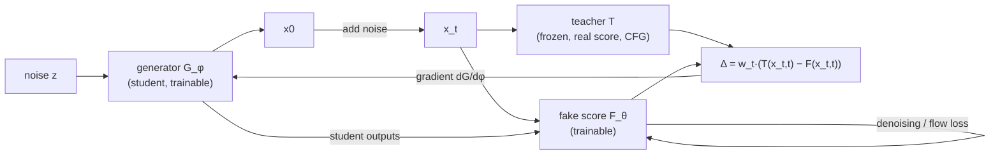
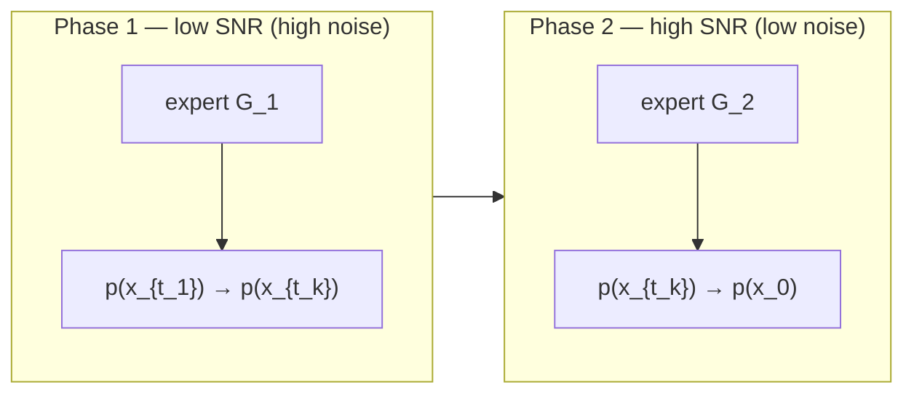

# DMD / DMD2 / Phased DMD — Video Distillation Research Dossier

Research dossier. Plan only — no OpenSpec change, no implementation.
Sources fetched 2026-10-04.

> Status: **research / pre-planning**.
> Goal: know what is required — method, data, hardware, software — to distill / fine-tune
> video diffusion models with DMD and Phased DMD ("PDMD").
> Interpretation note: "teaching video" here = teacher→student distillation of video
> diffusion models. "PDMD" = **Phased DMD** (SenseTime Research / Beihang). DMD is
> **step distillation** (speed: 40–50 steps → 1–4), **not** a content fine-tune.
> Content adaptation = LoRA SFT on the teacher first, then distill that teacher
> (or stack a Lightning LoRA) — that workflow is *inference*, not paper-stated.
> Host note: Robert's Mac M5 Pro 48 GB unified MPS — cannot run these trainers
> (CUDA + FSDP + flash-attn + NCCL, Linux); local = inference-only experiments;
> training = rented Linux NVIDIA cluster.
> Facts verified 2026-10-04 unless marked *unverified* or *inference*.

---

## 1. Sources

| Kind | Location |
|---|---|
| DMD — Yin et al., "One-step Diffusion with Distribution Matching Distillation" | arXiv 2311.18828, CVPR 2024 |
| DMD2 — Yin et al., "Improved Distribution Matching Distillation for Fast Image Synthesis" | arXiv 2405.14867, NeurIPS 2024 Oral; `https://tianweiy.github.io/dmd2/` |
| Phased DMD — Fan, Qiu, Wu, Wang, Lin, Ren, Dahua Lin, Ruihao Gong, Lei Yang (SenseTime Research, Beihang) | arXiv 2510.27684 (v1 2025-10-31, v3 2026-03-25), CVPR 2026 pp. 41667–41676; `https://x-niper.github.io/projects/Phased-DMD/` |
| CausVid (DMD → autoregressive video) | `github.com/tianweiy/CausVid`, CVPR 2025 |
| Self Forcing | arXiv 2506.08009; `github.com/guandeh17/Self-Forcing`; HF `gdhe17/Self-Forcing` |
| NVIDIA FastGen | `github.com/NVlabs/FastGen` (Apache-2.0); blog `developer.nvidia.com` "Accelerating Diffusion Models with an Open, Plug-and-Play Offering" |
| FastVideo (hao-ai-lab) | `github.com/hao-ai-lab/FastVideo`; docs `haoailab.com/FastVideo/distillation/dmd/` |
| Community DMD2 Wan2.1 | `ZulutionAI/DMD2_wan2.1`; `azuresky03/distill_wan2.1` (DMD + RL post-training) |
| Phased DMD output weights | `ModelTC/Wan2.2-Lightning` (HF `lightx2v/Wan2.2-Lightning`) |
| Z-Image issue #56 | Decoupled DMD discussion; X-niper reports degradation after ~700 student iters |

---

## 2. Method primer

### 2.1 DMD (Distribution Matching Distillation)

Three nets:

| Net | Role | Trainable |
|---|---|---|
| Generator `G_φ` | student; maps noise → sample | yes |
| Fake score `F_θ` | tracks the student's output distribution | yes |
| Teacher `T` | frozen diffusion model; real score, with CFG | no |

`G` and `F` initialize from the teacher.

Objective: minimize reverse KL `KL(p_fake ‖ p_real)`.
Gradient ≈ `E[ w_t · (T(x_t,t) − F(x_t,t)) · dG/dφ ]`.
No backprop through `T` or `F` → scalable vs SiD.

DMD facts:

- Original DMD adds regression loss `λ_reg = 0.25` + LPIPS on precomputed teacher
  `(noise, multi-step sample)` pairs — expensive paired dataset; stabilizes mode coverage.
- DMD2 **removes** the regression loss. Adds:
  - two-timescale update (fake score updated more often, e.g. 5 `F` updates per `G` update);
  - GAN loss on fake-score features;
  - multi-step backward simulation with **SGTS** (stochastic gradient truncation:
    random stop step `j`, gradient only on last step).
- Assumptions: **A1** `F` converged per `G` update; **A2** `F` unbiased (same params/target as teacher).
- Data-free in principle: needs only prompts (+ images for I2V). GAN-term variant needs
  real/teacher-generated videos (FastVideo uses 600k synthetic latents
  `Wan-Syn_77x448x832_600k`; FastGen Wan DMD2 uses data generated from Wan2.1 14B with
  VidProM prompts).
- Weakness: one-step / SGTS → diversity loss, slower motion, close-up bias in video;
  reverse-KL is mode-seeking.

### 2.2 Phased DMD (PDMD)

Splits the SNR range into subintervals (**phases**). Each phase trains one expert `G_k`
mapping `p(x_{t_{k-1}}) → p(x_{t_k})`. Progressive low→high SNR (ProGAN-like, **NOT**
progressive distillation).

Phased DMD facts:

- Backward simulation stops at intermediate `t_k`, not clean `x0`; diffuses `x_{t_k}` to
  `t ~ T(t_k, 1)` (wider range beats `(t_k, t_{k-1})` empirically).
- Fake score **per phase re-initialized from teacher** (not prior phase); trained with a
  subinterval score-matching objective (paper Eq.11/13):
  - flow target = `((α_s²σ_t + α_t σ_s²)/(α_s² σ_{t|s}))·ε − x_s/α_s`;
  - stable form `clamp(1/σ_{t|s}², [0,10])·‖σ_{t|s}ψ − ((α_s²σ_t+α_tσ_s²)/α_s²)ε + (σ_{t|s}/α_s)x_s‖²`.
  - Naive target `‖ψ − (ε − x_s)‖²` is **biased** (breaks A2) — key implementation trap.
- Output = few-step **MoE** (one expert per phase) even if teacher not MoE; aligns with
  Wan2.2 A14B high-noise / low-noise experts.
- Compatible with SGTS: 4 steps in 2 phases (used for Wan2.2).
- No GAN loss, no regression loss — data-free.

### 2.3 Results (paper Table 2 — Wan2.2-T2V-A14B, 220 prompts seed 42)

Base = 40 steps CFG 4; distilled = 4 steps CFG 1.

| Metric | Base | DMD2 | Phased |
|---|---:|---:|---:|
| T2V optical flow | 10.26 | 3.23 | 9.30 |
| T2V dynamic degree | 79.55% | 65.45% | 82.27% |
| T2V FID vs base | — | 55.70 | 47.24 |
| T2V FVD | — | 763.1 | 700.9 |
| I2V optical flow | 9.32 | 7.87 | 9.84 |
| I2V dynamic degree | 82.27% | 80.00% | 83.64% |
| I2V FID | — | 18.45 | 17.47 |
| I2V FVD | — | 370.0 | 334.7 |

Image diversity (DINOv3 similarity ↓ = more diverse):

| Model | DINOv3 sim |
|---|---:|
| Wan2.1 base | 0.708 |
| vanilla DMD | 0.825 |
| DMD2 | 0.826 |
| Phased | 0.782 |

Project page labels DMD2 = "lightning v1.x"; Phased DMD = "lightning v2.0".

---

## 3. Compute / hardware — published recipes

| Recipe | Teacher | Hardware | Time / steps | Notes |
|---|---|---|---|---|
| Phased DMD paper | Wan2.1-T2V-14B, Wan2.2-T2V/I2V-A14B (28B total MoE), Qwen-Image-20B | 64 GPUs (type not stated in fetched text) | — | PyTorch FSDP + gradient checkpointing + context parallelism (T2V/I2V); batch 64; fake score full-param lr 4e-7; generator LoRA rank 64 alpha 8 lr 5e-5; AdamW β1=0 β2=0.999; 5 fake updates per generator update; Euler solver backward sim; 4-step/2-phase; video 81 frames |
| FastGen DMD2 | Wan2.1-T2V-14B → 2-step | 64× H100 | 16 h | — |
| FastVideo Sparse-distill (DMD+VSA) | Wan2.1 1.3B | 32× H200 (4 nodes) | 4000 steps ~12 h; 3-step student | global batch 64, grad accum 2, lr 1e-5, VSA sparsity 0.8, trained 61×448×832 |
| FastVideo | Wan2.1 14B | 64× H200 (8 nodes) | 3000 steps ~52 h | batch 64, SP 4, grad accum 4, lr 1e-5, sparsity 0.9, HSDP shard 8; slurm example: 8 nodes, 8 GPU/node, 128 CPU/task, 1440 GB RAM/node |
| FastVideo data-free DMD | Wan2.2-TI2V-5B | 64× H200 | 3000 steps ~12 h | batch 64, lr 2e-5 |
| FastVideo older single-node launcher `v1_distill_dmd_wan.sh` | Wan2.1 1.3B | 8 GPUs | — | batch 1/GPU, 448×832×77 frames, bf16 with FP32 master weights, three 1.3B DiTs resident (student, critic, teacher); no published min VRAM; 8×80 GB conservative *inference* |
| Self Forcing (DMD, autoregressive) | Wan2.1-1.3B | 64× H100 | 600 iters <2 h; authors: <16 h on 8× H100 via grad accumulation | inference 1× 24 GB (RTX 4090) Linux, 64 GB RAM |
| ZulutionAI DMD2_wan2.1 | Wan2.1 | FSDP + checkpointing + sequence parallel; config distilled base + LoRA fake score | — | cannot train 720p×81 frames (memory); 480p only; overexposure after 1000 steps (500 good); poor resolution generalization |
| FastGen `config_dmd2_wan22_5b` | Wan2.2-TI2V-5B | — | — | bf16, fsdp_meta_init, lr 1e-5 (net, fake score, discriminator), GAN weight 0.03, guidance 5.0, latent `input_shape [48,21,44,80]` = 720p 1280×704, 81 frames, student_sample_steps 2, `t_list [0.999,0.833,0.0]`, batch 1/GPU, fake_score_pred_type x0 |
| FastGen `config_dmd2` (Wan 1.3B) | Wan2.1 1.3B | — | — | `input_shape [16,21,60,104]` (480p 832×480), 4-step `t_list [0.999,0.937,0.833,0.624,0.0]`; VBench total 84.53 (2-step) / 84.72 (4-step) |

### 3.1 Tiered hardware recommendation

Marked *inference* except where sourced.

| Tier | Workload | Hardware | Cost / time |
|---|---|---|---|
| Tier 0 — learn / prototype | toy 1D / CIFAR DMD2 (FastGen EDM `config_dmd2_test`) | 1× 24 GB GPU | — |
| Tier 0 Mac | toy only | Mac MPS | *unverified* |
| Tier 1 — small video (Wan2.1-1.3B / Wan2.2-TI2V-5B, 480p, LoRA generator) | DMD2 run | 8× 80 GB (A100/H100) single node | ~days; Self-Forcing <16 h on 8× H100 sourced |
| Tier 2 — 14B / A14B (Phased DMD target) | Phased DMD run | 32–64× H100/H200, InfiniBand multi-node, FSDP + context/sequence parallel | 16–52 h sourced runs |

### 3.2 Memory budget reasoning (*inference*)

- Three copies of the DiT resident: teacher (frozen bf16), fake score (trainable
  full-param + AdamW states fp32), generator LoRA.
- Plus VAE + text encoder (umT5-XXL for Wan).
- 14B bf16 weights ≈ 28 GB per copy → why FSDP sharding is mandatory.

### 3.3 Storage

- Wan2.1-14B / Wan2.2-A14B checkpoints: tens of GB each.
- FastVideo synthetic latent dataset: 600k samples.
- Plan ≥1–2 TB NVMe (*inference*).

### 3.4 Cloud cost rough (*inference, verify current prices*)

- 64 H100 × 16 h = 1024 GPU-h; at ~$2–3/GPU-h ≈ **$2–3k per run**.
- 8× H100 × 16 h ≈ 128 GPU-h ≈ **$250–400**.
- Budget several runs for tuning.

---

## 4. Software stack

Base (verified from repos):

- Linux, NVIDIA CUDA, Python 3.10 (Self-Forcing) / 3.12 (FastGen).
- PyTorch ≥2 with FSDP/FSDP2, NCCL.
- `flash-attn` (`pip install flash-attn --no-build-isolation`).
- `torchrun` / slurm.
- W&B logging, `webdataset` (FastGen), `diffusers` (FastVideo models are Diffusers format).
- Optional VSA kernels (FastVideo).
- Docker (FastGen provides Dockerfile).

### 4.1 Frameworks comparison

| Framework | Distill methods | Models | Systems | License / usage |
|---|---|---|---|---|
| FastGen | DMD2, f-distill, LADD, CausVid, Self-Forcing; + CM / MeanFlow / KD / SFT | Wan T2V/I2V/V2V/VACE, Wan2.2-5B, CogVideoX, Cosmos-Predict2.5, Flux, Qwen-Image, SDXL | FSDP2, AMP, CP, flex-attn | Apache-2.0; Hydra-style overrides `python train.py --config=... - key=value`; `torchrun --nproc_per_node=8 train.py ... - trainer.fsdp=True` |
| FastVideo | DMD, DMD+VSA sparse-distill, Attn-QAT DMD2 | Wan2.1 1.3B/14B, Wan2.2 5B | slurm examples under `examples/distill/` | released FastWan2.1-T2V-1.3B / 14B-480P / FastWan2.2-TI2V-5B 3-step |
| Self-Forcing / CausVid | autoregressive streaming, DMD | Wan2.1-1.3B | ODE-init checkpoint | data-free prompts `vidprom_filtered_extended.txt` |
| ZulutionAI DMD2_wan2.1 | DMD2 | Wan2.1 | FSDP | reference, known instability |
| DiffSynth-Studio | "Direct Distill" (Qwen-Image), LoRA training on consumer GPUs | Qwen-Image | — | no DMD video recipe found *unverified* |

### 4.2 Phased DMD code status

- Official "Code" link → `ModelTC/Wan2.2-Lightning` = **inference code + LoRA weights only**
  (`generate.py`); no training entry point found.
- Paper says code/models "available" but training code **NOT verifiable as public**
  (2026-10-04).
- GitHub issue #37 requests full-param checkpoints + diversity eval scripts.
- LightX2V repo has a `lightx2v_train` dir but no Phased DMD reference found *unverified*.
- → To do Phased DMD = **implement it yourself** on top of a FastGen/FastVideo DMD2
  trainer (changes listed in §6).

### 4.3 Released Phased DMD weights

- `lightx2v` Wan2.2-T2V-A14B-4steps-lora-rank64-Seko-V2.0 (2025-11-08).
- Since 2025-09-28, all `lightx2v` Wan2.2 T2V/I2V use Phased DMD.
- ComfyUI native + Kijai WanVideoWrapper workflows.

---

## 5. Requirements checklist

- Teacher weights + license (Wan2.1/2.2 Apache-2.0 *verify*).
- Prompt set: VidProM-derived ~tens of thousands; Self-Forcing ships
  `vidprom_filtered_extended.txt`; long detailed prompts better.
- For I2V: image–prompt pairs.
- Optional synthetic teacher latents for GAN/regression variants.
- Eval set: 220 prompts / seed 42 protocol.
- Metrics: VBench (dynamic degree etc.), UniMatch optical flow, FID/FVD vs teacher,
  DINOv3 + LPIPS diversity, human review (paper notes VBench ranks base lowest,
  contradicts humans).

Teacher CFG note (FastVideo): `real_score_guidance_scale` `w` uses
`x = x_cond + w(x_cond − x_uncond)` → equals standard CFG `w+1`; default 3.5 ≈ CFG 4.5;
subtract 1 when porting paper values. Distilled student runs CFG 1 (no uncond pass).

---

## 6. Implementing Phased DMD on a DMD2 trainer — delta list

1. Choose phase boundaries `t_k` (2 phases for Wan2.2 align with expert switch boundary;
   shifted schedule).
2. Per phase: freeze earlier experts; new LoRA expert `G_k` (init from teacher /
   Wan2.2 matching expert); new fake score `F_k` reset to teacher.
3. Backward sim with no-grad earlier experts to `x_{t_k}`; gradient only through `G_k`
   step (+SGTS inside phase).
4. Noise `x_{t_k}` forward with `α_{t|s}`, `σ_{t|s}`; sample `t ~ T(t_k, 1)`.
5. Generator weight `w_{t|t_k} = α_t α_{t|t_k} / (α_t σ_t + σ_t²)`.
6. Fake loss = subinterval objective Eq.13 with `clamp [0,10]` (x-pred variant Eq.12);
   last phase `t_k = 0` reduces to standard DMD.
7. 5:1 fake:generator ratio, AdamW β1=0.
8. Unit test: reproduce paper 1D toy (`x0 ∈ {−1,0,1,2}`, 4-layer MLP hidden 512,
   subinterval `(0.5,1]`, Euler 100 steps) — correct target trajectories overlap the
   full-interval model; naive target diverges.

---

## 7. Risks / pitfalls

- Mode collapse / diversity loss.
- Overexposure / color drift with long training (ZulutionAI DMD2_wan2.1 at 1000 steps;
  Z-Image Decoupled DMD degrades after ~700 iters) → checkpoint often, eval early,
  EMA (`--use_ema` Self-Forcing).
- Resolution lock-in (train at target res).
- Slow motion with SGTS.
- Memory OOM at 720p×81.
- Reverse-KL mode seeking.
- CFG param confusion (`w+1` convention).
- Licensing of teacher outputs.
- No official Phased DMD trainer.

---

## 8. Recommended path (phased plan)

| Step | Action |
|---|---|
| 1 | Inference-only: try `lightx2v` Lightning LoRAs (DMD2 v1.1 vs Phased v2.0) on rented GPU / ComfyUI to see target quality. |
| 2 | Toy: FastGen EDM DMD2 CIFAR + implement 1D Phased toy. |
| 3 | Small video: FastGen or FastVideo DMD2 on Wan2.1-1.3B / Wan2.2-5B 480p, 8× H100. |
| 4 | Port Phased DMD delta (§6) onto that trainer; compare vs DMD2 with the 220-prompt protocol. |
| 5 | Scale to A14B only if Step 4 wins. |
| — | Content fine-tune: LoRA SFT teacher on own data first, then distill (*inference*). |

---

## 9. Open questions

- GPU type in the Phased DMD paper.
- Official training code release.
- Exact phase boundary for Wan2.2.
- Minimum VRAM for 5B LoRA-generator DMD.
- Mac MLX feasibility (none found).
