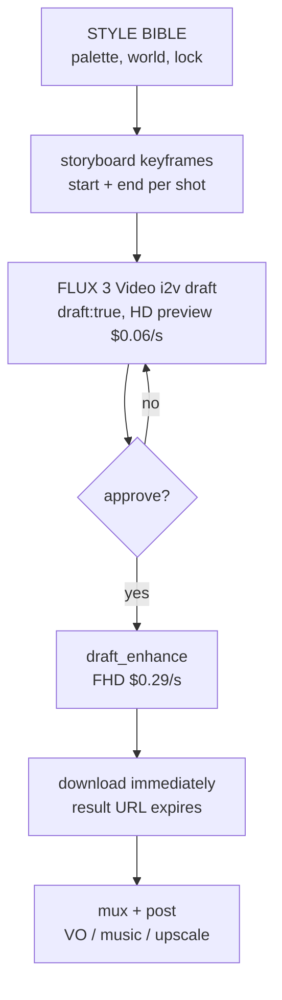

# FLUX 3 × `video-production` — Research Dossier

Research dossier + integration plan. Plan only — no OpenSpec change, no implementation.
Pickup-ready. Sources fetched 2026-10-04.

> Status: **research / pre-planning**.
> Goal: decide whether FLUX 3 (Video + Image + Video Edit) joins `packages/video-production`
> as an optional render / keyframe backend, and at what cost.
> Hosted API only for FLUX 3 Video/Image today — FLUX 3 Dev weights announced, undated.
> Host macOS arm64 = fine (API path needs only an HTTP client).
> Facts verified 2026-10-04 unless marked *unverified* or *inference*.

---

## 1. Sources

Primary (fetched 2026-10-04):

| Kind | Location |
|---|---|
| BFL blog — FLUX 3 announcement (2026-07-23) | `https://bfl.ai/blog/flux-3` |
| BFL blog — FLUX 3 Video Part 1 GA (2026-08-04) | `https://bfl.ai/blog/flux-3-video` |
| BFL model page + FAQ (res bands, pricing) | `https://bfl.ai/models/flux-3` |
| BFL help — what is FLUX 3 (modes, options, draft) | `https://help.bfl.ai/articles/7342522296-what-is-flux-3` |
| BFL help — self-serve dev license overview + pricing | `https://help.bfl.ai/articles/9272590838-self-serve-dev-license-overview-pricing` |
| BFL licensing (weights, synthetic data) | `https://bfl.ai/licensing` |
| HF — flux-3-action-so101 (+ `LICENSE.md`) | `https://huggingface.co/black-forest-labs/flux-3-action-so101` |
| HF — flux-3-action-base (7B action base, Qwen3-VL-4B text encoder, video VAE) | `https://huggingface.co/black-forest-labs/flux-3-action-base` |
| Replicate — FLUX 3 Image (BFL-owned listing, params) | `https://replicate.com/black-forest-labs/flux-3-image` |
| GitHub — flux2 README (FLUX.2 klein licenses) | `https://github.com/black-forest-labs/flux2` |
| docs.bfl.ai — flux3_image_overview (search snippet only; direct fetch failed) | `https://docs.bfl.ai/flux_3/flux3_image_overview` |

Secondary:

| Kind | Location |
|---|---|
| FLUX 3 Image pixel-exact test (2026-10) | creativeainews.com |
| FLUX 3 Image launch / analysis | the-decoder.com, deai.org, techtimes, orcarouter.ai ("Two names nine weeks apart") |
| Continuation / prompt guides | hiapi.ai, suno.bi, sequenced.ai, trezalabs, siray.ai |
| Video Edit coverage | gigazine, digitalapplied (limits) |
| Video Edit listing | `https://fal.ai/models/blackforestlabs/flux-3/edit-video` |
| GPU requirements (FLUX.2 proxy sizing) | spheron.network |
| FLUX 3 Action (2026-09-24) | marktechpost |

Notes:
- Primary `docs.bfl.ai` pages could **NOT** be fetched (fetch failed) → native API field names partly from secondary sources; marked where relevant.
- Sizing proxy for local FLUX 3 (`spheron.network`) uses FLUX.2 — *inference*.

---

## 2. What it is + release timeline

FLUX 3 = unified multimodal flow-matching DiT. Trained jointly on image + video + audio (+ action). Built on BFL "Self-Flow". Param count undisclosed.

| Date | Event |
|---|---|
| 2026-07-23 | FLUX 3 announced (Early Access). Unified multimodal flow-matching DiT; joint image+video+audio(+action) training; BFL "Self-Flow". Params undisclosed. |
| 2026-08-04 | FLUX 3 Video GA via BFL API + partners (fal, Replicate, Krea, Runware, OpenRouter…; partner logos on model page). |
| ~2026-09-10 | QHD/UHD video tiers (orcarouter, *unverified* date; official FAQ now lists QHD/UHD prices → tiers confirmed). |
| ~2026-09-11 | FLUX Video Edit [fast] tool endpoint. |
| 2026-09-22 | FLUX 3 Action 7B weights on HF (base, SO-101, DROID) under FLUX Kommunity License v1.0. Conflict: HF card says "open weights"; orcarouter says "partner-gated" → treat as gated-download *unverified*. |
| 2026-10-01 | FLUX 3 Image API live (X post 19:00 UTC; some outlets say 10-02). 50% off until 2026-10-08 15:00 UTC. Commercial weights licensable now; open weights "in the coming weeks", undated. |
| no date | FLUX 3 Dev (open-weight multimodal backbone: video, audio, image, action): announced in launch plan; no date, no license, no param count. |

---

## 3. FLUX 3 Video

Endpoint: single `flux-3-video` (BFL API). Async submit → polling URL → download. Auth header `x-key` (same as image; *inference* for video).

### 3.1 Modes

| Mode | Input | Behavior |
|---|---|---|
| `t2v` | prompt | text-to-video |
| `i2v` | prompt + 1–10 keyframe images | 1 = first frame; 2 = start+end; 3–10 = ordered waypoints, spread evenly or pinned to timestamps (suno.bi *unverified*) |
| `v2v` (continuation) | source video | continues from final frames; blog: up to 4 s context of video+audio; hiapi: source ≤15 s / 50 MB MP4 *unverified* |
| `draft_enhance` | draft bundle | pass draft bundle back for full-quality render |

### 3.2 Options

| Option | Values / behavior |
|---|---|
| `draft` | `draft: true` → fast cheaper HD preview + draft bundle URL. `draft_enhance` renders full quality, same subjects/composition/motion. Draft is HD only. Draft Enhance billed at standard FHD rate. |
| Duration | whole seconds 5–20 (5–15 continuation) or auto. 24 fps. |
| Aspect | auto, 21:9, 2:1, 16:9, 4:3, 1:1, 3:4, 9:16 |
| Resolution | `hd`, `fhd` (`fhd` = 1920×1088 for 16:9). FAQ bands by pixels/frame: HD ≤1 MP, FHD ≤2 MP, QHD/2K ≤4 MP, UHD/4K ≤8 MP. |
| Audio | on by default; `generate_audio: false` = silent. Dialogue w/ lipsync, SFX, ambience generated with frames. Audio no extra charge. |
| Multi-shot | multiple shots within one generation. Prompt pattern `SHOT ONE: … HARD CUT. SHOT TWO: …`, timestep ranges `0.0–2.5s` (suno.bi *unverified*) |
| Languages | English (dialects), Chinese, Spanish, French, German, Japanese, Portuguese, Russian, Italian, Indonesian, Turkish, Hindi, Punjabi "and more". Hungarian **NOT** listed. |
| Typography | rendered in-scene; style range beyond cinematic (animation, motion design) |
| Grounding | "real-time grounding" (world knowledge + live grounding) for documentary/explainer |
| References | reference images separate from keyframes ("Omni Reference" / image+video+audio references) = roadmap, not shipped. Keyframe slots are time, not identity refs. |
| Result URL | expires ~2 h after completion (sequenced.ai *unverified*) |
| Seed | not documented on native API; fal edit-video response returns `seed` → *unverified* |
| Vendor eval | internal, methodology unpublished: T2V ELO leader 1135; I2V ties Seedance 2.0. July preliminary preference: vs Kling v3 Pro 60%, Seedance 2.0 52%, Runway Gen-4.5 77%, Luma Ray 3.2 93%. No independent benchmark. |

### 3.3 Pricing (per output second, official FAQ)

| Mode | Draft HD | HD | FHD | QHD | UHD |
|---|---:|---:|---:|---:|---:|
| T2V / I2V | $0.06 | $0.17 | $0.29 | $0.40 | $0.80 |
| V2V | $0.12 | $0.41 | $0.53 | $0.65 | $0.95 |

Examples: 5 s HD T2V = $0.85. 20 s FHD = $5.80.

---

## 4. FLUX Video Edit [fast]

Tool endpoint, **not** FLUX 3 Video itself.

| Field | Value |
|---|---|
| Endpoint | `POST https://api.bfl.ai/v1/flux-tools/video-edit-v1` |
| Input | video URL / base64 + prompt 1–4096 chars; `safety_tolerance` 0–4 (default 2) |
| Source limits | ≤15 s, ≤50 MiB, ≥160 px per side, ≥17 frames @24 fps |
| Output | 720p, same duration / aspect |
| Rejected (HTTP 422) | `duration`, `resolution`, `aspect_ratio`, `seed`, `generate_audio` |
| Not supported | masks, image input, extension |
| Edit ops | add / remove / replace objects, backgrounds, edit text, colors / materials, dialogue change / translation w/ lipsync |
| Price | $0.03 / s output |

Sources: gigazine, digitalapplied, siray (secondary).

---

## 5. FLUX 3 Image

Endpoint `POST https://api.bfl.ai/v1/flux-3-image`, header `x-key`. Only `prompt` required. No `mode` field: text only = generate; 1 image = edit; 2–10 images = compose.

### 5.1 Parameters

| Param | Values | Note |
|---|---|---|
| `prompt` | text | required |
| `images` | 1–10 URL / base64; 256×256 to 16 MP; jpeg/png/gif/webp | first ref drives `auto` aspect |
| `aspect_ratio` | `auto` (first ref, else 1:1) / 21:9, 2:1, 16:9, 3:2, 7:5, 4:3, 5:4, 1:1, 4:5, 3:4, 5:7, 2:3, 9:16, 1:2, 9:21 | — |
| `resolution` | `768sq` / `1k` (default) / `1.5k` / `2k` / `4k` (~16 MP) | — |
| `safety_tolerance` | 0–4 (default 2) | — |
| `grounding` | default `true` | web + image search before generating; `false` = faster, prompt-only |
| `output_format` / `output_quality` | webp / jpg / png (Replicate) | — |
| Rejected (HTTP 422) | `seed`, `width`, `input_image` | → no seed, no reproducibility |

Async: response `polling_url`; poll while Pending/Reasoning/Generating until Ready; download `result.sample` within 1 h. Submit response returns cost.

### 5.2 Bounding boxes

- JSON list at end of prompt, `[top, left, bottom, right]` on 0–1000 grid.
- Rows have `id`, description, `src_bbox`, `tgt_bbox`.
- Identical boxes = anchor (keep); `"from": null` = new element.
- BFL docs: "Boxes guide placement; they are not clipping masks."
- Refs named `ref_image_0` … `ref_image_9` in prompt.

### 5.3 Pricing (per image; failed / moderated not billed)

| Resolution | Price |
|---|---:|
| 768sq | $0.041 |
| 1k | $0.048 |
| 1.5k | $0.07 |
| 2k | $0.10 |
| 4k | $0.607 |

50% off to 2026-10-08.

Provider variance:
- fal edit-image: 1–10 refs but ≤4 MP per input; 512sq–4k; 4k "may take several minutes".
- Replicate: 16 MP.

### 5.4 Evidence (creativeainews, on BFL's own samples)

- 9 showcase edits: 67.8–94.1% pixels identical, median 86.4%.
- 3/9 edits change areas far from object (moto 32% of changes elsewhere, duck 25%, divers 13 patches).
- Launch examples: only 58–61% of untouched pixels within 8 levels vs Ideogram 4.5 99.5%.
- Fix = composite edit onto original inside padded bbox mask (pad ~30 grid units, feather few px), chain from composite.

---

## 6. Licensing

### 6.1 API rights

- All API usage includes full commercial rights on outputs, no separate license (help.bfl.ai).
- Training models on FLUX outputs requires a separate Synthetic Data license.

### 6.2 Self-host weights tiers

All tiers include 10 users, fine-tune + LoRA rights.

| Tier | Models | Volume | Domain |
|---|---|---|---|
| Builder (self-serve) | FLUX.2 klein | 10K img/mo | 1 domain |
| Platform | klein Base 9B + FLUX.2 dev | 100K/mo | 1 domain |
| Professional | FLUX.2 dev | 100K/mo | ≤3 clients |
| Enterprise | all models + new releases, custom | — | — |

FLUX 3 Video / Image weights = "private weight access" / "commercial weights" → sales-negotiated, price unpublished.

### 6.3 Open-weight licenses today

| Model | License | Commercial |
|---|---|---|
| FLUX.2 klein 4B (+4B Base) | Apache-2.0 | free commercial |
| FLUX.2 klein 9B | FLUX Non-Commercial License | no |
| FLUX.2 dev | FLUX Non-Commercial License | no |
| FLUX.1 Kontext dev | FLUX Non-Commercial License | no |
| FLUX.1 dev | FLUX Non-Commercial License | no |

### 6.4 FLUX Kommunity License v1.0

New; ships with FLUX 3 Action; covers models denoted "FLUX x".

- Free for Non-Commercial Purposes (personal research/hobby; for-profit testing/evaluation/non-commercial R&D in non-production env; charities).
- Qualifying User = you + affiliates gross annualized revenue < US$5,000,000 → may use Outputs commercially and run model in production solely to generate Outputs.
- 2(e) conditions: content filters OR human review of Output before distribution; AI-generated disclosure where required by law.
- Outputs: BFL claims no ownership; Outputs not Derivatives.
- Derivative includes distillation / training on synthetic outputs. 4(b): may not use model or Outputs to improve any other AI model with similar function.
- Prohibited: military, surveillance, biometric processing, violating publicity/"digital replica" rights, unlawful content; must comply GDPR, EU AI Act.
- Revocable; BFL may terminate at any time upon notice (8b); auto-terminates on breach; patent-suit termination. Delaware law. Export controls. Attribution Notice when distributing.
- *Inference*: FLUX 3 Dev / FLUX 3 Image open weights likely ship under Kommunity License (written for "FLUX x" generically, covers image/audio/video outputs) — unconfirmed.

---

## 7. Running locally

| Model | Local status |
|---|---|
| FLUX 3 Video | **NO** public weights. Commercial private weights via sales only. Params, VRAM, inference stack undisclosed. |
| FLUX 3 Image | **NO** public weights. Commercial private weights via sales only. |
| FLUX 3 Action 7B | downloadable (BF16/FP8, LeRobot, Jetson), but robot policy (actions + predicted frames), not a content generator → irrelevant for `video-production`. |
| FLUX 3 Dev | undated; no weights, no license. |

Sizing proxy (spheron, *inference*): FLUX.2 dev 32B ≈ 64 GB BF16, ~32 GB FP8, ~19 GB GGUF Q4_K_S. Unified video+audio backbone likely ≥ that.

Host: Robert's Mac = Apple M5 Pro, 48 GB unified memory, MPS. BFL reference code historically CUDA-first; MPS/MLX support for FLUX 3 unknown.

Verdict: even after FLUX 3 Dev lands, local 20 s video+audio on 48 GB Mac = **unlikely at BF16, possibly quantized** (*inference*). Realistic self-host target = Linux/CUDA box (≥80 GB card).

Local today alternatives:
- Image → FLUX.2 klein 4B (Apache-2.0; BFL claims ~13 GB VRAM, sub-second on modern GPU; Mac via diffusers MPS or community MLX ports — *unverified* here).
- Video → Wan 2.2 TI2V-5B community MLX ports (`Anes1032/Wan2.2-TI2V-5B-mlx-q8`, `SceneWorks/wan2.2-ti2v-5b-mlx`) per our video-upscaling dossier.

API path needs only an HTTP client → macOS arm64 fine.

---

## 8. Our pipeline today (`packages/video-production`) — verified in repo

- Skill `veo-showreel-production-kit`: STYLE BIBLE, `shots/*.md` 7-layer prompts, ≤8 s units, nano-banana storyboard sketches, sidecars `film.json` / `shots/shot_NN.json` / `timeline.json`. Audio: ambient SFX only, VO + music in post.
- `src/storyboard.ts`: nano-banana first-frames.
- `src/render.ts`: Veo 3.1 (`veo-3.1-generate-preview` / `-fast-`); `--with-reference` ≤3 refs (`config.referenceImages`); `--chain` via last-frame extraction; **NO** `lastFrame` wiring.
- `src/env.ts`: key resolution `--api-key` → env → project `.env` → package `.env`.
- CLI `src/bin/veo.ts` (`pi-veo` parse/plan/render/storyboard/export/mux).
- Log `renders/render_log.jsonl`.
- Related failure class: `veo-prompt-injection-cleanup` (brand/hex/UI nouns painted as text).
- Sibling dossiers: `research/ideogram-4.5-video-production.md`, `research/video-upscaling-dossier.md`, `research/pixelumm-video-production.md`, `research/inspatio-world-1.5-video-production.md`.

---

## 9. Integration options A–G (ranked)

| # | Integration | Rank |
|---|---|---|
| A | **FLUX 3 Video as alt render backend** (`--backend flux3`): i2v with storyboard start+end keyframes (closes our missing `lastFrame` gap without Veo changes); shots up to 20 s (vs Veo 8 s); multi-shot per generation. | **Highest value** |
| B | **Draft → `draft_enhance` loop** = cheap preview pass ($0.06/s) then approve → FHD. Maps to plan/preview step. | High |
| C | **FLUX 3 Image as storyboard/keyframe backend**: 10 refs for world/character consistency, bbox layout, 4K plates, typography plates. Set `grounding:false` for privacy + determinism. Composite-lock for edit chains. A/B vs nano-banana + Ideogram 4.5 first. | Medium-high |
| D | **v2v continuation for SEAMLESS chains** instead of ffmpeg last-frame hack (V2V priced ~2.4× T2V at HD). | Medium |
| E | **FLUX Video Edit [fast] for repair**: remove painted-in brand/text from failed clips, swap backgrounds, translate dialogue; 720p only, $0.03/s (720p cap → upscale stage, see video-upscaling dossier). | Medium |
| F | **Native audio**: keep `generate_audio:false` or ambient only to respect skill rule (VO+music in post); lipsync dialogue = optional new capability, Hungarian unlisted. | Config decision |
| G | **Self-hosted FLUX 3 Dev**: no weights, license unknown. | **Watch item** |

Out of scope: FLUX 3 Action (robotics).

---

## 10. Proposed implementation (plan only, no new SDK; Node fetch)

Minimal. No new SDK dependency — Node `fetch`.

| Piece | Location (proposal) | Contract |
|---|---|---|
| Client | `packages/video-production/src/bfl.ts` | `submit(endpoint, body)`, `poll(pollingUrl)` (bounded backoff, never construct polling URL, never send key to signed sample URL), `download()` immediately → local file; injectable fetch for tests |
| Key resolution | `src/env.ts` | add `BFL_API_KEY` (name proposed, *not* an official BFL convention) with same resolution chain; `.env.example` line |
| Render backend | `src/render.ts` | `backend: "veo" \| "flux3"` default `veo`; map shot → `{mode:"i2v", prompt, keyframes:[start,end?], duration, aspect_ratio, resolution, generate_audio, draft}`. Exact native field names for keyframes/mode MUST be verified against `docs.bfl.ai/flux_3` before coding (fetch failed during research). |
| Storyboard backend | `src/storyboard.ts` | `backend: "nano-banana" \| "flux3-image"` |
| CLI | `src/bin/veo.ts` | `pi-veo render --backend flux3 [--draft] [--enhance] [--resolution fhd]`; `pi-veo storyboard --backend flux3-image` |
| Logging | `renders/render_log.jsonl` | cost from submit response |
| Skill | `veo-showreel-production-kit` | allow ≤20 s units when backend `flux3` |

Rollback = backend flag default unchanged.

### Proposed flow (A + B)

---

## 11. Cost model (list prices, illustrative)

60 s film, 8 shots × 7.5 s:

| Step | Count | Tier | Unit | Total |
|---|---:|---|---:|---:|
| Drafts 2 per shot | 16 | Draft HD $0.06/s | $0.45 | $7.20 |
| Finals via `draft_enhance` | 60 s | FHD $0.29/s | $0.29 | $17.40 |
| Keyframes start+end FLUX 3 Image | 16 | 2k $0.10 | $0.10 | $1.60 |
| **Total (approx.)** | | | | **≈ $26.20** |

Variants:
- UHD finals instead: 60 × $0.80 = $48 → ≈ $56.80.
- V2V continuation chain at FHD: 60 × $0.53 = $31.80 for finals.
- Keyframe iterations at 1k = $0.048 (cheaper than 2k).

---

## 12. Security, licence, compliance

- Key in env / `.env` only; never commit. Prepaid / budget cap recommended.
- Uploaded keyframes/clips leave machine → run `footage-redaction` first; never unredacted PII.
- `grounding` default `true` sends prompt content to web/image search → set `false` for confidential briefs.
- Lipsync/voice of real people → digital-replica / publicity rights; Kommunity forbids violating them.
- EU AI Act / Kommunity 2(e): label AI-generated output where required.
- No training of other models on FLUX outputs without Synthetic Data license (API) / 4(b) ban (Kommunity).
- Kommunity is revocable on notice → don't build a commercial product dependency on Kommunity weights.

---

## 13. Pitfalls

1. FLUX 3 Image rejects `seed`/`width`/`input_image` (422) → no reproducibility; save every keeper.
2. Image URL expires 1 h; video ~2 h → download in same call.
3. Bounding boxes ≠ masks → composite-lock for pixel-exact needs.
4. `grounding` defaults `true` (slower, external search, privacy).
5. Draft is HD-only; enhance billed at FHD.
6. Keyframes are timeline anchors, not identity references.
7. Provider enums differ (BFL `hd/fhd` vs hiapi `720p/1080p`; fal ≤4 MP inputs vs BFL 16 MP) → per-provider adapter.
8. Video Edit outputs 720p only.
9. Vendor ELO/preference numbers internal, methodology unpublished.
10. Secondary sources conflict: 4K video (siray said unconfirmed; official FAQ now lists QHD/UHD), FLUX 3 Action open vs gated.
11. Hungarian dialogue/lipsync not in supported list.
12. "FLUX3"-named third-party sites/wrappers ≠ BFL (verify model owner).

---

## 14. Validation spike (before any OpenSpec change), budget ≈ $20–35

1. Before 2026-10-08: FLUX 3 Image 1k/2k keyframe pairs for one existing project (6 shots), `grounding:false`; compare vs nano-banana sketches; test composite-lock.
2. FLUX 3 Video i2v draft with start+end keyframes for same 6 shots vs Veo 3.1 renders; blind rating (world consistency, motion, prompt-injected text).
3. Draft → enhance fidelity: frame-diff draft vs enhanced (composition/motion preserved?).
4. One 20 s multi-shot generation vs 3 chained Veo clips.
5. Hungarian dialogue lipsync 1 clip (expect weak).
6. Video Edit: repair one known prompt-injection failure clip.
7. Decide: adopt A+B (+C if 1 wins) as optional backend; Veo stays default unless 2 is a clear win.

---

## 15. Open questions

- Native API field names for i2v keyframes, timestamps, draft bundle; video seed/determinism.
- FLUX 3 Dev date, license (Kommunity?), params, VRAM, MPS/MLX support.
- FLUX 3 Image open-weights date + license.
- Commercial (private) weights price for FLUX 3 Video/Image.
- Does our org qualify as Kommunity "Qualifying User" (< US$5M revenue incl. affiliates)? Legal read needed.
- Omni Reference (image/video/audio refs) ship date.
- Hungarian support.

---

## 16. Recommendation

- Integrate via API: **yes, as optional backend, not replacement**. Priority A (video i2v keyframes, 20 s) + B (draft loop), then C (image keyframes) after A/B vs nano-banana / Ideogram.
- Commercial licensing: API route is cleanest (outputs fully commercial, no separate license).
- Local: **not possible today** for FLUX 3 Video/Image. Watch FLUX 3 Dev; realistic self-host = CUDA ≥80 GB box, not the 48 GB Mac. Local stopgap: FLUX.2 klein 4B (Apache) + Wan 2.2 MLX.
- If spike passes → OpenSpec change e.g. `add-flux3-video-backend` (bfl client + render backend + storyboard backend + skill update); discipline skills `security-hardening`, `observability-instrumentation`, `review-code`.
