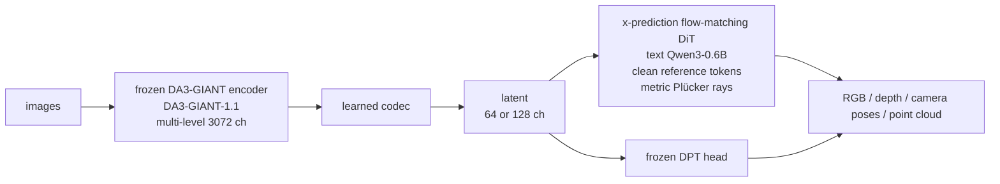
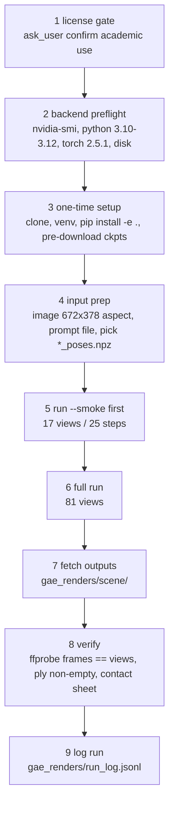

# GAE (Geometry-Native Autoencoder) × `gae-world-gen` skill — Research Dossier

Research dossier + skill plan. Plan only — no OpenSpec change, no implementation.
Pickup-ready. Sources fetched 2026-09-27.

> Status: **research / pre-planning**. Explore-mode output.
> Goal: decide whether TencentARC GAE (3D-consistent video/geometry generation)
> becomes a `video-production` skill, execution backend, and cost.
> Host is macOS arm64 / 48 GB unified → no local run expected (CUDA-only stack).

---

## 1. Sources

| Kind | Location |
|---|---|
| Paper | `https://arxiv.org/abs/2609.24981` — v1 2026-09-21, cs.CV |
| HF paper page | `https://huggingface.co/papers/2609.24981` |
| Model | `https://huggingface.co/TencentARC/GAE-D64-1B` |
| Code | `https://github.com/TencentARC/GAE-GeometricAutoEncoder` |
| Project page | `https://jiah-cloud.github.io/GAE.github.io/` |

- HF spaces search for TencentARC GAE = empty. No public Space. Only the model repo above.
- README, `LICENSE.txt`, `requirements.txt` read raw from GitHub.
- Authors: Jiahao Lu, Minghao Yin (equal), Wenbo Hu, Hengyu Liu, Wang Zhao, Sai-Kit Yeung, Ying Shan, Yuan Liu. HKUST, Tencent ARC Lab (IEG), HKU, UT Austin.
- **Name trap.** Official name = "Geometry-Native Autoencoder" (user said "Geometry Native Encoder"). Do NOT confuse with arXiv `2603.10365` "Geometric Autoencoder for Diffusion Models" — different GAE.

---

## 2. What the model is

Thesis: 3D inconsistency in video generation = representation problem. Generators
evolve appearance-only latents. GAE generates inside geometry-foundation-model
feature space instead, so the latent is jointly decodable → RGB, depth, camera
poses, point maps.



- Stage 1 codec: frozen DA3-GIANT encoder (`depth-anything/DA3-GIANT-1.1`) multi-level features (3072 ch) → learned codec → 64/128 ch latent. Frozen DPT head decodes.
- Stage 2 flow: x-prediction flow matching DiT, conditioned on text (Qwen3-0.6B), clean reference tokens, metric Plücker camera rays.
- DA3 is set-based → reference views encoded separately as clean tokens.

### Author-reported numbers

| Metric | Value |
|---|---|
| Latent channels | 3072 → 128 = **24× fewer** |
| Conditioning number κ | ~1e8 → ~1e2 |
| Mean generation FVD | **256.4** best among latents |
| FVD vs RAEv2 / SD-VAE / Wan2.1 VAE / raw DA3 | best |
| FVD at fixed generator | **−12.7% RealEstate10K**, **−23.1% DL3DV** |
| Camera-trajectory error | **halved** on RealEstate10K |

> Numbers from paper/README. Not independently reproduced.

- **GAE-64** = compact, better trajectory consistency.
- **GAE-128** = best reconstruction + cross-view correspondence.
- Only **GAE-64 weights released**. GAE-128 configs only (`configs/gae_128.yaml`, `configs/flow_gae128.yaml`).

---

## 3. Released artifact `TencentARC/GAE-D64-1B`

- ~1B temporal DiT. `hidden_size=[768, 2048]`, `depth=[28, 6]`, 64-ch latent, 672×378, V=81 views.
- Files:
  - `codec/` — safetensors + `config.json`
  - `gae_64.pt` — for `gae.load_codec`
  - `latent_stats_gae_64.pt`
  - `da3_stats_giant_5ds.tar`
  - `transformer/`
  - `flow_gae64.pt` — for `gae.load_flow`
- DA3-GIANT pulled separately on first use.
- Defaults: I2V 50 Euler steps, CFG 2, one reference view. T2I guidance `--guidance ig --ig-scale 2`.

---

## 4. Entry points (verbatim from README)

**Install.** Python 3.10–3.12 only (3.13 refused). `torch==2.5.1`. `pip install -e .`.
Pinned CUDA env `pip install -r requirements.txt` (includes `xformers`, `depth-anything-3>=0.1.0`; verified Python 3.10 + CUDA 12.x).
Gradio extra `pip install -e ".[space]"`, `python app.py`.
venv `lib64` `Operation not permitted` → set `GAE_VENV` / use `/tmp/gae-venv`.

**I2V.**
```bash
python scripts/demo/generate.py \
  --image  --prompt-file <txt> \
  --hf-repo TencentARC/GAE-D64-1B --output <dir> --total-views 81
```
→ MP4, trajectory viz, `*_pred_pointcloud.ply`, `*_poses.npz`, `*_geom.npz`.

**Smoke.**
```bash
bash scripts/demo/run_demo.sh --task i2v --smoke
```
17 views, 25 steps → `results/demo/i2v/<scene>/<scene>_progressive.mp4`. `--no-progressive-ply` skips.

**Progressive render.**
```bash
python scripts/demo/render_progressive_ply.py <..._pred_pointcloud.ply>
```

**T2I.**
```bash
python scripts/demo/generate_t2i.py \
  --hf-repo TencentARC/GAE-D64-1B --prompts-file <f> --output <dir>
```
Flags `--prompts "a;;b"`, `--num-images N`, `--no-pointcloud`. → PNG + `_depth.png` + `_pointcloud.ply`.

**Recon (codec only).**
```bash
python scripts/demo/reconstruct_vae.py \
  --video <mp4> --hf-repo TencentARC/GAE-D64-1B --cache-dir ckpts --output <dir>
```
→ `rgb_recon.mp4`, `depth_recon.mp4`, `recon_pointcloud.ply` (`--pc-stride`, default 4).

**Camera paths.** Shipped `examples/scenes/*_poses.npz`. Gradio offers default / forward / backward / turn-left / turn-right.

**Python API.**
```python
from gae import GAE
GAE.from_pretrained("TencentARC/GAE-D64-1B")
```
- `encode(images)` — images `[B,V,3,H,W]` in [0,1] → `[B,V,C,h,w]`
- `reconstruct(images)` → `{'rgb','depth'}`
- `sample()` — Euler + CFG on tensors
- `examples/generate_min.py`

**Training.** `scripts/train/run_train.sh --stage codec|flow|both --size 64|128 --gpus 8 [--cotrain-t2i]` — 8-GPU scale. Out of scope for skill.

---

## 5. Hard constraints — decisive for skill design

- **LICENSE.** Custom Tencent terms: "only for academic purposes, and refrain from using it for any non-academic, commercial or production purposes under any circumstances". Covers code AND weights.
  → Skill MUST surface license gate before first run. No use in BlackBelt client/commercial deliverables (e.g. customer showreels).
- **CUDA-only in practice.** `xformers`, CUDA 12.x pinned. Host = macOS arm64, 48 GB unified RAM → no local run expected. MPS untested/unsupported upstream (UNVERIFIED — treat as not supported).
- **VRAM + runtime NOT published.** Upstream advises a GPU-backed Space, start 17 views/25 steps, scale to 81. Measure in spike.
- **Frozen DPT head** → geometry must stay DA3-readable ("a real constraint, not a soft one").

---

## 6. Proposed skill: `gae-world-gen`

- **Home:** `packages/video-production/.pi/skills/gae-world-gen/SKILL.md` — beside `veo-generator`, `veo-showreel-production-kit`, `hyperframes-showreel`, `footage-redaction`.
- Register in `packages/video-production/package.json` `pi.skills`. Add row to `packages/video-production/AGENTS.md`.
- **Description draft:** "Generate 3D-consistent camera-controlled video, text-to-image, or codec reconstruction with TencentARC GAE (Geometry-Native Autoencoder) on a remote CUDA GPU — outputs RGB + depth + camera poses + point cloud (.ply). Academic/non-commercial only. Use on 'generate a 3D-consistent video from this image', 'image to point cloud world', 'run GAE', 'geometry-native generation'."

### Modes

| Mode | Input | Output |
|---|---|---|
| `i2v` | image + prompt + camera path | 81-view mp4 + ply |
| `t2i` | prompt | png + depth + ply |
| `recon` | video | RGB/depth recon + ply |
| `smoke` | — | 17 views / 25 steps |

### Execution backend — open choice

| Option | Shape |
|---|---|
| A | SSH to user-owned CUDA box. rsync inputs, run upstream scripts, pull `results/`. |
| B | User's own private GPU HF Space built from repo `app.py`, driven via `gradio_client`. |
| C | Serverless GPU (Modal / RunPod). |

Recommend **A first** (zero new deps, mirrors upstream CLI verbatim), **B second**.

### Thin wrapper only

Skill orchestrates upstream CLI verbatim. Never reimplements sampler.
Optional small `scripts/gae_remote.sh` (setup/run/fetch). No TS CLI until usage proven.

### Procedure outline



1. License gate (`ask_user` confirm academic use)
2. Backend preflight (`nvidia-smi`, python 3.10–3.12, `torch==2.5.1`, disk for DA3-GIANT + ~1B weights)
3. One-time setup (clone, venv, `pip install -e .`, pre-download `TencentARC/GAE-D64-1B` into `ckpts/`)
4. Input prep (image 672×378-friendly aspect, prompt file, pick `*_poses.npz` or named trajectory)
5. Run `--smoke` first, then full 81 views
6. Fetch outputs to `<Project>/gae_renders/<scene>/`
7. Verify (ffprobe frame count = views, ply non-empty, contact sheet of rgb+depth)
8. Log run to `gae_renders/run_log.jsonl` (cmd, commit sha, steps, views, seconds, peak VRAM)

### Pitfalls

- Python 3.13 refused.
- `lib64` venv permission → `GAE_VENV`.
- First run downloads DA3-GIANT (slow).
- Uploaded images default to `forest_lake_trail_poses.npz` path + its metric scale — wrong scale for unrelated scenes.
- GAE-128 weights not released.
- Don't confuse with arXiv `2603.10365`.
- License forbids commercial use.

### Integration with existing kit

GAE ≠ Veo replacement. Use case = 3D-consistent camera moves + exportable geometry (`.ply` → deck3d / site-3D background; nano-banana world anchor → GAE i2v world fly-through). Veo stays for commercial showreels.

---

## 7. Verification plan (for when implemented)

- **Content test** `packages/video-production/src/__tests__/skill-gae-world-gen.test.ts`: license gate present, modes listed, smoke-before-full rule, verify step, pitfalls (Python 3.13, GAE-128 unreleased, name trap).
- **Manual spike**: one smoke run on real GPU → record VRAM + wall time into this doc.

---

## 8. Open questions / spikes

1. Execution backend: SSH GPU box vs private HF Space vs serverless — which does user have?
2. Measured VRAM + wall time for smoke (17/25) and full (81/50) — GPU class needed (24 GB? 48 GB? 80 GB?).
3. License fit: is intended use academic/research only? If not → stop, no skill.
4. MPS / Apple Silicon feasibility — UNVERIFIED; `xformers` blocks as pinned.
5. Home package: `video-production` vs new `packages/world-gen`.
6. OpenSpec change needed on go: new skill in shipped package → `openspec change new add-gae-world-gen-skill`. Discipline Skills: none expected beyond `review-code`; remote exec over SSH → consider `security-hardening`.
