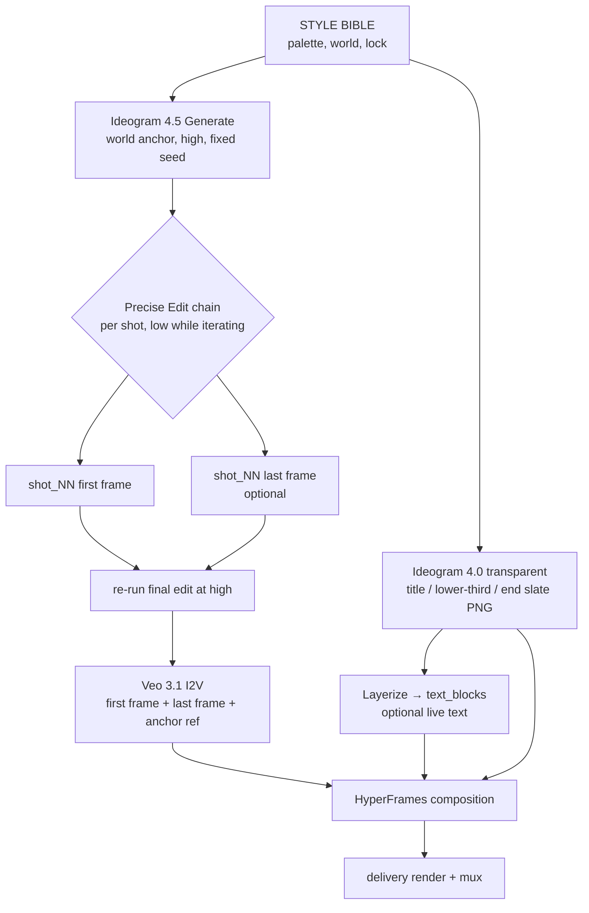

# Ideogram 4.5 × `video-production` — Research Dossier

Research dossier + integration plan. Plan only — no OpenSpec change, no implementation.
Pickup-ready. Sources fetched 2026-10-04.

> Status: **research / pre-planning**.
> Goal: decide whether Ideogram 4.5 (precise multi-turn image edit + text-to-image model)
> joins `packages/video-production` as a keyframe / design-plate backend, and at what cost.
> Hosted API only today — open weights promised, undated. Host macOS arm64 = fine (HTTP client only).
> Facts verified 2026-10-04 unless marked *unverified* or *inference*.

---

## 1. Sources

| Kind | Location |
|---|---|
| Model page | `https://ideogram.ai/models/4.5/` |
| API overview (v2) | `https://developer.ideogram.ai/ideogram-api/api-overview` |
| API ref — Generate 4.5 | `https://developer.ideogram.ai/api-reference/images/generate/ideogram-4-5` |
| API ref — Precise Edit 4.5 | `https://developer.ideogram.ai/api-reference/images/precise-edit/ideogram-4-5` |
| API setup / billing | `https://developer.ideogram.ai/ideogram-api/api-setup` |
| API index (agent-readable) | `https://developer.ideogram.ai/v2/llms.txt`; any page + `.md` = clean markdown |
| Docs MCP server | `https://developer.ideogram.ai/_mcp/server` (docs lookup, not generation) |
| Launch post | `https://x.com/ideogram_ai/status/2105327223431737780` (2026-09-30) |
| Lineage — Ideogram 4.0 tech blog | `https://ideogram.ai/blog/ideogram-4.0/` |
| Lineage — Ideogram 4 open code | `https://github.com/ideogram-oss/ideogram4` (released 2026-06-03) |
| Independent pixel/price check | `https://www.creativeainews.com/articles/ideogram-4-5-precise-edit-multi-turn-2026/` |
| Launch analysis | `https://runtimewire.com/article/ideogram-45-multi-turn-image-editing` |
| Partner docs — Runware | `https://runware.ai/docs/models/ideogram-4-5` (`ideogram:4.5@0`) |
| Partner — Replicate | `https://replicate.com/ideogram-ai/ideogram-4-5` |
| Partner — fal edit | `https://fal.ai/models/ideogram/v4.5/edit` (page not machine-readable; prices via creativeainews) |
| Veo 3.1 capabilities | `https://ai.google.dev/gemini-api/docs/veo` — first+last frame, ≤3 reference images |

Notes:
- `https://ideogram.ai/api-pricing` loads prices client-side → not machine-readable. Direct-API price = `dry_run=true` quote.
- `https://developer.ideogram.ai/v2/openapi.json` returns HTML shell to curl → OpenAPI not fetchable headless (2026-10-04).

---

## 2. What it is

- Vendor: Ideogram (founders ex-Google Brain Imagen: Norouzi CEO, Chan, Ho, Saharia).
- Released 2026-09-30. App + API + partners same day.
- Positioning: "most precise edit model". Multi-turn editing without drift (pixel shift, colour change, texture artifacts).
- Two modes: text-to-image generate (1K/2K) + edit (precise edit, masked edit, reference-guided edit).
- Native 2K output. Edit at any resolution via crop → edit → stitch (vendor demo on 4016×6016 / 24.2 MP source).
- Architecture: **undisclosed** for 4.5. No paper, no model card.
- Lineage (4.0, documented): 9.3B single-stream DiT; text encoder Qwen3-VL-8B-Instruct (13 hidden layers concat); Flux VAE (8× spatial, 128 latent ch); Euler flow-matching, asymmetric CFG; trained only on structured JSON captions (per-element style, optional bbox + colour palette); 256–2048 px/side.
- *Inference:* 4.5 shares 4.0 family — 4.5 Generate accepts "a structured Ideogram 4.0 JSON prompt".

### Vendor-claimed use cases

Recolor product, alter lighting, staged photo restore, translate stylized lettering keeping design, swap furniture keeping architecture, campaign colourways, pose change via skeleton reference.

---

## 3. API surface (direct, v2)

Pattern: `POST https://api.ideogram.ai/v2/{content}/{action}/{model}`. Auth header `Api-Key`.

### 3.1 Endpoints

| Endpoint | Body | Purpose |
|---|---|---|
| `POST /v2/image/generate/ideogram-4-5` | JSON, or multipart with `images` | T2I; or edit up to 5 source images (first = edited, rest = refs); may resize/recompose |
| `POST /v2/image/precise-edit/ideogram-4-5` | multipart | Edit one `image`; output = input W×H; untouched pixels copied exactly |
| `GET /v2/generations/{generation_id}` | — | Poll async result (`status` pending/completed/failed) |

### 3.2 Generate parameters

| Param | Values | Note |
|---|---|---|
| `prompt` | 1–10000 chars | natural language or structured 4.0 JSON |
| `magic_prompt` | `auto` (default) / `on` / `off` | auto+on rewrite prompt; `off` keeps wording |
| `images` | ≤5 files, ≤25 MB, JPEG/PNG/WEBP | multipart only |
| `mask` | file, same W×H as first image | **black = edit, white = keep**; must contain both |
| `size` | `auto` (default) / `source` / `WxH` | T2I exact size must be a 1K/2K preset; `source` rejected without images |
| `quality` | `very_low` / `low` / `medium` / `high` | default `high` (T2I), `medium` (with images); `very_low` needs source images |
| `seed` | 0–2147483647 | reproducibility |
| `num_images` | 1–8 | — |
| `enable_copyright_detection` | bool | adds latency; flagged → `is_image_safe:false` |
| `async` / `webhook_url` | bool / HTTPS URL | returns `generation_id` |
| `?dry_run=true` | query | validate + price only; `PriceQuote`; nothing billed/stored |

Size rules: both sides multiple of 32, ≥256 px, total ≤ 2048×2048 px, aspect ≤ 6:1. Billing tier by resolved output: ≤1024×1024 = 1K, above = 2K; `auto` bills 2K.

### 3.3 Precise Edit parameters

| Param | Values | Note |
|---|---|---|
| `prompt` | 1–10000 chars | NL auto-converted to structured edit prompt |
| `image` | 1 file ≤25 MB | output = this W×H; too-large scaled down keeping proportions; aspect outside 1:6–6:1 rejected |
| `reference_images` | ≤4 files | never edited; `mask` consumes one slot → ≤3 with mask |
| `mask` | same W×H as `image` | black = edit, white = keep |
| `quality` | `very_low`…`high` | default `medium` |
| `seed`, `num_images` (1–8), `enable_copyright_detection`, `async`, `webhook_url`, `?dry_run` | — | as Generate |

### 3.4 Response / async / errors

- Sync response: `data[]` of `{url, prompt, resolution, seed, is_image_safe}`; plus `seed`.
- Result URLs **expire** → download immediately.
- Webhook: JSON POST, Ed25519-signed, keys at `https://api.ideogram.ai/v1/.well-known/jwks.json`. HTTPS only; private/loopback hosts rejected → unusable from a local CLI without a tunnel.
- Errors: 400, 401, 402 (`reject_reason`: `insufficient_funds` / `subscription_required` / `daily_limit` / `priority_credit_required` / `inflight_limit` / `feature_limit`), 403, 404, 422 (safety), 429, 500, 503.
- Rate limit: 10 in-flight requests default; more via `partnership@ideogram.ai`.

### 3.5 Account / billing

- Prepaid credits via Stripe. One-off top-up $1–$300; balance cap $300. Auto-recharge optional (threshold $5–$900, top-up $10–$1000).
- Keys: full account access each; shown once; revocable. No credits → `402`.
- Subscription monthly credits used first when they cover a whole request.
- Teams: shared keys/credits/billing.

### 3.6 Adjacent v2 endpoints relevant to video

| Endpoint | Use for us |
|---|---|
| `POST /v2/image/generate/ideogram-4-transparent` | PNG with alpha (4.0); `output_resolution` 1k/2k/4k/8k (>2k = upscale); `aspect_ratio` incl. `16x9`, `9x16` → title/lower-third/end-slate overlays |
| `POST /v2/design/layerize/ideogram-3` | flat image → `text_blocks[]` (x, y, w, h, text, alignment, formatting, font match) + text-free `base_image_url`; optional `font_candidate_files` (≤5) → editable/animatable text layers |
| `/v2/image/upscale/*` | Topaz Standard V2 / Bloom 2 / Redefine / Text Refine / Wonder 3.5, Nano Banana Pro, auto → lift 2K stills to 4K |
| `/v2/image/remove-background/ideogram-1`, `/v2/image/replace-background/*`, `/v2/image/remove-object/ideogram-1`, `/v2/image/reframe/*` | plate prep, outpaint to new aspect |
| `/v2/image/describe/ideogram-4` | image → prompt (caption existing frames) |
| `/v2/video/generate/*` | Seedance 2.0/2.5 (T2V, I2V with `image` + optional `end_image`, ref-to-video), MiniMax H3, Kling v3 Standard; always async; `generate_audio` ~2× cost |
| `/v2/tools/*` | Ad Localizer, Ad Resizer, Ad Variations, Colorways, Material Swap, Model Pose Variants, Sketch to Render, Ghost Mannequin |

---

## 4. Access routes & pricing

| Route | ID / surface | Price per image | Note |
|---|---|---|---|
| Ideogram direct | `/v2/.../ideogram-4-5` | not published machine-readably; `dry_run` quote | billed 1K vs 2K tier |
| fal | `ideogram/v4.5/edit` (+ T2I) | very_low $0.008 · low $0.03 · medium $0.06 · high $0.22 | size-independent; lists `very_high` tier unpriced |
| Runware | `ideogram:4.5@0` | very_low $0.008 · low $0.03 · medium $0.06 · high $0.20 | ~26 s/request measured by Runware; **mask white = edit** (inverted vs direct) |
| ComfyUI Partner Nodes | v0.38.1 (PR #16689): T2I, Edit, Precise Edit | $0.01144 · $0.0429 · $0.0858 · $0.286 | Comfy credits; cloud-run; default `medium` |
| Replicate | `ideogram-ai/ideogram-4-5` | unverified | — |
| App partners | Picsart, Krea, Runway, Pika, Gamma, Luma | — | interactive only |

Price sources: fal + ComfyUI via creativeainews (read 2026-10-01); Runware docs (2026-10-04). Launch post states $0.008–$0.22 range.

Open weights: launch post "open weights soon" — no date, no licence, no hardware spec. Precedent: Ideogram 4 weights (nf4 fits 24 GB GPU; fp8) under **Ideogram 4 Non-Commercial** licence, HF-gated. → assume 4.5 weights (if any) non-commercial until proven otherwise.

---

## 5. Evidence & quality

| Claim | Source | Status |
|---|---|---|
| Rivals (GPT Image 2.5 Sunburst, Nano Banana Pro, Nano Banana 2) unusable within few edits; 4.5 clean over 14 edits | Ideogram | self-reported; no protocol, evaluator, failure rate |
| Untouched pixels copied exactly | Ideogram API docs | creativeainews on vendor's own WebP sample: 72.3% byte-identical, 93.7% within 2 levels, 99.5% within 8, mean diff 0.67/255 (residual = WebP compression + shadow change) |
| Single-edit quality | AlphaSignal (secondhand) | Image Edit Arena 1351, 18th overall |
| Text rendering | 4.0 blog | 4.0 X-Omni EN OCR 0.97 — **not** a 4.5 score |
| Text rendering 4.5 | quantslant small test | 3 of 12 lettering images had text errors; uncontrolled |
| Independent long edit chain vs rivals | — | **none published** |

Takeaway: differentiator = 10th edit, not 1st. Must validate on our own frames before adoption.

---

## 6. Our pipeline today (`packages/video-production`)

- `veo-showreel-production-kit` skill: STYLE BIBLE (world anchor, STYLE LOCK, palette, negative, seed, `enhance_prompt=false`) → `shots/*.md` 7-layer prompts → storyboard sketches.
- `src/storyboard.ts` `generateStoryboard()`: reads `storyboard/sketch_prompts.json` (`{ "shot_01": "<prompt>", "00_world_anchor": "…" }`) → `batchGenerate` from `@blackbelt-technology/pi-dashboard-nano-banana` (Gemini key) → `storyboard/<key>.png`.
- `src/render.ts`: Veo 3.1 I2V from per-shot first-frame image; `--with-reference` attaches ≤3 `referenceImages` (`referenceType: "asset"`), retries without refs on error; `--chain` = ffmpeg last-frame handoff (`extractLastFrame`).
- Gap: Veo 3.1 supports **first + last frame** interpolation (Google docs) — `render.ts` does not wire `lastFrame` today.
- `hyperframes-showreel` skill: real footage → HyperFrames composition; Veo only as screen-blend FX.
- Known failure class (`veo-prompt-injection-cleanup` skill): brand names, hex codes, UI verbs, chart nouns in Veo prompts → painted text/logos on frames.

---

## 7. Integration points

Ranked by fit.

| # | Integration | Value | Fit |
|---|---|---|---|
| A | **Anchor-locked keyframe family** — generate world anchor once (High), derive each shot's first frame via Precise Edit chain (prop/lighting/time-of-day/camera-subject change) | identical world across shots → stronger Veo consistency than independent T2I sketches | **best** — plays to drift-free multi-turn edit |
| B | **Start/end keyframe pairs** — Precise Edit frame A → frame B (state change) → Veo 3.1 first+last-frame, or Seedance 2.5 `image`+`end_image` | controlled transitions/reveals; product colourway morphs | high; needs `lastFrame` wiring in `render.ts` |
| C | **Typography & design plates** — title cards, lower thirds, end slates, chapter cards; transparent PNG (4.0-transparent) composited in HyperFrames | moves all on-screen text OUT of Veo prompts → kills prompt-injection text class; crisp legible type | high |
| D | **Localization of plates** — Precise Edit "translate lettering, keep design"; Layerize → `text_blocks` → re-typeset as live HyperFrames text | multilingual versions without re-render | medium-high |
| E | **Storyboard backend alternative** — swap nano-banana → Ideogram 4.5 T2I for sketches | 2K presets incl. 16:9/9:16; structured JSON prompt (bbox, palette) | medium; A/B vs nano-banana first |
| F | **Frame repair before chaining** — fix garbled logo/artifact on extracted last frame before it seeds next shot | prevents artifact propagation through `--chain` | medium |
| G | **Delivery stills** — thumbnail, poster, key art, social cut-downs (Reframe / Ad Resizer) | packaging around the film | medium |
| H | Ideogram-hosted video (Seedance/Kling/MiniMax) as 2nd video backend | vendor diversity | **out of scope** — separate dossier |

Not a fit:
- Per-frame video editing / rotoscoping — single-image model, no temporal consistency → flicker.
- Native 4K stills — 4.5 max ≈ 2048² px total (16:9 preset 2560×1440); 4K needs upscale endpoint.
- Real screen recordings (hyperframes path) — redaction stays ffmpeg-deterministic (`footage-redaction`); never route sensitive footage through a third-party model.

### 7.1 Resolution / aspect mapping

| Delivery | Ideogram 4.5 preset | Then |
|---|---|---|
| 16:9 720p | 1280×720 (1K tier) | as-is |
| 16:9 1080p | 2560×1440 (2K) | downscale 1920×1080 |
| 16:9 4K | 2560×1440 | upscale (Topaz) → 3840×2160 |
| 9:16 vertical | 1440×2560 / 720×1280 | as above |
| Precise Edit | input size | keep source at Veo-native size; ≤~4 MP avoids silent downscale |

### 7.2 Proposed flow (A + B + C)

Prompt-hygiene split: hex codes + brand names + exact copy are SAFE (desired) in Ideogram prompts; MUST be stripped from any text later reused as a Veo prompt.

---

## 8. Proposed implementation (plan only)

Minimal, no new SDK dependency (Node `fetch` + `FormData` + `Blob`).

| Piece | Location (proposal) | Contract |
|---|---|---|
| Client | `packages/video-production/src/ideogram.ts` | `generate()`, `preciseEdit()`, `quote()` (`dry_run`), `poll()`; injectable `fetch` like Veo `clientFactory`; always downloads result → local PNG; never returns expiring URL as artifact |
| Key resolution | `src/env.ts` | `IDEOGRAM_API_KEY` via `--api-key` → env → project `.env` (+2 parents) → package `.env`; same order as `resolveVeoKey` |
| Storyboard backend | `src/storyboard.ts` | `backend: "nano-banana" \| "ideogram"`; default unchanged (`nano-banana`) |
| Prompt file | `storyboard/sketch_prompts.json` | value = string (back-compat) OR `{ prompt, edit_from?, mask?, refs?, quality?, seed?, size?, transparent? }`; `edit_from` = key of another sketch → Precise Edit; topological order |
| Run log | `storyboard/_ideogram_log.jsonl` | per job: key, endpoint, quality, seed, `generation_id`, quote, resolution, `is_image_safe`, timestamp |
| CLI | `src/bin/veo.ts` | `pi-veo storyboard 
 --backend ideogram [--quality low] [--quote]`; `pi-veo plates 
` (transparent overlays from `storyboard/plate_prompts.json`) |
| Veo last frame | `src/render.ts` | optional `last-frame` path per shot → `config.lastFrame` (gap from §6) |
| Skill | `veo-showreel-production-kit` step 5 + new `ideogram-keyframes` skill | anchor → edit-chain procedure, mask convention, cost gate |

Concurrency: cap at ≤8 to stay under 10 in-flight default (leave headroom for parallel sessions). Sync mode (no webhook) — local CLI cannot receive Ed25519 webhooks without public HTTPS.

Rollback: backend flag only; nano-banana path untouched; no migration.

---

## 9. Cost model (fal list prices, illustrative)

20-shot package, anchor-locked flow:

| Step | Count | Tier | Unit | Total |
|---|---:|---|---:|---:|
| World anchor (4 candidates) | 4 | high | $0.22 | $0.88 |
| Per-shot edit iterations | 60 (3/shot) | low | $0.03 | $1.80 |
| Per-shot final re-run | 20 | high | $0.22 | $4.40 |
| Optional last frames | 10 | high | $0.22 | $2.20 |
| Title/lower-third plates | 6 | (4.0 transparent, quote) | — | quote |
| **Image total** | | | | **≈ $9.30** |

Very_low iteration ($0.008) cuts iteration to $0.48. Image spend is minor next to Veo clip spend — the value is fewer Veo re-renders from inconsistent first frames. Direct-API prices: get via `dry_run` before every batch (`--quote`).

---

## 10. Security, licence, compliance

- API key: `.env` / env only; never committed; `.env.example` gets `IDEOGRAM_API_KEY=` placeholder. Every key = full account access → separate key per project/team, revoke on leak.
- Prepaid balance cap $300 = natural spend ceiling; still gate batches with `dry_run` quote.
- Uploaded images leave the machine → never upload unredacted real footage/frames with PII/customer screens; run `footage-redaction` first or don't send.
- Output ownership: Ideogram "does not claim ownership… free to use… including commercial" (pricing FAQ, app context); API governed by Developer API Agreement → legal check *unverified* for API outputs.
- `enable_copyright_detection` (Hive likeness + logo) → use on delivery-bound frames; treat `is_image_safe:false` as hard fail.
- Open weights (future) likely non-commercial (Ideogram 4 precedent) → local inference = internal/previz only.
- Safety rejects → `422`; log and surface, don't retry blindly.

---

## 11. Pitfalls

- **Mask polarity differs by route**: direct API black = edit, white = keep; Runware white = edit. Normalize in client; assert both colours present.
- Mask eats a reference slot (Precise Edit ≤3 refs with mask).
- `very_low` requires source image(s) → invalid for T2I.
- `size: auto` bills 2K even if you wanted 1K.
- Source > ~4 MP scaled down silently → for print-size, crop-edit-stitch; for video, keep frames at delivery size.
- Aspect outside 1:6–6:1 rejected.
- Result URLs expire → download in same call path.
- `magic_prompt: auto` rewrites prompt → set `off` (or send structured JSON) for reproducible anchors.
- Default quality differs: T2I `high`, edit `medium`, ComfyUI nodes `medium`.
- Seed reproducibility across days/model updates *unverified* → pin seed AND keep the PNG; PNG is source of truth.
- No temporal model → never run per-frame over video.
- Hex codes/brand names in shared prompts leak into Veo → keep Ideogram and Veo prompt strings separate.
- 10 in-flight limit is account-wide → parallel pi sessions share it; handle `429`/`402 inflight_limit` with backoff.
- OpenAPI JSON not fetchable headless → hand-type request shapes from `.md` pages; re-verify on API change.

---

## 12. Validation spike (before any OpenSpec change)

1. **Quote**: `dry_run` Generate 2560×1440 high + Precise Edit 1280×720 low/high → record direct prices.
2. **Drift test (our frames)**: anchor → 10 chained Precise Edits at `low`; per turn diff vs previous outside the edit region (Pillow/NumPy or ffmpeg `blend=difference`); pass = ≥95% pixels within 8 levels outside edit area after turn 10.
3. **Veo consistency A/B**: same 6-shot package — (a) nano-banana independent sketches vs (b) Ideogram anchor + edit chain → render Veo fast/720p → contact sheet; rate world consistency blind.
4. **Plate legibility**: 6 title/lower-third plates (EN + HU) → OCR exact-match rate; alpha edge check over dark + light footage.
5. **Last-frame transition**: one A→B pair via Veo `lastFrame` (after wiring) vs Seedance 2.5 `end_image`.
6. Decide: adopt A/C (+B if 5 passes); keep nano-banana default unless 3 shows clear win.

---

## 13. Open questions

- Direct-API per-image price at 1K/2K per tier (needs `dry_run` with a key).
- 4.5 architecture, parameter count, open-weight date + licence.
- Does 4.5 Generate accept bbox/palette fields of the 4.0 JSON schema (layout control for keyframes)?
- Seed determinism over time.
- Replicate pricing/params.
- Does Veo 3.1 accept `lastFrame` together with `referenceImages` in one request (forum reports confusion)?
- Language coverage of text rendering (Hungarian diacritics) — test in spike step 4.
- API output ownership under Developer API Agreement — legal read.

---

## 14. Recommendation

- **Adopt as optional backend**, not replacement. Strongest fit: anchor-locked keyframe family (A) + typography/design plates (C).
- Run §12 spike first (≈ $5–15 spend).
- If spike passes → OpenSpec change `add-ideogram-keyframes` (client + storyboard backend + plates + `lastFrame` wiring + skill). Discipline skills: `security-hardening` (third-party upload, API key), `observability-instrumentation` (run log, quote), `review-code`.
- Out of scope now: Ideogram-hosted video models (H), local open weights (none for 4.5).
