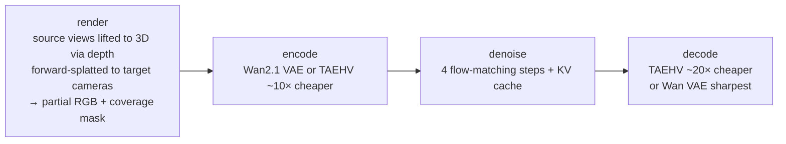
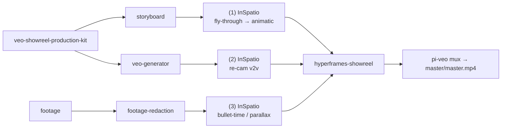
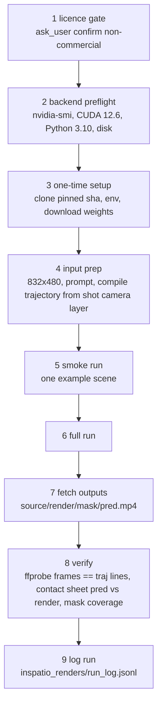

# InSpatio-World 1.5 × `video-production` — Research Dossier

Research dossier + skill plan. Plan only — no OpenSpec change, no implementation.
Pickup-ready. Sources fetched 2026-10-04.

> Status: **research / pre-planning**. Explore-mode output.
> Goal: decide whether InSpatio-World 1.5 (real-time camera-controllable 4D world
> model) becomes a `video-production` previz / re-cam / bullet-time skill, and at
> what cost.
> Host is macOS arm64 — no local run expected (CUDA-only stack). Remote CUDA GPU
> required.
> Facts verified 2026-10-04 unless marked unverified.

---

## 1. Sources

| Kind | Location |
|---|---|
| Paper | `https://arxiv.org/abs/2604.07209` — "INSPATIO-WORLD: A Real-Time 4D World Simulator via Spatiotemporal Autoregressive Modeling", InSpatio Team, 2026 |
| Benchmark badge | Papers-with-code: SOTA on WorldScore |
| Code v1.5 | `https://github.com/inspatio/inspatio-world-v1.5` — 45★, Apache-2.0, created 2026-09-26, pushed 2026-09-28 |
| Project page | `https://inspatio.github.io/inspatio-world-1.5/` |
| Live demo | `https://world.inspatio.com/` — no documented API |
| Code v1.0 | `https://github.com/inspatio/inspatio-world` — 1024★, 90 forks, Apache-2.0, created 2026-03-16, 5 open issues |
| Weights | `https://huggingface.co/inspatio/world-1.5` — single file `InSpatio-World-1.5-1.3B.safetensors`, no model card, no license tag, uploaded 2026-09-24 |

Sibling / third-party:

| Kind | Location | Note |
|---|---|---|
| Sibling (out of scope) | `https://huggingface.co/inspatio/querysplat` | image-to-3d, Apache-2.0, arXiv 2608.01186 |
| Reimpl code | `https://github.com/julien-blanchon/inspatio-world-v1.5` | 0★, created 2026-09-28, Apache-2.0, pip package `inspatio-world`, uv, typed |
| Reimpl weights | `https://huggingface.co/blanchon/inspatio-world-v1.5` | `dit/ vae/ text_encoder/ tokenizer/ taehv/ depth/ captioner/ examples/`, `from_pretrained` per folder |
| Reimpl Space | `https://huggingface.co/spaces/blanchon/inspatio-world-v1.5` | gradio, zero-a10g, RUNNING; `app.py` interactive streaming UI keyed per browser session, `@spaces.GPU run_session/estimate_scene/compile_world` → poor fit as programmatic API |

---

## 2. What it is

Real-time camera-controllable 4D world model. Backbone Wan2.1-T2V-1.3B. Causal
DiT 1.42B params, Self-Forcing-style training.

Autoregressive blocks: 3 latents = 12 frames at 832×480 (first block 9 frames).
Per block:



Components:

| Component | Size | Note |
|---|---|---|
| DiT | 1.42B, bf16 | causal, autoregressive |
| Wan2.1 VAE | 127M | — |
| umT5-XXL text encoder | 5.7B, bf16 | — |
| TAEHV | 11.3M | MIT, ~20× cheaper decode |
| Depth-Anything-3 `DA3NESTED-GIANT-LARGE` | 1.7B | depth + intrinsics + per-frame poses |
| Florence-2 captioner | — | v1.0 / blanchon only |

Speed (blanchon, one GH200, per 12-frame block steady state):

| Config | Seconds | FPS |
|---|---:|---:|
| eager bf16 Wan decoder | ~1.1 s | — |
| compiled bf16 TAEHV | ~0.62 s | — |
| compiled fp8 TAEHV | ~0.57 s | 21 fps (faster than real time) |

v1.0 README: `--use_tae` + `--compile_dit` reaches **24 fps** on H-series.
Numbers author-reported, not independently reproduced.

---

## 3. Inputs / outputs (official v1.5)

**Inputs.** 1 image, 4 images, or video; prompt; target trajectory.

**Video run:**

```bash
bash run_inference.sh --video in.mp4 --prompt "..." --target_traj target_tcw.txt
```

Reads fps + frame count, resizes to 832×480, DA3 estimates depth + per-frame
source cameras. `--depth_mode auto|existing|estimate`.

**Trajectory.** One OpenCV world-to-camera 4×4 per frame, 16 row-major numbers
per line. Must use first-frame-normalized coords + displacement scale of
DA3-estimated source cameras.

**Image scenes.** Reuse uint16 depth PNGs. `examples/manifest.json`;
`bash run_example.sh` runs six scenes.

**Output.** `output/<output_id>/{source,render,mask,pred}.mp4`. 15 fps for image
scenes, source fps for video.

**Setup.** Python 3.10, CUDA 12.6, conda env `inspatio_world_test`,
`pip install --no-deps depth-anything-3==0.1.1`,
`bash pipeline/download.sh` → `checkpoints/{InSpatio-World-1.3B,Wan2.1-T2V-1.3B,depth}`.
FA3 recommended on Hopper.

**v1.0 extras (not in v1.5 README):**

| Flag / file | Effect |
|---|---|
| 3-line traj file | pitch deg / yaw deg / displacement, keyframes interpolated |
| `traj/x_y_circle_cycle.txt`, `traj/zoom_out_in.txt` | presets |
| `--freeze_repeat N`, `--freeze_frame idx` | time-stop / bullet time |
| `--rotation_only` | tripod pan/tilt |
| `--relative_to_source` | — |
| `--render_backend warper\|ply` | — |
| `--use_tae`, `--compile_dit` | speed |

**Blanchon CLI:**

```bash
inspatio-world prepare --source.paths photo.jpg --output scenes/photo
inspatio-world generate --source.paths scenes/photo \
  --moves forward:36 turn-right+forward:36 look-up:12 \
  --output photo.mp4 --world.dit-precision fp8 --world.compile
# or --trajectory cameras.txt
```

Python API:

```python
WorldModel.from_pretrained(WorldConfig(dit_precision="fp8"))
world.start(scene, seed=0)
CameraRig(scene).advance(CameraAction(forward=1.0, yaw=0.2), session.frames_needed)
session.step(cameras)  # → block.frames (12,480,832,3) uint8
```

Blanchon claims parity with upstream: tokenizer identical, DA3 bit-exact, VAE
mean abs 2e-4/6e-4, splat masks ≤7 px diff. Deviations: no lossy H.264
round-trip of render, exact DA3 quantiles, ftfy dropped.

---

## 4. Hardware & licence

- **Host is macOS arm64.** No `nvidia-smi` → **no local run**. Remote CUDA GPU
  required.
- **VRAM not published.** Estimate ≥24 GB (umT5-XXL alone ~11 GB bf16) —
  **unverified**, measure in spike.
- **Licence:**

| Component | Licence |
|---|---|
| InSpatio code | Apache-2.0 |
| Wan2.1 | Apache-2.0 |
| TAEHV | MIT |
| Florence-2 | MIT |
| InSpatio weights | no model card, no license tag — assumed Apache via repo (**unverified**) |
| `DA3NESTED-GIANT-LARGE` | **CC BY-NC 4.0 → non-commercial** |

  User decision 2026-10-04: **internal / non-commercial use only** → licence gate
  (`ask_user` confirm) before first run. Escape route for later: image scenes
  accept precomputed uint16 depth → swap depth estimator (**unverified**
  quality/compatibility).

- **Quality gap vs pipeline.** `veo-showreel-production-kit` targets 16:9 4K /
  24 fps; InSpatio = 832×480 @ 15 fps (images) → not final-picture grade without
  upscale + frame interpolation.

---

## 5. Our pipeline (`packages/video-production`)

`veo-showreel-production-kit` (`shots/*.md` 7-layer prompt incl. camera layer,
`film.json` / `shots/shot_NN.json` / `timeline.json` sidecars, nano-banana
storyboard sketches) → `veo-generator` (CLI `pi-veo`
parse/plan/render/storyboard/export/mux, Veo 3.1 clips ≤8s,
`renders/render_log.jsonl`) → `hyperframes-showreel` (real footage edit, Veo as
screen-blend FX layer) + `footage-redaction` → `pi-veo mux` →
`master/master.mp4`.

---

## 6. Integration points

User selected all of 1, 2, 3 + shared runner on 2026-10-04.

| # | Use case | Fit | Risk |
|---|---|---|---|
| 1 | **Previz / camera blocking** — storyboard sketch (nano-banana world anchor or per-cut first frame) → InSpatio fly-through along shot's camera move → animatic before paying for Veo | Best fit; 480p acceptable | low |
| 2 | **Re-cam a Veo clip** — v2v new orbit/dolly/pan or time-stop on rendered Veo clip without re-billing Veo | 480p output | DA3 pose estimation on synthetic Veo footage unproven → spike |
| 3 | **Real footage** — bullet-time / parallax on camera/site footage for `hyperframes-showreel` | — | not for screen recordings (flat UI, depth meaningless); must pass `footage-redaction` first |
| 4 | Motion plates / backgrounds | **Rejected** — Veo FX-layer mode already covers | — |



**Core new piece: camera vocabulary → trajectory compiler.** Pure TS, testable
without GPU.

- Input: camera layer of `shots/*.md` ("slow dolly in", "orbit left", "crane
  up", "static", "pan right") + shot duration × fps.
- Output, one of:
  - blanchon `--moves` tokens
  - official v1.5 `target_tcw.txt` (4×4 w2c per frame, first-frame-normalized,
    scale relative to DA3 foreground depth)
  - v1.0 3-line pitch/yaw/displacement file
- Proposed home `packages/video-production/src/camera-path.ts` (**proposal
  only**).

**Shared remote-GPU runner.** Reuse with GAE dossier
`docs/research/gae-geometry-native-autoencoder-skill.md`, which proposed same
backends A SSH CUDA box / B private HF Space + `gradio_client` / C serverless
Modal/RunPod and also depends on DA3-GIANT. Build runner once.

Contract: stage inputs → run pinned upstream command → fetch outputs → log jsonl
(`cmd`, commit sha, gpu, seconds, peak VRAM).

User has no GPU backend yet (2026-10-04) → spike first.

---

## 7. Proposed skill: `inspatio-world`

- **Home:** `packages/video-production/.pi/skills/inspatio-world/SKILL.md`.
- Register in `packages/video-production/package.json` `pi.skills`.
- **Modes:**

| Mode | Input | Output |
|---|---|---|
| `previz` | image → fly-through | animatic mp4 |
| `recam` | video → video | re-cammed mp4 |
| `freeze` | bullet-time | v1.0 flags or equivalent |
| `smoke` | one example scene | sanity render |

- **Thin wrapper only.** Never reimplement sampler. Pin upstream commit sha.
- Outputs to `<Project>/inspatio_renders/<shot>/` + `run_log.jsonl`.
- **Code path choice open:** official v1.5 (authoritative, bash, 4×4 traj) vs
  blanchon (pip, typed API, `--moves`, fp8/compile, 1-day-old single-maintainer).

---

## 8. Procedure outline



1. Licence gate (`ask_user` confirm non-commercial)
2. Backend preflight (`nvidia-smi`, CUDA 12.6, Python 3.10, disk)
3. One-time setup (clone pinned sha, env, download weights)
4. Input prep (832×480, prompt, compile trajectory from shot camera layer)
5. Smoke run (one example scene)
6. Full run
7. Fetch `{source,render,mask,pred}.mp4`
8. Verify (`ffprobe` frames == traj lines, contact sheet `pred` vs `render`, mask
   coverage)
9. Log run

**Spike plan** (user chose "spike first" for backend): rent 1 GPU (≥24 GB,
Hopper preferred) for ~1 h; run

- (a) `run_example.sh` smoke,
- (b) one storyboard sketch + dolly-in path,
- (c) one existing Veo clip + orbit path.

Measure VRAM, wall time per second of output, visual quality of (c). Decide
backend + code path from results.

---

## 9. Pitfalls

- Target traj must match DA3 normalized coord system/scale — wrong scale = wild
  camera.
- 832×480 forced resize — 16:9 crops/letterbox decisions.
- 15 fps image output vs 24 fps timeline.
- First-run `torch.compile` warm-up long.
- fp8 needs `torchao` (blanchon).
- DA3 non-commercial.
- Weights no model card.
- Public ZeroGPU Space not an API.
- v1.5 dropped v1.0 preset traj files + freeze flags from README — verify
  presence in code before relying.

---

## 10. Open questions

1. GPU backend — spike decides.
2. Measured VRAM / wall time.
3. Official vs blanchon code path.
4. DA3 replacement if commercial ever needed.
5. Upscaler / interpolation choice (unspecified, not researched).
6. Whether freeze/time-stop exists in v1.5 code.
7. Next OpenSpec change name proposal: `add-inspatio-world-skill` (+ possibly
   `add-remote-gpu-runner` shared with GAE).
