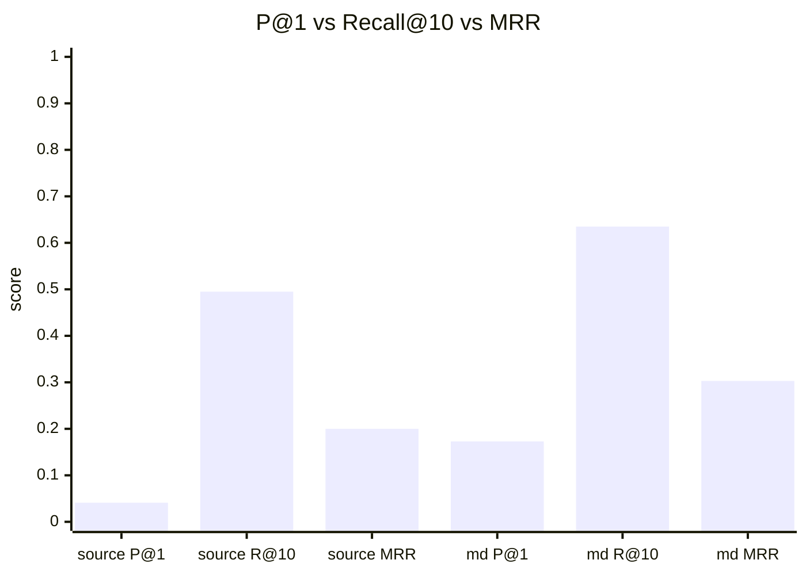
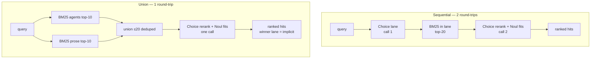
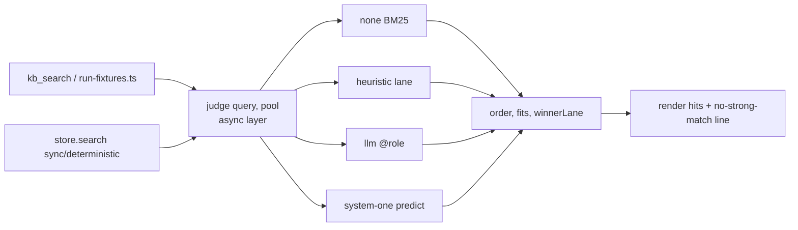

# kb_search Precision via System One (lane router, Choice rerank, Noul fits gate) — Research Dossier

> Status: **explore mode** — no change, no impl. Design investigation only.
> Date: 2026-09-27.
> Question: can a System One decision model (`Choice`/`Score`/`Noul`) raise `kb_search` precision while kb stays a deterministic tool?
> Sources: `docs/research/typesafe-system-one-decision-points.md`, `docs/research/clm-system-one.md`, `docs/research/kb-search-retrieval-quality-investigation.md`, `openspec/changes/unify-context-manager/design.md`, archived changes `2026-08-13-fix-kb-search-retrieval-quality`, `2026-08-28-fix-kb-eval-measurement-integrity`, `2026-08-28-add-kb-trust-verdicts-and-search-guard`, `2026-08-31-fix-kb-search-lane-composition`, `2026-09-27-add-system-one-registry`.

---

## 1. Current state (verified 2026-09-27)

- `packages/system-one` shipped (#740, commit `ab341e43a`; change archived `openspec/changes/archive/2026-09-27-add-system-one-registry`).
  - Exports `predict`, `resolveChain`, `fitsCapabilities`, `isOffMachine`, `loadConfig`.
  - Fallback chain, capability check, egress guard, decision log, shadow/enforce modes, per-consumer failure policy (`fail-open|fail-closed|deterministic`).
- `packages/system-one-plugin` shipped (settings UI, managed Von/Laya).
- kb has NO System One integration: nothing in `packages/kb`, `packages/kb-extension`, `packages/kb-plugin` imports `system-one`.
- Existing hook: `Reranker` type `packages/kb/src/types.ts:91` — `(query, candidates) => Promise<KbHit[]> | KbHit[]`; applied in `packages/kb/src/sqlite-store.ts` ~L505.
  - `search()` sync → Promise reranker silently ignored, BM25 order kept.
  - Async model call cannot use hook as-is.
- `kb_search` pins `rerank: false`, `expandGraph: false` (`packages/kb-extension/src/extension.ts:217`, via `searchOptsFromConfig` overrides in `packages/kb/src/search-opts.ts`).
- `consolidate-retrieval-planes` change: empty (0 tasks).
- Prior pointer: `docs/research/typesafe-system-one-decision-points.md` §6 Tier 2 — "kb_search rerank: BM25 top-20 → Choice rerank vs query; measure via `tsx packages/kb/eval/run-fixtures.ts` P@1/MRR".

---

## 2. Evidence — P@1 ≪ Recall@10

Last recorded (archived `2026-08-28-fix-kb-eval-measurement-integrity` tasks 6.1, not re-run):

| set | n | P@1 | Recall@10 | MRR |
|---|---|---|---|---|
| source-intent | 97 (+7 unreachable) | 0.041 | 0.495 | 0.200 |
| markdown-intent | 104 (+4 unreachable) | 0.173 | 0.635 | 0.303 |

- Right answer often in top-10, rarely rank 1 → rerank-shaped gap.
- Ceiling: rerank lifts P@1 at most to Recall@K of candidate pool (~0.5–0.65 at top-20).
- Lane pick measured: `doc_type:"agents"` on file lookups P@1 0.041→0.227; wrong on prose 0.150→0.067 (`2026-08-28-add-kb-trust-verdicts-and-search-guard`).
- Recall miss dominant elsewhere: `openspec/changes/unify-context-manager/design.md` — after kb_search agent opened a result 15% of calls, grep fallback 54%; 34 of 39 grep fallbacks opened file absent from kb hits. Rerank cannot fix recall.

---

## 3. Three levers

All three of interest to user.

| | lever | shape | state cost |
|---|---|---|---|
| A | Lane router | `Choice(query)` file/symbol vs conceptual → sets `doc_type` when agent omitted it | ≈20 tokens |
| B | Choice rerank | BM25 top-20 → one `Choice`; criteria = heading path + ~200-char snippet, or agents row; `probabilities` = new order | ≈2–4k tokens |
| C | Noul fits gate | `Noul` per top-k: "candidate answers query?"; max < 0.3 → annotate "no strong match — fall through to rg" | same call as B |

A is cheapest.

### Golden labels free for A

Label rule: `expect` ending `AGENTS.md` → agents lane.

| set | n | expect=AGENTS.md | other |
|---|---|---|---|
| `packages/kb/eval/golden.source-intent.json` | 104 | 104 | 0 |
| `packages/kb/eval/golden.markdown-intent.json` | 108 | 32 | 76 |

212 lane-labelled items. Proxy label, not ground truth.

### Challenge to A

Deterministic heuristic may suffice: CamelCase/snake_case tokens, path fragments, `.ts`, "where/which file/exports" → agents.
Spike must run 3 arms: none / heuristic / judge.
Heuristic ≥ ~90% of judge accuracy → keep A deterministic.

---

## 4. B absorbs A — union design

Sequential: query → `Choice` lane (call 1) → BM25 in lane top-20 → `Choice` rerank + `Noul` fits (call 2).
Union: query → BM25 agents lane top-10 + BM25 prose lane top-10 → union ≤20 deduped → one `Choice` + `Noul` fits per candidate.
Winner's lane = implicit lane decision.

| | sequential | union |
|---|---|---|
| latency | 2 round-trips | 1 |
| wrong-lane harm (prose 0.150→0.067) | possible | gone, both lanes searched |
| explicit `doc_type` from agent | router fills only when unset | honoured, skip union |
| backend down | heuristic lane + BM25 | existing `laneQuota` interleave, deterministic |
| Choice size | ≤20 | ≤20 (cap 255) |

**Lean: union.** Matches decision-points rule "second request only when code cannot build it without first answer".

---

## 5. Placement — keep engine pure

`packages/kb` `store.search()` stays sync/deterministic/eval-reproducible (Tier C hook untouched).
New async rerank layer `judge(query, pool) → { order, fits[], winnerLane }` with backends:

| backend | behaviour |
|---|---|
| `none` | BM25 |
| `heuristic` | lane only |
| `llm @role` | pi-ai, available now |
| `system-one` | `predict()`, shipped |

`kb-extension` `kb_search` renders; C adds no-strong-match line.
`run-fixtures.ts` calls same layer → eval measures what agent sees.

---

## 6. C rule — hint, never filter

Never drop hits; annotate only.
Hiding correct low-scored hit worse than noise ("confident wrong harms more than none").
Pairs with doctrine "fall-through (explicit)".
Eval needs negatives: golden sets positives-only; candidates = queries whose `openedFile` absent from top-20; `packages/kb/eval/mine-golden-sets.mjs` records refine/abandon split.

---

## 7. Risks

- **Determinism** — model in loop breaks eval/test/trust reproducibility unless off by default, fail-open to BM25 order, cached by `(query, pool hash, backend+model version)`, shadow first (log both orders, serve BM25) via registry shadow/enforce.
- **Latency** — kb_search ~120–140 ms; hosted Jev +70–500 ms; local CLM ~1.5 s cold (M3 Pro). OK for agent tool call, not hot path.
- **Off-machine** — hosted Jev receives queries + repo doc snippets → honour registry no-data-off-machine switch; `local-only` preset → Von/Laya/CLM (zero-shot local weak per decision-points §17).
- **Golden bias** — click-mined, positives only → tunes click-shaped queries. UCM design notes LLM reranker did not help supersession/staleness.
- **Async plumbing** — rerank outside store preferred over async `store.search` variant.

---

## 8. Open threads

1. Candidate text: agents row ideal; doc chunks need heading path + ~200-char snippet; is rendered snippet enough?
2. Cache: key `(query, pool hash, backend+model)`; agents repeat queries → high hit rate; cached answer deterministic.
3. Shadow in real sessions vs real clicks → also grows golden sets.
4. Recall ceiling: bigger win = recall, owned by `consolidate-retrieval-planes`; complementary.
5. Backend choice undecided (hosted Jev / local / `@fast` LLM role).

---

## 9. Next step (not started)

Eval-only spike:

- BM25 top-20 from `run-fixtures.ts`.
- Judge via `@fast` role or `predict()`.
- 3 arms: none / heuristic / judge.
- Report P@1, MRR, lane accuracy over 212 items.
- ~200 calls; at Jev $0.042/MTok input ≈ pennies.

Then OpenSpec change for the layer.
