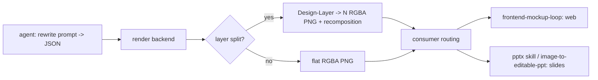

# Ming Image / Design — Local-Runnable Model, pi Design Skill Dossier

Research artifact. Explore-mode output. No OpenSpec change, no implementation.
Sources fetched 2026-09-24: [inclusionAI/Ming-Image-0.1-Design](https://huggingface.co/inclusionAI/Ming-Image-0.1-Design), [inclusionAI/Ming-Image-0.1-Design-Layer](https://huggingface.co/inclusionAI/Ming-Image-0.1-Design-Layer), [github.com/inclusionAI/Ming-Image](https://github.com/inclusionAI/Ming-Image), [github.com/inclusionAI/ling-cookbook](https://github.com/inclusionAI/ling-cookbook), [Comfy-Org/Ming-Image](https://huggingface.co/Comfy-Org/Ming-Image), [ComfyUI PR #16482](https://github.com/Comfy-Org/ComfyUI/pull/16482), [comfyui-wiki news 2026-09-23](https://comfyui-wiki.com/en/news/2026-09-23-ming-image-design), [creativeainews VRAM piece](https://creativeainews.com/articles/ming-image-0-1-design-6b-vram-requirements-2026/), [comfy-kitchen issue #92](https://github.com/Comfy-Org/comfy-kitchen/issues/92), [QZGao/ComfyUI-MPS-INT8](https://github.com/QZGao/ComfyUI-MPS-INT8), [ComfyUI PR #15542](https://github.com/Comfy-Org/ComfyUI/pull/15542), [DeepInfra](https://deepinfra.com/inclusionAI/Ming-Image-0.1-Design), [OpenRouter](https://openrouter.ai/inclusionai/ming-image-0.1-design), [note.com ai-toolkit LoRA guide](https://note.com/sepiablue/n/n89e59ce996d9).

## Framing

Ask: local-runnable "Ming" image/design model → build pi skill for design work.

Later consumers: website building, presentation building.

## What Ming is

- inclusionAI (Ant Group) `Ming-Image-0.1-Design` series. Released 2026-09-22; weights quietly uploaded 2026-09-17.
- MIT license → commercial OK.
- Two models:
  - `inclusionAI/Ming-Image-0.1-Design`: text→image. Square buckets 1024 / 2048 (2048 recommended). 12 steps, CFG 1.0. UI screens, posters, infographics, slides. Legible in-image text. Native RGBA transparent output — prepend exactly one documented trigger phrase.
  - `inclusionAI/Ming-Image-0.1-Design-Layer`: flat image + layer plan → N RGBA PNG layers + recomposition. 12 steps, CFG 2.0, buckets 512/1024, preserves aspect ratio.
- Layer quality: Crello alpha soft IoU 0.8923 vs 0.7177 open `Qwen-Image-Layered-I2L-1024`. Benchmark name `CLEAR-1024` = same model.
- Leaderboard: #1 open-weights, Artificial Analysis UI/UX Design arena, Elo 1082 vs `Ideogram 4.0 Quality` 1052, `FLUX.2 [dev]` 1000. Widest confidence interval in top 10. UI/UX slice only — not general T2I.

## Architecture

- DiT 6.15B (30 layers, 3840 dim, Z-Image-derived per Kijai).
- Text encoder `Ling-mini-2.0` MLLM 17.01B (MoE).
- Connector 3.09B + VAE + mlp.

## Prompt rewrite — the load-bearing pre-step

Official prompt rewrite runs OUTSIDE `infer.py`. VLM expands short caption → JSON:

```json
{
  "canvas_settings": { "aspect_ratio": "...", "ambient_lighting": "...", "image_style": "..." },
  "layers": [
    {
      "description": "...",
      "coordinates": "cx: 0.500, cy: 0.500, w: 1.000, h: 1.000",
      "hierarchy_and_relation": "...",
      "color_specs": ["#RRGGBB"]
    }
  ]
}
```

- Layers ordered back-to-front.
- Every rendered string quoted verbatim, exactly once.
- System prompt at `assets/t2i_rewriter_system_prompt.txt` in `github.com/inclusionAI/Ming-Image`.
- Official PE models: `Ling-3.0-flash-VL` or `qwen3.8-27B`.
- Insight: agent (Claude) can do this rewrite itself → no second VLM needed.

## Companion agent skills

In `github.com/inclusionAI/ling-cookbook` `resources/recommended-skills/`:

- `ling-ui-design`: generate reference → build UI code → visual check.
- `image-to-editable-ppt`: slide image → Layer → `scene.json` → native PPTX. Uses Novita cloud API: `LING_BASE_URL=https://api.novita.ai/openai/v1`, `LING_MODEL=ming-image-0.1-design-layer`.

Both map directly to web + PPT goals.

## Hardware reality

- "6B" misleading.
- Official repo package: Design 52.88 GB (≈26.44B params BF16), weights 49.25 GiB. Layer 65.20 GB (DiT 12.31B), 60.72 GiB.
- Text encoder 34.02 GB = 3.3× transformer.
- Vendor validated config: one CUDA GPU ≥ 80 GiB, BF16. 48 GB cards cannot load.
- Official `infer.py` CUDA-only: `requirements.txt` pins `torch==2.4.0`, `transformer-engine[pytorch]==1.11.0`, `diffusers==0.36.0`, `transformers==4.57.1`. `--device cuda:0` default. Runtime check raises "expected CUDA" for MLLM layers.
- Attention default `eager`, optional `flash_attention_2`; `sdpa` fails closed. `--validate-only` checks checkpoint without loading weights.
- Serving: vLLM-Omni (card's recipe URL 404s).
- Host: Apple M5 Pro, 48 GB unified memory, macOS 26.4, 157 GB free disk.

## Local path on Mac = ComfyUI

ComfyUI core support MERGED 2026-09-24, PR `Comfy-Org/ComfyUI#16482` "feat: ming-image support" (Kijai):

- T2I + prompt-enhancer workflow, image editing workflow, RGBA output.
- MoE expert loop refactor; quantized expert banks dequantized in bounded chunks.

Repack `Comfy-Org/Ming-Image` file sizes:

| Repo path | Size |
|---|---|
| `diffusion_models/ming_image_0.1_design_bf16` | 12.31 GB |
| `diffusion_models/ming_image_0.1_design_int8_convrot` | 6.18 GB |
| `diffusion_models/ming_image_0.1_design_layer_bf16` | 12.31 GB |
| `diffusion_models/ming_image_0.1_design_layer_int8_convrot` | 6.18 GB |
| `text_encoders/ming_image_0.1_ling_mini_2.0_bf16` | 36.68 GB |
| `text_encoders/ming_image_0.1_ling_mini_2.0_int8_convrot` | 19.51 GB |
| `text_encoders/ming_image_0.1_ling_mini_2.0_w4a8` | 12.81 GB |
| `text_encoders/ming_image_0.1_ling_mini_2.0_layer_bf16` | 36.68 GB |
| `text_encoders/ming_image_0.1_ling_mini_2.0_layer_int8_convrot` | 19.51 GB |
| `vae/ming_image_vae_bf16` | 0.25 GB |

Also `Kijai/Ming-Image-ComfyUI`.

Fit on 48 GB:

| Combo | Total | Verdict |
|---|---|---|
| int8 DiT + w4a8 TE | ≈ 19 GB | smallest, fits |
| int8 DiT + int8 TE | ≈ 26 GB | better quality, fits |
| all bf16 | ≈ 49 GB | ✗ |
| Layer int8 + int8 | ≈ 26 GB | fits |

MPS risks:

- `int8_convrot` fails on Apple Silicon — `torch._int_mm` has no MPS kernel (`comfy-kitchen` issue #92). Workaround custom node `QZGao/ComfyUI-MPS-INT8`.
- `w4a8` had MPS `Float8_e4m3fn` dequant bug; fix PR `Comfy-Org/ComfyUI#15542` (inclusion in current build UNVERIFIED).
- Zero Mac/Ming reports found.
- Speed anchors: RTX 4070 ~30 s for 1360×2048 12 steps; Mac M4 Z-Image Turbo ~500 s / 3 images → expect minutes/image on Mac vs hosted ~1.7 s.

Kijai notes:

- LCM sampler clean but over-smooth.
- Random text failures common at INT8.
- Model responds to bounding-box prompts.
- LoRA training via ai-toolkit works on 12 GB (note.com guide).

## Hosted fallbacks

| Provider | Notes |
|---|---|
| DeepInfra `inclusionAI/Ming-Image-0.1-Design` | ~1.7 s |
| OpenRouter `inclusionai/ming-image-0.1-design` | prompt-only, model picks dimensions, rejects explicit size |
| Novita | Design-Layer API |
| Rented 80 GB GPU + official `infer.py` | most faithful |

## Options



Skill `ming-design` pipeline: agent rewrites prompt → JSON; render via backend; optional layer-split; hand off to consumers (`frontend-mockup-loop` for web; pptx skill / `image-to-editable-ppt` for slides).

Backends:

- **A) local ComfyUI headless MPS int8/w4a8** — free, private, slow, unproven on Mac.
- **B) hosted API** — fast, cheap, Layer only via Novita.
- **C) rented 80 GB GPU** — faithful, heavy ops.

Lean recommendation: one skill, pluggable backend. Model on `packages/nano-banana` (CLI + SKILL.md, monorepo precedent). Invariant value = JSON prompt rewrite + RGBA triggers + Layer handoff + consumer routing; renderer swappable. Default local ComfyUI, API fallback.

## Next spike

1-hour Mac feasibility: install ComfyUI + `ComfyUI-MPS-INT8`, download int8 DiT + w4a8 TE (~19 GB), render one 1024 poster.

Gate: < ~2 min/image → local-first; else API-first.

## Open questions

1. Local hard requirement (privacy/offline/cost) vs nice-to-have?
2. Layer model priority (key for editable PPTX / HTML rebuild; heaviest locally)?
3. Home: monorepo package like `packages/nano-banana` vs personal `~/.pi/agent/skills`?
4. Complement nano-banana (Ming = text-heavy layouts, Gemini = photos/edits) or replace?
