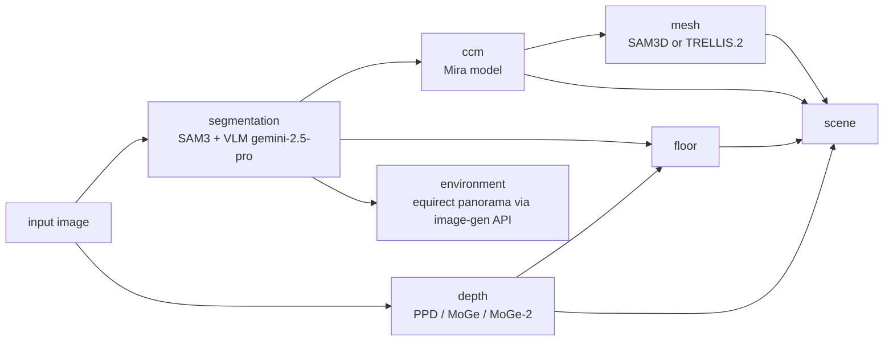
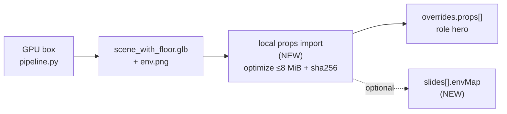

# Mira-Scene × deck3d — Research Dossier

> Status: **research / pre-planning** (explore mode output, no implementation).
> Goal: decide whether Mira-Scene (single-image → editable 3D scene) becomes a
> deck3d prop/environment source, and what it costs to run.
> Date: 2026-09-27.

---

## 1. TL;DR / Recommendation

- **Mira-Scene is real and recent.** Fits the deck3d prop pipeline conceptually.
- **Blocker = compute.** Linux + NVIDIA only. Host is macOS arm64 → no local run.
- **User decisions so far:**
  - Licence posture = **internal decks only**; unlicensed OK for now.
  - Compute location = **not decided**.
  - Integration shape = **keep exploring** (not decided).
- **Recommended next step:** spike — 1 case, 1 rented A100, 4 measurements
  (section 7). Cheap. Decides go/no-go before any deck3d code.

---

## 2. What Mira-Scene is

| Field | Value |
|---|---|
| Paper | "Mira-Scene: Pixel-Aligned Layouts for Generative 3D Scene Reconstruction" |
| arXiv | `2609.23796` — v1 2026-09-20, v2 2026-09-22 |
| Authors | Yang-Tian Sun et al. (VAST-AI-Research + HKU; Xiaojuan Qi, Yan-Pei Cao) |
| Code | `https://github.com/VAST-AI-Research/Mira-Scene` — 112 stars, pushed 2026-09-27 |
| Weights | `https://huggingface.co/Yang-Tian/Mira-Scene` — ungated, diffusers format, `pipeline/` + `pretrain_pipeline/` (transformer, vae, image_encoder safetensors) |
| Benchmark | `https://huggingface.co/datasets/Yang-Tian/Mira-Scene-Dataset` — `blendswap_eval`, 15 scenes, ~1.46 GiB |
| Project page | `https://sunyangtian.github.io/Mira-Scene-web/` |
| Input | one image |
| Output | editable compositional scene — separate object meshes + layout + floor + environment panorama |

**Core idea.** Canonical Coordinate Map (CCM) = pixel-aligned field. Maps each
visible object pixel → surface coord in object's bounded canonical space. Paired
with scene Point Cloud Map (PCM) from monocular depth → dense correspondences →
object pose via robust geometric alignment. Replaces sparse unbounded pose
regression. Multimodal diffusion transformer jointly generates geometry + CCM.

**Headline claim.** vs SAM3D: **+39.8% 3D-IoU**, **+16.5% 2D-IoU**.

| Metric | Mira-Scene | SAM3D |
|---|---:|---:|
| 3D-IoU | 0.727 | 0.520 |
| 2D-IoU | 0.783 | 0.672 |
| Training data | 80k open 3D | million+ closed |

> Caveat: numbers from the paper/README. Not independently reproduced.

---

## 3. Pipeline

`infer_scripts/pipeline.py`. Stage-wise. Resumable. Manifest-tracked.
Flags: `--from-stage/--to-stage/--force-stage`, `--mesh-backend sam3d|trellis2`, `--gpu-ids`.

| Stage | Purpose |
|---|---|
| `segmentation` | Split image into object masks. SAM3 + VLM (gemini-2.5-pro). |
| `depth` | Monocular depth map. PPD / MoGe / MoGe-2. |
| `ccm` | Canonical Coordinate Map per object. Mira model. |
| `mesh` | Object mesh per mask. Backend `sam3d` or `trellis2`. |
| `floor` | Floor plane from segmentation + depth. |
| `scene` | Place objects. Gravity/support-aware. `solve_method: gravity_joint`. |
| `environment` | Equirect panorama via image-gen API. |

**Output.**
- `results/<case>/scene/<backend>/<method>_depth/scene_with_floor.glb`
  (fallback `scene.glb`).
- `environment/` panorama.
- `scene_graph.json`.
- Viewer: `visualization/` (`result_vis.html`, GLB viewer).

**Interactive segmentation web UI.**
`python infer_scripts/0_segmentation.py --web ... --port 8890`.
Authors recommend manual review. Auto-segmentation misses objects, produces false
positives, gets support relations wrong.

---

## 4. Constraints / blockers

| Constraint | Fact | Impact |
|---|---|---|
| Hardware | Linux + NVIDIA driver + CUDA toolkit. CUDA extensions built with `TORCH_CUDA_ARCH_LIST=8.0` (A100 default). SAM3D multi-object needs ≥32 GB VRAM (per sam-3d-objects setup.md). | Host = macOS arm64 → cannot run locally. |
| Envs | Per-stage conda envs. Incompatible Python/PyTorch/CUDA (segmentation, geometry, ccm, sam3d, trellis2). Mapped in `infer_scripts/config/local.yaml` `environments:`. Docs: `infer_scripts/docs/environment.md`. | Heavy env juggling; Docker image needed. |
| Gated deps | SAM 3, SAM 3D Objects, DINOv3 need HF access request. Also RMBG-2.0, TRELLIS.2-4B, PPD/MoGe checkpoints. | Access requests gate first run. |
| API keys | Gemini (segmentation VLM). Image-gen API (environment stage). | Third-party keys/cost. |
| Licence | NO LICENSE file in repo. GitHub licence null. HF model card no licence → all-rights-reserved default. | Accepted for internal decks only. |
| Hosted demo | No HF Space (API search `mira-scene` → `[]`). No free gradio path like Hunyuan. | Must self-host. |
| Timings | Repo publishes none. | Spike must measure. |

---

## 5. deck3d fit

Verified in `packages/deck3d`.

**Precedent.** `props generate` (`src/props/generate.ts`): `python3 -c gradio_client`
→ `tencent/Hunyuan3D-2` `/shape_generation` → cached as source `generated`,
`restyle: palette`.

**Prop contract.**
- Self-contained GLB, magic check.
- Reject external `buffers[].uri` / `images[].uri`.
- 8 MiB cap (`src/props/fetch.ts`).
- sha256-pinned in `.deck3d/props/<source>-<id>.glb`.
- base64-embedded (`src/props/embed.ts`).
- `PropSource = "vendored" | "poly-pizza" | "generated"` (`src/props/search.ts`).

**Runtime.**
- `src/runtime/props.ts` GLTFLoader with `MeshoptDecoder` → meshopt-compressed
  scenes load today.
- `src/runtime/scene.ts` lighting = `RoomEnvironment` via PMREM only. No
  equirect/skybox support → Mira panorama needs a new feature.

**Prop metadata.** Roles: `hero`, `illustration`, `ambient`, `node:<id>`. Plus
`anim`, `size`, `restyle`.

### Gaps

| # | Gap | Detail |
|---|---|---|
| a | No local-GLB import command | `props import <glb> --name` needed. `fetch` only serves vendored/poly-pizza; `generate` only Hunyuan. |
| b | No optimizer | Full-scene textured GLB likely > 8 MiB. Need simplify + meshopt + texture resize (e.g. `gltf-transform`). |
| c | Provenance hidden | `licence: "generated"` skips credits slide → hides upstream SAM3D/TRELLIS.2 provenance. Consider a distinct label. |

---

## 6. Options

### Integration shape

| Option | Shape | Cost |
|---|---|---|
| A | Standalone `mira-scene` skill (SSH/GPU run, pull GLB) + deck3d `props import`. | Min deck3d code. |
| B | `props generate --backend mira-scene` inside deck3d; needs remote endpoint on GPU box. | Touches deck3d tests. |
| C | A + env-panorama backdrop in deck3d runtime. | Follow-up change. |

### Compute

| Option | Fact |
|---|---|
| Rent on demand (RunPod / Lambda, A100 80GB) | One Docker image w/ envs + ext + weights. ~$1–2/h. Per-scene 5–15 min = **ESTIMATE, unmeasured**. Slow cold start (tens of GB weights). Batch-style. |
| Owned always-on GPU box via SSH | Fixed cost. Best for iteration, incl. seg web UI `:8890`. |
| Hosted alternative (TRELLIS.2 / SAM3D / MIDI via fal/Replicate) | API key only. Cents per object. Loses Mira's layout advantage. |

### Alternatives

- **MIDI-3D** — `github.com/VAST-AI-Research/MIDI-3D`, CVPR 2025, Apache-2.0,
  single-image → compositional scene, same lab.
- TRELLIS.2.
- SAM3D.

> Note: slide backdrops value "striking" over "faithful layout" → Mira's accuracy
> edge may matter less here.

---

## 7. Proposed spike — 1 case, 1 rented A100

1. Wall-clock + VRAM per stage → rent-per-job vs always-on.
2. `scene_with_floor.glb` size raw vs optimized → does the 8 MiB cap force a
   scene-prop mode.
3. Visual fit: hand-import GLB as `hero` prop, `deck3d snapshot` → reads on slide
   vs stylised hosted object.
4. Hands-off segmentation quality on non-room input (product shot, illustration).

**Kill criterion.** 1 + 3 decide go/no-go. 2 decides deck3d work size.

---

## 8. Open questions

- Compute location — undecided.
- Integration shape A/B/C — undecided.
- External use later → ask authors for licence (GitHub issue).
- Provenance labelling for generated scene props.
- MIDI-3D side-by-side worth running in the same spike?

---

## 9. Sources

- Paper abs: `https://arxiv.org/abs/2609.23796`
- Paper pdf: `https://arxiv.org/pdf/2609.23796`
- Project page: `https://sunyangtian.github.io/Mira-Scene-web/`
- Code: `https://github.com/VAST-AI-Research/Mira-Scene`
- Weights: `https://huggingface.co/Yang-Tian/Mira-Scene`
- Benchmark: `https://huggingface.co/datasets/Yang-Tian/Mira-Scene-Dataset`
- SAM 3D Objects setup (VRAM): `https://github.com/facebookresearch/sam-3d-objects/blob/main/doc/setup.md`
- MIDI-3D: `https://github.com/VAST-AI-Research/MIDI-3D`
