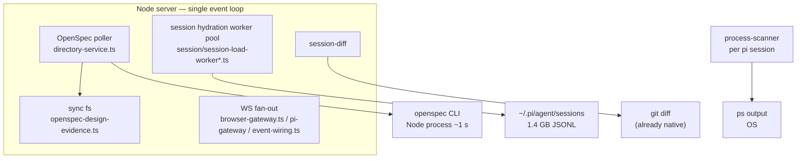

# Go/Rust Rewrite Candidates for the pi-dashboard Server

Research dossier. Explore-mode session 2026-09-29. No OpenSpec change, no implementation. Question: **what part of the system could be rewritten in Go/Rust to improve performance?**

**Verdict: not much, yet.** Rewriting the server in Go/Rust would not fix observed slowdowns — the bottleneck is spawn / IO / polling, not CPU. Two or three narrow spots could take a native component. Measure first.

## Evidence

- `~/.pi/dashboard/server.log`, last 20k lines: only perf-warning kind = `[openspec-poll] slow tick`, 265 occurrences. Repeated ~15000 ms — spawn-queue wait, not CPU. One 602180 ms — a hang, not slow compute.
- `~/.pi/agent/sessions` = 1.4 GB JSONL.
- `openspec list --json`: 1.0 s wall, 0.14 s user CPU → time goes to process startup, disk IO, queue waits. Faster language speeds CPU work only.
- Known memory: event-loop stalls caused by OpenSpec poller scanning every cwd (incl ended + hidden) each tick; sync fs (`readdirSync`/`statSync`/`readFileSync`) in `packages/shared/src/openspec-design-evidence.ts`. Mitigation skill `unwedge-dashboard-event-loop`.
- `kb_search` measured ~21–91 ms/case (SQLite FTS5, native C).
- Largest server files: `server.ts` 3772 lines, `event-wiring.ts` 2465, `pairing/browser-gateway.ts` 2365, `persistence/memory-event-store.ts` 1970, `git-worktree/git-operations.ts` 1913, `directory-service.ts` 1736. Server src total ~84.8k lines.

## Current hot paths

## Candidate areas

| # | Area | Main cost | Go/Rust help? | Better first fix |
|---|---|---|---|---|
| 1 | Session JSONL hydration (`packages/server/src/session/session-load-worker*.ts`) | CPU: JSON parse + replay over 1.4 GB | Yes, with catch. Rust `simd-json` parse 2–5× faster, but materializing JS objects costs about as much as parsing; pays off only if replay is also native and returns a small result | Per-session summary index so cold load skips full re-parse |
| 2 | OpenSpec poller (`packages/server/src/directory-service.ts`) | Node process startup per cwd, polling every cwd, sync fs on main thread | Somewhat. Native watcher (Rust `notify` / Go `fsnotify`) replaces polling, but gain comes from watch-vs-poll — Node can also do that | Watch instead of poll; move sync fs in `openspec-design-evidence.ts` off main thread |
| 3 | Session diff | Heap retention (#719), 50 MB strings | No. git already native; problem = memory retention | Stream diff; fix underway in change `fix-session-diff-heap-retention` |
| 4 | `process-scanner` (`packages/extension/src/process-scanner.ts`) | `ps` output parse in every pi session | Marginal; forces native binary into every pi install | Share one scanner instead of one per session |
| 5 | kb indexer/search (`packages/kb`) | SQLite FTS5 | No. FTS5 already native C, ~21–91 ms/query | — |
| 6 | WS gateways, `event-wiring.ts` | Message fan-out | No at this scale. 43 message types shared in TS with client = real advantage | — |

## Integration options

| Option | JS boundary | Distribution | Crash | Fits |
|---|---|---|---|---|
| napi-rs addon (Rust, in-process) | Cheap, but results still become JS objects | Prebuilt per OS/arch × Electron ABI (painful) | Takes server down | #1 hot parse loop |
| Sidecar binary (Go/Rust) | Serialize over unix socket | One static binary per OS/arch (Go easiest) | Isolated, restartable | #1 + #2 as indexer daemon |
| WASM | Memory copy in/out | Single artifact | Sandboxed | Pure CPU kernels only |

## Recommendation if going native

One bounded sidecar (working name `pi-indexd`), not scattered addons.

Responsibilities:

- Watch `~/.pi/agent/sessions` and `*/openspec/changes` for file changes instead of polling.
- Keep small per-session summary + OpenSpec state index.
- Serve to Node server over local socket.

Removes two main-loop costs from Node, isolates crashes. TS protocol + UI unchanged. Go = easier cross-platform static binaries; Rust = raw parse speed.

## Hidden cost

Second toolchain hits Electron packaging, npm publish of every workspace, CI matrix macOS/Windows/Linux × arm64/x64, docker image, `doctor` skill. Large permanent tax; justified only if a profile shows a CPU bottleneck.

## Open questions / next steps

- Where it feels slow: cold chat-history load, UI freeze, `/api/health` timeouts, or startup — each maps to a different row.
- 602 s tick: likely stuck spawn/lock; no rewrite fixes it; warrants `systematic-debugging` pass.
- Cheap spike: profile one cold hydration of the largest session file; split parse vs replay time. Decides whether row #1 justifies Rust.
