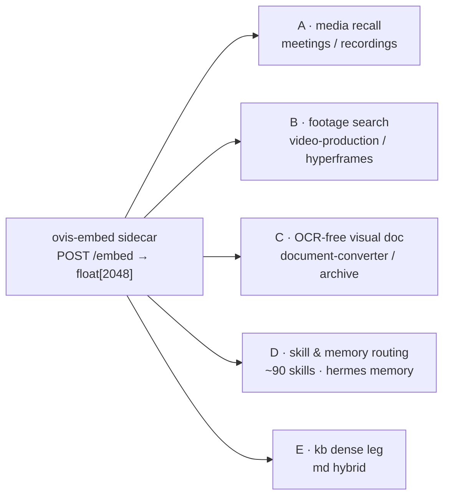
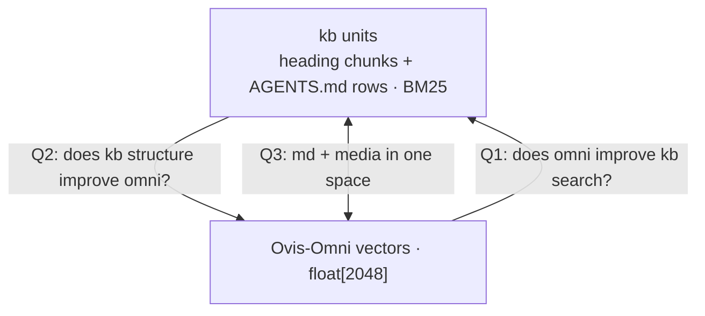

# Ovis-Omni-Embedding — Local Run Feasibility + kb Retrieval Eval Plan

> Status: **research / pre-proposal**. No measurements run yet. Feeds proposed change `spike-omni-embedding-eval` (not yet created).
> Goal: check Ovis-Omni EMBEDDING models — can they run local, how to use them; can kb measure how omni improves usage; can omni index other media types alongside `.md` files.
> Scope: research + eval plan only. No code change. Model facts desk-verified from HF / GitHub / arXiv (2026-09-27).
> Date: 2026-09-27.

Evidence labels: **VERIFIED** = desk-verified from vendor files this date. **HYPOTHESIS** = estimate, not measured. Zero in-repo measurements yet.

---

## 1. Question

- User asks: check Ovis-Omni models. Can they run local? How utilize?
- Can kb measure how omni improves usage?
- Can omni index other media types alongside `.md` files?

---

## 2. Model landscape

VERIFIED 2026-09-27. Sources: HF API `api/models?author=ATH-MaaS`, `github.com/ATH-MaaS/Ovis-Omni-Embedding`, arXiv `2609.25165`.

- "Ovis-Omni" = **embedding** model. NOT generative chat.
- Repo `ATH-MaaS/Ovis-Omni-Embedding-3B` — Alibaba ATH-MaaS (formerly AIDC-AI). Apache-2.0. HF created 2026-09-20.
- Base `Qwen2.5-Omni-3B`. Keeps text tokenizer + vision encoder + audio encoder + shared Thinker.
- Talker + LM head removed at inference.
- Embedding = final-layer hidden state at last non-padding token. L2-normalized. Cosine sim. Bi-encoder, no cross-attention.
- Modalities: text, image, visual document, video, audio, interleaved.
- Native dim 2048. Elastic 1024/512/256/128 described (PCA + residual adapter folded to one matrix). Projection matrix NOT found in repo files.

Benchmarks (vendor-reported):

| Benchmark | Ovis-Omni | Baseline | Δ |
|---|---|---|---|
| MMEB-v3 (190 datasets) | 58.46 | best baseline | +5.19 |
| — Image | 77.55 | | |
| — Video | 64.99 | | |
| — Visual doc | 78.26 | | |
| — Text | 47.15 | | |
| — Audio | 50.08 | best baseline | +6.91 |
| — Agent | 45.52 | best baseline | +6.10 |
| MAEB | 57.29 | LCO-Embedding-Omni-7B 53.54 | +3.75 |
| MVEB | 61.77 | 57.58 | +4.19 |
| RTEB | 67.35 | Qwen3-Embedding-4B 67.27 | +0.08 (text ≈ tie) |

Siblings + relatives:

- `ATH-MaaS/Ovis-VL-Embedding-2B` / `-9B` — text / image / doc / video. NO audio.
- Generative VLMs: Ovis2.5-2B/9B, Ovis2.6-30B-A3B, Ovis2.6-80B-A3B. NOT omni, no audio.

Weights:

- GitHub README says "weights not open-sourced yet" — **STALE**. HF repo `model/` ships weights.

| File | Bytes |
|---|---|
| `model-00001-of-00003.safetensors` | 4,985,032,488 |
| `model-00002-of-00003.safetensors` | 4,999,949,856 |
| `model-00003-of-00003.safetensors` | 1,089,579,000 |
| total | ~11 GB bf16 |

Plus `chat_template.jinja`, `processor_config.json`, `preprocessor_config.json`, `tokenizer.json`, `zero_to_fp32.py`, `args.json`.

`model/config.json`: architectures `Qwen2_5OmniForConditionalGeneration`, model_type `qwen2_5_omni`, dtype bfloat16, transformers_version 5.3.0, `enable_audio_output: true`.

Weight map top modules:

| Module | Tensors |
|---|---|
| `thinker.visual` | 518 |
| `thinker.audio_tower` | 489 |
| `token2wav.code2wav_bigvgan_model` | 449 |
| `thinker.model` | 434 |
| `token2wav.code2wav_dit_model` | 359 |
| `talker.model` | 290 |
| `thinker.lm_head` | 1 |

Checkpoint ships FULL omni incl Talker + token2wav. Embedding path needs Thinker only.

`args.json`: `{"model_type":"qwen2_5_omni","template":"qwen2_5_omni_emb","task_type":"embedding"}` → ms-swift training template. Exact per-task instruction strings undocumented.

Community quants: `pt810/Ovis-Omni-Embedding-3B-bnb-4bit|8bit(-vllm)`, `-gptq-mixed-*`, compressed-tensors. bitsandbytes / GPTQ CUDA-oriented.

---

## 3. Local run feasibility

Host: Apple M5 Pro, 48 GB unified memory, macOS 26.4. torch / mlx NOT installed.

| Path | Verdict |
|---|---|
| transformers ≥5.3 + torch MPS, Thinker only | viable. Thinker ≈4.4B params ≈9 GB bf16 (HYPOTHESIS, estimate) |
| bnb / GPTQ community quants | not on Mac (CUDA) |
| vLLM / vLLM-Omni | CUDA. Linux GPU box only |
| MLX / GGUF / Ollama | no port for Qwen2.5-Omni embedding mode |
| CPU-only | text OK. video / audio slow |

Risks:

- Load with audio output disabled (skip talker / token2wav). Else memory wasted.
- No reference encode snippet. Must reconstruct ms-swift `qwen2_5_omni_emb` template — instruction + chat template + last-token pooling. Wrong recipe → silently depressed scores. Gate: sanity check positive pairs > negatives before any eval.
- No elastic projection shipped → 2048-d only (8 KB/vec fp32).
- Video / long-audio token count high → indexing cost minutes per hour of media (HYPOTHESIS, unmeasured).
- First Python / torch runtime dep in monorepo. `packages/video-transcription` deliberately "TS port, no Python" → packaging cost.

Proposed shape: Python (uv) sidecar `ovis-embed`. localhost `POST /embed {text|image|audio|video|pdf-page} → float[2048]`. TS side stays client.

---

## 4. Utilization candidates

Ranked by fit to omni strengths:

1. **Meeting / recording recall** — `~/Movies` (188 `.srt`) + `~/Documents/Media/recorder-export` (25 `.srt`). Pairs with `video-transcription`, `speaker-id`, `movies-srt-catalog`, `recorder-export-catalog` skills. Audio lead (+6.9) applies.
2. **Footage search** for video-production / hyperframes-showreel sampling. Replace contact-sheet scanning.
3. **OCR-free visual-document retrieval** — document-converter inputs, personal archive (~1000 docs, Hungarian scans).
4. **Agent / skill / tool / memory routing** — ~90 skills, hermes memory (Agent group 45.52, +6.10).
5. **kb dense leg for md** — weakest fit. Text ≈ tie with smaller text embedders. Cheaper `Qwen3-Embedding-0.6B` candidate.

---

## 5. Measurement plan — three questions

### Q1 — Does omni improve kb search?

- Harness exists: `packages/kb/eval/run-fixtures.ts` (`tsx packages/kb/eval/run-fixtures.ts [--sweep] [--json]`), `src/eval.ts` `evaluate`. Metrics P@1 / P@5 / R@10 / MRR. Paired bootstrap CI + W/L/T in prior rounds (see `docs/research/kb-search-retrieval-quality-investigation.md`).
- Golden sets in `packages/kb/eval/`:

| Set | n |
|---|---|
| `golden.markdown-intent.json` | 108 |
| `golden.source-intent.json` | 104 |
| `golden.doc-example.json` | 20 |
| `golden.doc-example.paraphrase.json` | 9 |
| `golden.provenance.json` | — |

- Prior baseline: markdown set n=101 A baseline P@1 .178 / P@5 .366 / R@10 .436 / MRR .257 (from kb-search dossier; across-round absolute numbers not comparable).
- Spec hook: `openspec/specs/markdown-knowledge-base` "Scenario: Paraphrase set tracks the lexical ceiling" — dense leg's primary hypothesis target.
- Variants: `bm25` | `dense(Ovis)` | `hybrid RRF(bm25+Ovis)` | `hybrid RRF(bm25+Qwen3-Embedding-0.6B)`. Last = cost control. If tie on md, Ovis justified only for media.
- **BIAS WARNING**: golden sets mined from implicit feedback where opened file had to appear in BM25 result text (`golden.provenance.json`) → BM25-favored, dense gains UNDERSTATED. Mitigation: new paraphrase set ≥40 items, zero lexical overlap with target. Current n=9 too small.

### Q2 — Does kb structure improve omni?

- Ablation of embedding unit: whole-file (truncated) | heading-chunk | AGENTS.md row | chunk+row fused. Same queries / scorer.
- Rationale: 8,722 tracked `.md` files. Long specs → single-vector averaging washes meaning. kb chunking likely right unit — measurable kb→omni contribution.

### Q3 — md + other media in one index

- Omni embeds md sections as text → shared space with media. One query returns doc section + recording.
- Self-labelling golden sets (no hand labelling):

| Set | Pairs | Source | Query → target |
|---|---|---|---|
| md→image | 47 | `` refs with alt text in tracked `.md` (89 tracked images) | alt text / surrounding heading → image |
| text→audio | 188 + 25 | SRTs | SRT segment text → audio window; harder: LLM paraphrase of segment → audio |
| md↔recording | — | movies / recorder DOX catalogs group recordings by project | project doc section → project recordings |

- Baselines for audio: transcript-only BM25 (SRT in kb) + transcript-only dense (text embedder). Omni audio must beat both. Else transcript suffices.

---

## 6. Constraints

- `openspec/changes/add-kb-semantic-annotation-plane` spec: indexer "SHALL NOT invoke any LLM or embedding model" → vectors live in separate opt-in plane (e.g. sqlite-vec table keyed by kb chunk id). Eval reads it. Today's index behaviour untouched.
- Report cost with quality: embed throughput on MPS (text/s, img/s, sec per audio-min, sec per video-min), index size. Query latency via `packages/kb/eval/measure-search-latency.ts`.
- Local-only for private meetings / personal docs → no cloud embedding API.

---

## 7. Sequencing (proposed change `spike-omni-embedding-eval`)

1. Sidecar + recipe validation on MPS. Gate: pos > neg sanity, memory measured.
2. Q1 on existing sets + new paraphrase set ≥40.
3. Q2 chunking ablation (same run).
4. Q3 md→image first (47 pairs, in-repo), then SRT→audio.

Decision rule: adopt hybrid only if paired Δ MRR CI excludes 0 on paraphrase set with no significant loss on markdown / source sets. Adopt Ovis over small text embedder only if media sets (Q3) show gain.

---

## 8. Open questions

- Generative omni (Qwen2.5-Omni, Ovis2.5/2.6 VLM) wanted instead of retrieval? Separate track — see `docs/research/qwen-audio-and-omni-models.md`.
- Vector store: sqlite-vec beside kb FTS5 db vs sidecar-owned store.
- Python dep packaging vs no-Python stance of `packages/video-transcription`.

---

## 9. Sources

- https://huggingface.co/ATH-MaaS/Ovis-Omni-Embedding-3B
- https://github.com/ATH-MaaS/Ovis-Omni-Embedding
- https://arxiv.org/abs/2609.25165
- https://huggingface.co/api/models?author=ATH-MaaS
- Companion: `docs/research/kb-search-retrieval-quality-investigation.md`, `docs/research/qwen-audio-and-omni-models.md`, `docs/research/sub1b-stt-diarization-benchmark.md`
