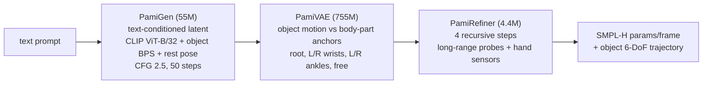
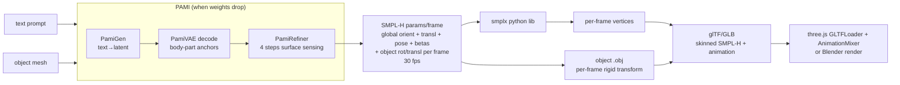

# PAMI — Text→Human-Object-Interaction Motion Research Dossier

Research dossier. Explore-mode output. Plan only — no OpenSpec change, no implementation.
Sources fetched 2026-10-04. Date 2026-10. Facts verified 2026-10-04 unless marked `[H]`.

> Status: **research / pre-planning**.
> Goal: research PAMI text→motion model; later build a 3D scene of the movement;
> check how API / local model can be used.
> Host note: Robert's Mac M5 Pro 48 GB unified (Apple Silicon MPS/CPU) — PAMI
> inference footprint small (≤5.7 GB on H100) so plausibly runs locally once
> released `[H]`; CUDA-only deps (pytorch3d, custom kernels) are the risk `[H]`.
> Training/reimpl needs H100-class GPU.

---

## 1. Sources

| Kind | Location |
|---|---|
| Paper | arXiv `2609.38466` — `https://arxiv.org/abs/2609.38466` |
| Project page | `https://coral79.github.io/pami/` |
| Code | `https://github.com/Coral79/PAMI-Code` (MIT, ~31★, created 2026-09-29) |
| Training data | `https://github.com/wzyabcas/InterAct` |
| Authors | Chuqiao Li, Xianghui Xie, Yong Cao, Andreas Geiger, Gerard Pons-Moll — Tübingen AI Center + MPI Informatics |

**Name trap.** PAMI = "Part Anchored Motion for Text to Human-Object Interaction
Generation". NOT the journal IEEE **TPAMI** (Transactions on Pattern Analysis and
Machine Intelligence). Different thing despite near-identical acronym.

---

## 2. What PAMI is

### 2.1 Task

Text + canonical object mesh → **full-body human motion (SMPL-H)** + **rigid object
6-DoF trajectory** over `T` frames. This is human–object interaction (HOI), **not**
plain text-to-motion — the object matters.

Inputs: text prompt, one object mesh.
Outputs: SMPL-H params per frame (global orientation + translation + body pose + betas)
and object rotation + translation per frame.

### 2.2 Architecture — 3 modules

| Module | Params | Role |
|---|---:|---|
| **PamiVAE** | 755M | Encode human motion → body-part tokens. Object motion expressed relative to body-part **anchors** (root, L/R wrists, L/R ankles + free anchor). Decodes per-frame routing weights → aggregate anchor "votes" (Hough-transform inspired) → object trajectory. |
| **PamiGen** | 55M | Text-conditioned latent generator. `d=512`, 10 layers, 8 heads. Conditioning: CLIP ViT-B/32 text tokens, object BPS (basis point set), body-shape joint rest pose. Classifier-free guidance scale 2.5, 50 sampling steps. |
| **PamiRefiner** | 4.4M | Recursive refinement. Hybrid surface sensing: long-range body-part probes + short-range sensors near hands. Updates human pose + object pose. 4 refinement steps. |



### 2.3 Motion representation

- 30 fps, windows ≤300 frames (~10 s).
- First-frame human root defines world frame.
- 272-dim body repr following **MotionStreamer**, but with global root orientation +
  translation (MotionStreamer has no global root).

### 2.4 Performance (paper, 1× H100, batch 1, 231-frame seq)

| Stage | Time | Peak VRAM |
|---|---:|---:|
| Generation (PamiGen + PamiVAE decode) | 0.13 s | 5.7 GB |
| 4 refinement steps (PamiRefiner) | +0.66 s | 2.8 GB |

Training: PamiGen 240k iters ~16 h, PamiRefiner 44k iters ~8 h on one H100.

### 2.5 Data

Trained/evaluated on **InterAct** — unified HOI mocap dataset. Pools OMOMO, CHAIRS,
NeuralDome, IMHD, BEHAVE, GRAB, InterCap. SMPL-H / SMPL-X body models + object meshes.
Result: **+14.5% contact recall vs previous SOTA**. Baselines: LIGHT, InterAct.

### 2.6 Example prompts (project page)

- "Lift the suitcase, move the suitcase, and put down the suitcase."
- "Put your hand on the back of the whitechair, pull the whitechair, and set it back down."
- "Pick up the fallen tripod."

Objects come from InterAct's fixed vocabulary (suitcase, tripod, monitor, chairs,
trashcan, floorlamp, largebox, toothpaste, …). Generalisation to arbitrary user
meshes unverified `[H]`.

---

## 3. Availability status (checked repo tree + README, 2026-10-04)

- **NO hosted API. NO HuggingFace weights** (HF search "pami" → nothing relevant).
- `Coral79/PAMI-Code` currently contains only README, LICENSE, assets (teaser/method PNG).
  Release checklist **all unchecked**: data prep scripts, model weights (PamiVAE /
  PamiGen / PamiRefiner, planned on HuggingFace), inference code, training code.
  Install "coming soon".
- Placeholder inference CLI in README (README says "final interface will be documented"):

  ```bash
  python generate.py --text "Lift the suitcase, move the suitcase, and put down the suitcase." --object suitcase
  ```

  Pipeline: PamiGen (text → latent) → PamiVAE decode → PamiRefiner N recursive steps.

**Therefore: today PAMI cannot be run.** Options:

- Watch repo (GitHub "Watch → Releases").
- Re-implement from paper — expensive: needs InterAct access + H100-class training
  ≈24 h+ plus VAE 200k iters.

### 3.1 Licenses to plan for when released

| Component | License / gate |
|---|---|
| PAMI code | MIT |
| InterAct data | Non-commercial request form (Google form, `InterAct_license.pdf`) |
| GRAB / BEHAVE / InterCap | Max Planck custom licenses — obtain separately |
| SMPL-H | `mano.is.tue.mpg.de` — registration, non-commercial by default |
| SMPL-X | `smpl-x.is.tue.mpg.de` — registration, non-commercial by default |

⇒ Outputs effectively **non-commercial** unless separately licensed.

---

## 4. Usable alternatives today (verified via GitHub API / HF)

### 4.1 Same group (Coral79 / Pons-Moll lab)

| Repo | Venue | Contents | License |
|---|---|---|---|
| `Coral79/FrankenMotion-Code` | CVPR 2026 | Part-level human motion gen; 149 files / 93 `.py`; code released | NOASSERTION |
| `Coral79/ActionPlan-Code` | ECCV 2026 | Streaming motion synthesis; code released | MIT |

Both **human-only** (no object). `[H]` verify weight release in their READMEs.

### 4.2 InterAct — closest runnable proxy

`wzyabcas/InterAct`: released text-to-HOI training code, pretrained model + evaluator
checkpoints (news 2025-11-26), baseline constructions for text2HOI. Same task shape as
PAMI (text + object → HOI) and same data dependency.

- Per-seq files: `action.npy`, `action.txt`, `human.npz`, `markers.npy`, `joints.npy`,
  `motion.npy`, `object.npz`, `text.txt`.
- Object files: `.obj` mesh, `sample_points.npy`, BPS `.npy`.
- Env: conda Python 3.8, torch 2.0.

### 4.3 Tencent HY-Motion 1.0 — text→human motion only, EU-blocked

- `https://github.com/Tencent-Hunyuan/HY-Motion-1.0`, HF `tencent/HY-Motion-1.0`.
- DiT + flow matching, text→3D human motion (SMPL-H skeleton).
- 1.0B (26 GB VRAM min) and Lite 0.46B (24 GB). macOS / Win / Linux.
- CLI:
  ```bash
  python3 local_infer.py --model_path ckpts/tencent/HY-Motion-1.0-Lite \
    --input_text_dir <dir> --output_dir <dir> \
    --disable_duration_est --disable_rewrite
  ```
- Gradio: `python3 gradio_app.py` → `http://localhost:7860`
  (`DISABLE_PROMPT_ENGINEERING=True` saves VRAM). HF Space exists.
- Ships `hymotion/utils/smplh2woodfbx.py` (SMPL-H→FBX) and `visualize_mesh_web.py`.
- NOT supported: objects/scenes, multi-person, loops.
- **LICENSE BLOCKER**: "Tencent HY-Motion 1.0 Community License" — "DOES NOT APPLY IN
  THE EUROPEAN UNION, UNITED KINGDOM AND SOUTH KOREA". User is EU-based (Hungary) →
  cannot be licensed for use here. Flag clearly: **not usable without legal review**.

### 4.4 MDM — classic baseline

`GuyTevet/motion-diffusion-model` (MIT code, ~4.1k★): HumanML3D text→motion baseline.
HF reproductions: `ZeyuLing/hftrainer-mdm-humanml3d`, `hftrainer-t2mgpt-humanml3d`,
`hftrainer-motionlcm-humanml3d`. HumanML3D/AMASS + SMPL are non-commercial research
licenses. **Human-only** (no object).

### 4.5 Curated index

`Zilize/awesome-text-to-motion`.

---

## 5. Local-run feasibility on user's Mac (Apple Silicon M-series) `[H]`

- PAMI inference footprint small (≤5.7 GB on H100) → plausibly runs on MPS or CPU once
  released `[H]`.
- Risk: CUDA-only deps (pytorch3d, custom kernels) common in this line of work `[H]`.
- Fallback: rent cloud GPU (single 24 GB+ card enough for inference).
- Training/reimpl: needs H100-class GPU.

---

## 6. 3D scene pipeline (planned target)



- `smplx` python lib → per-frame vertices.
- Export glTF/GLB: skinned SMPL-H rig with animation, **or** Blender SMPL-X add-on →
  FBX/GLB.
- Object `.obj` with per-frame rigid transform → glTF node animation.
- Viewer: three.js `GLTFLoader` + `AnimationMixer`, or Blender for rendering.
- World frame = first-frame human root → place ground plane at `y=0`; object initial
  pose from model output.
- Coordinate conventions: SMPL is y-up, meters — matches glTF y-up meters `[H]`
  (verify per output).

### 6.1 Suggested next step

Build the scene pipeline **now** against InterAct ground-truth sequences (same SMPL-H +
`object.npz` format PAMI will emit) so it is ready when weights drop.

### 6.2 Decision table

| Option | When | Task | License | Verdict |
|---|---|---|---|---|
| **PAMI** | wait for weights | text + object → HOI | code MIT; data/body non-commercial | target; not runnable today |
| **InterAct baseline** | now | text + object → HOI | non-commercial | runnable proxy; build scene pipeline on it |
| **HY-Motion** | — | text → human only | EU/UK/KR excluded | blocked in EU |
| **MDM** | now | text → human only | non-commercial | human-only fallback |

---

## 7. Open questions

- Exact output file format of PAMI release (unknown until code ships).
- Arbitrary object meshes vs InterAct object vocabulary.
- Commercial use path (SMPL commercial license via Meshcapade) `[H]`.
- Whether FrankenMotion / ActionPlan ship pretrained weights `[H]`.

---

## 8. Sources (URLs)

- PAMI paper — `https://arxiv.org/abs/2609.38466`
- PAMI project page — `https://coral79.github.io/pami/`
- PAMI code — `https://github.com/Coral79/PAMI-Code`
- FrankenMotion — `https://github.com/Coral79/FrankenMotion-Code`
- ActionPlan — `https://github.com/Coral79/ActionPlan-Code`
- InterAct — `https://github.com/wzyabcas/InterAct`
- HY-Motion 1.0 — `https://github.com/Tencent-Hunyuan/HY-Motion-1.0`; HF `tencent/HY-Motion-1.0`
- MDM — `https://github.com/GuyTevet/motion-diffusion-model`
- awesome-text-to-motion — `https://github.com/Zilize/awesome-text-to-motion`
- SMPL-H — `https://mano.is.tue.mpg.de`
- SMPL-X — `https://smpl-x.is.tue.mpg.de`
