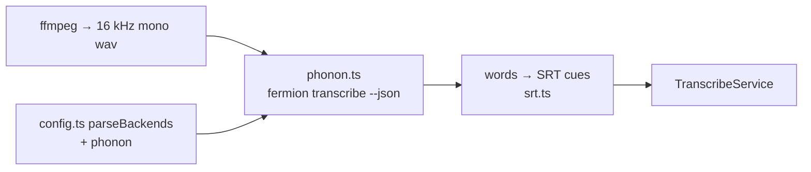

# Phonon-2 — Hungarian ASR Feasibility Eval

> Status: **research / complete**. No code change.
> Question: Is Phonon-2 a usable Hungarian transcription engine for us (`packages/video-transcription`)?
> Scope: vendor facts desk-verified 2026-10-04; local WER measured 2026-10-04 on Apple M5 Pro.
> Date: 2026-10-04.

Evidence labels: **VERIFIED** = desk-verified from vendor pages 2026-10-04. **MEASURED** = run locally 2026-10-04. **HYPOTHESIS** = estimate, not measured.

Verdict up front:

- Hungarian: **NOT supported, NOT usable.** Do not adopt Phonon-2 for Hungarian.
- English: viable fast local/offline engine. Word timestamps → SRT possible. No diarization.
- Teacher `parakeet-tdt-0.6b-v3` = only local Hungarian-capable path in family. ~58% WER conversational → not SRT-grade replacement.

---

## 1. Question

- Is Phonon-2 usable Hungarian transcription engine?
- Context: `packages/video-transcription`. Current default backend Soniox (`soniox.ts`, stt-async-v3 + diarization). Alt AssemblyAI (`assemblyai.ts`). Selection `TRANSCRIBE_BACKEND` in `config.ts` → `TranscribeService`.
- Prior repo measurement (2026-09-21): qwen3.8-omni-flash on Hungarian meeting −15% words, drifting timestamps.

---

## 2. What Phonon-2 is

VERIFIED 2026-10-04. Sources: huggingface.co/FermionResearch/Phonon-2, fermionresearch.com/models/phonon-2/, fermionresearch.com/research/phonon-2/, fermionresearch.com/docs/speech/, github.com/fermionresearch/phonon, PyPI `fermion-research`.

- Vendor: Fermion Research, small startup. Released ~Sept/Oct 2026. HF `FermionResearch/Phonon-2`.
- NOT new architecture. Quantisation-aware-trained (QAT) compression of NVIDIA `parakeet-tdt-0.6b-v3` (FastConformer-TDT, 0.6B).
- Tokenizer + output conventions (punctuation, casing, numerals) unchanged from teacher.
- Encoder weights at 5 learned levels ≈ 2.1 bits/weight.
- Download 164 MB vs teacher 2,508 MB → 15× smaller.
- License: weights CC-BY-4.0 (inherits teacher); CLI + repo code Apache-2.0.

Teacher support (VERIFIED via huggingface.co/nvidia/parakeet-tdt-0.6b-v3):

- 25 EU languages incl Hungarian (`hu`). Auto language detect.
- Teacher FLEURS `hu` WER 15.72% (vendor).

---

## 3. Language coverage — the blocker

VERIFIED 2026-10-04.

- Vendor claims English only. "open model for English". Docs: "All of them transcribe English from 16 kHz audio".
- HF tag `en`. No language flag. No sampler flags. Greedy decode.
- → Phonon-2 has NO Hungarian output path. Cannot select `hu`.

---

## 4. English quality (vendor)

VERIFIED 2026-10-04. Open ASR Leaderboard, 7 sets, vendor-run. Not independently reproduced.

| Model | Avg WER % |
|---|---|
| Phonon-2 | 5.21 |
| Teacher parakeet-tdt-0.6b-v3 | 4.96 |
| Whisper large-v3-turbo | 6.58 |
| Parakeet Redux | 5.69 |
| Canary 180M Flash | 5.69 |

Phonon-2 per-set: LS clean 1.72, LS other 3.92, AMI 9.37, Earnings-22 6.96, GigaSpeech 8.35, SPGI 3.70, VoxPopuli 2.46.

---

## 5. Speed (vendor)

VERIFIED 2026-10-04. Real-time factor ×.

| Host | RT |
|---|---|
| M5 MacBook Air MLX GPU | 174× |
| M5 CPU | 40× |
| 8 Zen5 cores | 142.8× |
| Axion Arm | 52× |
| Windows 8 vCPU | 21× |
| A100 | 267× / 3,614× batch128 |
| H100 | 465× / 6,680× |

---

## 6. Runtime + interface

VERIFIED 2026-10-04.

Install:

```bash
pip install fermion-research
# Apple silicon
pip install mlx mlx-audio mlx-lm soundfile scipy zstandard
# Linux/Win CPU
pip install torch safetensors soundfile scipy zstandard
```

Docker: `ghcr.io/fermionresearch/phonon-cpu:2.0.6`, `ghcr.io/fermionresearch/phonon-cuda:1.0.5`.

CLI:

- `fermion transcribe phonon-2 file.wav [--json]`. Aliases `phonon-2`/`phonon2`/`phonon`/`speech`/`stt`/`asr`. Also `phonon transcribe`.
- Inputs wav/flac/ogg/aiff via libsndfile → resample 16 kHz mono.
- mp3/m4a REFUSED → ffmpeg convert first.
- `--json`: `text`, segment `start`/`end`, `words` list per-word `start`/`end`, `truncated` flag.
- Files >35 s decoded in 25–35 s windows cut at pauses; joined with spaces.

Live + server:

- `fermion listen phonon-2` live mic. First hypothesis ~0.35 s. Finalize after ~0.7 s silence or 30 s cap. `--wav` streams file through live path.
- `fermion serve phonon-2` OpenAI-compatible. `POST /v1/audio/transcriptions` (`response_format` json/text/verbose_json, `timestamp_granularities=word`), `GET /v1/audio/stream` WebSocket live, `GET /v1/models`, `GET /health`. 32 MB body cap. `--api-key` bearer.

Capabilities:

- NO speaker diarization.
- Used inside Fermion Detta Mac dictation app.

---

## 7. Local measurement — Hungarian

MEASURED 2026-10-04. Host Apple M5 Pro 48 GB, macOS. uv venv Python 3.12 at `/tmp/phonon` (ephemeral). `fermion-research` 0.2.7. Teacher via `parakeet-mlx` (`mlx-community/parakeet-tdt-0.6b-v3`). `jiwer`.

Sample:

- 5-min slice (300–600 s) of Hungarian technical/grant meeting `~/Movies/2026-09-16 12-58-33.mkv`. 2 speakers, conversational. ffmpeg → 16 kHz mono wav.

Reference:

- Soniox `stt-async-v3` `.srt` of same meeting (`~/Movies/2026-09-16 12-58-33.srt`). Cues in window, speaker tags stripped. 838 words.
- Caveat: Soniox reference NOT human ground truth. Absolute WER inflated. Relative gap = the signal.
- Normalisation: lowercase, punctuation stripped.

Results:

| Engine | Words | WER % | Notes |
|---|---|---|---|
| Phonon-2 | 159 (−81%) | 97.6 | wall 25.6 s incl first-run shader compile + unpack |
| Teacher parakeet-tdt-0.6b-v3 (bf16 MLX, chunk 60 s overlap 10 s) | 534 | 58.2 | decode 6.1 s / 300 s ≈ 49× RT |

Phonon-2 output = anglicised phonetic gibberish mixing English words. Example: "Yeah, no George feed isn't foggy a kimost alone… Kate hit a horror of Chip and Tammin to Chakra". Only isolated Hungarian tokens ("Igen"). Model drifts into English decoding → English-only QAT destroyed teacher's Hungarian.

Teacher output recognisably Hungarian but error-dense. Examples: "szakmai elemrzésbe", "tíz cartus that we are", "color keeping medi". Still code-switches to English on technical terms. No diarization.

---

## 8. Verdict / usage

- Hungarian: **NOT supported, NOT usable.** Do not adopt Phonon-2 for Hungarian transcription.
- English: viable fast local/offline engine. On-device, free, private. Word timestamps → SRT possible. English-only recordings. No diarization → need `pi-voiceid` / separate diarization to match Soniox output.
- Teacher `parakeet-tdt-0.6b-v3` (2.5 GB, via `parakeet-mlx`) = only local Hungarian-capable path in family. At ~58% WER vs Soniox on conversational meeting audio → NOT SRT-grade replacement. Possible use: offline / draft / privacy-sensitive fallback. HYPOTHESIS better on clean read speech (FLEURS 15.7%).
- Soniox stays the Hungarian engine. Current default backend in `packages/video-transcription` (`soniox.ts`, stt-async-v3 + diarization). AssemblyAI alt (`assemblyai.ts`). Selection `TRANSCRIBE_BACKEND` in `config.ts` → `TranscribeService`.

---

## 9. Integration path (HYPOTHESIS — not built)

IF English local backend wanted:

- New `phonon.ts` implementing `TranscribeService`. Either spawn `fermion transcribe phonon-2 --json`, or call `fermion serve` OpenAI route with `verbose_json` + word timestamps.
- Map `words` → SRT cues via existing `srt.ts`.
- Add `phonon` to `parseBackends` in `config.ts`.
- ffmpeg pre-convert to wav (m4a/mp3 refused).
- Cost: Python dep sidecar. Gate on `language=en`.



---

## 10. Revisit triggers

- Fermion ships multilingual / Hungarian Phonon.
- A `hu` fine-tune of parakeet v3 appears.

---

## 11. Reproduce

```bash
uv venv -p 3.12
uv pip install fermion-research mlx mlx-audio mlx-lm soundfile scipy zstandard parakeet-mlx jiwer

ffmpeg -ss 300 -t 300 -i "~/Movies/2026-09-16 12-58-33.mkv" -ac 1 -ar 16000 hu.wav
fermion transcribe phonon-2 hu.wav --json > hu.json
```

```python
import parakeet_mlx, jiwer
model = parakeet_mlx.from_pretrained("mlx-community/parakeet-tdt-0.6b-v3")
out = model.transcribe("hu.wav", chunk_duration=60, overlap_duration=10)
# normalise both texts (lowercase, strip punctuation); jiwer.wer(ref, hyp)
```

---

## 12. Sources

- https://huggingface.co/FermionResearch/Phonon-2
- https://fermionresearch.com/models/phonon-2/
- https://fermionresearch.com/research/phonon-2/
- https://fermionresearch.com/docs/speech/
- https://github.com/fermionresearch/phonon
- PyPI `fermion-research`
- https://huggingface.co/nvidia/parakeet-tdt-0.6b-v3
- Companion: `docs/research/cactus-whistle-hungarian.md`, `docs/research/sub1b-stt-diarization-benchmark.md`
