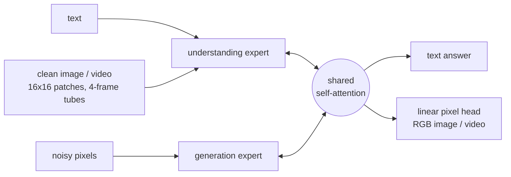
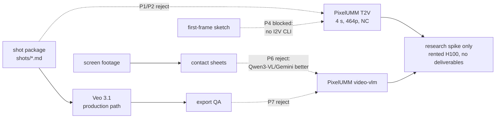

# PixelUMM × `video-production` — Research Dossier

Research dossier. Plan only — no OpenSpec change, no implementation.
Sources fetched 2026-10-04.

> Status: **research / pre-planning**. Explore-mode output.
> Goal: decide whether NVIDIA PixelUMM can serve `packages/video-production`
> (generation, I2V, editing, footage understanding, QA), and check every
> possibility against primary sources.
> Host = macOS arm64 M5 Pro 48 GB, no CUDA → no local run. Remote CUDA GPU required.
> Facts verified 2026-10-04 against primary sources unless marked
> **[inferred]** / **[unverified]**. No runtime test done (no GPU).

**Verdict (TL;DR):** do **not** integrate into the production pipeline.
Checkpoint licence = NVIDIA One-Way **Noncommercial** (research/evaluation
only) → blocks every showreel/marketing deliverable. Separately, each
capability is beaten by something we already use or a permissive alternative
(Veo, Wan2.2-TI2V-5B, Qwen3-VL-8B, Gemini). The most useful features for us
(I2V, video editing) are in the paper but **not in the public CLI**. Keep as a
**watch item**; optional ≤1 h research spike (§10).

---

## 1. Sources

| Kind | Location |
|---|---|
| Paper | arXiv `2609.38597` (2026-09-29) — "PixelUMM: Encoder-Free Unified Image and Video Understanding and Generation". Cong Wei, Xuanchi Ren, Bryan Chu, Weiming Ren, Huan Ling, Jiahui Huang, Laura Leal-Taixé, Sanja Fidler, Wenhu Chen, Zian Wang, Jay Zhangjie Wu. NVIDIA (Toronto AI Lab) + Univ. Waterloo |
| Project page | `https://nv-tlabs.github.io/PixelUMM/` |
| Code | `https://github.com/nv-tlabs/PixelUMM` — Apache-2.0, created 2026-09-04, pushed 2026-10-02, 89★, 2 open issues (PwC eval verify; "training dataset release?") |
| Weights | HF `nvidia/PixelUMM` — created 2026-10-01, not gated, pinned revision `81d810cf5ba9cd7796079cd40ae32c677e34cd44`, 32 likes |
| Weight licence | NVIDIA One-Way Noncommercial License (22 Mar 2022 PDF) |
| HF Spaces / ports | None. HF search "PixelUMM" → only `nvidia/PixelUMM`; 0 Spaces, no MLX/GGUF/quant ports |
| Third-party (rejected) | localmodelwatch.tsuchitsuchi.com "24 GB+ VRAM" claim — derived from Qwen3-8B 8.2B params, not 15.2B; site ran nothing. **Wrong**, ignore |
| Sibling dossiers | `docs/research/video-upscaling-dossier.md` (Wan / Cosmos3 / SoL-Refiner), `docs/research/inspatio-world-1.5-video-production.md` — shared remote-GPU runner design |

---

## 2. What it is

Encoder-free unified multimodal model (UMM). One decoder-only Transformer
reads **and** writes raw pixels. No VAE, no ViT vision encoder.

- Backbone: Qwen3-8B (rev `b968826d…`), Mixture-of-Transformers: separate
  **understanding** and **generation** experts, shared self-attention over
  text + clean pixels + noisy pixels. Code derived from BAGEL.
- Total params **15,199,672,064** (~15.2B; "8B MoT" in tables).
- Images → 16×16 pixel patches. Video → 4-frame × 16×16 tubelets (p16/t4,
  same compression as Wan2.2 VAE).
- Generation = iterative denoising, x-prediction pixel flow; samplers UniPC /
  DPM-Solver; CFG.
- Understanding = autoregressive text. Video: `sparse_mode` 1 FPS per-frame,
  `dense_mode` 4 FPS tubelets; 448² per-frame budget.
- Release output head = **linear** → faint 16-px grid / 4-frame tubelet
  "patch artifacts" in smooth regions (sky, walls), worse at CFG ≈6.
  Conv heads (PixelShuffle) fix it in ablation only — **not released**.



---

## 3. Capabilities — paper vs released

| Capability | Paper | Public `inference.py` | Released checkpoint |
|---|---|---|---|
| Text→image (T2I) | yes | `--task t2i` | F22-R05, F18-R01 |
| Text→video (T2V) | yes | `--task t2v` | F22-R05, F18-R01 (better T2V) |
| Image understanding | yes | `--task image-vlm` | F22-R05, F18-R01 |
| Video understanding | yes | `--task video-vlm` | **F22-R05 only** (F18 lacks video-und embedder) |
| Image→video (I2V) | F7 multi-task FT, 15K steps | **absent** | not identified **[unverified]** |
| Video editing / any-to-any | F7 multi-task FT | **absent** | not identified **[unverified]** |
| Image editing | F7 | **absent** | not identified |
| Audio | no | no | no |

- `inference.py` `--task choices=("t2i","t2v","image-vlm","video-vlm")` — checked.
- Model class has clean-image conditioning plumbing (`prepare_pixel_images`,
  `cfg_img_*` args in `generate_video`) → I2V wiring is possible in code but
  no entrypoint, no documented weights. **[inferred]**
- F7 started "from an intermediate Joint Stage 2 checkpoint"; release default
  F22-R05 = "after Stage 2 training, used in paper evaluation". F7 weights not
  named in README/CHECKPOINT.md.
- HF repo ships 4 checkpoints; README documents only 2:

| Checkpoint | Size | Documented | Role |
|---|---:|---|---|
| `S8-F22-R05` | 30.41 GB | yes | default, paper eval, all 4 tasks |
| `S8-F18-R01` | 30.39 GB | yes | +10K steps at 480p/720p short side, better T2V, no video-und |
| `S8-F19-R03` | 30.41 GB | **no** | unknown **[unverified]** |
| `S8-F21-R02` | 30.41 GB | **no** | unknown **[unverified]** — candidates for F7 I2V/edit weights; needs `.metadata` / config probe |

Format: PyTorch DCP shards (`model/.metadata` + `__N_0.distcp`) +
`__SAVE_COMPLETE`. DCP metadata = Python pickle → load trusted source only.

---

## 4. Inputs / outputs (released)

**T2V.**

| Param | F22 default | F18 example |
|---|---|---|
| Size | `--height 176 --width 320` (README) | `--height 464 --width 832` (480-tier landscape) |
| Frames / fps | 96 / 24 → **4.0 s** fixed training duration | 96 / 24 |
| Sampler | `unipc`, 35 steps | `unipc`, 35 steps, `--shift 10 --cfg 6` |
| Seed | `--seed` (default 0) | `--seed 4396` |
| Negative | `--negative-prompt-file experiments/s8_f22_r07/t2v_negative_prompt.txt` | same |
| Output | mp4, **no audio** | same |
| Guardrails | Cosmos-1.0-Guardrail on by default; `--no-guardrails` to skip | same |

Paper training gen res: T2V 256² (multi-task FT), Joint Stage 2 512² video.
Aspect ratios beyond these examples **[unverified]**.

```bash
python inference.py --checkpoint "$PIXELUMM_F18_CKPT" \
  --config experiments/s8_f18_r01/release.yaml --llm-path "$PIXELUMM_QWEN_DIR" \
  --task t2v --prompt "..." --height 464 --width 832 --frames 96 --fps 24 \
  --sampler unipc --steps 35 --shift 10 --cfg 6 --seed 4396 \
  --negative-prompt-file experiments/s8_f22_r07/t2v_negative_prompt.txt \
  --output out/f18-t2v.mp4
```

**T2I.** Default DPM-Solver 50 steps, shift 3.0, CFG 3.5; README example
256×256. Gen res trained 256²–512².

**Video-VLM.** `--task video-vlm --video clip.mp4 --prompt "..."` →
text file; `--max-new-tokens 256` default. Paper eval: `sparse_mode`, ≤96
frames.

**Batch.** `inference_batch.py` YAML prompt batch; new output dir per run;
**skips guardrails**.

---

## 5. Quality — published numbers (paper tables, PixelUMM vs peers)

**Video generation, VBench (GPT-enhanced prompts, †).**

| Model | Size | Quality | Semantic | Total |
|---|---|---:|---:|---:|
| Wan2.1-T2V | 14B | 85.59 | 76.11 | 83.69 |
| HunyuanVideo | 13B | 85.07 | 76.88 | 83.43 |
| Lance† (unified) | 3B MoT | 85.14 | 84.96 | 85.11 |
| TUNA (unified) | 1.5B+? | 84.32 | 83.04 | 84.06 |
| **PixelUMM†** | 8B MoT | 84.10 | 79.80 | **83.24** |

Dynamic degree 64.44; multi-objects 76.75; spatial relation 68.11.
→ ≈ 2025-era OSS T2V level, at 4 s / ≤832×464. Below Veo 3.1 class
**[inferred — Veo not on VBench table]**.

**Image generation.** GenEval 0.77 orig / 0.83 with prompt rewriter;
DPG-Bench 85.74. BAGEL† 0.88, TUNA 0.90.

**Video understanding.**

| Benchmark | PixelUMM | Qwen3-VL-8B | LLaVA-OV-2 8B |
|---|---:|---:|---:|
| MVBench | 70.53 | 69.00 | 66.20 |
| Video-MME (w/o sub) | 57.33 | 71.40 | 71.90 |
| LongVideoBench | 59.61 | 68.00 | 66.90 |
| LVBench | 40.41 | 58.00 | 55.50 |

**Image understanding (selected).** OCRBench 78.0 (Qwen3-VL 89.6); DocVQA
90.42 (Qwen3-VL 96.1); MMMU 41.67 (Qwen3-VL 69.6); CountBench 94.30 (best).

Known failure modes (project page): many similar entities merge/split, hands
and fine anatomy, implausible physics, patch-grid artifacts in flat regions.

---

## 6. Hardware & licence

**Runtime requirements (ENVIRONMENT.md, checked).**

- Linux **x86-64**, Python 3.12, NVIDIA driver for **CUDA 13**, CUDA 13.0
  dev toolkit (`nvcc`), C++20, FFmpeg shared libs (TorchCodec decode).
- FlashAttention built from source: `FLASH_ATTN_CUDA_ARCHS` 80 (A100/A6000),
  90 (H100/H200), 100 (B200). Runtime-only CUDA image cannot build it.
- Guardrails: separate venv + gated `nvidia/Cosmos-1.0-Guardrail` (request
  access, HF login).
- **No macOS / MPS / MLX path.** Host M5 Pro cannot run it.

**VRAM.** Not published. bf16 weights alone = 30.4 GB (shard sum) →
≥40 GB GPU minimum; 48 GB (A6000 / L40S) plausible for 320×176;
H100 80 GB safest for 832×464×96 **[inferred]**. Toy training: 7 GPUs ×
≥48 GiB, ~61 GB output checkpoint. Disk: 30 GB per checkpoint, 122 GB all four.

**Licence (checked against PDF).**

| Artifact | Licence | Effect |
|---|---|---|
| Source code | Apache-2.0 | free |
| `modeling/pixelumm/modeling_utils.py` | CC BY-NC 4.0 (DiT-derived) | NC even in code |
| Weights (all checkpoints) | NVIDIA One-Way Noncommercial | §3.3: "Work and any derivative works … only may be used … non-commercially … 'non-commercially' means for research or evaluation purposes only." NVIDIA may use derivatives commercially (one-way). §3.6 violation → immediate termination |
| Qwen3-8B base | Apache-2.0 | — |
| Cosmos-1.0-Guardrail | gated, own terms | — |

Licence text never mentions "outputs". Using generated clips in a company
showreel / marketing = commercial use of the Work → treat as **blocked**.
Not legal advice; confirm with legal before any non-research use.

---

## 7. Our pipeline (`packages/video-production`)

- `veo-showreel-production-kit` → shot package `shots/*.md` (7-layer prompt,
  negative, seed, aspect, resolution, first-frame sketch).
- `veo-generator` + `pi-veo` CLI (`src/bin/veo.ts`): Veo 3.1, clips ≤8 s,
  `Resolution = "720p" | "1080p" | "4k"` (default 1080p), native audio;
  `src/mux.ts` remux.
- `hyperframes-showreel`: step 1 footage sampling via ffmpeg contact sheets
  (`fps=1/2,scale=480:-2,tile=6x6`), human/agent notes usable moments +
  timecodes; Veo only as additive FX; export QA ±0.1 s.
- `footage-redaction`: crop / delogo / timed blur, contact-sheet verification.
- Sibling plan: draft → SoL-Refiner upscale; Wan2.2-TI2V-5B = best
  self-hosted draft (Apache-2.0, 24 GB, 720p@24).

---

## 8. Possibility matrix (every option checked)

| # | Possibility | Pipeline slot | Technically possible? | Beats current/alt? | Licence | Verdict |
|---|---|---|---|---|---|---|
| P1 | T2V shot generator (instead of / beside Veo) | `veo-generator` render | Yes — `--task t2v`, 4 s, ≤832×464, seed, no audio | No. Veo: 8 s, 1080p/4K, audio. Wan2.2-TI2V-5B: 720p, Apache, 24 GB | NC → blocked | **Reject** |
| P2 | Low-res draft → SoL-Refiner | upscale dossier draft slot | Yes in principle (464p draft → refiner) **[unverified]** | No. Wan2.2-TI2V-5B / Veo-fast 720p drafts are larger + permissive | NC + LTX-2 licence stack | **Reject** (dominated) |
| P3 | T2I storyboard sketches | kit first-frame sketch | Yes — `--task t2i`, 256–512² | No. GenEval 0.77; low res; existing sketch path works | NC (sketches internal-only = arguable research? no — production use) | **Reject** |
| P4 | I2V from first-frame sketch | `veo-generator` image-to-video | **No public path** — no CLI task, F7 weights unidentified | n/a | NC | **Blocked**; watch F19/F21 + repo |
| P5 | Video editing / any-to-any (restyle, fix a shot) | new step | **No public path** | n/a | NC | **Blocked**; watch |
| P6 | Footage logging: describe screen recordings, find usable moments | `hyperframes-showreel` step 1 | Yes — `--task video-vlm` (F22 only) | No. Video-MME 57.3 vs Qwen3-VL-8B 71.4 (same size, Apache-2.0); Gemini stronger; OCRBench 78 vs 89.6 matters for UI footage | NC; screen footage may hold client data → cloud GPU exposure | **Reject** — use Qwen3-VL / Gemini if wanted |
| P7 | VLM-as-judge for generated clips (prompt adherence, hallucinated text/logos) | QA gate after render | Yes — `video-vlm` | No. Weak OCR/MMMU vs Qwen3-VL | NC — internal QA arguably "evaluation" **[legal check]** | **Reject** |
| P8 | Fine-tune on own style/data | — | Toy trainer only, 7×48 GB GPUs; no full recipe/data | No | NC | **Reject** |
| P9 | Research spike / architecture watch | none | Yes, rented H100 | Learning value only | Research = permitted | **Optional** (§10) |



---

## 9. Pitfalls

- **Licence**: NC applies to weights + derivatives; one file of the code
  (`modeling_utils.py`) is CC BY-NC 4.0 → vendoring code is not clean
  Apache either.
- Third-party "24 GB VRAM" claim is wrong (based on 8B base, not 15.2B).
- 4 s fixed duration (96 frames) vs Veo 8 s shots → 2 clips per shot +
  seam; no FLF2V/continuation.
- No audio → always `mux.ts` remux.
- Linear-head patch grid in flat regions (UI backgrounds, skies) — exactly
  what dark-background FX layers expose.
- Guardrails on by default, gated model, extra venv; batch path skips them.
- DCP checkpoints = pickle metadata → trusted source only; don't point the
  loader at `model/` subdir.
- Flash-attn source build per GPU arch → pin image per rental GPU type.
- Never send client screen footage to a rented GPU without data agreement
  (P6).
- Very fresh release (weights 2026-10-01): APIs/paths may change; pin
  revision `81d810cf…`.

---

## 10. Open questions

1. What are `S8-F19-R03` and `S8-F21-R02`? Do they carry F7 I2V / editing
   weights? (Probe `.metadata` keys + any config in repo history.)
2. Will NVIDIA publish an I2V / edit entrypoint or conv-head checkpoint?
3. Real VRAM + latency per 4 s clip at 832×464 on H100 / L40S.
4. Does NVIDIA offer a commercial licence / NIM for PixelUMM? (None found.)
5. Legal: does internal QA (P7) count as "evaluation"?

---

## 11. Recommended next step

**Default: no integration.** Record as watch item; re-check on any of:
licence change, I2V/edit CLI release, >4 s or ≥720p T2V, conv-head weights.

Optional research spike (≤1 h rented H100 80 GB, research-only outputs,
nothing ships):

1. Docker CUDA 13 devel image; build flash-attn `FLASH_ATTN_CUDA_ARCHS=90`.
2. Download F18-R01 + F22-R05 (pinned rev) + Qwen3-8B tokenizer files;
   `check_checkpoint.py` CPU check.
3. Probe F19-R03 / F21-R02 with `check_checkpoint.py` (tensor names) → answer Q1.
4. T2V 3 existing `shots/*.md` prompts at 832×464, fixed seeds; record
   peak VRAM (`nvidia-smi`), wall time, artifacts.
5. Contact sheets side-by-side vs Wan2.2-TI2V-5B + Veo-fast 720p (reuse
   upscaling-dossier spike prompts).

If a future release clears licence + I2V → OpenSpec change (e.g.
`add-pixelumm-draft-provider`) on the shared `add-remote-gpu-runner`
(see InSpatio / upscaling dossiers).
