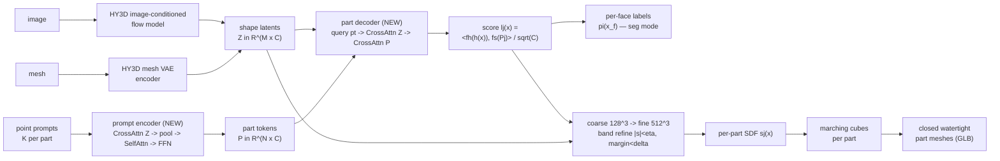
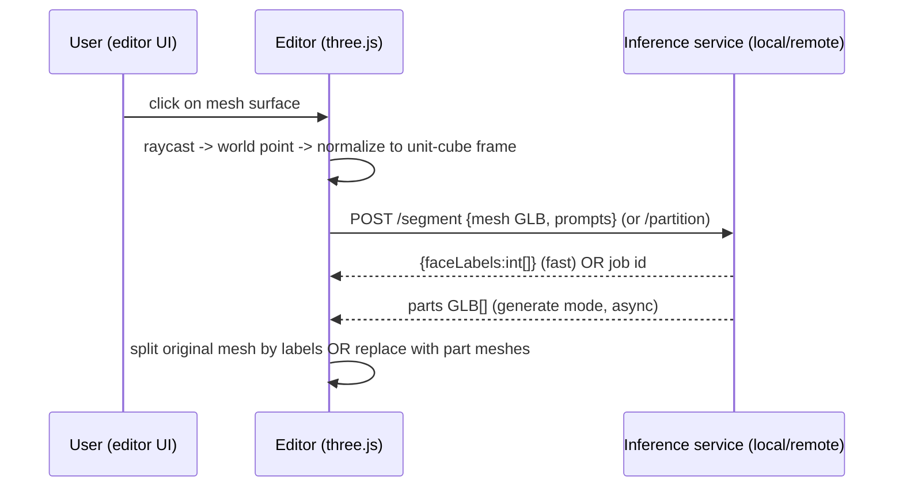

# Point2Part × 3D Mesh Editor — Research Dossier

> Status: **research / pre-planning** (explore-mode, no implementation).
> Goal: decide if/how Point2Part becomes a 3D mesh editor capability —
> split an object into parts from image or mesh, local vs remote.
> Date: 2026-10-04.

---

## 1. TL;DR / Recommendation

- **Point2Part is real and recent** (arXiv `2609.38180`, CMU, 2026-09-29). Point-prompted 3D part partition, one model, three tasks.
- **BLOCKER #1 — nothing runnable today.** GitHub repo = README + assets only. No weights, no inference code, no hosted demo. Release checklist all unchecked.
- **BLOCKER #2 — EU licence.** Main model finetunes Tencent Hunyuan3D 2.1. HY3D licence excludes EU/UK/South Korea. User in Hungary (EU) → no licensed use of HY3D-backed weights [H].
- **Two editor operations** map to two model modes: fast "split by segmentation" (~0.3 s, keeps geometry) and slower "generate closed parts" (~24 s mesh / ~38 s image, new untextured geometry) [H].
- **Recommended next step:** build editor plumbing now against a licence-clean stand-in (S2AM3D or Point-SAM + HoloPart) behind the same service contract, so Point2Part swaps in when weights land. Spike Point2Part later on 1 rented A100 + try MPS locally.
- **Watch item:** star/watch the repo; open a GitHub issue asking release ETA + licence + TripoSG-backbone checkpoint.

---

## 2. Identity

| Field | Value |
|---|---|
| Title | "Point2Part: Unified 3D Partitioning from Point Prompts" |
| arXiv | `2609.38180` — published 2026-09-29 |
| Authors | Hao-Tang Tsui, Yu-Rou Tuan, Xiaoxuan Ma, Nicolás Ugrinovic, Takaaki Shiratori, Kris Kitani |
| Affiliation | Carnegie Mellon University |
| Project page | `https://henrytsui000.github.io/Point2Part/` |
| Code | `https://github.com/henrytsui000/Point2Part` |
| Video | `https://youtu.be/9LVno48QliU` |

**GitHub repo state 2026-10-04** (VERIFIED via API):

| Field | Value |
|---|---|
| Created / pushed | 2026-09-29 / 2026-09-30 |
| Stars | 19 |
| Licence file | none |
| Contents | `README.md` + `assets/` + `docs/` only |
| README badge | "Code — Coming Soon" |
| Release checklist | all unchecked — pretrained checkpoints, Mesh→Parts inference, Image→Parts inference, Mesh segmentation inference, evaluation scripts, training code |
| HuggingFace (`point2part`) | 0 models, 0 spaces |

→ **BLOCKER #1: nothing runnable today. No weights, no inference code, no hosted demo.**

---

## 3. What Point2Part does

- Formulates part decomposition as a **joint PARTITION** of the whole shape:
  - parts **exclusive** — `vol(Ωi ∩ Ωj) = 0`
  - parts **exhaustive** — `∪Ωj = Ω`
  - no overlaps, no gaps, by construction (`argmax`). No suppression, no flood-fill, no overlap penalty.
- **Control:** one 3D point prompt per desired part (`K` points per part). Train `K ∈ 1..4`, inference default `K = 1`. Number + placement of prompts sets granularity (demo: arm 2/4/6 prompts → 2/4/6 parts).
- **One model, three tasks:**

| Task | Input | Output |
|---|---|---|
| (a) Image→Parts | image | closed part meshes |
| (b) Mesh→Parts | mesh | closed part meshes |
| (c) Mesh segmentation | mesh | per-face part labels (input geometry unchanged) |

- **Image input:** backbone generates whole mesh first; user places prompts on the generated **3D mesh** (not the 2D image) → back/occluded parts promptable.

---

## 4. Architecture

- **Backbone:** Hunyuan3D 2.1 (`HY3D-2.1`) pretrained latent shape model. Ablation also with TripoSG backbone (similar architecture).
- **Shape encoder** → shape latents `Z ∈ R^{M×C}`. Mesh input → HY3D mesh (VAE) encoder. Image input → HY3D image-conditioned flow model. Shared latent space.
- **SDF decoder:** `s(x) = f0(CrossAttn(φ(x), Z))`; whole mesh = marching cubes on the zero level set.
- **Prompt encoder (new):** each prompt point → positional embedding `φ`; CrossAttn to `Z`; attention-pool `K` points per part; SelfAttn across parts; FFN; `L` layers → part tokens `P ∈ R^{N×C}`.
- **Part decoder (new):** query point `x` → CrossAttn(`Z`) then CrossAttn(`P`), `L'` layers; score `ℓj(x) = <fh(h(x)), fs(Pj)> / √C` (Mask2Former-style dynamic classifier). One pass decodes all `N` parts; cost ≈ query count, grows only slightly with `N`.
- **Mesh extraction:** `π(x) = argmax_j ℓj(x)`; per-part field `sj(x) = s(x)` where `π = j`, else `|s(x)|`; marching cubes per part → closed watertight part meshes whose cut faces close each part.
- **Coarse-to-fine** (FlashVDM-style octree): coarse grid `128³` → fine `512³`; refine whole SDF in band `|s| < η` (`η = 0.05`); refine part SDF where top-2 score margin `< δ` (`δ = 0.2`).
- **Segmentation mode:** query decoder at each face centroid, assign label `π(x_f)`. Input mesh untouched.
- **Training:** HY3D-Bench public dataset (240K assets with part labels); `4 × A100 80GB`, 3 days; batch 256, 10 epochs; losses focal CE + Dice (`λ = 1`) + prompt-consistency (`λ = 0.5`); EMA 0.999. Eval benchmark PartObjaverse-Tiny (200 meshes).

---

## 5. Results (author numbers, PartObjaverse-Tiny; one A100)

> All numbers from the paper. **NOT independently reproduced.**

**Mesh→closed parts**

| Method | pCD ↓ | pF1@.05 ↑ | pen% ↓ | watertight | time |
|---|---:|---:|---:|---:|---:|
| **Ours** | **2.73** | **84.4** | **0.06** | **100%** | 24.4 s |
| X-Part | 4.53 | 73.4 | 3.05 | 90.8% | 147.2 s |
| CubePart | 4.71 | 72.5 | 2.09 | 100% | 29.1 s |
| HoloPart(+P3-SAM) | 5.29 | 73.9 | 1.01 | 32.6% | 99.1 s |

**Image→closed parts**

| Method | pCD ↓ | pF1@.05 ↑ | pen% ↓ | watertight | time |
|---|---:|---:|---:|---:|---:|
| **Ours** | **5.34** | **68.6** | **0.01** | **100%** | 37.8 s |
| OmniPart | 6.43 | 60.8 | 0.96 | 94.7% | 73.3 s |
| PartPacker | 8.11 | 54.2 | 1.25 | 86.0% | 26.7 s |
| PartCrafter | 12.75 | 29.6 | 2.45 | 70.5% | 84.8 s |

**Mesh→per-face labels**

| Method | mIoU ↑ | time |
|---|---:|---:|
| **Ours** | **69.80** | ~0.3 s |
| PartField | 69.10 | 1.1 s |
| P3-SAM | 54.66 | 19.1 s |
| S2AM3D | 50.43 | 0.3 s |
| PartSAM | 50.31 | 36.6 s |
| Point-SAM | 39.12 | 1.2 s |
| **Ours, 4 points/part** | **74.84** | 0.3 s |

- More prompt points per part help steeply up to 3, flat after; decoder cost independent of `K`.
- Whole-shape fidelity bounded by backbone (mesh→parts whole CD `1.56` vs X-Part `1.19` — slightly worse whole geometry, re-generated through the HY3D latent).
- Paper calls baseline comparison "proof-of-concept" (different training data/priors).
- **Limitations (paper):** extremely thin structures + large open surfaces (no enclosed volume) fail — partly backbone. Prompt near contact between two parts degrades result; placing on part body or 3 points fixes.

---

## 6. Licence

- Hunyuan3D 2.1 = "Tencent Hunyuan 3D 2.1 Community License": **"DOES NOT APPLY IN THE EUROPEAN UNION, UNITED KINGDOM AND SOUTH KOREA"**. Territory = worldwide excluding EU, UK, South Korea. Same clause in Hunyuan3D-Part licence (2025-09-23).
- Point2Part main model finetunes HY3D-2.1 → released weights likely inherit Tencent licence **[H]**.
- User/company sits in **Hungary (EU)** → **BLOCKER #2: no licensed use from EU territory for HY3D-backed weights [H — confirm when authors publish licence].**
- **Escape hatch:** TripoSG backbone (VAST-AI/TripoSG, MIT) used in paper ablation. If authors release a TripoSG variant → licence-clean path **[H]**. Action: ask authors (GitHub issue) for TripoSG checkpoint + licence.

---

## 7. Host compute

| Fact | Detail |
|---|---|
| Host | macOS Darwin arm64, Apple M5 Pro, 48 GiB unified memory |
| GPU | no NVIDIA / no CUDA |
| Paper runtime | measured on A100 only; VRAM not published |
| Local run on MPS | unverified **[H]** |
| Seg path cost | encoder + small decoder → plausibly light **[H]** |
| Gen path cost | 512³ fine grid + per-part marching cubes → heavier **[H]** |
| CUDA-only deps | expected custom kernels in HY3D texture stage **[H]**; shape-only path may be pure PyTorch **[H]** |
| Repo precedent | `docs/research/mira-scene-deck3d.md` hit same blocker (Linux+NVIDIA only, macOS host no local run) |

---

## 8. Runnable alternatives TODAY

Verified via GitHub / HF API 2026-10-04.

| Project | Task | Code licence | Weights licence | Stars | Hosted demo |
|---|---|---|---|---:|---|
| Tencent-Hunyuan/Hunyuan3D-Part (P3-SAM seg + X-Part gen) | seg + gen | Tencent community (EU EXCLUDED) | Tencent community (EU EXCLUDED) | 544 | HF Space `tencent/Hunyuan3D-Part` RUNNING (zero-a10g, gradio) |
| nv-tlabs/PartField | prompt-free feature-field clustering | NVIDIA (non-commercial) | `mikaelaangel/partfield-ckpt` | 466 | — (CUDA 12.4) |
| sumuru789/S2AM3D | promptable, scale-controllable seg (0.3 s) | MIT | `HITshan/S2AM3D_Model` MIT | 542 | — (CUDA 12.4) |
| zyc00/Point-SAM | click-prompt point-cloud seg (mesh via sampling + label propagation) | MIT | `yuchen0187/Point-SAM` apache-2.0 | 471 | HF Space BUILD_ERROR; local gradio `python app.py`; needs CUDA ext (`torkit3d`, apex) |
| Pointcept/SAMPart3D | seg | MIT | — | 577 | — |
| czvvd/PartSAM | seg | licence unasserted | — | 141 | — |
| VAST-AI-Research/HoloPart | mesh + seg → complete closed parts | MIT | `VAST-AI/HoloPart` MIT | 668 | HF Space RUNNING (zero-a10g) |
| wgsxm/PartCrafter | image→parts (TripoSG-based) | MIT | MIT | 2485 | Space `alexnasa/PartCrafter` PAUSED; ≥8 GB VRAM CUDA |
| NVlabs/PartPacker | image→parts | NVIDIA ("other") | NVIDIA ("other") | — | Space `nvidia/PartPacker` PAUSED; ~10 GB VRAM fp16 |
| VAST-AI-Research/TripoSG | shape backbone | MIT | MIT | 1814 | — |

- Community fix: X-Part fp16 + staged CPU offload fits 16 GB GPU (commit `e93f301` in `Tencent-Hunyuan/Hunyuan3D-2`).
- **Licence-clean interim stack [H, quality per author table]:** S2AM3D or Point-SAM (promptable face labels) → split mesh by labels in editor → optional HoloPart for closed/amodal part completion. All MIT/Apache. Quality below Point2Part (seg mIoU 50 vs 70) and overlaps possible (independent masks).

---

## 9. Integration design for a 3D mesh editor

All **[H]** unless noted. Two editor operations map to two model modes:

| Operation | Model mode | Output | Cost | Keeps |
|---|---|---|---|---|
| "Split by segmentation" | mesh→per-face labels | submeshes by label | ~0.3 s A100 (author-claimed) | original geometry, UVs, materials (input geometry unchanged per paper) |
| "Generate closed parts" | mesh→closed parts / image→closed parts | `N` watertight GLB parts with cut faces | ~24 s mesh / ~38 s image (A100) | new geometry, untextured — loses UV/material [H: inferred from SDF→marching-cubes extraction; paper does not mention texture] |

- **Prompt UX:** three.js raycast click on mesh → world point → transform into model's normalized unit-cube frame (keep normalization matrix to invert outputs) → prompt list `[{partId, points[K]}]`; recommend 1–3 points per part; avoid clicks at part contacts.
- **Service contract:** Python inference service (FastAPI or gradio) wrapping model. Endpoints e.g. `POST /segment {mesh GLB, prompts} → {faceLabels:int[]}` and `POST /partition {mesh|image, prompts} → job id → parts GLB[]`. Client never runs model.
- **Repo fit:** `packages/deck3d` already has a three.js runtime (`packages/deck3d/src/runtime/props.ts` uses GLB props; prop contract self-contained GLB ≤8 MiB, sha256, base64 per mira dossier). No dedicated mesh editor package exists in repo yet → a new plugin/package would host the editor; follow `dashboard-plugin-scaffold` skill + `add-new-plugin-package-checklist`.

### Deployment options

| Option | Shape | Notes |
|---|---|---|
| A. Local Mac (MPS) | model runs on host | only if MPS port works; spike measures it. Lowest latency. Licence territory unchanged (still EU) |
| B. Self-hosted remote GPU | owned box via SSH tunnel / rented A100/L40S/4090 on RunPod/Lambda/Modal | recommended default once weights exist; licence territory still governs user location [H] |
| C. HF Space (ZeroGPU) | via `gradio_client` | only if authors publish one; quota + queue; good for evaluation, not production |

---

## 10. Decision / next steps

- **Today:** Point2Part NOT usable (no code/weights). Watch repo (star/watch releases).
- **Two blockers:** (1) release, (2) EU licence via HY3D backbone.
- **Actions:**
  1. Open GitHub issue asking release ETA + licence + TripoSG-backbone checkpoint.
  2. Build editor plumbing against a licence-clean stand-in now (S2AM3D or Point-SAM for segment endpoint; HoloPart for closed parts) behind the same service contract, so Point2Part swaps in later.
  3. Spike when weights land: 1 rented A100 + try MPS locally; measure VRAM, latency seg/gen, mIoU on 5 own meshes, texture behaviour, licence text.

---

## 11. Open questions

- Release date?
- Licence of released weights (HY3D-inherited vs own)?
- MPS feasibility on Apple M5 Pro?
- VRAM footprint (seg vs gen)?
- Texture preservation in generate mode?
- Which editor host — `deck3d` vs a new plugin/package?

---

## 12. Sources

- Paper abs: `https://arxiv.org/abs/2609.38180` (HTML `https://arxiv.org/html/2609.38180`)
- Project page: `https://henrytsui000.github.io/Point2Part/`
- Code: `https://github.com/henrytsui000/Point2Part` (README "Coming Soon")
- Video: `https://youtu.be/9LVno48QliU`
- Hunyuan3D 2.1 licence: `https://github.com/Tencent-Hunyuan/Hunyuan3D-2.1/blob/main/LICENSE`
- Hunyuan3D-Part: `https://github.com/Tencent-Hunyuan/Hunyuan3D-Part` , `https://huggingface.co/spaces/tencent/Hunyuan3D-Part`
- TripoSG: `https://github.com/VAST-AI-Research/TripoSG` ; HoloPart: `https://github.com/VAST-AI-Research/HoloPart`
- S2AM3D: `https://github.com/sumuru789/S2AM3D`
- Point-SAM: `https://github.com/zyc00/Point-SAM`
- PartField: `https://github.com/nv-tlabs/PartField`
- PartCrafter: `https://github.com/wgsxm/PartCrafter`
- PartPacker: `https://github.com/NVlabs/PartPacker`
- PartSAM: `https://github.com/czvvd/PartSAM`
- SAMPart3D: `https://github.com/Pointcept/SAMPart3D`
