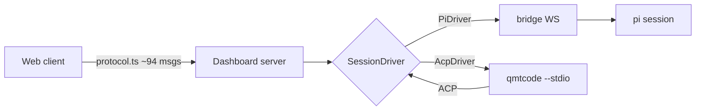
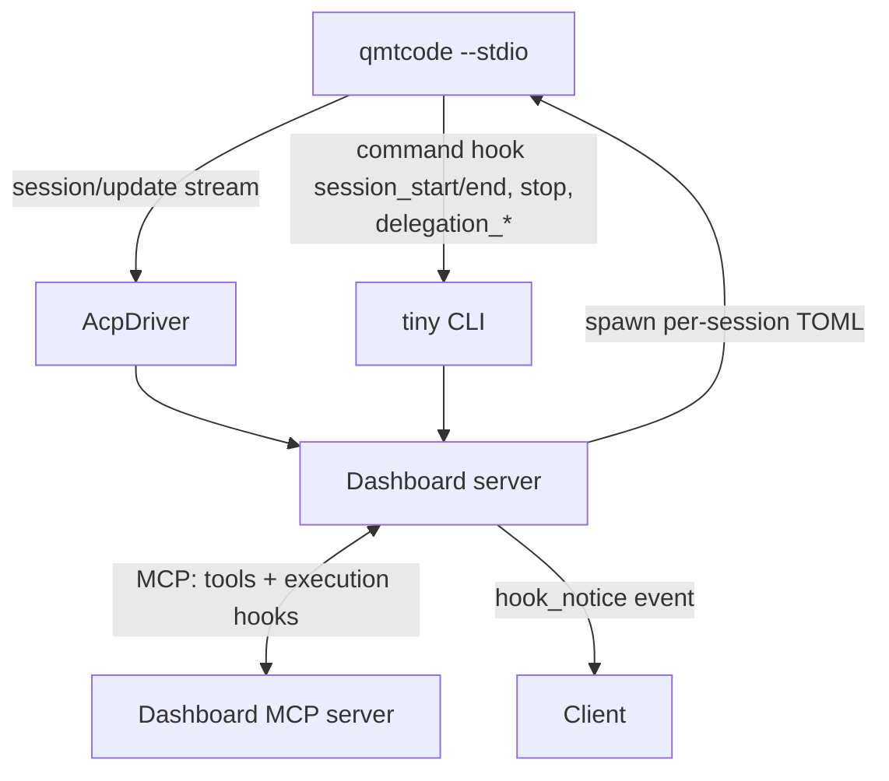

# query.mt × pi-dashboard — Agent Backend Research Dossier

> Status: **research / pre-planning** (explore mode output, no implementation).
> Question: can query.mt (`querymt`) replace pi agent under the dashboard?
> Date: 2026-09-24.

Sources:
- https://query.mt
- https://github.com/querymt/querymt
- https://docs.query.mt/latest/agent/
- https://github.com/querymt/querymt/blob/main/docs/docs/agent/hooks.md

---

## 1. TL;DR

- querymt = Rust agent runtime. Entry `qmtcode --config agent.toml`. One TOML defines agent: provider, model, tools, scheduling, memory, mesh.
- Talks ACP (Agent Client Protocol) over `--stdio`. Or runs own dashboard via `--dashboard` (WebSocket API).
- pi-dashboard protocol layer = loose coupling. Bridge extension = tight coupling to pi `ExtensionAPI`.
- **Verdict: OPTION B** — second backend, not replacement. Server spawns `qmtcode --stdio`, translate ACP → dashboard protocol. pi stays full-fat; querymt adds peer runtime.
- Full swap (Option A) costs: rewrite every plugin off `ExtensionAPI` onto querymt hooks. querymt has NO in-process JS/TS extension API.
- Provider-only (Option C): pi keeps all UX, querymt only supplies LLM access. Small, low value.

---

## 2. What querymt is

| Property | Value |
|---|---|
| Language | Rust |
| Entry point | `qmtcode --config agent.toml` |
| Config unit | One TOML = whole agent (provider, model, tools, scheduling, memory, mesh) |
| Providers | 17+, via WASM (Extism, OCI-pulled) or native plugins |
| Mode `--stdio` | ACP stdio server |
| Mode `--dashboard` | Own web dashboard + WebSocket API (schedules, knowledge store, quorum multi-agent, mesh) |
| Crate | `querymt-agent` v0.3 → early maturity |
| Extension points | config-level hooks (out-of-process JSON stdin/stdout, or `mcp_tool` handler) + compiled Rust middleware (in-process) |

Gap: **no in-process JS/TS extension API** equivalent to pi `ExtensionAPI`.

---

## 3. Dashboard coupling to pi (measured in repo)

Protocol layer is the seam. Server + client speak own protocol `packages/shared/src/protocol.ts` (~94 message types). Few pi type imports → loose coupling.

Bridge `packages/extension/src/` (78 files) = tight. `ExtensionAPI` usage counts:

| API | Calls |
|---|---:|
| `pi.events` | 84 |
| `pi.sendUserMessage` | 28 |
| `pi.on` | 14 |
| `pi.registerTool` | 8 |
| `pi.sendMessage` | 6 |
| `pi.appendEntry` | 6 |
| `pi.registerCommand` | 4 |
| `pi.setModel` | 3 |
| `pi.exec` | 2 |

~29 source files across plugins built on `ExtensionAPI` (flows, subagents, kb, roles, goal, extension UI).

`pi.on` events used repo-wide:

| Event | Count |
|---|---:|
| tool_call | 6 |
| session_shutdown | 4 |
| tool_result | 3 |
| session_start | 3 |
| message_end | 2 |
| context | 2 |
| before_agent_start | 2 |
| turn_start | 1 |
| turn_end | 1 |
| tool_execution_end | 1 |
| session_info_changed | 1 |
| project_trust | 1 |
| model_select | 1 |
| before_provider_request | 1 |

---

## 4. Options

| Option | Meaning | Cost | Keeps |
|---|---|---|---|
| A Full swap | Drop pi. querymt only runtime. | Huge — every plugin rewritten against out-of-process hooks | chat/tools/providers |
| B Second backend (recommended) | Server spawns `qmtcode --stdio`; ACP→protocol translator. | Medium | pi full-fat; querymt core UX |
| C Provider layer only | pi stays; querymt only LLM access. | Small, low value | Everything |

---

## 5. Option B mapping (ACP → dashboard protocol)

| ACP shape | Dashboard effect |
|---|---|
| `session/new` | session register |
| `session/prompt` | ← send prompt |
| `session/update` `agent_message_chunk` | message streaming events |
| `session/update` `tool_call` / `tool_call_update` | tool execution events |
| `session/update` `plan` | plan/todo (maybe) |
| `session/request_permission` | interactive dialog |
| `session/cancel` | ← abort |

New `SessionDriver` seam in server. `PiDriver` = existing bridge WS. `AcpDriver` = spawn `qmtcode --stdio`.

- Works: chat streaming, tool cards, abort, permissions, spawn in cwd, model pick if exposed via ACP.
- Lost/degraded: flows, subagents, `/commands`, extension UI panels, kb/memory/roles plugins, session tree/fork, `appendEntry` features, context-budget.
- Bonus: `AcpDriver` generic → also Claude Code / Gemini CLI via ACP adapters.

---

## 6. querymt hooks (from hooks.md)

- Enabled `[agent.hooks] enabled = true` in agent config/profile only. Disabled by default.
- No `~/.qmt/hooks` / `.qmt/hooks` auto-discovery yet.
- Handler type `command`: process per event, JSON stdin → JSON stdout.
  - Exit 0 → parse stdout (empty = no-op).
  - Exit 2 → block, stderr reason.
  - other exit / timeout → infra error.
  - Fields: `matcher` (regex), `timeout_sec`, `id`, `status_message`, `additional_context_limit` (default ~2500 tokens).
- Handler type `mcp_tool`: calls tool on already-connected MCP server.
  - `server` + `tool`; input templates only exact `$event.<field>`.
  - Only execution-scoped events: `pre_tool_use`, `permission_request`, `post_tool_use`, `context`.
  - Bypasses model tool loop; no recursive tool hooks.
- Common input: `session_id`, `turn_id`, `transcript_path`, `cwd`, `hook_event_name`, `model`, `permission_mode` (`default`=Build, `plan`=Plan, `accept_edits`=Review; captured at turn start).
- Events: `session_start`, `user_prompt_submit`, `pre_tool_use`, `permission_request`, `post_tool_use`, `context`, `pre_compaction`, `post_compaction`, `pre_delegation`, `delegation_start`, `post_delegation`, `delegation_failure`, `stop`, `session_end`.
- Handlers run in config order; transforms chain; pre-op block sticky.
- Invalid output → durable `hook_notice` event (`event_name`, `message`, `is_error`) — dashboards expected to surface.
- `stop` `continue:false` → one extra LLM step, max one per turn.
- Limitation: `additional_context` injected only for `stop`, `post_compaction`, `delegation_start`, `post_delegation`, `delegation_failure`.
- Schemas: `crates/agent/src/hooks/schema/generated/*.command.{input,output}.schema.json`.

---

## 7. pi event → qmt hook fit

| pi event | qmt hook | Fit |
|---|---|---|
| tool_call | pre_tool_use | ✅ |
| tool_result | post_tool_use | ✅ |
| context | context | ✅ |
| session_start | session_start | ✅ |
| session_shutdown | session_end (observe) | ✅ |
| before_agent_start | user_prompt_submit | ≈ |
| permission dialogs | permission_request | ✅ |
| compaction | pre_compaction / post_compaction | ✅ (richer: custom summary) |
| subagent lifecycle | pre_delegation / delegation_start / post_delegation / delegation_failure | ✅ |
| turn_start / turn_end | only `stop` | ⚠️ |
| message_end, tool_execution_end, streaming | none | ❌ |
| model_select, session_info_changed, before_provider_request | none | ❌ |

No equivalent: `pi.sendUserMessage` (mid-session injection), `pi.registerTool` (→ use MCP instead), `pi.registerCommand`, `pi.appendEntry`, `pi.setModel`, extension UI, `pi.events` bus.

---

## 8. Implications

1. Hooks = control points, not telemetry. Live stream must come via ACP `session/update` or querymt dashboard WS.
2. Policy plugins port well. `mcp_tool` handler = key: dashboard-owned long-lived MCP server both provides tools AND receives execution-scoped hooks (stateful, no per-event spawn). Command hooks (`session_start`/`session_end`, `stop`, `delegation_*`) → tiny CLI → POST to dashboard server.
3. `hook_notice` → dashboard should render.
4. Lost: mid-session message injection (flows/goal/automation rely on it), slash commands, UI, event bus → need querymt dashboard WS API or Rust middleware.
5. Gaps: `additional_context` missing on `user_prompt_submit`/`session_start` → kb/memory injection must use `context` hook. Max one `stop` continuation/turn → goal-loop plugin cannot be hook-based.

---

## 9. Risks / open questions

- Session persistence/resume: pi JSONL read by dashboard; querymt `replay_session`/export via ACP unknown.
- `rpc-keeper` sidecar (`packages/server/src/rpc-keeper/`) + spawn-process assume pi; ACP keeper = new code.
- querymt v0.3 ACP coverage may be partial — verify which `session/update` kinds emitted.
- Overlap with querymt own dashboard/scheduler/mesh — mirror or ignore?
- ACP client control surface (mode/model switch, cancel, load session) vs need for querymt dashboard WS API.
- Can dashboard inject its MCP server into querymt config at spawn? Likely yes via generated per-session TOML.

---

## 10. Next steps

- Spike: spawn `qmtcode --stdio` with generated TOML (stub `mcp_tool` hook + one command hook), record ACP + hook traffic, diff vs mapping table.
- Read querymt dashboard WebSocket API for prompt injection / streaming coverage.
