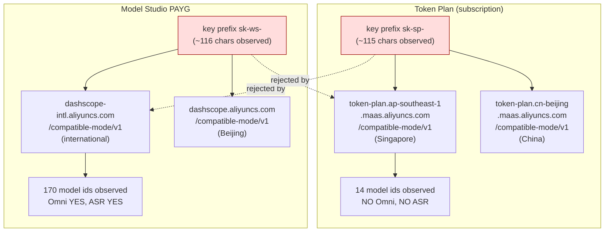

# Qwen Cloud Models, Audio/Omni Capabilities, and Measured Transcription Behaviour

> Comprehensive session record. Everything learned in one investigation about Alibaba's
> Qwen cloud-model lineup on DashScope / Model Studio: which audio and omni models exist,
> which vendor product each one is reachable through, whether pi can carry their audio,
> and what happened when `qwen3.8-omni-flash` was actually asked to transcribe and
> translate a real Hungarian meeting from audio. Nothing omitted: model ids, limits,
> pricing, host URLs, credential prefixes, the verbatim probe and extraction commands,
> the call shape, every measured token count, the silent-truncation defect, the cost
> extrapolation, the honest caveats against Soniox, and the open questions.
>
> **A note on evidence.** Claims are labelled by source. *Measured in-session* means the
> number came from a live command or API response recorded during this investigation.
> *Provider-published* means Alibaba (or another vendor) states it on its own page and it
> was **not** independently verified. *Observed catalogue* means the model id was seen in a
> live list response. Where a claim is an open question it is stated as one, not filled in.

- **Date context:** the machine clock read **September 2026**; the Qwen3.8-Omni-Flash launch date is **2026-09-18** and the measured transcription experiment ran around **2026-09-21**. Model facts were pulled from live API responses and vendor pages during the session, not from model memory.
- **Goal (verbatim intent):** understand whether a multimodal Qwen cloud model can transcribe **and** translate a long Hungarian meeting recording directly from audio — replacing or augmenting the existing ASR pipeline — and record everything discovered about the Qwen audio/omni family while doing it.
- **Downstream consequence:** the measured defect in §4 directly motivated the `add-srt-translation-pass` change and its `pi-translate-srt` binary (§7): keep the ASR backend as the exhaustive timing + diarization spine, translate only its text.

---

## 1. Model landscape

### 1.1 Qwen3.8-Omni-Flash exists (correction)

An in-session assumption that the Qwen Omni line stopped at **3.5-Omni** was **wrong**. **Qwen3.8-Omni-Flash exists**, launched **2026-09-18**, built on the **Qwen3.8-Flash-Next** architecture. Recorded here as an explicit correction (§6).

Two model ids belong to the family:

- `qwen3.8-omni-flash`
- `qwen3.8-omni-flash-realtime`

### 1.2 `qwen3.8-omni-flash` — capabilities and limits

**Modalities (observed on the vendor model card): text, image, audio, video in → text out.** There is **no speech output**. It is an understanding model, not a speech generator.

| Limit | Value |
|---|---|
| Max input | 991K |
| Max output | 131K |
| Context | 1M |
| Max reasoning | 262K |
| Throughput | 2M TPM |
| Rate | 30K RPM |

**Supported features:** prefix completion / partial mode, function calling, context cache, structured outputs, batches, web search, fine-tuning.

**Protocols:** both **DashScope** and the **OpenAI-compatible** protocol are supported.

**Audio specifics:** two-channel and four-channel **spatial audio understanding** are supported. Alibaba recommends the companion open-source **`Qwen-MM-Plugins`** package for use inside agent frameworks.

### 1.3 `qwen3.8-livetranslate-flash-realtime` — the purpose-built live-translation model

This is a **distinct model from Omni**, aimed at simultaneous interpretation rather than general understanding:

- **Modalities: audio + image in → audio + text out.**
- Max input **49K**, max output **4K**, context **53K**, **100K TPM**, **10 RPM**.
- Understands **60 languages** and **speaks 29**.
- Described as a multilingual **simultaneous audio and video interpretation** model offering **both offline and real-time** translation.

Because it is built for interpretation, it is the natural candidate for the untested offline-mode comparison in §6 — but that was not exercised.

### 1.4 Provider-published claims for `qwen3.8-omni-flash`

> **All numbers in this subsection are provider-published (secondary sources), not independently verified.** They are reproduced because they were encountered in-session and are relevant to model selection, but they carry the vendor's provenance and should be re-tested before being used to justify a decision.

- **>25%** average improvement over **Qwen3.5-Omni-Plus** across **29 evaluations**.
- **Audio input price down >98%**, **audio-visual input down >93%**.
- **WildClawBench-MM +36.5**
- **AgenticVBench +22.3**
- **UniClawBench 69.6**
- **LongAudioSpan +8.3**
- **OmniVideoBench +9.6**
- **OmniCap-IF CSR / ISR +8.5 / +14.1**
- **AliMeeting DER 88.11 → 3.35** and **cpWER 89.61 → 17.18** — i.e. the vendor claims a dramatic diarization-error-rate and concatenated-permutation-WER improvement on the AliMeeting corpus.
- The **Qwen-Live Harness** was open-sourced alongside.

### 1.5 Text pricing (measured / vendor-quoted)

`qwen3.8-omni-flash` text pricing is approximately **$0.15 input / $0.47 output per 1M tokens**. This figure is consistent with the token counts measured in §4.

### 1.6 The previous generation — Qwen3.5-Omni

The earlier-generation **Qwen3.5-Omni** natively covered **74 languages, including Hungarian**, plus **39 dialects**. Whether **3.8-Omni** retains Hungarian coverage **was not confirmed** and is recorded as an open question (§6).

---

## 2. Access topology — two products, disjoint credentials

This is the central practical finding of the investigation. **Token Plan** (a subscription product) and **Model Studio PAYG** (pay-as-you-go) are **separate Alibaba products with disjoint credentials and disjoint catalogues**. A key issued by one is rejected by the other.



| | Token Plan (subscription) | Model Studio PAYG |
|---|---|---|
| Key prefix | `sk-sp-` (~115 chars observed) | `sk-ws-` (~116 chars observed) |
| International host | `https://token-plan.ap-southeast-1.maas.aliyuncs.com/compatible-mode/v1` (Singapore) | `https://dashscope-intl.aliyuncs.com/compatible-mode/v1` |
| China host | `https://token-plan.cn-beijing.maas.aliyuncs.com/compatible-mode/v1` (Beijing) | `https://dashscope.aliyuncs.com/compatible-mode/v1` (Beijing) |
| Model count observed | **14** | **170** |
| Omni available? | **NO** | **YES** |

### 2.1 How the Token Plan hosts were found

The Token Plan hostnames were not documented anywhere the session could find them — they were recovered by **grepping the pi bundle**. This is worth recording because it means host discovery may need to be repeated if the bundle changes.

### 2.2 Keys are not interchangeable (verified live)

Presenting an `sk-sp-` **Token Plan key to `dashscope-intl`** returns:

```json
{"error":{"code":"invalid_api_key"}}
```

This was verified live, not inferred. The two credential systems must be treated as independent.

### 2.3 Token Plan Singapore catalogue — complete (14 ids)

The full observed set:

```
qwen3.8-max
qwen3.8-flash
qwen3.7-max
qwen3.7-plus
qwen3.6-flash
glm-5.2
glm-5.3
deepseek-v4-pro
deepseek-v4-flash-0731
deepseek-v4.1-flash
wan2.7-image
wan2.7-image-pro
qwen-audio-3.0-tts-plus
qwen-audio-3.0-realtime-plus
```

Notable: the subscription plan **bundles third-party models** (`glm-*`, `deepseek-v4*`) and **two audio models** (`qwen-audio-3.0-tts-plus`, `qwen-audio-3.0-realtime-plus`) — but it has **no ASR model and no Omni model**. So the subscription cannot serve the transcription use case at all; a PAYG key is mandatory for it.

### 2.4 PAYG catalogue — the audio / omni subset observed

```
qwen3.8-omni-flash
qwen3-omni-flash                (+ dated snapshots and -realtime)
qwen3.5-omni-plus / -flash      (+ -realtime)
qwen-omni-turbo
qwen3-omni-30b-a3b-captioner
qwen-audio-3.0-asr-flash
qwen-audio-3.1-realtime-plus
qwen3-asr-flash-2026-02-10
qwen3-asr-flash-realtime        (+ snapshots)
```

### 2.5 PAYG catalogue — the Qwen 3.8 family observed

```
qwen3.8-omni-flash
qwen3.8-livetranslate-flash-realtime
qwen3.8-max
qwen3.8-max-0902
qwen3.8-flash
qwen3.8-27b
qwen3.8-2.4t-a95b
```

### 2.6 The catalogue probe command (verbatim)

```bash
curl -s https://dashscope-intl.aliyuncs.com/compatible-mode/v1/models \
  -H "Authorization: Bearer $KEY"
```

### 2.7 OpenRouter does not carry Omni (claim refuted)

An earlier claim that `qwen3.8-omni-flash` might be reachable via **OpenRouter** is **FALSE**. The live OpenRouter catalogue contains **zero** `omni` model ids. Its only audio-capable entries at the time were:

```
nvidia/nemotron-3-nano-omni-30b-a3b-reasoning:free
openai/gpt-audio
openai/gpt-audio-mini
```

---

## 3. pi integration limits

### 3.1 pi cannot carry audio in its chat loop

pi's model input type is a **closed union**:

```ts
input: ("text" | "image")[]
```

See `docs/custom-provider.md` (around line 726) and `docs/models.md` (around line 207, which states input is `["text"]` or `["text","image"]`).

Therefore **pi's chat loop cannot carry audio or video regardless of what the model supports**. This is a limitation of pi's **message pipeline**, **not** of the account or the key: audio works fine from a plain script against the same endpoint with the same key. The model supports audio; pi's transport does not express it.

### 3.2 pi ships no built-in `dashscope` provider

`dist/core/model-resolver.js` registers only:

```
qwen-token-plan
qwen-token-plan-cn
qwen-token-plan-individual
```

There is **no built-in `dashscope` provider**, so a PAYG key needs a **custom provider entry** in pi's config.

### 3.3 Working configuration written in-session

`~/.pi/agent/auth.json`:

```json
{
  "qwen-token-plan": { "type": "api_key", "key": "sk-sp-…" },
  "dashscope":       { "type": "api_key", "key": "sk-ws-…" }
}
```

`~/.pi/agent/models.json`: a `dashscope` provider pointing at `https://dashscope-intl.aliyuncs.com/compatible-mode/v1`, with `api: "openai-completions"` and models `qwen3.8-omni-flash` and `qwen3.8-max`. The file was re-`chmod 0600` because it holds a secret.

### 3.4 Doc note — do not set `thinkingTokenBudgetField` on DashScope Qwen models

pi's own documentation warns that setting `thinkingTokenBudgetField` on DashScope Qwen models **conflicts with `reasoning_effort`**, and the API rejects the pair. Leave it unset.

### 3.5 Key files on disk (no key material recorded)

| File | Product |
|---|---|
| `/Users/robson/qwen.key` | Token Plan |
| `/Users/robson/qwen-payasgo.key` | PAYG Model Studio |

**Key material is deliberately not copied into this document.** Keys are referred to by prefix (`sk-sp-`, `sk-ws-`) and file path only.

---

## 4. The measured experiment

The core question: **can a multimodal model transcribe and translate a meeting directly from audio?**

### 4.1 Source material

- Source audio: `~/Movies/2026-08-07 10-01-27.mp3`, a **~50-minute Hungarian technical meeting**.
- Reference transcript: **1325 Soniox cues** (prior Soniox SRT used as ground truth and coverage baseline).

### 4.2 Audio extraction (verbatim)

A 5-minute slice was cut starting at 600 s:

```bash
ffmpeg -v error -y \
  -ss 600 -t 300 \
  -i "~/Movies/2026-08-07 10-01-27.mp3" \
  -ac 1 -ar 16000 -b:a 32k \
  /tmp/omnitest/slice.mp3
```

Result: **1,200,608 bytes**, which base64-encodes to **1,600,812 characters**.

### 4.3 The call (verbatim endpoint and shape)

```http
POST https://dashscope-intl.aliyuncs.com/compatible-mode/v1/chat/completions
Authorization: Bearer $KEY
Content-Type: application/json

{
  "model": "qwen3.8-omni-flash",
  "messages": [
    {
      "role": "user",
      "content": [
        { "type": "input_audio",
          "input_audio": { "data": "data:audio/mp3;base64,<…>", "format": "mp3" } },
        { "type": "text",
          "text": "Transcribe the Hungarian speech, then give an English translation. Label speakers [S1]/[S2] and prefix each line with [mm:ss] timestamps." }
      ]
    }
  ]
}
```

A **single user message** carried the `input_audio` part plus the text instruction. **Non-streaming succeeded** — there was no need for `stream: true`. The instruction asked for: Hungarian transcription, English translation, `[S1]`/`[S2]` speaker labels, and `[mm:ss]` timestamps.

### 4.4 Results — throughput and token accounting

- **Elapsed 31.9 s** for **300 s** of audio ≈ **9.4× realtime**.
- Usage (measured):

| Field | Value |
|---|---|
| `prompt_tokens` | 2204 |
| ↳ `audio_tokens` | 2102 |
| ↳ `text_tokens` | 102 |
| `completion_tokens` | 2624 |
| ↳ `reasoning_tokens` | 623 |
| ↳ `text_tokens` | 2001 |
| total | 4828 |

- **Audio consumes ≈ 7 tokens per second** (2102 audio tokens ÷ 300 s).

### 4.5 The defect — silent truncation

**This is the most important result.** The output covered only **0–210 s of the 300 s clip** and ended mid-sentence ("So the extraction…").

- **No error was raised.**
- `finish_reason` was **normal**.
- Only **2,624 of 131K** output tokens were used — nowhere near the output ceiling.
- Output word count: **583 Hungarian words** vs Soniox's **687** → **−15%**.

The model simply stopped a third of the way through and reported success. Nothing in the response signals the omission.

### 4.6 Timestamps are unusable for subtitles

- Only **8 distinct timestamp marks across 5 minutes**.
- Inter-mark gaps ranged **10–57 s**, and the marks **drift** relative to the audio.

This is not subtitle-grade timing. The API's structured timestamp options were **not** investigated (open question, §6).

### 4.7 Quality where it did cover — better prose than Soniox

Where output existed, quality was **better than Soniox**:

- **Clean sentence units**, unlike Soniox's fixed-window cues.
- **Correct technical jargon**: MQTT, TinyPC, Samba mount, blob store, Docker image, green/yellow zone.
- It **corrected Soniox's `szervizek` → `services-ek`**, which is what the speaker actually said.

So the model is not worse at language; it is worse at *guaranteeing coverage*.

### 4.8 Cost extrapolation from measured tokens

| Component | $/hour |
|---|---|
| Audio input | $0.0038 |
| Output | $0.0148 |
| **Total** | **≈ $0.019/hour** |

For comparison: **Soniox $0.10/hr** transcription, **$0.18/hr** translation. The provider's ">98% cheaper audio" claim (§1.4) is consistent with this measured extrapolation.

### 4.9 Conclusion recorded

> An LLM-based transcriber can **silently drop content and still look complete**. A dedicated ASR cannot, because it is exhaustive by construction. Therefore: **keep the ASR backend as the exhaustive timing + diarization spine and translate only its text**, where cue counts can be asserted. Feeding audio directly would require **≤2-minute chunks with overlap plus a per-chunk coverage assertion** — never a whole-file audio prompt.

---

## 5. Soniox comparison (context and honest caveats)

### 5.1 Soniox pricing and coverage

- **$0.10/hr async**, **$0.12/hr realtime**, **$0.18/hr speech translation**.
- **60+ languages** and **~3,600 language pairs**.
- Translation is **built into the STT API**; **diarization is bundled**.

### 5.2 Behaviour in the same 5-minute window

Soniox produced **60 cues** at a **~5.2 s median gap** — **exhaustive coverage**, with no silent gaps. The trade-off: **80% of its cues began mid-word**, because it emits fixed-interval token windows rather than sentence-aware segments. Qwen's prose was cleaner exactly where it existed; Soniox was complete but choppy.

### 5.3 Do not present a WER-vs-WER comparison as apples-to-apples

Soniox's published benchmark WER and Qwen's **AliMeeting cpWER 17.18** come from **different corpora and different metrics**. Tabulating them side by side as equivalent would be misleading. This caveat is stated explicitly rather than glossed: the two numbers are not comparable and no such table appears in this document.

### 5.4 Cross-reference

`docs/research/sub1b-stt-diarization-benchmark.md` covers local, offline **sub-1B open-source** STT + diarization engines benchmarked CPU-only against Soniox. It is **complementary**: that document covers local/offline engines; this one covers cloud omni / livetranslate models. Together they bound the design space from both ends.

---

## 6. Corrections and open questions

### 6.1 Corrections recorded

| In-session claim | Status | Correction |
|---|---|---|
| Qwen Omni line stops at 3.5-Omni | **WRONG** | **Qwen3.8-Omni-Flash exists**, launched **2026-09-18**, built on Qwen3.8-Flash-Next. |
| `qwen3.8-flash` may be an invented model id (flagged by reviewers) | **REFUTED** | A **live probe returned `OK`**. The id is real; it appears on both the Token Plan host and PAYG. |
| `qwen3.8-omni-flash` reachable via OpenRouter | **FALSE** | Live OpenRouter catalogue has **zero** `omni` ids; only `nvidia/nemotron-3-nano-omni-30b-a3b-reasoning:free`, `openai/gpt-audio`, `openai/gpt-audio-mini` are audio-capable. |

### 6.2 Open questions (unresolved — do not fill in)

1. **Does `qwen3.8-omni-flash` support Hungarian?** Qwen3.5-Omni covered 74 languages including Hungarian; 3.8-Omni coverage **was not confirmed**.
2. **Can Omni emit subtitle-grade word/segment timestamps?** The 8-marks-per-5-minutes result suggests not, but the API's structured timestamp options **were not investigated**.
3. **Does `qwen3.8-livetranslate-flash-realtime` in offline mode beat both Soniox and Omni on a meeting file?** **Not tested.**
4. **Is there any way to get audio into pi's own chat loop?** Currently **no** — the modality union (`text` | `image`) is closed (§3.1).

---

## 7. Related artifacts

- **OpenSpec change `add-srt-translation-pass`** (commit `cd90af210`, 2026-09-21) — the planned **`pi-translate-srt`** binary exists specifically because of the finding in §4: it translates an existing SRT **cue-for-cue**, so timings come from the ASR and **only text** reaches a model. The change's proposal cites the same 210 s-of-300 s truncation and the same 15% word loss recorded here.
- **Package affected:** `packages/video-transcription/` (adds `src/translate.ts`, `src/bin/translate.ts`, `src/__tests__/translate.test.ts`; default translate model `qwen3.8-flash` on the DashScope endpoint, verified reachable by live probe).
- **Companion research:** `docs/research/sub1b-stt-diarization-benchmark.md` (local sub-1B STT + diarization vs Soniox, CPU-only).

---

## Appendix — one-line summary

Token Plan and Model Studio PAYG are separate products with non-interchangeable keys and disjoint catalogues (14 vs 170 ids; Omni only on PAYG). pi cannot carry audio by design. A measured 5-minute test of `qwen3.8-omni-flash` transcribed at ~9.4× realtime for ≈$0.019/hour with cleaner prose than Soniox — but silently dropped a third of the audio and produced non-subtitle-grade timestamps. Hence: keep the exhaustive ASR as the timing spine and translate its text.
