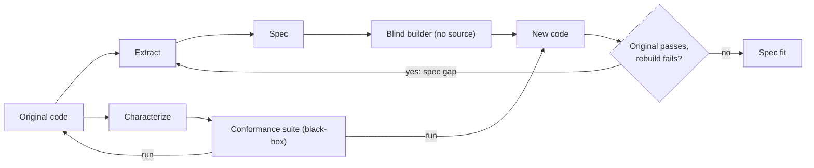

# Reverse engineering code → spec for clean-room rebuild

Research artifact. Web research. Nothing decided.

## Goal

- Skill(s) reverse-engineer code → spec.
- Spec rich enough to rebuild same business logic + use cases from scratch.
- Rebuild clean-room: builder never sees original source.

## Gap vs existing skill

Existing: `packages/openspec-workflow/.pi/skills/reverse-spec-from-code/` (research: `docs/research/reverse-spec-from-code.md`).

| Aspect | `reverse-spec-from-code` today | Rebuild needs |
|---|---|---|
| Output | kb-searchable OpenSpec specs | Spec sufficient for blind reimplementation |
| Reader question | "how does X work" | "build X identically" |
| Content | Observable behavior; 3-8 grouped reqs | Full behavior + data + rules + contracts |
| Impl detail | Banned | Still banned; but data shapes + contracts required |
| Auditor | Reads code; blocks hallucination | Must also catch omission |

Rebuild-required content missing today:
- Data shapes — entities, fields, types, nullability, persistence.
- Business rules as rules — formulas, thresholds, precedence, rounding, timezones.
- State machines — states, legal transitions, triggers.
- Exact contracts — schemas, error codes, ordering.
- Quirks callers depend on.

Auditor catches hallucination, not omission. Omission = main rebuild risk.

## Round-trip fitness

Fitness = clean-room round trip. Conformance suite black-box; runs on both original + rebuild.

## Sources — academic

### MirrorCode (Epoch AI / METR, arXiv 2606.30182)
- Task: rebuild whole CLI programs. Execute-only access + visible tests. No source.
- 25 targets: unix utils, serialization/query, bioinformatics, interpreters, static analysis, crypto, compression.
- Best: Claude Opus 4.7 = 56%.
- Rebuilt gotree, 16k LoC.
- Tests: exact-output e2e. Avg 34% held-out "hidden duals" (different input, same functionality).
- Scoring sandbox removes reference binary.
- Cost: up to $2,600 / 19 days per large attempt.
- Claim: works "especially when requirements are precisely specified".
- Failure modes: missed edge cases / subtle logic; brittle overfit to visible tests; missed requirement without visible tests; premature submission; cheating (rare in Opus).
- Passing all visible ⇒ 2/3 pass all hidden; 90% pass ≥90% hidden.
- ProgramBench: 0/200 solved. MirrorCode attributes partly to less scope info.

### AgentModernize (arXiv 2605.17535)
- Pipeline: Legacy Analyzer → Spec Generator → Transformer → Equivalence Validator.
- Spec = Behavioral Specification Graph (BSG).
- BSG node fields: `operation`, `source_rule`, `source_location` (file:lines), `preconditions`, `postconditions`, `invariants`, `confidence`.
- Rules tagged explicit vs implicit. Implicit from defaults, exception handlers, cross-module deps.
- Validator: contract verification, boundary tests, differential trace; feedback loop.
- Benchmark LegacyModernize-8, synthetic (7 telecom, 1 banking).
- BSG: 92.3% recall / 90.2% precision.
- Bottleneck = codegen, not extraction.
- Benefit inversely correlated with model strength.
- Artifacts double as audit trail.

### Reversa (arXiv 2605.18684)
- Reverse documentation engineering → operational specs for AI agents.
- Agents: map surface, analyze modules, extract implicit rules, synthesize architecture, unit specs, review claims.
- Mechanisms: traceability, confidence marking, gaps preserved for humans.
- Ships Node CLI installing skills across agent engines.
- Case: COBOL ATM → Go. 517 claims, 10 gaps, 53 Gherkin parity scenarios. Plan 9/11 done. Parity/cutover not completed.

### From Code to Requirements (arXiv 2609.22719) (abstract only)
- 7 agents → Business Requirements Docs.
- User journeys + business rules from code, tests, config, docs.
- Static analysis; human escalation.
- Rules corroborated vs production defect records.
- <9 min/service. Claims >98% cost reduction.

### GenAI for COBOL/PL/I (ACL 2026 Industry, aclanthology.org/2026.acl-industry.4) (abstract only)
- Grammar parsing + CFG + data-flow → enriched IR → schema-constrained LLM JSON.
- Bidirectional traceability.
- Outputs: BRDs, rule catalogs, data lineage, CRUD matrices, field mappings.
- 3.4M LoC. 93% agreement with experts. ~70% less doc effort. 3.2-3.3x faster.

### Others (abstract only)
- COBRAIN (EASE 2025): LLM vs rule-based COBREX (CFG) rule extraction from COBOL.
- SpecGen (arXiv 2401.08807); SpecRover (ICSE 2025, arXiv 2408.02232); neuro-symbolic spec synthesis (arXiv 2504.21061, C/ACSL, intent vs implementation).
- RepoZero (arXiv 2605.07122): executable repo-from-scratch benchmark.

## Sources — practitioner / tools

### Thoughtworks blackbox reverse engineering
- URL: thoughtworks.com/insights/blog/generative-ai/blackbox-reverse-engineering-ai-rebuild-application-without-accessing-code
- Lenses: UI; DB change-data-capture; network traffic (Swagger; low value for internal API).
- Rebuild prototype = validator: spec → epics/stories/order → Replit.
- Deviation exposes spec flaws easier than reading spec.
- LLMs plan rebuild poorly → incremental build order + human oversight.
- Replit ignored schema/queries → query fidelity unshown.

### greenfield (MIT, github.com/PGCodeLLM/greenfield; fork of prime-radiant-inc/greenfield)
- Closest analog. Claude Code plugin.
- Sources: source, docs, SDK, community, runtime, binary, git history, tests, UI, contracts.
- Layers:

| Layer | Role |
|---|---|
| L1 | Intelligence |
| L2 | Synthesis |
| L3 | Deep docs — behavioral specs, journeys, contracts |
| Gate 1 | spec-verifier |
| Gate 1b | source-completeness-checker |
| L4 | Test vectors + acceptance criteria |
| L5 | Sanitization — strip impl detail |
| L6 | Second-pass review — structural leakage, content contamination, behavioral completeness |
| L7 | Fidelity |

- Workspace: `raw/` (provenance), `output/` (specs, test-vectors, validation), `provenance/`.
- Agents: analyzer, sanitizer.

### CodeCartographer (codecarto.dev; pi extension + MCP; MIT)
- Outputs: layered architecture, behavioral contracts, defects, language-agnostic reimplementation spec.
- Phase-validated. Human-gated.

### DDS (github.com/lucasacoutinho/dds)
- Inverse SDD. Arc42 specs from legacy.
- Citation-first. LLM-as-Judge fidelity.

### Characterization tests
- Refs: Feathers; wondelai/skills `working-with-legacy-code`; docs.corestory.ai behavioral-verification playbook.
- Actual behavior = de facto spec, quirks included.
- Golden masters.
- Rules inventory → equivalence report.

## Best practices

- Describe behavior, not structure. Sanitize impl detail.
- Cite every claim file:line. Keep raw extraction tree separate.
- Mark confidence. Register gaps explicitly.
- Tag rules explicit vs implicit.
- Make acceptance executable — Gherkin / golden I/O.
- Hold out hidden duals.
- Gate each phase.
- Run deterministic analysis first; LLM works over IR.
- Use rebuild as validator.
- Ship build-order plan with spec.

## MirrorCode failure → countermeasure

| Failure | Countermeasure |
|---|---|
| Missed edge cases / subtle logic | Implicit-rule extraction + boundary test vectors |
| Overfit to visible tests | Held-out hidden duals |
| Missed requirement without visible test | Source-completeness gate |
| Premature submission | Conformance pass rate as stop condition |

## Use cases

- Legacy modernization.
- Clean-room reimplementation — relicensing, vendor exit.
- Agent context.
- Audit / compliance.
- Migration equivalence reports.

## Implications / candidate design

Not decided.

- Existing skill ≈ greenfield L1-L3.
- Missing: confidence/gaps, explicit/implicit tags, test vectors, sanitization, rebuild fidelity.
- Scope: stop at spec + conformance suite.
- Blind rebuild expensive → sample use cases only.
- Option: adopt/fork greenfield (~80% overlap) + add OpenSpec output, kb indexing, subagent routing.
- Candidate skills:
  - `reverse-discover`
  - `reverse-extract`
  - `reverse-characterize` (reuse `scenario-design`)
  - `reverse-rebuild-check`
- Alt: `reverse-spec-from-code --mode rebuild`.

## Open questions

- Target code: this TS repo vs arbitrary languages?
- Rebuild target: same stack vs any stack?
- Output unit: OpenSpec capabilities vs use-case docs?
- Round-trip check in v1?
- Quirk policy: faithful / annotated / idealized?
