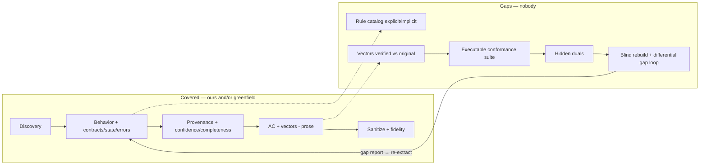

# Reverse engineering gap analysis — ours vs greenfield vs rebuild target

Research artifact. Companion: [reverse-engineering-for-rebuild.md](reverse-engineering-for-rebuild.md).

## Compared

- OURS = `packages/openspec-workflow/.pi/skills/reverse-spec-from-code/` (SKILL.md + prompts generator/auditor/discovery).
- GREENFIELD = github.com/PGCodeLLM/greenfield. MIT. 22 skills + 1312-line `commands/analyze.md`. Inspected via headings + targeted greps.
- RESEARCH = `docs/research/reverse-engineering-for-rebuild.md`.
- Legend: ✅ present / 🟡 partial / ❌ absent.

## Headline

- Greenfield strong up to handoff.
- Nobody verifies rebuildability.
- Greenfield vectors derive from own specs → extraction errors inherited by vectors → circular.
- Fix = run/rebuild + compare (AgentModernize, Thoughtworks).

## Matrix

### Discovery

| id | capability | ours | greenfield | note |
|---|---|---|---|---|
| D1 | boundaries | ✅ | ✅ | ours kb-tree clustering `discovery.md`; greenfield ST1-ST3 module enumeration |
| D2 | use-case/journey as unit | ❌ | 🟡 | greenfield user-journey-analyzer L3, but unit = module; bRD paper journey-first |
| D3 | multi-source evidence | ❌ code-only | ✅ | 10 source types |
| D4 | test-suite mining | ❌ | ✅ | test-suite-analysis: assertions = confirmed, Given/When/Then |

### Extraction

| id | capability | ours | greenfield | note |
|---|---|---|---|---|
| E1 | observable behavior WHEN/THEN | ✅ | ✅ | ours 97% req coverage |
| E2 | cross-boundary contracts | ✅ | ✅ | ours strongest lever (generator STEP 1) |
| E3 | domain model entities/fields/types/nullability | ❌ banned | 🟡 | greenfield "Data Format" sections; RP-11 keeps DB schemas only if external |
| E4 | business-rule catalog (formulas, thresholds, precedence) | ❌ | 🟡 | buried in "Conditions (evaluated in order)"; no rule IDs; grep "business rule" = 0 |
| E5 | explicit vs implicit tag | ❌ | ❌ | only AgentModernize; top rebuild-break source |
| E6 | state machines | ❌ | ✅ | "State Box": variables, invariants, transitions, persistence, init |
| E7 | edge-case checklist | 🟡 | ✅ | ours "include error paths"; greenfield empty/max-size/concurrent/interruption |
| E8 | error model | 🟡 | ✅ | detection/response/message/recovery template |
| E9 | quirk policy | 🟡 faithful | 🟡 faithful | neither flags suspected bugs vs intent |

### Trust

| id | capability | ours | greenfield | note |
|---|---|---|---|---|
| T1 | per-claim provenance | ❌ forbidden | ✅ | `<!-- cite: source=, ref=, confidence=, agent=, corroborated_by= -->` |
| T2 | confidence levels | ❌ | ✅ | confirmed/inferred/assumed + escalation |
| T3 | gap/open-question register | ❌ | 🟡 | ours only auditor `missing_behaviors`; greenfield per-unit "Open Questions", no global register; Reversa: 10 registered gaps |
| T4 | hallucination audit | ✅ | ✅ | ours `@research` auditor; greenfield Gate 1 spec-verifier |
| T5 | completeness gate | 🟡 | ✅ | source-completeness 7 checks: tools, env vars, CLI flags, subcommands, events, config keys, error categories; P0-P2 |
| T6 | cross-source contradiction handling | ❌ | ✅ | n/a for single source |

### Executable acceptance

| id | capability | ours | greenfield | note |
|---|---|---|---|---|
| X1 | acceptance criteria w/ IDs | 🟡 scenarios | ✅ | `AC-{DOMAIN}-{NNN}`, Given/When/Then, priority, verification |
| X2 | concrete test vectors | ❌ | ✅ | L4 mandatory: CLI I/O, req/resp, state sequences, KATs |
| X3 | vectors verified vs running original | ❌ | ❌ | greenfield derives vectors from specs; never runs vs target (grep golden/run vectors = nothing) |
| X4 | hidden duals | ❌ | ❌ | MirrorCode only |
| X5 | executable conformance suite | ❌ | ❌ | both emit markdown |

### Clean-room

| id | capability | ours | greenfield | note |
|---|---|---|---|---|
| C1 | sanitization | 🟡 prompt | ✅ | RP-1..RP-12, descriptive-name trap, separate session |
| C2 | contamination review | ❌ | ✅ | 3 LLM reviewers: structural/content/completeness |
| C3 | fidelity raw→sanitized | ❌ | ✅ | "equal or greater precision", 3 remediation rounds |

### Rebuild loop

| id | capability | ours | greenfield | note |
|---|---|---|---|---|
| R1 | build-order plan | ❌ | 🟡 | P0-P3 labels only, no dependency DAG |
| R2 | blind rebuild | ❌ | ❌ | greenfield stops at "hand off to implementation team" |
| R3 | differential run → gap report | ❌ | ❌ | AgentModernize differential trace; Thoughtworks prototype-as-validator |
| R4 | gap → re-extract loop | ❌ | ❌ | |

### Ops

| id | capability | ours | greenfield | note |
|---|---|---|---|---|
| O1 | incremental re-run | 🟡 `--refresh` | ✅ | incremental-analysis high-water mark, stale/orphan |
| O2 | hard format gate | ✅ `openspec validate` | 🟡 grep gates | |
| O3 | data-backed model/cost tuning | ✅ | ❌ | ours model-loss study; greenfield agents pin no model |
| O4 | OpenSpec + kb integration | ✅ | ❌ | |
| O5 | quality-measurement fixtures | ✅ 6 specs | ❌ | |

## Coverage vs gaps

## Ranked gaps

| rank | gap | why | effort | close by |
|---|---|---|---|---|
| 1 | X3+X5 characterize original → executable golden vectors | spec becomes oracle; MirrorCode exact-output | M | new phase: run original, record I/O; reuse docker harness / Playwright / vitest |
| 2 | R2-R4 blind rebuild + differential gap loop | only omission detector | L, $$ | new rebuild-check phase on sampled use cases; fail → gap → re-extract |
| 3 | E3+E4+E5 domain model + rule catalog explicit/implicit | implicit rules break rebuilds (AgentModernize 15-year suspended-account exemption) | S-M | extend generator: `BR-NNN` rules + entity schema; ours currently bans this |
| 4 | T1-T3 provenance + confidence + gap register | rebuilder knows what to trust (Reversa) | S | adopt greenfield cite format + 3 levels; global `gaps.md` |
| 5 | T5 completeness gate | MirrorCode failure (iii): untested requirement missed | S | port 7 checks, TS/pi-adapted |
| 6 | E6-E8 state/edge/error templates | MirrorCode failure (i): edge cases | S | lift greenfield templates |
| 7 | C1-C3 sanitization + fidelity | only for true clean room (relicense, vendor exit); internal rebuild: provenance = asset | M | optional mode; port spec-sanitization + fidelity-validation |
| 8 | X4 hidden duals | anti-overfit, MirrorCode (ii) | S | split vectors ~66/34 visible/held-out |
| 9 | D2+D3 use-case unit + multi-source | business-facing; tests/git add confirmed evidence | M | journey-first discovery + test mining |
| 10 | R1 build-order plan | LLMs plan rebuild poorly (Thoughtworks) | S | dependency DAG from rule/entity refs |

## Our advantages over greenfield

- Measured quality loop: blind generator + judge + 6 ground-truth specs.
- Data-backed model routing: fast generator + strong auditor ≈ opus quality, cheap.
- Hard `openspec validate` gate.
- kb/OpenSpec-native.
- Execution infra for gaps 1-2: docker harness, Playwright E2E, subagents plugin, scenario-design ISTQB skill.

## Build vs adopt

| option | covers | missing / cost |
|---|---|---|
| A — adopt greenfield as-is | D, E6-E8, T, X1-X2, C | X3-X5, R, OpenSpec/kb, pi runtime (Claude Code plugin) → porting cost; still unverified |
| B — extend ours only | D1, E1-E2, O | most T/E/X/C → reinvents greenfield |
| **C — hybrid (RECOMMENDED)** | ours as engine + ported greenfield methodology (provenance, templates, completeness, sanitizer) + new characterize + rebuild-check phases | MIT reuse |

## Tranches

Each tranche = candidate OpenSpec change.

1. **Richer extraction.** Rule catalog, explicit/implicit, entity schema, state/edge/error templates, cite provenance + confidence, gap register, completeness gate. Prompt/doc only. Low risk.
2. **Characterize.** Golden vectors from running original. Visible/held-out split. Executable suite.
3. **Rebuild-check.** Blind builder subagent. Differential run. Gap report. Feedback loop. Sampled budget.

Sanitization C1-C3 = optional mode. Deferred until clean-room need.

## Open questions

- Target language/stack — defines executable vectors.
- Rebuild-check in v1?
- Quirk policy.
