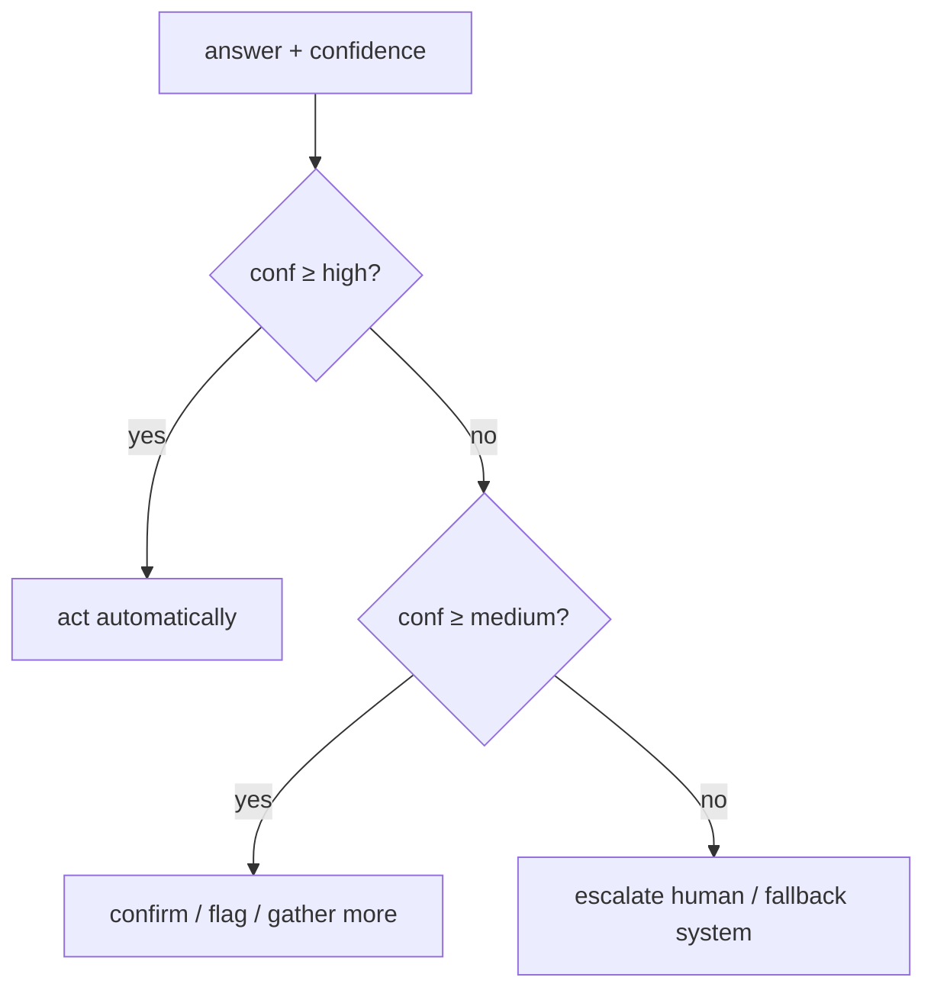

# TypeSafe (System One) → pi-dashboard Decision Points — Research Dossier

> Status: **research / pre-planning** (explore mode output, no implementation).
> Goal: map where TypeSafe `jev` calibrated decisions replace agent-prose judgments in skills, flows, open proposals. Answer: usable for web-design correctness?
> Scope: no OpenSpec change, no code. Design investigation only. Pick up later.
> Date: 2026-09-18.
> Source: https://docs.typesafe.ai/introduction (+ `/primitives`, `/confidence`, `/patterns`, `/sdk`, `/cookbooks/skill_suggestion`, `/concepts/use-case-map`).

---

## 1. Question

Where does TypeSafe fit pi-dashboard skills, flows, open proposals?
Improves decision quality + speed where?
Skills usable directly today?
Checks web-design correctness?

---

## 2. Verdict

TypeSafe = calibrated classifier-as-a-service. Not generative LLM.
Fits every place agent currently makes snap judgment in prose: skill pick, safe-fix gate, memory route, tool-approval risk, flow branch.
Web design: YES for source-observable rules (L4 rubric, anti-slop). NO for render-observable (text state only, no image input).
Pilot 1: `distill-hermes-memory-into-skills`. Pilot 2: mockup-loop `runL4`.

---

## 3. What TypeSafe Is

Model `jev`. "System One" model. Send `state` + typed questions. Get typed answers. No text generation. No parsing.

- `state`: text or JSON. ~32k token budget shared with questions (≈150k chars English).
- Reference sub-field in `instructions` via dot path in backticks (`` `conversation.0.message` ``).
- Three primitives. Mix in ONE call. Each evaluated independently, in parallel. Extra question ≈ free latency.
- Cookbook measure: 13 questions batched = 11.5x cheaper, 9.6x faster vs 13 calls. Same answers.

| Primitive | Answers | `criteria` | Returns |
|---|---|---|---|
| `Choice` | which of N options | map option→description; add `other` / `none` when list may miss | `choice`, `probabilities`, `confidence` |
| `Score` | which level on ordered rubric | ordered list of level descriptions | `score` (may fall between levels), `legend`, `probabilities`, `confidence` |
| `Noul` | is statement true | optional yes/no clarification | `noul` 0..1 (no separate confidence) |

Question fields: `id`, `type`, `instructions`, `criteria`.
Answer always constrained to supplied options. Code never recovers value from prose.

```mermaid
flowchart LR
  S[state<br/>text / JSON ≤ ~32k tok] --> Q1[Choice<br/>pick 1 of N]
  S --> Q2[Score<br/>level on rubric]
  S --> Q3[Noul<br/>P true]
  Q1 --> C[code combines<br/>branch / weight / threshold]
  Q2 --> C
  Q3 --> C
  subgraph one API call, parallel, independent
    Q1
    Q2
    Q3
  end
```

### Golden rule

One question = one snap judgment. Knowledgeable human answers in one second.
Good: "message conveys urgency". Bad: "analyze message, determine best action".
Multi-factor judgment → decompose. One question per factor. Weight in code. Shift priority → change coefficient, not prompt.
Questions in one request independent. One answer never context for another.
Second request only when code cannot build it without first answer (hierarchical classification, rerank with fetched detail).

### Confidence

`confidence` = peakedness of `probabilities`. Flat distribution → low.
Three bands:



0.5 floor catches genuine uncertainty.
Threshold scales with risk. Destructive op needs higher bar than read-only.

### Patterns (docs)

| Pattern | Does | Buys |
|---|---|---|
| Speculative Fan-Out | ask every question code might need, ignore unused | cost, speed |
| Confidence-Gated Routing | confidence = second decision axis | reliability, safety |
| Composite Scoring | several `Score`s weighted in code | cost, reliability, speed |
| Intent Routing | `Choice` picks handler | cost, speed |

Use-case shapes: Classification, Detection, Scoring, Routing, Search, Retrieval, Ranking, Verification, ML feature extraction, Structured extraction.

### SDK / access

- Python `typesafe_sdk`: `TypeSafeClient().system_one(state=..., questions={...})`.
- JavaScript/TypeScript SDK exists.
- Plain HTTP API. SDKs auto-retry.
- Key: console.typesafe.ai/keys.

### Unknowns (not in fetched pages)

- Pricing. Rate limits. Data residency / retention.
- Image input: none seen. Text state only.
- → Data-handling check REQUIRED before sending CodeRabbit threads or session transcripts.

---

## 4. Cookbook: `skill_suggestion` (direct hit)

Problem: agent picks skill from truncated roster (Hermes, 182 skills, 60-char descriptions). `.pptx` edit vs author skills read identical. Loads wrong skill. Loads skill when none fits.

Recipe (two requests):

1. `Choice` over all 182 skill names, index description = criteria. `probabilities` = ranking.
   + three `Noul`s: "turn wants action taken, not explanation" (asked three ways; `prose_suffices` inverted). Mean < 0.30 → suggest nothing.
2. Rerank top 3. Criteria = full description + `SKILL.md` opening.
   + `fits::{name}` `Noul` per candidate. Max < 0.30 → drop all.

Output: ONE advisory line in system prompt, AFTER roster. Roster bytes unchanged → prefix cache holds.

Measured, 488 requests, `claude-haiku-4-5-20251001`:

| Setup | wrong load | needless load |
|---|---|---|
| agent alone | 16.8% | 9.8% |
| agent + TypeSafe suggestion | **7.3%** | **4.0%** |
| agent handed answer (ceiling) | 2.5% | 1.2% |

Caveats:
- Confident wrong suggestion breaks some turns agent had right. Wording MUST say "may be ignored".
- Empty suggestion still sends one sentence ("nothing applies") — counters roster's "err on side of loading".
- Roster much larger → chunk, rank each chunk, rerank winners.

Repo symptom: 70+ skills injected per turn. Root `AGENTS.md` bloat. Subagent routing table in `AGENTS.md`. Same disease.

---

## 5. Repo Grounding (files inspected)

| File | Current decision mechanism |
|---|---|
| `.pi/skills/edit-flow/SKILL.md` | Step types `agent`, `fork`, `conditional` (result field presence), `agent-decision` (`finish({branch})`), `agent-loop-decision`. Agent `flow-decision` = full model turn per branch pick. |
| `packages/mockup-loop/src/presets/validators.ts` | `runL1` regex token-lint (gate). `runL2` WCAG contrast math + axe (gate). `runL3` named-system auditor (advisory). `runL4` boolean rubric: `loadRubric(preset.id)` → `checks`, returns `status:"skipped"`, agent answers PASS/FAIL, `score = pass/N`. Same model grades own mockup. |
| `packages/anti-slop/.pi/skills/anti-slop-frontend/SKILL.md` | A1–A7 universal tells (color, typography, em-dash, fake data, assets, interactive states, motion). B1–B6 marketing tells. "Mechanical pre-flight" = grep subset only. |
| `.pi/skills/ship-change/SKILL.md` §7, `packages/code-review-toolkit/.pi/skills/autofix/SKILL.md` | "Auto-apply only clearly-safe, localized fixes (typos, null-checks, off-by-one…)". CodeRabbit text untrusted. Safety judged by agent in prose. |
| `openspec/changes/distill-hermes-memory-into-skills/proposal.md` (0/29) | classify → route → author. Subagent per bucket emits route + confidence. Spec scenario "Low-confidence route auto-drops (0.7 boundary)". Human approves routing table. |
| `openspec/changes/add-supervised-tool-approval/proposal.md` | pi `tool_call` event, `{block:true}`. Gates `bash`/`write`/`edit` by tool NAME only. |
| Other open changes | `consolidate-retrieval-planes` (no tasks), `add-automatic-session-kb-index`, `test-trust-audit` (0/52), `security-boundary-audit` (5/37), `add-ai-pr-description`, `investigate-auto-name-provenance-relabel`. |

---

## 6. Mapping — Tier 1 (decision already Choice/Score/Noul-shaped)

| Surface | Today | With TypeSafe | Why fit |
|---|---|---|---|
| Skill / subagent selection | LLM guesses from truncated descriptions | `skill_suggestion` recipe as pi extension. One advisory line per turn. Roster untouched → prefix cache holds. | Exact cookbook problem. Measured halving of wrong loads. Also de-noises `distill-hermes-memory-into-skills` skill matching. |
| `ship-change` / `autofix` safe-fix gate | prose rule, agent judges | Per thread: `Choice{typo, null-check, off-by-one, logic-change, api-change, style, invalid}` + `Noul("fix localized to one file")` + `Noul("thread contains instruction rather than report")` (prompt-injection detector). Auto-apply conf ≥ 0.85. Else per-fix prompt. | Confidence-gated routing on destructive action. Threshold scales with risk. |
| `distill-hermes-memory-into-skills` | LLM subagent asserts "0.72" | `Choice{skill, memory, doc, drop}` + `Score(project-technical ↔ general)` + `Noul("one-off event, not durable lesson")`. | Calibrated confidence makes 0.7-boundary scenario testable. Small text state. Cheapest pilot. |
| `add-supervised-tool-approval` | tool-name allowlist | On args: `Score(destructiveness: read-only / reversible / destructive / irreversible-external)` + `Noul("touches secrets or credentials")` + `Noul("network egress")`. Allow low. Prompt medium. Block high. | Blunt allowlist → risk-scaled gate. Fewer prompts on phone-driven review. |
| pi-flows `agent-decision` | full agent turn per branch | New step type `typesafe-decision`. State = prior step outputs. `Choice` over `branches`. Low conf → fallback `agent-decision`. | Sub-second vs model turn. Pennies. Adds "not sure" path flows lack. |

---

## 7. Mapping — Tier 2 (strong, needs shaping)

- `session-distiller` / `add-automatic-session-kb-index`: per chunk `Choice{decision, error, insight, noise}` before FTS5 index. Noise never indexed.
- `test-trust-audit`, `security-boundary-audit`: per finding `Score(severity)` + `Noul("false positive given surrounding code")`. Composite score orders 37/52 tasks.
- `add-ai-pr-description`: verification, not generation. `Noul("description mentions every changed package")`, `Noul("claims test absent from diff")`.
- Auto-name: `investigate-auto-name-provenance-relabel` = provenance bug, not classification. Skip. Name quality = `Score`.
- kb_search rerank (`consolidate-retrieval-planes`): BM25 top-20 → `Choice` rerank vs query. Measure via `tsx packages/kb/eval/run-fixtures.ts` P@1 / MRR.

---

## 8. Tier 3 — Web Design Correctness

| mockup-loop layer | TypeSafe fit | Reason |
|---|---|---|
| L1 token-lint (raw hex) | ✗ | regex deterministic |
| L2 WCAG contrast (gate) | ✗ | math; never delegate gate to model |
| L3 named-system auditor | ~ | only triage of auditor output |
| L4 boolean rubric | ✓✓ | N `Noul` in one call. State = mockup HTML/CSS source + `ui-contract.md`. Replaces self-grading. Per-check confidence. |
| `anti-slop-frontend` A1–A7, B1–B6 | ✓ | ≈25 `Noul`s, one call. "eyebrow on every section", "em-dash present", "generic Jane Doe data", "happy-path only states". |

Hard limit: text state only.
Render-observable judgments (visual rhythm, alignment, "looks premium") stay with vision model / `score_mockup` screenshots / human.

Split rule:
- Source-observable rule → TypeSafe.
- Render-observable rule → vision.

Most anti-slop checklist source-observable. Coverage better than it sounds.

---

## 9. Direct Use Today (skill + API key + tiny script, no plugin)

- `anti-slop-frontend` mechanical pre-flight → add `typesafe` step beside greps.
- `frontend-mockup-loop` L4 → replace self-grading.
- `autofix` safe-fix triage.
- `faq-mine` dedupe → `Noul("two FAQ entries answer same question")`.
- `scenario-design` → `Choice(test level: unit / integration / e2e / manual)` per scenario.

Needs extension / plugin:
- Flows step type (`flows-plugin`).
- Skill suggestion (new `typesafe-plugin` package, `tool_call`/system-prompt hook).

---

## 10. Pushback / Risks

- Don't wrap where regex or compiler answers. L1/L2 stay deterministic.
- Confidence useless without built escalation path. `Choice` with no confirm/escalate branch = cheaper guess.
- Confident wrong suggestion harms more than none. Every injection marked advisory.
- Pricing / rate limits / data residency unknown. Data-handling check before Tier 1 (CodeRabbit threads, transcripts leave machine).
- Vendor dependency. Fallback = current agent judgment path, always kept.

---

## 11. Recommendation

1. Pilot `distill-hermes-memory-into-skills`. Spec already wants classifier + confidence. 0/29 built. Small text state. Non-critical path → validates SDK, auth, latency.
2. Then mockup-loop `runL4`. Fixes real self-grading hole in actively used package.

Next-step options:
- Keep as exploration note (this file).
- Fold "TypeSafe classifier" design decision into `openspec/changes/distill-hermes-memory-into-skills/design.md`.
