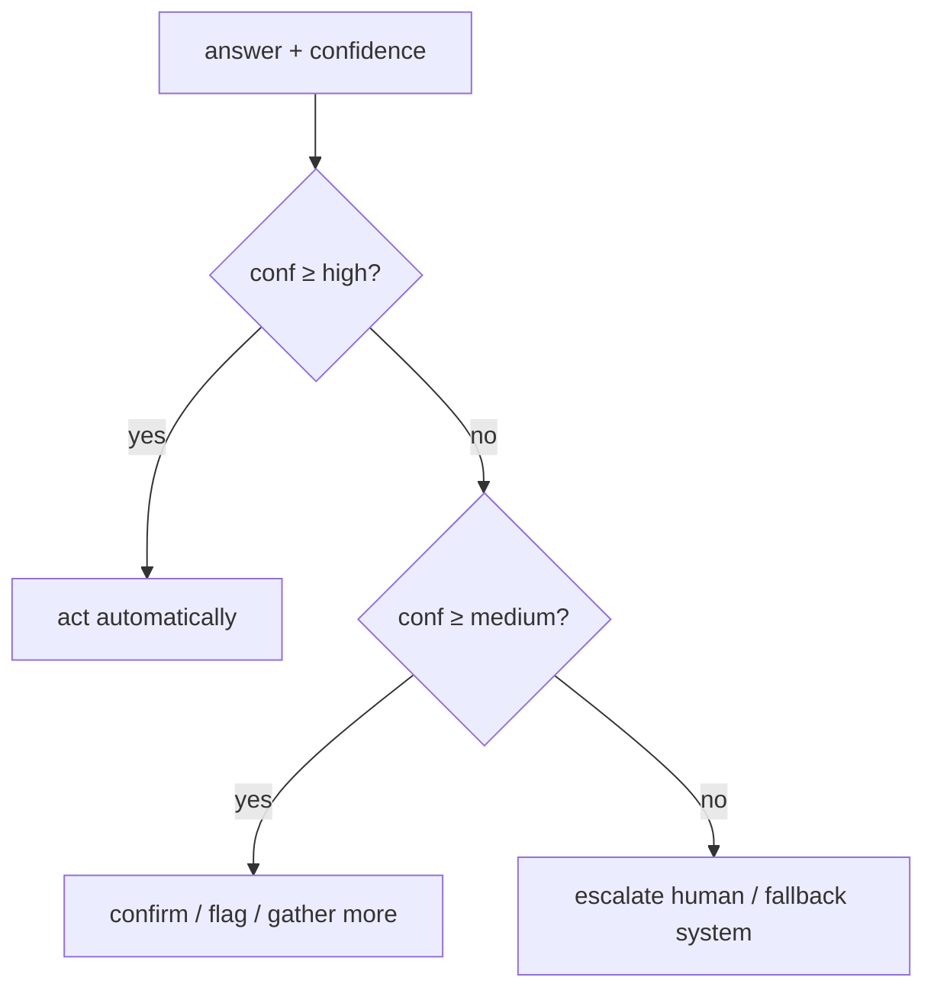
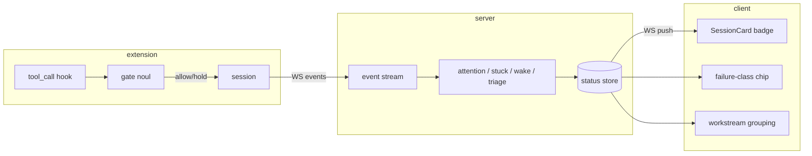
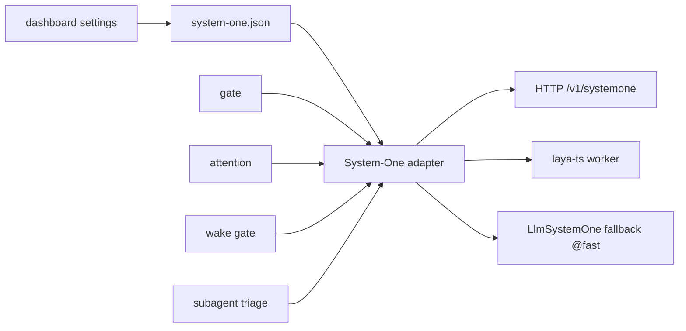
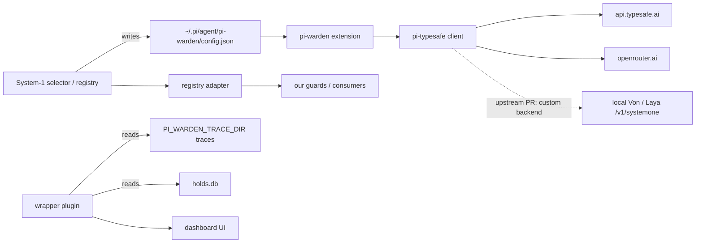

# TypeSafe (System One) → pi-dashboard Decision Points — Research Dossier

> Status: **research / pre-planning** (explore mode output, no implementation).
> Goal: map where TypeSafe `jev` calibrated decisions replace agent-prose judgments in skills, flows, open proposals. Answer: usable for web-design correctness?
> Scope: no OpenSpec change, no code. Design investigation only. Pick up later.
> Date: 2026-09-18.
> Source: https://docs.typesafe.ai/introduction (+ `/primitives`, `/confidence`, `/patterns`, `/sdk`, `/cookbooks/skill_suggestion`, `/concepts/use-case-map`).
> Addendum 2026-09-26: §12–§19 (Jev specs, ecosystem, pi-jev/pi-warden, deployment lessons, dashboard mapping A–L, Von/Laya/Kev comparison, global System-1 selector decision, pi-warden/pi-jev ownership).

---

## 1. Question

Where does TypeSafe fit pi-dashboard skills, flows, open proposals?
Improves decision quality + speed where?
Skills usable directly today?
Checks web-design correctness?

---

## 2. Verdict

TypeSafe = calibrated classifier-as-a-service. Not generative LLM.
Fits every place agent currently makes snap judgment in prose: skill pick, safe-fix gate, memory route, tool-approval risk, flow branch.
Web design: YES for source-observable rules (L4 rubric, anti-slop). NO for render-observable (text state only, no image input).
Pilot 1: `distill-hermes-memory-into-skills`. Pilot 2: mockup-loop `runL4`.

---

## 3. What TypeSafe Is

Model `jev`. "System One" model. Send `state` + typed questions. Get typed answers. No text generation. No parsing.

- `state`: text or JSON. ~32k token budget shared with questions (≈150k chars English).
- Reference sub-field in `instructions` via dot path in backticks (`` `conversation.0.message` ``).
- Three primitives. Mix in ONE call. Each evaluated independently, in parallel. Extra question ≈ free latency.
- Cookbook measure: 13 questions batched = 11.5x cheaper, 9.6x faster vs 13 calls. Same answers.

| Primitive | Answers | `criteria` | Returns |
|---|---|---|---|
| `Choice` | which of N options | map option→description; add `other` / `none` when list may miss | `choice`, `probabilities`, `confidence` |
| `Score` | which level on ordered rubric | ordered list of level descriptions | `score` (may fall between levels), `legend`, `probabilities`, `confidence` |
| `Noul` | is statement true | optional yes/no clarification | `noul` 0..1 (no separate confidence) |

Question fields: `id`, `type`, `instructions`, `criteria`.
Answer always constrained to supplied options. Code never recovers value from prose.

```mermaid
flowchart LR
  S[state<br/>text / JSON ≤ ~32k tok] --> Q1[Choice<br/>pick 1 of N]
  S --> Q2[Score<br/>level on rubric]
  S --> Q3[Noul<br/>P true]
  Q1 --> C[code combines<br/>branch / weight / threshold]
  Q2 --> C
  Q3 --> C
  subgraph one API call, parallel, independent
    Q1
    Q2
    Q3
  end
```

### Golden rule

One question = one snap judgment. Knowledgeable human answers in one second.
Good: "message conveys urgency". Bad: "analyze message, determine best action".
Multi-factor judgment → decompose. One question per factor. Weight in code. Shift priority → change coefficient, not prompt.
Questions in one request independent. One answer never context for another.
Second request only when code cannot build it without first answer (hierarchical classification, rerank with fetched detail).

### Confidence

`confidence` = peakedness of `probabilities`. Flat distribution → low.
Three bands:

```mermaid
flowchart TD
  A[answer + confidence] --> H{conf ≥ high?}
  H -- yes --> ACT[act automatically]
  H -- no --> M{conf ≥ medium?}
  M -- yes --> CONFIRM[confirm / flag / gather more]
  M -- no --> ESC[escalate human / fallback system]
```

0.5 floor catches genuine uncertainty.
Threshold scales with risk. Destructive op needs higher bar than read-only.

### Patterns (docs)

| Pattern | Does | Buys |
|---|---|---|
| Speculative Fan-Out | ask every question code might need, ignore unused | cost, speed |
| Confidence-Gated Routing | confidence = second decision axis | reliability, safety |
| Composite Scoring | several `Score`s weighted in code | cost, reliability, speed |
| Intent Routing | `Choice` picks handler | cost, speed |

Use-case shapes: Classification, Detection, Scoring, Routing, Search, Retrieval, Ranking, Verification, ML feature extraction, Structured extraction.

### SDK / access

- Python `typesafe_sdk`: `TypeSafeClient().system_one(state=..., questions={...})`.
- JavaScript/TypeScript SDK exists.
- Plain HTTP API. SDKs auto-retry.
- Key: console.typesafe.ai/keys.

### Unknowns (not in fetched pages)

- Pricing. Rate limits. Data residency / retention.
- Image input: none seen. Text state only.
- → Data-handling check REQUIRED before sending CodeRabbit threads or session transcripts.

---

## 4. Cookbook: `skill_suggestion` (direct hit)

Problem: agent picks skill from truncated roster (Hermes, 182 skills, 60-char descriptions). `.pptx` edit vs author skills read identical. Loads wrong skill. Loads skill when none fits.

Recipe (two requests):

1. `Choice` over all 182 skill names, index description = criteria. `probabilities` = ranking.
   + three `Noul`s: "turn wants action taken, not explanation" (asked three ways; `prose_suffices` inverted). Mean < 0.30 → suggest nothing.
2. Rerank top 3. Criteria = full description + `SKILL.md` opening.
   + `fits::{name}` `Noul` per candidate. Max < 0.30 → drop all.

Output: ONE advisory line in system prompt, AFTER roster. Roster bytes unchanged → prefix cache holds.

Measured, 488 requests, `claude-haiku-4-5-20251001`:

| Setup | wrong load | needless load |
|---|---|---|
| agent alone | 16.8% | 9.8% |
| agent + TypeSafe suggestion | **7.3%** | **4.0%** |
| agent handed answer (ceiling) | 2.5% | 1.2% |

Caveats:
- Confident wrong suggestion breaks some turns agent had right. Wording MUST say "may be ignored".
- Empty suggestion still sends one sentence ("nothing applies") — counters roster's "err on side of loading".
- Roster much larger → chunk, rank each chunk, rerank winners.

Repo symptom: 70+ skills injected per turn. Root `AGENTS.md` bloat. Subagent routing table in `AGENTS.md`. Same disease.

---

## 5. Repo Grounding (files inspected)

| File | Current decision mechanism |
|---|---|
| `.pi/skills/edit-flow/SKILL.md` | Step types `agent`, `fork`, `conditional` (result field presence), `agent-decision` (`finish({branch})`), `agent-loop-decision`. Agent `flow-decision` = full model turn per branch pick. |
| `packages/mockup-loop/src/presets/validators.ts` | `runL1` regex token-lint (gate). `runL2` WCAG contrast math + axe (gate). `runL3` named-system auditor (advisory). `runL4` boolean rubric: `loadRubric(preset.id)` → `checks`, returns `status:"skipped"`, agent answers PASS/FAIL, `score = pass/N`. Same model grades own mockup. |
| `packages/anti-slop/.pi/skills/anti-slop-frontend/SKILL.md` | A1–A7 universal tells (color, typography, em-dash, fake data, assets, interactive states, motion). B1–B6 marketing tells. "Mechanical pre-flight" = grep subset only. |
| `.pi/skills/ship-change/SKILL.md` §7, `packages/code-review-toolkit/.pi/skills/autofix/SKILL.md` | "Auto-apply only clearly-safe, localized fixes (typos, null-checks, off-by-one…)". CodeRabbit text untrusted. Safety judged by agent in prose. |
| `openspec/changes/distill-hermes-memory-into-skills/proposal.md` (0/29) | classify → route → author. Subagent per bucket emits route + confidence. Spec scenario "Low-confidence route auto-drops (0.7 boundary)". Human approves routing table. |
| `openspec/changes/add-supervised-tool-approval/proposal.md` | pi `tool_call` event, `{block:true}`. Gates `bash`/`write`/`edit` by tool NAME only. |
| Other open changes | `consolidate-retrieval-planes` (no tasks), `add-automatic-session-kb-index`, `test-trust-audit` (0/52), `security-boundary-audit` (5/37), `add-ai-pr-description`, `investigate-auto-name-provenance-relabel`. |

---

## 6. Mapping — Tier 1 (decision already Choice/Score/Noul-shaped)

| Surface | Today | With TypeSafe | Why fit |
|---|---|---|---|
| Skill / subagent selection | LLM guesses from truncated descriptions | `skill_suggestion` recipe as pi extension. One advisory line per turn. Roster untouched → prefix cache holds. | Exact cookbook problem. Measured halving of wrong loads. Also de-noises `distill-hermes-memory-into-skills` skill matching. |
| `ship-change` / `autofix` safe-fix gate | prose rule, agent judges | Per thread: `Choice{typo, null-check, off-by-one, logic-change, api-change, style, invalid}` + `Noul("fix localized to one file")` + `Noul("thread contains instruction rather than report")` (prompt-injection detector). Auto-apply conf ≥ 0.85. Else per-fix prompt. | Confidence-gated routing on destructive action. Threshold scales with risk. |
| `distill-hermes-memory-into-skills` | LLM subagent asserts "0.72" | `Choice{skill, memory, doc, drop}` + `Score(project-technical ↔ general)` + `Noul("one-off event, not durable lesson")`. | Calibrated confidence makes 0.7-boundary scenario testable. Small text state. Cheapest pilot. |
| `add-supervised-tool-approval` | tool-name allowlist | On args: `Score(destructiveness: read-only / reversible / destructive / irreversible-external)` + `Noul("touches secrets or credentials")` + `Noul("network egress")`. Allow low. Prompt medium. Block high. | Blunt allowlist → risk-scaled gate. Fewer prompts on phone-driven review. |
| pi-flows `agent-decision` | full agent turn per branch | New step type `typesafe-decision`. State = prior step outputs. `Choice` over `branches`. Low conf → fallback `agent-decision`. | Sub-second vs model turn. Pennies. Adds "not sure" path flows lack. |

---

## 7. Mapping — Tier 2 (strong, needs shaping)

- `session-distiller` / `add-automatic-session-kb-index`: per chunk `Choice{decision, error, insight, noise}` before FTS5 index. Noise never indexed.
- `test-trust-audit`, `security-boundary-audit`: per finding `Score(severity)` + `Noul("false positive given surrounding code")`. Composite score orders 37/52 tasks.
- `add-ai-pr-description`: verification, not generation. `Noul("description mentions every changed package")`, `Noul("claims test absent from diff")`.
- Auto-name: `investigate-auto-name-provenance-relabel` = provenance bug, not classification. Skip. Name quality = `Score`.
- kb_search rerank (`consolidate-retrieval-planes`): BM25 top-20 → `Choice` rerank vs query. Measure via `tsx packages/kb/eval/run-fixtures.ts` P@1 / MRR.

---

## 8. Tier 3 — Web Design Correctness

| mockup-loop layer | TypeSafe fit | Reason |
|---|---|---|
| L1 token-lint (raw hex) | ✗ | regex deterministic |
| L2 WCAG contrast (gate) | ✗ | math; never delegate gate to model |
| L3 named-system auditor | ~ | only triage of auditor output |
| L4 boolean rubric | ✓✓ | N `Noul` in one call. State = mockup HTML/CSS source + `ui-contract.md`. Replaces self-grading. Per-check confidence. |
| `anti-slop-frontend` A1–A7, B1–B6 | ✓ | ≈25 `Noul`s, one call. "eyebrow on every section", "em-dash present", "generic Jane Doe data", "happy-path only states". |

Hard limit: text state only.
Render-observable judgments (visual rhythm, alignment, "looks premium") stay with vision model / `score_mockup` screenshots / human.

Split rule:
- Source-observable rule → TypeSafe.
- Render-observable rule → vision.

Most anti-slop checklist source-observable. Coverage better than it sounds.

---

## 9. Direct Use Today (skill + API key + tiny script, no plugin)

- `anti-slop-frontend` mechanical pre-flight → add `typesafe` step beside greps.
- `frontend-mockup-loop` L4 → replace self-grading.
- `autofix` safe-fix triage.
- `faq-mine` dedupe → `Noul("two FAQ entries answer same question")`.
- `scenario-design` → `Choice(test level: unit / integration / e2e / manual)` per scenario.

Needs extension / plugin:
- Flows step type (`flows-plugin`).
- Skill suggestion (new `typesafe-plugin` package, `tool_call`/system-prompt hook).

---

## 10. Pushback / Risks

- Don't wrap where regex or compiler answers. L1/L2 stay deterministic.
- Confidence useless without built escalation path. `Choice` with no confirm/escalate branch = cheaper guess.
- Confident wrong suggestion harms more than none. Every injection marked advisory.
- Pricing / rate limits / data residency unknown. Data-handling check before Tier 1 (CodeRabbit threads, transcripts leave machine).
- Vendor dependency. Fallback = current agent judgment path, always kept.

---

## 11. Recommendation

1. Pilot `distill-hermes-memory-into-skills`. Spec already wants classifier + confidence. 0/29 built. Small text state. Non-critical path → validates SDK, auth, latency.
2. Then mockup-loop `runL4`. Fixes real self-grading hole in actively used package.

Next-step options:
- Keep as exploration note (this file).
- Fold "TypeSafe classifier" design decision into `openspec/changes/distill-hermes-memory-into-skills/design.md`.

---

# Addendum 2026-09-26

> Second research pass. Web + ecosystem survey. Resolves §3 unknowns (pricing, rate limits). Adds prior art, open-weight alternatives, decision.
> §1–§11 unchanged above.

## 12. Jev Facts Now Known

Vendor: TypeSafe AI. Founder Diogo Almeida (ex-OpenAI). Early access 2026-09-15. Training RLCD.

| Fact | Value |
|---|---|
| Model id | `jev-1.13.0` |
| Aliases | `jev-latest`, `jev-preview` move → pin version, log response `model` |
| Price | $0.042/MTok input. Output free. |
| Latency | 70–500 ms |
| Context | 64k/request. 32k = state + longest question. |
| Rate limit | 1,200 req/min. 250k tok/s. |
| Modality | Text only. English primary. |
| `Choice` cap | ≤255 options |

Access paths:
- Python SDK + TS SDK (MIT).
- HTTP `POST api.typesafe.ai/v1/systemone`.
- `langchain-typesafe`: `TypeSafeClassifier`, `ModelRouterMiddleware`, `AutoModeMiddleware`.
- Vercel AI Gateway `typesafe-ai/jev`.
- OpenRouter.

Still unknown: data residency, retention. §3 pricing/rate-limit unknowns → RESOLVED.

Jaggedness (Jev weak spots — keep deterministic):
- counting, math
- dates
- negations
- literal reading
- multi-hop reasoning
- large irrelevant state
- adversarial state content
- contradictory criteria

Rule: **code computes, Jev judges, LLM writes.**
TypeSafe docs framing: "AI-powered software, not agents".

## 13. Ecosystem Catalog

Source `jevnotes.com/projects` ≈156 repos. Pattern → repos:

| Pattern | Repos / components |
|---|---|
| Tool-call gate | `AutoModeMiddleware`, `jev-guard`, `pi-jev`, `pi-warden` |
| Model routing | `ModelRouterMiddleware`, `jev-router`, `jev-codex-router`, `agent-router`, `opencode-jev-orchestrator` |
| Supervision / done-check | Canny, foreman |
| Wake gate | `wakegate` — skip only p<0.2; always wake on user msg, error, skip-limit |
| Subagent triage | `pi-warden` |
| Skill selection | TypeSafe skill cookbook, `skillranker`, `skillbox` |
| Rule linting | `jev-pref`, `perch`, `pi-warden` rules |
| CI / git | `jev-git`, `is-malicious`, `leanest` |
| Log triage | `jevlogs`, Vega |
| Rerank / SQL | `llama-index-jev`, `hev/reranker`, `jevql`, `pg-jev`, `duckdb-jev` |
| Browser | `jev-ultrafast` |
| Voice | `jev-voice-browser`, `HA-Jev` |
| MCP | `jev-mcp`, `typesafe-mcp` |

Primitive rule: `Choice` is relative — always names a winner. Pair with `Noul("needs any tool?")` to allow "none".

## 14. Pi Prior Art

### pi-jev (`npm:@y0usaf/pi-jev`)

Gate nouls + thresholds:

| Noul | Threshold |
|---|---|
| `destructive` | 0.90 |
| `exfiltration` | 0.70 |
| `beyond_scope` | 0.85 |
| score `impact` | 2.50 |

Output judge: `leaks_secret` 0.90 + `failure_class` Choice `{transient, environment, code_bug, permission, user_error, no_failure}` → `CLASS_ADVICE` table.
Tool `jev_ask`. Shadow mode default. Fail-open. Cache 120 s. Truncation 400 / 2000 chars.
Config `~/.pi/agent/pi-jev.json`, `.pi/pi-jev.json`, env `TYPESAFE_API_KEY`.
Calibration notes: user-requested `sed -i` still scored `destructive` up to 0.85. Wording "recoverable from VCS" scored `rm -rf` + force-push 0.77.

### pi-warden (`npm:pi-warden`)

Guards: Action, Rules (`pi-warden.md`), Slop, Stuck, Done-check, Security, Runaway, Subagent triage, Call waste, Conscience (beta).
Modes: steer / confirm / advise. Offline floor.
Field data: 9 days, 743 sessions, 193 holds, 1,292 notes. ≈3 holds per 1,000 calls. After untested-done hold, agent ran test 78%. Rule violations 6→0 across 150 paired runs.
Backends: TypeSafe, OpenRouter.

## 15. Deployment Lessons

Vega (secops bubble sheets):
- One-sided gate. "not escalated" ≥0.8 closed 15% → 33% of volume at ≈98% right.
- Escalate side miscalibrated → never auto-act on it.
- Cheap history lookups beat full evidence gathering.
- Coverage = property of noise, not of model.
- Own closes excluded from history (feedback loop).

netalith rollout order:
1. log 1 week
2. extract closed questions
3. pick highest volume
4. shadow vs labels
5. per-action thresholds
6. pin version + LLM fallback

Security:
- Pass args as named JSON fields, never concatenated prose.
- Keep an injection test set.
- Log full probabilities.
- Enforce decisions in code, not in prompt.

## 16. Dashboard Mapping A–L

Leverage: server sees ALL sessions → fleet-level decisions no single session can make.

| # | Surface | System-1 use |
|---|---|---|
| A | `add-server-push-notifications` + unread-attention (`openspec/specs/event-status-extraction`) | noul asked-user / blocked; label = user replied within N min |
| B | Stuck detector | looping noul + progress score; hard step limit in code; SessionCard badge |
| C | `automation-plugin` + `goal-plugin` | wake gate + goal-achieved noul |
| D | `subagents-plugin` | report triage |
| E | `roles-plugin` / `quota-plugin` | difficulty → role; quota arithmetic in code first |
| F | bash output | leak mask + failure-class chip (`sanitize-untrusted-rendered-content`, `harden-untrusted-content-ingestion`) |
| G | Done-check badge | test-ran fact from code, judgment from Jev |
| H | `external-dashboard-plugins` | pre-install scan, advisory only |
| I | `chat-gateway` / `add-voice-assistant-dashboard-plugin` | command `Choice` + clarification noul |
| J | `browser-plugin` | indexed action space |
| K | `server.log` | FAQ triage |
| L | session list | group-by workstream `Choice` |

Deterministic stays deterministic: `scripts/check-conventions.mjs`, WCAG math, quota arithmetic, test-ran detection.
Plan: reuse `pi-warden` / `pi-jev` in-session; build A–E dashboard-side.

```mermaid
flowchart LR
  subgraph ext[extension]
    E1[tool_call hook] --> E2[gate noul]
    E2 -->|allow/hold| E3[session]
  end
  subgraph srv[server]
    S1[event stream] --> S2[attention / stuck / wake / triage]
    S2 --> S3[(status store)]
  end
  subgraph cli[client]
    C1[SessionCard badge]
    C2[failure-class chip]
    C3[workstream grouping]
  end
  E3 -->|WS events| S1
  S3 -->|WS push| C1
  S3 --> C2
  S3 --> C3
```

## 17. Von / Laya / Other Open Weights

Same wire protocol `/v1/systemone` → base-URL swap, no client rewrite.

| Model | License | Size | Context | Serving |
|---|---|---|---|---|
| Von | Apache-2.0 | ModernBERT-Large 395M | 8192 | `von-sdk` drop-in; v1.2 independent option scoring |
| Laya | Apache-2.0 | 421M | 512 | `laya-serve`, `laya-ts` (ONNX, Node) |
| laya-multilingual | Apache-2.0 | 322M | 1024 | `laya-serve` |
| laya-typed-decisions | Apache-2.0 | — | 1024 | `laya-serve` |

Repo spike (`docs/research/unified-context-manager-exploration.md` §17):
- zero-shot AUC: Von 0.43–0.45, Laya 0.60–0.62, LLM 0.95
- best System-1 config ≈0.71–0.79
- no usable pre-filter
- 1-question latency ≈52 / 59 ms
- RSS 0.8 GB / 3.0 GB

Independent benchmarks:
- jabr v2: Jev 0.966, Von 0.704, Laya 0.583
- Von mode collapse off-domain
- Laya scale compression; Banking77 0.425 vs 0.870; option budget 192–256 tokens
- SumGuy file routing: Von 8.8% vs Jev 81.3%
- LargitData RAG all-4: Jev 61.4% vs Laya-322M 0%
- Laya base 0.36 < majority baseline 0.46

Fine-tune changes verdict:
- `laya-typed-decisions` 0.766 vs Jev 0.727
- STEAV: 12k rows, 46 min, 0.952, ECE 0.033
- shuffled-evidence control mandatory

Others: Kev (Qwen3.5 LoRA, Apache-2.0, MLX 47–77 ms, 0.822 vs 0.857) = closest zero-shot local. SemIf (MIT). jeff (GLiFormer, JevBench intel 63.9 vs 90.4).

Suitability per §16 surface: A, F good (fine-tune on outcome labels). D, K medium. Gate risky alone. B, C poor. E, I poor zero-shot.

Verdict: local only after fine-tune. Zero-shot never gates. Spike Kev on §17 windows.

## 18. Decision

User-approved direction:
- New change `add-system-one-registry`.
- Amend `openspec/changes/unify-context-manager/design.md` D11 → consume shared adapter.

Separate registry, NOT a `@system1` role. Role refs resolve via `model:resolve` in `packages/extension/src/provider-register.ts` to pi-ai chat models. `LlmSystemOne` fallback references a role (`@fast`).
Reuse: `ui:model-selector` pattern, blackhole `ChainEditor`, roles presets.
Config `~/.pi/agent/system-one.json` (extension works with dashboard down; cf. `packages/roles-plugin/src/server/roles-routes.ts`) + project `.pi/system-one.json`.

v1 features:
- global default + fallback chain
- per-consumer overrides
- presets local-only / hosted
- capability filtering (ctx, max options, languages, off-machine)
- per-consumer Test/eval button
- managed local server lifecycle (uv/Docker, health, RAM, port ≠ 8000; relates `bundle-python-runtime`; `laya-ts` in worker)
- global no-data-off-machine switch

Invariants:
- thresholds keyed `(backend, consumer)` → backend switch resets to shadow
- failure policy declared per consumer: gate fail-open, attention → deterministic rule, wake → always wake
- TypeSafe key via credential seam (`expose-plugin-credential-and-oauth-seams`)

Capability table covers Jev / Von / Laya / Laya-td.
Open: `pi-jev` / `pi-warden` base-URL interop unverified.

```mermaid
flowchart LR
  UI[dashboard settings] --> CFG[system-one.json]
  CFG --> AD[System-One adapter]
  AD --> H[HTTP /v1/systemone]
  AD --> L[laya-ts worker]
  AD --> F[LlmSystemOne fallback @fast]
  G[gate] --> AD
  AT[attention] --> AD
  WK[wake gate] --> AD
  TR[subagent triage] --> AD
```

## 19. Decision: pi-warden / pi-jev ownership (2026-09-26)

Facts verified from source clones.

Licences + size:

| Package | Licence | Size | Version | Note |
|---|---|---|---|---|
| `@y0usaf/pi-jev` | MIT | ~1.8k LOC, 5 files | v0.2.2 | independent author |
| `pi-warden` | MIT | ~17.6k LOC | v0.68.0 | fast release cadence |
| `pi-typesafe` | MIT | ~2k LOC | v0.7.4 | pi-warden Jev client dep (`^0.7.0`) |

All independent authors. Not affiliated with TypeSafe.

`pi-jev` endpoint configurable.
`endpoint` key lives in `pi-jev.json` (`src/config.ts`).
Default `DEFAULT_ENDPOINT = https://api.typesafe.ai/v1/systemone` (`src/client.ts`).
→ pi-jev already targets local Von/Laya `/v1/systemone`.

`pi-typesafe` backends closed enum.
`TypeSafeBackend = "typesafe" | "openrouter"` (`src/backends.ts`).
Base URL = `backend.host`. No custom URL.
Provides key store `~/.pi/agent/pi-typesafe/auth.json` (owner-only).
Daily caps `PI_TYPESAFE_MAX_REQUESTS_PER_DAY`, `PI_TYPESAFE_MAX_INPUT_TOKENS_PER_DAY`, `PI_TYPESAFE_MAX_USD_PER_DAY`.
Batch APIs `evaluateAll`, `evaluateMany`.
Introspection `authState`, `describeAuth`, `getSpend`.
Command `pi-typesafe/calibrate` = labelled cases → thresholds, AUC, sweep, replay.
`calibrate` = prototype of registry Test button.

`pi-warden` library accepts injected judge.
Guards exported as plain functions taking `judge` = any object with `evaluate`.
Exports `evaluateAction`, `evaluateRules`, `RuleStore`, `ActionGuard`, `RulesGuard`, stuck detector, runaway guard, done-check, `triageReport`, `WakePolicy`, `redact`.
Judge injection works ONLY at library level.

`pi-warden` packaged extension builds own client.
`src/extension.ts:526` calls `createTypeSafe(judgeOptions(config))`.
`typesafeBackend` user-file only, values `"typesafe" | "openrouter"`.
→ NO judge injection into installed extension.

`pi-warden` config split.
User file `~/.pi/agent/pi-warden/config.json` owns mode, typesafe consent, `typesafeBackend`, `timeoutMs`, `maxRequests`.
Project file `.pi/pi-warden.json` read only when project trusted.
Project file cannot change mode/consent/backend.
Per-guard switches documented: `rules.enabled`, `slop.enabled`, `security.enabled`, `context.enabled`, `subagent.enabled`, `conscience.enabled`, `prefs.enabled`, `waste.enabled`.
Action-guard disable key unverified (mode `advise` never holds).

`pi-warden` local state.
Holds JSONL `~/.pi/agent/pi-warden/holds/`.
SQLite `~/.pi/agent/pi-warden/holds.db`, override `PI_WARDEN_DB`.
Trace files via `PI_WARDEN_TRACE_DIR`.

### D19.1 Consumption = upstream npm + wrapper plugin

Keep `pi-warden` + `pi-typesafe` as upstream npm deps.
Dashboard-manage via wrapper plugin.
Precedent `packages/goal-plugin` wraps `@ricoyudog/pi-goal-hermes`.
NOT forked.
Contrast: `unify-context-manager` forks hermes + blackhole.

### D19.2 Hook ownership = our changes own hooks

One owner per hook (`openspec/changes/unify-context-manager/design.md` D2).
Overlapping warden guards disabled via config.

| warden guard | our owner |
|---|---|
| Action | `add-supervised-tool-approval` |
| `context` (saver/dedupe) | `unify-context-manager` / blackhole |
| `security` + output checks | `add-untrusted-content-guard` / `harden-untrusted-content-ingestion` |
| `conscience` | dossier §4/§6 skill suggestion |
| `subagent` | dashboard row D (`subagents-plugin`) |

Keep from warden (no planned owner): `rules`, `slop`, `stuck`, done-check, runaway, `waste`, `prefs` (review).

### D19.3 pi-jev = absorb ideas, not install

Not installed alongside warden — overlapping gate + output judge.
Absorb `failure_class` Choice + `CLASS_ADVICE` table.
Absorb leak noul.
Absorb measured thresholds.
Target: our own guard / dashboard row F.

### Consequences / constraints

"Judge injected" feasible only by one of:
- (a) upstream PR to `pi-typesafe` adding custom backend (base URL + key env) AND `pi-warden` `typesafeBackend` accepting it.
- (b) wrapper extension hosts warden library guards with registry adapter as `judge` instead of loading `extensions/index.js`. Loses warden UI panel, commands, learning, `holds.db` unless re-hosted.
- (c) v1: warden stays on hosted TypeSafe/OpenRouter; dashboard only writes its config.

Recommended path: v1 = (c) + open upstream PR (a).
Local Von/Laya for warden blocked until (a) lands.
(b) = fallback only if upstream declines.

Wrapper plugin duties:
- write `~/.pi/agent/pi-warden/config.json` from System-1 selector (backend, disabled overlapping guards, mode)
- key via pi-typesafe auth store or credential seam (`expose-plugin-credential-and-oauth-seams`)
- surface traces (`PI_WARDEN_TRACE_DIR`) + holds (`holds.db`) + rules (`pi-warden.md`) in dashboard UI
- honor global "no data off-machine" switch by setting `typesafe` consent off (offline floor stays)

Registry (`add-system-one-registry`) keeps own adapter.
Registry may reuse `pi-typesafe` as npm dep for hosted path + calibrate.
Registry adds custom/local backends itself.

Risks:
- warden release cadence (0.68 in ~10 days) → config keys drift. Pin version. Test config writer against pinned schema.
- user-file-only keys mean dashboard writes user-global file → affects all pi sessions, not per project.

```mermaid
flowchart LR
  SEL[System-1 selector / registry] -->|writes| WCFG["~/.pi/agent/pi-warden/config.json"]
  WCFG --> WEXT[pi-warden extension]
  WEXT --> PTS[pi-typesafe client]
  PTS --> TS[api.typesafe.ai]
  PTS --> OR[openrouter.ai]
  PTS -.->|"upstream PR: custom backend"| LOC[local Von / Laya /v1/systemone]
  SEL --> AD[registry adapter]
  AD --> OG[our guards / consumers]
  WRAP[wrapper plugin] -->|reads| TRC["PI_WARDEN_TRACE_DIR traces"]
  WRAP -->|reads| DB["holds.db"]
  WRAP --> UI[dashboard UI]
```

## Sources

- https://typesafe.ai/blog/introducing-system-one-models-and-jev
- https://docs.typesafe.ai/concepts/how-to-build-with-system-one
- https://docs.typesafe.ai/models
- https://learnjev.com/tutorials/agent-harness
- https://langchain.com/blog/building-a-harness-with-jev
- https://labs.vega.io/blog/bubble-sheets-for-secops
- https://netalith.com/blogs/ai-automation/jev-agent-architecture
- https://jevnotes.com/projects
- https://github.com/y0usaf/pi-jev
- https://github.com/DevMortimer/pi-warden
- https://github.com/shitianfang/wakegate
- https://github.com/wfzyx/von
- https://github.com/NandhaKishorM/laya
- https://pinggy.io/blog/best_open_source_jev_alternatives_self_hosted_decision_models
- https://sumguy.com/jev-vs-von-vs-semif-benchmark
- https://largitdata.com/en/blog/jev-system-one-model-open-source-benchmark
- https://steav.io/news/system-one-model-results
- https://orcarouter.ai/blog/laya-vs-von
- https://github.com/DevMortimer/pi-typesafe
- https://github.com/DevMortimer/pi-warden/blob/main/docs/configuration.md
- https://github.com/DevMortimer/pi-warden/blob/main/docs/extension-authors.md
- https://github.com/DevMortimer/pi-warden/blob/main/docs/data-handling.md
