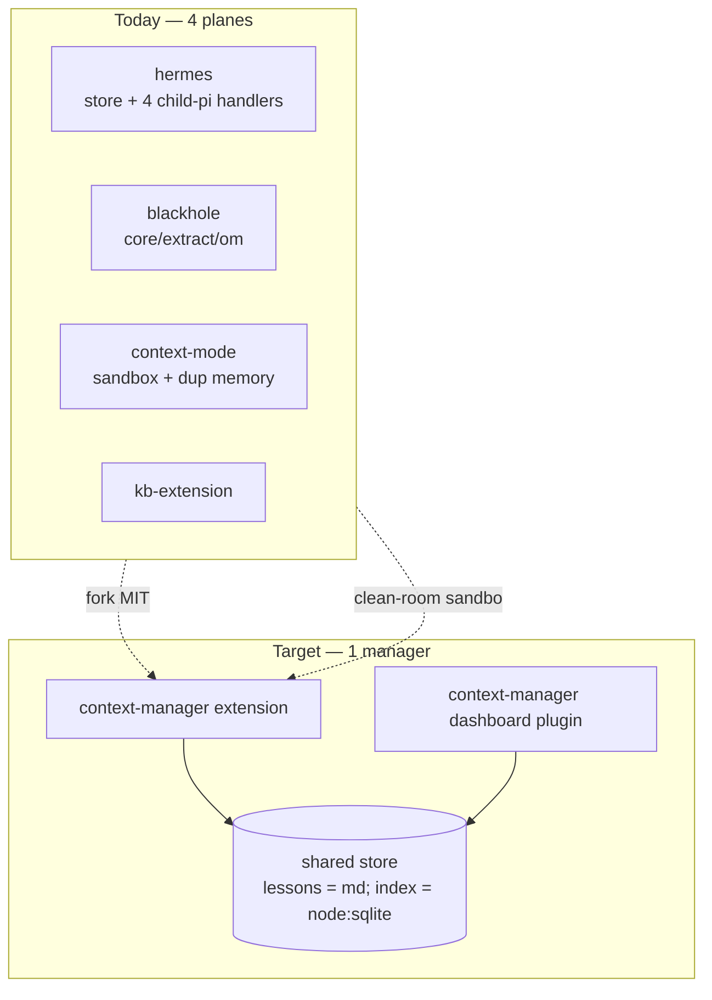
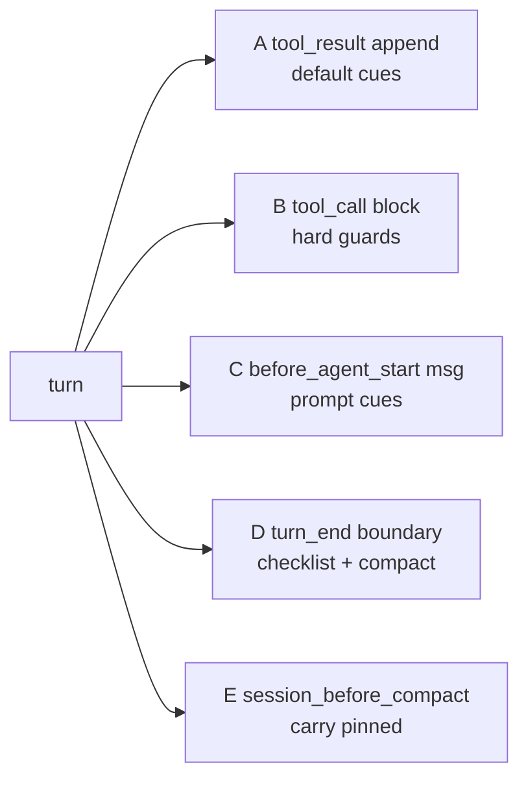
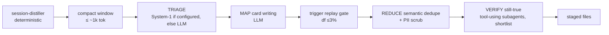

# Unified Context Manager — Exploration Dossier

> Research artifact. Explore-mode, no change / no impl.
> Status: **exploration in progress**. Supersedes-direction for `openspec/changes/consolidate-retrieval-planes` (now marked SUPERSEDED; umbrella change `unify-context-manager` drafted).
> Goal: one unified context-manager pi extension + one dashboard plugin, replacing pi-hermes-memory, pi-blackhole, context-mode, kb-extension (+ plugins `hermes-memory-plugin`, `blackhole-plugin`, `kb-plugin`).
> Scope: architecture + inventory + spikes only. No code, no spec. Storage model RESOLVED (§14).
> Date: 2026-09-24.

---

## 1. Goal + Decisions So Far

Primary target: **MODEL CONFUSION** — 3 session-search tools, 3 prompt injections. RAM/disk wins = bonus, not the driver.

Decisions (user answers, this session):

| # | Decision | Detail |
|---|---|---|
| D1 | Migration = big-bang fork | Fork hermes + blackhole (both MIT) into ONE package. |
| D2 | context-mode = clean-room re-implement sandbox only | Keep `ctx_execute` / `ctx_execute_file` / `ctx_batch_execute`. Drop rest. Elastic-2.0 license forbids porting code. |
| D3 | Web fetch dropped | Drop `ctx_fetch_and_index`. pi-web-access stays sole ingestion. Manager taps `tool_result` of `fetch_content` / `web_search` / `source_check` → persistent `web` scope. |
| D4 | Old tool names = aliases one release | Deactivated from model view via `pi.setActiveTools`. |
| D5 | Distillation pipelines stay separate | Keep hermes + blackhole pipelines separate inside package, for now (user choice). |
| D6 | Trigger authoring = explicit | Agent writes triggers explicitly when writing a lesson. No auto-derivation from prose. |
| D7 | Supersede `consolidate-retrieval-planes` | New change `unify-context-manager` (drafted, see below). That proposal rejected fork (its Alt 4) + declared shim-over-third-party-store its top risk (D3); the fork removes the shim. |
| D8 | Storage model RESOLVED | ONE FILE PER LESSON (md + YAML frontmatter) = canonical; kb indexes it; stats in disposable `node:sqlite`. Full decision §14. |

Umbrella change drafted: `openspec/changes/unify-context-manager` (proposal + design, skip_specs; phases 1–6 = kernel, forks, lessons-and-cues, exec-and-web, lesson-miner, plugin-cutover). `consolidate-retrieval-planes` marked SUPERSEDED.

---

## 2. Inventory (Measured 2026-09-24)

| Package | Version | License | LOC | Engine | Store |
|---|---|---|---|---|---|
| pi-hermes-memory | 0.9.9 | MIT | ~17.0k TS | better-sqlite3 | `~/.pi/agent/pi-hermes-memory` 186 MB + `projects-memory` 14 MB |
| pi-blackhole | 0.5.6 | MIT | ~32.7k TS | none (session JSONL `custom` entries) | `~/.pi/agent/pi-blackhole` 2.7 MB |
| context-mode | 1.0.169 | Elastic-2.0 | compiled only | better-sqlite3 + MCP SDK | `~/.pi/context-mode` + stray `~/.claude/context-mode` 383 MB |
| kb + kb-extension | ours | MIT | ~8.1k | node:sqlite | repo index |

- 33 pi processes running, avg RSS ~148 MB. context-mode MCP bridge = 16 child procs, 616 MB RSS total.
- Hook overlap: `before_agent_start` (hermes, ctx, kb); `session_before_compact` (hermes, blackhole, ctx); `context` (blackhole, ctx); `tool_result` capture (hermes, ctx, kb); `tool_call` guard (ctx, kb).
- Session-search tools: hermes `session_search`, blackhole `recall`, ctx `ctx_search`.
- hermes, ctx, kb ALL REPLACE `systemPrompt` in `before_agent_start` → prompt-cache churn. pi docs recommend `systemPromptOptions` sections / deltas instead.

---

## 3. context-mode Anatomy

Adapter path: `build/adapters/pi/extension.js`.

Usage (from `docs/context-mode-roi-report.md`, 623 transcripts): sandbox ~4,427 calls = **97%**; retrieval ~108 (2%); `ctx_fetch_and_index` 12.

| # | Piece | Verdict |
|---|---|---|
| 1 | Sandbox exec | KEEP (clean-room) |
| 2 | fetch_and_index | drop |
| 3 | content index `ctx_index` / `ctx_search` | → kb store scope |
| 4 | `tool_call` Bash guard blocking curl/fetch/requests | fold into kb guard |
| 5 | `tool_result` + `before_provider_response` + `turn_end` event capture | DROP (3rd copy) |
| 6 | `before_agent_start` routing line + `<active_memory>` ~500 tok | DROP |
| 7 | `context` hook pushing synthetic user msg | DROP |
| 8 | `session_before_compact` resume snapshot | DROP |
| 9 | MCP bridge child | DROP → native tools |
| 10 | admin stats / doctor / upgrade / purge / insight | drop |

Finding: pieces 5–8 = a full parallel session-memory system duplicating blackhole.

---

## 4. blackhole Anatomy

Itself a merge of pi-vcc + pi-observational-memory.

| Dir | LOC | Content | Verdict |
|---|---|---|---|
| `core/` | 5.6k | deterministic compaction | KEEP |
| `extract/` | 2.3k | extraction | KEEP |
| `om/` | 7.0k | Observer / Reflector / Dropper in-process LLM workers | KEEP (pipeline) |
| `agents/` | 1.5k | worker agents | |
| `ledger/` | 1.3k | session JSONL custom entries (`om.observations.recorded` etc.) | |
| `project-recall/` | 2.8k | rescans session JSONL dirs | fold into manager |
| `tools/recall.ts` | 0.5k | recall tool | alias |
| `pi-base/settings` + config | ~8.2k | TUI settings framework | DROP → dashboard plugin |
| `changelog/commands` | 1.8k | | mostly drop |

- `record_observations` / `record_reflections` / `drop_observations` = worker-agent-only tools, not main model surface.
- `om/inline-compaction.ts` ~1.0k monkeypatches `AgentSession.compact` prototype (recognizes pi 0.81/0.84 shapes, peer floor 0.85.1, fails closed).

---

## 5. hermes Anatomy

| Dir | LOC | Content | Verdict |
|---|---|---|---|
| `store/` | 7.7k | `MEMORY.md` / `USER.md` / `failures.md` + SQLite mirror, session-indexer (JSONL → `sessions.db` 186 MB), skill store, standing instructions, atomic-lock-coordinator | KEEP |
| `handlers/` | | background-review, correction-detector, session-flush, auto-consolidate — ALL spawn child `pi` processes (`execChildPrompt`) | KEEP pipeline |
| TUI commands | ~2.5k | | DROP |
| migrations | ~0.7k | | DROP |
| tools | 1.4k | | alias |

- Injects ~3.3 KB memory-policy every turn.
- Config `~/.pi/agent/hermes-memory-config.json`: `llmModelOverride` `opencode-go/deepseek-v4.1-flash`.

---

## 6. Duplication Matrix

| Axis | Count | Copies |
|---|---|---|
| Session JSONL re-read | **4×** | hermes session-indexer, blackhole project-recall, ctx hook capture, session-distiller |
| Background LLM distillation | **4 pipelines** | hermes (4 handlers), blackhole (3 workers), session-distiller, ctx (none) |
| Durable store formats | **4** | markdown+sqlite mirror, JSONL custom entries, per-session DBs, markdown+node:sqlite |

- ~12k LOC droppable at fork time (TUI settings, changelog, migrations, TUI commands) → **fork ≈ 30k LOC, not 50k**.



---

## 7. Memory Files Are Write-Only Today

| File | Size | Injected? |
|---|---|---|
| `projects-memory/pi-agent-dashboard/MEMORY.md` | 272 KB, 263 entries | no |
| `pi-hermes-memory/MEMORY.md` | 25 KB, 34 entries | no |
| `USER.md` | 27 KB, 49 entries | no |
| `failures.md` | 408 KB, 466 entries | only ≤5 failures ≤7d |

- hermes `memoryMode: "policy-only"`. Files 10–100× over char ceilings.
- Census (from `consolidate-retrieval-planes` proposal): **461 memory writes vs 66 `memory_search` reads / 504 conversations (~7:1)**.
- Global `failures.md` holds mixed-scope content (contacts, Apple Mail, doc-engine) — general lesson log, not failures.
- Tags: 353/812 untagged, tool-quirk 316, insight 87, correction 31, failure 12, convention 12, preference 1. 68/812 look like status/episodic entries (`COMPLETE`, commit hashes).

---

## 8. External Research

| Source | Finding |
|---|---|
| **Delivery, Not Storage** (arXiv 2607.20972) | Voluntary memory use ~0 (0 memory ops / 114 turns, pre-seeded store). Deterministic harness injection delivered every seeded run, zero false alarms. 39% intra-session re-reads re-buy pre-compaction content. Facts in conversation vanish at first compaction, absent 106/108 compactions. Harness-store facts survive 138 compact-resumes. Quote: "Delivery, not storage, is the product." |
| **Proactive Memory Agent** (arXiv 2607.08716) | Selective intervention beats passive bank exposure, always-on injection, general retrieval. +8.3 pp Terminal-Bench 2.0, +6.8 pp τ²-Bench. |
| **Retrieval vs Utilization** (arXiv 2603.02473, ICLR'26 MemAgents WS) | Retrieval method spread 20 pts (57.1% → 77.2%, hybrid rerank best) vs 3–8 pts across write strategies. Raw chunks (zero LLM calls) match/beat Mem0-extraction + MemGPT-summarization. |
| **Letta — "Is a Filesystem All You Need?"** (letta.com/blog/benchmarking-ai-agent-memory) | Filesystem tools + iterative search 74.0% LoCoMo (GPT-4o mini) vs Mem0 reported 68.5%. Simple familiar tools win. |
| **Harness the Memory** (arXiv 2608.15008) | No substrate dominates. Excessive retrieval harms sequential decision-making. |

Verdict:
- Drop curated files as model-facing memory ✔
- "search tools suffice" ✘ — need harness-owned delivery
- kb read-guard = existing cue-anchored example

---

## 9. pi-web-access vs ctx_fetch_and_index

| Axis | pi-web-access 0.30.0 (MIT, ~30k LOC) | context-mode fetch_and_index |
|---|---|---|
| Extraction | readability, PDF+OCR, GitHub clone/issues/PRs, YouTube, video frames, RSC, cookie `authFetch` | turndown HTML→md |
| Security | SSRF protection | — |
| Providers | 30+ search providers, `source_check` citations, curator | single fetch |
| Cache | `~/.pi/agent/web-search-cache` TTL 1 h (`CACHE_TTL_MS`), 128 entries / 128 MB | 24 h cache / 14-day retention |
| Retrieval | responseId + findText (exact/case-insensitive/fuzzy, 400-ch windows), offset/limit, answer mode; no cross-page ranked search | BM25+trigram RRF cross-source |

Decision: web-access ingests; manager taps `tool_result` and indexes into a persistent `web` scope.

---

## 10. Delivery Channels (pi 0.87.1 `dist/core/extensions/types.d.ts`)

| Channel | Result type | Use |
|---|---|---|
| A. `tool_result` → content append | `ToolResultEventResult.content` | default cue delivery; adjacent; tail = cache-safe |
| B. `tool_call` → block+reason | `ToolCallEventResult` | hard guards only |
| C. `before_agent_start` → message | `BeforeAgentStartEventResult.message` | prompt-matched cues |
| C′. `before_agent_start` → `systemPrompt` | same | pinned tier only (cache-busting) |
| D. `turn_end` / `agent_before_settle` → entries + continue | `BoundaryResult` | pre-settle checklist, mid-run compaction |
| E. `session_before_compact` → compaction | `SessionBeforeCompactResult` | carry pinned/cued facts through compaction |



---

## 11. Trigger Vocabulary + Lesson Schema (Draft)

Trigger kinds:
`path(glob)` · `command(pattern)` · `error(pattern)` · `tool(name, argPattern?)` · `symbol(name)` · `prompt(terms, BM25≥θ)` · `event(session_start | post_compact | model | before_settle)` · `behaviour(grep-without-kb | repeat-failure | reread-after-compact)`.

```ts
interface Lesson {
  id: string;
  kind: "preference" | "convention" | "gotcha" | "failure-fix" | "guard";
  scope: "global" | { project: string };
  card: string;            // ≤200 ch — what gets delivered
  body: string;            // full text — context_get(id)
  triggers: Trigger[];     // OR-ed; empty ⇒ pull-only
  severity: "hint" | "warn" | "block";
  provenance: { sessionId: string; created: string };
  stats: { fired: number; lastFired?: string; followed?: number };
}
```

Firing policy:
- Silent default.
- Once per lesson per session per compaction epoch.
- ≤2 cards / ~600 ch per turn.
- Block only `command` / `tool`.
- Precompiled matchers at `session_start`.
- Track `fired` + `followed`.

Observed false positive: kb guard fired ~6× while reading third-party `~/.pi/agent/npm/node_modules/` (not kb-indexed) → detector must require target path inside indexed root.

Observed tool cues this session:
- `mcpScript` → `tools.call('get_search_content')` fails "native Pi tool".
- `ctx_execute` python sandbox `HOME`/cwd differs → `os.walk(~/.pi/...)` returned 0.

---

## 12. Spike 1 — Compaction Prerequisite ALREADY MET

- pi 0.87.0 (2026-09-21) CHANGELOG: actionable `turn_end` / `agent_before_settle`; return `{ entries: [...event.entries, draft], continue: true }`.
- `CompactionEntryDraft { type:"compaction", summary, firstKeptEntryId: string|null, details?, usage? }` at `types.d.ts:593`; `SessionBoundaryDraft = Custom | CustomMessage | ContextEdit | Compaction`.
- Public exports: `findCutPoint`, `shouldCompact`, `estimateTokens`, `calculateContextTokens`; `prepareCompaction` NOT in root barrel.
- blackhole inline-compaction purpose (`om/inline-compaction.ts:794`): "Run Pi's native compaction pipeline at an awaited `turn_end` boundary without aborting the active agent run" → now official API. Monkeypatch retirable. Blackhole summary deterministic → computable inside boundary handler, no LLM.

---

## 13. Spike 2 — Trigger Derivation Dry-Run + Replay

Scripts at `/tmp/cue-spike/`, **not committed** (deleted after recording).

- Auto-derived triggers from 812 entries (path/command/error/tool regexes); replay over this repo's pi session JSONL (`~/.pi/agent/sessions/--Users-robson-Project-pi-agent-dashboard--/`, 1109 files).

Naive (80 recent sessions, 10,598 tool events):
- unique lessons fired/session median **117**, p90 180, max 328.
- error triggers on real errors 59/1401 (4%).
- 22 triggers fire in >25% sessions (`ask_user`, `kb_search`, `git status`, `spec.md`, …).
- precision ~5–15%.

Strict (df ≤3% calibrated on 240 older sessions, eval 80 recent; errors gated on `isError`; tool-name-only dropped):
- median **2**, p90 20, max 41.
- 29/80 sessions zero fires.
- 514 fires (path 197, command 271, error 46).
- hand-judged 30 sample → 7 TP, 4 plausible, 4 weak, 15 FP ⇒ precision ~25–35%.

TP examples:
- `openspec validate --change` → "`validate` does NOT accept `--change`".
- `npm run quality:changed` → "`--changed` resolves vs LOCAL default branch".
- `npx playwright install` → `score_mockup` Executable missing.
- path `packages/server/src/auth/provider-auth-storage.ts` → `_buildAuthStatus` fact.

FP modes:
- incidental token mentions.
- status/episodic entries fired as lessons.
- generic path suffix (`src/config.ts`).
- semantic duplicates (`biome --changed` ×3, `score_mockup` ×2; lexical 3-gram Jaccard≥0.25 finds only 5 pairs).

Conclusions:
- prose-derived triggers below bar → explicit agent-authored triggers (D6).
- rarity (df) filter = strongest lever (~60× volume cut) → reuse replay as write-time validator + periodic self-audit.
- import needs triage (archive status entries, semantic dedupe, re-kind, triggers only where precise cue exists).
- prompt-triggers untested.

---

## 14. Storage Model — RESOLVED

Four data classes. Only lessons = ours to author.

| Data | Canonical | Our role |
|---|---|---|
| repo docs / code | git working tree | index (kb) |
| session history incl. blackhole observations | pi session JSONL | index; hermes `sessions.db` = copy (1,960 sessions, 45,635 messages) |
| web content | pi-web-access cache (1 h TTL) | index row = copy |
| lessons / pinned / skills | ONE FILE PER LESSON (md + YAML frontmatter) | author |

- Session history: user chose KEEP a copy for speed → copy becomes the ONE unified `node:sqlite` FTS index, not a separate better-sqlite3 DB.
- Lesson storage = L2: `<id>.md` + frontmatter (`kind`, `scope`, `triggers`, `severity`, `card`). kb indexes via existing `kb-frontmatter-structural-indexing` (typed filters / facets).
- Stats (`fired` / `followed`) in disposable `node:sqlite` (`~/.pi/agent/context/stats.db`).
- Locations: project → `<repo>/.pi/lessons/<id>.md` (team-shared in-repo by DEFAULT, reviewed via git/PR); global → `~/.pi/agent/lessons/<id>.md` (personal).
- Project identity = git common dir (worktrees share parent lessons); fallback `realpath(cwd)`.

Evidence vs hermes markdown-canonical + SQLite-mirror:

- `/memory-sync-markdown` reconciler; `atomic-lock-coordinator.ts` 375 LOC + `markdown-mutation-lock.ts`; 80 `.MEMORY.md.recovery-*` files; `projects-memory/` 40 dirs, 25 worktree-named, 13 empty (basename identity); single 272 KB file → whole-file rewrites.
- One-file-per-lesson removes shared-file lock + reconcile (~1k LOC hermes).

Rejected: L1 SQLite-canonical (not diffable / shareable), L3 JSONL event log (append atomicity, stats noise).

Team-shared default ⇒ PII/secret scrub mandatory before write (global `failures.md` held colleague emails); hermes `store/content-scanner.ts` = starting point.

---

## 15. Retrospective Lesson Miner (Design)

- User-facing tool: transform OLD session JSONL → lessons retrospectively. Command/skill e.g. `/lessons mine [--project|--all] [--since] [--n 2]` + `/lessons import-hermes`. Dry-run default. Dashboard background job + progress + review screen.
- Stage 1 deterministic: existing `packages/session-distiller` (ours, ~1.2k LOC, no LLM). Dry-run `--n 1` over this repo: 1.5 s, 451 sessions, 5,258 candidates — fault 309 (72 recur ≥2), user_correction 214 (17), ask_user_decision 669 (30), procedure 1,547 (noise), documentation 2,519 (noise). Artifact body = stub → needs LLM stage.
- Evidence-derived triggers: fault pairs carry literal failing command + error text → trigger from observed event, not prose (fixes spike-2 precision).

Pipeline:



- Executor (user choice): parallel subagents for ALL LLM stages; bounded by EXISTING `maxConcurrentSubagents` (`packages/shared/src/config.ts`, default 2, `0` = disabled, malformed = uncapped fail-open) + admission gate `packages/extension/src/subagent-fanout-admission.ts` (+ optional `subagentSaturation` `eventLoopDelayMs` / `cpuPercent` / `loadAvg1m`) + heap coupling `packages/shared/src/heap-limits.ts` (`perChildMb = maxOldSpaceMb/(cap+1)`). No new setting. Batch windows per subagent (e.g. ~20) — cap 2 makes batching matter.
- Review gate (user choice): auto-accept above confidence threshold, review rest.
- Save accepted/rejected triage decisions as labelled dataset (user: yes) → future System-1 fine-tuning.
- Volume est. (this repo): ~1.2k windows × 4–8k tok ≈ 5–10M input tok; `--n 2` gate cuts ~10×. $ not priced.

---

## 16. System-1 Tier (Typed Decision Models)

- User idea: selectable "System 1" triage models. FALLBACK RULE = when no System-1 endpoint configured → pure LLM triage (config-level switch, not per-item).
- All three speak `POST /v1/systemone` (TypeSafe spec) → one adapter.

| | Jev (TypeSafe) | Von (wfzyx/von) | Laya (NandhaKishorM/laya) |
|---|---|---|---|
| license | proprietary, cloud-only, early access | Apache-2.0 | Apache-2.0 |
| run | API | Python server `/v1/systemone` `/v1/models` or in-process; `von-sdk` TS = drop-in for `@typesafe-ai/sdk` | `laya[serve]` `/v1/systemone`; `laya-ts` ONNX in-process Node (no Python) |
| hw | — | CUDA/ROCm/MPS/OpenVINO/CPU | CUDA/CPU; Node CPU/CUDA; browser WebGPU/WASM |
| vendor acc | jabr v2 96.6% | jabr v2 72.0%; JevBench hard 38.7% | typed decisions 0.362 base → 0.766 fine-tuned |

- Modes to support (user: all three): remote endpoint URL+key; dashboard-managed local server (von / `laya[serve]` via uv or Docker); in-process `laya-ts`.
- Runtime use (user: yes): cue relevance gate at `tool_call` / `tool_result` when configured.
- Pitfall: `von-sdk` examples default port 8000 = dashboard port → pick another.
- Sources: `typesafe.ai/blog/introducing-system-one-models-and-jev`; `github.com/wfzyx/von`; `github.com/NandhaKishorM/laya`.

---

## 17. Spike 3 — Triage Bake-Off

Scripts at `/tmp/von-spike/`, **not committed** (deleted after recording). Identical harness for all three arms: same 50 windows, same reference labels, analysis script `/tmp/von-spike/analyze.py`.

- Host: Apple M5 Pro, 48 GB, MPS. Von 1.2.2 (torch 2.14, weights von-1.2.0), Laya 0.3.20 (english checkpoint), isolated uv venv py3.12.
- 50 windows from this repo's session JSONL (strata: 20 fault, 12 correction, 8 ask_user decision, 10 routine; avg 816 chars). Reference labels = `anthropic/claude-opus-5` subagent (proxy, not human): 12/50 lessons (fault 7, correction 3, decision 1, routine 1). Ref kinds: routine 20, status 18, convention 6, gotcha 5, preference 1.
- Questions: `is_lesson` (noul), `kind` (choice 6), `scope` (choice 2), `cue` (choice over deterministic candidates), `sensitive` (noul); reframed variant = concrete 4-way choice, score `1−P(routine)`.

| metric | Von 1.2.2 | Laya 0.3.20 | LLM deepseek-v4.1-flash |
|---|---|---|---|
| is_lesson AUC | 0.425 | 0.616 | 0.951 |
| reframed AUC (concrete 4-way criteria) | 0.679 | 0.500 | — |
| is_lesson range min/med/max | 0.21/0.36/0.52 | 0.10/0.63/0.90 | 0.05/0.30/0.85 |
| best precision @ recall≥0.9 | 0.24 (keeps 50/50) | 0.24 (keeps 45/50) | 0.69 (th 0.50, keeps 16) |
| kind agree all/lessons | 0.14/0.42 | 0.20/0.25 | 0.54/0.50 |
| scope agree all/lessons | 0.64/0.58 | 0.70/0.92 | 0.76/0.58 |
| cue agree all/lessons | 0.58/0.50 | 0.58/0.58 | 0.76/0.92 |
| sensitive AUC (1 regex positive, not meaningful) | 0.17 | 0.18 | 0.46 |
| top kind | convention ×33 | failure_fix ×26 | gotcha ×19 |

Runtime (Apple M5 Pro, MPS, in-process, both auto-select `mps`):

| | Von | Laya |
|---|---|---|
| first run (download+compile) | 39.3 s | 12.8 s |
| warm load | 3.2 s | 3.0 s |
| 5-question pass median/p90 | 270/440 ms | 117/155 ms |
| 1-question median/p90 | 52/79 ms | 59/79 ms |
| max RSS / peak footprint | 0.8 GB / 4.0 GB | 3.0 GB / 4.5 GB |

- Verdict: neither System-1 model can pre-filter (`is_lesson`, recall ≥0.9 keeps 45–50/50). Laya ~2.3× faster than Von on 5 questions; Laya strong on scope (0.92 on lessons). 1-question latency ~55 ms → acceptable for runtime relevance gate (accuracy untested). Jev untested: no TypeSafe key on host. System-1 kept as pluggable opt-in; revisit via fine-tuning on miner-produced labels.
- Side finding: 5/12 reference lessons = context-mode Bash guard blocking inline curl/HTTP (w06, w11, w12, w16 + health-check retry) → block `reason` does not persist across sessions → agent re-hits same wall; cue on `command: curl` at `tool_call` + dedupe → one lesson. Live "delivery, not storage" evidence.

### Question-method study (decomposition / structure / aggregation)

Sources + guidance:
- `systemonemodels.org/guides/how-to-build-with-system-one-models`: include only context relevant to current questions; structure as nested JSON, point questions at specific values not the blob; ask explicit, narrow, specific, atomic questions; composite scoring = weights in code; speculative fan-out = parallel questions ~no latency cost.
- `systemonemodels.org/guides/choice-score-noul`: include "none of the above"; `noul` thresholded by distance from 0.5; noul yes/no descriptions.
- `huggingface.co/convaiinnovations/laya-typed-decisions`: fine-tuned on typed-decisions workflows incl. agent-trace observability; 0.766 vs base 0.362; agent-trace workflow 0.730; noul acc 0.857; still over-confident (ECE 0.213).
- `minimallysufficient.com/posts/llm-classification-is-feature-extraction`: treat classifier outputs as features; logistic regression on top → calibration + threshold control + added features (irony F1 0.747 → 0.779).
- Von + Laya both accept noul `criteria: {"true": …, "false": …}`; Laya accepts dict state.

Methods (same 50 windows, same reference; scripts `run_methods.py` / `analyze_methods.py`):
- M0 abstract noul, text blob.
- M1 structured JSON state (parsed fields: task ≤200 ch, `failed_call`, `error_output`, `agent_note`, `fixing_call`, `agent_did`, `user_replied`, `agent_asked`, `user_answered`) + yes/no descriptions.
- M2 11 atomic observable nouls in one call (`policy_block` +, `tool_quirk` +, `simple_mistake` −, `transient_state` −, `approach_changed` +, `user_rule` +, `user_redirect` +, `general_policy_answer` +, `routine_progress` −, `surprising_cause` +, `repo_specific` 0) → hand-signed sum, zero-shot.
- M3 LOOCV L2 logistic regression on M2 answers, ± deterministic features (stratum one-hot, log length, block-regex).

| method | Von 1.2.2 | Laya base | Laya typed-decisions |
|---|---|---|---|
| M0 abstract, blob | 0.425 | 0.616 | — |
| M1 structured + yes/no desc | 0.435 | 0.673 | 0.708 |
| M2 atomic signed sum | 0.706 | 0.658 | 0.689 |
| M3 LOOCV LR atomic | 0.577 | 0.511 | 0.327 |
| M3 LOOCV LR atomic+det | 0.489 | 0.458 | 0.336 |
| det only LOOCV LR | 0.463 | | |
| LLM deepseek-v4.1-flash | 0.951 | | |

Precision @ recall ≥0.9: Von M2 0.29 (keeps 41/50); Laya M1 0.27 (41/50); Laya-td M1 0.30 (37/50); Laya-td M2 0.28 (39/50); LLM 0.69 (16/50).

Latency (MPS): 1 noul ~47–52 ms all backends; 11 atomic nouls median Von 457 ms (p90 800), Laya 190 ms (p90 326), Laya-td 194 ms (p90 345).

Per-question AUC (Von / Laya / Laya-td): `surprising_cause` 0.68/0.63/0.70; `policy_block` 0.72/0.51/0.62; `user_redirect` 0.67/0.66/0.59; `tool_quirk` 0.62/0.52/0.65; `routine_progress` 0.32/0.43/0.38 (correct negative direction); `transient_state` 0.64/0.48/0.52 (wrong direction for Von).

Verdict:
- Decomposition lifts Von 0.43 → 0.71 zero-shot; structure + domain checkpoint lifts Laya 0.62 → 0.71.
- Learned aggregation fails at n=50 / 12 positives (overfit); needs miner-produced labels (likely hundreds).
- Still no viable pre-filter: best System-1 keeps 37–41/50 at recall 0.9 vs LLM 16/50.
- Design refinement (unify-context-manager D11): System-1 backends queried with decomposed atomic nouls over structured state, never one abstract judgement; LR aggregation re-evaluated once labelled dataset exists.
- Scratch (`/tmp/von-spike`, `/tmp/cue-spike`) deleted after recording; numbers above are the record.

---

## 18. Open Questions

1. Jev evaluation — needs TypeSafe key.
2. Fine-tune Laya/Von on miner labels — label count needed.
3. Runtime relevance-gate latency budget.
4. MAP card-writing quality spike still pending.
5. Prompt-trigger spike (BM25 cards vs real prompts) for `USER.md`-style preferences.
6. Distiller placement (in-process vs child `pi`) — current choice: keep both pipelines.
7. `followed` metric definition for path hints.
