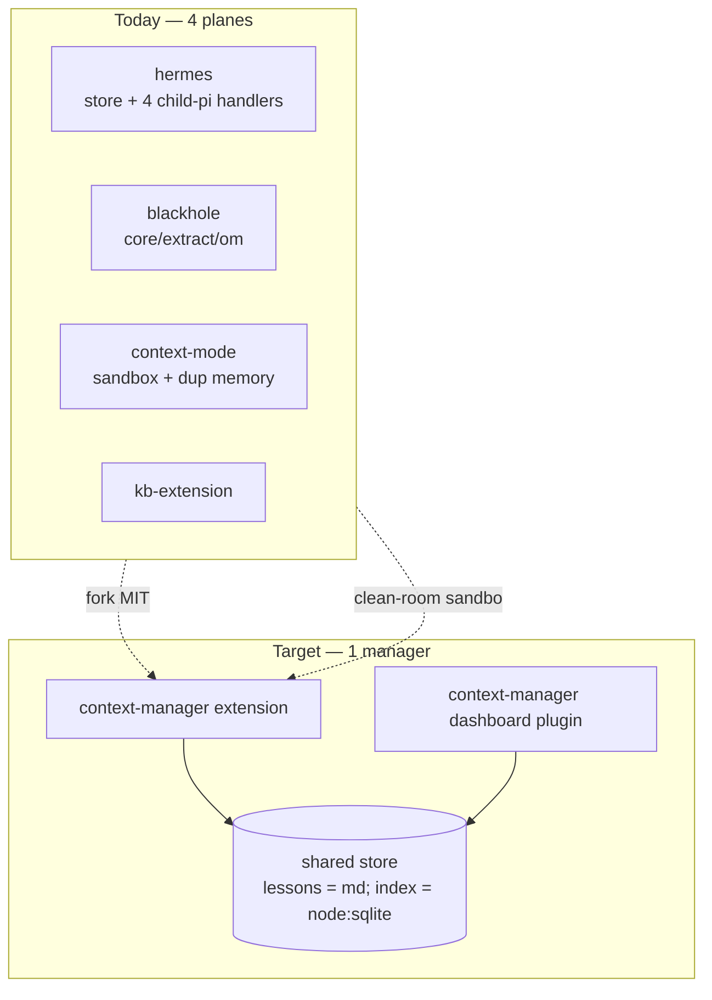
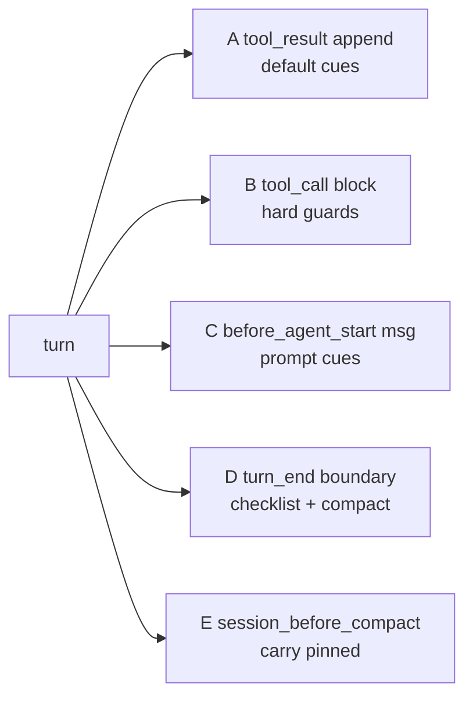
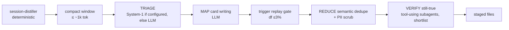

# Unified Context Manager — Exploration Dossier

> Research artifact. Explore-mode, no change / no impl.
> Status: **exploration in progress**. Supersedes-direction for `openspec/changes/consolidate-retrieval-planes` (now marked SUPERSEDED; umbrella change `unify-context-manager` drafted).
> Goal: one unified context-manager pi extension + one dashboard plugin, replacing pi-hermes-memory, pi-blackhole, context-mode, kb-extension (+ plugins `hermes-memory-plugin`, `blackhole-plugin`, `kb-plugin`).
> Scope: architecture + inventory + spikes only. No code, no spec. Storage model RESOLVED (§14).
> Date: 2026-09-24.

---

## 1. Goal + Decisions So Far

Primary target: **MODEL CONFUSION** — 3 session-search tools, 3 prompt injections. RAM/disk wins = bonus, not the driver.

Decisions (user answers, this session):

| # | Decision | Detail |
|---|---|---|
| D1 | Migration = big-bang fork | Fork hermes + blackhole (both MIT) into ONE package. |
| D2 | context-mode = clean-room re-implement sandbox only | Keep `ctx_execute` / `ctx_execute_file` / `ctx_batch_execute`. Drop rest. Elastic-2.0 license forbids porting code. |
| D3 | Web fetch dropped | Drop `ctx_fetch_and_index`. pi-web-access stays sole ingestion. Manager taps `tool_result` of `fetch_content` / `web_search` / `source_check` → persistent `web` scope. |
| D4 | Old tool names = aliases one release | Deactivated from model view via `pi.setActiveTools`. |
| D5 | Distillation pipelines stay separate | Keep hermes + blackhole pipelines separate inside package, for now (user choice). |
| D6 | Trigger authoring = explicit | Agent writes triggers explicitly when writing a lesson. No auto-derivation from prose. |
| D7 | Supersede `consolidate-retrieval-planes` | New change `unify-context-manager` (drafted, see below). That proposal rejected fork (its Alt 4) + declared shim-over-third-party-store its top risk (D3); the fork removes the shim. |
| D8 | Storage model RESOLVED | ONE FILE PER LESSON (md + YAML frontmatter) = canonical; kb indexes it; stats in disposable `node:sqlite`. Full decision §14. |

Umbrella change drafted: `openspec/changes/unify-context-manager` (proposal + design, skip_specs; phases 1–6 = kernel, forks, lessons-and-cues, exec-and-web, lesson-miner, plugin-cutover). `consolidate-retrieval-planes` marked SUPERSEDED.

---

## 2. Inventory (Measured 2026-09-24)

| Package | Version | License | LOC | Engine | Store |
|---|---|---|---|---|---|
| pi-hermes-memory | 0.9.9 | MIT | ~17.0k TS | better-sqlite3 | `~/.pi/agent/pi-hermes-memory` 186 MB + `projects-memory` 14 MB |
| pi-blackhole | 0.5.6 | MIT | ~32.7k TS | none (session JSONL `custom` entries) | `~/.pi/agent/pi-blackhole` 2.7 MB |
| context-mode | 1.0.169 | Elastic-2.0 | compiled only | better-sqlite3 + MCP SDK | `~/.pi/context-mode` + stray `~/.claude/context-mode` 383 MB |
| kb + kb-extension | ours | MIT | ~8.1k | node:sqlite | repo index |

- 33 pi processes running, avg RSS ~148 MB. context-mode MCP bridge = 16 child procs, 616 MB RSS total.
- Hook overlap: `before_agent_start` (hermes, ctx, kb); `session_before_compact` (hermes, blackhole, ctx); `context` (blackhole, ctx); `tool_result` capture (hermes, ctx, kb); `tool_call` guard (ctx, kb).
- Session-search tools: hermes `session_search`, blackhole `recall`, ctx `ctx_search`.
- hermes, ctx, kb ALL REPLACE `systemPrompt` in `before_agent_start` → prompt-cache churn. pi docs recommend `systemPromptOptions` sections / deltas instead.

---

## 3. context-mode Anatomy

Adapter path: `build/adapters/pi/extension.js`.

Usage (from `docs/context-mode-roi-report.md`, 623 transcripts): sandbox ~4,427 calls = **97%**; retrieval ~108 (2%); `ctx_fetch_and_index` 12.

| # | Piece | Verdict |
|---|---|---|
| 1 | Sandbox exec | KEEP (clean-room) |
| 2 | fetch_and_index | drop |
| 3 | content index `ctx_index` / `ctx_search` | → kb store scope |
| 4 | `tool_call` Bash guard blocking curl/fetch/requests | fold into kb guard |
| 5 | `tool_result` + `before_provider_response` + `turn_end` event capture | DROP (3rd copy) |
| 6 | `before_agent_start` routing line + `<active_memory>` ~500 tok | DROP |
| 7 | `context` hook pushing synthetic user msg | DROP |
| 8 | `session_before_compact` resume snapshot | DROP |
| 9 | MCP bridge child | DROP → native tools |
| 10 | admin stats / doctor / upgrade / purge / insight | drop |

Finding: pieces 5–8 = a full parallel session-memory system duplicating blackhole.

---

## 4. blackhole Anatomy

Itself a merge of pi-vcc + pi-observational-memory.

| Dir | LOC | Content | Verdict |
|---|---|---|---|
| `core/` | 5.6k | deterministic compaction | KEEP |
| `extract/` | 2.3k | extraction | KEEP |
| `om/` | 7.0k | Observer / Reflector / Dropper in-process LLM workers | KEEP (pipeline) |
| `agents/` | 1.5k | worker agents | |
| `ledger/` | 1.3k | session JSONL custom entries (`om.observations.recorded` etc.) | |
| `project-recall/` | 2.8k | rescans session JSONL dirs | fold into manager |
| `tools/recall.ts` | 0.5k | recall tool | alias |
| `pi-base/settings` + config | ~8.2k | TUI settings framework | DROP → dashboard plugin |
| `changelog/commands` | 1.8k | | mostly drop |

- `record_observations` / `record_reflections` / `drop_observations` = worker-agent-only tools, not main model surface.
- `om/inline-compaction.ts` ~1.0k monkeypatches `AgentSession.compact` prototype (recognizes pi 0.81/0.84 shapes, peer floor 0.85.1, fails closed).

---

## 5. hermes Anatomy

| Dir | LOC | Content | Verdict |
|---|---|---|---|
| `store/` | 7.7k | `MEMORY.md` / `USER.md` / `failures.md` + SQLite mirror, session-indexer (JSONL → `sessions.db` 186 MB), skill store, standing instructions, atomic-lock-coordinator | KEEP |
| `handlers/` | | background-review, correction-detector, session-flush, auto-consolidate — ALL spawn child `pi` processes (`execChildPrompt`) | KEEP pipeline |
| TUI commands | ~2.5k | | DROP |
| migrations | ~0.7k | | DROP |
| tools | 1.4k | | alias |

- Injects ~3.3 KB memory-policy every turn.
- Config `~/.pi/agent/hermes-memory-config.json`: `llmModelOverride` `opencode-go/deepseek-v4.1-flash`.

---

## 6. Duplication Matrix

| Axis | Count | Copies |
|---|---|---|
| Session JSONL re-read | **4×** | hermes session-indexer, blackhole project-recall, ctx hook capture, session-distiller |
| Background LLM distillation | **4 pipelines** | hermes (4 handlers), blackhole (3 workers), session-distiller, ctx (none) |
| Durable store formats | **4** | markdown+sqlite mirror, JSONL custom entries, per-session DBs, markdown+node:sqlite |

- ~12k LOC droppable at fork time (TUI settings, changelog, migrations, TUI commands) → **fork ≈ 30k LOC, not 50k**.



---

## 7. Memory Files Are Write-Only Today

| File | Size | Injected? |
|---|---|---|
| `projects-memory/pi-agent-dashboard/MEMORY.md` | 272 KB, 263 entries | no |
| `pi-hermes-memory/MEMORY.md` | 25 KB, 34 entries | no |
| `USER.md` | 27 KB, 49 entries | no |
| `failures.md` | 408 KB, 466 entries | only ≤5 failures ≤7d |

- hermes `memoryMode: "policy-only"`. Files 10–100× over char ceilings.
- Census (from `consolidate-retrieval-planes` proposal): **461 memory writes vs 66 `memory_search` reads / 504 conversations (~7:1)**.
- Global `failures.md` holds mixed-scope content (contacts, Apple Mail, doc-engine) — general lesson log, not failures.
- Tags: 353/812 untagged, tool-quirk 316, insight 87, correction 31, failure 12, convention 12, preference 1. 68/812 look like status/episodic entries (`COMPLETE`, commit hashes).

---

## 8. External Research

| Source | Finding |
|---|---|
| **Delivery, Not Storage** (arXiv 2607.20972) | Voluntary memory use ~0 (0 memory ops / 114 turns, pre-seeded store). Deterministic harness injection delivered every seeded run, zero false alarms. 39% intra-session re-reads re-buy pre-compaction content. Facts in conversation vanish at first compaction, absent 106/108 compactions. Harness-store facts survive 138 compact-resumes. Quote: "Delivery, not storage, is the product." |
| **Proactive Memory Agent** (arXiv 2607.08716) | Selective intervention beats passive bank exposure, always-on injection, general retrieval. +8.3 pp Terminal-Bench 2.0, +6.8 pp τ²-Bench. |
| **Retrieval vs Utilization** (arXiv 2603.02473, ICLR'26 MemAgents WS) | Retrieval method spread 20 pts (57.1% → 77.2%, hybrid rerank best) vs 3–8 pts across write strategies. Raw chunks (zero LLM calls) match/beat Mem0-extraction + MemGPT-summarization. |
| **Letta — "Is a Filesystem All You Need?"** (letta.com/blog/benchmarking-ai-agent-memory) | Filesystem tools + iterative search 74.0% LoCoMo (GPT-4o mini) vs Mem0 reported 68.5%. Simple familiar tools win. |
| **Harness the Memory** (arXiv 2608.15008) | No substrate dominates. Excessive retrieval harms sequential decision-making. |

Verdict:
- Drop curated files as model-facing memory ✔
- "search tools suffice" ✘ — need harness-owned delivery
- kb read-guard = existing cue-anchored example

---

## 9. pi-web-access vs ctx_fetch_and_index

| Axis | pi-web-access 0.30.0 (MIT, ~30k LOC) | context-mode fetch_and_index |
|---|---|---|
| Extraction | readability, PDF+OCR, GitHub clone/issues/PRs, YouTube, video frames, RSC, cookie `authFetch` | turndown HTML→md |
| Security | SSRF protection | — |
| Providers | 30+ search providers, `source_check` citations, curator | single fetch |
| Cache | `~/.pi/agent/web-search-cache` TTL 1 h (`CACHE_TTL_MS`), 128 entries / 128 MB | 24 h cache / 14-day retention |
| Retrieval | responseId + findText (exact/case-insensitive/fuzzy, 400-ch windows), offset/limit, answer mode; no cross-page ranked search | BM25+trigram RRF cross-source |

Decision: web-access ingests; manager taps `tool_result` and indexes into a persistent `web` scope.

---

## 10. Delivery Channels (pi 0.87.1 `dist/core/extensions/types.d.ts`)

| Channel | Result type | Use |
|---|---|---|
| A. `tool_result` → content append | `ToolResultEventResult.content` | default cue delivery; adjacent; tail = cache-safe |
| B. `tool_call` → block+reason | `ToolCallEventResult` | hard guards only |
| C. `before_agent_start` → message | `BeforeAgentStartEventResult.message` | prompt-matched cues |
| C′. `before_agent_start` → `systemPrompt` | same | pinned tier only (cache-busting) |
| D. `turn_end` / `agent_before_settle` → entries + continue | `BoundaryResult` | pre-settle checklist, mid-run compaction |
| E. `session_before_compact` → compaction | `SessionBeforeCompactResult` | carry pinned/cued facts through compaction |



---

## 11. Trigger Vocabulary + Lesson Schema (Draft)

Trigger kinds:
`path(glob)` · `command(pattern)` · `error(pattern)` · `tool(name, argPattern?)` · `symbol(name)` · `prompt(terms, BM25≥θ)` · `event(session_start | post_compact | model | before_settle)` · `behaviour(grep-without-kb | repeat-failure | reread-after-compact)`.

```ts
interface Lesson {
  id: string;
  kind: "preference" | "convention" | "gotcha" | "failure-fix" | "guard";
  scope: "global" | { project: string };
  card: string;            // ≤200 ch — what gets delivered
  body: string;            // full text — context_get(id)
  triggers: Trigger[];     // OR-ed; empty ⇒ pull-only
  severity: "hint" | "warn" | "block";
  provenance: { sessionId: string; created: string };
  stats: { fired: number; lastFired?: string; followed?: number };
}
```

Firing policy:
- Silent default.
- Once per lesson per session per compaction epoch.
- ≤2 cards / ~600 ch per turn.
- Block only `command` / `tool`.
- Precompiled matchers at `session_start`.
- Track `fired` + `followed`.

Observed false positive: kb guard fired ~6× while reading third-party `~/.pi/agent/npm/node_modules/` (not kb-indexed) → detector must require target path inside indexed root.

Observed tool cues this session:
- `mcpScript` → `tools.call('get_search_content')` fails "native Pi tool".
- `ctx_execute` python sandbox `HOME`/cwd differs → `os.walk(~/.pi/...)` returned 0.

---

## 12. Spike 1 — Compaction Prerequisite ALREADY MET

- pi 0.87.0 (2026-09-21) CHANGELOG: actionable `turn_end` / `agent_before_settle`; return `{ entries: [...event.entries, draft], continue: true }`.
- `CompactionEntryDraft { type:"compaction", summary, firstKeptEntryId: string|null, details?, usage? }` at `types.d.ts:593`; `SessionBoundaryDraft = Custom | CustomMessage | ContextEdit | Compaction`.
- Public exports: `findCutPoint`, `shouldCompact`, `estimateTokens`, `calculateContextTokens`; `prepareCompaction` NOT in root barrel.
- blackhole inline-compaction purpose (`om/inline-compaction.ts:794`): "Run Pi's native compaction pipeline at an awaited `turn_end` boundary without aborting the active agent run" → now official API. Monkeypatch retirable. Blackhole summary deterministic → computable inside boundary handler, no LLM.

---

## 13. Spike 2 — Trigger Derivation Dry-Run + Replay

Scripts at `/tmp/cue-spike/`, **not committed** (deleted after recording).

- Auto-derived triggers from 812 entries (path/command/error/tool regexes); replay over this repo's pi session JSONL (`~/.pi/agent/sessions/--Users-robson-Project-pi-agent-dashboard--/`, 1109 files).

Naive (80 recent sessions, 10,598 tool events):
- unique lessons fired/session median **117**, p90 180, max 328.
- error triggers on real errors 59/1401 (4%).
- 22 triggers fire in >25% sessions (`ask_user`, `kb_search`, `git status`, `spec.md`, …).
- precision ~5–15%.

Strict (df ≤3% calibrated on 240 older sessions, eval 80 recent; errors gated on `isError`; tool-name-only dropped):
- median **2**, p90 20, max 41.
- 29/80 sessions zero fires.
- 514 fires (path 197, command 271, error 46).
- hand-judged 30 sample → 7 TP, 4 plausible, 4 weak, 15 FP ⇒ precision ~25–35%.

TP examples:
- `openspec validate --change` → "`validate` does NOT accept `--change`".
- `npm run quality:changed` → "`--changed` resolves vs LOCAL default branch".
- `npx playwright install` → `score_mockup` Executable missing.
- path `packages/server/src/auth/provider-auth-storage.ts` → `_buildAuthStatus` fact.

FP modes:
- incidental token mentions.
- status/episodic entries fired as lessons.
- generic path suffix (`src/config.ts`).
- semantic duplicates (`biome --changed` ×3, `score_mockup` ×2; lexical 3-gram Jaccard≥0.25 finds only 5 pairs).

Conclusions:
- prose-derived triggers below bar → explicit agent-authored triggers (D6).
- rarity (df) filter = strongest lever (~60× volume cut) → reuse replay as write-time validator + periodic self-audit.
- import needs triage (archive status entries, semantic dedupe, re-kind, triggers only where precise cue exists).
- prompt-triggers untested.

---

## 14. Storage Model — RESOLVED

Four data classes. Only lessons = ours to author.

| Data | Canonical | Our role |
|---|---|---|
| repo docs / code | git working tree | index (kb) |
| session history incl. blackhole observations | pi session JSONL | index; hermes `sessions.db` = copy (1,960 sessions, 45,635 messages) |
| web content | pi-web-access cache (1 h TTL) | index row = copy |
| lessons / pinned / skills | ONE FILE PER LESSON (md + YAML frontmatter) | author |

- Session history: user chose KEEP a copy for speed → copy becomes the ONE unified `node:sqlite` FTS index, not a separate better-sqlite3 DB.
- Lesson storage = L2: `<id>.md` + frontmatter (`kind`, `scope`, `triggers`, `severity`, `card`). kb indexes via existing `kb-frontmatter-structural-indexing` (typed filters / facets).
- Stats (`fired` / `followed`) in disposable `node:sqlite` (`~/.pi/agent/context/stats.db`).
- Locations: project → `<repo>/.pi/lessons/<id>.md` (team-shared in-repo by DEFAULT, reviewed via git/PR); global → `~/.pi/agent/lessons/<id>.md` (personal).
- Project identity = git common dir (worktrees share parent lessons); fallback `realpath(cwd)`.

Evidence vs hermes markdown-canonical + SQLite-mirror:

- `/memory-sync-markdown` reconciler; `atomic-lock-coordinator.ts` 375 LOC + `markdown-mutation-lock.ts`; 80 `.MEMORY.md.recovery-*` files; `projects-memory/` 40 dirs, 25 worktree-named, 13 empty (basename identity); single 272 KB file → whole-file rewrites.
- One-file-per-lesson removes shared-file lock + reconcile (~1k LOC hermes).

Rejected: L1 SQLite-canonical (not diffable / shareable), L3 JSONL event log (append atomicity, stats noise).

Team-shared default ⇒ PII/secret scrub mandatory before write (global `failures.md` held colleague emails); hermes `store/content-scanner.ts` = starting point.

---

## 15. Retrospective Lesson Miner (Design)

- User-facing tool: transform OLD session JSONL → lessons retrospectively. Command/skill e.g. `/lessons mine [--project|--all] [--since] [--n 2]` + `/lessons import-hermes`. Dry-run default. Dashboard background job + progress + review screen.
- Stage 1 deterministic: existing `packages/session-distiller` (ours, ~1.2k LOC, no LLM). Dry-run `--n 1` over this repo: 1.5 s, 451 sessions, 5,258 candidates — fault 309 (72 recur ≥2), user_correction 214 (17), ask_user_decision 669 (30), procedure 1,547 (noise), documentation 2,519 (noise). Artifact body = stub → needs LLM stage.
- Evidence-derived triggers: fault pairs carry literal failing command + error text → trigger from observed event, not prose (fixes spike-2 precision).

Pipeline:



- Executor (user choice): parallel subagents for ALL LLM stages; bounded by EXISTING `maxConcurrentSubagents` (`packages/shared/src/config.ts`, default 2, `0` = disabled, malformed = uncapped fail-open) + admission gate `packages/extension/src/subagent-fanout-admission.ts` (+ optional `subagentSaturation` `eventLoopDelayMs` / `cpuPercent` / `loadAvg1m`) + heap coupling `packages/shared/src/heap-limits.ts` (`perChildMb = maxOldSpaceMb/(cap+1)`). No new setting. Batch windows per subagent (e.g. ~20) — cap 2 makes batching matter.
- Review gate (user choice): auto-accept above confidence threshold, review rest.
- Save accepted/rejected triage decisions as labelled dataset (user: yes) → future System-1 fine-tuning.
- Volume est. (this repo): ~1.2k windows × 4–8k tok ≈ 5–10M input tok; `--n 2` gate cuts ~10×. $ not priced.

---

## 16. System-1 Tier (Typed Decision Models)

- User idea: selectable "System 1" triage models. FALLBACK RULE = when no System-1 endpoint configured → pure LLM triage (config-level switch, not per-item).
- All three speak `POST /v1/systemone` (TypeSafe spec) → one adapter.

| | Jev (TypeSafe) | Von (wfzyx/von) | Laya (NandhaKishorM/laya) |
|---|---|---|---|
| license | proprietary, cloud-only, early access | Apache-2.0 | Apache-2.0 |
| run | API | Python server `/v1/systemone` `/v1/models` or in-process; `von-sdk` TS = drop-in for `@typesafe-ai/sdk` | `laya[serve]` `/v1/systemone`; `laya-ts` ONNX in-process Node (no Python) |
| hw | — | CUDA/ROCm/MPS/OpenVINO/CPU | CUDA/CPU; Node CPU/CUDA; browser WebGPU/WASM |
| vendor acc | jabr v2 96.6% | jabr v2 72.0%; JevBench hard 38.7% | typed decisions 0.362 base → 0.766 fine-tuned |

- Modes to support (user: all three): remote endpoint URL+key; dashboard-managed local server (von / `laya[serve]` via uv or Docker); in-process `laya-ts`.
- Runtime use (user: yes): cue relevance gate at `tool_call` / `tool_result` when configured.
- Pitfall: `von-sdk` examples default port 8000 = dashboard port → pick another.
- Sources: `typesafe.ai/blog/introducing-system-one-models-and-jev`; `github.com/wfzyx/von`; `github.com/NandhaKishorM/laya`.

---

## 17. Spike 3 — Triage Bake-Off

Scripts at `/tmp/von-spike/`, **not committed** (deleted after recording). Identical harness for all three arms: same 50 windows, same reference labels, analysis script `/tmp/von-spike/analyze.py`.

- Host: Apple M5 Pro, 48 GB, MPS. Von 1.2.2 (torch 2.14, weights von-1.2.0), Laya 0.3.20 (english checkpoint), isolated uv venv py3.12.
- 50 windows from this repo's session JSONL (strata: 20 fault, 12 correction, 8 ask_user decision, 10 routine; avg 816 chars). Reference labels = `anthropic/claude-opus-5` subagent (proxy, not human): 12/50 lessons (fault 7, correction 3, decision 1, routine 1). Ref kinds: routine 20, status 18, convention 6, gotcha 5, preference 1.
- Questions: `is_lesson` (noul), `kind` (choice 6), `scope` (choice 2), `cue` (choice over deterministic candidates), `sensitive` (noul); reframed variant = concrete 4-way choice, score `1−P(routine)`.

| metric | Von 1.2.2 | Laya 0.3.20 | LLM deepseek-v4.1-flash |
|---|---|---|---|
| is_lesson AUC | 0.425 | 0.616 | 0.951 |
| reframed AUC (concrete 4-way criteria) | 0.679 | 0.500 | — |
| is_lesson range min/med/max | 0.21/0.36/0.52 | 0.10/0.63/0.90 | 0.05/0.30/0.85 |
| best precision @ recall≥0.9 | 0.24 (keeps 50/50) | 0.24 (keeps 45/50) | 0.69 (th 0.50, keeps 16) |
| kind agree all/lessons | 0.14/0.42 | 0.20/0.25 | 0.54/0.50 |
| scope agree all/lessons | 0.64/0.58 | 0.70/0.92 | 0.76/0.58 |
| cue agree all/lessons | 0.58/0.50 | 0.58/0.58 | 0.76/0.92 |
| sensitive AUC (1 regex positive, not meaningful) | 0.17 | 0.18 | 0.46 |
| top kind | convention ×33 | failure_fix ×26 | gotcha ×19 |

Runtime (Apple M5 Pro, MPS, in-process, both auto-select `mps`):

| | Von | Laya |
|---|---|---|
| first run (download+compile) | 39.3 s | 12.8 s |
| warm load | 3.2 s | 3.0 s |
| 5-question pass median/p90 | 270/440 ms | 117/155 ms |
| 1-question median/p90 | 52/79 ms | 59/79 ms |
| max RSS / peak footprint | 0.8 GB / 4.0 GB | 3.0 GB / 4.5 GB |

- Verdict: neither System-1 model can pre-filter (`is_lesson`, recall ≥0.9 keeps 45–50/50). Laya ~2.3× faster than Von on 5 questions; Laya strong on scope (0.92 on lessons). 1-question latency ~55 ms → acceptable for runtime relevance gate (accuracy untested). Jev untested: no TypeSafe key on host. System-1 kept as pluggable opt-in; revisit via fine-tuning on miner-produced labels.
- Side finding: 5/12 reference lessons = context-mode Bash guard blocking inline curl/HTTP (w06, w11, w12, w16 + health-check retry) → block `reason` does not persist across sessions → agent re-hits same wall; cue on `command: curl` at `tool_call` + dedupe → one lesson. Live "delivery, not storage" evidence.

### Question-method study (decomposition / structure / aggregation)

Sources + guidance:
- `systemonemodels.org/guides/how-to-build-with-system-one-models`: include only context relevant to current questions; structure as nested JSON, point questions at specific values not the blob; ask explicit, narrow, specific, atomic questions; composite scoring = weights in code; speculative fan-out = parallel questions ~no latency cost.
- `systemonemodels.org/guides/choice-score-noul`: include "none of the above"; `noul` thresholded by distance from 0.5; noul yes/no descriptions.
- `huggingface.co/convaiinnovations/laya-typed-decisions`: fine-tuned on typed-decisions workflows incl. agent-trace observability; 0.766 vs base 0.362; agent-trace workflow 0.730; noul acc 0.857; still over-confident (ECE 0.213).
- `minimallysufficient.com/posts/llm-classification-is-feature-extraction`: treat classifier outputs as features; logistic regression on top → calibration + threshold control + added features (irony F1 0.747 → 0.779).
- Von + Laya both accept noul `criteria: {"true": …, "false": …}`; Laya accepts dict state.

Methods (same 50 windows, same reference; scripts `run_methods.py` / `analyze_methods.py`):
- M0 abstract noul, text blob.
- M1 structured JSON state (parsed fields: task ≤200 ch, `failed_call`, `error_output`, `agent_note`, `fixing_call`, `agent_did`, `user_replied`, `agent_asked`, `user_answered`) + yes/no descriptions.
- M2 11 atomic observable nouls in one call (`policy_block` +, `tool_quirk` +, `simple_mistake` −, `transient_state` −, `approach_changed` +, `user_rule` +, `user_redirect` +, `general_policy_answer` +, `routine_progress` −, `surprising_cause` +, `repo_specific` 0) → hand-signed sum, zero-shot.
- M3 LOOCV L2 logistic regression on M2 answers, ± deterministic features (stratum one-hot, log length, block-regex).

| method | Von 1.2.2 | Laya base | Laya typed-decisions |
|---|---|---|---|
| M0 abstract, blob | 0.425 | 0.616 | — |
| M1 structured + yes/no desc | 0.435 | 0.673 | 0.708 |
| M2 atomic signed sum | 0.706 | 0.658 | 0.689 |
| M3 LOOCV LR atomic | 0.577 | 0.511 | 0.327 |
| M3 LOOCV LR atomic+det | 0.489 | 0.458 | 0.336 |
| det only LOOCV LR | 0.463 | | |
| LLM deepseek-v4.1-flash | 0.951 | | |

Precision @ recall ≥0.9: Von M2 0.29 (keeps 41/50); Laya M1 0.27 (41/50); Laya-td M1 0.30 (37/50); Laya-td M2 0.28 (39/50); LLM 0.69 (16/50).

Latency (MPS): 1 noul ~47–52 ms all backends; 11 atomic nouls median Von 457 ms (p90 800), Laya 190 ms (p90 326), Laya-td 194 ms (p90 345).

Per-question AUC (Von / Laya / Laya-td): `surprising_cause` 0.68/0.63/0.70; `policy_block` 0.72/0.51/0.62; `user_redirect` 0.67/0.66/0.59; `tool_quirk` 0.62/0.52/0.65; `routine_progress` 0.32/0.43/0.38 (correct negative direction); `transient_state` 0.64/0.48/0.52 (wrong direction for Von).

Verdict:
- Decomposition lifts Von 0.43 → 0.71 zero-shot; structure + domain checkpoint lifts Laya 0.62 → 0.71.
- Learned aggregation fails at n=50 / 12 positives (overfit); needs miner-produced labels (likely hundreds).
- Still no viable pre-filter: best System-1 keeps 37–41/50 at recall 0.9 vs LLM 16/50.
- Design refinement (unify-context-manager D11): System-1 backends queried with decomposed atomic nouls over structured state, never one abstract judgement; LR aggregation re-evaluated once labelled dataset exists.
- Scratch (`/tmp/von-spike`, `/tmp/cue-spike`) deleted after recording; numbers above are the record.

### Score-primitive study (score vs noul as prefilter)

Question: does System-1 `score` (ordinal scale → probability-weighted expected value + per-level distribution) beat `noul` as the `is_lesson` prefilter?

Harness (rebuilt; scratch had been deleted):
- `windows.py` recovered from session log. Window set raised 50 → 78 (fault 32, correction 17 = pool exhausted, decision 14, routine 16) from 220 most recent session JSONLs; avg 800 chars. NEW window set → numbers NOT directly comparable with the 50-window tables above; all methods re-run on it.
- Reference: `anthropic/claude-opus-5` subagent, identical rubric/prompt as before → 25/78 lessons (32%); by stratum fault 15, correction 7, decision 2, routine 1.
- LLM baseline: `opencode-go/deepseek-v4.1-flash`, same prompt + extra anchored 1–5 `level`.
- Score variants: S generic ("How reusable is this…"; levels Not…Highly reusable); S anchored 5 observable levels (1 routine step; 2 simple mistake/temporary state; 3 fix/decision for this task only; 4 tool/CLI/env quirk, policy/guard block, or project rule; 5 standing user rule/preference), on text blob and on structured JSON; rankers = expected value, P(level≥4), P(level≥3).
- Metrics: AUC with 1000× bootstrap 95% CI; precision @ recall ≥0.9 + windows kept.

Results (AUC [CI] / precision @ recall ≥0.9 / kept of 78):

| method | Von 1.2.2 | Laya base | Laya typed-decisions |
|---|---|---|---|
| M0 abstract noul, blob | 0.448 [0.30–0.59] | 0.600 | 0.785 [0.67–0.88] / 0.41 / 56 |
| M1 abstract noul, structured | 0.489 | 0.620 | 0.755 / 0.42 / 55 |
| M2 11 atomic nouls, signed sum | 0.701 [0.58–0.82] / 0.36 / 66 | 0.655 | 0.722 |
| S generic 1–5, E | 0.421 | 0.410 | 0.435 |
| S anchored, blob, E | 0.629 | 0.490 | 0.638 |
| S anchored, structured, E | 0.605 | 0.547 | 0.638 |
| S anchored, structured, P(≥4) | 0.632 | 0.528 | 0.568 |
| S anchored, structured, P(≥3) | 0.707 [0.59–0.82] / 0.40 / 57 | 0.509 | 0.611 |
| LOOCV LR atomic | 0.601 | 0.518 | 0.652 |
| LOOCV LR atomic + score distribution | 0.661 | 0.579 | 0.688 |
| M2 sum + anchored E (z, equal weight) | 0.700 | 0.620 | 0.712 |

LLM: probability 0.945 [0.86–1.00] / 0.68 / 34; anchored `level` 0.921 [0.85–0.98] / 0.60 / 40; `level≥4` hard cut 0.882 / 0.32 / 78.

Latency (MPS, median): one score question 44–58 ms (≈ one noul); 11 atomic nouls Von 468 ms, Laya 191 ms, Laya-td 192 ms.

Verdict:
- Generic "how reusable" score = worse than random on every backend (0.41–0.44). Never use unanchored score.
- Anchored levels rescue score (Von 0.42 → 0.71 via P(≥3)) but do not beat best noul method on any backend.
- Von: one anchored score (≈50 ms) ties 11 atomic nouls (0.707 vs 0.701, ≈470 ms) → ~9× cheaper equal ranking.
- Laya-td best System-1 overall: abstract noul 0.785 (CI 0.67–0.88); score weaker (0.57–0.64) — consistent with its model card (score 0.723 < noul 0.857).
- LLM: probability ≥ anchored level (0.945 vs 0.921); hard level cut loses ranking.
- Replication: Von decomposition lift reproduces on new set (M2 0.701 vs 0.706 before).
- Learned aggregation still no win at n=78 / 25 positives.
- Prefilter verdict unchanged: best System-1 keeps 55–57/78 at recall 0.9 (precision 0.41–0.42 vs base 0.32); LLM keeps 34/78 (0.68). CIs wide; System-1 upper bounds (~0.88) stay below LLM point estimate.
- Design (unify-context-manager D11): `score` = selectable question type per step, anchored observable levels mandatory; `noul` stays default; score recommended only where it measures equal at lower cost (Von).
- Scratch `/tmp/von-spike` deleted again after recording.

---

## 18. Labeling approaches beyond window judgement

### Motivation

Every earlier method = model reads ONE window, judges it (§17). Research question: which labelling sources, beyond window judgement, extract KB-worthy knowledge?

### Eight approaches (source → idea → fit for us)

| # | Approach | Source → idea | Fit for us |
|---|---|---|---|
| 1 | Hindsight utility labels | Hindsight Memory-PRM arXiv 2608.29605 — retrieval hits + citations = audit trail; one deletion-and-reanswer per probe | Label by future: situation recurs + costs. Time-split trigger replay. |
| 2 | Contrastive labels | AutoGuide NeurIPS 2024 — divergence point → state-aware "when S do X" guideline; WebArena 43.7% vs ExpeL 21.8% vs ReAct 8.0%. CONTRAMEM arXiv 2608.22533 — same-task outcome variation as supervision; 26.2% → 55.3%. Experience Memory Graph arXiv 2607.13884 — deterministic graph edit path failed→successful trajectory, no LLM reflection. Trajectory-Informed Memory arXiv 2603.10600 — strategy / recovery / optimization tips; up to +14.3 pp AppWorld | fault→fix pairs = micro version; macro = same change/prompt, clean vs costly session → optimization tips |
| 3 | Weak supervision | "Language Models in the Loop" (Snorkel, ACM 10.1145/3617130) — multiple prompts → votes/abstains → label model. Alfred arXiv 2305.18623. ScriptoriumWS arXiv 2502.12366. DataSculpt EDBT 2025 — many noisy abstaining labeling functions; label model learns LF accuracies without gold | tried + rejected, §18 spike 3 |
| 4 | Query-side / click-through labels | doc2query arXiv 1904.08375. Doc2Query-- ECIR 2023 — generated queries hallucinate, filter them | `kb_search` → open = relevance label; grep fallback → gap. Spiked, §18 spike 4. |
| 5 | Knowledge-type labels | ISPY ASE 2021 — issue–solution pairs from dev chats. F2Chat — nine-category taxonomy of dev-thread content. DRMiner arXiv 2405.19623 — design rationale from issue logs | Types: lesson / rationale / procedure / fact / episode, each with own destination (D10) |
| 6 | Procedure labels by sequence mining | Agent Workflow Memory arXiv 2409.07429. Voyager arXiv 2305.16291. SkillWeaver arXiv 2504.07079 — recurring successful tool-call subsequences, values abstracted to slots → skill candidates | not yet spiked |
| 7 | Proposition + graph units | Dense X Retrieval EMNLP 2024 — retrieval-unit choice changes retrieval + downstream; propositions. A-Mem, G-Memory graph memories | deterministic entities from tool calls (files, commands, packages, env vars, ports) + relations fixes/requires/replaced_by/fails_with → `kb_neighbors`. Not yet spiked. |
| 8 | Implicit feedback from git/CI | revert/checkout of agent edit = negative; agent commit → CI fail → fix commit = gotcha; merged PR = positive | not yet spiked |

### Spike #4 — click-through labels (`kb_search` behaviour)

- Corpus: this repo session dir, 501 sessions. 123 `kb_search` calls in 51 sessions (2 empty results).
- Outcome of next ≤6 calls: `grep_fallback` 54%, requery 16%, click 15%, none 8%, `open_other` 7%.
- Click rank: rank 1 = 39% of clicks; rank ≤3 = 67%.
- `doc_type=agents` (n=23): click 9%, grep fallback 83%. Unset (n=100): click 16%, grep 47%.
- Grep follow-through: 68 fallbacks; 39 ended opening a file; 34 of 39 opened file NOT in kb hits (4 rank 1, 1 rank 5). Missed target types `.md` 16, `.ts` 10, `.tsx` 4, `.html` 3.
- Yield: ~60 labelled pairs (18 clicks + 34 misses + 9 `open_other`; some noisy — e.g. unrelated `SKILL.md` reads).
- Use: kb eval fixtures (`packages/kb/eval`), doc2query-style expansion of missed docs, gap report; 54% grep-fallback = baseline metric.
- Prior art in-repo: `packages/kb/eval/mine-golden-sets.mjs` already mines implicit-relevance golden sets from session transcripts (`golden.markdown-intent.json`, `golden.source-intent.json`); spike #4 re-derived it; new part = grep-fallback miss labels + gap report.

### Spike #1 — hindsight utility labels

- Harness `/tmp/label-spike/hs.py`: sessions sorted by mtime; oldest 60% past (300), newest 40% future (201). 140 windows from past (fault 90 distinct signatures, correction 20, decision 15, routine 15).
- Error signature = `tool|first error line` normalised (paths `<p>`, hex `<h>`, strings `<s>`, digits `<n>`). Fix head = tool or bash first 2 tokens.
- Labels on 90 faults: recur ≥1 future session 23; ≥2 16; same sig + same fix 11; changed approach (fix head ≠ fail head) recurring 13.
- Most recurrent = generic agent-behaviour errors: `(no output)` grep (past 134 sessions), edit oldText mismatch, ENOENT, timeouts. Real lessons among recurring: openspec `unknown command`, aborted curl (context-mode guard).
- Reference (`claude-opus-5`, same rubric) vs hindsight: P(ref lesson | recurs) 0.17 vs P(ref lesson | not) 0.16; kappa 0.01; specificity cap (past df ≤5%) 0.20 vs 0.16, kappa 0.05; changed-approach variants kappa ≈0.
- Predicting hindsight "recur & specific": LLM AUC 0.472; opus AUC 0.521; past recurrence count 0.748; past recurrence specific-only 0.791.
- Verdict: judged lesson-ness and recurrence = independent axes. Judges cannot estimate utility; past recurrence can. Recurring failures mostly agent-behaviour noise, not knowledge. Hindsight replay = right offline evaluation harness for utility; judgement still needed for content.
- Caveats: crude signatures; only fault windows measurable; preferences/rationale not recurrence-testable; n=90 / 15 lessons.

### Spike #3 — weak supervision label model

- 28 LFs vote +1/−1/abstain: 20 System-1 atomic nouls (Von 1.2.2, Laya typed-decisions; vote when p ≥0.7 in intended direction) + 8 heuristics (block regex, quirk regex, generic error, past recurrence + changed approach, same-tool retry, routine stratum, decision stratum, rule words).
- Label model: Dawid–Skene EM with abstain, no gold labels.
- LF coverage: System-1 LFs almost never vote at 0.7 (Laya-td ≈0 coverage; Von `tool_quirk` 35% coverage, 0.20 accuracy). Heuristics accurate only as negatives: routine 1.00, `generic_error` 0.86, decision 0.80, `same_tool_retry` 0.78; no positive LF with useful coverage.
- Results vs reference (140 windows, 26 lessons; AUC [95% CI] / precision @ recall ≥0.9 / kept): LLM `deepseek-v4.1-flash` 0.935 [0.89–0.97] / 0.57 / 42; Von atomic sum 0.550; Laya-td atomic sum 0.603; majority vote all LFs 0.588; label model all LFs 0.576; label model heuristics only 0.461; label model System-1 only 0.424; label model all LFs + LLM as one voter 0.676 (dilutes LLM).
- vs hindsight (faults): label model 0.709 (driven by recurrence heuristic → partly circular), LLM 0.472, majority vote 0.466.
- Negative prefilter check: drop generic errors → drops 10%, loses 2/26 lessons; drop same-tool retries → drops 19%, loses 6/26 (gotchas often fixed by same tool, different args); both → drops 24%, loses 8/26. Not safe.
- Verdict: weak supervision fails here — no positive LFs. System-1 still not viable, even as voters.

### Knowledge-type census (reference, 140 windows)

| type | count | share |
|---|---|---|
| episode | 57 | 41% |
| none | 45 | 32% |
| lesson | 23 | 16% |
| fact | 11 | 8% |
| rationale | 4 | 3% |
| procedure | 0 | 0 |

By stratum:

| stratum | types |
|---|---|
| fault | episode 34, none 33, lesson 14, fact 7, rationale 2 |
| correction | episode 12, lesson 8 |
| decision | episode 11, rationale 2, lesson 1, fact 1 |
| routine | none 12, fact 3 |

- LLM vs reference type agreement 0.53.
- Windows cannot surface procedures → separate sequence-mining stage.

### Design impact (`unify-context-manager`)

- D10: `knowledge_type` decides destination (lesson → cue-fired file; fact → lesson file `kind: fact`, `delivery: pull`; rationale → link to OpenSpec change else staged; procedure → skill candidate via sequence mining; episode/none → session index only).
- D10: utility = second axis; review ranking = judged lesson × specific past recurrence; time-split replay = miner offline eval harness; online fired/followed closes loop; no deterministic negative prefilter.
- D6: click/miss labels from `context_search` behaviour → kb eval fixtures + gap report; baseline 15% click / 54% grep fallback.
- Not adopted: weak-supervision label model; System-1 as LF voters.
- Not yet spiked: #2 contrastive macro pairs, #6 sequence mining, #7 propositions/graph, #8 git/CI feedback.
- Scratch `/tmp/label-spike` deleted after recording.

---

## 19. Memory / KB improvements beyond storage and triage

### Nine areas (source → finding → implication)

| # | Area | Source → finding | Implication |
|---|---|---|---|
| 1 | Does memory help coding agents? | "Evaluating AGENTS.md" arXiv 2602.11988 (ICLR'26 MemAgents oral) — context files do not generally improve task success; inference cost +20%+; holds for LLM-generated and developer-written; instructions followed; repository overviews not helpful. SkillsBench arXiv 2602.12670 — curated skills +16.2 pp avg, software engineering only +4.5 pp, 16/84 tasks negative; self-generated skills no average benefit; focused 2–3-module skills beat comprehensive docs. VibeMemBench arXiv 2609.23570 — verified-useful experience injected directly +1.1–4.5 pp on 4/5 solvers, fewer steps on 5/5; 4 existing memory systems building their own memory → 11/12 pairings fail to beat memory-off | mined lessons = self-generated → review mandatory; pinned tier = non-standard rules only; every tier A/B-gated |
| 2 | Code-anchored staleness | Temporal Validity arXiv 2608.20685 — RAG serves superseded value 36–38%, LLM reranker no help; deterministic supersession ~0; accuracy 0.91 vs 0.57–0.59; only ~18% of real fixes = clean atomic transitions. EA-Graph arXiv 2608.04278 (artifact-anchored verification memory). limpet (Rust, SQLite) — memory flips stale when anchored code changes, heals on revert. TMF (source fingerprints) | lesson `anchors[]` + reuse kb FRESH/STALE verdict machinery |
| 3 | Update semantics | Zep/Graphiti arXiv 2501.13956 — bi-temporal edges (valid time + ingestion time), invalidate not delete. Mem0 ADD/UPDATE/DELETE/NONE; Mem0 PR #6017 — exact-MD5 dedupe let contradictory memories coexist | supersede-on-write, `supersedes` / `valid_from` / `valid_to` |
| 4 | Evolving playbooks | ACE arXiv 2510.04618 (ICLR'26) — +10.6% agents, +8.6% finance; failure modes brevity bias + context collapse (iterative rewriting erodes detail); fix = structured incremental delta updates; learns from execution feedback without labels | one file per lesson + delta-only consolidation; hermes auto-consolidate (whole-file rewrite) not ported |
| 5 | Retrieval quality | Anthropic Contextual Retrieval — chunk-specific context prepended before embedding + BM25 → failed retrievals −49%, −67% with rerank | see spike A |
| 6 | Repo map | Aider — tree-sitter defs/refs graph + PageRank + token-budget fit | pull-only symbol map over kb code-symbol index (83% grep fallback on `doc_type=agents`); never injected (overviews do not help) |
| 7 | Sleep-time compute | Letta, arXiv 2504.13171 — background memory reorganisation while idle; precompute for anticipated queries | miner / verify / dedupe / staleness as idle jobs, delta-only |
| 8 | Memory poisoning | MINJA — query-only injection via auto-memory writes. AgentPoison NeurIPS'24 — trigger-optimised retrieval backdoor, benign queries <1% impact. OWASP Agentic ASI06 Memory and Context Poisoning | team-shared `.pi/lessons/` = supply-chain vector; `trust` field; no auto-accept of block/pinned or web-derived; instruction-override screen; untrusted-content-guard on lesson bodies |
| 9 | Abstention + time | LongMemEval arXiv 2410.10813 (ICLR'25) — five abilities: extraction, multi-session, knowledge updates, temporal reasoning, abstention | score floor → return nothing; `valid_from` supports temporal queries |

### Spike A — deterministic contextual BM25 in kb

- Harness `/tmp/ctx-spike/run.mts`: fresh index of repo (38,851 chunks, 3,474 files) via `packages/kb` `indexSource`; shipped ranking defaults (`searchOptsFromConfig(DEFAULTS)`); scored with `packages/kb` eval on `golden.markdown-intent` (n=73 reachable) + `golden.source-intent` (n=104). Variants edit a `VACUUM` copy of the index; kb source untouched.
- kb already weights `heading_path` ×10 (fieldWeights headingPath 10, heading 3, body 1) → heading context exists.
- Table (P@1 / MRR / R@10 / nDCG@10):

| variant | markdown-intent | source-intent |
|---|---|---|
| baseline | 0.151 / 0.257 / 0.575 / 0.331 | 0.048 / 0.184 / 0.433 / 0.244 |
| C1 path tokens → heading_path | 0.164 / 0.267 / 0.575 / 0.339 | 0.038 / 0.181 / 0.452 / 0.246 |
| C2 C1 + doc lead paragraph → body | 0.137 / 0.237 / 0.548 / 0.309 | 0.067 / 0.207 / 0.481 / 0.272 |

- Latency ~72–83 ms, unchanged within noise.
- Verdict: mixed, within noise (1–5 items). Deterministic doc context ≠ Anthropic method (LLM-written chunk-specific context + embeddings). LLM-contextual variant = one LLM call per chunk (~39k) → deferred. Not adopted.

### Spike B — repo-specific memory eval (design + feasibility)

- Feasibility over 501 sessions / 3,516 user turns (median 34 chars):
  - user turns referencing earlier work (regex EN+HU: again, other session, previous, remember, already fixed, múltkor, korábban, előző, megint): 43 turns in 31 sessions (6%); "again" 34 (some noise e.g. pasted "try again later"); real cases: "dashboard server stucked again", "It died again", same `@rollup/rollup-*` optional-dependency error on consecutive days, "I have another session <id> which contains…".
  - memory/recall tool calls: 41 in 20 sessions (4%): `memory_search` 14, `ctx_search` 11, `recall` 9, `session_search` 7.
  - recurring faults (§18 spike #1): 11–16 of 90 sampled past faults recur in later sessions.
- Case sources: (1) time-split recurring faults (gold = earlier fix); (2) user-flagged recurrences; (3) explicit cross-session references (gold link given by user); (4) negative cases with no relevant prior memory (measures false injection).
- Tier R (offline, cheap, per-change): at the later session's decision point, does the manager deliver the gold evidence within the injection budget; metrics hit@budget, false-injection rate on negatives, injected tokens.
- Tier O (outcome, before cutover): replay later task in `docker/` harness under memory off / old stack / unified; metrics steps, tokens, repeated failure, success; keep only cases where injecting gold evidence helps in a reference run (VibeMemBench verification rule).
- Models: SWE-ContextBench arXiv 2602.08316; DreamBench-SWE arXiv 2608.20664; VibeMemBench.

#### Tier R v0 — current-stack baseline (measured)

Harness `/tmp/tierr` (deleted after recording):

- `cases.py` over 502 session JSONLs (filename = ISO start). Error signature normalised as §18. Specific = in ≤5% sessions; generic patterns excluded.
- Case types: recurring_fault 50 (later occurrence of signature an EARLIER session resolved with changed approach; gold = earlier sessions + fix); user_flagged 23 (human turns: again / other session / previous / remember / already fixed / múltkor / korábban / előző / megint; pasted logs + "test again" + duplicates dropped); explicit_ref 2 (user names another session holding the knowledge; most UUID mentions = debug targets, not memory refs → dropped); negative 30 (first-ever occurrence of a specific signature — no earlier evidence exists).
- Query derived at decision point: failing command head + error-line words (faults); user turn text (others). As-of = decision timestamp.
- Retrievers (current stack, faithful replicas):
  - hermes `session_search` = hermes' own `fts-query.ts` builder (normalize → fallback → LIKE), project `pi-agent-dashboard`, `timestamp < t`, ORDER BY timestamp DESC as shipped (newest 10 FTS matches, NOT relevance); variant = same with bm25 order.
  - hermes `memory_search` = `memory_fts` bm25, this project + global, `created ≤ date`.
  - `kb_search` = `packages/kb` shipped defaults over VACUUM copy of live index (current docs → leaks future knowledge → upper bound).
  - blackhole `recall` = scope lineage|all within CURRENT session only (project-recall corpus not wired to tool) → 0% cross-session by construction.
- Structural finding: hermes `sessions.db` indexes only user/assistant/system messages (18,526 assistant + 3,594 user rows for this project) → tool results (error text) unsearchable. hermes covered 100/105 case sessions, 52/52 gold sessions; ids = pi session ids.
- Latency: hermes-order `session_search` 3–440 ms; bm25 variant needed rank-in-FTS-first (join over 45k messages took 9–48 s per query).
- Judge: `claude-opus-5`, 3 batches of 35; per case: valid? + per retriever "any of top-5 actually helps" (topical overlap ≠ help).

Results:

- Valid cases: recurring_fault 33/50, user_flagged 21/23, explicit_ref 2/2, negative 11/30 → signature pipeline ~34% noise.

| retriever | recurring fault | user-flagged | explicit ref | all valid positives | negatives: non-empty | negatives: judged helpful |
|---|---|---|---|---|---|---|
| hermes session_search (newest-first, shipped) | 7/33 21% | 10/21 48% | 2/2 | 19/56 34% | 30/30 | 7/30 |
| session_search bm25 order (variant) | 9/33 27% | 7/21 33% | 1/2 | 17/56 30% | 30/30 | 5/30 |
| hermes memory_search | 3/33 9% | 1/21 5% | 0/2 | 4/56 7% | 9/30 | 3/30 |
| kb_search (upper bound, leakage) | 8/33 24% | 5/21 24% | 2/2 | 15/56 27% | 30/30 | 6/30 |

- Any shipped retriever (session_search ∨ memory_search ∨ kb) helpful: 30/56 = 54%.
- Deterministic gold-session hit@10 on recurring faults: newest-first 4/50, bm25 6/50 → helpful evidence usually sits in OTHER sessions than the signature-matched gold → session-id gold too narrow; judge needed.
- 26% of session_search results come from the CURRENT session (not cross-session memory).
- No abstention: session_search + kb return results for 30/30 negatives.

Verdict:

- Capability ceiling today ~54% (if agent searches with right query at right moment); delivery today ≈ small fraction (memory/recall tools called in 4% of sessions; no automatic query-specific injection in current stack).
- Distilled memory store weakest (7%) → consistent with raw-chunk retrieval ≥ extraction (LoCoMo arXiv 2603.02473).
- Newest-first vs relevance: neither wins (recency helps user-flagged, relevance helps faults) → hybrid.
- Unified-stack targets: index tool results; BM25 + recency tiebreak + score floor; beat 54% capability AND deliver automatically (cue tier) AND abstain on negatives.
- Design updated: D9 (tool results indexed, hybrid ranking, Tier R baseline numbers).
- Caveats: derived queries (not agent-written), top-5 only, single judge model, n=56 positives, kb leakage.

### Design impact (`unify-context-manager`)

- D4: lifecycle frontmatter `anchors[]` / `supersedes` / `valid_from` / `valid_to` / `trust`; anchor staleness via kb verdicts (STALE stops firing → verify queue); supersede-on-write; delta-only consolidation; idle-time jobs; poisoning controls.
- D5: abstention score floor; "injection must be earned" — pinned = non-standard rules only; every tier A/B-gated.
- `tasks.md`: new §2 Evaluation gates blocking 1.6 cutover — 2.1 build memory eval (Tier R + Tier O), 2.2 A/B each injection tier via `scripts/ab-context` vs memory-off (non-inferior on success AND fewer steps/tokens else ships disabled); close-out renumbered §3.
- Not adopted: deterministic contextual BM25.
- Scratch `/tmp/ctx-spike` deleted after recording.

### Ontology frontmatter (entities + relations) — analysis + ablation

Question: extract entities / references / relations from messages into distilled-md frontmatter (an ontology)?

Prior art: openspec change `add-kb-semantic-annotation-plane` (0/28 tasks) — LLM annotator writes machine-managed OKF-aligned `kb:` block; design §9.4 = top-level `type`, `kb.relations[]` `{predicate, object, status, source}`, CURIE predicates, open-world vocab via review queue; indexer builds typed edges, never calls LLM. Its §7 already recommends deterministic Tier-1a edges first (`add-kb-deterministic-provenance-edges`).

Evidence against LLM open-ontology extraction from prose:

- Tier R — distilled `memory_search` weakest retriever (7%) vs raw `session_search` 34%.
- LoCoMo arXiv 2603.02473 — write strategy moves results 3–8 pts; raw chunks ≥ extraction.
- Own LLM labelling noisy: `kind` 0.54, `knowledge_type` 0.53 agreement.
- No consumer: memory tools called 4% of sessions; `kb_neighbors` ~unused.
- Scale: 45k messages.

Evidence for structured entities/relations:

- Supersession needs `(subject, relation, value)` facts — Temporal Validity arXiv 2608.20685 RAG stale 36–38% → ~0.
- Cue triggers already = entities (path / command / symbol / error / tool).
- Prose-derived triggers 25–35% precise (spike 2) vs observed-event entities exact.
- Coverage in old memory files: project entries 71% name path; global failures 40% path, 40% command, 18% error signature.

Ablation (`/tmp/onto`, deleted after recording):

- Corpus: 856 hermes memories (this project + global); deterministic regex entities (path, file, cmd, pkg, env, err, sym) → 760 (89%) with ≥1 entity, avg 5.1.
- Cases: Tier R set rebuilt (50 recurring faults, 23 user-flagged, 2 explicit refs, 30 negatives); case entities from failing command / error / user text.
- Variants: V0 body BM25 (OR query); V1 + entity FTS field (weight 3); V2 V1 + rerank by entity overlap; V3 V1 + rerank by RARE-entity overlap (df ≤2% of memories).
- Conditions: as-of (memory `created ≤ case date`) and full store (leaks future memories; equal across variants → relative comparison valid).
- Judge: `claude-opus-5`, pooled top-5 union (859 records), 4 batches; valid positives 56 (faults 31, user-flagged 23, explicit 2).
- Structural finding: memory store starts 2026-06-05 → only 26/105 cases post-date it; as-of condition underpowered.
- Structural finding: user-flagged cases carry entities 1/23 → entity matching cannot help user-reported problems.

Results hit@5 on valid positives:

| variant | as-of | full store |
|---|---|---|
| V0 body BM25 | 2/56 (4%) | 19/56 (34%) |
| V1 + entity field | 3/56 | 17/56 (30%) |
| V2 + overlap boost | 4/56 | 17/56 |
| V3 + rare-entity boost | 4/56 (7%) | 17/56 |

- Paired V0→V3: as-of gained 2 lost 0; full gained 1 lost 3.
- Firing precision (fired AND top-5 helpful), positives / negatives, full store: text-match fires 56/56 & 29/30, precision 34% / 21%; entity-exact fires 31/56 & 28/30, 32% / 25%; rare-entity fires 30/56 & 28/30, 30% / 25%. As-of: entity-exact 4/5 (80%) vs text 2/9 (22%) — n too small.
- Side finding: as-of 4% vs full 34% for same retriever → helpful memory for most cases written AFTER the incident (lesson learned too late to help that occurrence).

Verdict:

- Entities do NOT help ranking or firing precision; do not use as ranking signal.
- Keep deterministic entities for structural jobs: anchors/staleness, triggers from observed events, dedupe blocking keys, supersession keys, graph joins.
- Closed relation set with consumers: `kb:about`, `kb:fixes`, `kb:supersedes`, `kb:decidedIn`, `kb:replacedBy`; source deterministic; on lesson files only (hundreds), not per session message.
- LLM open-ontology extraction: not now; only via `add-kb-semantic-annotation-plane` for docs, adopt for lessons only if Tier R ablation shows gain. `kb:fixes` edges untested (circular vs signature-defined fault cases).
- Design updated: `unify-context-manager` D4 ontology block (reuses kb §9.4 shape: `type kb:Lesson`, `kb.relations[]`, `source deterministic`); `add-kb-semantic-annotation-plane` design §7 coordination note (lesson files = second producer; indexer must accept `source: deterministic` edges; measure annotation on Tier R before ranking use).
- Caveats: regex entities from prose memories (not authored lesson files), single judge, n=56, full-store leakage.

### Card-writing spike (umbrella task 0.2)

Question: can miner MAP stage turn triage-accepted windows into good D4 lesson cards with good D5 triggers, and does cheap model suffice?

Harness `/tmp/card` (deleted after recording):

- Sessions split by filename time: past 302 (oldest 60%), future 202.
- 64 windows from past (fault 44 distinct signatures, correction 12, decision 8), one per session.
- Triage: `opencode-go/deepseek-v4.1-flash` `is_lesson` ≥0.5 → 20 accepted (fault 15, correction 3, decision 2).
- Card writers, identical prompt (D4 fields `kind`/`scope`/`severity`/`card` ≤200 ch/`triggers`/`body`; triggers from literal observed tokens): cheap = `deepseek-v4.1-flash`; strong = `anthropic/claude-opus-5`.
- Deterministic replay over 202 future sessions: command regex on bash, error regex on error results, path glob on args, tool name/argPattern. Prompt triggers not replayable.
- Blinded judge `opencode-go/kimi-k3` (third family; `openai/gpt-5.5` + `google/gemini-3.1-pro-preview` subagents returned empty = transport failure). A/B order randomised per window.

Results — replay:

| metric | cheap | strong |
|---|---|---|
| cards written | 20/20 | 19/20 (1 skip) |
| trigger types | error 14, command 11, path 7, tool 2, prompt 2 | command 14, error 14, path 4, tool 2, prompt 4 |
| invalid regex | 0 | 0 |
| self-fire in source session | 19/19 | 18/19 |
| pass per-CARD df ≤3% | 12/19 | 10/19 |
| never fire in future | 8/19 | 6/19 |
| max card fire rate | 40% | 44% |
| cards whose signature recurs later | 4 | 4 |
| fired on ≥1 recurrence / recurrence sessions hit | 2/4, 3/20 | 3/4, 8/20 |

- Cause of over-broad cards: triggers OR-combined. Precise error trigger (e.g. "must contain SHALL or MUST", "Spec must have a Purpose section") paired with broad trigger (`openspec validate --strict`, `openspec/changes/**/specs/**/spec.md` glob, `npm test` / `vitest run`, `wc -l`, `*tasks.md` glob).
- Per-TRIGGER gate (drop triggers >3%, keep card if ≥1 survives): dropped 7/34 cheap, 9/34 strong; cards kept 17/20 and 17/19; error-only cards 5 and 7; card fire-rate median 0.000, max 4.0% / 2.5%; recurrence recall unchanged (3/20, 8/20).

Results — blinded judge (1–5 means):

| writer | faithful | actionable | general | trigger_fit | accept as-is |
|---|---|---|---|---|---|
| cheap `deepseek-v4.1-flash` | 4.65 | 4.50 | 3.90 | 3.95 | 18/20 (90%) |
| strong `claude-opus-5` | 4.63 | 4.68 | 3.89 | 4.11 | 18/19 (95%) |

- Preference: cheap 11, strong 9, tie 0.
- Judge: worth a card 20/20 triage-accepted windows (lenient, or triage precise).
- Judge notes: invented details ~1 card in 10 (visual-mark fallback, validate-archived-folder workflow, misstated extensions path, contradicting body).
- Judge scored `trigger_fit` ~4 while ~half of both writers' cards carried a >3% trigger → judge cannot see fire rates; only replay can.

Verdict:

- Cheap model suffices for card writing (quality parity; ~30× cheaper per token than `claude-opus-5`).
- Per-trigger replay gate mandatory — applied per trigger, not per card.
- Error triggers most precise; proactive command/path triggers need the gate.
- Human review stays for faithfulness (~10% invented claims).
- `general` ~3.9 for both → task-specific detail creeps in; card prompt should forbid ticket names / one-off paths more strongly.
- Design updated: D5 precision guard = per-trigger gate + evidence; D10 card writing default = cheap model + gate + mandatory review. `tasks.md` 0.2 ticked (LLM-judged + replay; hand spot-check done, see below).
- Caveats: n=20 windows, single judge model, only 4 recurring signatures.

#### Hand spot-check

- Original 39 spike cards lost: `/tmp/card` deleted before spot-check; subagent outputs not persisted (only final reply recorded). Lesson: keep spike artifacts until every review step closes.
- Regenerated with same scripts (recovered from session log), same prompt + models; split shifted by one session (past 303 / future 202); triage accepted 15/64 (fault 12, correction 3); 15 cards per writer.
- Rerun replay reproduced gate pattern: dropped 8/22 (cheap) and 7/28 (strong) replayable triggers; recurring signatures 5 per writer, card fired on recurrence 1/5 (cheap) vs 3/5 (strong).
- Sample: 10 cards from 10 windows (all 3 corrections + 7 faults favouring gate/recurrence cases), 5 per writer, writer blinded; sheet at git-ignored `test-results/card-spotcheck.md` (not committed).
- Human verdicts: accept 4, edit 4, reject 2 → usable 8/10, as-is 40%.

| writer | accept | edit | reject |
|---|---|---|---|
| cheap | 2 | 1 | 2 |
| strong | 2 | 3 | 0 |

- Both rejects: cheap-writer cards from user-correction windows (one generalised a UI placement preference; one turned a test-running instruction into "never run the full test suite"). n=2 → hint only.
- 6 of 8 usable cards had ≥1 trigger dropped by gate → gate and review catch different faults.
- Reviewer note: "seems ok".
- Verdict: LLM judge (90–95% accept-as-is) far more lenient than human (40%) → judge cannot replace review; auto-accept OFF by default until human-vs-judge agreement measured on labelled dataset; correction windows may route to stronger writer via D11 per-step routing (not default, n small).
- Design updated: D10 auto-accept off + evidence; `tasks.md` 0.2 wording updated (spot-check done).

---

## 20. Open Questions

1. Jev evaluation — needs TypeSafe key.
2. Fine-tune Laya/Von on miner labels — label count needed.
3. Runtime relevance-gate latency budget.
4. MAP card-writing spike recorded (§19, task 0.2) — hand spot-check done (§19).
5. Prompt-trigger spike (BM25 cards vs real prompts) for `USER.md`-style preferences.
6. Distiller placement (in-process vs child `pi`) — current choice: keep both pipelines.
7. `followed` metric definition for path hints.
8. Contrastive macro-pair mining (same change, clean vs costly session) untested.
9. Sequence mining for procedures untested.
10. Git/CI implicit feedback untested.
11. Better error-signature normalisation for hindsight labels.
12. Does a delivered card actually prevent recurrence? Needs online fired/followed data.
13. LLM-written contextual chunks for kb (cost ~39k calls) untested.
14. Repo-map / symbol-ranking for the agents lane untested.
15. Tier R v0 measured (§19); outcome replay (Tier O) + unified-stack Tier R pending.
16. `kb:fixes` edge value untested (needs non-circular cases).
17. Human-vs-judge agreement on card acceptance (judge 90–95% vs human 40% as-is on different samples of same process) — measure on a shared sample before enabling auto-accept.
18. `openai`/`google` subagent transports returned empty in this environment — cross-family judging limited to opencode-go families.
