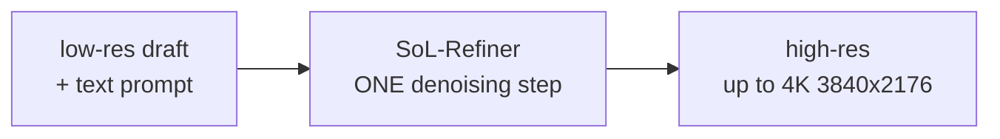
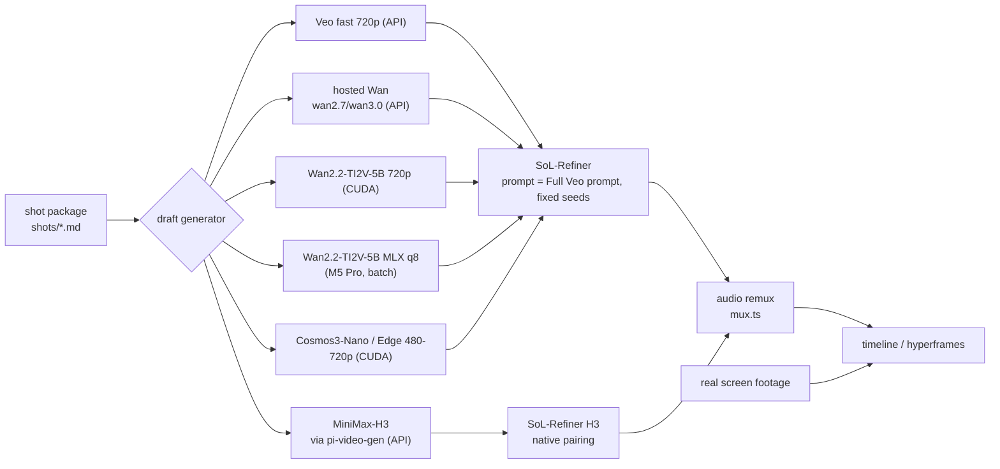

# Low-res draft → refine/upscale × `video-production` — Research Dossier

Research dossier. Plan only — no OpenSpec change, no implementation.
Sources fetched 2026-10-04.

> Status: **research / pre-planning**. Explore-mode output.
> Goal: pick a draft generator + one-step refiner combo for
> `packages/video-production`.
> Host is macOS arm64 M5 Pro 48 GB unified memory, no CUDA → no practical local
> run. Remote CUDA GPU required.
> Facts verified 2026-10-04. Full log: §12. `inferred` marker kept only for
> SoL "Cosmos-Nano" = Cosmos 3 Nano.

---

## 1. Sources

| Kind | Location |
|---|---|
| Paper | HF papers `2609.37969` — "SoL-Refiner: Speed-of-Light One-Step Refinement for High-Resolution Video", Haozhe Liu, Tian Ye, Shuchen Xue … Song Han, Enze Xie. NVIDIA Research (Efficient AI Team & Singapore Lab), tech report 2026 |
| Project page | `https://nvlabs.github.io/Sana/Sol-Refiner/` |
| Code | `https://github.com/NVlabs/Sana/tree/sol-engine/models/sol-refiner` |
| HF collection | `Efficient-Large-Model/sol-refiner` |
| Checkpoint (paper) | `Efficient-Large-Model/SoL-Refiner-LTX-2.3-One-Step` (~57 GB, diffusers `SoLRefinerPipeline`) |
| Checkpoint | `Efficient-Large-Model/SoL-Refiner-LTX-2.3-Multi-Step` |
| Checkpoint (later ext.) | `Efficient-Large-Model/SoL-Refiner-LTX-2.5-for-MiniMax-H3` (~71 GB, `SoLRefinerH3Pipeline`) |
| HF Space | `hugging-apps/efficient-large-model-sol-refiner-ltx-2-5-for-minimax-h3` — gradio, zero-a10g, RUNNING |
| Cosmos collection | HF `nvidia/cosmos3` |
| Cosmos code | `github.com/nvidia/cosmos3`, `github.com/nvidia/cosmos-framework`; GH org `nvidia-cosmos` (`cosmos-predict2.5` 1375★, `cosmos-transfer2.5` 745★, `cosmos-cookbook`) |
| Cosmos docs | `github.com/nvidia/cosmos-framework` `docs/faq.md`, `docs/inference.md`, `docs/setup.md`; HF API file sizes |
| Cosmos guardrail | HF `nvidia/Cosmos-Guardrail1` |
| Wan code | `github.com/Wan-Video/Wan2.2` (17.7k★, pushed 2026-09-21), `github.com/Wan-Video/Wan2.1` (17.1k★); HF org `Wan-AI` |
| Hosted Wan API | `alibabacloud.com/help/en/model-studio/video-generation`, `.../text-to-video-api-reference` |
| MLX Wan | HF `Anes1032/Wan2.2-TI2V-5B-mlx-q8`; `github.com/Blaizzy/mlx-video` (Prince Canuma) |
| pi-video-gen | npm `@amaster.ai/pi-video-gen` (latest 0.1.22; inspected tarball `dist/`) |
| OpenMDW | `https://openmdw.ai/license/1-1/` — OpenMDW 1.1 (Linux Foundation project) |
| Third-party (SoL) | `szwagros/SoL-Refiner-LTX-2.5-H3-int8-convrot`, `Avdpro/SoL-Refiner-LTX-2.3-MLX-BF16`, `o-l-l-i/ComfyUI-Olm-SoL-Refiner` (17★) |
| Sibling dossier | `docs/research/inspatio-world-1.5-video-production.md` + GAE dossier — shared remote-GPU runner design |

---

## 2. Concept — draft → refine, two-stage

Low-res draft generator produces cheap video. One-step refiner takes low-res
draft + text prompt → high-res output. Refiner is generator-agnostic (project
page gallery shows SANA-Video, WAN, Cosmos-Nano, MiniMax H3 drafts).

Project page: two-stage lowers latency **and** improves average quality vs
one-stage, measured on one H100 for WAN and Cosmos-Nano.



---

## 3. SoL-Refiner

NVIDIA Research (Efficient AI Team & Singapore Lab). Paper HF `2609.37969`,
tech report 2026. Backbone **LTX** (Lightricks).

- Low-res draft + text prompt → high-res in **one** denoising step.
- **Three-stage training:** high-res continual training → frame-based RL
  post-training → one-step distribution-matching distillation.
- Up to **4K** (3840×2176).
- **Refiner-Bench** benchmark. Beats external refiners at **2K** on
  VBench + UniPercept averages.
- **8.91×** refinement-latency speedup vs 3-step LTX-2.3 Refiner (2K setting).
- **Generator-agnostic.** Gallery drafts: SANA-Video, WAN, Cosmos-Nano,
  MiniMax H3.
- H3 demo headline: **152.3 s → 5.64 s**.

**Checkpoints.**

| Repo | Size | Pipeline |
|---|---:|---|
| `Efficient-Large-Model/SoL-Refiner-LTX-2.3-One-Step` | ~57 GB | diffusers `SoLRefinerPipeline` (paper version) |
| `Efficient-Large-Model/SoL-Refiner-LTX-2.3-Multi-Step` | — | — |
| `Efficient-Large-Model/SoL-Refiner-LTX-2.5-for-MiniMax-H3` | ~71 GB | `SoLRefinerH3Pipeline` (later extension, outside paper) |

No model card README on official repos (404).

**H3 runtime.**

```bash
python infer.py --model ... --input input.mp4 --prompt '...' \
  --output outputs/refined.mp4 --seed 303000 --decoder-seed 20260826
```

- One transformer forward + one Euler update `0.9093750119 → 0`, no CFG.
- Output default 1920×1080 at input fps.
- Frames truncated to `8k+1` (124 → 121).
- 1920×1088 canvas center-cropped.
- CPU offload; decoder tiles 768 px, stride 512.
- Output has **NO audio**.
- Tested H100 80 GB, Python 3.12, PyTorch 2.9.1+cu126, NATTEN 0.21.5.

**Third-party.**

| Repo | Note |
|---|---|
| `szwagros/SoL-Refiner-LTX-2.5-H3-int8-convrot` | int8 repack for "image-server" runtime; text encoder Gemma 4 12B; source repo declares no license → LTX-2.x Community License applies |
| `Avdpro/SoL-Refiner-LTX-2.3-MLX-BF16` | AI2Apps MLX; 28.71 GB fixed-prompt mode, +28.33 GB custom prompts = 57.04 GB; only validated 9/33-frame 128→256 tests — **unvalidated at 720p** |
| `o-l-l-i/ComfyUI-Olm-SoL-Refiner` | 17★, experimental ComfyUI nodes for H3 checkpoint, any input source, tested Windows RTX 5090 32 GB + 128 GB RAM, fp8 default, nvfp4 experimental; README warns local tests changed facial features, clothing patterns, jewelry; 864×480 → 1728×960 example; audio bypasses model, frame count + fps preserved |

Space `hugging-apps/efficient-large-model-sol-refiner-ltx-2-5-for-minimax-h3`
= "One-step 1080p refinement of MiniMax-H3 videos".

**License.** Fine-tune of LTX → **LTX-2 Community License** (Lightricks). Check
before commercial use. **Gate:** licence risk now sits only on the refiner; the
draft generators (Wan Apache-2.0, Cosmos OpenMDW outputs unrestricted) are clear.

---

## 4. NVIDIA Cosmos 3 (draft generator)

Resolves the user's "Nvidia One" → Cosmos. "Cosmos 3: Omnimodal World Models
for Physical AI": text / image / video(+audio) / action in → video (+ AAC stereo
48 kHz audio muxed) out. Positioned for **Physical AI** (robotics, AV), not
creative / marketing video.

Architecture: MoT (Mixture-of-Transformers) — two towers, autoregressive +
diffusion. Possibly explains HF-vs-framework param-count gap (inferred).

| Model | Date | Params | Note |
|---|---|---:|---|
| `nvidia/Cosmos3-Nano` | 2026-03-10 | 16B (card) / 8B (FAQ) | ~98k downloads; video gen 256p/480p/720p; aspect 16:9 4:3 1:1 3:4 9:16; 5–400 frames, default 189; example 1280×720, 189 frames, 24 fps |
| `nvidia/Cosmos3-Edge` | 2026-07-01 (card: released 07/20/2026) | 2B | ~968k downloads; 9.2 GB repo; OpenMDW-1.1; omni but **NO audio** (no sound tokenizer); video 256p/480p, 12–30 fps, 50–150 frames; "fits comfortably on a single GPU", recommended single-GPU start |
| `nvidia/Cosmos3-Super` | 2026-03-10 | 64B (card) / 32B (FAQ) | DMD2-distilled 4 steps no CFG; recommended 480p (832×480), 189 frames |
| `nvidia/Cosmos3-Super-Image2Video` | 2026-05-21 | 64B | — |
| `nvidia/Cosmos3-Super-Image2Video-4Step` | 2026-07-07 | 64B | 4-step distilled |

**Param-count conflict (unresolved).** HF model card: Nano 16B, Super-I2V-4Step
"64B". cosmos-framework `docs/faq.md` + `docs/inference.md`: Nano (8B), Super
(32B). Record as conflict — no resolution. MoT two-tower shape may explain
total-vs-tower counts (inferred).

**Cosmos3 GPU memory** (`docs/faq.md` "How much GPU memory do the models
need?"): Nano **32 GB**, Super **128 GB**. HF repo `nvidia/Cosmos3-Nano` weights
= 35.0 GB total (transformer 30.3, sound_tokenizer 2.0, vae 1.4,
vision_encoder 1.2).

**Cosmos3-Nano backends:** vLLM-Omni
(`vllm serve nvidia/Cosmos3-Nano --omni --port 8000`, OpenAI-compatible
`/v1/videos/sync`; recommended on H200; `--enable-layerwise-offload` for smaller
GPUs; `--ulysses-degree` / `--tensor-parallel-size` multi-GPU), Diffusers
`Cosmos3OmniPipeline`, SGLang diffusion, PyTorch. Hardware: NVIDIA (Blackwell
listed).

Single-GPU Nano: `python -m cosmos_framework.scripts.inference -i
inputs/omni/t2i.json -o outputs/ --checkpoint-path Cosmos3-Nano`. Multi-GPU:
`torchrun --nproc-per-node=N` (FSDP shards weights). Presets
`--parallelism-preset=latency|throughput`. OOM ladder: `--dp-shard-size`,
`--device-memory-utilization` (default 0.75), `--offload-guardrail-models`.

**Platform** (`docs/setup.md`): NVIDIA Ampere+ minimum (RTX 30, A100), H100/B200
recommended. CUDA ≥12.8. Linux x86-64/aarch64 only. glibc ≥2.35. ~150 GiB free
disk first run (HF cache ~90 GiB, uv ~20 GiB, outputs ~30 GiB).

**Practical fit.** Nano (32 GB) fits single 48 GB (RTX 6000 Ada / L40S class) or
80 GB GPU. 24 GB card needs offload. (Derived from 32 GB FAQ figure — marked
derived.)

**Cosmos3-Super hardware & latency.** `docs/inference.md`: "Cosmos3-Super (32B)
does not fit on a single 80 GB H100" → 4 or 8 GPU FSDP recipes. Derived 480p
latency:

| Setup | Seconds |
|---|---:|
| B200 × 1 | 6.4 s |
| H100 NVL × 4 | 5.7 s |
| H200 × 8 | 2.4 s |
| RTX PRO 6000 Blackwell × 4 | 11.6 s |

Values = measured-derived (base latency ÷ 17.5 sampling-speed factor).
`Cosmos3-Super-I2V-4Step` vLLM-Omni 480p: H200 141GB × 1 12.6 s, B200 6.6 s.
Card notes recommended I2V sampler 50 steps → 25× basis in general reporting;
17.5× kept conservative (derived).

**Cosmos3-Edge latency** (I2V 480p, 189 frames): H100 SXM 80 GB 27.64 s, RTX PRO
6000 Blackwell 36.29 s, DGX Station 12.17 s, DGX Spark 165.96 s, Jetson T2000
16 GB 101.20 s. CUDA/Jetson only.

**Guardrails ON by default** (`nvidia/Cosmos-Guardrail1`): text blocklist,
Qwen3Guard-Gen-0.6B text safety classifier, video content-safety classifier,
and **RetinaFace face-blur post-processor** → generated faces blurred unless
`--no-guardrails`. Refiner over a blurred face → hallucination risk. Guardrail
policy must be decided per deliverable.

**Inferred:** SoL page's "Cosmos-Nano" draft generator = Cosmos 3 Nano family.

**Legacy NVIDIA upscaler:** `nvidia/Cosmos-Transfer1-7B-4KUpscaler`
(2025-03-19, gated — card 401), older-gen, not evaluated.

**Community quants.** FP8/NF4/GPTQ/AWQ variants of Cosmos3-Nano.
`Reza2kn/Cosmos3-Nano-MLX-4bit` / `-8bit` exist but tagged text-to-image only,
0 downloads. **No Mac video path** — framework Linux/CUDA only.

**License. OpenMDW-1.1** (`https://openmdw.ai/license/1-1/`, Linux Foundation
project). Permissive: "permission ... free of charge, to deal in the Model
Materials without restriction", incl. copyright, patent, database, trade-secret
rights. Obligations only on redistribution of Model Materials: keep copy of
agreement + origin notices. Patent/copyright-suit termination clause (rights end
if licensee sues asserting Model Materials infringe). Outputs: "does not impose
any restrictions or obligations with respect to any use, modification, or
sharing of any outputs" → Cosmos 3 generated video free for commercial use under
licence terms. AS-IS; user solely responsible for clearing third-party rights.
Cosmos3 model cards (Nano, Super, Edge) state only OpenMDW-1.1 — no additional
NVIDIA terms found. **Contrast:** SoL-Refiner LTX-2 Community License remains
the restrictive link → licence gate hinges on refiner, not Cosmos/Wan.

---

## 5. Alibaba Wan 2.x (draft generator)

Role covered: **low-res draft generator only**. Weights Apache-2.0.

| Model | Task | Size | Min VRAM |
|---|---|---|---|
| `Wan-AI/Wan2.2-TI2V-5B` (+ `-Diffusers`) | text+image→video 720P@24fps | `1280*704` / `704*1280`, Wan2.2-VAE 16×16×4 compression | ≥24 GB (RTX 4090) |
| `Wan2.2-T2V-A14B` (MoE) | text→video 480P + 720P | `--size 1280*720` | ≥80 GB single-GPU, else offload / `--t5_cpu` |
| `Wan2.2-I2V-A14B` (MoE) | image→video | — | ≥80 GB, else offload |
| `Wan2.1-FLF2V-14B-720P` | first+last frame→video | 720P | fits SEAMLESS A→B chain |
| `Wan2.1-T2V-1.3B` | text→video | 480P small option | — |
| `Wan2.1-VACE-1.3B/14B` | editing | — | — |
| `Wan2.2-S2V-14B` / `Wan2.2-Animate(-2)-14B` / `Wan-Dancer-14B` | — | — | — |

TI2V-5B — "one of the fastest 720P@24fps models":

```bash
python generate.py --task ti2v-5B --size 1280*704 --ckpt_dir ./Wan2.2-TI2V-5B \
  --offload_model True --convert_model_dtype --t5_cpu --prompt "..."
```

≥80 GB → drop offload flags for speed. Multi-GPU A14B:
`torchrun --nproc_per_node=8 ... --dit_fsdp --t5_fsdp --ulysses_size 8`.

**Integrations.** Diffusers (T2V-A14B / I2V-A14B / TI2V-5B), ComfyUI native +
Kijai `ComfyUI-WanVideoWrapper`.

**Prompt extension** via DashScope (`DASH_API_KEY`,
`DASH_API_URL=https://dashscope-intl.aliyuncs.com/api/v1`). `Wan-Video/Wan-skills`
repo = agent skills via DashScope/ModelStudio API (`DASHSCOPE_API_KEY`,
`DASHSCOPE_BASE_URL`), currently **image-only** (`wan2.7-image-skill`,
`wan-pptx-generator`) — no video skill yet.

SoL project page lists WAN as a supported draft generator with measured
latency + quality gains (H100).

**Mac path — VERIFIED, community (not first-party).** No official MPS/MLX video
path, but a working MLX route exists:

- `Anes1032/Wan2.2-TI2V-5B-mlx-q8` (HF, 1421 downloads, 2026-06-23,
  Apache-2.0, library `mlx-video` = `github.com/Blaizzy/mlx-video` by Prince
  Canuma). 8-bit transformer ~5 GB + UMT5-XXL bf16 ~11 GB + VAE fp32 ~2.6 GB
  ≈ 18 GB.
  ```bash
  pip install git+https://github.com/Blaizzy/mlx-video.git
  python -m mlx_video.models.wan_2.generate --model-dir ./Wan2.2-TI2V-5B-MLX-Q8 \
    --image ./start.png --prompt "..." --width 1280 --height 704 \
    --num-frames 81 --steps 40 --guide-scale 5.0 --output-path out.mp4
  ```
  Resolution divisible by 32, frames `4n+1`, output 24 fps, `--image` optional.
  Validated on 64 GB Apple Silicon: 720p × 41 frames × 20 steps ≈ 15 min, stable
  memory; 32 GB+ recommended. Card: A14B dual-model "struggles" on 64 GB.
- Others: `Anes1032/Wan2.2-I2V-A14B-mlx-q8` (380 dl),
  `SceneWorks/wan2.2-ti2v-5b-mlx` (bf16, quant at load, SceneWorks app, Rust MLX
  converter), `rickylin20260522/Wan2.2-TI2V-5B-mlx`,
  `shraey/wan2.1-flf2v-14b-720p-mlx` (0 dl), GH `bhubbard/mlx-video-rs`
  (Rust MLX, Wan2.1/2.2/LTX-2), `xocialize/ti2v-5b-mlx-swift`,
  `szchengmi/video_wan2_2_5B_ti2v_macm4` (MPS).

**Host implication (M5 Pro 48 GB).** TI2V-5B q8 (~18 GB) plausibly fits. Speed
est. ~15 min per 41-frame 720p clip at 20 steps (validated 64 GB Mac; M5 Pro
speed unmeasured) → overnight-batch drafts only, not interactive. Only local
draft-generator option on this host. Refiner still needs CUDA.

**Hosted Wan (Alibaba Cloud Model Studio / DashScope).** Closed models reachable
via API:

- Models: `wan3.0-video`, `wan3.0-video-prime` (speed-optimized),
  `wan2.7-t2v` (+ `-2026-06-12`, `-2026-04-25`), `wan2.7-i2v`, `wan2.7-r2v`,
  `wan2.7-videoedit`, `wan2.6-t2v/i2v/i2v-flash/r2v/r2v-flash`,
  `wan2.5-t2v-preview/i2v-preview`,
  `wan2.2-t2v-plus/i2v-plus/i2v-flash/kf2v-flash`, `wan2.2-animate-move/mix`,
  `wan2.1-t2v-plus/turbo`, `wan2.1-i2v-plus/turbo`, `wan2.1-kf2v-plus`,
  `wan2.1-vace-plus`.
- `wan3.0-video`: 480P/720P/1080P, up to 30 s, adaptive aspect, smart duration,
  audio toggle, reference audio; first-frame and first/last-frame I2V. Other
  t2v clips ≤15 s.
- API: POST
  `https://{WorkspaceId}.ap-southeast-1.maas.aliyuncs.com/api/v1/services/aigc/video-generation/video-synthesis`,
  header `X-DashScope-Async: enable`, `Authorization: Bearer $DASHSCOPE_API_KEY`.
  Params e.g. `resolution: "720P"`, `ratio: "16:9"`, `prompt_extend`,
  `watermark`, `duration`. Doc example sets `watermark: true` → must set
  `false`.
- Open weights stop at **Wan 2.2** (HF org `Wan-AI` has no 2.5+ weights as of
  2026-10-04) → 2.5/2.6/2.7/3.0 = closed, API-only.
- Fit: hosted Wan 720P draft → SoL-Refiner = API alternative to Veo fast;
  hosted 1080P may make refiner unnecessary for Wan (compare in spike).
  Wan-skills repo still image-only.

---

## 6. Comparison

| Model | Role | Params / size | Res / fps | Min hardware | Mac path | License | Our fit |
|---|---|---|---|---:|---|---|---|
| Veo 3.1 fast 720p | draft (existing) | API | 720p / 16:9 | — | API | Google | existing, no new piece |
| MiniMax-H3 (via pi-video-gen) | draft | API | — | — | API | MiniMax ToS | native pairing with SoL-H3 |
| Hosted Wan (`wan2.7-*`, `wan3.0-video`) | draft | API | 480P/720P/1080P (wan3.0 ≤30 s) | — | API | Alibaba ToS | API alt to Veo fast |
| Wan2.2-TI2V-5B | draft | 5B | 720p@24fps (1280×704) | ≥24 GB (4090) | none official (CUDA) | Apache-2.0 | best self-hosted draft |
| Wan2.2-TI2V-5B MLX q8 | draft (local) | 5B, ~18 GB | 720p, 24 fps, frames `4n+1` | 32 GB+ Apple Silicon | yes — community mlx-video | Apache-2.0 | only on-host Mac generator; batch only |
| Wan2.2-A14B | draft | 14B MoE ×2 | 480P/720P | ≥80 GB single / offload | A14B q8 "struggles" 64 GB | Apache-2.0 | heavy |
| Cosmos3-Nano | draft | 16B card / 8B FAQ | 256/480/720p, 24 fps | 32 GB GPU, Linux/CUDA | none (MLX text-to-image only) | OpenMDW-1.1 | viable, Physical-AI oriented |
| Cosmos3-Edge | draft | 2B, 9.2 GB repo | 256p/480p, 12–30 fps, 50–150 frames | single GPU | none (CUDA/Jetson only) | OpenMDW-1.1 | cheap 480p draft |
| Cosmos3-Super-I2V-4Step | draft | 64B card / 32B FAQ | 480p, 189 frames | 128 GB; 4–8× H100/H200 or B200 | none | OpenMDW-1.1 | overkill |
| SoL-Refiner H3 | refiner | ~71 GB | 1080p, input fps | H100 80 GB tested | unvalidated MLX | LTX-2 Community License | H3 drafts only |
| SoL-Refiner LTX-2.3 | refiner | ~57 GB | up to 4K (3840×2176) | H100 class | unvalidated MLX | LTX-2 Community License | cross-generator refiner |

---

## 7. Our pipeline (fit)

`packages/video-production`:

- `veo-generator` skill + `pi-veo` CLI (`src/bin/veo.ts`):
  parse/plan/render/storyboard/export/mux. Veo 3.1
  `veo-3.1-generate-preview` / `veo-3.1-fast-generate-preview`; clips ≤8 s;
  `src/shots.ts` `Resolution = "720p" | "1080p" | "4k"` (default 1080p).
  SKILL.md already suggests cheap preview `--model fast --resolution 720p`;
  4K = slower + pricier.
- Optional `pi-video-gen` path (user-level pi extension `@amaster.ai/pi-video-gen`,
  SKILL.md pins 0.1.18; npm latest 0.1.22): built-in providers `ark`
  (Seedance 2.0), `dashscope` (HappyHorse 1.1/1.0), `kling` (3.0 Turbo/Omni),
  `minimax` (MiniMax-H3 v2 API), `openrouter` (Veo 3.1 + custom), `newapi`
  relay, plus `customProviders`. **No built-in Wan model.** DashScope adapter
  posts `{baseUrl}/api/v1/services/aigc/video-generation/video-synthesis`
  (`X-DashScope-Async: enable`), routes `{family}-t2v|-i2v|-r2v`, body
  `input.media[]` (`first_frame`/`reference_image`), `parameters.watermark=false`,
  resolution/ratio/duration; rejects lastFramePath. DashScope Wan models share
  endpoint + `-t2v/-i2v/-r2v` naming → passing `wan2.7` as family plausible; Wan
  payload compatibility with HappyHorse `media` shape **unverified** (needs one
  paid smoke clip).
- `src/mux.ts` + `pi-veo mux` (ffmpeg/ffprobe) → remux audio exists.
- Shot package `shots/*.md` carries "▶ Full Veo prompt", negative, seed, aspect,
  resolution, first-frame sketch → source of refiner prompt + draft generator
  prompt.
- `hyperframes-showreel` skill: real screen footage + Veo FX layers (black bg,
  `mix-blend-mode: screen`); export QA gate duration ±0.1 s;
  `footage-redaction` skill bakes blur/delogo/crop.



Real screen footage **bypasses** the refiner.

**Fit verdicts.**

- **Veo-fast-720p + SoL** = best near-term. No new generator; keeps existing
  prompt package.
- **MiniMax-H3 via pi-video-gen + SoL-H3** = native pairing. pi-video-gen's
  built-in `minimax` MiniMax-H3 provider + `SoL-Refiner-LTX-2.5-for-MiniMax-H3`
  = the exact draft generator the H3 refiner variant was tuned for. Most
  "native" API pairing reachable from our pipeline today.
- **Hosted Wan (`wan2.7-*` / `wan3.0-video`) + SoL** = API draft alternative to
  Veo fast; 1080P tier may remove the refiner need.
- **Wan2.2-TI2V-5B** = best self-hosted CUDA draft generator. Apache-2.0, 24 GB
  GPU, 720p@24fps matches refiner input, FLF2V fits SEAMLESS chain, seed
  control. Lowest-cost CUDA box (4090/5090 class).
- **Wan2.2-TI2V-5B MLX q8 (mlx-video)** = only on-host Mac generator; ~18 GB
  fits M5 Pro 48 GB. Batch/slow (~15 min per 41-frame 720p clip at 20 steps on
  validated 64 GB Mac; M5 Pro unmeasured). Refiner still needs CUDA.
- **Cosmos3-Nano** = viable, Physical-AI oriented. 32 GB GPU, Linux/CUDA,
  default face-blur guardrail. Native audio output survives refiner via remux.
  OpenMDW outputs unrestricted.
- **Cosmos3-Edge** = cheap 480p draft (2B, single GPU, 9.2 GB repo) → SoL 2×
  (480p→~1080p is >2×; aspect/scale gap). No audio.
- **Cosmos3-Super** = overkill (multi-GPU / B200).
- **None** of the CUDA refiners runs practically on host M5 Pro 48 GB.

---

## 8. Integration options

(No decision yet.)

| # | Option | Shape |
|---|---|---|
| A | Docs-only manual step | Run refiner by hand; document procedure |
| B | `pi-veo refine` + `pi-veo draft --provider wan\|cosmos\|minimax` | via remote runner backends: HF Space / ComfyUI HTTP / SSH `infer.py` / vLLM-Omni OpenAI endpoint (Cosmos3) / DashScope API (hosted Wan) |
| C | Local MLX | **draft partially unblocked**: Wan2.2-TI2V-5B MLX q8 runs on host; **refiner still blocked** (unvalidated, And MLX-BF16 unvalidated at 720p) |

Shared remote-GPU runner backends (cross-ref InSpatio / GAE dossiers):
A SSH CUDA box / B private HF Space / C Modal-RunPod.

---

## 9. Pitfalls

- Refiner is generative → can hallucinate faces / logos / text.
- **Never** run refiner on real screen footage.
- Refine **first**, redact **last** — refiner over a `footage-redaction` blur may
  hallucinate readable text.
- Cosmos guardrails ON by default → RetinaFace face-blur; refiner then sharpens a
  blurred face → hallucination risk. Decide `--no-guardrails` policy per
  deliverable.
- `8k+1` frame trim: 8 s × 24 fps = 192 → 185 frames (~0.3 s) vs ±0.1 s QA gate
  → refine **before** timing locks.
- Refiner drops audio → remux with `mux.ts`.
- Wan/Cosmos outputs 1280×704 / 832×480 need aspect handling vs refiner
  1920×1088 crop.
- Mac MLX draft is batch-only (~15 min/clip est.); not interactive.
- License gate = SoL-Refiner **LTX-2 Community License** only. Wan Apache-2.0,
  Cosmos OpenMDW outputs unrestricted. Hosted Wan / MiniMax / Veo = provider
  ToS (not checked).
- Big downloads: ~57–71 GB refiner + tens of GB generator weights.
- H3 refiner tuned on MiniMax-H3 drafts — quality on Veo/Wan/Cosmos drafts
  unmeasured for H3 variant. Paper LTX-2.3 variant is the cross-generator one.

---

## 10. Open questions

1. Cosmos param-count conflict: card 16B/64B vs framework FAQ 8B/32B — which is
   effective size?
2. Wan payload compatibility with pi-video-gen `dashscope` adapter (`wan2.7`
   family through HappyHorse `media` shape) — needs one paid smoke clip.
3. MLX Wan2.2-TI2V-5B speed on M5 Pro 48 GB — measure wall time.
4. Cosmos guardrail policy: is `--no-guardrails` acceptable per deliverable?
5. Provider ToS for API drafts (MiniMax, DashScope, Veo) re commercial use of
   refined derivatives.
6. Hosted `wan3.0` 1080P vs Wan 720P + SoL — quality/cost.
7. CUDA box availability — rent 4090 / 5090 / H100?
8. Commercial use of refiner outputs — LTX-2 Community License terms.
9. Measure SoL on Veo/Wan drafts vs Lanczos vs native Veo 1080p.
10. H3 vs LTX-2.3 refiner for non-H3 drafts.

---

## 11. Recommended next step

Spike:

1. Existing Veo-fast 720p clips + Wan2.2-TI2V-5B clips (same prompts).
2. Add arms:
   - MiniMax-H3 via `pi-video-gen` → SoL-Refiner H3.
   - Local Wan2.2-TI2V-5B MLX q8 (short clip; measure wall time on M5 Pro).
   - Hosted `wan2.7` / `wan3.0` 720P vs 1080P.
3. → SoL-Refiner (HF Space first, then LTX-2.3 one-step on rented GPU).
4. Side-by-side vs Lanczos + Veo native 1080p contact sheets.
5. Record seeds / latency / cost.

Then decide option A vs B. If B → OpenSpec change (e.g.
`add-video-refine-step`), sharing `add-remote-gpu-runner` with InSpatio / GAE
dossiers.

---

## 12. Verification log (2026-10-04)

| Item | Before | Verified fact | Source |
|---|---|---|---|
| OpenMDW-1.1 licence | "verification pending" | Permissive grant: "free of charge, to deal in the Model Materials without restriction" (copyright, patent, database, trade-secret). Obligations only on redistribution: keep agreement copy + origin notices. Patent/copyright-suit termination clause. Outputs: "no restrictions or obligations" on use/modification/sharing → commercial use OK. AS-IS; user clears third-party rights. | `openmdw.ai/license/1-1/` (Linux Foundation) |
| Cosmos3 model-card terms | "verify terms" | Nano/Super/Edge cards state only OpenMDW-1.1 — no extra NVIDIA terms | HF `nvidia/Cosmos3-*` cards |
| Cosmos3-Nano VRAM | "not published (unverified)" | 32 GB; weights 35.0 GB (transformer 30.3, sound_tokenizer 2.0, vae 1.4, vision_encoder 1.2) | cosmos-framework `docs/faq.md`; HF API file sizes |
| Cosmos3-Super VRAM | — | 128 GB; "does not fit on a single 80 GB H100" → 4/8 GPU FSDP | `docs/faq.md`, `docs/inference.md` |
| Cosmos3 param counts | 16B / 64B (card) | CONFLICT: card 16B/64B vs FAQ/inference 8B/32B. Unresolved. MoT two-tower may explain (inferred) | HF cards vs `docs/faq.md`/`inference.md` |
| Cosmos3-Super-I2V-4Step latency | — | vLLM-Omni 480p measured-derived: H200 141GB ×1 12.6 s, B200 ×1 6.6 s (base ÷ 17.5) | model card + vLLM-Omni numbers |
| Cosmos3-Edge | row empty `—` | 2B, 9.2 GB repo, ~968k dl, OpenMDW-1.1, released 07/20/2026, no audio, 256p/480p 12–30 fps 50–150 frames. I2V 480p 189f: H100 SXM 27.64 s, RTX PRO 6000 Blackwell 36.29 s, DGX Station 12.17 s, DGX Spark 165.96 s, Jetson T2000 101.20 s | HF `nvidia/Cosmos3-Edge` |
| Cosmos guardrails | (absent) | ON by default (`nvidia/Cosmos-Guardrail1`): text blocklist, Qwen3Guard-Gen-0.6B, video safety, RetinaFace face-blur → `--no-guardrails` needed | card / framework docs |
| Cosmos platform | — | Ampere+ min (RTX 30, A100), H100/B200 rec., CUDA ≥12.8, Linux x86-64/aarch64, glibc ≥2.35, ~150 GiB free disk first run | `docs/setup.md` |
| Cosmos Mac path | "no Mac video path" | Confirmed none: `Reza2kn/Cosmos3-Nano-MLX-4bit` text-to-image only, 0 dl; framework Linux-only | HF; `docs/setup.md` |
| Wan Mac path | "unverified" | VERIFIED community path: `Anes1032/Wan2.2-TI2V-5B-mlx-q8` (1421 dl, 2026-06-23, Apache-2.0, `mlx-video`); ~18 GB; `python -m mlx_video.models.wan_2.generate ...`; validated 64 GB Apple Silicon 720p × 41f × 20 steps ≈ 15 min; 32 GB+ rec.; A14B q8 "struggles" 64 GB | HF card; `github.com/Blaizzy/mlx-video` |
| pi-video-gen Wan support | open question | NO built-in Wan. Built-ins: ark, dashscope (HappyHorse only), kling, minimax (MiniMax-H3), openrouter, newapi. DashScope adapter at `video-synthesis`, `-t2v/-i2v/-r2v`; Wan family plausible but payload compat **unverified** | npm tarball 0.1.22 `dist/` |
| pi-video-gen version | 0.1.18 (SKILL.md) | npm latest 0.1.22 | npm |
| MiniMax-H3 native pairing | — | pi-video-gen built-in MiniMax-H3 + `SoL-Refiner-LTX-2.5-for-MiniMax-H3` = exact tuned pair | npm tarball + HF |
| Hosted Wan API | open question | Live closed models `wan2.7-*`, `wan3.0-video` (480P/720P/1080P, ≤30 s, first/last-frame I2V); endpoint `video-synthesis`, `X-DashScope-Async`, Bearer key; set `watermark:false`. Open weights stop at Wan 2.2 | Alibaba Model Studio docs |
| SoL "Cosmos-Nano" | inferred | STILL INFERRED = Cosmos 3 Nano family | SoL project page |
