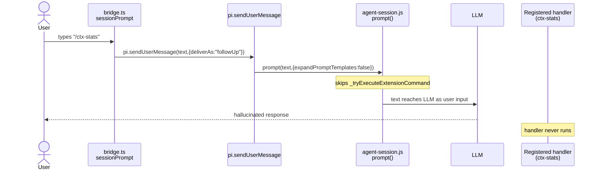

# Slash Command Routing

## Purpose

Documents how dashboard bridge routes typed `/foo` text from chat input to pi handlers. Extension command dispatch (step 9) is ONE in-process call — `pi.sendUserMessage(text, {expandPromptTemplates: true, deliverAs})` — gated on running pi >= 0.84.2. Works in every session kind (dashboard headless, tmux, terminal, user-launched). Paths B/C/D retired by change `retire-slash-dispatch-via-expand-prompt-templates`.

## Routing Order

`command-handler.ts::parseSendPrompt` plus `bridge.ts::sessionPrompt` process `send_prompt` text in this exact order:

1. `!!` prefix → silent bash via `pi.exec`
2. `!` prefix → bash via `pi.exec`, output also sent to LLM
3. `/compact [args]` → `compact()` callback
4. `/quit` or `/exit` → `shutdown()` callback
5. `/reload` → `reload()` callback
6. `/new` → `spawnNew()` callback
7. `/model <provider/id>` → `setModel(provider, id)` callback
8. `/<name>` matching user-defined flow from `getFlowsList()` → `pi.events.emit("flow:run", {flowName, task})`
9. `/<name>` matching extension command (`source: "extension"` in `pi.getCommands()`, not in `DASHBOARD_NATIVE_COMMANDS`) → gate running pi >= 0.84.2 → `pi.sendUserMessage(text, {expandPromptTemplates: true, deliverAs})`. Single in-process call; every session kind; no session-kind probe.
10. `/` prefix fall-through → `expandPromptTemplateFromDisk` then `pi.sendUserMessage` (skills, prompt templates, unknown slashes)
11. No prefix → `pi.sendUserMessage(text)` passthrough

Steps 1-7 live in `parseSendPrompt`. Step 8 lives in `bridge.ts::sessionPrompt`. Step 9 added by change `fix-extension-slash-commands-in-dashboard`; retired + replaced by change `retire-slash-dispatch-via-expand-prompt-templates`. Steps 10-11 are existing fallbacks and UNCHANGED.

Step 9 history — Paths B/C/D RETIRED by change `retire-slash-dispatch-via-expand-prompt-templates`:

- **Path B** (`pi.dispatchCommand`): never shipped upstream. Deleted.
- **Path C** (bridge → `dispatch_extension_command` → server → keeper UDS → pi stdin): headless only. Deleted; `packages/server/src/rpc-keeper/dispatch-router.ts` deleted.
- **Path D** (tmux / Windows-Terminal `command_feedback` error): replaced by the working in-process call.
- Also deleted: `hasDispatchCommand` (`bridge-context.ts`), `connection` parameter + `DispatchConnection` type (`slash-dispatch.ts`), server write client (`keeperManager.writeRpc`, `keeperManager.writeRpcToSockPath`, `headlessPidRegistry.writeRpc`).
- Retained: `isHeadlessRpcSession` (live caller `bridge.ts` session registration `isHeadless:`).

## Surface Map

```mermaid
flowchart TD
  U[User types text in chat] --> P["command-handler.ts<br/>parseSendPrompt(text)"]
  P --> B{ParsedPrompt type}
  B -->|bash| EX["pi.exec"]
  B -->|compact| CP["options.compact()"]
  B -->|shutdown| SD["options.shutdown()"]
  B -->|reload| RL["options.reload()"]
  B -->|new| NW["options.spawnNew()"]
  B -->|model| MD["options.setModel(provider,id)"]
  B -->|mgmt| MG["pi.events.emit(event, data)"]
  B -->|slash| SP["bridge.ts<br/>sessionPrompt(text)"]
  B -->|passthrough| PT["sendUserMessageWithImages -> pi.sendUserMessage"]

  SP --> F{Flow fast-path:<br/>name in getFlowsList()?}
  F -->|yes| FR["pi.events.emit('flow:run',{flowName,task})"]
  F -->|no| X{Step 9 gate:<br/>isExtensionSlashCommand(text, getCommands())}
  X -->|false| FB["steps 10-11:<br/>expandPromptTemplateFromDisk -> pi.sendUserMessage(expanded,{deliverAs:'followUp'})"]
  X -->|true| G{running pi >= 0.84.2?}
  G -->|no| OG["emit command_feedback {status:'error', message:'Extension slash commands from the dashboard require pi 0.84.2+'}<br/>NO sendUserMessage call"]
  G -->|yes| IS["emit command_feedback {status:'started'}<br/>pi.sendUserMessage(text,{expandPromptTemplates:true, deliverAs})<br/>emit command_feedback {status:'completed'}<br/>sync throw -> {status:'error'}"]
```

Old three-way gate retired: Path B (`pi.dispatchCommand`, never shipped upstream), Path C (headless RPC via keeper), Path D (tmux / Windows-Terminal error). Server keeps a one-release tombstone for `dispatch_extension_command` (see Telemetry). Detection stays inside the helper's try — a stale-ctx `getCommands()` throw returns `false` → fall-through.

## Pi 0.70 ExtensionAPI Constraint

Pi 0.70 `ExtensionAPI` exposes: `sendMessage`, `sendUserMessage`, `registerCommand`, `getCommands`, `events`, `exec`, `setSessionName`, `getActiveTools`. Verified at `pi-coding-agent/dist/core/extensions/types.d.ts:770-922` and `loader.js:155-260`.

`ExtensionAPI` does NOT expose: `prompt`, `session`, `dispatchCommand`. Pi's `agent-session.js:1715` calls `runner.bindCore({sendMessage, sendUserMessage, appendEntry, setSessionName, ...})` — no `prompt` action wired into runtime.

Slash dispatch privilege belongs to pi's external `prompt()` entry point (TUI input handler, RPC mode `case "prompt"`). Never delegated to extensions. `getCommands()` returns `SlashCommandInfo[]` with name + description but no handler reference.

`pi.sendUserMessage` calls `agent-session.js::sendUserMessage` which calls `prompt(text, {expandPromptTemplates: false, ...})` by default. The `expandPromptTemplates: false` flag explicitly skips `_tryExecuteExtensionCommand`. Source comment at `agent-session.js:1002`: "Use prompt() with expandPromptTemplates: false to skip command handling and template expansion".

Default `expandPromptTemplates: false` behaviour — the bug this change fixed:



**Resolved (pi >= 0.84.2).** pi honors an explicit `expandPromptTemplates: true` on `sendUserMessage`. Core `AgentSession.prompt()` then runs `_tryExecuteExtensionCommand(text)` FIRST — before its compaction guard and before it consults `streamingBehavior`. Bridge passes the flag; handler runs in every session kind. Verified on pi 0.86.1: `dist/core/agent-session.js` L938/L945/L953 (`?? true`, `_tryExecuteExtensionCommand` first, compaction guard) and L1273/L1296 (`sendUserMessage` → `prompt(..., ?? false)`); `dist/core/extensions/loader.js` L284-287 (`assertActive()` + void call).

## Affected Commands Today

Per `notes/preflight-empirical-checks.md` Q1 plus proposal Impact section. `pi.registerCommand`-registered slash commands previously fell through to `sendUserMessage` in dashboard chat; now dispatch in-process (step 9) in every session kind:

- context-mode: `/ctx-stats`, `/ctx-doctor`
- pi-web-access: `/websearch`, `/curator`, `/google-account`, `/search`
- pi-subagents: `/agents`
- pi-flows: `/flows`, `/flows:new`, `/flows:edit`, `/flows:delete`

Excluded by `isExtensionSlashCommand`: names in `DASHBOARD_NATIVE_COMMANDS` (`{"roles"}`) and `__`-prefixed names (`/__dashboard_reload`).

Flow buttons in kebab menu mask the old bug because they route via `flow_management` ws message (separate handler in `bridge.ts`). Typed `/flows:new` in chat hit the broken path.

Empirical proof: `echo '{"type":"prompt","message":"/flows:new","id":"1"}' | pi --mode rpc` dispatches correctly via `session.prompt`, returns `extension_ui_request` from pi-flows.

## Decisions

### Decision 1: Dispatch path — Path B primary, Path D stopgap

**RETIRED** by change `retire-slash-dispatch-via-expand-prompt-templates`. Replaced by one in-process call at step 9: `pi.sendUserMessage(text, {expandPromptTemplates: true, deliverAs})`. Works in every session kind; no session-kind probe, no RPC route.

Historical choice (Path B primary, Path D stopgap): add `pi.dispatchCommand(text, options?)` to upstream `ExtensionAPI`; ship dashboard-side detection + error feedback as interim. Pi already implemented dispatch logic (`agent-session.js:798 _tryExecuteExtensionCommand`). Path B never shipped. Path C (`add-rpc-stdin-dispatch-with-keeper-sidecar`) replaced it for headless sessions only. Both retired.

**Rejected then:**
- Path A (bridge looks up handler via `getCommands()`): handler reference private to runner, not on api object.
- Path C (server bypasses bridge, writes RPC `prompt` to pi stdin): too invasive; splits session ops across bridge + server, requires stdin capture in `process-manager.ts` and rewiring `pi-gateway.ts`. Later reopened as the headless stopgap; retired here.

Cross-reference: design.md Decision 1.

### Path C: server-routed via RPC keeper

**RETIRED** by change `retire-slash-dispatch-via-expand-prompt-templates`. `packages/server/src/rpc-keeper/dispatch-router.ts` deleted; server write client removed (`keeperManager.writeRpc`, `keeperManager.writeRpcToSockPath`, `headlessPidRegistry.writeRpc`). It was the only dispatch consumer of the keeper UDS; keeper sidecar itself UNCHANGED (durable owner of pi's stdin across dashboard restarts).

Historical (headless sessions only; tmux / Windows Terminal owned pi's stdin, no UDS route): bridge emitted `started`, sent `dispatch_extension_command {sessionId, command, requestId}` to server; server's `dispatch-router.ts` wrote `{"type":"prompt","message":"<command>","id":"<requestId>"}` to per-session keeper UDS via `headlessPidRegistry.writeRpc`; keeper forwarded to pi's stdin; pi `--mode rpc` called `session.prompt(text, {expandPromptTemplates: true})`. Server owned the terminal event. Was default as of change `enable-rpc-keeper-by-default` (was opt-in `useRpcKeeper` ≤ v0.5.4).

Cross-reference: `docs/architecture.md` § "RPC keeper sidecar" for three-process topology + dual-channel boundary; changes `add-rpc-stdin-dispatch-with-keeper-sidecar`, `enable-rpc-keeper-by-default`, `retire-slash-dispatch-via-expand-prompt-templates`.

### Decision 2: Extension-command detection rule

**Choice:** Intersect typed cmdName against `pi.getCommands()` filtered to `source === "extension"` AND not in `DASHBOARD_NATIVE_COMMANDS`. Computed per `sessionPrompt` invocation, no caching.

**Rationale:** Skill commands (`source: "skill"`), prompt templates (`source: "prompt"`), bridge-native names (`__dashboard_reload`) stay on the existing template-expansion path. `getCommands()` is O(1) cached on pi runtime side.

**Rejected:** None — alternative detection schemes (regex, hardcoded list) require maintenance and miss third-party extensions.

Cross-reference: design.md Decision 2.

### Decision 3: Feature detection over version sniffing

**SUPERSEDED** by change `retire-slash-dispatch-via-expand-prompt-templates` — replaced by a running-pi version gate (`>= 0.84.2`). `readRunningPiVersion()` (`packages/extension/src/model-tracker.ts`) anchors on `process.argv[1]` (pi's own CLI entry), walks up with `readPkgVersionByWalkUp`, accepts `@earendil-works/pi-coding-agent` OR `@mariozechner/pi-coding-agent`. A hoisted newer copy in `node_modules` can never mask an old running pi. `undefined` / unparseable version → treated as new + `console.warn` once per process.

Historical rule: `typeof pi.dispatchCommand === "function"` per call — existed only for the never-shipped Path B. No semver checks, no version strings.

Cross-reference: design.md Decision 3 (D3).

### Decision 4: Telemetry events

**Choice (current):** EXACTLY ONE `command_feedback {command, status: "started"}` before the call; EXACTLY ONE terminal event after. `completed` immediately after the call returned — fire-and-forget, pi accepted the text for dispatch. `error` on a synchronous throw from pi's `assertActive()` (stale ctx) or below pi 0.84.2. Handler outcome NOT observable by the bridge — pi routes in-prompt failures to `runner.emitError`. Version read + `sendUserMessage` both sit inside the try, so no throw escapes between `started` and terminal.

**Rationale:** Mirrors existing pattern for `/reload`, `/new`, `/model`, `/compact`. Client `event-reducer.ts` renders `command_feedback`. `deliverAs` forwarded for uniformity but inert for an extension command — pi consults `streamingBehavior` only after the extension-command branch.

Cross-reference: design.md Decision 4.

### Decision 5: Test shape

**Choice (current):** `packages/extension/src/__tests__/bridge-slash-command-routing.test.ts`. Stub pi `sendUserMessage` + `getCommands`. Payload table: extension cmd, skill cmd, prompt template, passthrough, `/compact`, `/flows:new`. Assert `sendUserMessage` called with `{expandPromptTemplates: true, deliverAs}`, `command_feedback` emission sequence, and old-pi gate emits `started` + `error` with NO `sendUserMessage` call. `pi-version-tracker.test.ts` covers the argv-anchored version read.

**Rationale:** Pins contract that extension slash commands route via the in-process call, never the passthrough. Pins the version gate.

Cross-reference: design.md Decision 5.

## Two-Step Fix

**RETIRED** by change `retire-slash-dispatch-via-expand-prompt-templates` — now single-step. The two-step plan (Path D stopgap now, Path B upstream later) never completed: Path B never shipped, Path C superseded it for headless only, and `expandPromptTemplates` made both unnecessary.

```mermaid
flowchart TD
  S["bridge.ts::sessionPrompt(text)"] --> FF{User-defined flow?<br/>(step 8)}
  FF -->|yes| FR["pi.events.emit('flow:run', ...)"]
  FF -->|no| G["isExtensionSlashCommand(text, pi.getCommands())<br/>(pure helper, step 9 gate)"]
  G -->|false| FB["steps 10-11 fall-through:<br/>expandPromptTemplateFromDisk -> pi.sendUserMessage"]
  G -->|true| V{running pi >= 0.84.2?}
  V -->|no| EE["emit command_feedback {status:'error', message:'...require pi 0.84.2+'}<br/>NO sendUserMessage call"]
  V -->|yes| IS["emit command_feedback {status:'started'}<br/>pi.sendUserMessage(text,{expandPromptTemplates:true, deliverAs})<br/>emit command_feedback {status:'completed'}"]
  IS -.->|sync throw| ER["emit command_feedback {status:'error', message:<thrown>}"]
```

- Single in-process path. No upstream dependency, no session-kind probe, no RPC route.
- Gate: running pi >= 0.84.2 (argv-anchored version read).
- Same regression test pins the call + emission sequence on stub pi.

## Empirical Verification

From `notes/preflight-empirical-checks.md`.

### Q1: typed `/flows:*` broken same way?

YES. `getFlowsList()` returns user-defined flow names only. pi-flows-registered command names (`flows:new`, `flows:edit`, `flows:delete`, `flows`, `roles`) never match the user-defined set. Branch falls through to `pi.sendUserMessage`. Buttons mask the bug via `flow_management` ws message.

Confirmed via `echo '{"type":"prompt","message":"/flows:new","id":"1"}' | pi --mode rpc` → pi-flows extension dispatches correctly via RPC `session.prompt`.

### Q2: `sendUserMessage` sites in `command-handler.ts`

| line | path | needs gate? |
|---|---|---|
| 264 | slash else-arm (no `options.sessionPrompt`) | YES (mirror of `bridge.ts::sessionPrompt` line ~694) |
| 286 | passthrough → `sendUserMessageWithImages` (multi-line slash + images) | NO (`isExtensionSlashCommand` rejects multi-line) |
| 453 | inside `sendUserMessageWithImages` (image content array) | NO (internal helper) |
| 455 | inside `sendUserMessageWithImages` (no valid images) | NO (internal helper) |
| 458 | inside `sendUserMessageWithImages` (text-only path) | NO (internal helper) |
| 495 | `handleBashCommand` ($cmd\noutput → LLM) | NO (not slash) |

Two sites need the gate: `bridge.ts::sessionPrompt` fallback and `command-handler.ts:264` else-arm. Other 4 sites stay verbatim.

## Detection Helper

`isExtensionSlashCommand(text, commandList): boolean` — pure helper, exported from `bridge-context.ts`. No pi calls, no mutation. Unit-testable without stub pi.

Returns `true` iff:
- `text` starts with `/` AND has no embedded newline
- Token between leading `/` and first space (or end) — `cmdName` — appears in `commandList` with `source === "extension"`
- `cmdName` not in `DASHBOARD_NATIVE_COMMANDS` (same set used by `filterHiddenCommands`)

Spec scenarios as truth table:

| input | commandList entry | result |
|---|---|---|
| `/ctx-stats` | `{name:"ctx-stats", source:"extension"}` | true |
| `/ctx-stats verbose=1` | `{name:"ctx-stats", source:"extension"}` | true |
| `/skill:foo` | `{name:"skill:foo", source:"skill"}` | false |
| `/review` | `{name:"review", source:"prompt"}` | false |
| `/__dashboard_reload` | `{name:"__dashboard_reload", source:"extension"}` | false (`__` prefix + DASHBOARD_NATIVE_COMMANDS) |
| `/totally-unknown` | (not in list) | false |
| `/ctx-stats\nuser ctx` | `{name:"ctx-stats", source:"extension"}` | false (multi-line) |
| `hello world` | any | false (no `/` prefix) |

## Telemetry

`command_feedback` event lifecycle around step 9:

- `status: "started"` emitted once, before the `pi.sendUserMessage` call.
- `status: "completed"` emitted once, immediately after the call returns (fire-and-forget).
- `status: "error", message: <human-readable reason>` emitted on a synchronous throw (pi `assertActive`, stale ctx) or below pi 0.84.2.

Handler outcome UNOBSERVABLE from bridge. `_tryExecuteExtensionCommand` swallows handler exceptions and routes in-prompt failures to pi's internal `runner.emitError`; only rpc-mode emits an `extension_error` JSON line, and `packages/extension/src/bridge.ts` does NOT subscribe to it. Bridge emits `completed` on any returned call (fire-and-forget) — cannot claim handler success.

**Server tombstone (one release).** `dispatch_extension_command` keeps an arm in `packages/server/src/event-wiring.ts`. On receipt: one warning log + persist + broadcast `command_feedback {command, status:"error", message:"bridge outdated — reload the session"}` so a stale bridge's pill converges instead of hanging "in progress". No keeper socket write. `DispatchExtensionCommandMessage` (`packages/shared/src/protocol.ts`) marked `@deprecated` until the tombstone is removed.

## Risks

- Old running pi (< 0.84.2) → gate emits `started` + `error`; raw slash never reaches the model. Enforced dashboard floor (`piCompatibility.minimum == recommended == 0.86.1`) makes this a non-dashboard-spawn edge.
- Detection false-positive if `getCommands()` lists a command pi cannot dispatch → `completed` while pi sends the text to the model. Bounded to reload windows (`getCommands()` is pi's own list).
- `command_feedback` rendering varies → existing client `event-reducer.ts` handles all three statuses for `/reload`, `/new`, `/model`, `/compact`. No client change.
- Multi-line slash `/skill:foo\nuser ctx` classified as passthrough → `isExtensionSlashCommand` rejects multi-line, fix scoped to single-line slash only.
- Handler outcome not observable (fire-and-forget `completed`). Handlers that report via `ctx.ui.*` still reach dashboard through bridge PromptBus wrappers. Accepted trade-off, uniform across session kinds.
- Un-reloaded bridge after server restart → tombstone `error` row, not a stuck pill. Rebuild order: reload before restart.

## Cross-References

- Spec: `openspec/specs/command-routing/spec.md`
- Change folders: `openspec/changes/fix-extension-slash-commands-in-dashboard/`, `openspec/changes/add-rpc-stdin-dispatch-with-keeper-sidecar/`, `openspec/changes/retire-slash-dispatch-via-expand-prompt-templates/`
- Bridge: `packages/extension/src/bridge.ts` (sessionPrompt callback, line ~669)
- Command handler: `packages/extension/src/command-handler.ts` (parseSendPrompt + slash routing branches, line ~256)
- Helper module: `packages/extension/src/bridge-context.ts` (DASHBOARD_NATIVE_COMMANDS, filterHiddenCommands, isExtensionSlashCommand, isHeadlessRpcSession)
- Slash dispatcher: `packages/extension/src/slash-dispatch.ts` (`tryDispatchExtensionCommand` — single in-process call; Paths B/C/D retired)
- Version reader: `packages/extension/src/model-tracker.ts` (`readRunningPiVersion` — argv-anchored, accepts both pi package names)
- Server tombstone: `packages/server/src/event-wiring.ts` (`dispatch_extension_command` arm — warn + terminal `error` feedback)
- Keeper sidecar: `packages/server/src/rpc-keeper/keeper.cjs`, `packages/server/src/rpc-keeper/keeper-manager.ts` (durable pi-stdin owner; `dispatch-router.ts` deleted)
- Architecture: `docs/architecture.md` § "RPC keeper sidecar"
- Pi internals (read-only reference):
  - `~/.nvm/versions/node/v25.8.1/lib/node_modules/@earendil-works/pi-coding-agent/dist/core/extensions/types.d.ts:770` ExtensionAPI surface
  - `~/.nvm/versions/node/v25.8.1/lib/node_modules/@earendil-works/pi-coding-agent/dist/core/agent-session.js:798` _tryExecuteExtensionCommand
  - `~/.nvm/versions/node/v25.8.1/lib/node_modules/@earendil-works/pi-coding-agent/dist/core/agent-session.js:1002` sendUserMessage → prompt({expandPromptTemplates:false})
  - `~/.nvm/versions/node/v25.8.1/lib/node_modules/@earendil-works/pi-coding-agent/dist/modes/rpc/rpc-mode.js` RPC `prompt` command (proves slash dispatch works via session.prompt)
