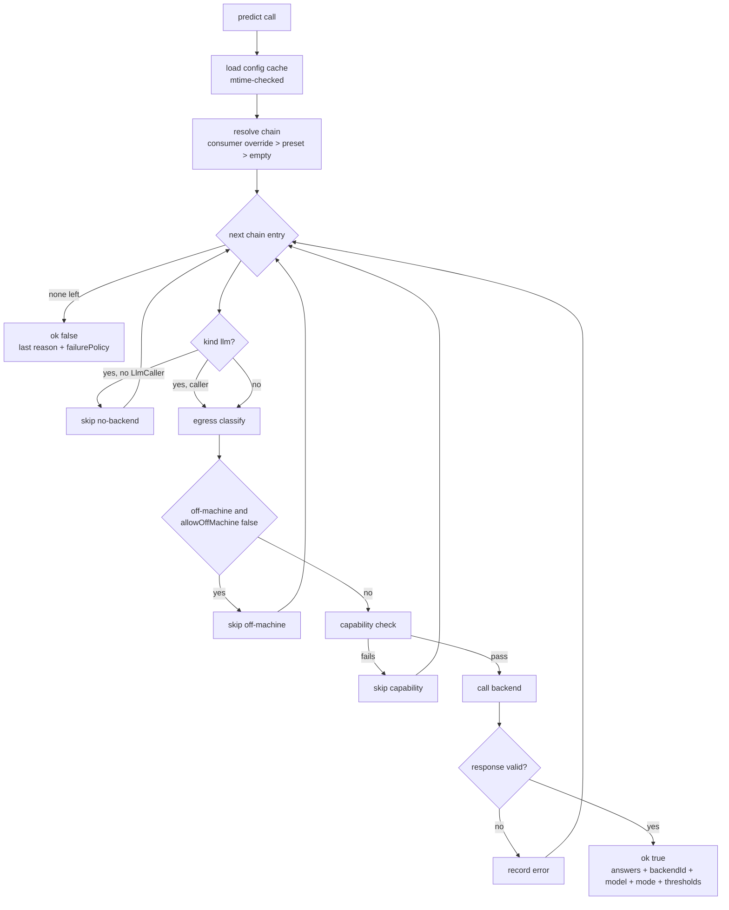

# System One — shared decision registry

## What it is

Two packages behind one shared decision service.

| Package | Role |
|---------|------|
| `@blackbelt-technology/pi-system-one` | Library. `predict`, config load + merge, catalog, capability check, egress classifier, decision log. Node built-ins only. No dashboard dependency. |
| `@blackbelt-technology/pi-dashboard-system-one-plugin` | Dashboard plugin. Settings section "Decision models (System 1)", `/api/system-one/*` routes, managed Von/Laya supervisor, eval runner. |

Consumers run in two process types: pi extensions (gates, output judges) and the dashboard server (fleet decisions). Extensions import the library directly, so they work with dashboard down.

Three question primitives: `choice`, `score`, `noul`.

- `choice`: pick one key from `criteria`.
- `score`: pick one ordered level.
- `noul`: probability in `[0, 1]` — "none of the listed" gate.

Wire: `POST /v1/systemone` with `{ model, state, questions }`.

## Config reference — `~/.pi/agent/system-one.json`

Top-level keys:

| Key | Type | Notes |
|-----|------|-------|
| `version` | `1` | Unknown version → config treated absent. |
| `allowOffMachine` | boolean | Default `false`. Master egress switch. |
| `backends` | `Record<id, Backend>` | See kinds below. |
| `presets` | `Record<name, { chain, consumers? }>` | `consumers?: Record<id, { chain }>`. |
| `activePreset` | string | Dangling name → empty chain. |
| `calibration` | `Record<"<backendId>::<consumerId>", CalibRecord>` | `{ mode, thresholds, model, measuredAt }`. |

Backend kinds:

- `http` — `{ url, model, keyRef?, timeoutMs?, capabilities? }`.
- `managed` — `{ engine: "von" | "laya", checkpoint?, port?, autostart?, capabilities? }`. Resolves to `http` backend at `http://127.0.0.1:<port>/v1/systemone`.
- `llm` — `{ role, timeoutMs?, capabilities? }`. Role ref like `@fast`. Needs injected `LlmCaller`.

Seeded presets, written by first settings save:

- `hosted` → chain `[jev, fast]` (Jev http, `llm` on `@fast`).
- `local-only` → chain `[von]` (managed).
- `activePreset` default `local-only`. `allowOffMachine` default `false`.

Keys never live in config:

1. Env var named by backend `keyRef` (e.g. `TYPESAFE_API_KEY`) wins.
2. Else `~/.pi/agent/system-one/auth.json` (0600, keyed by `keyRef`).
3. No `keyRef` → no key sent. Config field `apiKey`/`key`/`token` ignored with warning.

Project override `<cwd>/.pi/system-one.json`:

- Read only when caller passes `project: { cwd, trusted: true }`. `trusted` = pi's project-trust decision. Never hard-coded `true`.
- May set only `presets.<activePreset>.consumers.<id>.chain`.
- Chain restricted to user-defined on-machine backends. Off-machine id dropped with warning.
- Cannot set `allowOffMachine`, `backends`, `activePreset`, `calibration`.

State dirs under `~/.pi/agent/system-one/`:

| Dir | Holds |
|-----|-------|
| `consumers/` | One `<sha256(id)>.json` per declared consumer. 0600. |
| `decisions/` | JSONL per process. 30-day retention. Distributions, attempts, model, mode, sha256(state). Never state text. |
| `run/` | PID files (pid + start time + argv). |
| `tools/` | uv tool dir (`UV_TOOL_DIR`, `UV_TOOL_BIN_DIR`). |

## How to write a consumer

```ts
import { predict } from "@blackbelt-technology/pi-system-one";

const res = await predict({
  consumer: {
    id: "ctx:is_lesson",
    failurePolicy: "fail-open",
    requires: { minContextTokens: 4000 },
    fixtures: "/abs/path/fixtures.json",
  },
  state: "…transcript slice…",
  questions: {
    is_lesson: {
      type: "noul",
      instructions: "Is this exchange a reusable lesson?",
      criteria: { true: "reusable", false: "not reusable" },
    },
  },
  signal: abort.signal,
  project: { cwd, trusted },
  llmCaller,
});
```

- `id` pattern `^[a-z0-9][a-z0-9:._-]{0,127}$`. Invalid id → `ok:false`, `reason:"error"`, no network.
- Question types:
  - `choice` — `{ instructions, criteria: Record<key, desc> }`.
  - `score` — `{ instructions, criteria: string[] }` (ordered levels).
  - `noul` — `{ instructions, criteria?: { true, false } }`.
- Result `ok:true` → `{ answers, backendId, model, mode, thresholds, latencyMs }`.
- Result `ok:false` → `{ reason, policy }`. `reason` ∈ `no-backend | capability | off-machine | timeout | error`.
- Consumer applies its own policy on `ok:false`. Adapter never allows/blocks.
- `mode:"shadow"` → advisory only.
- `mode:"enforce"` → consumer enforces using `thresholds`.
- Declaration self-registers under `consumers/` on each call when changed.
- `fixtures` = absolute path to JSON array `{ state, questions, expected }`. Enables settings Test.
- Every question must get an answer. Undeclared option → that attempt `error`, chain continues.

## Egress + trust model

Classification by destination, not vendor.

- `http` on-machine only for loopback host: `localhost`, `127.0.0.0/8`, `[::1]`.
- `localhost.` (trailing dot) and IPv4-mapped IPv6 count off-machine.
- `managed` always loopback.
- `llm` on-machine only when `LlmCaller.isLocal(role) === true`.
- Server caller: `isLocal` true only for ollama/lmstudio/llama.cpp with loopback baseUrl.
- Any proxy, including dashboard model proxy, = off-machine.

With `allowOffMachine: false`, off-machine backends skipped before any bytes sent.

- Redirects disabled (`redirect: "error"`). Redirect → attempt `error`.
- Only `http:` and `https:` URLs accepted.
- Config parse drops `__proto__`/`constructor`/`prototype` at any depth. Null-prototype objects. Own properties only.
- Adapter reports `mode`/`thresholds`/`policy`. Consumer decides.

## Fallback chain, timeouts, calibration

Chain resolution order:

1. Consumer override in active preset.
2. Active preset chain.
3. Empty.

Tried in order. Skip/next on `timeout`, transport error, redirect, malformed response (`error`), `capability`, `off-machine`, `no-backend`. First success wins. No retry of same backend in one call. Caller abort stops chain → `timeout`. All fail → `ok:false` with last reason + consumer `failurePolicy`.

Default timeouts: 2 s `http`, 15 s `llm`. Adapter-owned timer, fires whether caller honours signal.

Capability check before send:

- Tokens ≈ (state chars + longest question chars) ÷ 4 vs `maxContextTokens`.
- `maxOptions` vs choice option count.
- `primitives` support.
- `unknown` never skips.

Enforcement gate: exact `<backend>::<consumer>` record whose `model` equals answering model. Moving alias (`jev-latest`) → back to `shadow`. Calibration keyed per pair.

Settings Test:

- ≤500 fixture cases, one backend, bypasses chain.
- Reports accuracy, AUC (binary `noul`), p50/p90, input chars, cost (`priceUsdPerMTok` × chars ÷ 4 ÷ 1e6).
- Threshold per binary `noul` = cut maximising fixture accuracy. Ties → nearest 0.5.
- Saving `enforce` requires confirm naming backend + model.
- Refused for off-machine backend when switch off, and for non-ready `managed` backend.

## Managed backends

macOS/Linux + `uv` only. Windows → status `unsupported-platform`, Start disabled. No `uv` → `unavailable`.

- Install: `uv tool install <package>` into `~/.pi/agent/system-one/tools/` (`UV_TOOL_DIR`, `UV_TOOL_BIN_DIR`).
- Von: `von-sdk==1.2.3` → `<bin>/von serve --host 127.0.0.1 --port <port> --model <checkpoint>`.
- Laya: `laya[serve]==0.3.20` → `<bin>/laya-serve`, no CLI flags. Env `LAYA_HOST=127.0.0.1`, `LAYA_PORT=<port>`, `LAYA_MODELS=<checkpoint>`.
- Ports 18400–18499. Never `8000`, `8080`, dashboard port, other backend port. Busy configured port → status `failed`, reason `port-in-use`; no silent move.
- Health: `GET /v1/models` 200, or 404 → one-`noul` POST. 120 s budget (covers first-run download).
- Start → `starting` → `ready`. Crash → `failed`, last 50 log lines.
- Stop: SIGTERM, then SIGKILL after 10 s.
- PID files match pid + start time + argv before orphan kill. Mismatch → remove file, no signal.
- Children stop on server shutdown and `/api/restart`.
- `autostart: true` starts on boot. Default no autostart.

## Routes

Mutations behind `networkGuard`.

| Method | Path | Notes |
|--------|------|-------|
| GET | `/api/system-one/config` | Effective config + per-backend `offMachine`. No key. |
| PUT | `/api/system-one/config` | Body `{ config, baseRevision }`. 409 `stale-revision`. Revision = sha256 of file bytes, or `absent`. Replaces only `allowOffMachine`/`backends`/`presets`/`activePreset`. |
| GET | `/api/system-one/keys` | `set`/`not set` + source (`env`/`file`). |
| POST | `/api/system-one/keys/:keyRef` | Write-only. |
| GET | `/api/system-one/consumers` | List from `consumers/`. |
| POST | `/api/system-one/eval` | Run fixtures on one backend. |
| POST | `/api/system-one/calibration` | Merge one calibration key. |
| GET | `/api/system-one/managed` | Managed backend status. |
| POST | `/api/system-one/managed/:id/start` | Start. |
| POST | `/api/system-one/managed/:id/stop` | Stop. |
| GET | `/api/system-one/managed/:id/log` | Last log lines. |

No route returns a key or key prefix.

## predict flow



See change: add-system-one-registry.
