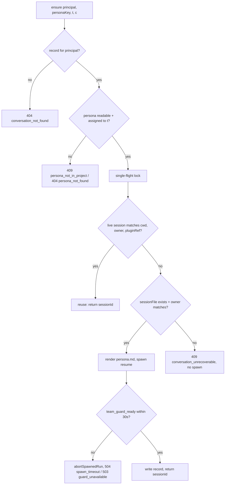

# Team plugin

Phase 1 of AI Team. Persistent per-user agents from shared + private personas, organised as project teams. See change: add-team-plugin.

## Purpose

- Named agents (persona: avatar, role, instructions, model) that remember conversations.
- Agent = persona bound to a target + user, backed by one resumable pi session.
- Phase 1 foundation only. Org chart + delegation = Phase 2. Kanban + overview = Phase 3. Schedules = Phase 4.
- No agent-to-agent delegation in Phase 1. `role: "leader"` = badge only.

## Packages

| Package | Role |
|---|---|
| `packages/team-plugin` | Public dashboard plugin + companion pi extension. id `team`, priority 100 (trusted, `spawnSession` + `pluginRef.principalOwner`). REST `/api/plugins/team/*`. Serves app at `/apps/team/`. |
| `packages/team-app` | Private Vite + React + wouter SPA. Csapat grid, project selector, persona editor, conversations. Build copied into `team-plugin/dist/app` by `scripts/build-app.mjs`. |

- `team-plugin` server entry `src/server/index.ts`; extension `src/extension/`; client claim `sidebar-folder-section` → `FolderTeamSection`.
- Host reached only through narrow `HostPort` (`src/server/conversations.ts`) — testable with fake.
- Additive host rows: `packages/shared/src/route-tiers.ts`, MCP-manifest denylist (`packages/mcp-server-plugin`).

## Data layout

`TEAM_HOME` resolution: env `PI_TEAM_HOME` (tests only) > config `teamHome` > default `~/.pi/dashboard/team`.

```
personas/<slug>.json                             shared persona
users/<uk>/personas/<slug>.json                  private persona
users/<uk>/conversations/<t>/<scope>-<slug>/<c>.json   ConversationRecord
users/<uk>/workspace/                            own workspace = cwd when t = _ws
users/<uk>/runtime/<scope>-<slug>/persona.md     rendered persona (outside every target)
projects.json                                    folder-enabled projects (schemaVersion 1)
```

- `uk` = `hex(sha256(iss+"\0"+sub)).slice(0,32)`; local operator = `local`.
- Persona key = `<scope>:<slug>`, slug `^[a-z0-9][a-z0-9-]{0,39}$`.
- Target `t` = project id (slug) or `_ws` (own workspace).
- Conversation id `c` = 22-char base64url of 16 random bytes.
- Paths built from validated slugs + `uk`. Canonicalised through longest existing ancestor `realpath`. Asserted under `TEAM_HOME`.
- Writes atomic (tmp + rename). One file per conversation.
- New directory, no migration. Rollback: disable plugin; files stay on disk, ignored.

## Modes + admin gate

| Mode | When | Admin | `bash` personas |
|---|---|---|---|
| multi-user | OIDC identity active | principal listed in config `admins` | never (rejected on write) |
| single-user | identity inactive | local operator | shared only, badged **unconfined** |

- `access.ts`: `createAccess(identity, config)` → mode + `callerOf(request)` → `Caller` (`uk`, admin flag). null ⇒ 401.
- Shared persona write = admin only. Private write = `owner == principal`. Private read = owner only (foreign key ⇒ 404).
- Single-user needs host admission without credential: loopback, `trustedNetworks`, or same-host serving. Foreign origin refused by network guard.
- `team-app` uses the dashboard login seam same-origin; app-kit OIDC for a foreign origin.

## Personas

`schemaVersion: 1`, validated JSON store. Per-persona JSON file.

- Fields: `key`, `scope`, `owner?` (private), `name`, `description`, `avatar` (gallery id or initials), `role` (`leader`/`member`), `model?`, `instructions` (markdown ≤ 32768 UTF-8 bytes, untrusted), `tools`, `projects`, `skills?`, `forkedFrom?`, timestamps.
- Shared = admin write. Private = owner write. Fork a template into own; `forkedFrom` set.
- `projects`: 1..50 distinct ids + `_ws`; default `["_ws"]`. Admin sets on shared, owner on private (only allowed ids). Unknown/not-allowed ⇒ `400 invalid_persona`. Stale ids ignored on read.
- `skills`: names resolved server-side via config `skillCatalog: { [name]: path }`. Unknown name rejected.
- Caps: 50 private per user, 200 shared. Beyond cap ⇒ `409 persona_limit`. Explicit taken fork slug ⇒ `409 slug_taken`.
- Unknown fields rejected on write. Unknown `schemaVersion` skipped on read.

### `tools` presets

| Preset | Tools |
|---|---|
| `chat` | `read, grep, find, ls` |
| `files` | `chat` + `write, edit` |
| `full` | `files` + `bash` |

- `tools: "full"` accepted only in single-user mode, shared personas only. Multi-user write ⇒ rejected; listed unavailable.
- `full` = unconfined. Badged.

## Targets

Two sources. The session cwd = the target.

- **Projects** — config `projects[id] = { name, path, users, contextFiles? }`. `path` absolute, must be a directory, pass host cwd policy, not overlap `TEAM_HOME` or `~/.pi`. Admin-authored, read-only in dashboard. `users: "*"` or `{iss,sub}[]` allowlist.
- **Folder-enabled projects** — `TEAM_HOME/projects.json` (≤ 200 entries). Enabled from dashboard folder menu by admin/operator. Immutable realpath; move = disable + enable. Config id/path wins over folder entry.
- **Own workspace** — `users/<uk>/workspace/`, target `_ws`. Shared by all of the user's agents (file hand-off). Default persona target.
- `resolveFolder(cwd)` = realpath equal a usable project, else nearest containing (longest path). Worktrees never match.
- Project path validated at activation and every ensure. `team.project_invalid {projectId, reason}` logged on invalid; treated unavailable.
- Path change ⇒ records' cwd mismatch ⇒ ensure resumes transcript in new root.

## Conversations

One conversation = one persistent pi session, keyed `(uk, personaKey, t, c)`.

- **Create** `createConversation(principal, personaKey, t)`: persona readable else `404 persona_not_found`; `t` in persona `projects` else `409 persona_not_in_project`; target allowed else `404 project_not_found`; path re-check else `409 project_unavailable`. Lock per `(uk, personaKey, t)`. Active count < `maxConversations` (default 50) else `409 conversation_limit`. Spawn, wait, write record. No record on failure.
- **Ensure** `ensureConversation(...)`: single-flight per `(uk, personaKey, t, c)`.
  - **Reuse** live session iff not ended, `cwd === T`, `principalOwner` matches, `pluginRefs.team.{personaKey, project, conversationId}` match.
  - **Resume** recorded `sessionFile` when it exists and persisted owner (live or archive) matches principal.
  - Else `409 conversation_unrecoverable`. No spawn. Never a silent empty restart.
- **Record**: `{ c, sessionId, sessionFile, runId, spawnToken, createdAt, startedAt, lastActivityAt, lastAgentEndAt, personaUpdatedAt, title?, archived, personaSnapshot }`.
- **Titles**: `record.title` (user rename 1–80 cp) ?? session name (auto-namer) ?? first-prompt excerpt (≤ 60 cp) ?? `Beszélgetés · <date>`.
- **Archive**: ends live session (graceful `abortSpawnedRun`), drops from default list + limit count. Restore re-checks limit.
- **Delete**: ends live session, removes record. Session file stays on disk.
- **Idle ending**: sweep every 5 min. Session idle > `idleMinutes` (default 30, `0` = off) gets graceful end. Ends between `idleMinutes` and +5 min.
- `busy` sessions never ended. Live processes bounded by idle ending, not conversation count.
- Logged `team.ensure {uk, personaKey, t, c, outcome, sessionId}` — never persona text, titles, paths.

### ensureConversation flow



## Persona injection

Persona reaches prompt as a **base option**, not a per-turn handler.

- `scope.appendSystemPrompt = [persona.md]` → `--append-system-prompt`. Persona rendered outside workspace.
- `scope.noContextFiles = true` → `--no-context-files`. Keeps operator + parent-dir `AGENTS.md` out.
- Project `contextFiles: true` = append only root `AGENTS.md`/`CLAUDE.md` (inside root, regular file, ≤ 64 KiB) after `persona.md`. Untrusted input.
- `scope.noProjectTrust = true` → `--no-approve`. Skips project `.pi/` resources (settings, MCP, extensions, skills, SYSTEM.md).
- `scope.sessionDir = piSessionDirForCwd(T)` → `--session-dir`. Pins pi default per-cwd folder. Outranks project `.pi/settings.json` `sessionDir`. Keeps discovery, archive, owner, resume working across restarts.
- All in `event.systemPrompt` before any `before_agent_start` handler ⇒ order-independent against dashboard bridge. Renderer neutralises cwd-anchor literal in persona text.
- Missing `persona.md` before spawn ⇒ abort with `500 persona_render_failed`, no spawn.
- Persona edits apply next session start. `personaStale` flag + `POST .../restart` keeps transcript.
- Operator `~/.pi/agent/SYSTEM.md`, if present, still replaces every host session preamble. Multi-tenant hosts should not use one.

## Isolation guard

Logical isolation (same OS user). `full` cannot be confined.

- Guard file verified at activation; routes answer `503 guard_unavailable` otherwise.
- Extension sends `team_guard_ready` plugin message on session start. Session without ready signal aborted.
- **Name gate** — deny-first `tool_call`: tool name not in preset blocked before execution. Covers extension tools, MCP, `codemode`/`tool_search`.
- **Path gate** — path args of `read, write, edit, grep, find, ls` canonicalised (symlinks resolve) + must lie inside target root `T`. Missing arg = cwd = `T`. Unparseable policy/path ⇒ block.
- Fail-closed. Policy from `PI_EXT_TEAM_TOOLS` + `PI_EXT_TEAM_ROOT`.

## REST surface

`/api/plugins/team`, JSON, lowercase error codes. `401` without principal in multi-user. `t` = `?project=<id|_ws>` where listed.

| Method + path | Purpose |
|---|---|
| `GET /me` | `{ uk, iss, sub, admin, mode }` |
| `GET /projects` | caller's allowed projects `{ id, name, contextFiles, available, source }` (+ `path`, `users` for admins) |
| `POST /projects/match` | body `{ cwds }` → per-cwd project match + `enableable`; never spawns |
| `POST /projects` | enable folder (admin) → `201 { id }`; `409 project_exists` |
| `PATCH /projects/:id` | folder-enabled only; config ⇒ `409 project_readonly` |
| `DELETE /projects/:id` | folder-enabled only (disable); config ⇒ `409 project_readonly` |
| `GET /users` | admin, multi-user: known users `{ iss, sub, email?, name?, lastSeenAt }` |
| `GET /personas` | shared + caller's private |
| `POST /personas` | create (`scope` decides gate) |
| `PUT /personas/:key` | update |
| `DELETE /personas/:key` | delete; conversations become `retired` |
| `POST /personas/:key/fork` | body `{ slug? }`; taken explicit slug ⇒ `409 slug_taken` |
| `GET /agents?t` | personas for target: status, `activeCount`, `latest`, `personaStale`, `unassigned` |
| `GET /agents/:key/conversations?t&archived=` | caller's conversations, newest first |
| `POST /agents/:key/conversations?t` | create → `{ id, sessionId }` |
| `POST /agents/:key/conversations/:c/session?t` | ensure → `{ sessionId }` |
| `PATCH /agents/:key/conversations/:c?t` | `{ title?, archived? }` |
| `POST /agents/:key/conversations/:c/restart?t` | end live session, keep record |
| `DELETE /agents/:key/conversations/:c?t` | end live session, delete record (file kept) |

- Encapsulated scope with `@fastify/rate-limit` (mcp-server-plugin values). `ROUTE_TIERS` row + MCP classification per route.
- `GET /agents` = one `listAll` pass, never spawns.

## App delivery

- Default: dashboard serves the SPA at `/apps/team/` — same origin, host dashboard sign-in. No CORS entry, no extra server, no extra Keycloak client.
- `team-app` builds base `/apps/team/`. `scripts/build-app.mjs` copies build → `team-plugin/dist/app` at pack time.
- Static routes: `GET /apps/team` → 308. `GET /apps/team/*` → file under `dist/app/` (realpath-confined) else `index.html`. Missing build ⇒ 503. `/apps/*` outside network guard; carries no data.
- Env only via `AppHost` contract (`@blackbelt-technology/pi-dashboard-app-kit`): `host.api.fetch`, `host.api.wsUrl`, `host.setTitle`. Library entry `./app` via `defineDashboardApp`.
- Sign-in: dashboard login seam (`startSignIn` → identity `loginUrl?returnTo=/apps/team/…` → handoff → `tokenUrl` → in-memory bearer). Foreign origin = app-kit OIDC.
- Embedded host caught by `add-plugin-app-host`: global `/team/*` + folder `/folder/:encodedCwd/team/*`. **Deferred** — until it lands, claims not registered, folder entry + menu item open standalone `/apps/team/?project=<id>` in a new tab.
- Optional standalone: same `dist/` + runtime `config.json` under `/apps/team/`. Needs CORS origin, HTTPS (PKCE), public Keycloak client.

## Trust boundary + known limits

- Isolation logical, same OS user. Same-origin: shared browser storage + service-worker scope; XSS blast radius shared (both render agent output via `ChatView`). Use standalone for separation.
- `bash` (`full`) cannot be confined — single-user mode only, unconfined badge.
- Projects shared trees. All allowed users' agents read; `files` preset writes concurrently, no locking.
- Never point a project at secrets (`~/.ssh`, cloud creds). Project path may not contain or lie inside `TEAM_HOME` or `~/.pi`.
- Persona `instructions` + `contextFiles` = untrusted prompt input. Confinement enforced by guard, not prompt.
- Team session files in pi normal per-cwd folder ⇒ terminal `pi --resume` in a project lists them. Dashboard UI stays owner-filtered.
- Operator `SYSTEM.md` applies to team sessions. Multi-tenant hosts should not use one.
- No agent-to-agent delegation Phase 1. `full` persona can call dashboard REST / start `pi` — bypasses records + ownership (why single-user only).
- No live-session cap Phase 1; idle ending bounds processes. Revisit in Phase 2.
- Rollback: disable/uninstall plugin; `TEAM_HOME` + session files stay, reused on re-enable.
