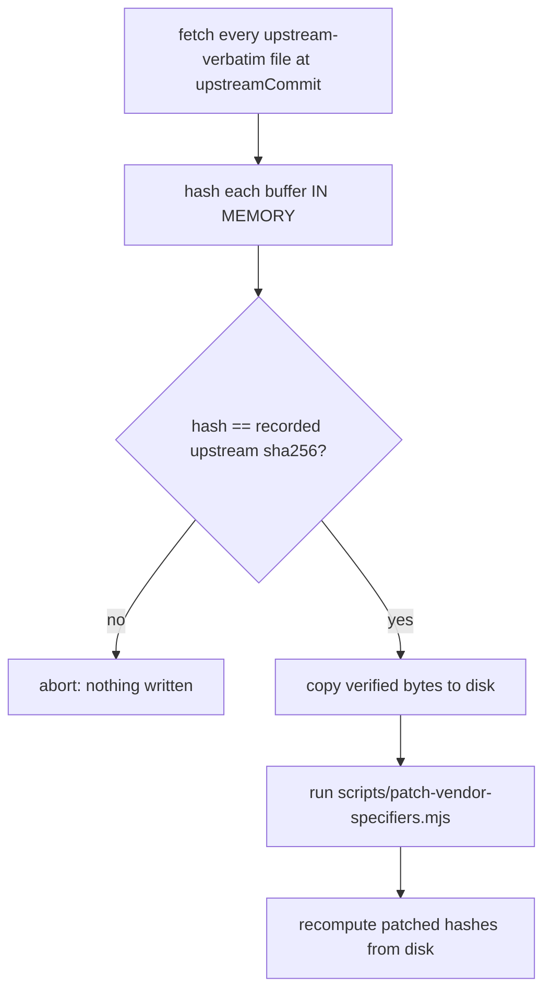

# Vendored Relay Refresh

How the browser plugin's vendored playwright-core CDL relay is refreshed, and
why its import specifiers are patched.

Scope: `packages/browser-plugin/src/server/relay/vendor/`. Operator page.
See change: fix-browser-plugin-vendor-specifier-resolution.

## Why the import rewrite exists

Upstream `cdpRelay.ts` / `cdpRelayV2.ts` address their own helpers through
playwright-internal specifiers: `@isomorphic/manualPromise`, `@isomorphic/time`,
`@isomorphic/timeoutRunner`, `@utils/wsServer`. Not registry packages.

Previously resolved by three alias layers: tsconfig `paths`, a vitest
`resolve.alias`, `JITI_TSCONFIG_PATHS`. No such layer exists in an npm /
managed `~/.pi-dashboard` / Electron-bundled install, so the plugin failed to
load there (`Cannot find module '@isomorphic/manualPromise'`).

Rewritten to package-relative `../../../../shims/*.js`. Resolution depends only
on files inside the published package. Relay behaviour unchanged; only import
paths changed.

## Provenance kinds

`packages/browser-plugin/src/server/__tests__/vendor-hashes.json` records one
entry per vendored file.

- `upstream-verbatim` — byte-identical to upstream. Records `upstream` (bytes at
  `upstreamCommit`) + `patched` (bytes on disk).
- `authored` — replaces an upstream module, no upstream counterpart. Records
  `patched` only.

Two authored files: `playwright-core/src/server/registry/index.ts` and
`shims/wsServer.ts`.

## Refresh sequence

Order non-reorderable.



1. Fetch every `upstream-verbatim` file at the manifest's `upstreamCommit`.
2. Hash each fetched buffer IN MEMORY, assert against the recorded `upstream`
   sha256. Mismatch aborts before any write.
3. Copy the verified bytes to disk. Copy matters: patching whatever is on disk
   would accept a file from any revision.
4. Run `scripts/patch-vendor-specifiers.mjs` — rewrite specifiers, emit the
   Apache-2.0 §4(b) notice.
5. Recompute `patched` hashes from disk.

```bash
node scripts/refresh-vendor.mjs            # full: fetch -> verify -> copy -> patch -> rehash
node scripts/refresh-vendor.mjs --verify   # fetch + verify only, no writes
node scripts/refresh-vendor.mjs --rehash   # patched hashes from disk only
```

### Invariants

- `upstream` is NEVER derived from disk. Only the fetch path may set it, and
  only a human bumps `upstreamCommit` (new commit + new `upstream` hashes).
  Otherwise the assertion compares a value against itself.
- `patched` IS recomputed from disk.
- NEVER hand-edit anything under `relay/vendor/`.

## Apache-2.0

- §4(b): modified files carry an in-file change notice. The patch script emits
  it. Idempotent — present exactly once, never stacked. Part of the `patched`
  bytes and the hash.
- §4(d): `relay/vendor/NOTICE` lists modified files under a Modifications
  section, never as verbatim.

Modified files: `cdpRelay.ts` (4 specifiers rewritten), `cdpRelayV2.ts`
(1 specifier rewritten).

## Guards

- `scripts/check-vendor-specifiers.mjs` — every import under `relay/vendor/`
  must be a Node builtin, a declared dependency, or `./`/`../`. Parses import
  syntax; never greps (`NOTICE` / `AGENTS.md` legitimately name the old
  specifiers). Runs in ship gate + CI.
- `packages/browser-plugin/src/server/__tests__/vendor-integrity.test.ts` —
  `patched` matches disk, each entry carries the keys its `kind` requires, the
  file set is exactly the manifest's. Fails on drift, added file, removed file.
  Cannot prove `upstreamCommit` fidelity (circular); that lives in the refresh.
- Install-load gate (`scripts/verify-plugin-install-load.mjs`) — pack, extract
  outside the repo, install, import under plain node+jiti with no repo tsconfig
  and `JITI_TSCONFIG_PATHS` unset. Asserts `typeof mod.default === "function"`.
- Docker gate (`scripts/verify-docker-plugin-load.mjs`) — boot the image,
  assert `browser` discovered + loaded, no unexpected load failure, no `JITI_*`
  in container env. CI job `docker-plugin-load`.

See change: fix-browser-plugin-vendor-specifier-resolution (D1–D4).
