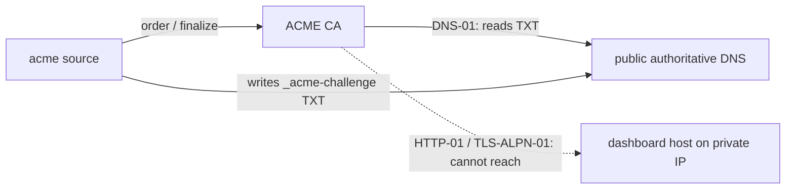

## Context

See proposal.md — Why. Builds on `add-tailscale-cert-tls` (must be merged first): its `CertSource` interface (`id`, `obtain(name, onStage)` → `{ certPem, keyPem, advertise, kind }`, `RetryAfterError`), `CertManager` (12 h tick, renew at <1/3 validity, single-flight per name, `trigger(name)`, exponential backoff capped 6 h), `TlsCertStore` (exact → single-label wildcard SNI, fail-closed), `tls` config deep-merge + validation, disclosure-gated `/api/health.tls`, and `tlsListenerUrls()` feeding both enumeration and the pairing reachable-URL closure. This change adds one source and needs **no** modification to those capabilities.



## Goals / Non-Goals

**Goals**: DNS-01 only; two solvers that together cover every DNS host (Cloudflare directly, everything else via acme-dns CNAME delegation); staging-first; zero inbound internet exposure; no change to the prerequisite's capabilities.

**Non-Goals**: HTTP-01/TLS-ALPN-01; IP certificates; per-vendor solvers beyond these two; managing the A/AAAA record that points the domain at the mesh IP (operator's job — readiness shows what public DNS returns); EAB (External Account Binding) flows; advertising wildcard names (served, never enumerated — no concrete URL).

## Decisions

### D1 — `acme-client` for the protocol
RFC 8555 needs JWS signing, nonce handling, order/authorization polling, CSR generation. `acme-client@^5` (MIT, shipped TS types; deps `@peculiar/x509`, `asn1js`, `axios`, `debug`, `node-forge`) implements it. We use its low-level API (`createAccount` with `termsOfServiceAgreed` from `agreeTos` → `createOrder` → `getAuthorizations` → solver → `completeChallenge` → `waitForValidStatus` → `finalizeOrder` → `getCertificate`) instead of `auto()`, so each stage calls `onStage` and cleanup is ours. `acme-client` exposes no abort signal, so hangs are bounded at every layer: (1) per-request timeout 30 s on the library's exported axios instance (`acme.axios.defaults.timeout`) and `AbortSignal.timeout(30_000)` on every solver/DoH `fetch`; (2) bounded polling (`backoffAttempts`/`backoffMax`); (3) an outer `Promise.race(attempt, deadline(10 min))` — on deadline the attempt is marked abandoned, the single-flight slot is released, the late result is discarded, and challenge cleanup is invoked directly (best-effort) rather than waiting on the attempt's `finally`. *Alternatives*: hand-rolled RFC 8555 (~500 lines of crypto-sensitive code) — rejected; shelling out to `lego`/`certbot` (external binary per OS) — rejected for v1.

### D2 — Solver interface
```ts
interface Dns01Solver {
  readonly type: "cloudflare" | "acme-dns";
  publish(domain: string, value: string): Promise<{ ref: string }>;   // domain may be "*.x" → owner _acme-challenge.x
  cleanup(ref: { ref: string }): Promise<void>;
  check(domain: string): Promise<{ ok: boolean; hint?: string }>;     // per-domain readiness
}
```
- **cloudflare**: plain `fetch` to `api.cloudflare.com/client/v4`; strip a leading `*.`; zone by longest-suffix match; `POST dns_records` TXT (TTL 60); `DELETE` on cleanup (always, in `finally`). Token needs `Zone.DNS:Edit` on one zone. `check` = token verify + zone found.
- **acme-dns**: `POST <server>/update` with `X-Api-User`/`X-Api-Key`, `subdomain`, `txt`; `cleanup` no-op. An acme-dns subdomain holds at most two TXT values, so an acme-dns source runs **one order at a time** (source-level mutex around `obtain()`). `check(domain)` = CNAME at `_acme-challenge.<domain minus a leading "*.">` → the configured full domain; hint shows the exact record.

### D3 — Propagation check against authoritative servers
Recursive resolvers may cache the pre-publication negative answer for the zone's SOA minimum (often 30 min), so polling them gives false timeouts. Instead: resolve the zone's NS set (via DoH, avoiding split-horizon/MagicDNS), then query **each authoritative server directly** (`dns.Resolver` with `setServers(nsIPs)`, outbound UDP/TCP 53 only) every 5 s until all return the TXT value, up to 180 s. For acme-dns the authoritative set is the acme-dns server's. DoH (`cloudflare-dns.com`, `dns.google`) is the fallback when direct UDP 53 is blocked, with the negative-cache risk noted in status.

### D4 — Advertisement classification
`production` → `advertise: true`; `staging` → `advertise: false`, `staging: true`; an explicit URL equal to Let's Encrypt's staging or production directory is normalized to that keyword first; any other `https://` directory → `advertise: source.advertise === true` (operator assertion). `configFingerprint(name)` covers directory, advertise, solver type and email — **not** the domain list (added names have no cert → issued; removed names → pruned by the prerequisite), so editing one domain never re-issues the others (Let's Encrypt duplicate-certificate limit). Directory/advertise/solver/email changes re-issue through the prerequisite's reconcile. Status fields `directory`, `staging`, `solverType` are returned via `ObtainedCert.details`; per-domain CNAME/credential gates via name-scoped `Gate`s. Source-level cleanup (secrets entry, orphaned account key) runs in `onRemoved()`. Returned from `obtain()`; the prerequisite's `tlsListenerUrls()` already filters on it. Endpoint `kind: "domain"`.

### D5 — Credentials file and routes
`~/.pi/dashboard/tls/acme-credentials.json` (`0600`, atomic write), `{ [sourceId]: { cloudflareToken? , acmeDnsUser?, acmeDnsKey? } }`. Non-secret acme-dns `server` + `subdomain` live in config. Routes (both require `canDiscloseAccessPosture(request)` — authenticated or genuinely local — on top of the normal network guard):
- `PUT /api/tls/acme/:sourceId/credentials` — write-only; then invalidate the readiness cache and `CertManager.trigger(sourceId)` (all due names).
- `POST /api/tls/acme/:sourceId/issue` — body `{ domain? }` → `CertManager.trigger(sourceId, domain)` (single-flight per `(sourceId, name)`).
`GET /api/config` projects `solver.configured: boolean`; `configured` is stripped on write. Source removal (reconcile) deletes the source's secrets entry and any account key no longer referenced (D8).

Gateway UI edits send the **full** current `tls.sources` array with only the edited acme entry changed (the prerequisite replaces `sources` wholesale), so other sources round-trip unchanged.

### D6 — Redaction
Never log raw `axios`/`acme-client` error objects; log `{ sourceId, domain, stage, status, problemType }` plus a message passed through a redactor that replaces the current secret values (raw and URL-encoded). `acme-client`'s `debug` namespace is never enabled by the server.

### D7 — Retry policy
CA-side `invalid` challenge → `RetryAfterError(1h)`. Propagation timeout, DNS API 5xx, network error → plain error (manager's exponential backoff). DNS API 401/403 → `RetryAfterError(6h)` + unmet `credentials` gate. Manual "issue now" is the only bypass and is single-flight, so it cannot stack parallel orders.

### D8 — Key types
Certificate and account keys: ECDSA P-256. One account per (directory, email) at `~/.pi/dashboard/tls/acme-account-<sha256(dir + email)[:12]>.key`; deleted on reconcile when no configured source references it.

### D9 — Readiness caching
`check(domain)` results cached 5 min per `(sourceId, domain)`; refreshed on config/secret change, before an issuance attempt, or on explicit UI refresh. Status reads only the cache.

### D10 — Test seams for the Pebble harness
The docker test harness gains an overlay compose file `docker/compose.test.acme.yml` (layered by `docker/test-up.sh` when `TEST_ACME=1`, same mechanism as `compose.test.cap.yml`): `letsencrypt/pebble` (ACME CA), `letsencrypt/pebble-challtestsrv` (authoritative DNS for the test zone, `dash.test`), and a ~50-line Cloudflare-API shim that maps `POST/DELETE dns_records` onto challtestsrv's `/set-txt` / `/clear-txt`. Three env overrides, honoured **only when `PI_E2E_SEED=1`** (same gate as the existing e2e seams), point the server at them: `PI_E2E_CLOUDFLARE_API` (shim base URL), `PI_E2E_DNS_AUTHORITATIVE` (`host:port` used instead of NS discovery), and Pebble's root via `NODE_EXTRA_CA_CERTS`. Production code paths are unchanged when the gate is off.

## Risks / Trade-offs

- [DNS API token = ability to rewrite the zone] → least-privilege guidance (single zone, DNS:Edit); recommend acme-dns delegation whose secret can only change one TXT value.
- [Let's Encrypt rate limits] → staging default, 1 h floor after CA failure, single-flight manual trigger.
- [Staging certificates are served on the real domain during setup → browser warnings] → intended for pipeline verification; status labels them `staging`; UI prompts the switch to production.
- [Domain names land in public CT logs; A record exposes a private IP] → stated in setup guidance.
- [Operator lists the ACME domain in `publicBaseUrls` while only a staging cert is held] → that path is operator-asserted and bypasses `advertise`; documented, not enforced.
- [Wildcard-only source is served but never advertised] → documented; pair via a concrete name.
- [Dependency weight] → server package only; pinned major; reviewed under doubt-driven-review.
- [Shorter CA lifetimes coming] → renewal is lifetime-relative.

## Migration Plan

Additive; requires `add-tailscale-cert-tls` merged. Rollback: remove the `acme` source → reconcile deletes its certificates/keys, its secrets entry and any orphaned account key; revoke the DNS token at the provider.
