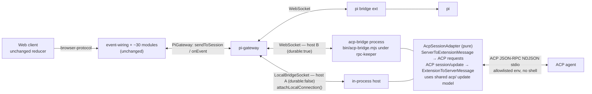
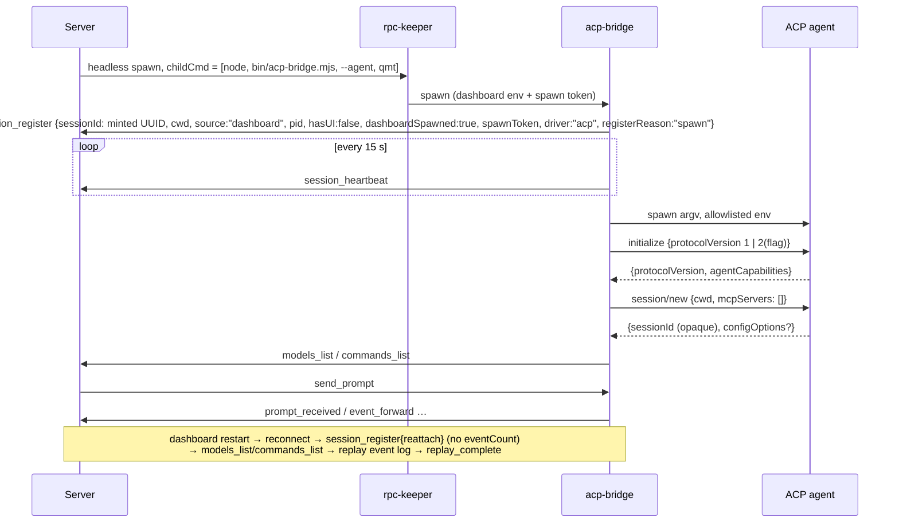

## Context

A pi session reaches the dashboard through the bridge extension (`packages/extension/src/bridge.ts`), which speaks the bridge WS protocol (`packages/shared/src/protocol.ts`) to the local pi gateway (`packages/server/src/pi/pi-gateway.ts`): `session_register` (required `sessionId`, `cwd`, `source`; plus `spawnToken`, `pid`, `hasUI`, `dashboardSpawned`, `registerReason`, `eventCount`), `session_heartbeat` every 15 s (gateway drops a session after 180 s silence), `event_forward { event: DashboardEvent }`, `prompt_received`, `queue_update`, `models_list`, `commands_list`, `prompt_request` (interactive prompt: `prompt.{type,question,options}`, `component`, `placement` — built by the extension's `prompt-bus.ts`), `bridge_diagnostic`, `replay_complete`; inbound `send_prompt`, `abort`, `set_model`, `set_thinking_level`, follow-up edits, `prompt_response`, and many pi-only requests. Registration, replay, prompt relay, queue mirror, spawn correlation/watchdog and persistence (`sessionToMeta`) are keyed to that protocol. Headless pi runs under a per-session `rpc-keeper` that outlives server restarts; the bridge reconnects and re-registers with `registerReason: "reattach"`, then replays.

The UI spawns via WS `spawn_session` (`browser-handlers/session-action-handler.ts` `handleSpawnSession`, with `preflightSpawn` checking pi/tmux); REST `POST /api/session/spawn` (`session/session-api.ts`) is the API path. Both reach `spawnPiSession` → `spawnHeadless`, which resolves pi (fails `PI_NOT_FOUND`) and builds `["--mode","rpc",…]` via `buildHeadlessArgs`. The server ships as TS run through jiti (`packages/server/bin/pi-dashboard.mjs`); Electron bundles only whitelisted workspace packages (`packages/electron/scripts/bundle-server.mjs`).

ACP is JSON-RPC 2.0 over NDJSON stdio. v1 is what shipping agents speak (querymt `qmtcode --config <toml> --stdio`, `@agentclientprotocol/claude-agent-acp`, `codex-acp`). v2 is Draft: `session/prompt` resolves on acceptance (`{messageId}`), foreground state via `state_update running|requires_action|idle(+stopReason)`, id-keyed upserts, `session/load` → `session/resume{replayFrom}`, modes → config options, client `fs/*`/`terminal/*` removed, `usage_update` = context occupancy/cost, open enums.

Design history: a server-side `AcpDriver` was rejected after two doubt-review cycles (it re-implemented bridge-owned machinery). A third cycle on the adapter design drove the integration fixes recorded below.

## Goals / Non-Goals

**Goals**
- Supervise any user-configured ACP agent (querymt reference target): spawn in cwd from UI and REST, streaming (incl. live thinking), tool cards, permission prompts, queue, cancel, model/thinking selection when advertised, survive dashboard restart.
- Reuse the bridge protocol and every server/client path; server changes limited to spawn plumbing, additive optional fields, guards, config parse/redact/preserve, `driver` persistence.
- Typed v2 update model in `packages/shared` as the single v1/v2 normalisation point.

**Non-Goals**
- Northbound ACP; pi→v2 projection; v2-native reducer; pi-acp coexistence; ACP remote transport.
- Resuming an ended ACP session (`session/load` / `session/resume` after the agent died).
- Generated per-session agent config (querymt TOML with dashboard MCP/hook injection).
- Filesystem-level isolation of the agent from same-user dashboard files (agent runs as the user; isolation is env-level only).
- Windows `.cmd`/`.bat` agent commands (require a shell) — rejected with a clear error in phase 1.
- pi-only features for ACP sessions (flows, subagents, extension UI, kb/memory/roles, fork/tree, reload, steering, on-demand transcript, file listing, terminal commands, token/cost stats); plan rendering beyond the debug raw-event view.

## Architecture

The server's session seam is the `PiGateway` interface, not the WebSocket: `event-wiring.ts` + ~30 modules use only `sendToSession(sessionId, ServerToExtensionMessage)` (70 call sites), `onEvent(sessionId, ExtensionToServerMessage)` (43 inbound types) and a few lookups. The socket lives only in `pi-gateway.ts` (`connections: Map<sessionId, WebSocket>`, per-connection handler closure over `(ws, req)` using `on(message|close|pong)`, `send`, `close`, `readyState`, ping). ACP is therefore added as a **transport-agnostic translation core** between the bridge message set and ACP, mounted by one of two hosts.

## Decisions

### D1 — Transport-agnostic core + two hosts
Code in `packages/server/src/acp-bridge/`:
- **Core**: `acp-session-adapter.ts` — `createAcpSessionAdapter({ agent, cwd, sessionId, spawnToken, send: (m: ExtensionToServerMessage) => void, log })` → `{ start(), handle(m: ServerToExtensionMessage), reconnected(), stop() }`. No sockets. Owns the ACP connection (`acp-connection.ts`), session state (`session-state.ts`), event log (`event-log.ts`), child env (`child-env.ts`) and the exhaustive server-message switch (`server-requests.ts`). The pi↔ACP construct mapping is one table in the core — also the future basis for northbound ACP.
- **Host A — in-process** (`local-host.ts`, agent `durable: false`, default): server creates a `LocalBridgeSocket` (duck-typed WebSocket: `readyState` OPEN, `send` → core, `close`, `ping` → immediate `pong`, `message`/`close`/`pong` events) and calls new `piGateway.attachLocalConnection(socket)`, which runs the **same** per-connection handler as a real upgrade (closure extracted to a named function; no behaviour change for sockets). Origin attributed local via new transport label `"local"` (treated like `unix`) — with no upgrade request, attribution would otherwise fail closed to remote. No auth, gateway client, jiti launcher or keeper. Agent child spawned by the core; session **ends when the server stops** (agent killed on shutdown; stdin EOF on crash).
- **Host B — out-of-process** (`main.ts` + `gateway-client.ts`, agent `durable: true`): launcher `packages/server/bin/acp-bridge.mjs` (jiti, mirrors `pi-dashboard.mjs`) under the rpc-keeper; `gateway-client.ts` is a minimal local-only WS client (gateway URL/port + local token header via the local-bridge helper, backoff reconnect, send buffering, 15 s heartbeat). Survives server restart (D11). Does not import the extension's `ConnectionManager`.
- `@agentclientprotocol/sdk` is a `packages/server` dependency (pinned minor) — shipped by the npm and Electron server bundles unchanged.
*Alternatives*: server-side driver bypassing the gateway (rejected in doubt-review: re-implements bridge-owned machinery); separate workspace package (rejected: packaging whitelist).

### D2 — Spawn plumbing (UI + REST)
- `spawn_session` (WS) and `POST /api/session/spawn` gain optional `agent`. Unknown agent → error; no agents configured → error. Routing by the agent's `durable` flag: `false` → host A (`startLocalAcpSession`: mint spawn token + session id, arm the register watchdog as for any spawn, create core + `LocalBridgeSocket`, attach; the core registers immediately so the watchdog clears; the agent pid is recorded in the headless PID registry so shutdown/kill paths reach it); `true` → host B via the keeper as below.
- Host B: `SessionOptions` gains `childCmd?: string[]`. When set, `spawnHeadless` skips pi resolution, `buildHeadlessArgs`, heap and pi runtime argv shaping, and passes `childCmd` to the keeper as `piCmd` + `piArgs` (non-empty, so the keeper never adds `--mode rpc`). The node binary is the one already resolved for the keeper (Electron: `ELECTRON_RUN_AS_NODE` path handled by keeper-manager today).
- ACP spawns force headless regardless of `spawnStrategy` and use an ACP preflight (cwd checks + node + agent command resolvable on `PATH`/absolute) instead of the pi/tmux preflight.
- Spawn token, headless PID registry, register watchdog, spawn-error surfacing unchanged. The adapter **registers first** (like pi at `session_start`), before starting the agent, so the watchdog is satisfied within seconds. Watchdog reclaim-by-token cannot identify a `node` adapter (`process-identify.ts` matches `pi`); it falls back to the keeper pid, whose shutdown kills adapter + agent — accepted.

### D3 — Agent config, env, and credentials
Agent schema: `{ id, name, command, args?, env?, durable? }` (`durable` default `false` → host A). The core reads `acpAgents` by id from `~/.pi/dashboard/config.json` (host A: from the server's loaded config; host B: from disk in the adapter process). Launch `spawn(command, args ?? [], { cwd, env, shell: false })`; on Windows a `command` ending `.cmd`/`.bat` → clear error. Child env = allowlist from adapter env (`PATH`, `HOME`, `USER`, `LOGNAME`, `SHELL`, `TERM`, `LANG`, `LC_*`, `TMPDIR`, `TZ`, `SystemRoot`, `APPDATA`, `LOCALAPPDATA`, `USERPROFILE`, `ComSpec`, `PATHEXT`) + configured agent `env` **minus** keys matching `PI_*`, `ELECTRON_*`, `NODE_OPTIONS` (dropped with warning).
Config API: `readConfigRedacted` replaces each `acpAgents[].env` value with `***`; `writeConfigPartial` preserves the on-disk value for any `acpAgents[i].env[k] === "***"` (matched by agent `id` + key), following the existing auth/tunnel preserve pattern. The browser spawn picker uses a dedicated `{id, name}` projection.

### D4 — Version negotiation
`initialize` requests 1 by default, 2 when `acp.protocolV2 === true`; accepts 1, or 2 only when requested. Client capabilities: `fs: {readTextFile:false, writeTextFile:false}`, `terminal: false`.

### D5 — Startup failure surfacing
Because the adapter registers before initializing, any failure (agent spawn error, `initialize`/`session/new` error, auth required, unsupported version, `acp.spawnTimeoutMs` default 30 s elapsed) is shown in the session's chat as an `agent_end` error event with the cause, logged via `bridge_diagnostic` (new additive `BridgeDiagnosticEvent` member `"acp"` with a text `detail`), then the core unregisters and stops: host B exits non-zero; host A closes its `LocalBridgeSocket` (gateway treats it as a disconnect). `spawnTimeoutMs` is independent of the register watchdog.

### D6 — Update pipeline (in the adapter)
stdout → bounded line splitter (`acp.maxLineBytes`, default 4 MiB; over-long line discarded through newline, counted) → non-JSON skipped (counted) → JSON-RPC dispatch (SDK framing) → `normalizeV1` (v1) → `toDashboardEvents` → `event_forward` + event-log append. Counters reported via `bridge_diagnostic` `"acp"` at most once/min. The agent's ACP `sessionId` is opaque: kept in adapter memory only, never used as a path or dashboard id. The dashboard `sessionId` is a UUID minted by the adapter.

### D7 — `toDashboardEvents` rules (shared)
- **Assistant segment grouping**: all `agent_thought*` / `agent_message*` between segment boundaries (tool-call start, `requires_action`, idle, user message) fold into **one** pi `AssistantMessage` (thinking + text blocks) regardless of ACP ids → one `message_start`, `message_update`s, one `message_end`.
- **Live streaming**: each `message_update` carries both the accumulated `data.message` snapshot and a pi-style `data.assistantMessageEvent` delta (`text_delta` / `thinking_start` / `thinking_delta` / `thinking_end`) so thinking streams live exactly as for pi.
- `state_update running` (first of turn) → `agent_start`; `idle` → `turn_end {message}` + `agent_end {messages}` + `agent_settled`.
- **Stop-reason vocabulary**: `end_turn`→`stop`, `cancelled`→`aborted`, `max_tokens`/`max_turn_requests`→`length`, `refusal`→`error` (errorMessage "Agent refused"), other→`stop` + `data.acpStopReason`.
- Tool calls → `tool_execution_start/update/end` (`failed` → `isError: true`); terminal output referenced by a tool call folds into that tool's updates; unreferenced terminal output dropped (counted).
- `requires_action` enter/exit → `ui_prompt_start` / `ui_prompt_end`.
- `model` config option → `model_select { model: {provider: "acp:<agentId>", id} }`; `thought_level` → `model_select { thinkingLevel }` without `model`.
- `plan_update` → one `acp_plan_update` event per change (visible only in the debug raw-event view — accepted; no reducer change).
- `usage_update`, `available_commands_update`, `session_info_update`, unknown → no chat event (counted). The adapter separately turns `available_commands_update` into a `commands_list` message (`CommandInfo.source` gains additive member `"acp"`) and a `session_info_update` title into a `session_name_update` message.

### D8 — Prompts, echo, queue, cancel
- `send_prompt` while idle → user-turn events synthesised from the prompt → `session/prompt` → `prompt_received { promptId, fresh: true }` (v2 on acceptance; v1 on write).
- While not idle (incl. `delivery: "steer"`) → adapter queue; `prompt_received { fresh: false }` + `queue_update`; follow-up edit/remove/promote/clear act on it; dequeued on idle.
- **Echo suppression without race**: while a dashboard prompt awaits acceptance, agent `user_message*` updates are held; on acceptance those matching the response `messageId` (v2) — or, for v1, all user chunks during the active dashboard prompt — are dropped; others emitted. User messages with no pending dashboard prompt are emitted.
- Rejected `session/prompt` → `agent_end` with error + idle; queue continues.
- `abort` → `session/cancel`; pending permissions answered `cancelled`.

### D9 — Permissions and other agent requests
`session/request_permission` → `prompt_request` built exactly as the extension's `prompt-bus.ts` builds a `select` prompt (`prompt.type: "select"`, `question` = v2 `title` / v1 tool-call title, `options` = `options[].name`, same default `component` / `placement`); matching `prompt_response` → `{outcome:{outcome:"selected", optionId}}`; `prompt_cancel` / dismiss / abort → `cancelled`. `fs/*`, `terminal/*`, unknown `_` requests → `-32601`; notifications never answered. Outbound non-prompt requests time out after `acp.requestTimeoutMs` (default 30 s) → `notify` error.

### D10 — Server→bridge message coverage
`server-requests.ts` handles the **full** server→extension message union with a compile-time exhaustive switch: supported messages act (prompt, abort, model, thinking, follow-up edits, prompt_response/cancel, request_state_sync → resend register+lists, shutdown); messages that expect a reply get a deterministic empty/refused reply (e.g. `transcript_request` → refused `transcript_chunk`, `list_files` → empty `files_list`); all others are ignored with a debug count. A new union member added later fails the build until handled.

### D11 — Reattach after dashboard restart (host B only)
Host A sessions end on server stop/restart like a crashed pi. Host B: adapter state (JSON-RPC ids, queue, accumulators, pending permissions) lives in the adapter process (kept alive by the keeper). Event log: `~/.pi/dashboard/acp/<dashboardSessionId>.events.jsonl`, async batched appends, capped at `acp.eventLogMaxBytes` (default 64 MiB) — on cap, truncate at a turn boundary and record a notice event. On reconnect: `session_register { registerReason: "reattach", driver: "acp" }` **without `eventCount`** (forces the server to accept the full replay) → `models_list` / `commands_list` / current model state → replay log as `event_forward` (including in-progress segment snapshot) → `replay_complete` → re-send pending permission as a fresh `prompt_request`.

### D12 — `driver` persistence and degraded-feature contract
`driver` and `acpAgentId` (additive `SessionRegisterMessage` fields) are accepted by the gateway register normaliser, stored on `DashboardSession`, added to `SessionMeta` + `sessionToMeta` (so ended/restored ACP sessions keep it), and included in session payloads. Server rejects pi-only browser ops (flow control/management, extension command dispatch, fork/tree, reload/retry, role pushes, stop-after-turn, terminal commands, file listing) for `driver: "acp"` with a typed "unsupported for ACP sessions" error before forwarding. Client hides the controls by `driver`.

### D13 — Clarified behaviours (scenario-design gate; defaults adopted, override welcome)
- **Agent exits/crashes while adapter alive** → error shown in chat, pending permissions + queue answered/cleared, adapter unregisters and exits → session ends (same as a pi crash).
- **Invalid `acp.*` numbers** → clamped per key with a warning: `spawnTimeoutMs` 5 000–120 000, `requestTimeoutMs` 1 000–300 000, `maxLineBytes` 64 KiB–64 MiB, `eventLogMaxBytes` 1 MiB–1 GiB; non-numbers → default + warning.
- **Duplicate agent id** → first entry wins; later duplicates dropped with warning.
- **Event-log cap** → drop oldest whole turns until the log is ≤ 50 % of the cap, then record one notice event.
- **Performance budget** → adapter overhead p95 < 5 ms per `session/update` → `event_forward`; replay of a log at the 64 MiB default cap completes < 10 s; adapter RSS < 150 MB with the log at cap.
- **OS scope** → macOS + Linux + Windows (Windows: `.exe` agents only; `.cmd`/`.bat` rejected).

### D14 — Automation and plugin spawns on ACP agents
- `PluginSpawnOptions` (`dashboard-plugin-runtime` `server-context.ts`) gains `agent?: string`. The host spawn hook (`server.ts` plugin spawn) routes a configured agent exactly like a UI spawn (D2, host by `durable`), keeping `spawnToken`, `pluginRef`, `lifecycle`, `initialPrompt`, `name`, abort/`onSessionEnded` plumbing. Unknown agent → `{ success: false }` with message. With `agent` set, pi-only options are **rejected** (not silently dropped): `scope` (tools/skills/extensions), `resume`, `model` (ACP model is chosen by the agent's config options), `mode: "worktree"`/non-default `sandbox` follow the existing documented not-enforced warning.
- Automation config (`automation-types.ts`) gains `agent?: string`; `engine.ts` forwards it to `spawnSession`; `automation-schema.ts` validates it against configured agents and requires `action.kind` = `core.prompt` when set (`core.skill` and plugin actions are pi-only → validation error on save and at fire). `CreateAutomationDialog` gains the agent picker (D16); model selector hidden when an agent is chosen.
- Plugin `ctx.sendToSession(sessionId, text)` on a `driver: "acp"` session always sends `send_prompt` (a leading `/` is passed through as prompt text — ACP agents interpret their own commands) instead of extension-command dispatch.
- Run completion/result capture already keys off forwarded `agent_end`/`message_end` events, which the adapter synthesises (D7) — no automation engine change beyond the field.
- Other `spawnSession` callers (goal-plugin, mcp-server-plugin `spawn_session` tool) are unchanged and stay pi.

### D15 — Continue-session guards
Every path that (re)starts pi for an **existing** session refuses `driver: "acp"` through one helper `refuseIfAcp(session, op)` returning a typed `unsupported_for_acp` error, checked **before** any side effect (kill, resuming flag, placeholder, intent record):
- `handleHeadlessReload` (reload), `handleSendPrompt` auto-resume of an ended session, `handleResumeSession` (resume + fork, incl. fork-degrade), REST resume/fork (`session-api.ts`), retry (`session-lifecycle.ts` `retry_session`).
- Boot recovery (`server.ts` recovery grace loop) skips ACP candidates explicitly (not only by missing `sessionFile`).
- Host B keeper reattach is the only "continue" path for ACP.
A prompt to an ended ACP session returns the error with the hint "start a new session with this agent"; the client hides Resume/Fork/Reload/Retry for `driver: "acp"` (D12).

### D16 — Agent picker at spawn entry points
- Shared client component `AgentSpawnPicker`: a split button — main action spawns with the **remembered** agent, chevron opens a menu `pi (default)` + configured agents (`{id,name}` projection). Renders as the plain existing button when no agents are configured (zero change for current users). Remembered choice: per folder cwd in `localStorage` (`pi-dashboard:spawn-agent:<cwd>`), falling back to pi; a remembered id no longer configured falls back to pi.
- `useSessionActions.handleSpawnSession(cwd, attachProposal?, opts)` gains `opts.agent`; forwarded on `spawn_session`.
- Entry points: folder `+` (`FolderSpawnButtons`), directory home prompt (`DirectoryHomeView`, initial prompt delivered as the first `send_prompt`), OpenSpec board spawn-with-change (`OpenSpecBoardView`, `attachProposal` is metadata only), worktree dialog (`WorktreeSpawnDialog`), landing page quick spawn (`LandingPage`), automation editor (D14).
- Inherit, no picker: spawn-sibling on a card and the keyboard spawn-sibling shortcut (`App.tsx`) reuse the source session's agent (`acpAgentId` or pi).
- Always pi, no picker: "Initialize project" (`/skill:project-init` is pi-only).

## Risks / Trade-offs

- **Host A orphan on server crash** → agent spawned non-detached with stdio pipes; most ACP agents exit on stdin EOF. Boot-time orphan cleanup reaps recorded agent pids from the headless PID registry (existing mechanism).
- **Gateway handler refactor** (`attachLocalConnection`) touches the bridge ingress hot path → pure extraction first, full gateway suite green before adding the local entry; `LocalBridgeSocket` contract test exercises register, contention, heartbeat, close.
- **Two hosts, one core** → every core behaviour tested once against a fake `send`; host tests cover only transport concerns.

- **Bridge-protocol coupling** → shared types + exhaustive switch (D10) turn drift into build errors; contract test replays a recorded gateway exchange.
- **Same-user file access** → the agent can read `~/.pi/dashboard/*` like any user process; env-level isolation only (Non-Goal documented in `docs/acp-sessions.md`).
- **Watchdog reclaim granularity** → keeper-pid fallback kills adapter+agent together; fine since they are one session.
- **Adapter fidelity** → golden tests through the real reducer (querymt fixtures + scripted fake agent).
- **v2 churn** → narrowed hand-written types; SDK pinned; v2 off by default.
- **Event-log disk use** → per-session cap; logs of hidden/deleted sessions removed (follow-up if not trivially wired).
- **Plans** invisible outside debug view → accepted for phase 1.

## Migration Plan

Additive. Deploy = server restart (jiti; client rebuild for picker). Rollback = remove `acpAgents` + restart; running adapters end naturally; `~/.pi/dashboard/acp/` deletable. `driver` in `.meta.json` is ignored by older servers.

## Open Questions

- querymt v0.3: emitted update kinds, config options, thought stream? (task 0.1)
- Keep event logs of ended ACP sessions for history browsing? Proposed: yes, until hidden/deleted.
