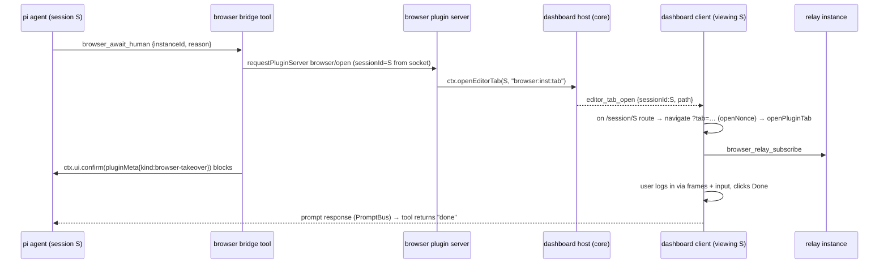

## Context

See proposal.md, "Why". Current state that shapes the design (paths cited):

- **Editor-pane dispatch is closed.**
  - `packages/client/src/components/editor-pane/viewer-kinds.ts` partitions `ViewerKind` (`packages/shared/src/file-kind.ts:13`) into `OPEN_PATH_VIEWERS` and `PSEUDO_TAB_VIEWERS` (`diff`, `terminal`, `url`, `live-server`), with compile-time partition proofs.
  - `EditorPane.tsx` dispatches `isPseudoTabViewer(viewer) ? pseudoTabRegistry[viewer] : CappedViewer`.
  - `pseudoTabRegistry` is typed `Record<PseudoTabViewer, ComponentType<ViewerProps>>` (`pseudo-tab-registry.tsx:39`). `ViewerProps` (`editor-pane/types.ts:9-22`) carries no session or close callback.
  - `EditorPane` calls `fileKind(absOf(cwd, activeTab.path))` for every active tab (`EditorPane.tsx:162`). It is a pure classifier, not I/O.
- **Tab labels.** `EditorTabs.tsx:175-177` renders `terminalTitle(...)` for terminal tabs, else `basename(path)`. `terminalTitle` is the only dynamic-label hook.
- **Tab opening.**
  - `openInSplit` derives the viewer from `fileKind(...)` (`split/SplitWorkspaceContext.tsx:212-216`).
  - Deep links go through `SplitRouteSync` and apply once per key. `openNonce` is a **wouter history-state** value read at `App.tsx:556-567`, stamped by openers that navigate with `state: {openNonce}` (`flows-plugin/src/client/flow-files.ts:120-147`). A fresh nonce re-applies an identical target (`SessionSplitView.tsx:53-100`).
  - The pane reducer already focuses-or-adds by path (`lib/layout/editor-pane-state.ts:146-181`).
- **Pane persistence** (`lib/layout/editor-pane-state.ts:271-332`). `isValidState` is all-or-nothing: one unknown `viewer` resets the whole session's pane to `EMPTY_PANE_STATE`. `VALID_VIEWERS` is a hand-kept set that already lacks `docx`, `pptx`, `spreadsheet`, `asciidoc`, `email` and `diagram`. This is a live bug: a persisted docx tab wipes every tab of that session.
- **Claims pipeline** (`dashboard-plugin-runtime`):
  - `manifest-validator.ts:258-280` normalizes claims through a hand-written field whitelist.
  - The Vite plugin imports and validates only `component`/`predicate`/`shouldRender` exports (`vite-plugin/index.ts:255-298`), emits a fixed field list (`:324-350`), and does cross-plugin collision checks at registry generation (`assertNoCrossPluginCustomTypeCollisions`, `:208-224`).
  - `ClaimEntry` (`slot-registry.ts:26-39`) has no slot-specific fields beyond the existing ones.
  - The registry hash `deterministicSerializePlugins` (`server/loader.ts:252-300`) enumerates claim fields. It feeds `PLUGIN_REGISTRY_HASH` and `/api/health.bundleHash`, which drive the staleness banner.
  - The client builds its runtime registry only from the generated `PLUGIN_REGISTRY` (`App.tsx:225-228`). There is no runtime claim registration.
- **Prompts.**
  - `ctx.ui.*` dialog calls route through `buildMeta` (`packages/extension/src/bridge.ts:3265-3277`). It returns `undefined` when there is neither message nor `toolCallId`, and otherwise keeps only `message` and `toolCallId`, so arbitrary opts are dropped.
  - Plugin bridge tools get `ctx.ui` from the per-call ToolContext (5th `execute` arg) and gate on `ctx.hasUI` (`gmail-plugin/src/bridge/tools.ts:153-184`).
  - PromptBus `cancel()` resolves timeout and cancel identically.
  - The server treats `prompt.metadata.kind` in `FILE_ACCESS_KINDS` (`server/src/event-wiring.ts:344`) as path-gate attention.
  - The client `prompt_request` handler (`client/src/hooks/useMessageHandler.ts:1794-1827`) copies only selected fields into interactive-request `params`. From `metadata` it takes only `toolCallId`. The plugin snapshot (`dashboard-plugin-runtime/src/plugin-context.tsx:33-38`) mirrors those params.
- **Relay.**
  - The vendored relay (`relay/vendor/…`, hash-pinned, never edited) throws `No attached tab to forward browser-level command` from `sendBrowserCommand` when no tab is attached (`browserModel.ts:164-173`).
  - `_knownTabs` (`vendor/…/browserModel.ts:68,95`) holds the `chrome.tabs.*` snapshot, never refreshed. It includes the extension's connect page, whose URL is built by `buildConnectUrl` (`connect.ts:44-50`) with `token=` and `mcpRelayUrl=…/<guid>`.
  - The vendored protocol carries no `chrome.tabs.onUpdated` (`vendor/…/protocol.ts:66-104`), and the model never enables target discovery. So `Target.targetInfoChanged` never arrives.
  - `enableAutoAttach` attaches every known tab (`browserModel.ts:135-140`), possibly including the connect page.
  - The tap subscribe accepts any known tab with a session (`status.ts:156-165` `_onSubscribe`, `screencast-tap.ts:132-137`).
  - `cdpRelayV2.ts:112-125` answers `Target.getTargetInfo` from the model's cached `targetInfo`. Only commands forwarded to the extension (`chrome.debugger.sendCommand`) reach Chrome.
  - `onStatusChange` is bound to the immediate `status.broadcastNow()` (`server/index.ts:58`). The 500 ms coalescing `schedule()` runs only on audit appends (`status.ts:89-93`).
  - `BrowserRelayInputMessage` is a single interface with optional fields (`shared/src/browser-protocol.ts:2299-2320`), not a discriminated union.
  - `_stopView`/`closeAll` (`screencast-tap.ts:294-313`) send only `Page.stopScreencast`.
  - `tabList()` (`relay-instance.ts:215-238`) exposes those URLs verbatim.
  - `AuditKind` is a closed union (`server/audit.ts:20-28`).
- **Request lane.** `requestPluginServer` → `registerPiRequestHandler(type, (payload, {sessionId}))`. `sessionId` comes from the socket key and is trusted (`docs/plugin-seams.md`, "Request/reply lane").

## Goals / Non-Goals

**Goals:**
- Plugin tabs are a general core seam. The browser is only its first client.
- The relay transport, guid/loopback model and audit ring are unchanged beyond the listed fixes.
- Every relay fix is verifiable against `FakeExtension` (`relay/__tests__/fake-socket.ts`), with real `agent-browser` and Playwright clients in integration.

**Non-Goals:**
- Chrome on a different host than the server.
- WebRTC, passkeys and server-side (RBI) browsers.
- Per-session `content-view` for other plugins.
- IME composition, clipboard and drag-and-drop.
- `browser:` links inside chat markdown. The agent uses the `browser_show_in_pane` tool instead.

## Decisions

### D1. Slot `editor-pane-tab` with `pathPrefix` and optional `labelComponent`
Alternatives considered:
- **Hardcode `browser:` in `pseudoTabRegistry`.** Couples core to a default-off plugin and breaks the import-cycle rule.
- **Reuse `content-view`.** Wrong multiplicity and wrong surface.

Chosen: a claim carries `component`, `pathPrefix` and optional `labelComponent`. `pathPrefix` (and `labelComponent`) are threaded through every claims layer:
1. the validator normalizer whitelist and its shape checks;
2. the Vite emitter's field list;
3. `ClaimEntry`.

The validator checks the regex `^[a-z][a-z0-9-]{1,31}$` and the reserved set `{diff, term, url, live}` per manifest. Cross-plugin duplicates are detected where the `customType` precedent does it: in Vite registry generation, failing the build and naming both plugins. There is no runtime claim registration to cover.

The label component is a manifest **name**, like `component`. The emitter imports it, validates the export exists (extending the `component`/`predicate`/`shouldRender` list), and emits a `LabelComponent` reference. Both new fields are added to `deterministicSerializePlugins`, so a prefix or label edit changes the registry hash.

`ViewerKind` gains `"plugin"` in the pseudo-tab half, the same pattern as `diff`, `terminal`, `url` and `live-server`, which are already explicit-open kinds outside `fileKind()` discrimination. So the `internal-monaco-editor-pane` "single source" requirement is not touched: `fileKind()` never returns `plugin`.

`pseudoTabRegistry`'s type narrows to `Exclude<PseudoTabViewer, "plugin">`. `EditorPane` branches on `viewer === "plugin"` and renders `PluginTabHost` with the richer props `{path, session, isActive, onClose, pluginContext}`. That keeps `ViewerProps` unchanged for every other viewer.

`EditorTabs` renders the claim's `LabelComponent` (`{path, session, pluginContext}`) for plugin tabs when one is given, else the prefix. The label component stays mounted while the body is not, so a background tab's label stays current.

### D2. Per-entry hydration, as its own first commit
Hydration changes from all-or-nothing to per-entry:
- Drop only tabs whose `viewer` is not a known `ViewerKind`. Every other structural check in `isValidState` (`treeOpenRoots`, the `unread`/`autoOpened` types, the shape) stays all-or-nothing.
- Re-derive `activeIndex`: keep the same tab if it survived, else clamp.
- `VALID_VIEWERS` becomes derived from `OPEN_PATH_VIEWERS ∪ PSEUDO_TAB_VIEWERS`, which fixes the six missing kinds.

This lands as a separate first commit with tests. Reverting the feature commits later leaves it in place, so stale `viewer: "plugin"` entries are dropped individually and do not wipe the session.

A persisted plugin tab whose prefix has no enabled claim, while the code is present, renders the "Tab unavailable (<prefix>)" placeholder plus Close. It never falls to `CappedViewer` and never triggers `/api/file`.

### D3. Opening = navigation with a fresh `openNonce`; `tab` may repeat
`openInSplit` cannot be reused because it classifies via `fileKind`. Only one `SplitWorkspaceProvider` exists, for the selected session (`App.tsx:2878-2902`), and a session-card badge cannot reach another session's pane. So every plugin-tab open navigates **once** to `/session/<S>/editor?tab=<p1>[&tab=<p2>…]` with `state: {openNonce: <fresh>}`, the same pattern as the flows file opener. One navigation per user action matters because separate `navigate` calls in one handler are batched, and only the last would apply.

Navigation selects `S`. The nonce makes repeated opens re-apply, including after the user closed the tab. `App.tsx` parses all `tab` values and includes them in the `SplitRouteSync` apply key. `SplitRouteSync` calls the new context method `openPluginTab(path)` for each value in order: it checks that the prefix is claimed and dispatches `openFile {path, viewer: "plugin"}`. The reducer focuses an existing tab instead of duplicating it, so the last one ends up active. Unclaimed and built-in prefixes are ignored.

The shared helper `openPluginTabRoute(navigate, sessionId, paths[])` stamps the nonce, so plugins never hand-roll it.

The pane's file-watch set (`SplitWorkspaceContext.tsx:301-307` → server `fileWatchManager`) excludes every pseudo-tab and plugin path. Virtual paths are never sent to the watcher.

### D4. A pane tab subscribes only while active
`EditorPane` mounts only the active non-terminal body, so unmount equals unsubscribe. Frames are stateless, so there is no keep-alive layer. The pane tab also re-subscribes when its relay tab goes from `detached` back to viewable without remounting, the same effect keying as today's `RelayTile`.

### D5. Agent-initiated open is a core seam; ownership is the calling session
Alternatives considered:
- **A `connect` body `sessionId`.** Spoofable.
- **Mapping the CDP socket to a session.** Impossible; it is a loopback `agent-browser` socket.
- **A persisted `ownerSessionId`.** Nothing would consume it, and manual opens never reach the server.
- **A plugin `/ws` message (`browser_relay_open`) handled by a plugin listener.** The only always-mounted browser listener is the per-card badge, which is not reliably mounted (e.g. mobile with the sidebar closed).

Chosen:
1. `browser_show_in_pane` / `browser_await_human` (bridge tools) call `requestPluginServer("browser", "browser/open", …)`. The handler takes `sessionId` from the socket key.
2. It then calls a new plugin-server host API, `ctx.openEditorTab(sessionId, path)`. The host:
   - accepts only a `path` whose prefix is claimed by the **calling** plugin;
   - broadcasts the core message `editor_tab_open {sessionId, path}`.
3. The core client handles it in `App.tsx`, which is always mounted. It acts only when the current route is `/session/<sessionId>` or `/session/<sessionId>/editor`, and then calls `openPluginTabRoute`. On any other route (another session, settings, overlays, landing) it does nothing, so a broadcast never yanks the user out of what they are doing.

This makes "auto-own when known" the calling session. Manual opens (the badge menu) are client-only and target the badge's session ("else current").

**Rate limit.** `browser_show_in_pane` is limited to one accepted open per 5 s per (session, instance). Excess calls return `rate-limited` and are audited as refused `open` entries. `browser_await_human` is exempt: its open is part of a blocking human hand-off, so it must not be suppressed. Limiter entries older than 5 s are pruned on each call and dropped on instance close, so memory is bounded by live (session, instance) pairs. A server restart resets the limiter, which is acceptable. The limiter bounds focus-stealing by a misbehaving agent. It adds no capability, since that agent already drives that Chrome over CDP.

**Default tab.** When `tabId` is omitted, the tool uses the most recently attached tab, **excluding** the connect page. If none remains, it returns `no-tab`.

### D6. Takeover: `pluginMeta` pass-through in `buildMeta`, outcomes `done`/`cancelled`
`ctx.ui.confirm` drops custom opts today, so the takeover needs a small core change. `buildMeta` (`packages/extension/src/bridge.ts`) passes through an optional `opts.pluginMeta` object into `prompt.metadata.plugin`, subject to these rules:
- It is JSON-serializable and ≤ 2 KiB.
- `message` and `toolCallId` stay core-owned.
- It never sets top-level `metadata.kind`.

`browser_await_human` sends `pluginMeta: {pluginId: "browser", kind: "browser-takeover", instanceId}`. Because it is namespaced under `metadata.plugin`, it cannot collide with path-gate `FILE_ACCESS_KINDS`, and it cannot spoof file-access attention.

A pending takeover still counts as "a pending prompt", so the session's attention state shows it waiting on the user. That is the desired outcome.

The pane tab shows Done when the owning session has a pending prompt with `metadata.plugin.kind === "browser-takeover"` and a matching `instanceId`. Done sends the standard prompt response. PromptBus's first-response-wins semantics give "exactly once".

`ctx.ui.multiselect` currently bypasses `buildMeta` (`bridge.ts:3358-3364`), so it is routed through it as well.

Tool outcome: `done` when confirmed, `cancelled` otherwise. Timeout and cancel are indistinguishable through `PromptBus.cancel()`, and the agent needs no distinction: both mean "the human did not finish".

`buildMeta` changes:
- A `pluginMeta`-only call (no message, no `toolCallId`) still returns metadata.
- `pluginMeta` is valid only if it is a plain object (prototype `Object.prototype` or `null`), `JSON.stringify` succeeds without throwing, and its UTF-8 size is ≤ 2048 bytes. Anything else is dropped with a warning.

The tool uses the **per-call ToolContext** `ctx.ui` (5th `execute` arg), as gmail's bridge tools do, and checks `ctx.hasUI`. When there is no UI, it returns `cancelled` with reason `no-ui` and raises nothing.

The client `prompt_request` handler copies `metadata.plugin` into the interactive request (`params._pluginMeta`). The plugin-context `InteractiveUiRequestSnapshot` exposes it, so the pane tab can find the pending takeover.

Alternative considered: calling PromptBus directly from the plugin bridge, as path-gate does. Rejected, because a plugin bridge has no PromptBus handle. Path-gate is core-internal.

### D7. Relay fixes live in `relay-instance.ts` and `deny-list.ts`, never in vendor
- **CDP-client compatibility is outcome-based.** The requirement is that real `agent-browser connect` and Playwright `connectOverCDP` attach and drive (task 3.6 harness). Known shims:
  - `Target.setDiscoverTargets` is answered `{}` locally.
    - `{discover: true}`: emit `Target.targetCreated` for every currently attached **top-level tab** session. After that, mirror the vendored model's top-level `Target.attachedToTarget` → `targetCreated` and `Target.detachedFromTarget` → `targetDestroyed`, idempotent per `targetId` (a set of announced ids), so enabling after `setAutoAttach` creates no duplicates.
    - Child sessions (workers, OOPIFs) are not mirrored.
    - `{discover: false}` stops mirroring and clears the set.
    - Only attached tabs, with their real `targetInfo`, are ever announced.
  - **The connect page is filtered on the CDP-client path too.** `enableAutoAttach` may attach it. So the relay drops any model→client `Target.attachedToTarget` / `detachedFromTarget` whose `targetInfo.url` matches `isRelayConnectPage`, and refuses CDP-client commands addressed to that session. The connect URL therefore never reaches the CDP client, a viewer, or a discovery event.
  - Any further pre-attach browser-level verb that task 3.6 shows a real client sends gets a local answer, if its result is tab-independent.
- **`Browser.setDownloadBehavior`** moves to `ACK_AND_DROP_METHODS`: it replies `{}`, is never forwarded, and is audited with the new kind `dropped`. The security property (the client cannot redirect downloads in the user's real profile) holds. Only the handshake-aborting error goes.
  - Alternative: forward it. Rejected.
- **Tab metadata.** `Target.targetInfoChanged` never arrives (no discovery upstream, no `tabs.onUpdated`). Instead, the relay keeps an overlay `tabMeta: Map<tabId, {title, url}>`. It refreshes the overlay by sending `Target.getTargetInfo` **through the extension** (`chrome.debugger.sendCommand` on that tab), not through the vendored command handler, which would answer from its stale cache. Refreshes happen at three points:
  1. after a main-frame `Page.frameNavigated` or `Page.loadEventFired`, observed in the existing extension→client event path (which fires once the client enabled `Page`, as Playwright and agent-browser do);
  2. on viewer subscribe;
  3. after `Page.navigate` responses.

  A changed value calls the coalescing `status.schedule()` (≤ 1 broadcast per 500 ms), not the immediate `onStatusChange` path. `tabList()` keeps its id set from `_knownTabs` / `knownTabs` and only overrides title and URL from the overlay. Entries are deleted on tab removal and on instance close.
- **Redaction.** There are two pure helpers:
  - `redactExtensionUrl(url)` strips `?` and `#` from `chrome-extension:` URLs.
  - `isRelayConnectPage(url)` matches `chrome-extension://<PLAYWRIGHT_EXTENSION_ID>/connect.html`.

  Every viewer-facing egress uses them: the status broadcast, `/api/browser/profiles`, `/api/browser/audit` (detail strings), and `editor_tab_open` paths. The connect page is omitted from tab lists, and **subscribe and input to it are refused** (reason `extension-page`, audited `viewer-subscribe-refused`), so no frame of it ever reaches a viewer. The only payload that intentionally carries the guid is the `connect` response's `cdpUrl`, which goes to the caller that asked for it (unchanged contract).
  - Out of scope (pre-existing): ordinary `https:` URLs in the audit are stored as navigated. Query-string secrets in third-party URLs are not redacted.
- **Error code.** Unservable browser-level commands now reply `{error: {code: -32000, message}}`. Today's catch at `relay-instance.ts:441-443` sends no code.

### D8. `resize` is an input-class viewer kind that never fights the agent
`resize {width, height}` (CSS px) maps to `Emulation.setDeviceMetricsOverride`, clamped to 320–3840 × 240–2160, with `deviceScaleFactor: 0` and `mobile: false`. `BrowserRelayInputMessage` becomes a discriminated union on `kind`, so `resize` narrows to required numeric `width` and `height`. Existing kinds keep their current fields.

**Agent emulation ownership.** The relay tracks, per tab session, whether the CDP client currently holds a device-metrics override: it is set by `Emulation.setDeviceMetricsOverride` and released by `Emulation.clearDeviceMetricsOverride`, both observed on the CDP path. While the agent holds one:
- viewer `resize` is refused, audited with reason `agent-emulation-active`;
- the tab status carries `agentEmulation: true`, so the pane can fall back to Fit;
- the relay drops any override of its own for that tab.

When the agent releases it, viewer resizes are allowed again. Viewer `resize` on the connect page is refused like all other connect-page input.

The relay clears its own override with `Emulation.clearDeviceMetricsOverride` when the last viewer unsubscribes and when the instance finalizes. On finalize it is best effort, sent before the sockets close.

The client sends `resize` only while Input is on, throttled to ≤ 2/s with a 16 px dead-band. The server does not see the Input toggle. Like `mouse` and `key`, `resize` is available to any authorized subscribed viewer. With several viewers, the last writer wins, and mouse mapping uses the newest frame's geometry. See Risks.

### D9. Mobile input
- Pointer Events, with `touch-action: none` and `user-select: none` on the frame.
- A text bridge: a small `<input>` under the frame. Each inserted character is sent as `key` down/up with `text`, then the value is cleared. Enter, Backspace and Tab are sent from `keydown`.

### D10. Remove the `content-view` claim
The following are deleted: `LiveViewTile`, `live-view-gate.ts`, the `dismissLiveView` / `reopenLiveView` / `bumpSlotClaimsVersion` use in `relay-store.ts`, and the manifest claim. `relay-store.ts` keeps the status snapshot, which the badge, pane tab and label component read. The generic `SessionContentGate` stays, and its requirement moves to `dashboard-shell-slots`.

## Risks / Trade-offs

- [Risk] `SlotId`, `PluginClaim.pathPrefix` / `labelComponent` and `buildMeta`'s `pluginMeta` are public, irreversible API. → Mitigation: doubt-driven-review (this planning pass, plus task 2.6 before merge). All are additive.
- [Risk] Local CDP answers diverge from upstream relay behavior. → Mitigation: synthetic events reuse the real `targetInfo`, and the real-client integration harness (task 3.6) is the acceptance gate.
- [Trade-off] Any authorized viewer can `resize` the user's real tab, unless the agent owns emulation. Accepted: `mouse` and `key` input from the same viewers is already strictly more powerful. The change is cleared on the last unsubscribe and on finalize, and audited.
- [Trade-off] Several viewers at different pane sizes: the last `resize` wins. Clicks may be briefly mis-scaled until the next frame. Accepted for v1.
- [Trade-off] Audit URLs for ordinary sites are not query-redacted (pre-existing behavior, out of scope).
- [Risk] `editor_tab_open` is broadcast to all clients. → Acceptable: every `/ws` client is already authorized for that session, the payload is non-secret, and clients not on that session's route ignore it.
- [Risk] Whether Chrome lets `chrome.debugger` attach to the extension's own page is unverified. → The CDP-path filter (D7) makes the outcome irrelevant.
- [Risk] A small screen with a large viewport is unreadable. → Mitigation: resize-to-pane, with Fit/1:1 as fallback.
- [Trade-off] Background pane tabs show no live thumbnail. Accepted for zero idle cost.
- [Trade-off] Timeout and cancel collapse into `cancelled`. Accepted.

## Migration Plan

1. Commit 1: the D2 per-entry hydration guard plus the derived `VALID_VIEWERS`. This is a standalone bug fix.
2. Core seam: slot, claim fields across validator, emitter and registry, `PluginTabHost`, `openPluginTab`, `?tab=`, and `labelComponent`. There is no behavior change until a plugin claims it.
3. Relay fixes: redaction first (security), then the compatibility shims, metadata and `resize`.
4. `buildMeta` `pluginMeta` pass-through (extension).
5. Core `ctx.openEditorTab` plus the `editor_tab_open` client handler.
6. Browser bridge tools, pane tab, badge menu; then remove `content-view`.
7. Skill reference update.

Rollback: revert the commits from step 2 onward and keep commit 1. Persisted `viewer: "plugin"` entries are dropped individually. The relay returns to denying `setDownloadBehavior`, which loses only Playwright compatibility. `pluginMeta` is ignored by older clients. No server data migration is involved.

## Open Questions

- The visual treatment of the idle indicator (dot vs. caption) will be settled in the mockup-loop pass. It does not change the specs.
