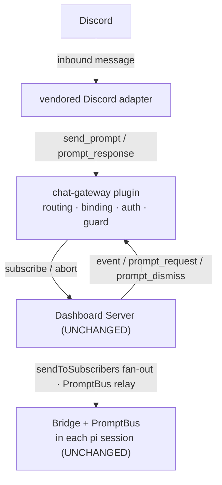

# Design — chat-gateway (Discord first)

> Full investigation (landscape of 41 packages, gamalan/Hermes deep-dives, protocol
> verification) is recorded in repo-root `chat-gateway-exploration.md`. This document is
> the design distilled for implementation.

## Placement — a server-side dashboard plugin acting as a headless client

The gateway is packaged as a **dashboard plugin** (server component + settings panel),
reusing `dashboard-plugin-runtime`. Its server component owns the Discord connection and
drives sessions through the **existing browser-protocol seam** — the same
`subscribe`/`send_prompt`/`prompt_response` ⟷ `event`/`prompt_request` messages the React
client uses. This is why **no bridge/server protocol change is needed**: the gateway is
just another consumer of streams the server already fans out.



In-process (plugin calls the server's internal subscriber API) vs. loopback WS client are
both viable; prefer in-process to avoid an extra socket, falling back to a loopback WS
client if the plugin runtime does not expose an internal subscribe seam. Either way the
message contract is identical.

## Vendoring gamalan's adapter (MIT)

Vendor `src/adapters/base.ts` (the `PlatformAdapter` contract) + `src/adapters/discord.ts`
into `packages/chat-gateway/src/adapters/` with a NOTICE attribution. Do **not** vendor
`index.ts` (its hub), `sessions/store.ts` (dashboard has a registry), or
`extensions/pi-gateway-ask-user-rpc.ts` (rpc-mode hack — replaced by the PromptBus path).
Reuse the *shape* of `security/tool-policy.ts` but replace prompt-injection enforcement
with hard `{block:true}` in the companion extension.

## cwd-binding resolver

```
resolve_cwd(platform, channelId, threadId?):
  1. persisted binding                 → use it (sticky)
  2. fixed config map                  → bind + persist
  3. defaultCwd                        → bind + persist
  4. interactive: attach-existing | spawn-in-allowedRoot → bind + persist
  INVARIANT: result ∈ allowedRoots  (else reject; no spawn)
```

Spawn is async and returns no id; correlate the new session by `cwd` + recency from the
`session_register` stream (same idiom the dashboard's auto-resume uses). Persist bindings
as JSON under `~/.pi/dashboard/chat-gateway/` (bindings.json, allowlist.json), matching
existing dashboard state conventions — no new SQLite.

## Interactive mapping

`prompt.type` → Discord: `select`→button row / string-select; `confirm`→Yes/No buttons;
`input`/`editor`→modal text input; `multiselect`→multi-select component or toggle+Done;
`batch`→sequence sub-prompts. Ignore the React-specific `component`/`props`; render from
`type` + `options` + `metadata`. First-response-wins and reconnect replay are inherited
from PromptBus + `replayPendingUiRequests`.

## Auth & trust model (threat-model summary)

A chat user drives code execution. Controls, defense-in-depth:

| Layer | Control | Enforcement point |
|---|---|---|
| L1 identity | allowlist + pairing code | gateway edge (drop before send_prompt) |
| L2 binding | admin-only channel→cwd bind | gateway (privileged op) |
| **spawn boundary** | `allowedRoots` whitelist | resolver (mandatory, non-bypassable) |
| L3 tools | deny-first hard `{block:true}` + chat approval | **companion in-session extension** |
| L4 isolation | DM isolated; group opt-in | routing granularity |

Key asymmetry: **spawned** sessions get the L3 guard; **attached** (source a) sessions are
owner-trusted (you're remote-controlling your own open session — and an interceptor cannot
be retrofitted into a running session anyway). This aligns the trust boundary with the
technical constraint.

**Implementation status (synced with tasks 8.x/9.x/12.x).** Every control above is
implemented and unit-tested: L1 allowlist + 6-digit pairing code (DM-only redemption;
redeeming persists the user onto the allowlist, wrong/expired code never grants access);
L2 admin-only bind; the `allowedRoots` real-path boundary is re-applied on EVERY transition
(attach · spawn · resume), not only at bind time, and an empty set refuses all spawns; L4
group channels stay inert unless opted in and DMs are isolated; L3 is a deny-first companion
`tool_call` interceptor loaded into gateway-SPAWNED sessions only. The bot token is
`writeOnly` — stripped from every client document by `redactWriteOnly`, never logged, and a
blank settings save cannot erase it. `GET /api/chat-gateway/bindings` is registered only
once configured + started, so an inert install exposes no surface.

## Why L3 lives in-session, not at the gateway edge

The gateway sees the prompt, not the agent's mid-turn tool decisions (those fire inside
the session). The only real enforcement point is pi's `tool_call` event
(`return {block:true}`), documented in `extensions.md` as a permission gate. So a companion
extension is loaded into spawned sessions carrying the policy; escalation uses
`ctx.ui.confirm` which the bridge routes through PromptBus → the gateway → Discord.

## Security review (V.2) — controls verified, gaps closed

Adversarial review (independent pass) of the implemented diff. Claims and outcome:

| Claim | Verdict |
|---|---|
| `allowedRoots` non-bypassable | **HELD** — every spawn path funnels through `spawnIn`/`resumeIn`; attach filters candidates; `resolveCwd` refuses rather than falls through; now also returns the CANONICAL (symlink-resolved) path so the spawned cwd equals the validated one. |
| L3 guard hard-blocks | **FIXED** — the pure engine was deny-first but the wiring failed open. `spawnCorrelated` now REFUSES to spawn when `toolPolicy` is set without `guardExtension` (pi treats an unresolvable `-e` as non-fatal), and the guard reads the host-projected `PI_EXT_CHAT_GATEWAY_GUARD_POLICY` env (default deny-all) instead of a factory arg pi never passes. |
| Secrets / authorization | **FIXED** — every `onInteractiveResponse` is RE-AUTHORIZED at the edge (a group member who is not allowlisted can see the buttons; rendering is not a grant); binding is now admin-gated (L2); `GET /api/chat-gateway/bindings` carries the same `networkGuard` as every core route and no longer returns the pairing code; the pairing code is CSPRNG. |

Residual / accepted (documented, low):

- **Resolvable-guard verification.** The gateway cannot confirm that a supplied `guardExtension` actually loaded; a typo'd id yields an ungated spawned session. Mitigated by refusing the no-id case and by the guard's deny-all default; verifying load needs host support and is a follow-up.
- **Unbounded in-memory maps.** `sequences`/`prompts` are cleared on `session_state_reset` and `stop()`; the spawn correlator / `pendingSpawns` entry for a spawn that never resolves is bounded by spawn attempts, not swept on a timer.

## Deferred (explicit)

- Non-Discord adapters (Slack/Telegram/Matrix) — same interface, later changes.
- Per-turn origin tool policy for shared group channels (v1 = per-channel policy).
- Switchable `/project` re-binding (v1 sticky); `/rebind` escape hatch.
- Background/detached task sessions (spawn, deliver on `agent_end`).

## Resolved decisions (from scenario-design clarifications C1–C8)

- **C1 allowedRoots containment:** resolve the candidate `cwd`'s **real path** (follow
  symlinks), then require a path-prefix descendant match against an allowed root. Rejects
  `..` traversal and symlink escapes. Fail-closed.
- **C2 spawn correlation:** reuse `automation-run-lifecycle`'s correlation-token mechanism
  (not cwd+recency) so concurrent same-cwd spawns never cross-bind.
- **C3 tool-approval timeout:** **fail closed** — an unanswered approval blocks the tool.
- **C4 >2000-char reply:** chunk into a new message at the limit; edit the tail chunk as it
  grows; never truncate.
- **C5 Discord 3s interaction ack:** defer the interaction immediately (deferred update),
  edit the deferred reply when the session responds.
- **C6 pairing code:** 15-minute TTL, 10-attempt lockout.
- **C7 mid-stream delivery:** `followUp` by default; a configurable prefix (default `!`)
  forces `steer`.
- **C8 edit throttle:** ≥ ~1000ms between `editMessage` calls; target zero Discord 429s;
  p95 edit latency < 1.5s under a sustained delta burst.

## Implementation notes (questions resolved)

- **In-process subscribe:** `dashboard-plugin-runtime` was extended with an OPTIONAL,
  trust-gated `ctx.subscribeSession` seam (`See change: add-chat-gateway`). The gateway uses
  it and refuses to start (logs an error) when a host does not expose it — no loopback WS
  fallback. See `packages/server/src/pairing/browser-gateway.ts` + `server-context.ts`.
- **Pairing UX:** both paths ship. An admin pre-seeds `allowlist` in Settings, OR a user DMs
  the pairing code shown in Settings; redemption is DM-only (a code in a public group
  channel would leak access to every reader).
