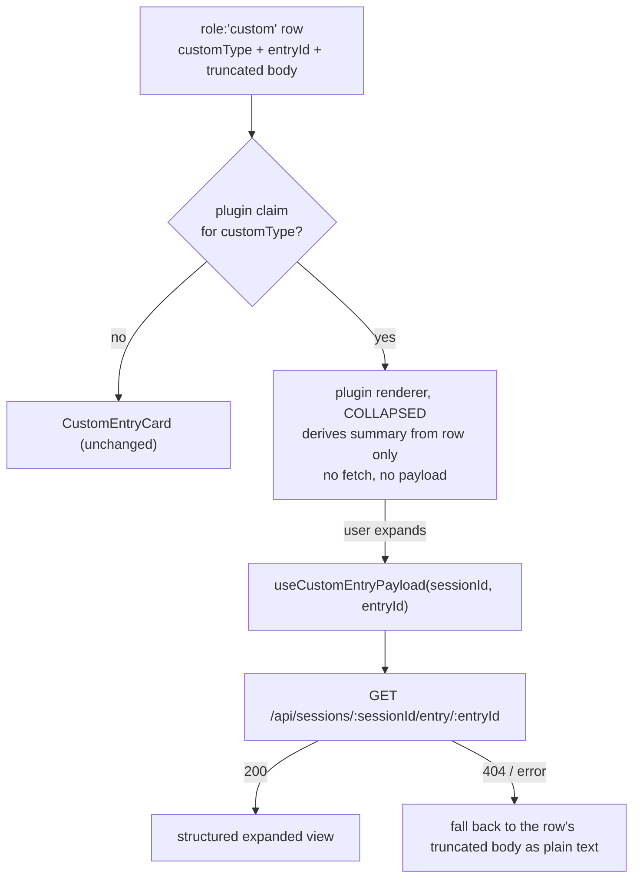

## Context

See proposal.md — Why. Three facts constrain the design:

1. **The structured payload is destroyed at row creation.** `event-reducer.ts` (`custom_entry`
   arm, ~line 2038) runs `truncateOutputForDisplay(extractCustomEntryBody(data.data))` and
   stores the result as `ChatMessage.content: string`. `extractCustomEntryBody` pretty-prints
   objects with `JSON.stringify(content, null, 2)`, caps at `CUSTOM_BODY_MAX_CHARS` (64 000,
   keeping the TAIL), then the last-200-lines ceiling applies. A renderer reading only the row
   therefore sees a possibly head-truncated string, never the object.
2. **Truncation is not rare for the target payloads.** Measured on local session JSONL:
   13% of `om.observations.recorded` payloads exceed 200 pretty-printed lines (max 303 lines /
   13 KB). `om.reflections.recorded` (max 119) and `om.observations.dropped` (max 11) never do.
   So "just `JSON.parse` the body" is correct for two of the three claimed types and silently
   wrong for the one that matters most.
3. **`om` rows are scattered, not bursty.** Measured over 25 session logs: zero same-`customType`
   adjacency (220/220 runs have length 1); median gap between same-type rows is 45 entries
   (min 7, max 87), almost entirely `message` entries. Treating any `om.*` as one class yields
   140 singletons, 28 pairs, 8 triples. Any adjacent-run collapse therefore fires on ~36% of
   runs and folds at most 3 rows — it does not address the volume.
4. **Custom rows currently split tool bursts.** `group-tool-bursts.ts`'s
   `BURST_TRANSPARENT_ROLES` is `{thinking, turnSeparator, rawEvent, commandFeedback}` — no
   `custom`. Combined with fact 3, ~4.3k scattered `om` rows each terminate a burst that would
   otherwise have collapsed. This, not JSON ugliness, is the larger measured cost.
5. **Grouping runs BEFORE visibility filtering.** `ChatView.tsx:912` calls `groupToolBursts`,
   and `:986` then filters the grouped output with `isRowVisible`. A row absorbed into
   `burst.items` is no longer a top-level row and is never seen by that filter.
6. **`tool-renderer` is a working precedent for everything except the payload.**
   `ToolCallStep.tsx` (~line 112) does a one-shot `React.useMemo` lookup:
   `forToolName(registry.getClaims("tool-renderer"), toolName)` → first claim whose
   `claimShouldRender` returns true → else built-in registry → else Generic. `useSlotRegistryOrNull`
   makes the lookup a no-op when no provider is mounted (tests/storybook). `forToolName` is a
   three-line exact-match filter in `slot-registry.ts:243`.

## Goals / Non-Goals

**Goals:**
- A plugin can own the rendering of a `customType` without any core change per type.
- Steady-state cost of an unexpanded transcript is unchanged: no extra bytes on the row, no
  network request, for all ~4.3k `om.*` rows.
- A renderer can reach the exact, untruncated payload when the user asks for it.
- Failure of a plugin renderer degrades to the existing `CustomEntryCard`, never to a blank row.

**Non-Goals:**
- Changing the reducer's row shape, extraction, or truncation behavior.
- Making the generic fallback itself richer (no JSON syntax highlighting, no collapsing of
  unclaimed types).
- A server-side registry of custom types. Claims stay client-side, like `tool-renderer`.
- Cross-row aggregation of any kind. Context fact 3 falsifies the premise: the rows are not
  adjacent, so there is nothing contiguous to merge. A session-wide digest is a different
  feature and belongs in blackhole's existing `session-card-memory` contribution, not in a
  chat-row slot.
- Any new visibility surface. Density is already solved by the shipped `customEventGroups`
  toggle; this change must not add a second way to silence the same rows.

## Decisions

### D1 — New slot `custom-entry-renderer`, keyed by `customType`, not a generalized `tool-renderer`

Add a distinct slot id rather than overloading `tool-renderer` with a second key. Tool calls
and custom entries have different payload contracts, different error surfaces, and different
visibility gates (custom rows are group-gated, tool calls are not). Sharing one slot would force
every consumer to discriminate. Multiplicity `many`, payload tier `react-only`,
`SlotPredicateInput` → `never` (exactly like `tool-renderer`: no session/folder input, gating is
via `shouldRender` only).

*Alternative considered:* a generic `chat-row-renderer` keyed by `role`. Rejected — it would let
a plugin claim `assistant`/`tool` rows, which is a far larger blast radius than the problem
requires, and is irreversible once claimed by a shipped plugin.

### D2 — Exact `customType` match, not prefix/glob

Claims match `c.customType === row.customType`, via a `forCustomType` filter mirroring
`forToolName`. Blackhole therefore declares three claims rather than one `om.*` claim.

*Alternative considered:* glob/prefix matching so blackhole claims `om.*` in one entry. Rejected
for now: three literal claims are cheaper than introducing a pattern-precedence rule (is `om.*`
beaten by an exact `om.folded` claim? by a longer prefix?) plus a matching tiebreak spec. The
existing `dashboard-shell-slots` tiebreak (priority, then plugin id) already answers the exact-key
collision case unchanged. Glob remains addable later as a strictly-additive refinement.

### D3 — Collapsed-first: the collapsed line uses only the row; the payload fetch fires on expand

The renderer contract has two phases:

This is what makes the change safe at 4.3k rows: an untouched transcript issues zero requests and
carries zero extra state. It also means the collapsed summary must be derivable from a
*possibly truncated* string — see D4.

*Alternative considered (B in exploration):* store the raw payload on the `ChatMessage`. Rejected
— it doubles the memory of every custom row of every plugin forever, including rows nobody claims
and nobody expands, to serve a 13%-of-one-type problem.

*Alternative considered (A):* `JSON.parse` the body and accept the 13% loss. Rejected as the sole
mechanism, but retained as the *collapsed-phase* strategy (D4), where a graceful miss is cheap.

### D4 — Collapsed summary degrades, it does not lie

The renderer attempts `JSON.parse` on the row body. On success it may show a derived summary
("4 observations recorded"). On failure — which is exactly the truncated case — it shows the
`customType` label and an expand affordance with no count. It must never display a count derived
from a partial parse. This keeps the collapsed phase honest without a fetch.

### D5 — Payload endpoint mirrors `tool-result`, including its safety class

`GET /api/sessions/:sessionId/entry/:entryId`, registered alongside
`/api/sessions/:sessionId/tool-result/:toolCallId` in `server/src/routes/session-routes.ts:159`.
Session-addressed, never path-addressed (the property `specs/session-diff-extraction` already
requires of this family). `useCustomEntryPayload` mirrors `useToolFullResult`: skips the request
when either id is missing, 404 → "entry evicted". Response is the entry's structured `data`,
untruncated, with the same size guard the sibling endpoint applies.

*Alternative considered:* widen the existing `tool-result` endpoint to accept entry ids. Rejected —
different resource, different lookup, conflating them makes both harder to reason about in an
auth/rate-limit review.

### D6 — Plugin renderers stay inside the `customEventGroups` gate

`ChatView.tsx:978` (`isRowVisible`) and `:1903` (render branch) both check
`prefs.customEventGroups[msg.groupId ?? "other"] !== false`. The claim lookup happens *after* that
gate, not before, so a hidden group hides the plugin card and keeps the row out of visibility
computations. This deliberately differs from `flow-event`, which is exempt: flow cards are a
first-class dashboard surface, whereas a plugin custom card is still extension-authored custom
content the user must be able to silence.

### D7 — Claimed custom rows become burst-transparent, via an injected predicate

Context facts 3+4 say the highest-value structural fix is not merging custom rows with each
other, but stopping them from splitting tool bursts. Add `custom` to the burst pass's
transparent set CONDITIONALLY: `groupToolBursts` takes an optional
`isTransparentCustomType?: (customType: string) => boolean`. `ChatView` supplies a predicate
backed by the slot registry, so only CLAIMED types become transparent.

Scoping transparency to claimed types keeps the blast radius at zero for every existing
deployment: with no claims registered the predicate returns false for everything and burst
formation is byte-identical to today. It also keeps `group-tool-bursts.ts` pure — it imports
no registry, exactly as it imports no prefs today.

*Alternative considered:* unconditionally add `custom` to `BURST_TRANSPARENT_ROLES`. Rejected —
it silently changes burst shape for every other plugin's custom rows, including ones whose
authors deliberately want a visible standalone row, and it is not reversible per-plugin.

*Alternative considered:* adjacent-run collapsing of same-type custom rows. Rejected on
measurement (context fact 3), not taste.

### D8 — The group-visibility gate follows the row into the burst

Context fact 5 is a trap: making a custom row transparent moves it inside `burst.items`, where
`isRowVisible` never reaches it. Without mitigation, toggling the `memory` group off would hide
standalone `om` rows but leave absorbed ones visible inside expanded bursts — a gate that leaks.

The gate is therefore applied a second time inside `ToolBurstGroup`'s expanded rendering, using
the same `prefs.customEventGroups[groupId ?? "other"] !== false` predicate. This mirrors the
existing "mirrored gate" pattern already used at `ChatView.tsx:978` (compute) and `:1903`
(render), and satisfies the standing `custom-entry-rendering` requirement that the gate be
applied *consistently at every site that decides whether a custom row is visible*.

*Alternative considered:* filter invisible custom rows out BEFORE grouping. Rejected — it makes
burst shape depend on display preferences, so toggling a group would re-form bursts and shuffle
the transcript under the user. Render-time-only gating is the invariant the current spec relies
on for "toggling never replays anything".

### D9 — Per-claim `ErrorBoundary`, fail to the generic card

Wrap the resolved plugin component the way `ToolCallStep` does. A throwing renderer must land on
`CustomEntryCard` (or a comparable inert card), not on a blank row or a broken transcript.
`claimShouldRender` throwing is treated as `false` (fail-closed), same as the `tool-renderer` path.

## Risks / Trade-offs

- **A plugin renderer that fetches eagerly defeats D3** → The contract is enforced by the hook,
  not by documentation: `useCustomEntryPayload` is only invoked from the expanded branch, and a
  test asserts zero `fetch` calls for a mounted-but-collapsed claimed row.
- **Expanding many rows at once issues many requests** → Acceptable; expansion is a deliberate
  per-row user action, and the same profile already exists for "Show full output" on tool results.
- **Payload is extension-authored and untrusted** → Expanded views render text nodes only: no
  markdown, no linkification, no `dangerouslySetInnerHTML`. This is the invariant
  `custom-entry-rendering` already states for the fallback; it extends to plugin renderers.
- **An evicted/compacted entry makes expand useless** → D3's 404 arm falls back to the row's
  truncated body, which is exactly today's behavior. Expansion can only improve on the status quo,
  never regress below it.
- **Two plugins claim the same `customType`** → Resolved by the existing priority-then-plugin-id
  tiebreak; no new rule. The losing claim simply never renders.
- **Slot taxonomy is frozen for v0.x** → Adding a slot id is explicitly documented as a minor,
  non-breaking change in `slot-types.ts`. No existing claim shape changes.
- **Burst-transparency changes transcript shape for claimed types** → Scoped to claimed types
  (D7), so it is opt-in per plugin and inert until a claim exists. A test asserts burst
  formation is unchanged when the registry has no `custom-entry-renderer` claims.
- **The absorbed-row gate leak (D8) is easy to regress** → Covered by an explicit scenario:
  group toggled off + a claimed custom row absorbed into an EXPANDED burst → row renders
  nothing. Without that test the leak is invisible in normal use, because it only shows after
  expanding a burst.

## Migration Plan

Purely additive; no data migration. Order: shared slot id + validator → `ChatView` resolution
chain with fallback (observable no-op, since no plugin claims yet) → burst-transparency
predicate + absorbed-row gate (also inert with no claims) → server endpoint + hook → blackhole
claims. Every step before the last is unobservable in a deployment with no claims, so the
change lands dark. Rollback at any point is removing the blackhole claims, which simultaneously
restores `CustomEntryCard` for every `om.*` row and restores hard-boundary burst behavior.

## Open Questions

- Whether the blackhole collapsed line should show a per-type icon/color or reuse the generic
  puzzle-piece chrome. Cosmetic; does not affect specs, approach, or task breakdown.
- Whether `om.observations.dropped` (8 lines, always parseable) warrants an expanded view at all,
  or should render fully in its collapsed form. A renderer-internal detail.
