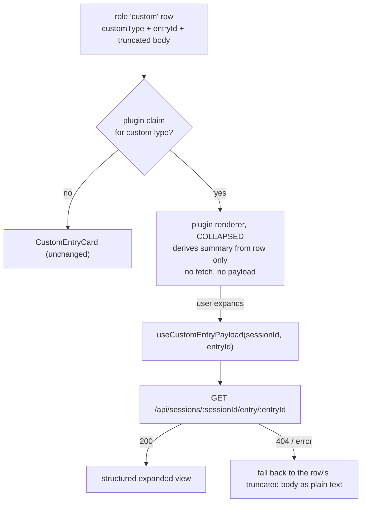

## Context

See proposal.md — Why. These measured facts constrain the design:

1. **The structured payload is destroyed at row creation.** `event-reducer.ts` (`custom_entry`
   arm, ~line 2038) runs `truncateOutputForDisplay(extractCustomEntryBody(data.data))` and
   stores the result as `ChatMessage.content: string`. `extractCustomEntryBody` pretty-prints
   objects with `JSON.stringify(content, null, 2)`, caps at `CUSTOM_BODY_MAX_CHARS` (64 000,
   keeping the TAIL), then the last-200-lines ceiling applies. A renderer reading only the row
   therefore sees a possibly head-truncated string, never the object.
2. **Truncation is not rare for the target payloads.** Measured on local session JSONL:
   13% of `om.observations.recorded` payloads exceed 200 pretty-printed lines (max 303 lines /
   13 KB). `om.reflections.recorded` (max 119) and `om.observations.dropped` (max 11) never do.
   So "just `JSON.parse` the body" is correct for two of the three claimed types and silently
   wrong for the one that matters most.
3. **`om` rows are scattered, not bursty.** Measured over 25 session logs: zero same-`customType`
   adjacency (220/220 runs have length 1); median gap between same-type rows is 45 entries
   (min 7, max 87), almost entirely `message` entries. Treating any `om.*` as one class yields
   140 singletons, 28 pairs, 8 triples. Any adjacent-run collapse therefore fires on only the 36
   non-singleton runs — about 20% of the 176 runs — and folds at most 3 rows. It does not address
   the volume.
4. **Custom rows currently split tool bursts — in TWO passes, not one.** `group-tool-bursts.ts`'s
   `BURST_TRANSPARENT_ROLES` is `{thinking, turnSeparator, rawEvent, commandFeedback}` — no
   `custom`. Combined with fact 3, ~4.3k scattered `om` rows each terminate a burst that would
   otherwise have collapsed. This, not JSON ugliness, is the larger measured cost.
   Crucially there is a SECOND, inner pass: `groupToolBursts` runs over the output of
   `groupConsecutiveToolCalls`, which keeps its own `TRANSPARENT_ROLES`
   (`group-tool-calls.ts:15`, a DIFFERENT set that includes `assistant`) and hard-breaks a `×N`
   run on any non-`toolResult` row (`:102`). A custom row therefore splits the `×N` grouping
   before the burst pass ever sees the items, and the outer pass cannot recover it.
5. **Grouping runs BEFORE visibility filtering.** `ChatView.tsx:912` calls `groupToolBursts`,
   and `:986` then filters the grouped output with `isRowVisible`. A row absorbed into
   `burst.items` is no longer a top-level row and is never seen by that filter.
6. **`tool-renderer` is a working precedent for everything except the payload.**
   `ToolCallStep.tsx` (~line 112) does a one-shot `React.useMemo` lookup:
   `forToolName(registry.getClaims("tool-renderer"), toolName)` → first claim whose
   `claimShouldRender` returns true → else built-in registry → else Generic. `useSlotRegistryOrNull`
   makes the lookup a no-op when no provider is mounted (tests/storybook). `forToolName` is a
   three-line exact-match filter in `packages/dashboard-plugin-runtime/src/slot-registry.ts:243`
   (the registry and `ClaimEntry` live in `dashboard-plugin-runtime`; only `slot-types.ts` is in
   `packages/shared`).
7. **The in-memory event store destroys payloads at INGEST.** `memory-event-store.ts` caps every
   string field at `DEFAULT_MAX_STRING_SIZE = 4_000` (:452), replaces any array longer than 20
   elements with the literal `"[array truncated]"` (:592), and drops event data past
   `DEFAULT_MAX_EVENT_DATA_SIZE = 262_144` (:471). The damage is done on the way in, so NO
   serve-time endpoint reading `eventStore` can return an untruncated payload.
8. **Custom rows do not all carry an `entryId`.** The `custom_entry` reducer arm stamps it, but
   the `message_end` arm (`pi.sendMessage` → `custom_message`) deliberately does NOT — the code
   comments it: *"entryId/nonce deliberately NOT stamped: bridge id resolution is unreliable for
   custom messages"*. A claimed `customType` arriving by that path has no fetch key.
9. **Absorbed rows have no render path today — at TWO sites.** `ToolBurstGroup.tsx`'s
   `BurstBodyItem` ends with `if (msg.role !== "toolResult") return null;` (:315). The inner
   pass's absorbed rows land in `ToolCallGroup.rendered` and are drawn by a different component,
   `CollapsedToolGroup.tsx`, which likewise falls through to `return null` (:93). A `custom` row
   absorbed by either pass renders NOTHING — independent of any visibility gate.
10. **No cross-plugin keyed-collision detection exists.** `manifest-validator.ts:305` rejects
   duplicate `(tool-renderer, toolName)` pairs only WITHIN one plugin. Across plugins nothing
   checks: `forToolName` returns every match and `ToolCallStep` renders the first passing claim.
   The main spec's "fatal collision, abort startup" rule for `tool-renderer` is therefore written
   but unimplemented.

## Goals / Non-Goals

**Goals:**
- A plugin can own the rendering of a `customType` without any core change per type.
- Steady-state cost of an unexpanded transcript is unchanged: no extra bytes on the row, no
  network request, for all ~4.3k `om.*` rows.
- A renderer can reach the exact, untruncated payload when the user asks for it.
- Failure of a plugin renderer degrades to the existing `CustomEntryCard`, never to a blank row.

**Non-Goals:**
- Changing the reducer's row shape, extraction, or truncation behavior.
- Making the generic fallback itself richer (no JSON syntax highlighting, no collapsing of
  unclaimed types).
- A server-side registry of custom types. Claims stay client-side, like `tool-renderer`.
- Cross-row aggregation of any kind. Context fact 3 falsifies the premise: the rows are not
  adjacent, so there is nothing contiguous to merge. A session-wide digest is a different
  feature and belongs in blackhole's existing `session-card-memory` contribution, not in a
  chat-row slot.
- Any new visibility surface. Density is already solved by the shipped `customEventGroups`
  toggle; this change must not add a second way to silence the same rows.

## Decisions

### D1 — New slot `custom-entry-renderer`, keyed by `customType`, not a generalized `tool-renderer`

Add a distinct slot id rather than overloading `tool-renderer` with a second key. Tool calls
and custom entries have different payload contracts, different error surfaces, and different
visibility gates (custom rows are group-gated, tool calls are not). Sharing one slot would force
every consumer to discriminate. Multiplicity `many`, payload tier `react-only`,
`SlotPredicateInput` → `never` (exactly like `tool-renderer`: no session/folder input, gating is
via `shouldRender` only).

*Alternative considered:* a generic `chat-row-renderer` keyed by `role`. Rejected — it would let
a plugin claim `assistant`/`tool` rows, which is a far larger blast radius than the problem
requires, and is irreversible once claimed by a shipped plugin.

### D2 — Exact `customType` match, not prefix/glob; collision is FATAL, not a tiebreak

Claims match `c.customType === row.customType`, via a `forCustomType` filter mirroring
`forToolName`. `ClaimEntry` gains `customType?: string` alongside `toolName`/`command`/`path`.
Blackhole therefore declares three claims rather than one `om.*` claim.

**Two plugins claiming the same `customType` is a fatal load-time collision that aborts startup**
— NOT a priority-then-plugin-id tiebreak. This follows the WRITTEN `tool-renderer` rule
(`dashboard-shell-slots` spec, *"Two plugins claim the same tool name"* → *"the loader SHALL
report a fatal collision error naming both plugins and the conflicting tool name, and abort
startup"*). The priority-then-plugin-id rule governs render ORDER of many-multiplicity
contributions; it has never governed keyed collisions.

**This rule needs new code — it cannot be inherited.** Context fact 10: no cross-plugin keyed
collision check exists anywhere today, so `tool-renderer`'s own spec rule is unimplemented and
the code silently lets the first passing claim win. This change therefore implements cross-plugin
`(custom-entry-renderer, customType)` detection where react claims are actually aggregated:
`packages/dashboard-plugin-runtime/src/vite-plugin/`, which assembles the generated
`packages/client/src/generated/plugin-registry.js` that `App.tsx` imports. Today that path runs
`validateManifest` per manifest and performs NO aggregate check. Putting the guard in the
server-side `loader.ts` instead would miss it entirely: that path governs plugin activation, not
the browser registry where `forCustomType` resolves. "Aborts startup" therefore means the
client bundle fails to build / dev-serve, surfacing the conflict before the transcript ever
renders. Retrofitting the same check to
`tool-renderer` would remove the divergence but is explicitly out of scope: it could abort
startup for a deployment that loads today, which is a separate decision with its own blast
radius. Intra-plugin duplicates are rejected in `manifest-validator.ts` alongside the existing
`(tool-renderer, toolName)` and `(command-route, command)` checks.

*Alternative considered:* glob/prefix matching so blackhole claims `om.*` in one entry. Rejected
for now: three literal claims are cheaper than introducing a pattern-precedence rule (is `om.*`
beaten by an exact `om.folded` claim? by a longer prefix?) plus a matching tiebreak spec. Glob
remains addable later as a strictly-additive refinement.

### D3 — Collapsed-first: the collapsed line uses only the row; the payload fetch fires on expand

The renderer contract has two phases:

This is what makes the change safe at 4.3k rows: an untouched transcript issues zero requests and
carries zero extra state. It also means the collapsed summary must be derivable from a
*possibly truncated* string — see D4.

*Alternative considered (B in exploration):* store the raw payload on the `ChatMessage`. Rejected
— it doubles the memory of every custom row of every plugin forever, including rows nobody claims
and nobody expands, to serve a 13%-of-one-type problem.

*Alternative considered (A):* `JSON.parse` the body and accept the 13% loss. Rejected as the sole
mechanism, but retained as the *collapsed-phase* strategy (D4), where a graceful miss is cheap.

### D4 — Collapsed summary degrades, it does not lie

The renderer attempts `JSON.parse` on the row body. On success it may show a derived summary
("4 observations recorded"). On failure it shows the `customType` label and an expand affordance
with no count. It must never display a count derived from a partial parse. This keeps the
collapsed phase honest without a fetch.

Parse failure is a **sufficient, not exhaustive**, signal for truncation: a head-truncated body
always fails to parse, but a non-JSON body (`extractCustomEntryBody` passes strings through
verbatim) also fails while being complete, and a tail slice could in principle land on a valid
sub-structure. The contract is therefore one-directional — *parse failure ⇒ no count* — and
carries no claim that every countable payload yields a count. Under-reporting is safe;
over-reporting is the failure being prevented.

### D5 — Payload endpoint mirrors `tool-result`, including its safety class

`GET /api/sessions/:sessionId/entry/:entryId` reads the **on-disk session JSONL**, not the
in-memory event store. Context fact 7 forecloses the store: it truncates strings to 4 KB and
clobbers arrays >20 elements at ingest, so a store-backed endpoint would fail precisely for the
large `om.observations.recorded` payloads that motivate this change — serving mangled data while
claiming to be untruncated.

The correct precedent is therefore the OTHER sibling on the same router,
`GET /api/session-change/:sessionId/:toolCallId` (`session-routes.ts:181`), whose own code
comment states the identical rationale: *"the in-memory event store caps strings at ~4 KB and
collapses `edits` arrays >20, so this is REQUIRED for correctness on large Writes / Edits"*. Like
it, the new route resolves `session.sessionFile` via `sessionManager` (never constructed from the
`sessionId` string), and looks the entry up by id. `session-file-reader.ts` already builds a
`byId` map over `entry.id` (:67), so the lookup helper is a small addition rather than new
machinery.

Session-addressed, never path-addressed (the property `specs/session-diff-extraction` already
requires of this family). `useCustomEntryPayload` mirrors `useToolFullResult`: skips the request
when either id is missing, 404 → "entry evicted".

**Known 404 case — unflushed entries.** pi-core buffers custom entries in memory and does not
create/extend the `.jsonl` until the first `role:"assistant"` message is appended (documented as a
KNOWN BLOCKER in `specs/on-demand-session-replay`). A claimed row whose entry has not yet flushed
is simply a 404, which D3's degrade arm already handles by falling back to the stored body. This
is an accepted, self-healing limitation — not a new failure mode — but it must be specced so it
is not mistaken for a bug.

*Alternative considered:* widen the existing `tool-result` endpoint to accept entry ids. Rejected —
different resource, different lookup, conflating them makes both harder to reason about in an
auth/rate-limit review. It is also the store-backed path, which fact 7 rules out.

### D6 — Plugin renderers stay inside the `customEventGroups` gate

`ChatView.tsx:978` (`isRowVisible`) and `:1903` (render branch) both check
`prefs.customEventGroups[msg.groupId ?? "other"] !== false`. The claim lookup happens *after* that
gate, not before, so a hidden group hides the plugin card and keeps the row out of visibility
computations. This deliberately differs from `flow-event`, which is exempt: flow cards are a
first-class dashboard surface, whereas a plugin custom card is still extension-authored custom
content the user must be able to silence.

### D6b — A claimed row with no `entryId` renders collapsed-only, with no expand affordance

Context fact 8: rows from the `message_end` (`pi.sendMessage`) arm carry no `entryId`. Rather than
offering an expand affordance whose fetch can never fire — a dead control, and a 404 arm that
never even reaches the network — the renderer omits the affordance entirely when `entryId` is
absent. The collapsed line still renders (it needs only the row). This keeps the
"expand always resolves to something" property true by construction instead of by luck.

To be precise about whose limitation this is: the bridge DOES forward an `entryId` on the
`message_end` path for pi-persisted custom messages; the reducer chooses to discard it, because
id correlation on that path is unreliable. So this is a reducer policy, not an upstream
impossibility, and it is an accepted capability loss — a claimed `customType` delivered via
`sendMessage` is collapsed-only. Revisiting that policy is out of scope here.

### D7 — Claimed custom rows become burst-transparent, via an injected predicate

Context facts 3+4 say the highest-value structural fix is not merging custom rows with each
other, but stopping them from splitting tool bursts. Add `custom` to the burst pass's
transparent set CONDITIONALLY: `groupToolBursts` takes an optional
`isTransparentCustomType?: (customType: string) => boolean`. `ChatView` supplies a predicate
backed by the slot registry, so only CLAIMED types become transparent.

Scoping transparency to claimed types keeps the blast radius at zero for every existing
deployment: with no claims registered the predicate returns false for everything and burst
formation is byte-identical to today. It also keeps `group-tool-bursts.ts` pure — it imports
no registry, exactly as it imports no prefs today.

*Alternative considered:* unconditionally add `custom` to `BURST_TRANSPARENT_ROLES`. Rejected —
it silently changes burst shape for every other plugin's custom rows, including ones whose
authors deliberately want a visible standalone row, and it is not reversible per-plugin.

*Alternative considered:* adjacent-run collapsing of same-type custom rows. Rejected on
measurement (context fact 3), not taste.

**Both passes, not one.** Context fact 4: `groupConsecutiveToolCalls` keeps a separate
`TRANSPARENT_ROLES` and hard-breaks a `×N` run on any non-`toolResult` row. The same predicate is
therefore injected into BOTH passes. Fixing only the outer pass would leave the inner `×N`
grouping split by every claimed custom row — a silent half-fix that still looks green against a
burst-only test.

### D7b — The predicate is captured once per transcript render, not read live

The slot registry mounts asynchronously (this is why `useSlotRegistryOrNull` exists), so a
naively-live predicate flips `false → true` when claims load and re-forms bursts underneath the
user — the exact "transcript shuffles under you" hazard D8's rejected alternative was rejected
for. The claimed-type set is therefore read once and memoized on the registry's claim list
identity; a claim set arriving later re-groups at most once, at mount, before the user has
scrolled. Burst shape never changes in response to a preference toggle or a later re-render.

### D8 — The group-visibility gate follows the row into the burst

Context fact 5 is a trap: making a custom row transparent moves it inside `burst.items`, where
`isRowVisible` never reaches it. Without mitigation, toggling the `memory` group off would hide
standalone `om` rows but leave absorbed ones visible inside expanded bursts — a gate that leaks.

The gate is therefore applied a second time inside `ToolBurstGroup`'s expanded rendering, using
the same `prefs.customEventGroups[groupId ?? "other"] !== false` predicate. This mirrors the
existing "mirrored gate" pattern already used at `ChatView.tsx:978` (compute) and `:1903`
(render), and satisfies the standing `custom-entry-rendering` requirement that the gate be
applied *consistently at every site that decides whether a custom row is visible*.

**A gate is not enough — the render path must be built.** Context fact 9: `BurstBodyItem` today
ends `if (msg.role !== "toolResult") return null;`, so an absorbed custom row renders nothing at
all, gate or no gate. BOTH absorbed-row render sites therefore need a full `role: "custom"` branch carrying the
same resolution chain as the top-level site (claim lookup → `ErrorBoundary` → `CustomEntryCard`
fallback → expand affordance): `ToolBurstGroup.BurstBodyItem` for the outer pass, and
`CollapsedToolGroup` for rows absorbed into an inner `×N` group. `CollapsedToolGroup` already
mirrors the `prefs.toolCalls` gate, so the mirrored-gate pattern exists there too.

**A third vanish path: the per-tool gate empties the container.** Both containers bail early when
no tool member survives `prefs.toolCalls` — `ToolBurstGroup.tsx:183` and `CollapsedToolGroup.tsx:34`
both `return null`. An absorbed custom row inside such a container disappears even though its own
custom event group is visible, which would break the "absorption changes a row's POSITION, never
its content" invariant via a gate this change does not otherwise touch. The containers must
therefore treat visible absorbed custom rows as content worth rendering on their own, rather than
treating tool members as the sole reason to exist. Shipping only
the gate, or only one of the two sites, would make absorbed claimed rows invisible — and a test
suite that only asserts the hidden-group case would pass vacuously while doing so. The visible
case is specced explicitly for that reason.

**Bare-group interaction.** The existing bare-group exception keeps a lone `×N` group unwrapped
only when every absorbed transparent is structural (`rawEvent` / `turnSeparator` /
`commandFeedback` / empty assistant). A claimed custom row is not structural, so a lone group
flanked by one becomes wrapped in a burst. That is the intended reading — a claimed custom row is
content worth a burst container, not chrome — and it is specced so the shape change is asserted
rather than discovered.

*Alternative considered:* filter invisible custom rows out BEFORE grouping. Rejected — it makes
burst shape depend on display preferences, so toggling a group would re-form bursts and shuffle
the transcript under the user. Render-time-only gating is the invariant the current spec relies
on for "toggling never replays anything".

### D9 — Per-claim `ErrorBoundary`, fail to the generic card

Wrap the resolved plugin component the way `ToolCallStep` does. A throwing renderer must land on
`CustomEntryCard` (or a comparable inert card), not on a blank row or a broken transcript.
`claimShouldRender` throwing is treated as `false` (fail-closed), same as the `tool-renderer` path.

### D10 — Per-type icon on the collapsed line, additive to a text label

Each of the three claimed types gets its own icon on the collapsed line, rather than reusing the
generic puzzle-piece chrome: at ~4.3k scattered rows the icon is the cheapest way to tell
`recorded` from `dropped` from `reflections` while scrolling, and the three types carry genuinely
different meanings (stored / discarded / derived).

The icon is **additive**: the collapsed line keeps its text label in all cases, so the type is
never conveyed by icon or colour alone. This matches the accessibility invariant the plugin
already holds in `MemorySubcard.tsx` ("every worker carries a textual identifier and an accessible
name describing its STATE — never colour alone"). The icon is decorative and therefore hidden
from assistive tech rather than given a redundant label.

*Alternative considered:* generic puzzle-piece chrome for all three. Rejected — it makes the three
types indistinguishable at a glance in exactly the scroll-heavy situation this change exists to
improve.

## Risks / Trade-offs

- **A plugin renderer that fetches eagerly defeats D3** → The contract is enforced by the hook,
  not by documentation: `useCustomEntryPayload` is only invoked from the expanded branch, and a
  test asserts zero `fetch` calls for a mounted-but-collapsed claimed row.
- **Expanding many rows at once issues many requests** → Acceptable; expansion is a deliberate
  per-row user action, and the same profile already exists for "Show full output" on tool results.
- **Payload is extension-authored and untrusted** → Expanded views render text nodes only: no
  markdown, no linkification, no `dangerouslySetInnerHTML`. This is the invariant
  `custom-entry-rendering` already states for the fallback; it extends to plugin renderers.
- **An evicted/compacted entry makes expand useless** → D3's 404 arm falls back to the row's
  truncated body, which is exactly today's behavior. Expansion can only improve on the status quo,
  never regress below it.
- **Two plugins claim the same `customType`** → Fatal collision that aborts startup (D2). This is
  NEW code, not an inherited rule, and it is a real hazard: two third-party plugins claiming one
  type brick the dashboard with no override. Accepted deliberately — a silent winner in a keyed
  ownership slot is the worse failure, because the losing plugin's author has no signal at all.
- **Absorbed rows are hidden until their container is expanded** → Burst and `×N` containers
  render collapsed by default, so an absorbed `om` row is not visible at rest. This is intended:
  the change's measured goal is transcript density, and a row that currently costs a burst split
  is worth more folded away than shown. It does mean readability of an individual `om` row is
  improved only on expansion — stated here so it is a decision, not a surprise.
- **Slot taxonomy is frozen for v0.x** → Adding a slot id is explicitly documented as a minor,
  non-breaking change in `slot-types.ts`. No existing claim shape changes.
- **Burst-transparency changes transcript shape for claimed types** → Scoped to claimed types
  (D7), so it is opt-in per plugin and inert until a claim exists. A test asserts burst
  formation is unchanged when the registry has no `custom-entry-renderer` claims.
- **The absorbed-row gate leak (D8) is easy to regress** → Covered by an explicit scenario:
  group toggled off + a claimed custom row absorbed into an EXPANDED burst → row renders
  nothing. Without that test the leak is invisible in normal use, because it only shows after
  expanding a burst.

## Migration Plan

Purely additive; no data migration. Order: shared slot id + validator → `ChatView` resolution
chain with fallback (observable no-op, since no plugin claims yet) → burst-transparency
predicate + absorbed-row gate (also inert with no claims) → server endpoint + hook → blackhole
claims. Every step before the last is unobservable in a deployment with no claims, so the
change lands dark. Rollback at any point is removing the blackhole claims, which simultaneously
restores `CustomEntryCard` for every `om.*` row and restores hard-boundary burst behavior.

## Open Questions

- Whether `om.observations.dropped` (8 lines, always parseable) warrants an expanded view at all,
  or should render fully in its collapsed form. A renderer-internal detail.
