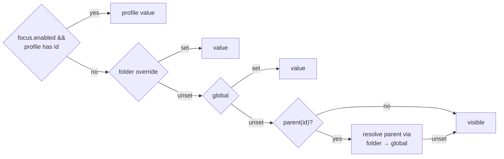

## Context

See proposal.md — Why. Current state relevant to the approach:

- `packages/shared/src/card-sections.ts` owns ids (`CARD_SECTION_IDS`), the stored shape `CardSectionPrefs { global?, folders? }`, validation (`isValidSectionId` = `[a-z0-9-]{1,64}`, absolute-path folder keys, caps 1000 folders / 64 keys) and the single resolver `resolveCardSectionVisible` (folder → global → visible). Unknown valid ids are already preserved by the server store.
- Server: `persistence/preferences-store.ts` (`cardSections`, Map-backed, load-time sanitized), `pairing/browser-gateway.ts` routes `set_card_section_visibility` / `reset_folder_card_sections`, snapshot `card_sections_updated` on change and on connect. New browser→server message types must also be registered in `identity/ws-message-scope.ts` and `identity/ws-road-classification.ts`.
- Client: `lib/state/CardSectionsContext.tsx` (`useCardSectionVisible`, `useCardSectionActions`), `lib/session/card-section-meta.ts` (rows + slot-gated plugin rows), `components/session/SessionCard.tsx` (desktop + mobile branches), `components/session/SessionList.tsx` (folder card render ~L1817–2140), `components/DirectorySettings/CardSectionsPage.tsx`, `components/settings/CardSectionsSection.tsx`.
- Plugin slots: `dashboard-plugin-runtime/src/slot-consumers.tsx` — `SessionCardBadgeSlot` (legacy claims + intents keyed by `pluginId`), `SidebarFolderSectionSlot`, `SessionCardActionBarSlot`. Every claim carries `pluginId` (e.g. `automation`, `goal`, `browser`, `kb`, `mcp-client`, `team`).
- Effects: `index.css` `.card-stripes-fx` / `.card-stripes-{running,unread,input}` (status gradients) and `.card-ring-fx` / `.card-glow-fx*` (selected neon ring); `SessionCard` decides via `getCardStripeFxClass` + `hasAnimatedFx`. There is no "gradient theme" in the theme list; "gradients" = these card effects.
- Folder collapse is server-persisted (`collapsedFolders`, `set_folder_collapsed`) — the replaced change's localStorage plan for the user-expanded set is stale.

## Goals / Non-Goals

**Goals:**
- One store, one resolver, one sync channel for session-card blocks, directory-card blocks, effects and Focus.
- Zero-migration compatibility for existing stored preferences.
- Focus mode is reversible by construction (overlay, never rewrites normal prefs).

**Non-Goals:**
- No inline legend menu on directory-card blocks or folder pills (settings pages only); can follow later.
- No switch for the folder header, session card title/meta line, or Fork/Resume buttons.
- No per-folder effects; no per-device Focus (server-synced only, per user choice).
- No theme changes.

## Decisions

### D1. Extend `CardSectionPrefs` instead of a new store
Add `focus?: { enabled?: boolean; profile?: { sections?: Record<string, boolean>; folderListMode?: "classic" | "accordion" } }` to `CardSectionPrefs`; effects are just global ids (`fx-status-animation`, `fx-selected-glow`). The existing snapshot message carries the whole record, so every browser gets Focus/effects with no extra broadcast path. Required server touch points: load sanitize (`packages/server/src/persistence/preferences-store.ts:430`, today returns only `global`/`folders`), `cardSectionsSnapshot` (`:437`) and `cardSectionsForDisk` (written at `:633`/`:645` as an explicit object literal) must all carry `focus`. Profile key cap is separate: `FOCUS_PROFILE_MAX_KEYS = 256` (a saved profile enumerates every offered id, ~3 per plugin, which can outgrow the 64-key per-map cap).

Pinned-open folders are NOT part of card sections: `expandedFolders: string[]` is a new top-level preferences field next to `collapsedFolders` (same canonical key, same "never prune for missing sessions" rule), with its own message. Invariant: never both collapsed and pinned — `set_folder_expanded(true)` removes the key from `collapsedFolders`; `set_folder_collapsed(true)` removes it from `expandedFolders` (server-side, so every browser converges).
*Alternative*: separate `focus_mode_updated` message + store. Rejected — duplicates sync/caps/validation for no gain.

### D2. Resolver precedence and legacy parents

`parentOf(id)`: `openspec-badge → openspec`; `badge-* → status`. The parent is resolved only through folder/global (not focus) so focus on a parent does not leak into a child the profile left unset — the built-in profile lists children explicitly. `resolveCardSectionVisible(prefs, folderKey, id)` keeps its signature; focus is read from `prefs.focus`. A `resolveFolderListMode(prefs, config)` helper sits next to it.
*Alternative*: migrate stored `openspec=false` into `openspec-badge=false` on load. Rejected — rewrites user data, and new clients against old data would diverge from old clients.

### D3. Per-plugin ids generated, not hardcoded
`pluginSectionId(kind, pluginId)` → `badge-<id>` / `actionbar-<id>` / `pill-<id>`; returns `null` when the result fails `isValidSectionId` (contribution then always visible). Slot consumers gain an optional `isPluginVisible?: (pluginId) => boolean` prop filtering both legacy claims and intents; the host (`SessionCard`, `SessionList`) supplies it from context. `BadgeSubcard`'s "has content" check uses the same filter so an all-hidden STATUS subcard does not render an empty frame. Settings rows are produced from the registry's claims per slot (replacing the fixed `useSlotHasAnyClaims` map for these kinds), labeled by plugin display name.
*Alternative*: one hardcoded `status-goals` / `status-automations` pair. Rejected — browser-relay and future plugins would need code changes.

### D4. Directory-card gating stays in `SessionList`
Each block in the expanded folder render is wrapped with the resolved flag for `cardSectionFolderKey(group.cwd)`. The 2-col pill grid is not rendered when all its children are hidden (no empty margin). `folder-git` hides `GroupGitInfo` but keeps the group-by chip in that row. `folder-banner` hidden → `FolderActionBanner` gets a `compact` mode that renders a chip when it would show a banner; activating sets a per-tab "revealed" flag for that cwd.

### D5. Effects via root attributes + class gating
One mechanism only: a CSS gate. Client sets `data-fx-status="off"` / `data-fx-glow="off"` on `<html>` from resolved global/focus values. DOM and state classes are unchanged (`getCardStripeFxClass` in `packages/client/src/lib/session/session-status-visuals.ts` stays the single mapping, so sidebar card and board row stay identical). Under `[data-fx-status="off"]`, `.card-stripes-fx` gets `animation: none` and its repeating gradient is replaced by the flat state tint (the static cue the `prefers-reduced-motion` blocks in `index.css` already define — reuse by selector list, do not duplicate). Under `[data-fx-glow="off"]`, `.card-ring-fx` / `.card-glow-mask` get `display: none`; the static blue border + ring underneath remains. Existing `prefers-reduced-motion` rules are untouched.
*Alternative*: skip mounting the layers in React. Rejected — two mechanisms for one switch, and the board row would need the same branch.

### D6. Accordion (folded in from `focus-driven-folder-compaction`)
Pure helpers in `packages/client/src/lib/folder-focus.ts`: `demandsAttention`, `resolveActiveCwd`, `resolveGroupRenderMode` (decision table in `specs/folder-focus`). Latest intent wins: `resolveActiveCwd(selectedCwd, activatedCwd, lastIntent)` where `lastIntent` is `"select" | "activate"`, updated on session selection and on folder header-body / compact-row activation (mockup finding D-1); activated cwd + intent are component state. Changes vs the replaced design:
- Pinned-open set is server-persisted (`expandedFolders` in D1, message `set_folder_expanded {path, expanded}`), never pruned for missing sessions — matching the collapsed-folder rules.
- Compact modes reuse the **condensed (collapsed) header**, not the full header — Focus is about space; the old "keep full header" decision contradicts the minimalist goal.
- `folderListMode` / `folderAttentionPeek` stay in server config (`config.ts`), written via the existing Settings save path (`SettingsPanel.tsx:335` builds a partial; `/api/config` PATCH, `packages/server/src/routes/system-routes.ts:514`) and propagated like other config fields; the effective mode may come from the focus profile.
- Chevron icon follows the rendered mode (▾ full, ▸ otherwise); on an unfocused folder it pins/unpins, on the focused folder it collapses/expands.

### D7. Focus messages
`set_focus_mode {enabled}`; `set_focus_profile {profile | null}` (full replace; `null` = reset to built-in). "Save current" and per-row edits are computed client-side and sent as a full profile — server validates every key with the existing id rule, boolean values, `folderListMode` enum and `FOCUS_PROFILE_MAX_KEYS`. "Save current" snapshots, per offered id, the Focus-off, no-folder resolution (global → parent's global → visible) — explicit values, so the profile does not drift when globals change later. Built-in profile lives in shared (`DEFAULT_FOCUS_PROFILE`) and is applied by the resolver when `focus.profile` is absent, so new plugin ids are covered by a rule ("all `badge-*`/`actionbar-*`/`pill-*` hidden") rather than an enumerated list.

## Risks / Trade-offs

- [64-key per-map cap in global/folder maps] → those maps are sparse (only set keys stored); the profile has its own 256 cap; caps reject, never truncate.
- [Focus hides the OpenSpec/git action surfaces users rely on] → these remain reachable via chat, folder actions menu and board; toggle is one click in the sidebar header.
- [Phase chip removal from tags strip is visible to everyone] → it was a duplicate of the badge line; with `openspec-badge` hidden the user explicitly asked not to see it.
- [Slot consumer API change in a published package] → prop is optional; old hosts unaffected.
- [Accordion header-click split changes muscle memory] → only in opt-in accordion mode / Focus.

## Migration Plan

No data migration: new ids inherit from legacy parents; absent `focus`/`expandedFolders` = today. Older servers keep the new section ids (regex validation, `preferences-store.ts:400`, `directory-handler.ts:208`) but DROP `cardSections.focus` (load sanitize + snapshot keep only `global`/`folders`) and top-level `expandedFolders` (explicit write literal, `preferences-store.ts:633`) on their first rewrite. After a downgrade Focus is off and pinned-open folders are gone — accepted; normal preferences are untouched because Focus never wrote them. Rollback: revert client/server; stored extra keys are ignored by the old resolver.
