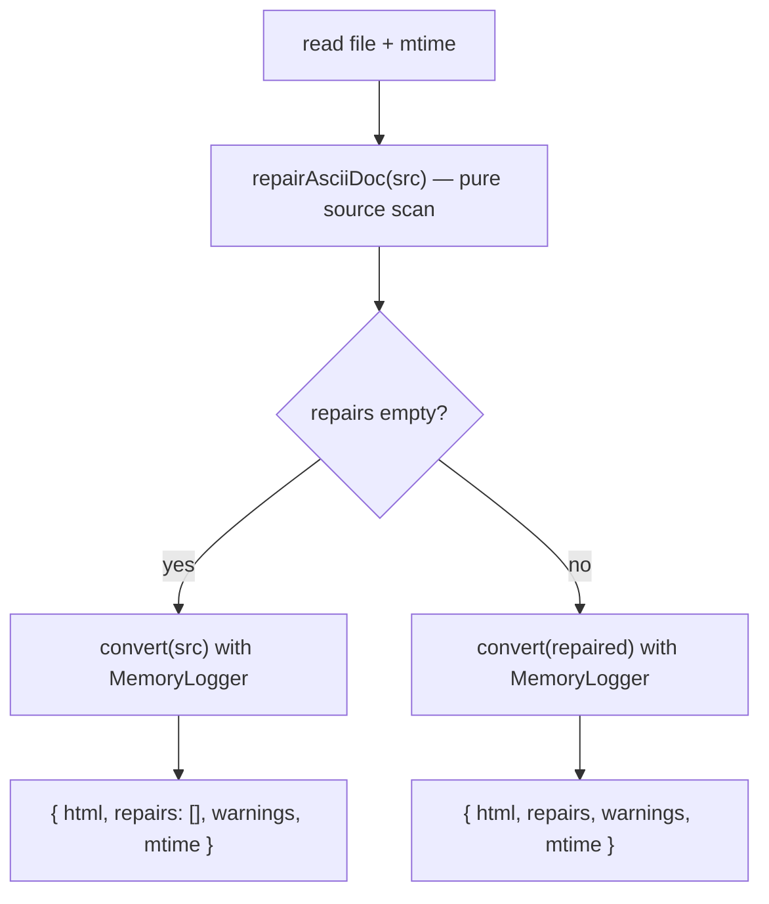

## Context

See proposal.md — Why. Markdown previews render raw file content client-side through `MarkdownContent` (react-markdown + `remark-frontmatter`, full content passed); mermaid fences gate on `isFencedBlockComplete(content, code)` (`packages/client/src/components/preview/MarkdownContent.tsx:176-180`, call site `:502`), designed for streaming chat — it only looks for a trailing ```` ``` ````, so in a file preview an EOF-unclosed mermaid fence AND a correctly closed `~~~mermaid` fence both stay "Loading diagram…" forever. `AsciiDocPreview` already passes `complete={true}`. `MarkdownPreviewView` (canvas, OpenSpec artifacts) renders on-disk content via `<MarkdownContent content frontmatter="properties" />` (`MarkdownPreviewView.tsx:109`) with no file identity. AsciiDoc renders server-side in `/api/file/render` (`packages/server/src/routes/file-routes.ts`, lazy asciidoctor singleton, `safe: "secure"`, `showtitle`, returns `{ html }` only; `asciidoctor ^3.0.4` per `packages/server/package.json`), then the client splits/hydrates diagram blocks (`packages/client/src/lib/preview/adoc-diagram-splitter.ts`, keys on `language-*`/`data-lang`/`@startuml`). Bare `[mermaid]` styles are dropped by the secure convert (documented in the archived `diagram-rendering` change).

**Sequencing:** builds on `add-preview-apply-fix-to-file` (not yet landed), which introduces `MermaidSourceContext` (`{cwd, path, kind, reload, isDirty?, expectedCount?}`, provided only for live-session cwds), the shared `MARKDOWN_REMARK_PLUGINS` constant, the diff-confirm dialog and the `/api/file/md-read` → `/api/file/write` (mtime) path. Implementation starts after that change merges. It is also sequenced after `sanitize-untrusted-rendered-content`, which sanitizes the `/api/file/render` AsciiDoc HTML server-side (today `file-routes.ts:1134-1136` returns raw `adoc.convert` output): a repair can un-swallow content such as a `++++` passthrough, so the sanitizer must already sit in that path.

## Goals / Non-Goals

**Goals:** fix the high-frequency "document swallowed by one bad block" classes and the bare `[mermaid]` gap; display and write from one function per format; never touch chat/streaming.

**Non-Goals:** repairing fences inside blockquotes or list items (only top-level fences); Setext headings as M3 anchors; generic AsciiDoc linting; repairing AsciiDoc example/sidebar/open/comment/passthrough/table blocks (`====`, `****`, `--`, `////`, `++++`, `|===`) — only listing `----` and literal `....` blocks are repaired; repairing tables, includes or attributes; LLM markup repair; tilde-fence streaming behaviour in chat.

## Decisions

### D1 — Two repair functions, one per format
- `repairMarkdown(src)` — `packages/client/src/lib/preview/markup-repair-md.ts`. Client-only: needs the mdast parse (D2) and is only ever run client-side.
- `repairAsciiDoc(src)` — `packages/shared/src/markup-repair/asciidoc.ts`. Pure line scanner, no asciidoctor import, no warnings input — the server (display) and the client (apply; no asciidoctor there) run the identical function.

Both return `{ source, repairs: Array<{ rule: "M2"|"M3"|"A1"|"A2"; line: number }> }`. `line` = 1-based line in the ORIGINAL source: the block opener line for M2/M3/A2, the `[mermaid…]` attribute line for A1. Implementations that edit iteratively map a working-source line back to the original by subtracting the number of lines inserted above it (M3 and A2-insert add one line each; replacements add none); a two-repair fixture pins this. Idempotent: `repair(repair(x).source).repairs` is empty and the source unchanged.

Line endings are handled per line: lines are split keeping each line's own terminator; a replaced line keeps its own terminator; an inserted line takes the block opener line's terminator (the opener is never the last line when content follows it; a fence/delimiter with nothing after it is never repaired). No other byte changes. Patterns tolerate a trailing `\r`.

### D2 — Markdown: scope + rules
`MarkdownContent` gains an optional `staticSource?: boolean` prop (default `false` = chat/streaming behaviour, unchanged). Every on-disk preview passes `true`: `FilePreviewOverlay`, editor-pane `MarkdownViewer`, `MarkdownPreview`, `MarkdownPreviewView`. With `staticSource`:
- **M1 (gate fix, not a repair):** `MermaidBlock` gets `complete={true}` — the source is complete by definition. CommonMark already closes an unterminated fence at the end of its container, so nothing is reported or written. It is not a repair, so it stays on in "view original" rendering too (view original removes repairs, not the M1 gate fix).
- **M2/M3:** `repairMarkdown` runs on the content before react-markdown; result memoized on content. Shows the banner (D5).

Detection uses the same parse the renderer and the write-back locator use: `unified().use(remarkParse).use(MARKDOWN_REMARK_PLUGINS)` (frontmatter becomes a `yaml` node, never a `code` node). Candidates = `code` nodes that are direct children of `root`, whose opener line has only whitespace before the fence marker, and that are **unterminated**: the node's last source line is not a closing fence (same char, length ≥ opener, indentation ≤3, only trailing whitespace). For each candidate, scanning the node's content lines from the opener:
- **M2:** the first line consisting solely of ≥3 fence characters (indentation ≤3, trailing whitespace) of the other char, or of the same char but shorter than the opener, is **replaced** by a closer = opener's indentation + opener char × opener length. Replacement — not insertion — avoids leaving a stray `~~~` that would open a new fence.
- **M3:** else, the first line matching `^ {0,3}#{1,6}[ \t]+\S` whose preceding line is blank (`^[ \t]*$`): a closer (as above) is **inserted before that blank line**; the blank line is kept.
- else no repair.

An inserted/replaced closer at the opener's (≤3) indentation is a valid closer for the top-level fence ⇒ the repaired node is terminated ⇒ idempotent. The text after the new closer is re-parsed by the next pass of the same function; a second unterminated top-level fence there is repaired in the same call (iterate parse → first candidate → edit until no candidate; bounded by the number of fences; reported lines mapped back to the original per D1).

### D3 — AsciiDoc pipeline

One convert per request; the repair decision is source-based. `warnings` = the converter's log messages for the **converted** source (line numbers refer to the converted source), captured by swapping asciidoctor.js's global logger around the synchronous `convert` and restoring it in `finally` (synchronous ⇒ no cross-request interleaving; regression test with two sequential renders). Verified on asciidoctor 3.0.4 during planning: `prev = LoggerManager.getLogger(); m = MemoryLogger.create(); LoggerManager.setLogger(m)` → `m.getMessages()` yields `{getSeverity()→"WARN", getText()→"unterminated listing block", getSourceLocation().getLineNumber()→3}` for a `----` opened on line 3. `mtime` = full-precision `mtimeMs` of the file read (apply verify token, D5).

Source scan: a delimiter stack over `----`, `....`, `====`, `****`, `--`, `////`, `++++`, `|===`; a block closes only on the same char at the same length. Inside verbatim blocks (`----`, `....`, `////`, `++++`) no other line is structural.
- **A1:** an attribute line `^\[mermaid(,[^\]]*)?\][ \t]*$` followed — after zero or more block-title (`^\.\S`), anchor (`^\[\[.*\]\]$`, `^\[#.*\]$`) or further attribute lines — by a `----` or `....` opener is rewritten to `[source,mermaid…]`, rest of the attribute list kept verbatim. A `[mermaid]` on a paragraph is untouched. Verified on 3.0.4 during planning: `[source,mermaid]` on both `----` and `....` (also with a `.Title` line between) emits `<code class="language-mermaid" data-lang="mermaid">`; bare `[mermaid]` emits a plain `<pre>`.
- **A2:** an unterminated `----` / `....` block that is not nested inside another delimited block: (1) the first following line of the same char with a different length (≥4) is **replaced** by the opener's exact delimiter; else (2) the first following section title (`^={1,6}[ \t]+\S`) preceded by a blank line ⇒ closing delimiter **inserted before** that blank line; else no repair. Nested unterminated blocks are not repaired (non-goal); fixtures cover nested blocks in lists, `--` open blocks and sibling same-char blocks of different lengths, each asserting idempotence.

Neither rule emits passthrough, include, `pass:` or document-attribute lines.

### D4 — Heuristic precision
- Repairs fire only on blocks unterminated per the format's own rules; a correctly closed document (including a ```` ```` ```` fence documenting a ```` ``` ```` fence, or YAML frontmatter containing fence-like lines) never enters repair.
- Inside an already-broken block, a literal look-alike line can be taken as the intended closer: M2 (a ```` ``` ```` content line inside an unterminated ```` ```` ```` fence), M3 (a `# comment` after a blank line in a shell sample), A2 (a literal `-----` line in a broken listing). The banner names each with its line; view-original reverts it in view; apply is diff-confirmed.

### D5 — Banner + apply
`MarkupRepairBanner` is mounted inside the shared renderers (`MarkdownContent` with `staticSource`, `AsciiDocPreview`) so every preview surface gets it: "Markup auto-fixed: closed unterminated fence (line 42) · …" · "View original rendering" toggle (`aria-pressed`) · "Apply markup fix to file".

The apply button is present only when `MermaidSourceContext` is provided (file identity + live-session cwd, per `add-preview-apply-fix-to-file`) and is disabled with an explanation while `isDirty`. On activate: `GET /api/file/md-read` → `{content, mtime}`; verify the file is unchanged since display — md: `content` byte-equal to the content the preview rendered; adoc: `mtime` equal to the render response's `mtime`; then compute `repair(content)`, show the whole-file diff (hunks with context) in the dependency's diff dialog, and on confirm `POST /api/file/write {content: repaired, mtime}`. Mismatch or 409 ⇒ no write, "file changed — reload". After 200 the surface `reload`s; the banner disappears because the source repairs to itself.

"View original rendering": markdown re-renders the unrepaired content client-side (M1 stays on); AsciiDoc lazily requests `/api/file/render?…&repair=0` on first activation and caches the HTML for the toggle. No markdown repair perf budget: `repairMarkdown` is memoized on content (decision during scenario design).

While the banner is active and unapplied, per-diagram apply in that document is disabled with "apply the markup fix first" (block ordinals on disk differ from the repaired rendering); it re-enables after the reload.

## Risks / Trade-offs

- [False-positive close inside an already-broken block] → D4; visible with line number; user can decline apply.
- [Repair activates content previously swallowed by an unterminated block (e.g. a `++++` passthrough)] → the content is the file's own and would render identically if the author had closed the block; `/api/file/render` HTML sanitization is owned by `sanitize-untrusted-rendered-content`.
- [Asciidoctor logger API differs from assumption] → task 1.1 spike; repair never depends on warnings.
- [Display/apply drift] → same function per format; verify-before-write.
- [Whole-file diff for large files] → dialog renders hunks with context.
- [Depends on unlanded change] → explicit sequencing; tasks start with a precondition check.

## Migration Plan

Additive response fields; server restart + client build. Rollback: revert.
