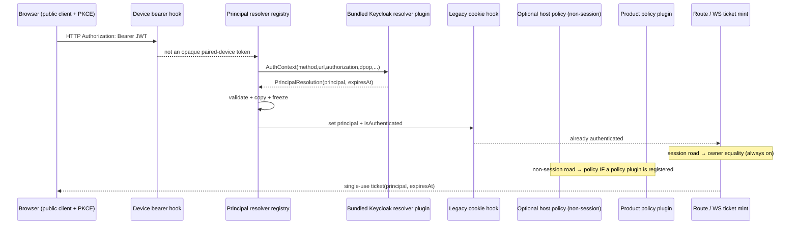
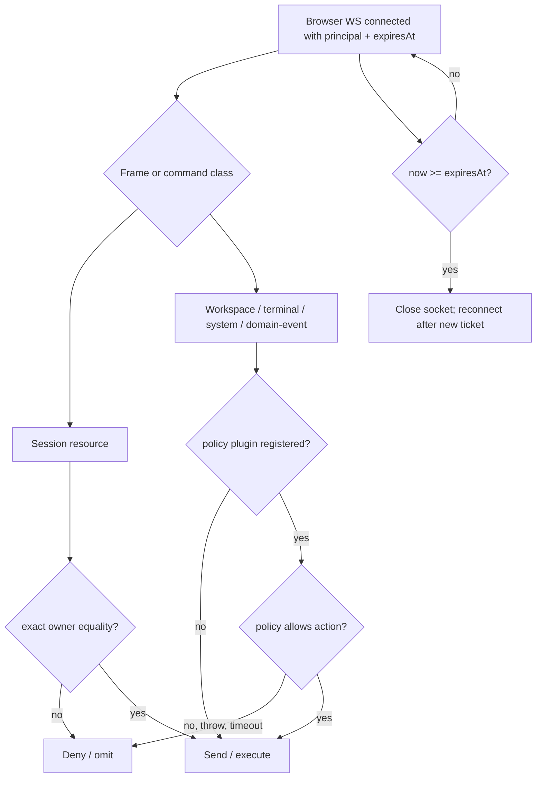

## Context

Current request order is significant. `registerBearerAuth` installs the opaque paired-device hook first. `registerAuthPlugin` then installs the legacy confidential-login cookie hook, which returns 401/redirect when neither device nor cookie authentication succeeds. Plugin server entries load later but before `listen()`. Therefore a principal hook placed "after the auth chain" cannot authenticate a Topology-B Keycloak bearer: the cookie hook has already replied.

The browser gateway also has multiple authorization roads, not only subscription and domain-event broadcast. It sends OpenSpec, branch, terminal, and complete session snapshots during connection bootstrap; then accepts list/read/mutation commands carrying client-supplied ids. A complete owner boundary must cover bootstrap, lists, detail/replay, mutations, and asynchronous fan-out.

Per the initiative (`add-authentication-and-roles`, AUTH-FLOW §9), the layering is fixed: **core owns the seam** (hook, `(iss, sub)` shape, fail-closed default, ordering) and knows nothing of Keycloak; **the Keycloak validator is a bundled dashboard plugin**, replaceable by an override plugin; **product authorization lives in the product plugin**. This change also adds the **browser client plane** (public OIDC client, PKCE, bearer, ticket) because topology B is unreachable by the shipped cookie-based client without it.

There is **no mode flag**. The plane activates on the resolver plugin being **enabled and configured** (`issuer`+`audience`); otherwise it is inert and behavior is byte-for-byte today's.

## Goals / Non-Goals

**Goals**
- Authenticate Topology-B Keycloak bearer requests before the legacy cookie hook can reject them.
- Carry exact `(iss, sub)` plus credential expiry through HTTP, ticket, and WebSocket lifecycles.
- Scope every host-owned session read/write road to its owner whenever the resolver is active.
- Ship the browser client plane (PKCE + bearer + ticket + heartbeat) so topology B works end to end.
- Preserve all current behavior while the resolver is inert (disabled or unconfigured).
- Keep product authorization in the product plugin; keep the host policy optional and non-session-only.
- Hardcode no Keycloak realm/host/client/audience/key value; ship the validator as a bundled plugin, not core.

**Non-goals**
- Product roles, approver routing, or domain authorization data.
- Migration/adoption of ownerless historical sessions and the legacy `auth.providers` cut-over.
- Token revocation introspection beyond JWT expiry. An already-accepted socket is bounded by its token `exp`.
- RP-initiated logout / server session destruction (browser owns LEG 4 under topology B).
- Canonical product store key `(cwd, invoiceId, principal)` (initiative items 28/29) — product-plugin-owned.
- Cross-instance DPoP `jti` replay defense (single-instance today).

## Architecture





## Decisions

### D1 — Activation is by resolver state, not a mode flag

There is no `identity.mode`. The plane has exactly two observable states, derived from the bundled resolver plugin:

- **Inert** — the resolver plugin is disabled, or enabled but missing `issuer`/`audience`. The dispatch hook makes no claim, `request.principal` stays `null`, no ticket-identity requirement applies, owner equality is not consulted (no session has an owner), and fan-out is the legacy global broadcast. Behavior is byte-for-byte what it was before this change. This is "no auth otherwise."
- **Active** — the resolver plugin is enabled and configured. Bearer tokens resolve; session roads become owner-gated; browser upgrades require an identity-bearing ticket; the optional policy (if registered) gates non-session roads.

"Default-inert" is achieved by *the resolver being unconfigured*, not a config enum. "Present out of the box" is achieved by the plugin shipping bundled and default-enabled. The two are independent: default-enabled + unconfigured = inert.

### D2 — Resolver dispatch runs inside the authentication OR-chain

Register the core resolver-dispatch hook after `registerBearerAuth` and before `registerAuthPlugin`, at a fixed position, reading a mutable registry so plugin load order is irrelevant.

- Paired-device bearer succeeds first and remains a device with no human principal.
- Keycloak bearer is resolved next. Success sets `request.principal`, `request.principalExpiresAt`, `request.isAuthenticated = true`, and `authVia = "principal"`; the later cookie hook observes authenticated state and returns.
- `ResolverReject` returns 401 immediately.
- `null` allows the next resolver, then the legacy cookie branch.

While inert the hook returns immediately (no registered+configured resolver), so a cookie/device boolean path is exactly as today. When active, a protected session road with a device/cookie boolean but no principal is refused by owner equality.

### D3 — Resolver outcome includes credential lifetime

```ts
type Principal = Readonly<{ iss: string; sub: string; email?: string }>;
type PrincipalResolution = Readonly<{ principal: Principal; expiresAt: number }>;
type ResolverOutcome = PrincipalResolution | ResolverReject | null;
```

`expiresAt` is Unix epoch milliseconds copied from the verified access-token `exp`. Core validates finite future expiry, non-empty strings, plain data properties, and maximum lengths; then copies and freezes the value. Resolver-owned mutable objects/getters never enter request/ticket/socket state.

**Clock skew vs the future-expiry check are separate concerns.** Skew (D7) is applied only inside the resolver's *validity decision* — it forgives an `exp` a few seconds before `now`. The `expiresAt` returned is still the raw `exp`. Core's "reject non-future `expiresAt`" guard is a coarse sanity floor against a resolver returning a dead/malformed lifetime; it uses the same configured skew as its floor so the two rules cannot disagree at the boundary.

### D4 — Trust is a host-owned grant; priority is ordering only; the default is overridable

Self-declared `manifest.priority` is not a trust boundary. Resolver registration is permitted only for:

1. the bundled Keycloak resolver plugin (`keycloak-resolver`), or
2. a plugin explicitly named in operator-controlled `identity.trustedResolverPlugins`.

Resolver ordering uses `(manifest.priority ASC, pluginId ASC)`; plugin id is the cross-boot deterministic tie-break. Duplicate registration from one plugin fails.

**Override rule.** The bundled default is displaced by disabling it (`plugins.keycloak-resolver.enabled: false`) and trusting a replacement via `identity.trustedResolverPlugins`. Disable + trust is the repo-idiomatic swap: it avoids a silent fall-through where a declined override lets the default claim a token the operator meant it not to. A chain of multiple *coexisting* trusted resolvers is permitted (priority-ordered, first-claim-wins) but is not how the default is replaced.

Access-policy registration (D9) is permitted only for the single plugin named by `identity.trustedPolicyPlugin`, and is optional.

### D5 — Three-valued resolution, bounded failure

- `null`: credential is not owned; continue.
- `PrincipalResolution`: credential valid; stop and authenticate.
- `ResolverReject`: credential is owned but invalid; stop and return 401.

**The throw→null rule is core's outermost safety net, not the resolver's error policy.** A resolver that owns a credential MUST catch its own validation failures and return `reject` explicitly — a bad signature, failed JWKS lookup on an owned token, expired `exp`, or bad DPoP proof is an *owned-invalid* outcome (`reject`), never an uncaught throw. Core's catch→`null` boundary exists only for an *unexpected* fault (a bug, OOM, timeout); it must not be the path a normal invalid token travels, or an owned-invalid token would fall through to a lower resolver or the cookie hook. The Keycloak resolver (D7) wraps all crypto/JWKS/DPoP calls and converts any owned-token failure to `reject`. Timeout defaults to 2,000 ms, configurable 100–5,000 ms.

### D6 — Curated, DPoP-ready context

Resolvers receive only `{ method, url, authorization?, cookie?, dpop?, isAuthenticated, ip }`. `method`, canonical external URL, and `dpop` permit RFC 9449 proof validation. Raw Fastify request/reply objects are not exposed.

**D6a — Canonical `url` for `htu` matching.** The `url` is the externally-visible request URL the browser signed into the DPoP proof, reconstructed as `scheme://host[:port]/path` with query string and fragment stripped (RFC 9449 compares `htu` without them). Scheme and host derive from the configured public base URL / trusted proxy headers, NOT the raw socket, so a proxied request reconstructs the same `htu` the browser used. If proxy trust is not configured, `htu` matching uses the dashboard's own bind address; a mismatch rejects rather than guesses.

**Replay window (`jti`).** The `jti` replay cache is an in-process bounded LRU keyed by `jti` with TTL = the proof freshness window; it defends a single dashboard instance. Cross-instance/replica replay defense is out of scope (the dashboard is single-instance today).

### D7 — Bundled Keycloak resolver plugin owns only configured issuer tokens

Ships as `packages/keycloak-resolver-plugin` (manifest id `keycloak-resolver`), default-enabled, listed in `BUNDLED_PLUGINS` (pinned by `bundled-plugins-complete.test.ts`). **Core imports nothing Keycloak-specific**; its only awareness is that a trusted resolver is registered.

Required settings (via `getPluginConfig()`): `issuer`, `audience`. Optional: `authorizedParty`, `jwksUri`, `clockSkewSeconds` (default 30), `networkTimeoutMs` (default 2,000), `allowInsecureHttp` (default false). **No client id/secret setting exists:** a resource server does not authenticate to Keycloak; the only client-identity check is `aud` (required) plus optional `azp`. When `issuer`/`audience` are absent the plugin registers but resolves every request to `null` — the inert state (D1).

- Opaque/non-JWT bearer → `null`.
- Parsed JWT whose unverified `iss` differs from configured issuer → `null`.
- JWT claiming the configured issuer → owned; verify RS256, signature, exact `iss`, required `aud`, optional required `azp`, `exp`, and `sub`. Failure → `ResolverReject`.
- If `cnf.jkt` exists, validate the DPoP proof (RFC 9449): proof JWS verifies under its embedded `jwk`; SHA-256 thumbprint of that `jwk` equals `cnf.jkt`; `htm` equals the method; `htu` equals the canonical URL (D6a); `ath` equals base64url SHA-256 of the presented access token; `iat` is fresh; `jti` is unreused. Any missing/mismatched element rejects. **A token without `cnf.jkt` validates as a plain bearer** — DPoP is conditional, so a demo realm that issues unbound tokens works unchanged.
- Include `email` only when it is a string and `email_verified === true`.

Discovery/JWKS obey the network timeout; the cache coalesces concurrent refreshes and does at most one refresh per unknown `kid` per in-flight generation. No stale key validates after cache expiry unless response metadata permits. `http:` issuer/JWKS URLs require explicit `allowInsecureHttp: true`.

### D8 — An active resolver excludes confidential login connectors

The existing `auth.providers.*` path is a confidential login connector that exchanges a code and mints a dashboard cookie; it is not a resource-server bearer validator. When the resolver is active, a non-empty `auth.providers` is a startup configuration error — this avoids two principal sources, a principal-less cookie bypass, and issuer drift. While the resolver is inert the connector is unaffected.

### D9 — One OPTIONAL policy contract covers non-session host roads

The trusted product plugin MAY register exactly one async policy:

```ts
authorize(input: { principal: Principal; action: HostAction; resource: HostResource }): Promise<boolean>
```

**Scope.** This is a host *resource-dispatch* gate, not the product authorization model. It governs only **non-session** host-owned roads: domain-event fan-out, workspace/OpenSpec/branch/terminal/system bootstrap and commands, and disclosure of non-session bootstrap state. **Session roads are governed by owner equality (D11), never by this policy.**

**Optional.** When no policy plugin is registered, non-session roads stay ungated — exactly today's behavior. The resolver never implies a policy; the policy never authenticates. This decouples "topology B on" from "host authorization on": a deployment can have principals + owner-scoped sessions with no policy plugin at all.

Host actions are stable constants grouped by resource; resource descriptors are bounded plain data. Policy timeout defaults to 500 ms (50–2,000 ms). A registered policy that returns false/throws/times out/returns non-boolean denies that road and emits a structured audit event. At most one policy is allowed; a second registrant fails.

Product authorization (approver routing, atomic authorize+mutate, actor stamping) lives in the product plugin, evaluated live against the resolved principal — not here.

### D10 — Session-road classification is exhaustive; non-session gating is opt-in

Every host road that touches a **session** is classified so owner equality is applied uniformly: HTTP detail/transcript/mutation, WS bootstrap session snapshot, list/pagination, subscribe, replay/backfill, and every inbound session command. Coverage is asserted by test so a new session road without owner-equality fails.

Non-session host roads (workspace/OpenSpec/branch/terminal/system, domain events) carry a `{ action, resource }` classification consumed by the optional policy (D9). When no policy is registered they are ungated (today's behavior); when one is registered, an unclassified non-session road that reaches the policy path denies fail-closed. There is no catch-all "deny every unclassified `/api` route" — that only existed to serve the removed all-or-nothing mode.

### D11 — Session owner is persisted and assigned only through trusted roads

Add `principalOwner?: { iss: string; sub: string }` to `SessionMeta` and `DashboardSession`. Equality is `a.iss === b.iss && a.sub === b.sub`; no normalization, email fallback, or object identity.

- Browser `spawn_session` stamps the socket principal.
- Host HTTP spawn stamps the request principal.
- A trusted policy plugin may pass the current request principal through an owned-spawn API; untrusted plugins cannot set an owner field.
- **Correlation timing:** the owner is filed against the spawn correlation id (following the `pending-plugin-ref-registry` precedent) **before** the spawn is awaited, so an event that arrives before the spawn resolves is still attributable. `cwd` is never used as an ownership signal.
- Scheduler/automation/inert-era sessions have no owner.

Every session read/write path requires exact owner equality when the resolver is active. Ownerless sessions are invisible and immutable to human principals. Adoption/backfill is an explicit future/operator operation.

### D12 — Ticket is the HTTP→WS identity bridge

When the resolver is active, browser scope upgrades require a ticket minted by a principal-bearing HTTP request. The ticket contains route scope, principal, and `expiresAt`; single-use and short-lived. Cookie, local-token, trusted-network, and no-ticket browser upgrades cannot bypass this. Device/pairing and non-browser WS scopes retain their separate rules.

The socket receives immutable `ws.principal` and `ws.principalExpiresAt`. A timer closes it at expiry. Re-authentication means fetching a new access token, minting a new ticket, and reconnecting. JWT revocation before `exp` is not claimed.

### D13 — Heartbeat is transport liveness only

Browser heartbeat defaults to 30 seconds; two unanswered probes close the socket (60-second bound) and release subscriptions. It detects half-open connections only; it does not extend, revalidate, or revoke the principal, and is not coupled to any one session.

### D14 — Authorization applies to bootstrap, commands, replay, and fan-out; one road per frame

- Session bootstrap/list/page/detail/subscription/replay/mutations: exact owner equality (no policy).
- OpenSpec/workspace/branch/terminal/system bootstrap and commands, and domain events: the optional policy when registered, else ungated.
- **A frame is classified as exactly one road.** A session-scoped frame (owner-gated subscription) and a global domain event (policy-gated fan-out) are disjoint, decided at emit by the frame's own type. A frame carrying a `sessionId` travels the owner road; a frame emitted to the global domain-event road carries a `resource` and travels the policy road. A new frame type must declare its road; an undeclared frame type is treated as a domain event on the policy road (ungated when no policy, fail-closed when a policy is present), never as an owner-scoped session frame.

While inert, the legacy global `broadcast()` is retained unchanged.

### D15 — Browser client plane (topology B)

The shipped web client is built for topology A (`redirectToLogin()` → `/auth/login`; ws-ticket minted only for a paired-device bearer). Topology B needs the client to:

- Run Authorization Code + PKCE against Keycloak (public client, no secret), holding the access token in memory (not localStorage, to limit XSS token theft).
- Attach `Authorization: Bearer <access-token>` to same-origin `/api`/`/v1` requests via the existing `installDeviceAuthFetch` seam, distinct from the device bearer, never overriding an explicit header.
- Mint a browser-scope ws-ticket carrying the bearer and present only `?ticket=` on the socket (durable token never rides WS, F6).
- Answer the browser heartbeat (D13); on 401 or `principalExpiresAt`, silently re-acquire a token and reconnect.
- **Conditional DPoP:** if the token endpoint returns a `cnf.jkt`-bound token, generate a non-extractable WebCrypto keypair, bind it at the token request, and send a fresh proof per REST call and per ticket mint; if tokens are unbound, omit proofs. Downgrade is automatic and config-free.

All of this engages only when `/auth`/resolver signals the plane is active; against an inert dashboard the client behaves as today. This plane is a new capability `browser-principal-client`.

## Standards alignment

- RFC 9068: JWT access-token validation (`iss`, `aud`, `exp`, signature; `sub`).
- RFC 9700: OAuth 2.0 Security BCP; no decode-without-verify, exact issuer/audience checks.
- RFC 7636 / OAuth 2.1: public browser client with Authorization Code + PKCE; no browser-held client secret.
- RFC 9449: conditional DPoP proof validation when a token is sender-constrained.
- The resolver chain matches Spring Security `ProviderManager` semantics (not-owned vs invalid-owned); request principal exposure matches Spring `SecurityContext`, ASP.NET `HttpContext.User`, Passport `req.user`.
- Authorization remains outside authentication: the resolver establishes identity; owner checks and the optional policy govern actions/resources.

## Risks / Trade-offs

- **Session-road inventory:** owner-equality correctness requires classifying every session road. Mitigation: centralized road table + coverage test that fails on an unclassified session road.
- **Optional policy is security-critical when present:** explicit operator grant, exactly one policy, bounded calls, deny on failure, structured audit events. When absent, non-session roads are deliberately ungated (unchanged).
- **Hot-path network dependency:** Keycloak JWKS is cached/coalesced; resolver timeout bounded. Cold-start outage denies human access rather than accepting unverified tokens.
- **Client plane surface:** PKCE + bearer + ticket + DPoP touch every browser fetch/mint path. Mitigation: reuse the existing `installDeviceAuthFetch`/`mintWsTicket` seams; DPoP is conditional so the demo path stays plain-bearer.
- **Ownerless cut-over:** historical/automation sessions become unavailable to human users once active. Deliberate fail-closed; operationally planned.
- **Socket valid until token expiry:** no introspection/revocation loop. Keep access-token TTL short; socket closes at `exp`.

## Migration / Rollback

1. Ship with the resolver plugin default-enabled but unconfigured ⇒ inert ⇒ behavior unchanged.
2. Configure the resolver (`issuer`, `audience`, optional `authorizedParty`) from deployment settings. Pin issuer hostname/scheme/port before any `(iss, sub)` is persisted.
3. Add the public browser client to the Keycloak realm; deploy the client plane (D15).
4. Optionally install and trust a product access-policy plugin for non-session roads.
5. Verify real Keycloak discovery, token exchange, JWT validation, and two-user isolation in the docker E2E harness.
6. Ensure `auth.providers` is empty. The resolver becoming configured is the cut-over; restart.
7. Ownerless historical sessions remain hidden; respawn/adopt outside this change if needed.

Rollback: disable the resolver plugin (or clear its config) and restart ⇒ inert ⇒ unchanged. Additive owner metadata is harmless. No identity key is rewritten.

### Legacy-connector cut-over (deferred, not in this change)

An active resolver rejects a non-empty `auth.providers` (step 6), so a deployment relying on the confidential-client cookie login is a **breaking cut-over**, deferred to a later change. That change must cover: session continuity (cookie sessions carry no `(iss, sub)` → ownerless → hidden on cut-over; define adoption); identity join (cookie `sub` ≠ resource-server `sub`; confirm or remap); client reconfiguration (add the public PKCE client to the realm); and rollout shape (this change forbids the mixed state on purpose).

## Open Questions

None blocking. Product policy semantics, ownerless-session adoption, the product store key (items 28/29), and the legacy `auth.providers` cut-over are intentionally separate concerns; the host contracts, owner equality, the client plane, and fail-closed behavior are defined here.
