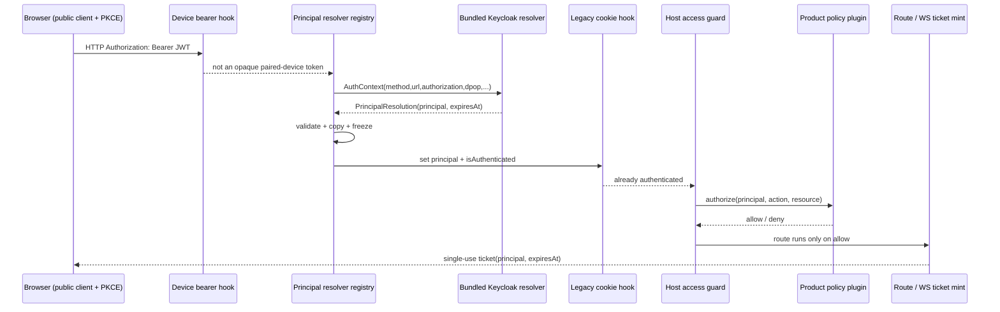
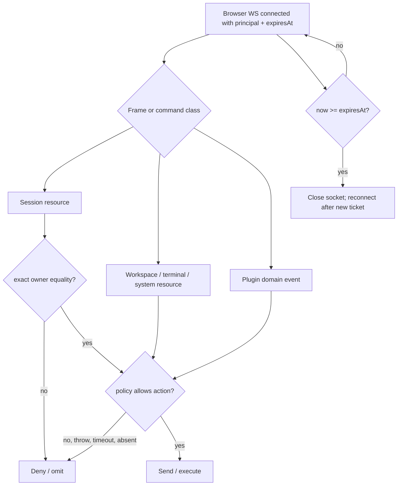

## Context

Current request order is significant. `registerBearerAuth` installs the opaque paired-device hook first. `registerAuthPlugin` then installs the legacy confidential-login cookie hook, which returns 401/redirect when neither device nor cookie authentication succeeds. Plugin server entries load later but before `listen()`. Therefore a principal hook placed "after the auth chain" cannot authenticate a Topology-B Keycloak bearer: the cookie hook has already replied.

The browser gateway also has multiple authorization roads, not only subscription and domain-event broadcast. It sends OpenSpec, branch, terminal, and complete session snapshots during connection bootstrap; then accepts list/read/mutation commands carrying client-supplied ids. A complete multi-user boundary must cover bootstrap, lists, detail/replay, mutations, and asynchronous fan-out.

The Keycloak resource-server resolver ships in pi-agent-dashboard on `develop`. It is dashboard functionality, not temporary private InvoiceBot code. All deployment-specific Keycloak values still come from settings. A separately developed product plugin supplies product authorization through the generic policy seam.

## Goals / Non-Goals

**Goals**
- Authenticate Topology-B Keycloak bearer requests before the legacy cookie hook can reject them.
- Carry exact `(iss, sub)` plus credential expiry through HTTP, ticket, and WebSocket lifecycles.
- Enforce all host-owned HTTP and browser-WS read/write surfaces in explicit multi-user mode.
- Preserve all current behavior when identity mode remains `legacy`.
- Keep product authorization outside core while making host enforcement complete and fail-closed.
- Hardcode no Keycloak realm/host/client/audience/key value.

**Non-goals**
- Product roles, approver routing, or domain authorization data.
- Migration/adoption of ownerless historical sessions.
- Token revocation introspection beyond JWT expiry. Logout/revocation may shorten future access-token issuance; an already accepted socket is bounded by its token `exp`.
- Replacing bridge-plane delivery policy or bridge ping/pong.

## Architecture





## Decisions

### D1 — Explicit activation: `identity.mode`

Add `identity.mode: "legacy" | "multi-user"`, defaulting to `legacy`.

- `legacy`: **resolver dispatch and policy evaluation are inert.** The registry may hold registrations, but the dispatch hook does not run, so `request.principal`/`request.isAuthenticated`/routing outcomes are byte-for-byte what they were before this change. A registered resolver cannot alter a legacy request. This is what makes "legacy preserves all behavior" literally true rather than aspirational.
- `multi-user`: startup readiness requires a configured bundled resolver and exactly one trusted access-policy plugin; browser and protected HTTP surfaces fail closed.

This resolves the previous contradiction between "default-inert" and "no predicate means deliver nothing." Fail-closed authorization activates only after an explicit mode cut-over. No partial activation is permitted, and no half-on state (resolver live but policy absent) is reachable.

### D2 — Resolver dispatch runs inside the authentication OR-chain

Register the core resolver-dispatch hook after `registerBearerAuth` and before `registerAuthPlugin`.

- Paired-device bearer succeeds first and remains a device with no human principal.
- Keycloak bearer is resolved next. Success sets `request.principal`, `request.principalExpiresAt`, `request.isAuthenticated = true`, and `authVia = "principal"`; the later cookie hook observes authenticated state and returns.
- `ResolverReject` returns 401 immediately.
- `null` allows the next resolver, then the legacy cookie branch.

A later strict authorization hook runs after legacy auth. In multi-user mode a cookie/device boolean without a principal cannot enter protected human routes. Explicit device/public route classifications remain reachable.

### D3 — Resolver outcome includes credential lifetime

Use:

```ts
type Principal = Readonly<{ iss: string; sub: string; email?: string }>;
type PrincipalResolution = Readonly<{ principal: Principal; expiresAt: number }>;
type ResolverOutcome = PrincipalResolution | ResolverReject | null;
```

`expiresAt` is Unix epoch milliseconds copied from the verified access-token `exp`. Core validates finite future expiry, non-empty strings, plain data properties, and maximum lengths; then copies and freezes the value. Resolver-owned mutable objects/getters never enter request/ticket/socket state.

**Clock skew vs the future-expiry check are separate concerns and do not conflict.** Skew (D7) is applied only inside the resolver's *validity decision* — it forgives an `exp` that sits a few seconds before `now` so a barely-fresh token still validates. Once the resolver decides the token is valid, the `expiresAt` it returns is still the raw `exp`. Core's "reject non-future `expiresAt`" guard is a coarse sanity floor against a resolver returning an already-dead or malformed lifetime; a Keycloak access token accepted under skew has an `exp` within seconds of now, which is future or within the same coarse tolerance, not the minutes-stale value this guard exists to catch. The guard uses the same configured skew as its floor so the two rules cannot disagree at the boundary.

### D4 — Trust is a host-owned grant; priority is ordering only

Self-declared `manifest.priority` is not a trust boundary. Resolver registration is permitted only for:

1. the bundled dashboard Keycloak resolver, or
2. a plugin explicitly named in operator-controlled `identity.trustedResolverPlugins`.

Access-policy registration is permitted only for the single plugin named by `identity.trustedPolicyPlugin`. The operator decision to install and grant these plugins is the security boundary.

Resolver ordering uses `(manifest.priority ASC, pluginId ASC)`. A plugin cannot pass a separate resolver priority. Plugin id provides a cross-boot deterministic tie-break. Duplicate registration from one plugin replaces nothing and fails registration.

### D5 — Three-valued resolution, bounded failure

- `null`: credential is not owned; continue.
- `PrincipalResolution`: credential valid; stop and authenticate.
- `ResolverReject`: credential is owned but invalid; stop and return 401.

**The throw→null rule is core's outermost safety net, not the resolver's own error policy.** A resolver that owns a credential MUST catch its own validation failures and return `reject` explicitly — a bad signature, failed JWKS lookup on an owned token, expired `exp`, or bad DPoP proof is an *owned-invalid* outcome (`reject`), never an uncaught throw. Core's catch-→-`null` boundary exists only for an *unexpected* fault the resolver did not model (a bug, an OOM, a timeout); it must not be the path a normal invalid token travels, because that would let an owned-invalid token fall through to a lower resolver or the cookie hook. The Keycloak resolver (D7) therefore wraps all crypto/JWKS/DPoP calls and converts any owned-token failure to `reject` before returning. Timeout defaults to 2,000 ms, configurable 100–5,000 ms. In multi-user mode startup requires the bundled resolver configuration, but runtime dependency failure still results in no human principal and protected routes deny.

### D6 — Curated, DPoP-ready context

Resolvers receive only `{ method, url, authorization?, cookie?, dpop?, isAuthenticated, ip }`. `method`, canonical external URL, and `dpop` permit RFC 9449 proof validation. Raw Fastify request/reply objects are not exposed.

**D6a — Canonical `url` for `htu` matching.** The `url` in `AuthContext` is the externally-visible request URL the browser signed into the DPoP proof, reconstructed as `scheme://host[:port]/path` with the query string and fragment stripped (RFC 9449 compares `htu` without query/fragment). Scheme and host derive from the configured public base URL / trusted proxy headers, NOT from the raw socket, so a request that arrived via the reverse proxy reconstructs the same `htu` the browser used. If proxy trust is not configured, DPoP `htu` matching uses the dashboard's own bind address; a mismatch rejects rather than guesses.

**Replay window (`jti`).** The `jti` replay cache is an in-process bounded LRU keyed by `jti` with TTL = the proof freshness window; it defends a single dashboard instance. Cross-instance/replica replay defense is explicitly out of scope for this change (the dashboard is single-instance today); a note flags it for a future distributed-cache change rather than pretending it is covered.

### D7 — Bundled Keycloak resolver owns only configured issuer tokens

Required settings: `issuer`, `audience`. Optional settings: `authorizedParty`, `jwksUri`, `clockSkewSeconds` (default 30), `networkTimeoutMs` (default 2,000), `allowInsecureHttp` (default false). **No client id/secret setting exists:** a resource server does not authenticate to Keycloak, so the only client-identity check is `aud` (required) plus optional `azp`. The public browser client's id lives in the SPA, not in the dashboard.

- Opaque/non-JWT bearer → `null`.
- Parsed JWT whose unverified `iss` differs from configured issuer → `null`, allowing another trusted JWT resolver.
- JWT claiming the configured issuer → this resolver owns it; verify allowed algorithm RS256, signature, exact `iss`, required `aud`, optional required `azp`, `exp`, and `sub`. Failure → `ResolverReject`.
- If `cnf.jkt` exists, validate the DPoP proof (RFC 9449): the proof is a JWS whose own signature verifies under its embedded `jwk`; the SHA-256 thumbprint of that `jwk` equals `cnf.jkt`; `htm` equals the request method; `htu` equals the canonical request URL (D6a); `ath` equals the base64url SHA-256 of the presented access token (binds the proof to THIS token, not just the method/URL); `iat` is within the freshness window; and `jti` is unreused within that window. Any missing/mismatched element rejects. Otherwise ordinary bearer validation applies.
- Include `email` only when it is a string and `email_verified === true`.

Discovery/JWKS requests obey the network timeout. Cache honors response cache metadata, coalesces concurrent refreshes, and performs at most one refresh for an unknown `kid` per in-flight generation. No stale key validates a token after cache expiry unless the response metadata explicitly permits stale use.

`http:` issuer/JWKS URLs require explicit `allowInsecureHttp: true`; this supports controlled Docker development without weakening production defaults.

### D8 — Topology-B mode excludes confidential login connectors

The existing `auth.providers.*` path is a confidential login connector that exchanges a code and mints a dashboard cookie; it is not a resource-server bearer validator. In `multi-user` mode, non-empty `auth.providers` is a startup configuration error. This avoids two principal sources, principal-less cookie bypass, and issuer drift. `legacy` mode retains the connector unchanged.

### D9 — One policy contract covers every protected host road

The trusted product plugin registers exactly one async policy:

```ts
authorize(input: {
  principal: Principal;
  action: HostAction;
  resource: HostResource;
}): Promise<boolean>
```

Host actions are stable constants grouped by resource: session list/read/mutate/spawn/adopt; workspace/OpenSpec read/mutate; terminal read/mutate; system/config read/mutate; plugin domain read; and plugin-defined action namespaces. Resource descriptors are bounded plain data and identify the target without carrying secrets.

Policy timeout defaults to 500 ms and is configurable within 50–2,000 ms. Missing policy, false, throw, timeout, or non-boolean denies and emits a structured audit event. Exactly one policy is allowed; collision or absence in multi-user mode fails readiness before `listen()`.

### D10 — Route and message classification is exhaustive and fail-closed

Every core HTTP route carries identity metadata: `public`, `device`, or protected `{ action, resourceFactory }`. **Plugin routes are registered through a guarded host helper that requires the same metadata; a plugin that registers a raw Fastify route bypassing the helper produces an *unclassified* route, which in multi-user mode is denied by a catch-all guard** (the fail-closed default is what makes the classification table's exhaustiveness enforceable rather than advisory). In multi-user mode an unclassified `/api` route denies rather than inheriting authenticated access.

Every browser WS bootstrap frame and inbound message type maps to an action/resource. Unknown/unclassified protected message types deny. List and snapshot roads filter each resource item; authorizing `session:list` alone never implies disclosure of every session.

The implementation inventory includes HTTP list/detail/transcript/mutation endpoints and browser bootstrap/session pagination/subscription/backfill plus every mutating session, workspace, OpenSpec, terminal, system, role, and plugin message case. Tests assert coverage of the classification tables so adding a new route/message without policy metadata fails.

### D11 — Session owner is persisted and assigned only through trusted roads

Add `principalOwner?: { iss: string; sub: string }` to `SessionMeta` and `DashboardSession`. Equality is `a.iss === b.iss && a.sub === b.sub`; no normalization, email fallback, or object identity.

- Browser `spawn_session` in multi-user mode stamps the socket principal.
- Host HTTP spawn stamps the request principal.
- A trusted policy plugin may pass the current request principal through an owned-spawn API; untrusted plugins cannot set an owner field.
- Scheduler/automation/legacy sessions have no owner.

Every session read/write path first requires exact owner equality, then any applicable policy decision. Ownerless sessions are invisible and immutable to human principals in multi-user mode. Adoption/backfill is an explicit future/operator operation, not an implicit email/cwd match.

### D12 — Ticket is the HTTP→WS identity bridge

In multi-user mode, browser scope upgrades require a ticket minted by a principal-bearing HTTP request. The ticket contains route scope, principal, and `expiresAt`; it remains single-use and short-lived. Cookie, local-token, trusted-network, and no-ticket browser upgrades cannot bypass the requirement. Device/pairing and non-browser WS scopes retain their explicitly separate rules.

The socket receives immutable `ws.principal` and `ws.principalExpiresAt`. A timer closes it at expiry. Re-authentication means fetching a new access token, minting a new ticket, and reconnecting. JWT revocation before `exp` is not claimed.

### D13 — Heartbeat is transport liveness only

Browser heartbeat defaults to 30 seconds; two unanswered probes close the socket (60-second bound) and release subscriptions. It detects half-open connections only. It does not extend, revalidate, or revoke the principal and is not coupled to any one session because a browser socket multiplexes sessions.

### D14 — Authorization applies to bootstrap, commands, replay, and fan-out

- Session bootstrap/list/page/detail/subscription/replay/mutations: exact owner equality plus policy where applicable.
- OpenSpec/workspace/branch/terminal/system bootstrap and commands: policy.
- Plugin domain events: policy action + resource per candidate socket; send only on allow.
- Principal-less socket: no protected bootstrap, command, replay, or event delivery in multi-user mode.

**A frame is classified as exactly one road.** A session-scoped flow frame (delivered by owner-gated subscription, D8/`session-ownership-scoping`) and a global plugin domain event (policy-gated fan-out, `permissioned-event-fanout`) are disjoint categories decided at emit by the frame's own type, not inferred per-recipient. A frame that carries a `sessionId` travels the owner-gated subscription road; a frame emitted to the global domain-event road carries a `resource` and travels the policy road. A new frame type must declare which road it is on; an undeclared frame type is treated as a protected domain event (policy-gated, fail-closed), never silently broadcast.

There is no unconditional product-domain `broadcast()` road in multi-user mode. Legacy mode retains existing broadcast behavior.

## Standards alignment

- RFC 9068: JWT access-token validation (`iss`, `aud`, `exp`, signature; `sub`; client identity where used).
- RFC 9700: OAuth 2.0 Security BCP; no decode-without-verify trust, exact issuer/audience checks, bounded redirect/auth flows.
- RFC 10017: public browser client with Authorization Code + PKCE; no browser-held client secret.
- RFC 9449: DPoP proof validation when a token is sender-constrained.
- The resolver chain matches Spring Security `ProviderManager` semantics (not-owned vs invalid-owned credential); request principal exposure matches Spring `SecurityContext`, ASP.NET `HttpContext.User`, and Passport `req.user`.
- Authorization remains outside authentication middleware: the resolver establishes identity; owner checks and policy decisions govern actions/resources.

## Risks / Trade-offs

- **Large enforcement inventory:** full multi-user correctness requires classifying all host routes/messages. Mitigation: centralized action tables and coverage tests that fail on unclassified additions.
- **Policy plugin is security-critical:** explicit operator grant, exactly one policy, bounded calls, deny on every failure, structured audit events.
- **Hot-path network dependency:** Keycloak JWKS is cached/coalesced; resolver timeout is bounded. Cold-start outage denies human access rather than accepting unverified tokens.
- **Ownerless cut-over:** historical and automation sessions become unavailable to human users in multi-user mode. This is deliberate fail-closed behavior and must be operationally planned.
- **Socket valid until token expiry:** no introspection/revocation loop is promised. Keep access-token TTL appropriately short; socket closes exactly at `exp`.
- **Legacy vs multi-user modes:** two modes add branches. The benefit is a non-breaking default and an atomic cut-over rather than a dangerous half-enabled state.

## Migration / Rollback

1. Ship code with `identity.mode = legacy` default; behavior unchanged.
2. Configure the bundled Keycloak resolver (`issuer`, `audience`, optional `authorizedParty`) from deployment settings. Pin issuer hostname/scheme/port before any `(iss, sub)` ownership is persisted.
3. Install and explicitly trust the product access-policy plugin.
4. Verify real Keycloak discovery, token exchange, JWT validation, and two-user isolation in the docker E2E harness.
5. Ensure `auth.providers` is empty; switch `identity.mode` to `multi-user` and restart.
6. Ownerless historical sessions remain hidden; deliberately respawn/adopt outside this change if needed.

Rollback switches mode to `legacy` and restarts. Additive owner metadata remains harmless. No identity key is rewritten.

### Legacy-connector cut-over (deferred, not in this change)

Multi-user mode rejects a non-empty `auth.providers` (step 5), so any deployment that currently relies on the confidential-client cookie login is a **breaking cut-over**, not a drop-in. A migration path for those deployments is deferred to a later change; this change only guarantees the fail-closed guard and a byte-for-byte `legacy` default so no existing deployment is forced to move. When that later change is scoped, it must cover:
- **Session continuity:** cookie sessions carry no `(iss, sub)`; every pre-cut-over session is ownerless and becomes hidden the moment mode flips. The migration must define adoption (operator claim, or first-login trust-on-first-use keyed off a stable attribute) rather than leaving users locked out of their own history.
- **Identity join:** the cookie connector's `sub` (dashboard-minted) is NOT the Keycloak resource-server `sub`; there is no automatic mapping. A deployment switching from the login connector to the bearer resolver against the *same* Keycloak realm must confirm the issuer and `sub` values line up, or provide an explicit remap table.
- **Client reconfiguration:** the confidential login client (clientId+secret, code→cookie) and the public browser client (PKCE, browser holds bearer) are different Keycloak clients; the realm needs the public client added before cut-over.
- **Rollout shape:** whether a deployment can run a window where both a cookie session and a bearer are honored, or must hard-cut. This change forbids the mixed state on purpose; the migration change decides if a transitional bridge is worth its risk.

## Open Questions

None blocking. Product policy semantics, ownerless-session adoption, and the legacy `auth.providers` connector cut-over (see Migration → Legacy-connector cut-over) are intentionally separate, later concerns; the host contracts and fail-closed behavior are defined here.
