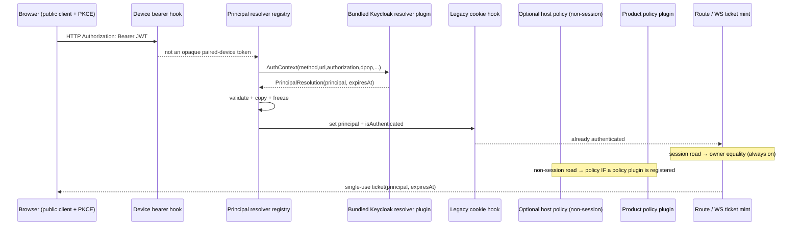
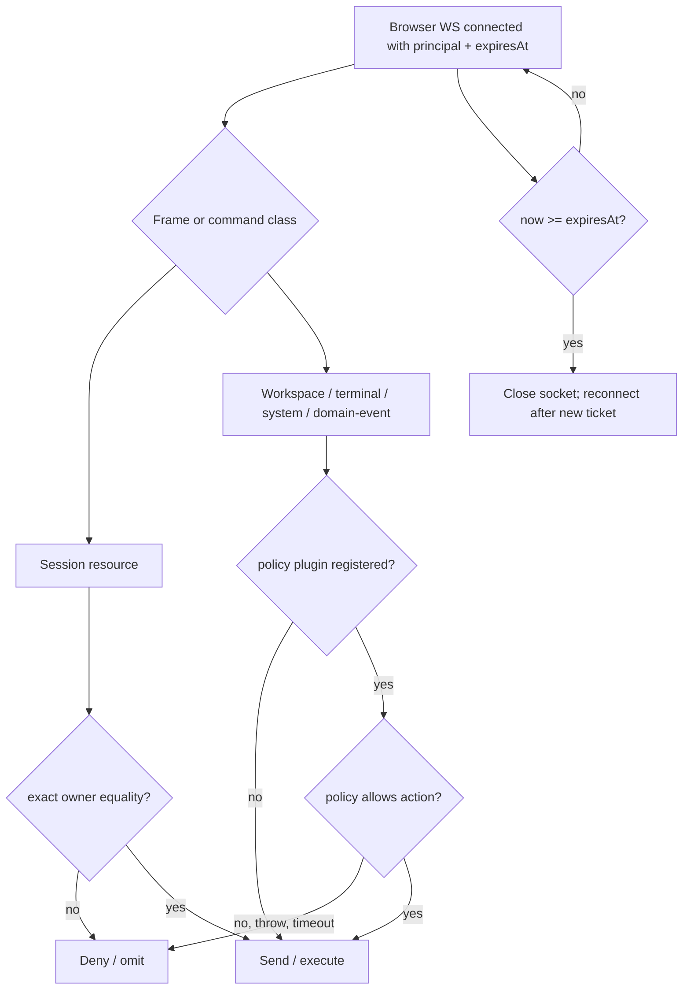

## Context

Current request order is significant. `registerBearerAuth` installs the opaque paired-device hook first. `registerAuthPlugin` then installs the legacy confidential-login cookie hook, which returns 401/redirect when neither device nor cookie authentication succeeds. Plugin server entries load later but before `listen()`. Therefore a principal hook placed "after the auth chain" cannot authenticate a Topology-B Keycloak bearer: the cookie hook has already replied.

The browser gateway also has multiple authorization roads, not only subscription and domain-event broadcast. It sends OpenSpec, branch, terminal, and complete session snapshots during connection bootstrap; then accepts list/read/mutation commands carrying client-supplied ids. A complete owner boundary must cover bootstrap, lists, detail/replay, mutations, and asynchronous fan-out.

Per the initiative (`add-authentication-and-roles`, AUTH-FLOW §9), the layering is fixed: **core owns the seam** (hook, `(iss, sub)` shape, fail-closed default, ordering) and knows nothing of Keycloak; **the Keycloak validator is a bundled dashboard plugin**, replaceable by an override plugin; **product authorization lives in the product plugin**. This change also adds the **browser client plane** (public OIDC client, PKCE, bearer, ticket) because topology B is unreachable by the shipped cookie-based client without it.

There is **no mode flag**. The plane activates on the resolver plugin being **enabled and configured** (`issuer`+`audience`); otherwise it is inert and behavior is byte-for-byte today's.

## Goals / Non-Goals

**Goals**
- Authenticate Topology-B Keycloak bearer requests before the legacy cookie hook can reject them.
- Carry exact `(iss, sub)` plus credential expiry through HTTP, ticket, and WebSocket lifecycles.
- Scope every host-owned session read/write road to its owner whenever the resolver is active.
- Ship the browser client plane (PKCE + bearer + ticket + heartbeat) so topology B works end to end.
- Preserve all current behavior while the resolver is inert (disabled or unconfigured).
- Keep product authorization in the product plugin; keep the host policy optional and non-session-only.
- Hardcode no Keycloak realm/host/client/audience/key value; ship the validator as a bundled plugin, not core.

**Non-goals**
- Product roles, approver routing, or domain authorization data.
- Migration/adoption of ownerless historical sessions and the legacy `auth.providers` cut-over.
- Token revocation introspection beyond JWT expiry. An already-accepted socket is bounded by its token `exp`.
- RP-initiated logout / server session destruction (browser owns LEG 4 under topology B).
- Canonical product store key `(cwd, invoiceId, principal)` (initiative items 28/29) — product-plugin-owned.
- Cross-instance DPoP `jti` replay defense (single-instance today).

## Architecture





## Decisions

### D1 — Activation is by resolver state, not a mode flag

> **Narrowed by D21:** "active" (enforced) additionally requires a registered login provider and no `auth.providers` conflict; half-configured ⇒ inert.

There is no `identity.mode`. The plane has exactly two observable states, derived from the bundled resolver plugin:

- **Inert** — the resolver plugin is disabled, or enabled but missing `issuer`/`audience`. The dispatch hook makes no claim, `request.principal` stays `null`, no ticket-identity requirement applies, owner equality is not consulted (no session has an owner), and fan-out is the legacy global broadcast. Behavior is byte-for-byte what it was before this change. This is "no auth otherwise."
- **Active** — the resolver plugin is enabled and configured. Bearer tokens resolve; session roads become owner-gated; browser upgrades require an identity-bearing ticket; the optional policy (if registered) gates non-session roads.

"Default-inert" is achieved by *the resolver being unconfigured*, not a config enum. "Present out of the box" is achieved by the plugin shipping bundled and default-enabled. The two are independent: default-enabled + unconfigured = inert.

### D2 — Resolver dispatch runs inside the authentication OR-chain

Register the core resolver-dispatch hook after `registerBearerAuth` and before `registerAuthPlugin`, at a fixed position, reading a mutable registry so plugin load order is irrelevant.

- Paired-device bearer succeeds first and remains a device with no human principal.
- Keycloak bearer is resolved next. Success sets `request.principal`, `request.principalExpiresAt`, `request.isAuthenticated = true`, and `authVia = "principal"`; the later cookie hook observes authenticated state and returns.
- `ResolverReject` returns 401 immediately.
- `null` allows the next resolver, then the legacy cookie branch.

While inert the hook returns immediately (no registered+configured resolver), so a cookie/device boolean path is exactly as today. When active, a protected session road with a device/cookie boolean but no principal is refused by owner equality.

### D3 — Resolver outcome includes credential lifetime

```ts
type Principal = Readonly<{ iss: string; sub: string; email?: string }>;
type PrincipalResolution = Readonly<{ principal: Principal; expiresAt: number }>;
type ResolverOutcome = PrincipalResolution | ResolverReject | null;
```

`expiresAt` is Unix epoch milliseconds copied from the verified access-token `exp`. Core validates finite future expiry, non-empty strings, plain data properties, and maximum lengths; then copies and freezes the value. Resolver-owned mutable objects/getters never enter request/ticket/socket state.

**Clock skew vs the future-expiry check are separate concerns.** Skew (D7) is applied only inside the resolver's *validity decision* — it forgives an `exp` a few seconds before `now`. The `expiresAt` returned is still the raw `exp`. Core's "reject non-future `expiresAt`" guard is a coarse sanity floor against a resolver returning a dead/malformed lifetime; it uses the same configured skew as its floor so the two rules cannot disagree at the boundary.

### D4 — Trust is a host-owned grant; priority is ordering only; the default is overridable

Self-declared `manifest.priority` is not a trust boundary. Resolver registration is permitted only for:

1. the bundled Keycloak resolver plugin (`keycloak-resolver`), or
2. a plugin explicitly named in operator-controlled `identity.trustedResolverPlugins`.

Resolver ordering uses `(manifest.priority ASC, pluginId ASC)`; plugin id is the cross-boot deterministic tie-break. Duplicate registration from one plugin fails.

**Override rule.** The bundled default is displaced by disabling it (`plugins.keycloak-resolver.enabled: false`) and trusting a replacement via `identity.trustedResolverPlugins`. Disable + trust is the repo-idiomatic swap: it avoids a silent fall-through where a declined override lets the default claim a token the operator meant it not to. A chain of multiple *coexisting* trusted resolvers is permitted (priority-ordered, first-claim-wins) but is not how the default is replaced.

Access-policy registration (D9) is permitted only for the single plugin named by `identity.trustedPolicyPlugin`, and is optional.

### D5 — Three-valued resolution, bounded failure

- `null`: credential is not owned; continue.
- `PrincipalResolution`: credential valid; stop and authenticate.
- `ResolverReject`: credential is owned but invalid; stop and return 401.

**The throw→null rule is core's outermost safety net, not the resolver's error policy.** A resolver that owns a credential MUST catch its own validation failures and return `reject` explicitly — a bad signature, failed JWKS lookup on an owned token, expired `exp`, or bad DPoP proof is an *owned-invalid* outcome (`reject`), never an uncaught throw. Core's catch→`null` boundary exists only for an *unexpected* fault (a bug, OOM, timeout); it must not be the path a normal invalid token travels, or an owned-invalid token would fall through to a lower resolver or the cookie hook. The Keycloak resolver (D7) wraps all crypto/JWKS/DPoP calls and converts any owned-token failure to `reject`. Timeout defaults to 2,000 ms, configurable 100–5,000 ms.

### D6 — Curated, DPoP-ready context

Resolvers receive only `{ method, url, authorization?, cookie?, dpop?, isAuthenticated, ip }`. `method`, canonical external URL, and `dpop` permit RFC 9449 proof validation. Raw Fastify request/reply objects are not exposed.

**D6a — Canonical `url` for `htu` matching.** The `url` is the externally-visible request URL the browser signed into the DPoP proof, reconstructed as `scheme://host[:port]/path` with query string and fragment stripped (RFC 9449 compares `htu` without them). Scheme and host derive from the configured public base URL / trusted proxy headers, NOT the raw socket, so a proxied request reconstructs the same `htu` the browser used. If proxy trust is not configured, `htu` matching uses the dashboard's own bind address; a mismatch rejects rather than guesses.

**Replay window (`jti`).** The `jti` replay cache is an in-process bounded LRU keyed by `jti` with TTL = the proof freshness window; it defends a single dashboard instance. Cross-instance/replica replay defense is out of scope (the dashboard is single-instance today).

### D7 — Bundled Keycloak resolver plugin owns only configured issuer tokens

Ships as `packages/keycloak-resolver-plugin` (manifest id `keycloak-resolver`), default-enabled, listed in `BUNDLED_PLUGINS` (pinned by `bundled-plugins-complete.test.ts`). **Core imports nothing Keycloak-specific**; its only awareness is that a trusted resolver is registered.

Required settings (via `getPluginConfig()`): `issuer`, `audience`. Optional: `authorizedParty`, `jwksUri`, `clockSkewSeconds` (default 30), `networkTimeoutMs` (default 2,000), `allowInsecureHttp` (default false). **No client id/secret setting exists:** a resource server does not authenticate to Keycloak; the only client-identity check is `aud` (required) plus optional `azp`. When `issuer`/`audience` are absent the plugin registers but resolves every request to `null` — the inert state (D1).

- Opaque/non-JWT bearer → `null`.
- Parsed JWT whose unverified `iss` differs from configured issuer → `null`.
- JWT claiming the configured issuer → owned; verify RS256, signature, exact `iss`, required `aud`, optional required `azp`, `exp`, and `sub`. Failure → `ResolverReject`.
- If `cnf.jkt` exists, validate the DPoP proof (RFC 9449): proof JWS verifies under its embedded `jwk`; SHA-256 thumbprint of that `jwk` equals `cnf.jkt`; `htm` equals the method; `htu` equals the canonical URL (D6a); `ath` equals base64url SHA-256 of the presented access token; `iat` is fresh; `jti` is unreused. Any missing/mismatched element rejects. **A token without `cnf.jkt` validates as a plain bearer** — DPoP is conditional, so a demo realm that issues unbound tokens works unchanged.
- Include `email` only when it is a string and `email_verified === true`.

Discovery/JWKS obey the network timeout; the cache coalesces concurrent refreshes and does at most one refresh per unknown `kid` per in-flight generation. No stale key validates after cache expiry unless response metadata permits. `http:` issuer/JWKS URLs require explicit `allowInsecureHttp: true`.

### D8 — An active resolver excludes confidential login connectors

> **Amended by D21:** the exclusion now DISARMS identity (plane stays inert, warning logged) instead of aborting startup.

The existing `auth.providers.*` path is a confidential login connector that exchanges a code and mints a dashboard cookie; it is not a resource-server bearer validator. When the resolver is active, a non-empty `auth.providers` is a startup configuration error — this avoids two principal sources, a principal-less cookie bypass, and issuer drift. While the resolver is inert the connector is unaffected.

### D9 — One OPTIONAL policy contract covers non-session host roads

The trusted product plugin MAY register exactly one async policy:

```ts
authorize(input: { principal: Principal; action: HostAction; resource: HostResource }): Promise<boolean>
```

**Scope.** This is a host *resource-dispatch* gate, not the product authorization model. It governs only **non-session** host-owned roads: domain-event fan-out, workspace/OpenSpec/branch/terminal/system bootstrap and commands, and disclosure of non-session bootstrap state. **Session roads are governed by owner equality (D11), never by this policy.**

**Optional.** When no policy plugin is registered, non-session roads stay ungated — exactly today's behavior. The resolver never implies a policy; the policy never authenticates. This decouples "topology B on" from "host authorization on": a deployment can have principals + owner-scoped sessions with no policy plugin at all.

Host actions are stable constants grouped by resource; resource descriptors are bounded plain data. Policy timeout defaults to 500 ms (50–2,000 ms). A registered policy that returns false/throws/times out/returns non-boolean denies that road and emits a structured audit event. At most one policy is allowed; a second registrant fails.

Product authorization (approver routing, atomic authorize+mutate, actor stamping) lives in the product plugin, evaluated live against the resolved principal — not here.

### D10 — Session-road classification is exhaustive; non-session gating is opt-in

Every host road that touches a **session** is classified so owner equality is applied uniformly: HTTP detail/transcript/mutation, WS bootstrap session snapshot, list/pagination, subscribe, replay/backfill, and every inbound session command. Coverage is asserted by test so a new session road without owner-equality fails.

Non-session host roads (workspace/OpenSpec/branch/terminal/system, domain events) carry a `{ action, resource }` classification consumed by the optional policy (D9). When no policy is registered they are ungated (today's behavior); when one is registered, an unclassified non-session road that reaches the policy path denies fail-closed. There is no catch-all "deny every unclassified `/api` route" — that only existed to serve the removed all-or-nothing mode.

### D11 — Session owner is persisted and assigned only through trusted roads

Add `principalOwner?: { iss: string; sub: string }` to `SessionMeta` and `DashboardSession`. Equality is `a.iss === b.iss && a.sub === b.sub`; no normalization, email fallback, or object identity.

- Browser `spawn_session` stamps the socket principal.
- Host HTTP spawn stamps the request principal.
- A trusted policy plugin may pass the current request principal through an owned-spawn API; untrusted plugins cannot set an owner field.
- **Correlation timing:** the owner is filed against the spawn correlation id (following the `pending-plugin-ref-registry` precedent) **before** the spawn is awaited, so an event that arrives before the spawn resolves is still attributable. `cwd` is never used as an ownership signal.
- Scheduler/automation/inert-era sessions have no owner.

Every session read/write path requires exact owner equality when the resolver is active. Ownerless sessions are invisible and immutable to human principals. Adoption/backfill is an explicit future/operator operation.

### D12 — Ticket is the HTTP→WS identity bridge

When the resolver is active, browser scope upgrades require a ticket minted by a principal-bearing HTTP request. The ticket contains route scope, principal, and `expiresAt`; single-use and short-lived. Cookie, local-token, trusted-network, and no-ticket browser upgrades cannot bypass this. Device/pairing and non-browser WS scopes retain their separate rules.

The socket receives immutable `ws.principal` and `ws.principalExpiresAt`. A timer closes it at expiry. Re-authentication means fetching a new access token, minting a new ticket, and reconnecting. JWT revocation before `exp` is not claimed.

### D13 — Heartbeat is transport liveness only

Browser heartbeat defaults to 30 seconds; two unanswered probes close the socket (60-second bound) and release subscriptions. It detects half-open connections only; it does not extend, revalidate, or revoke the principal, and is not coupled to any one session.

### D14 — Authorization applies to bootstrap, commands, replay, and fan-out; one road per frame

- Session bootstrap/list/page/detail/subscription/replay/mutations: exact owner equality (no policy).
- OpenSpec/workspace/branch/terminal/system bootstrap and commands, and domain events: the optional policy when registered, else ungated.
- **A frame is classified as exactly one road.** A session-scoped frame (owner-gated subscription) and a global domain event (policy-gated fan-out) are disjoint, decided at emit by the frame's own type. A frame carrying a `sessionId` travels the owner road; a frame emitted to the global domain-event road carries a `resource` and travels the policy road. A new frame type must declare its road; an undeclared frame type is treated as a domain event on the policy road (ungated when no policy, fail-closed when a policy is present), never as an owner-scoped session frame.

While inert, the legacy global `broadcast()` is retained unchanged.

### D15 — Browser client plane (topology B)

The shipped web client is built for topology A (`redirectToLogin()` → `/auth/login`; ws-ticket minted only for a paired-device bearer). Topology B needs the client to:

- Run Authorization Code + PKCE against Keycloak (public client, no secret), holding the access token in memory (not localStorage, to limit XSS token theft).
- Attach `Authorization: Bearer <access-token>` to same-origin `/api`/`/v1` requests via the existing `installDeviceAuthFetch` seam, distinct from the device bearer, never overriding an explicit header.
- Mint a browser-scope ws-ticket carrying the bearer and present only `?ticket=` on the socket (durable token never rides WS, F6).
- Answer the browser heartbeat (D13); on 401 or `principalExpiresAt`, silently re-acquire a token and reconnect.
- **Conditional DPoP:** if the token endpoint returns a `cnf.jkt`-bound token, generate a non-extractable WebCrypto keypair, bind it at the token request, and send a fresh proof per REST call and per ticket mint; if tokens are unbound, omit proofs. Downgrade is automatic and config-free.

All of this engages only when `/auth`/resolver signals the plane is active; against an inert dashboard the client behaves as today. This plane is a new capability `browser-principal-client`.

### D16 — Browser login gate: core triggers and routes, the trusted resolver plugin owns OIDC

> **SUPERSEDED as the deployment model by D20 (see the end of this file).** D16 describes a frontend
> where the *dashboard's own React client* is the browser and core mounts a trusted plugin's
> `login-provider` component inside it. D20 fixes the current deployment as an **independent
> frontend** (the user's own application) against a resource-server-only dashboard. D16 is kept as
> history and stays valid only as the **optional bundled dashboard-client adapter** — the component
> kind of the seam. Nothing in the D18/D19/D20 model depends on it. Read D20 first.

D15 built the client *primitives* (PKCE, token store, bearer/ticket wiring, DPoP) but deliberately left the human login UX as an integration seam. D16 closes it while keeping the split the resolver architecture already mandates (D7: "core imports nothing Keycloak-specific"; D4: trust is a host-owned grant, never a self-declared manifest field). The flow is decomposed across three parties so that removing the resolver plugin removes all OIDC code. This decision was hardened by a cross-model doubt-review; the sub-points below record the defects it fixed.

**Party split.**
- **Core — trigger + mount + routing only, never OIDC.** When the resolver is active and no live token exists (socket refused / `auth_required`), core stashes a validated return-to and mounts the *trusted* resolver plugin's `login-provider` component in start-phase. Core owns a **pre-token `/callback` route** (mounted like the existing `/pair` `PairLanding` route in `main.tsx`, before the authed shell, because the callback is what mints the token) that mounts the same component in callback-phase. After the component writes the token and reports success, core validates the return-to again and performs a **client-side** `navigate(returnTo, { replace: true })` (a full-page nav would discard the in-memory token). Core imports no discovery/PKCE/Keycloak module.
- **Trusted resolver plugin — all OIDC mechanics, component-only contract.** The plugin's client contribution claims `login-provider` with a single `component` (no function is carried through the manifest — the slot schema only transports a component name, matching every existing slot; H7). Core renders that component with `{ phase: "start" | "callback", returnTo }`. In `start` phase the component fetches `GET /api/identity/login-config`, OIDC-discovers the browser issuer, `buildAuthorizeRequest` (PKCE S256), persists verifier+state, and `window.location.assign(authorizeUrl)`. In `callback` phase it verifies `state`, `exchangeCode` → `setAccessToken` (the existing in-memory token-store seam), then calls the `onComplete(returnTo)` callback core passed as a prop.
- **Host server — pre-auth config source, sourced from the plugin, not from Keycloak keys.** `GET /api/identity/login-config` → `{ active, issuer?, clientId? }`. Core does NOT read `plugins["keycloak-resolver"].*` (that would hardcode the plugin id + Keycloak config keys into core, breaking I1/D7). Instead the resolver's **server** plugin registers a generic browser-login descriptor with the host at resolver-registration time — `ctx.registerBrowserLoginConfig({ issuer, clientId })` — and the endpoint relays whatever the single active trusted resolver registered, or `{ active:false }` when none did. `issuer` here is a **browser-reachable** discovery base (see below), `clientId` a dedicated public-client id (see below).

**Trust binding, not priority (B3).** The login provider redirects the browser to an external IdP and harvests the returned code — a trust boundary. Selection is therefore bound to the host trust grant: core honors a `login-provider` claim **only from a plugin listed in `identity.trustedResolverPlugins`** and currently active. Manifest priority never selects it (the proposal states priority is never a trust boundary). If several trusted resolvers are active (already discouraged), the same registration-order rule the resolver registry uses applies; if none is trusted+active, there is no gate.

**Dedicated browser config, not overloaded `authorizedParty` (H2/H3).** The resolver config gains two fields consumed only by the browser gate: `browserClientId` (the public PKCE client id advertised to the browser) and optional `browserIssuer` (a browser-reachable discovery/authorize base for tunneled/dockerized topologies where the JWT-validation `issuer` is an internal URL such as `keycloak:8080`; falls back to `issuer`). `authorizedParty` keeps its sole meaning — `azp` rejection in token validation — and is never reinterpreted as a client id. `active` requires `browserClientId`.

**Pre-App enable-filter (B5).** `setEnabledSet` runs inside App, but `/callback` and the start-phase gate render before the shell. The pre-App mount therefore consults the enabled-plugin set and the trusted-resolver list **itself** (the same config App later feeds `setEnabledSet`) before rendering the component — a disabled or untrusted plugin contributes no callback and no gate, preserving I2/I8.

**Network reachability (B1).** Pre-auth reachability requires BOTH the auth-plugin bypass AND the universal network guard: `/api/identity/login-config` is added to `PUBLIC_IN_NAMESPACE_PATHS` in `auth/localhost-guard.ts` (today only `/api/health`), otherwise a remote/tunnel browser — the exact login target — gets `403 network_not_allowed` before the route runs.

**Persistence + return-to safety (H1/H6/M1/F1).** Verifier, expected `state`, and return-to are persisted together in `sessionStorage` under one namespaced key before the redirect and cleared on callback; a full-page redirect survives this. `returnTo` is validated by **resolving it against the current origin** (`new URL(returnTo, location.origin)`) at stash time and again before `navigate`; it is accepted only when the resolved origin equals the current origin AND the resolved pathname is neither `/callback` nor `/auth/login` (rejecting scheme-relative `//host`, backslash `/\host`, absolute URLs, callback recursion, and re-entry into the dead legacy banner). Anything else defaults to `/`. If the stashed key is absent on callback (private-mode / cross-origin landing), the gate abandons the exchange and renders the manual sign-in affordance on `/` rather than erroring or auto-redirecting.

**Loop guard + lifecycle reconciliation (H4/F2/F3/F4).** Core runs the gate single-flight: at most one *automatic* redirect per page load, guarded by an in-progress flag. The gate ALSO always exposes a **manual sign-in affordance** (the reconciled `auth_required` control, see H5); single-flight bounds only the automatic redirect, so a user is never stranded — after an abandon or a failure they can click to restart (which resets the flag). Two 401 triggers are distinguished to resolve the D15 "silently re-acquire on 401" contract against this loop guard: (a) a *previously-valid* token that reached `principalExpiresAt` → one automatic gate redirect (the D15 re-acquire path; the redirect IS the re-acquire); (b) a *freshly-minted* token refused on first use in the same load (aud/`azp`/clock skew) → core calls `clearAccessToken()` (so the known-bad token never keeps riding the bearer fetch seam), surfaces an error, and does NOT auto-re-trigger. This prevents core→IdP→callback→token→refused→loop while keeping expiry recovery silent. D15's wording is scoped to case (a).

**Callback robustness (F5).** The `/callback` component handles the non-happy paths explicitly: an IdP error response (`?error=access_denied` etc., RFC 6749 §4.1.2.1) skips the exchange and renders a message + link to `/`; and if the callback arrives when no trusted+active `login-provider` is mounted (the plugin was disabled or the trust list edited mid-flight), core renders a safe fallback (message + link to `/`), never a blank route or crash.

**Owning-resolver match (F6).** When more than one trusted resolver is active, the server registration order (`registerBrowserLoginConfig`) and the client `PLUGIN_REGISTRY` order need not coincide, so the login-config response carries the **owning resolver `pluginId`** and core renders the `login-provider` component of exactly that plugin — never a different plugin's component against another's issuer/clientId.

**Token lifecycle tail (F7).** RP-initiated logout / IdP session destruction is already out of scope for this change (proposal "Out of scope", topology-B rationale). The host-side lifecycle is: socket closes at `principalExpiresAt` (D14); re-login is the gate's case (a) expiry path. No refresh-token rotation is added here.

**Legacy banner reconciliation (H5).** When the resolver is active and a trusted `login-provider` is present, the existing `auth_required` branch (`App.tsx`, the `/auth/login?return=` confidential-connector link) invokes the new gate instead of rendering the dead legacy link (D8 refuses `auth.providers` when the resolver is active, so that link cannot succeed).

**DPoP-bound browser login is a non-goal here (B4).** A full-page redirect tears down the in-memory non-extractable DPoP key, and `exchangeCode` intentionally drops `cnf`. The gate ships **plain-bearer only**; DPoP-bound realms via the browser redirect flow (which needs a persistent non-extractable key, e.g. an IndexedDB `CryptoKey`) are deferred to a follow-up. The D15 conditional-DPoP primitives remain for non-redirect callers.

**Inert semantics (M4).** "Inert" means **runtime behavior unchanged**: the `/callback` route only activates on `pathname === "/callback"`, and the `login-provider` slot value is accepted by the validator but unclaimed, so a normal load against an inert dashboard runs no new code path. It is not a byte-for-byte-identical build.

**Why a new slot, not an imperative registry.** The slot taxonomy is a frozen, spec-governed contract (`dashboard-shell-slots`); a declarative `login-provider` claim is discoverable pre-auth from the build-time `PLUGIN_REGISTRY` (so `main.tsx` finds the component before the shell mounts) and is enable/trust-filtered as above. This adds one slot id and one validator branch; `shell-overlay-route` is unsuitable because it renders *inside* the authed shell, whereas `/callback` must render pre-token.

### D17 — Remote insecure-context resilience (plain-HTTP tailnet/tunnel deployments)

Live Tailscale verification of D16 surfaced three client-side defects, all rooted in assumptions that hold only on `localhost`/HTTPS. Server layering needed no change (guard exemptions, login-config, CORS all verified correct).

- **PKCE must not hard-depend on a secure context (R1).** `crypto.subtle` is undefined on plain-HTTP non-loopback origins (the exact topology-B remote case: `http://<tailnet-ip>:<port>`), so `deriveCodeChallenge` threw and every remote plain-HTTP login died as an opaque "Sign-in failed". `pkce.ts` gains a vendored pure-JS SHA-256 (FIPS 180-4, test-vectored against WebCrypto) used ONLY when `crypto.subtle` is absent. Method stays `S256` — RFC 9700 still forbids `plain`; the digest input (verifier) is non-secret and the transport in this topology is already WireGuard-encrypted. `crypto.getRandomValues` is NOT polyfilled — it exists in insecure contexts and entropy must never be emulated.
- **Probe failure is not an outage verdict (R2).** `useWebSocket.onclose` probed `/auth/status` once past the failure threshold and mapped ANY probe rejection to hard `offline` — replacing the `AuthRequired` affordance with a dead-end "Server offline" strip while auth was the actual problem (observed live from a remote Mac racing a server restart). Classification becomes: probe success + `authenticated:false` → `auth_required` (always wins); probe rejection → stay `connecting` and re-probe on the existing backoff; only N consecutive probe rejections conclude `offline`. An auth problem must never present as an outage, because the outage surface hides the sign-in affordance.
- **Gate failures carry a typed reason (R3).** `beginLogin`/`completeLogin` map failures to `insecure-context` | `discovery-failed` | `exchange-failed` | `state-mismatch` | `idp-error`; `KeycloakLogin` renders the reason with retry + return-home. With R1 the `insecure-context` arm is normally unreachable — kept as belt-and-braces diagnostics (H-series: opaque errors are their own lockout).
- **Non-goals.** No HTTPS requirement (punishes the legitimate encrypted-tailnet deployment; `tailscale serve` HTTPS stays the documented hardening, R4). No PKCE `plain`. No auto-redirect-loop change (single-flight + banner default stand, D16/F4).

## Standards alignment

- RFC 9068: JWT access-token validation (`iss`, `aud`, `exp`, signature; `sub`).
- RFC 9700: OAuth 2.0 Security BCP; no decode-without-verify, exact issuer/audience checks.
- RFC 7636 / OAuth 2.1: public browser client with Authorization Code + PKCE; no browser-held client secret.
- RFC 9449: conditional DPoP proof validation when a token is sender-constrained.
- The resolver chain matches Spring Security `ProviderManager` semantics (not-owned vs invalid-owned); request principal exposure matches Spring `SecurityContext`, ASP.NET `HttpContext.User`, Passport `req.user`.
- Authorization remains outside authentication: the resolver establishes identity; owner checks and the optional policy govern actions/resources.

## Risks / Trade-offs

- **Session-road inventory:** owner-equality correctness requires classifying every session road. Mitigation: centralized road table + coverage test that fails on an unclassified session road.
- **Optional policy is security-critical when present:** explicit operator grant, exactly one policy, bounded calls, deny on failure, structured audit events. When absent, non-session roads are deliberately ungated (unchanged).
- **Hot-path network dependency:** Keycloak JWKS is cached/coalesced; resolver timeout bounded. Cold-start outage denies human access rather than accepting unverified tokens.
- **Client plane surface:** PKCE + bearer + ticket + DPoP touch every browser fetch/mint path. Mitigation: reuse the existing `installDeviceAuthFetch`/`mintWsTicket` seams; DPoP is conditional so the demo path stays plain-bearer.
- **Ownerless cut-over:** historical/automation sessions become unavailable to human users once active. Deliberate fail-closed; operationally planned.
- **Socket valid until token expiry:** no introspection/revocation loop. Keep access-token TTL short; socket closes at `exp`.

## Migration / Rollback

1. Ship with the resolver plugin default-enabled but unconfigured ⇒ inert ⇒ behavior unchanged.
2. Configure the resolver (`issuer`, `audience`, optional `authorizedParty`) from deployment settings. Pin issuer hostname/scheme/port before any `(iss, sub)` is persisted.
3. Add the public browser client to the Keycloak realm; deploy the client plane (D15).
4. Optionally install and trust a product access-policy plugin for non-session roads.
5. Verify real Keycloak discovery, token exchange, JWT validation, and two-user isolation in the docker E2E harness.
6. Ensure `auth.providers` is empty. The resolver becoming configured is the cut-over; restart.
7. Ownerless historical sessions remain hidden; respawn/adopt outside this change if needed.

Rollback: disable the resolver plugin (or clear its config) and restart ⇒ inert ⇒ unchanged. Additive owner metadata is harmless. No identity key is rewritten.

### Legacy-connector cut-over (deferred, not in this change)

An active resolver rejects a non-empty `auth.providers` (step 6), so a deployment relying on the confidential-client cookie login is a **breaking cut-over**, deferred to a later change. That change must cover: session continuity (cookie sessions carry no `(iss, sub)` → ownerless → hidden on cut-over; define adoption); identity join (cookie `sub` ≠ resource-server `sub`; confirm or remap); client reconfiguration (add the public PKCE client to the realm); and rollout shape (this change forbids the mixed state on purpose).

## Open Questions

None blocking. Product policy semantics, ownerless-session adoption, the product store key (items 28/29), and the legacy `auth.providers` cut-over are intentionally separate concerns; the host contracts, owner equality, the client plane, and fail-closed behavior are defined here.

### D18 — Three-way split: core seam, token-resolver plugin, and a separate authorization (login-UI) plugin

> **Read with D20.** D18 describes the *seam*; D20 fixes which kind the current deployment uses. The
> `login-provider` claim below belongs to a **separate authorization plugin or the optional bundled
> dashboard-client adapter**, never to `keycloak-resolver`; the current deployment uses the D19
> separate-view kind, which claims **no slot** and ships nothing into the client bundle.

Neither core NOR the keycloak-resolver plugin ships any login/logout UI. The
responsibility is split three ways:

1. **Core** — a seam only: the `login-provider` slot (phases
   `"start" | "callback" | "logout"`), the `/callback` + `/logout` routes, the
   `GET /api/identity/login-config` descriptor endpoint, trust-bound provider
   selection (D16), return-to validation, and the sign-in trigger on the
   `auth_required` banner. When no provider is active the banner states that no
   sign-in method is installed and routes nowhere. Core ships zero UI and never
   links the legacy server-rendered `/auth/login` page.
2. **keycloak-resolver-plugin** — a token RESOLVER only: validates incoming
   bearer tokens (RFC 9068 + conditional DPoP) and resolves them to a principal.
   It does NOTHING else by itself — it does not claim `login-provider`, ships no
   client bundle, and no longer publishes a browser-login descriptor
   (`registerBrowserLoginConfig`). Its config drops `browserClientId` /
   `browserIssuer` (browser OIDC config is the authz plugin's concern).
3. **A separate authorization plugin** (currently undefined, built by
   integrators) — claims `login-provider` and defines the actual login UI +
   logout UI. It drives the reusable OIDC mechanics that now live in
   `client-utils` (`identity/login-flow.ts`: `beginLogin` / `completeLogin` /
   `beginLogout`, plus `pkce` / `oidc-flow` / `token-store`).

Reusable mechanics (moved from the plugin to `client-utils`, seam-only delivery):
- `login-provider` slot phase union grows `"logout"`; core mounts
  `LoginGate phase="logout"` on `/logout`.
- `beginLogout()` implements RP-initiated logout (OIDC RP-Initiated Logout 1.0):
  clear the in-memory tokens FIRST, then redirect to `end_session_endpoint` with
  `client_id`, `post_logout_redirect_uri` (same-origin `/`), and `id_token_hint`
  when held. `completeLogin` retains `id_token` in the same in-memory store
  (never web storage — RFC 9700 posture unchanged) for that hint.
- Failure posture mirrors D17: typed reasons; local tokens cleared first, so a
  broken IdP can never keep a browser signed in locally.
- No login UI ships in-tree, so this change delivers the seam + mechanics +
  unit tests, not a live end-to-end login demo.
- The legacy `/auth/login` HTML page + cookie flow stay server-side for existing
  non-identity deployments (dead-ended from this client, not deleted — surgical
  scope; retirement is a separate change).

### D19 — Two provider kinds on the login seam: bundled component, or a separate view

> **Read with D20.** The separate-view kind is what the **current deployment** uses (an independent
> frontend served by a custom server plugin). The component kind is the **optional bundled
> dashboard-client adapter** only.

Core's browser-login seam accepts TWO provider kinds, discriminated by which
fields the trusted plugin publishes:

- **COMPONENT provider (D16)** — `{ issuer, clientId }`: core mounts the
  plugin's bundled `login-provider` React contribution from the build-time
  `PLUGIN_REGISTRY`.
- **SEPARATE-VIEW provider (D19)** — `{ loginUrl, logoutUrl }`: core
  **redirects** the browser to the plugin's OWN page. The plugin serves that
  page itself (typically a route on the shared `ctx.fastify` instance, outside
  the guard jurisdiction `/api/ /v1/ /editor/ /live/` so it is reachable
  pre-auth). It ships nothing into the client bundle and claims no slot.

**Why this kind exists.** `selectClientRegistryPlugins` bundles only plugins
under `<repo>/packages` (`client-registry-set.ts:86`), so a DROP-IN plugin in
`<state-dir>/plugins/` can never contribute React. The separate-view kind is
what makes a third-party authorization plugin possible with NO dashboard
rebuild: its server entry is loaded at runtime (`loader.ts:335`
`loadServerEntries` scans `~/.pi/dashboard/plugins/`), it registers its views,
and it publishes the URLs core redirects to.

**Trust + validation.** Both kinds pass the same `registerBrowserLoginConfig`
gate (`resolverRegistry.isTrusted(pluginId)` — the bundled id or
`identity.trustedResolverPlugins`). The host SANITIZES the descriptor
(`sanitizeBrowserLoginConfig`): same-origin paths only, core's own gate routes
refused, unknown fields dropped, and at least one usable kind required.

**Open-redirect boundary.** `loginUrl`/`logoutUrl` are attacker-influenceable
redirect targets, so they are validated on BOTH sides — `providerRedirect`
(client) and `sanitizeBrowserLoginConfig` (server) enforce a same-origin path —
and `resolveGateRedirect` never falls back from `logoutUrl` to `loginUrl`
(signing out must not sign straight back in).

**Dispatch.** `/logout` → `logoutUrl`; the `auth_required` banner → a plain
LINK to `loginUrl` (works with no client JS at all); gate `start` → `loginUrl`;
a stray `/callback` recovers to `loginUrl` (a separate-view plugin owns its own
callback route).

**Non-goal — token handoff.** A separate-view provider performing a real OIDC
exchange must still get the resulting bearer into the frontend that consumes it. For the **current
deployment (D20)** that frontend is the user's own application and it holds the token **in its own
memory** — no handoff into the dashboard is required, and this change specifies none. The spike's
`#access_token=` fragment redirect carries an informal in-spike "D20 handoff" label; it is **not
established spec**, is not a dependency of D20, and core implements no fragment-adoption path.
Conversely, a separate-view provider serving the *dashboard's own* React client cannot write the
SPA's in-memory store (`client-utils/identity/token-store.ts`) from a server-rendered page; not
solved here.

### D20 — Current deployment: independent frontend; the dashboard is a resource server only

**Decision (explicit; the deployment this change targets now).** The browser frontend is the
**user's own application** — a custom frontend, not the dashboard's bundled React client. In this
deployment:

- **The dashboard is a backend OAuth resource server only.** It validates the bearer (the trusted
  `keycloak-resolver` plugin), resolves the principal, and enforces owner equality on session roads
  plus the optional non-session policy. It serves **no login UI** for this deployment and never
  drives the browser through a login flow.
- **A custom independent server plugin owns login, UI, callback, and logout.** The plugin is the
  operator's own package; the disposable `spike/identity-login-plane/` is the smoke of exactly this
  shape. It serves its own pages from its own `ctx.fastify` routes — **same-origin** with the
  dashboard and outside the network-guard jurisdiction (`/api/ /v1/ /editor/ /live/`), so they are
  reachable pre-auth — and performs the IdP authorize, code-exchange, and end-session calls itself
  (server-side PKCE state, so it works on plain-http origins).
- **The plugin publishes only redirect targets to the host** through the existing generic descriptor
  seam: `ctx.registerBrowserLoginConfig({ pluginId, loginUrl, logoutUrl })` — the D19 separate-view
  kind. Core's whole involvement is relaying that sanitized descriptor on the pre-auth
  `GET /api/identity/login-config` and redirecting `/logout` to `logoutUrl`. Core reads no plugin
  config key and holds no IdP state.
- **The user's application holds its own access token in memory** and presents
  `Authorization: Bearer` on dashboard `/api`/`/v1` calls and mints a browser-scope WS ticket. The
  dashboard never serves, proxies, or drives that frontend; its only contract with it is the
  bearer + ticket the resource server already requires.

**Trust is the current allowlist, never the descriptor.** The host honors a descriptor only from the
bundled resolver id or a plugin named in the **current** `identity.trustedResolverPlugins` allowlist,
and only while that resolver is active. The descriptor carries its owning `pluginId`, so core never
mixes one plugin's redirect target with another's config. `loginUrl`/`logoutUrl` are sanitized to
same-origin paths on the server (D19, `sanitizeBrowserLoginConfig`), and a logout target never falls
back to the login target.

**What this supersedes.** D16 remains in this file as history, but its **deployment model** — core
mounts a trusted resolver plugin's `login-provider` React component inside the dashboard client, owns
`/callback`, restores return-to, and reconciles the legacy `auth_required` banner — is **superseded as
the current deployment**. That component path is retained strictly as an **optional bundled
dashboard-client adapter** for a deployment whose frontend *is* the dashboard client. It is not
required, is not this deployment, and nothing in the independent-frontend model depends on it — in
particular the dashboard `auth_required` banner is **not** the entry point for an independent
frontend. D18 (three-way split: core = seam only, `keycloak-resolver` = token validation only) and
D19 (two provider kinds) stand unchanged; the separate-view kind is what an independent frontend
uses.

**Seams retained (do not delete).** The reusable identity seam (principal types, resolution hook,
owner equality), the optional host access-policy seam, the plugin browser-login-config descriptor
seam + `GET /api/identity/login-config`, the in-memory token store + bearer/ticket client seams, and
the WS ticket↔principal binding all stay as the host's public contract. The optional bundled adapter
(the D16 component kind, `LoginGate`, and the `/callback` mount) stays in-tree, unrequired.

**Non-goals (explicit).** No BFF, no reverse proxy, no global/session cookies, no new production
IdP, no cross-origin trust. The dashboard does not adopt, exchange, refresh, or store the user's
tokens, and holds no server-side session for a human principal.

**Token handoff is not a dependency.** This model does **not** require core to adopt a token from a
URL fragment at boot. The `#access_token=…` fragment convention in `spike/identity-login-plane/`
carries an informal in-spike "D20 handoff" label; that label is **not established spec** — no design
decision, task, or requirement depends on it, and no core fragment-handoff capability is specified.
The smoke keeps the token in its own page's memory and never hands it to the dashboard client.

**Smoke (disposable).** `spike/identity-login-plane/` is a same-origin, plugin-served page that signs
in against **real Keycloak**, holds the resulting token in the smoke page's **own memory**, then calls
the dashboard API with `Authorization: Bearer` and mints/uses a WS ticket + message. It **never
navigates the dashboard React UI**. It is disposable; nothing ships.

### D21 — Self-lockout guard: enforcement arms only with a resolver AND a login provider

**Problem (observed live, 2026-09-23).** With `keycloak-resolver` enabled + configured and **no**
login provider registered, the plane went active: §9.2 refused every principal-less browser upgrade —
**localhost included** — and no human could obtain a token. The dashboard UI rendered "Server offline"
on every host; the only escape was editing `config.json` from a shell. Enabling one plugin bricked
the UI.

**Rejected fix — re-admit loopback on the WS.** Loopback is not a trust signal. `isGenuinelyLocal`
= loopback peer + no `X-Forwarded-*`/`Forwarded`/`X-Real-IP`; that holds only while every proxy in
front adds those headers. A same-host sidecar (Envoy/Istio, nginx), an L4 LB / HAProxy `mode tcp`,
`kubectl port-forward`, `ssh -L`, or `socat` all arrive as `127.0.0.1` with no forwarding header —
every remote user would look local. Rejected for split / load-balanced topologies.

**Decision.** Identity is **enforced** ⇔ a trusted resolver is active **AND** a trusted plugin has
registered a browser login descriptor (`BrowserLoginConfigRegistry.get() !== null`). One predicate,
`isIdentityEnforced({ resolverActive, loginProviderRegistered })` (`identity/activation.ts`), feeds
every enforcement road through one server-side closure (`identityEnforced` in `server.ts`):

- the resolver dispatch hook (`registerResolverHook` `isEnforced` dep);
- the §9.2 browser-upgrade identity-ticket requirement;
- the gateway `isResolverActive` (owner gating, §8.2 per-item list filter, §8.3 choke point, fan-out);
- the handler-context `isResolverActive`;
- the D8 connector conflict (`auth.providers`) — an input to the predicate, never a boot abort
  (see amendments).

**Half-configured ⇒ INERT, never locked.** Resolver active without a login provider ⇒ the plane is
inert: byte-for-byte pre-change behavior (D1) — genuine localhost uses the UI, remote access follows
the legacy network guard / trusted networks / pairing. Nothing new is admitted, so the LB concern
above does not re-open. The server logs once, before `listen()`
(`identityDisarmedWarning`):
`[identity] a principal resolver is configured but NO login provider is registered — identity is NOT
enforced …`.

**Terminology.** Throughout these specs "the resolver is active" / "while the resolver is active"
now reads as **"identity is enforced"** (resolver active AND login provider registered). "Inert" =
not enforced. D1's derivation is narrowed, not replaced: no mode flag is added.

**Amendments from doubt-review (cycle 1).**
- **Failed activation releases identity registrations.** The plugin loader tears down only a failed
  plugin's WS routes. `IdentityRegistrationTracker` (`identity/identity-registration-tracker.ts`)
  records each resolver / descriptor unregister handle per plugin; after `loadServerEntries`,
  `releaseFailedIdentityRegistrations` disposes those of every plugin whose status is not `loaded`
  and logs it. A login plugin that registers its descriptor and then throws cannot arm enforcement.
- **D8 disarms instead of aborting.** `auth.providers` non-empty + active resolver no longer throws
  `IdentityStartupError`; it is a third input to `isIdentityEnforced` (`authProviderCount === 0`).
  A boot abort is itself a lockout, and adding a login plugin later must never make a booting
  config unbootable. The connectors keep their pre-change behavior; the warning names the conflict.
- **Every road, including the pre-auth ones, reads the same predicate.** `/auth/status`
  (`descriptorActive: identityEnforced()`) and `GET /api/identity/login-config`
  (`publicLoginConfig(identityEnforced() ? desc : null)`) no longer read the descriptor alone. A
  descriptor with no active resolver advertises nothing and warns.
- **Loopback is not authentication on the enforced path.** `browserLoginAuthStatus` no longer
  reports a genuinely-local caller as authenticated while enforced — §9.2 refuses its principal-less
  socket, so reporting it authenticated made the client show "Server offline" instead of
  `auth_required`.
- **`isEnforced` is a required hook dependency** — no silent fallback to `hasActiveResolver()`.
- The warning is emitted before the readiness check, so it is visible even if readiness throws
  (named-but-absent `trustedPolicyPlugin`).

**Amendments from doubt-review (cycle 2).**
- **One predicate, all conditions.** `isIdentityEnforced(input)` now also takes D9 policy readiness
  (`trustedPolicyPlugin` + `registeredPolicyCount`). `assertIdentityReadiness` /
  `IdentityStartupError` are removed: **no identity misconfiguration aborts boot.** Named-but-absent
  or duplicate policy ⇒ inert + warning, like D8. All inputs are required fields (no opt-in default).
- **Decided once, latched.** `server.ts` computes enforcement in one pre-listen block — outside the
  loader `try`, so a loader throw cannot skip it — after `releaseFailedIdentityRegistrations`, and
  stores it in `identityArmed`; `identityEnforced()` returns the latch. A runtime descriptor/resolver
  unregister or a plugin toggle (already `restartRequired`) takes effect on restart; it can never flip
  owner gating off for connected sockets mid-process.
- **Policy registrations are tracked too** — a failed policy plugin's policy is released with its
  resolver/descriptor, so a dead plugin never governs non-session roads.
- **`/auth/status` is identity-aware whenever the legacy plugin did not register one.** The legacy
  cookie plugin registers `/auth/status` only when its providers resolve; then D8 keeps identity
  inert, so the cookie route is correct. Otherwise (no `auth` block, or an `auth` block with no
  resolved providers) core registers the identity-aware route. Enforced ⇒ only a resolved bearer
  **principal** is authenticated (not a device bearer, not loopback).

**Amendments from doubt-review (cycle 3 — final).**
- **D8 keys on what mounted, not on config keys.** `legacyConnectorsActive` =
  `fastify.hasRoute(GET /auth/status)` right after `registerAuthPlugin` (the legacy plugin registers
  its routes only when ≥1 provider resolves). An unresolvable `auth.providers` entry mounts nothing
  and no longer disarms a correctly configured plane (previously it would have left the dashboard
  with neither identity nor cookie auth).
- **Registrations freeze at arming.** `IdentityRegistrationTracker.freeze()` runs right after the
  latch: every handle a plugin holds becomes a logged no-op, and a registration attempted after
  startup is refused with a warning (`refuseLateIdentityRegistration`). The advertised descriptor,
  resolvers and policy therefore stay exactly the set enforcement was decided on — a runtime
  unregister can neither disarm nor strand an armed plane without a login target; a late async
  registration is visible in the log instead of silently ignored.
- **Known unwired road.** `identity/host-access.ts` (`gateHttpNonSession` / `deliverDomainEvent`)
  consults `PolicyRegistry.hasPolicy()` directly and has no production call site yet. When wired it
  MUST gate on `identityEnforced()` first (tasks §18), or a loaded policy on an inert plane would 403
  every principal-less non-session road.
- Warning text is `[identity] identity is NOT enforced — <reasons>. The dashboard stays in its
  pre-identity mode to prevent self-lockout; complete the identity setup to arm it.`

**Out of scope — verified pre-existing gap (not introduced by D21).** The §9.2 identity-ticket rule
covers the `browser` WS scope only. `terminal` / `live` upgrades keep the legacy allowances
(loopback, local token, trusted network, principal-less ticket), and terminal fan-out
(`terminal_added`) is not owner-filtered. Tracked in tasks §18 as a blocking security gap before any
multi-user isolation claim.

**Trade-offs.**
- **Posture when half-configured is the pre-identity posture, not a hardened one.** Relative to the
  previous (resolver-alone-arms) behavior, a half-configured dashboard now admits what the legacy
  guard admits — genuine localhost, trusted networks, paired devices, legacy cookie auth. That is
  intended: the previous posture was a total lockout, and an operator who has not finished setup has
  not asked for identity enforcement. The warning makes the state visible.
- A pure bearer-only deployment (no browser login at all) must still register a descriptor to arm
  enforcement. The descriptor seam is the operator's explicit "humans can sign in here" statement;
  the sanitizer keeps `loginUrl` a same-origin path, so an off-origin frontend registers a same-origin
  path that redirects onward.
- Not covered: a registered login provider whose IdP is **down or misconfigured** still arms
  enforcement; recovery is `config.json` / CLI from the host. A boot-time IdP reachability probe
  before arming is a possible follow-up, not in this change.
- The identity E2E harness (`PI_E2E_IDENTITY=1`) seeds only `keycloak-resolver`; it must also seed a
  trusted descriptor or it silently runs inert (tasks §18).
