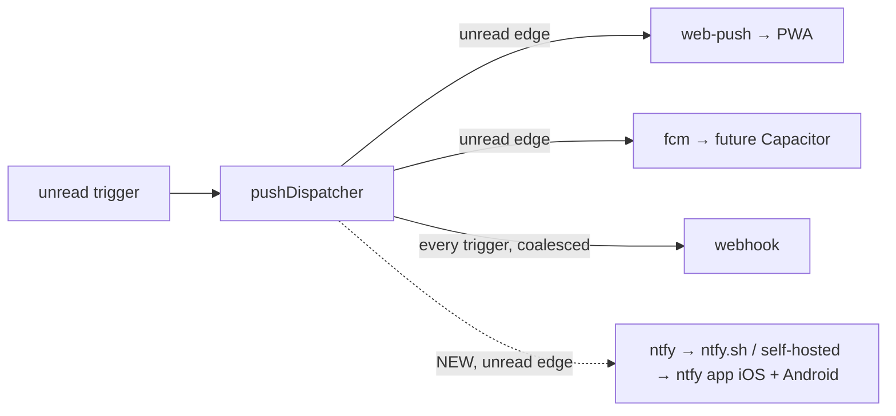

## Context

Base: `add-server-push-notifications` (design Decisions 1–12). Its pieces reused here:
- `PushTransport` interface in `push-transports/types.ts`; a new transport is one file plus a registry entry (spec: "Three transports behind one interface").
- Hybrid cadence (Decision 10): device tokens on the unread edge, webhooks on every trigger with coalescing.
- Webhook hardening (Decision 9): resolved-IP address policy, pinned `undici` `Agent`, no redirects, 5 s timeout, redacted logging, opaque `/api/push/test`.
- `0600` token file (Decision 11); route tiers and MCP denylist (Decision 12).
- Opt-in (Decision 6): disabled → no dispatcher, no VAPID keys, no outbound call, routes answer `404`.

What is missing for the user's goal ("push to both our phones, configured from Settings"):

## Goals / Non-Goals

**Goals**
- iOS and Android phones receive readable notifications (title, body, urgency, tap-to-open) with no app of our own and no third-party account.
- Everything is configurable from Settings, including turning push on; no `config.json` edit, no restart.
- Zero new routes, dependencies, or trigger logic. The ntfy transport is one file; the rest is small edits to existing base-change modules.

**Non-Goals**
- Running an ntfy server. Managing ntfy accounts or tokens on the ntfy side.
- Changing base cadence, coalescing, SSRF policy, or payload fields other than adding `absoluteUrl`.

## Decisions

### Decision 1: ntfy is a first-class transport, not a webhook preset

ntfy's JSON publish format (`POST <root>/` with `{topic, message, title, priority, tags, click}`) differs from `PushPayload`. The generic webhook would show raw JSON on the phone. A dedicated adapter is ~60 LOC and gives mapped fields plus Settings onboarding.

Publishing uses the **root URL + JSON body**, not `POST /<topic>` with `Title:` headers. Session names can be non-ASCII, and HTTP header values cannot safely carry them.

Body mapping:

| ntfy field | Source |
|---|---|
| `topic` | path segment of `deviceToken` |
| `title` | `payload.title` |
| `message` | `payload.body`, or `payload.title` when `body` is empty (ntfy requires a message) |
| `priority` | `4` for `trigger` `input` / `crash`; `3` for `turn_end` |
| `tags` | `["question"]` input, `["rotating_light"]` crash, `["white_check_mark"]` turn_end (ntfy renders emoji shortcodes) |
| `click` | `payload.absoluteUrl`; field omitted when absent |

**Rejected**: a "format: ntfy" flag on the webhook transport. It mixes two validation rules and two display rules into one transport, and hides ntfy's `authToken` in the URL query (`?auth=`), which the webhook redaction handles but the user can't manage separately.

### Decision 2: ntfy follows the device cadence

An ntfy topic is a human's phone. Webhook cadence (every trigger, coalesced) exists for headless consumers that never view a session; applying it to a phone re-buzzes a person who chose not to look. `ntfy` joins `web-push` / `fcm` in the unread-edge set. No coalescing entry is kept for ntfy tokens.

### Decision 3: Token shape, validation, redaction

- `deviceToken` = `<scheme>://<host>[:port]/<topic>`. Validated with `new URL()`: scheme `http:` / `https:`; no userinfo; no query or fragment; pathname exactly `/<topic>` with `<topic>` matching `^[-_A-Za-z0-9]{1,64}$` (ntfy's topic rule).
- Optional `authToken`: string, 1–256 chars, printable ASCII (header-safe). Accepted only when `transport === "ntfy"`; otherwise `400`.
- Registry record gains `authToken?`. Persisted only in `push-tokens.json` (`0600`). Never in a response, a log line, or `/api/push/test` results.
- Idempotency key stays `deviceToken`. Re-registering the same topic URL with a new `authToken` replaces the token's `authToken` and keeps its `tokenId`.
- `display` = `"<label> (<origin>/<topic[0..4]>…)"` or `"<origin>/<topic[0..4]>…"` without a label. A 4-char prefix of a 27-char generated topic reveals ~24 of 144 bits, enough to tell two phones apart and not enough to guess.

### Decision 4: Reuse the webhook address policy unchanged

A self-hosted ntfy on the LAN or the same box is a primary use case, so loopback and private addresses are allowed. Link-local, metadata, and the dashboard's own port on a local address are refused, at registration and at every delivery, on every resolved address, with the connection pinned to the vetted address. Implementation extracts the existing webhook vetting and pinned-agent code into a shared helper if it is not already one. The policy is not forked.

Outcome mapping: `2xx` → `{ok: true}`. Everything else (`401`, `403`, `404`, `429`, `5xx`, refused address, network error, timeout) → `{ok: false}`, logged with status or error code, token kept, `consecutiveFailures` incremented, no retry. ntfy has no topic-gone signal: a `404` means a wrong server or path. So ntfy tokens are never auto-pruned; the user removes them in Settings.

### Decision 5: `absoluteUrl` in the payload

A phone cannot resolve `/session/<id>`. `buildPushPayload` gains an input `baseUrl?: string` and emits `absoluteUrl = baseUrl.replace(/\/+$/, "") + "/session/" + encodeURIComponent(sessionId)` when set. The dispatcher computes `baseUrl` per fan-out:
1. first entry of `resolvePublicBaseUrls(config)`;
2. else the live tunnel URL (`getTunnelUrl()`);
3. else undefined.

It stays a pure helper (the base URL is an argument). Web Push keeps `url`, because the service worker resolves it against its own origin. Webhooks receive the added field; additive, so existing receivers are unaffected.

### Decision 6: `push.enabled` is live

The base change reads `push.enabled` only at boot. A Settings switch that needs a restart is a poor switch, and `/api/restart` from Settings is heavy.

- `PUT /api/config` (in `system-routes.ts`): when `partial.push !== undefined`, copy `reloaded.push` into the running config. This follows the existing `completedFirst` / `openspec` live-apply pattern in that handler.
- `server.ts` always constructs the dispatcher and passes it to `wireEvents`. Construction does no I/O and touches no files.
- `fanout`, the route handlers, and VAPID initialisation read `enabled` from live config on each call.

Invariants kept from base Decision 6, now evaluated per call instead of at boot:
- disabled → every `/api/push/*` handler answers `404` (after auth, so unauthenticated callers still get `401`);
- disabled → `fanout` returns before any transport call;
- no VAPID key file until push is enabled and `GET /api/push/vapid-public-key` is first served. Enabling alone creates no file.

Disabling keeps registered tokens; re-enabling resumes delivery to them. The coalescing map and the in-memory `consecutiveFailures` survive a toggle; they are not persisted state.

The Settings switch uses the existing `PUT /api/config`, already `operate`-tiered and auth-gated, so no new route or tier.

**Rejected**: keep routes live while disabled so targets can be added first. Simpler for onboarding, but it weakens a reviewed base invariant (probing / no side effects while off). Enable-then-add is an acceptable flow.

### Decision 7: Topic generated client-side

The "Add phone" dialog generates `pi-` + 24 base64url chars from `crypto.getRandomValues(new Uint8Array(18))` (144 bits). `getRandomValues` works in insecure contexts; `randomUUID` does not, and plain-http LAN dashboards are common here. A server endpoint would add a route, a tier row and a denylist row for no security gain: the server still validates the topic on register.

### Decision 8: Phone onboarding UX

- **Android**: QR code of `ntfy://<host>/<topic>?display=Pi%20Dashboard` (plus `&secure=false` for `http:` servers), which is ntfy's documented deep-link format. Scanning it subscribes in one tap. Rendered with the existing `qrcode` dependency, as in `Gateway/GatewayPairQR.tsx`.
- **iOS**: the ntfy iOS app has no subscribe deep link. The dialog shows copy buttons for server URL and topic and three steps (open ntfy → + → paste topic; for a non-`ntfy.sh` server, choose "Use another server").
- After registering, the client calls `POST /api/push/test` for the new `tokenId` and shows ok / failed inline, so the user knows the phone is wired before leaving Settings.
- Hints (text only, not enforced):
  - Android Google-Play build + `ntfy.sh`: delivery goes through FCM and can lag; enable "instant delivery" on the subscription. F-Droid build: always instant.
  - Non-`ntfy.sh` server + iPhone: instant delivery needs `upstream-base-url: "https://ntfy.sh"` on that ntfy server. It relays a content-free poll request through ntfy.sh's APNs; only Apple-signed apps can receive APNs, so there is no way around it.
  - Tap target: "Taps open `<base>`", or "No public URL — taps open the ntfy app only (set `publicBaseUrls` or start a tunnel)".

## Risks / Trade-offs

- **ntfy.sh is a third party.** Session name, trigger, model id or truncated crash text pass through ntfy.sh and Apple/Google push infrastructure. This is the same payload class as Web Push, but in plaintext at ntfy.sh. Mitigations: unguessable topic; self-hosted ntfy with `auth-default-access: deny-all` plus an access token, documented. Since iOS relays only a poll request, even self-hosted iOS keeps message content off ntfy.sh.
- **Anonymous ntfy.sh limits** (≈250 messages/day plus a burst limit). Device cadence (one per unread period) keeps typical use far below this. A `429` is logged and counted in `consecutiveFailures`; the fix is self-hosting or an ntfy.sh plan (user's choice).
- **Topic leak = read access** on `ntfy.sh` (anyone with the topic can subscribe). Topic is never displayed in full after registration, never logged. Rotating = remove + add phone.
- **Live toggle regression risk** on base invariants. Covered by explicit scenarios (disabled → 404 / no outbound / no VAPID file) run both at boot and after a live toggle.
- **LAN-only dashboards** get notifications without a working tap target. Stated in Settings.

## Migration Plan

Additive, on top of the base change:
1. Base change merges (or this work stacks on `feat/add-server-push-notifications`).
2. Land server pieces: ntfy transport, registration rules, `absoluteUrl`, live `enabled`. Existing tokens and configs are untouched; `transport: "ntfy"` is simply newly accepted.
3. Land Settings pieces.
4. Archive after the base change's `push-notifications` spec is in `openspec/specs/`.

Rollback: revert the change. Persisted `ntfy` tokens then hit the base "unknown transport → skipped with a warning" path; nothing crashes. Live toggle reverts to boot-time read.
